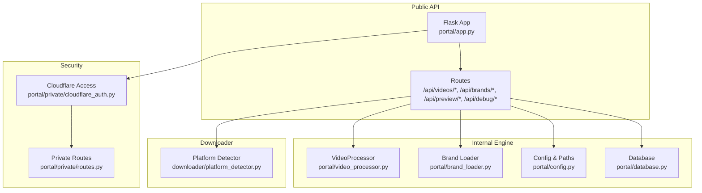
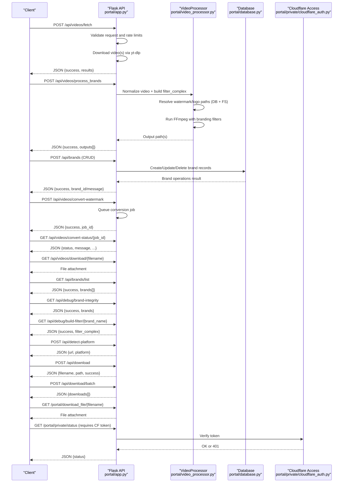
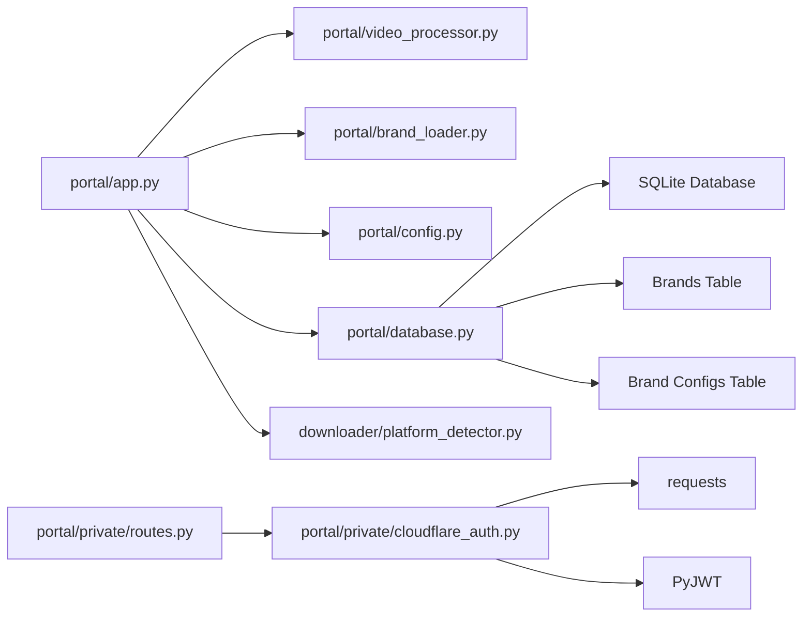
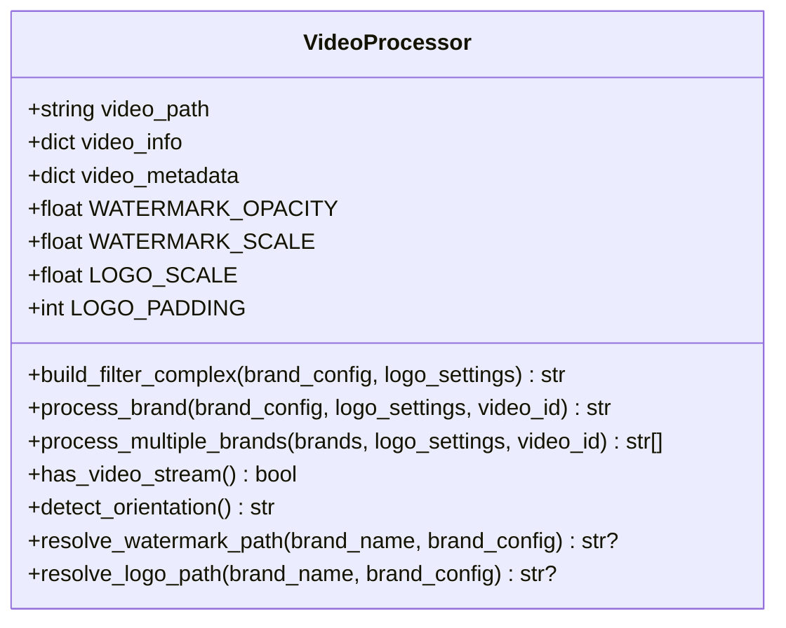

# API Reference

<cite>
**Referenced Files in This Document**
- [portal/app.py](file://portal/app.py)
- [portal/config.py](file://portal/config.py)
- [portal/database.py](file://portal/database.py)
- [portal/video_processor.py](file://portal/video_processor.py)
- [portal/brand_loader.py](file://portal/brand_loader.py)
- [portal/private/cloudflare_auth.py](file://portal/private/cloudflare_auth.py)
- [portal/private/routes.py](file://portal/private/routes.py)
- [downloader/platform_detector.py](file://downloader/platform_detector.py)
- [requirements.txt](file://requirements.txt)
</cite>

## Update Summary
**Changes Made**
- Added comprehensive brand management CRUD endpoints documentation
- Updated video processing endpoints to reflect database-driven asset resolution
- Enhanced brand configuration endpoints with new database-backed functionality
- Added detailed API documentation for unified brand management system
- Updated asset resolution logic to work with database-stored paths

## Table of Contents
1. [Introduction](#introduction)
2. [Project Structure](#project-structure)
3. [Core Components](#core-components)
4. [Architecture Overview](#architecture-overview)
5. [Detailed Component Analysis](#detailed-component-analysis)
6. [Dependency Analysis](#dependency-analysis)
7. [Performance Considerations](#performance-considerations)
8. [Troubleshooting Guide](#troubleshooting-guide)
9. [Conclusion](#conclusion)
10. [Appendices](#appendices)

## Introduction
This document provides comprehensive API documentation for WatchTheFall Orchestrator v3. It covers REST endpoints for platform detection, video download, brand processing, watermark conversion, previews, and debugging. It also documents internal interfaces used by the processing engine and web application components, including authentication, rate limiting considerations, security, and versioning information.

**Updated** Added comprehensive brand management CRUD endpoints including POST /api/brands, PUT /api/brands/<id>, DELETE /api/brands/<id>, and enhanced GET endpoints with database-driven asset resolution.

## Project Structure
The Orchestrator exposes a Flask-based API under the portal module. Key areas:
- Public API endpoints for video processing, downloading, brand listing, watermark conversion, previews, and debugging
- Private portal endpoints protected by Cloudflare Access
- Internal processing engine (VideoProcessor) and brand loader utilities
- Configuration and database modules with unified brand management

**Diagram sources**
- [portal/app.py](file://portal/app.py#L225-L290)
- [portal/video_processor.py](file://portal/video_processor.py#L71-L133)
- [portal/brand_loader.py](file://portal/brand_loader.py#L48-L59)
- [portal/config.py](file://portal/config.py#L6-L42)
- [portal/database.py](file://portal/database.py#L9-L69)
- [downloader/platform_detector.py](file://downloader/platform_detector.py#L12-L41)
- [portal/private/cloudflare_auth.py](file://portal/private/cloudflare_auth.py#L42-L64)
- [portal/private/routes.py](file://portal/private/routes.py#L10-L29)

**Section sources**
- [portal/app.py](file://portal/app.py#L225-L290)
- [portal/config.py](file://portal/config.py#L6-L42)

## Core Components
- Flask application with route handlers for public and private endpoints
- VideoProcessor class for watermarking and branding via FFmpeg with database-driven asset resolution
- Brand loader utilities for brand configuration retrieval
- Cloudflare Access middleware for private endpoints
- SQLite-backed logging and job tracking with unified brand management
- Database-driven brand configuration system with CRUD operations

**Section sources**
- [portal/app.py](file://portal/app.py#L32-L41)
- [portal/video_processor.py](file://portal/video_processor.py#L71-L133)
- [portal/brand_loader.py](file://portal/brand_loader.py#L48-L59)
- [portal/private/cloudflare_auth.py](file://portal/private/cloudflare_auth.py#L42-L64)
- [portal/database.py](file://portal/database.py#L9-L69)

## Architecture Overview
High-level API flow:
- Clients call public endpoints to fetch videos, process brands, convert watermarks, and download outputs
- Private endpoints require Cloudflare Access JWT in the Cf-Access-Jwt-Assertion header
- Internal processing leverages VideoProcessor and FFmpeg for watermarking and branding with database-driven asset resolution
- Brand assets are resolved from database-stored paths or master directories based on orientation
- Unified brand management system provides CRUD operations for brand configurations

**Diagram sources**
- [portal/app.py](file://portal/app.py#L609-L784)
- [portal/app.py](file://portal/app.py#L329-L608)
- [portal/app.py](file://portal/app.py#L980-L1190)
- [portal/app.py](file://portal/app.py#L1263-L1353)
- [portal/video_processor.py](file://portal/video_processor.py#L228-L314)
- [portal/private/cloudflare_auth.py](file://portal/private/cloudflare_auth.py#L42-L64)

## Detailed Component Analysis

### Public API Endpoints

#### Root and Health
- GET /
  - Description: API root listing endpoints
  - Response: JSON with message and endpoints array
  - Notes: Includes both legacy and current endpoints

- GET /__debug_alive
  - Description: Health check endpoint
  - Response: "alive", 200

- GET /__debug_routes
  - Description: Lists all registered routes
  - Response: JSON {status, routes[]}

- GET /__debug_env
  - Description: Exposes environment variables (sensitive values hidden)
  - Response: JSON {status, environment{}}

- GET /__debug_ffmpeg
  - Description: FFmpeg/FFprobe availability and version
  - Response: JSON {status, ffmpeg{binaries, exists, version}}

- GET /__debug_storage
  - Description: Directory health checks and writability
  - Response: JSON {status, storage{}}

- GET /__debug_brands
  - Description: Available brands metadata
  - Response: JSON {status, brands[], count}

- GET /__debug_health
  - Description: Storage health checks for upload/output/temp
  - Response: JSON {status, checks{}}

**Section sources**
- [portal/app.py](file://portal/app.py#L55-L214)

#### Video Fetch and Download
- POST /api/videos/fetch
  - Description: Download videos from URLs (up to 5 per request)
  - Request JSON: { urls: ["url1","url2",...] }
  - Response JSON: {success, total, successful, results[]}
  - Results item fields: {url, filename, local_path, download_url, size_mb, success}
  - Errors: 400 invalid input, 400 max 5 URLs, 500 on failure
  - Notes: Uses yt-dlp with enhanced Instagram headers and optional cookies

- GET /api/videos/download/{filename}
  - Description: Download processed video
  - Response: File attachment with appropriate headers
  - Errors: 404 if file not found

- POST /api/download
  - Description: Single video download via downloader module
  - Request JSON: { url }
  - Response JSON: {filename, path, success, ...}

- POST /api/download/batch
  - Description: Batch download via downloader module
  - Request JSON: { urls: [...] }
  - Response JSON: {downloads[]}

- GET /portal/download_file/{filename}
  - Description: Serve files from storage/raw or portal/outputs
  - Response: File attachment or JSON {success:false, error, searched[]}

**Section sources**
- [portal/app.py](file://portal/app.py#L609-L784)
- [portal/app.py](file://portal/app.py#L790-L834)
- [portal/app.py](file://portal/app.py#L1280-L1315)
- [portal/app.py](file://portal/app.py#L1299-L1315)
- [portal/app.py](file://portal/app.py#L1318-L1353)

#### Brand Processing
- POST /api/videos/process_brands
  - Description: Process video with selected brands (watermark + logo)
  - Request JSON:
    - url or source_path (one required)
    - brands: ["brandA","brandB",...]
    - Optional overrides: watermark_scale, watermark_opacity, logo_scale, logo_padding
  - Response JSON: {success, message, outputs[]}
  - Outputs item fields: {brand, filename, download_url}
  - Errors: 400 missing URL/source_path or brands, 400 audio-only video, 500 on failure
  - Notes: Normalizes video to 8-bit H264 SDR, applies branding sequentially with database-driven asset resolution

**Section sources**
- [portal/app.py](file://portal/app.py#L329-L608)
- [portal/video_processor.py](file://portal/video_processor.py#L228-L314)

#### Preview Endpoints
- POST /api/preview/extract-frame
  - Description: Extract first frame for canvas preview
  - Request JSON: { filename }
  - Response JSON: {success, frame_data, width, height, aspect_ratio}
  - Errors: 400 missing filename, 404 file not found, 500 on failure

- GET /api/preview/watermark/{brand_name}?orientation=...
  - Description: Serve watermark PNG for preview
  - Response: Image file or 404

- GET /api/preview/logo/{brand_name}
  - Description: Serve logo PNG for preview
  - Response: Image file or 404

**Section sources**
- [portal/app.py](file://portal/app.py#L841-L953)

#### Brands
- GET /api/brands/list
  - Description: List available brands
  - Response JSON: {success, brands[]}
  - Notes: brands[] items include name and display_name

**Section sources**
- [portal/app.py](file://portal/app.py#L958-L974)

#### Unified Brand Management CRUD
- GET /api/brands
  - Description: Get all brands with filtering options
  - Query Parameters: user_id (optional), include_system (boolean, default true)
  - Response JSON: {success, brands[], count}

- GET /api/brands/<int:brand_id>
  - Description: Get a single brand by ID
  - Response JSON: {success, brand}
  - Errors: 404 if brand not found

- POST /api/brands
  - Description: Create a new brand
  - Request JSON: { name, display_name, user_id, is_system, is_locked, watermark_vertical, watermark_square, watermark_landscape, logo_path, watermark_scale, watermark_opacity, logo_scale, logo_padding, text_enabled, text_content, text_position, text_size, text_color, text_font, text_bg_enabled, text_bg_color, text_bg_opacity, text_margin }
  - Response JSON: {success, brand_id, message}
  - Errors: 400 if name is required, 500 on failure

- PUT /api/brands/<int:brand_id>
  - Description: Update a brand's settings and/or assets
  - Request JSON: { name, display_name, is_active, is_locked, watermark_vertical, watermark_square, watermark_landscape, logo_path, watermark_scale, watermark_opacity, logo_scale, logo_padding, text_enabled, text_content, text_position, text_size, text_color, text_font, text_bg_enabled, text_bg_color, text_bg_opacity, text_margin }
  - Response JSON: {success, message}
  - Errors: 404 if brand not found, 403 if brand is locked, 500 on failure

- DELETE /api/brands/<int:brand_id>
  - Description: Soft delete a brand (set is_active = 0)
  - Response JSON: {success, message}
  - Errors: 404 if brand not found, 403 if brand is system brand, 500 on failure

**Section sources**
- [portal/app.py](file://portal/app.py#L1057-L1202)
- [portal/database.py](file://portal/database.py#L389-L525)

#### Brand Configuration Management
- GET /api/brands/<brand_name>/config
  - Description: Get saved configuration for a brand
  - Response JSON: {success, config}
  - Notes: Returns database-stored configuration or defaults

- POST /api/brands/<brand_name>/config
  - Description: Save configuration for a brand
  - Request JSON: { watermark_scale, watermark_opacity, logo_scale, logo_padding, text_enabled, text_content, text_position, text_size, text_color, text_font, text_bg_enabled, text_bg_color, text_bg_opacity, text_margin }
  - Response JSON: {success, message, config}
  - Notes: Persists configuration to database for brand-specific settings

**Section sources**
- [portal/app.py](file://portal/app.py#L995-L1051)
- [portal/database.py](file://portal/database.py#L265-L374)

#### Watermark Conversion (WebM to MP4)
- POST /api/videos/convert-watermark
  - Description: Queue a non-blocking conversion job
  - Request: multipart/form-data with field "video" (WebM)
  - Response JSON: {success, job_id, status, filename, message}
  - Errors: 400 missing file or empty filename, 500 on exception

- GET /api/videos/convert-status/{job_id}
  - Description: Poll conversion status
  - Response JSON: {job_id, status, filename, message, download_url,size_mb,conversion_time} (on completed)
  - Response JSON: {job_id, status, filename, message, error, stderr_preview, exit_code} (on failed)
  - Errors: 404 if job not found

**Section sources**
- [portal/app.py](file://portal/app.py#L980-L1190)

#### Debugging
- GET /api/debug/brand-integrity
  - Description: Check presence of brand assets (template, logo, watermark)
  - Response JSON: {success, brands{}}

- GET /api/debug/build-filter/{brand_name}
  - Description: Dry-run FFmpeg filter generation for a brand
  - Response JSON: {success, brand, filter_complex}
  - Errors: 404 if brand not found

**Section sources**
- [portal/app.py](file://portal/app.py#L1197-L1256)

#### Platform Detection
- POST /api/detect-platform
  - Description: Detect platform from URL
  - Request JSON: { url }
  - Response JSON: {url, platform} where platform ∈ {"tiktok","instagram","twitter","youtube","unknown"}
  - Errors: 400 if URL missing, 500 on exception

**Section sources**
- [portal/app.py](file://portal/app.py#L1263-L1277)
- [downloader/platform_detector.py](file://downloader/platform_detector.py#L12-L41)

### Private Portal Endpoints (Cloudflare Access Required)
- Header: Cf-Access-Jwt-Assertion
- GET /portal/private/test
  - Response JSON: {status, message, protected:true}

- GET /portal/private/status
  - Response JSON: {status, service, protection, access}

**Section sources**
- [portal/private/cloudflare_auth.py](file://portal/private/cloudflare_auth.py#L42-L64)
- [portal/private/routes.py](file://portal/private/routes.py#L10-L29)

## Dependency Analysis
Key internal dependencies:
- portal/app.py depends on portal/video_processor.py, portal/brand_loader.py, portal/config.py, portal/database.py
- portal/video_processor.py depends on FFmpeg binaries and master assets directories with database-driven asset resolution
- portal/private/cloudflare_auth.py depends on PyJWT and requests to validate Cloudflare Access tokens
- Downloader endpoints depend on async functions in the downloader module
- Database module provides unified brand management with CRUD operations and configuration persistence

**Diagram sources**
- [portal/app.py](file://portal/app.py#L32-L41)
- [portal/video_processor.py](file://portal/video_processor.py#L11-L18)
- [portal/private/cloudflare_auth.py](file://portal/private/cloudflare_auth.py#L4-L8)
- [requirements.txt](file://requirements.txt#L1-L18)

**Section sources**
- [portal/app.py](file://portal/app.py#L32-L41)
- [portal/video_processor.py](file://portal/video_processor.py#L11-L18)
- [portal/private/cloudflare_auth.py](file://portal/private/cloudflare_auth.py#L4-L8)
- [requirements.txt](file://requirements.txt#L1-L18)

## Performance Considerations
- FFmpeg optimizations:
  - Render free tier tuning: reduced probesize, ultrafast preset, baseline profile, yuv420p, faststart, lower audio bitrate
  - Threads and buffer tuned for constrained environments
- Concurrency:
  - Sequential download in fetch endpoint to limit memory usage
  - Conversion runs in background thread with timeout
- Rate limiting:
  - Maximum 5 URLs per fetch request enforced
  - Single conversion at a time via global lock and in-memory job registry
- Storage:
  - Health checks for writable directories
  - Cleanup policies for temp files
- Database performance:
  - SQLite optimization for brand queries and configuration lookups
  - Efficient asset path resolution with database-first approach

**Section sources**
- [portal/app.py](file://portal/app.py#L622-L623)
- [portal/app.py](file://portal/app.py#L1059-L1093)
- [portal/app.py](file://portal/app.py#L216-L218)

## Troubleshooting Guide
Common errors and resolutions:
- 400 Bad Request
  - Missing input fields (e.g., url, brands, filename, name)
  - Too many URLs (>5) in fetch
  - Missing required fields in brand creation/update
- 401 Unauthorized
  - Missing or invalid Cf-Access-Jwt-Assertion header for private endpoints
- 403 Forbidden
  - Attempting to modify locked system brands
  - Attempting to delete system brands
- 404 Not Found
  - File not found for download endpoints
  - Brand assets not found when building filter
  - Brand not found in database operations
- 500 Internal Server Error
  - Exceptions during processing, conversion, or FFmpeg execution
  - Database operation failures
- Debug endpoints:
  - Use /__debug_* endpoints to inspect environment, storage, and FFmpeg configuration
  - Use /api/debug/brand-integrity to verify assets
  - Use /api/debug/build-filter/{brand} to validate filter generation

Operational tips:
- Ensure FFmpeg/FFprobe are installed and discoverable
- Confirm brand assets exist in master directories or database paths
- Validate Cloudflare Access configuration (team domain and audience)
- Check database connectivity and brand table structure

**Section sources**
- [portal/app.py](file://portal/app.py#L55-L214)
- [portal/app.py](file://portal/app.py#L1197-L1256)
- [portal/private/cloudflare_auth.py](file://portal/private/cloudflare_auth.py#L18-L22)

## Conclusion
WatchTheFall Orchestrator v3 exposes a focused set of REST endpoints for fetching, processing, converting, and downloading branded videos, along with preview and debugging utilities. Private endpoints are protected by Cloudflare Access. The internal processing engine relies on VideoProcessor and FFmpeg to apply watermarks and logos efficiently with database-driven asset resolution, with safeguards for constrained environments. The unified brand management system provides comprehensive CRUD operations for brand configurations and assets.

## Appendices

### Authentication and Security
- Private endpoints require header: Cf-Access-Jwt-Assertion
- Token verification uses RS256 against Cloudflare certs
- Environment variables:
  - CF_TEAM_DOMAIN, CF_AUDIENCE (required in production)
  - SECRET_KEY, PORTAL_AUTH_KEY (used by Flask and portal)
- Recommendations:
  - Rotate secrets regularly
  - Restrict Cloudflare Access policies to trusted users
  - Monitor logs via database tables

**Section sources**
- [portal/private/cloudflare_auth.py](file://portal/private/cloudflare_auth.py#L10-L40)
- [portal/config.py](file://portal/config.py#L30-L36)
- [portal/database.py](file://portal/database.py#L15-L65)

### Rate Limiting and Quotas
- Fetch endpoint: maximum 5 URLs per request
- Conversion: single job at a time with background thread and timeout
- Upload size: 500 MB maximum enforced by Flask
- Brand operations: no explicit rate limiting, but database operations are atomic

**Section sources**
- [portal/app.py](file://portal/app.py#L622-L623)
- [portal/app.py](file://portal/app.py#L984-L990)
- [portal/config.py](file://portal/config.py#L35-L36)

### Versioning Information
- API stability:
  - Endpoints documented here represent the current stable surface
  - No explicit version path/version header is used
  - Backward-compatible additions encouraged; breaking changes will be introduced in new routes
- Database schema:
  - Brand management tables support versioning through unique constraints and timestamps
  - Configuration persistence allows for gradual feature adoption

### Practical Examples and Client Implementation Guidelines
- Example: Fetch videos
  - Method: POST /api/videos/fetch
  - Body: { "urls": ["https://...","https://..."] }
  - Handle: success flag, iterate results, use download_url to retrieve files
- Example: Process brands
  - Method: POST /api/videos/process_brands
  - Body: { "url": "...", "brands": ["BrandA","BrandB"], "watermark_scale":1.15 }
  - Handle: outputs[] with download_url entries
- Example: Manage brands (CRUD)
  - Create: POST /api/brands with brand definition
  - Update: PUT /api/brands/{id} with configuration changes
  - Delete: DELETE /api/brands/{id} soft deletes brand
  - List: GET /api/brands?user_id=123&include_system=true
- Example: Convert watermark
  - Method: POST /api/videos/convert-watermark (multipart)
  - Body: form field "video" (WebM)
  - Poll: GET /api/videos/convert-status/{job_id}
- Example: Private portal
  - Method: GET /portal/private/status
  - Header: Cf-Access-Jwt-Assertion: <token>
  - Handle: 200 online or 401 unauthorized

**Section sources**
- [portal/app.py](file://portal/app.py#L609-L784)
- [portal/app.py](file://portal/app.py#L329-L608)
- [portal/app.py](file://portal/app.py#L980-L1190)
- [portal/app.py](file://portal/app.py#L1057-L1202)
- [portal/private/routes.py](file://portal/private/routes.py#L20-L29)

### Internal Interfaces

#### VideoProcessor
- Methods:
  - build_filter_complex(brand_config, logo_settings=None) -> str
  - process_brand(brand_config, logo_settings=None, video_id='video') -> str
  - process_multiple_brands(brands, logo_settings=None, video_id='video') -> List[str]
  - has_video_stream() -> bool
  - detect_orientation() -> str
  - resolve_watermark_path(brand_name, brand_config=None) -> Optional[str]
  - resolve_logo_path(brand_name, brand_config=None) -> Optional[str]
- Fields:
  - WATERMARK_OPACITY, WATERMARK_SCALE, LOGO_SCALE, LOGO_PADDING
  - MASTER_ASSETS_ROOT, WATERMARKS_DIR, LOGOS_DIR

**Updated** Enhanced asset resolution to prioritize database-stored paths over filesystem paths with fallback to master assets.

**Diagram sources**
- [portal/video_processor.py](file://portal/video_processor.py#L71-L133)
- [portal/video_processor.py](file://portal/video_processor.py#L228-L434)

**Section sources**
- [portal/video_processor.py](file://portal/video_processor.py#L71-L133)
- [portal/video_processor.py](file://portal/video_processor.py#L228-L434)

#### Brand Loader
- Functions:
  - load_brand_configs(config_path) -> List[Dict]
  - get_available_brands(portal_dir) -> List[Dict]

**Section sources**
- [portal/brand_loader.py](file://portal/brand_loader.py#L9-L59)

#### Configuration
- Paths and settings:
  - UPLOAD_DIR, OUTPUT_DIR, TEMP_DIR, LOG_DIR, DB_PATH
  - BRANDS_DIR, TEMPLATE_DIR
  - FFMPEG_BIN, FFPROBE_BIN
  - SECRET_KEY, PORTAL_AUTH_KEY
  - MAX_UPLOAD_SIZE, ALLOWED_EXTENSIONS

**Section sources**
- [portal/config.py](file://portal/config.py#L6-L42)

#### Database Models
- Tables:
  - jobs: id, job_id, status, video_filename, template, aspect_ratio, output_path, created_at, started_at, completed_at, error_message, metadata
  - logs: id, timestamp, level, job_id, message, details
  - queue: id, job_id, priority, added_at, processing
  - brand_configs: id, brand_name, user_id, watermark_scale, watermark_opacity, logo_scale, logo_padding, text_enabled, text_content, text_position, text_size, text_color, text_font, text_bg_enabled, text_bg_color, text_bg_opacity, text_margin, created_at, updated_at
  - brands: id, name, display_name, user_id, is_system, is_locked, is_active, watermark_vertical, watermark_square, watermark_landscape, logo_path, watermark_scale, watermark_opacity, logo_scale, logo_padding, text_enabled, text_content, text_position, text_size, text_color, text_font, text_bg_enabled, text_bg_color, text_bg_opacity, text_margin, created_at, updated_at
- Functions:
  - init_db(), get_db(), create_job(), update_job_status(), get_job(), get_recent_jobs(), log_event(), get_recent_logs(), get_next_queued_job(), remove_from_queue()
  - get_brand_config(), save_brand_config(), get_all_brand_configs()
  - get_brand(), get_all_brands(), create_brand(), update_brand(), delete_brand(), seed_system_brands()

**Updated** Added unified brand management with CRUD operations and configuration persistence.

**Section sources**
- [portal/database.py](file://portal/database.py#L9-L69)
- [portal/database.py](file://portal/database.py#L77-L133)
- [portal/database.py](file://portal/database.py#L152-L201)
- [portal/database.py](file://portal/database.py#L265-L374)
- [portal/database.py](file://portal/database.py#L389-L525)