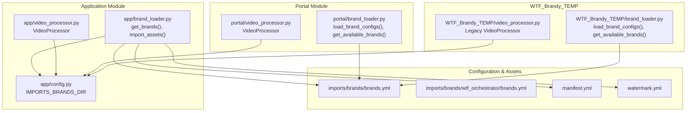
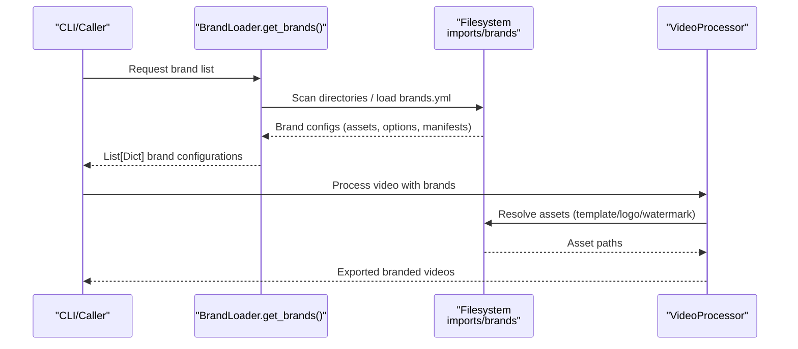
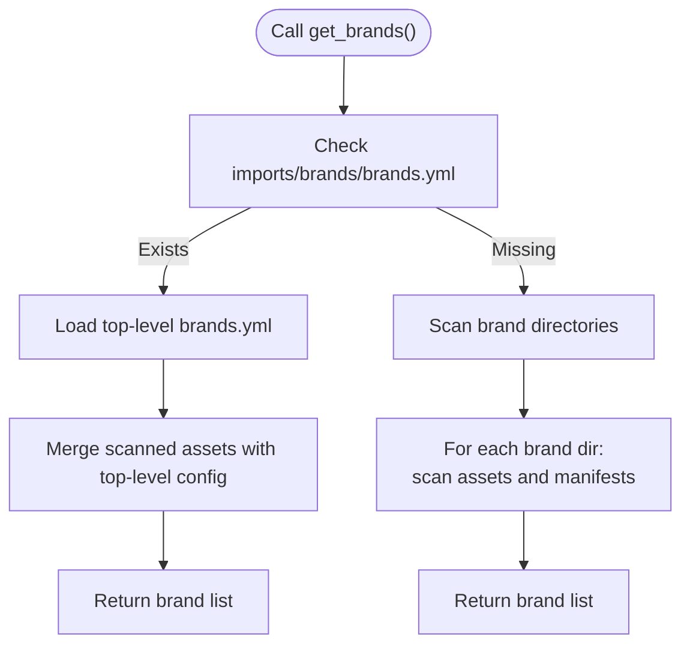
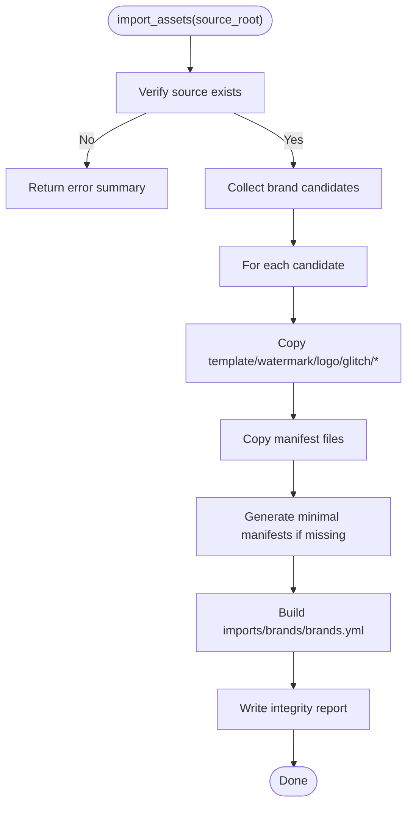
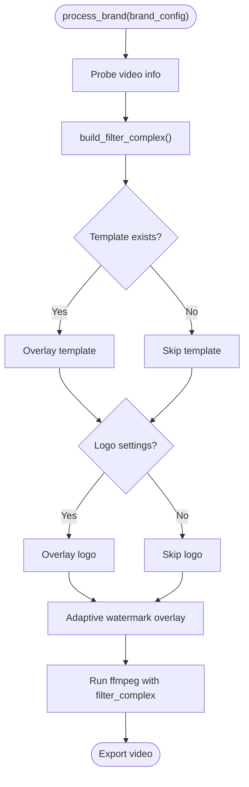
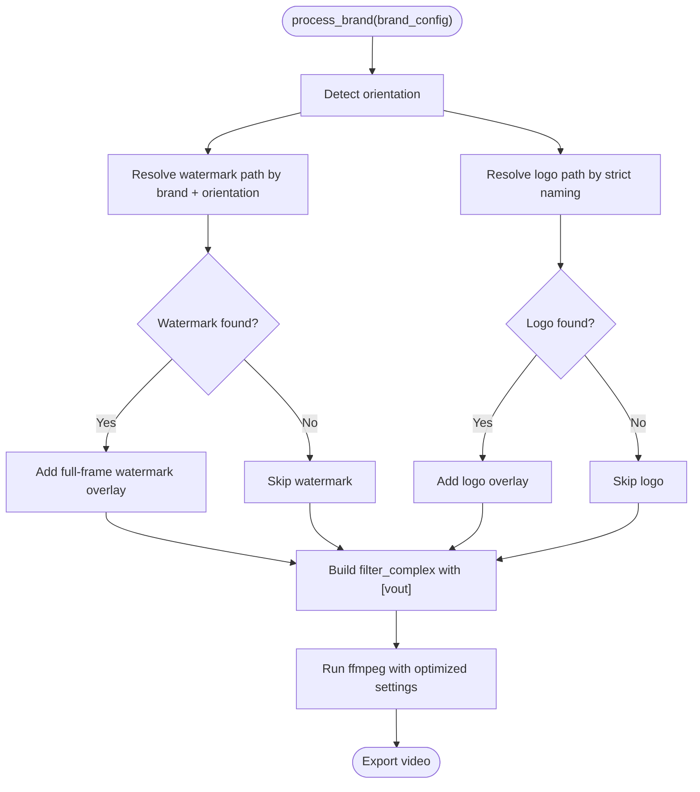
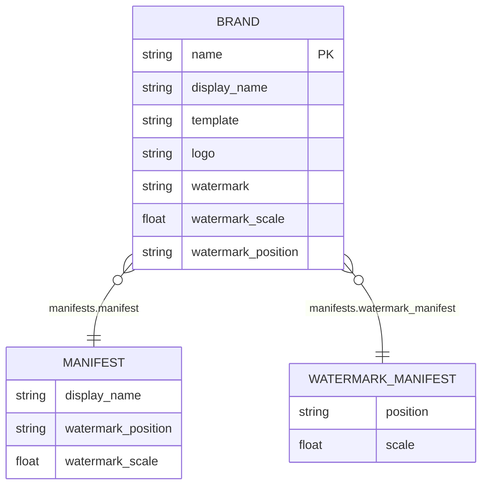
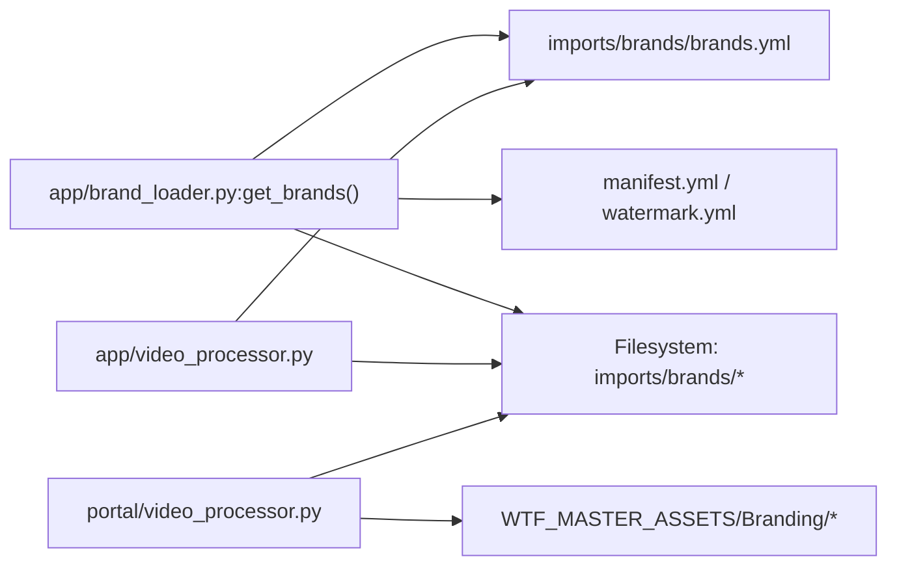

# BrandLoader Interface

<cite>
**Referenced Files in This Document**
- [brand_loader.py](file://app/brand_loader.py)
- [brand_loader.py](file://portal/brand_loader.py)
- [brand_loader.py](file://WTF_Brandy_TEMP/brand_loader.py)
- [video_processor.py](file://app/video_processor.py)
- [video_processor.py](file://portal/video_processor.py)
- [video_processor.py](file://WTF_Brandy_TEMP/video_processor.py)
- [config.py](file://app/config.py)
- [brands.yml](file://imports/brands/brands.yml)
- [brands.yml](file://imports/brands/wtf_orchestrator/brands.yml)
- [brands.yml](file://WTF_Brandy_TEMP/wtf_brands/wtf_orchestrator/brands.yml)
- [manifest.yml](file://imports/brands/wtf_orchestrator/manifest.yml)
- [watermark.yml](file://imports/brands/wtf_orchestrator/watermark.yml)
</cite>

## Table of Contents
1. [Introduction](#introduction)
2. [Project Structure](#project-structure)
3. [Core Components](#core-components)
4. [Architecture Overview](#architecture-overview)
5. [Detailed Component Analysis](#detailed-component-analysis)
6. [Dependency Analysis](#dependency-analysis)
7. [Performance Considerations](#performance-considerations)
8. [Troubleshooting Guide](#troubleshooting-guide)
9. [Conclusion](#conclusion)

## Introduction
This document describes the BrandLoader’s internal APIs and the brand configuration management system used to drive video processing workflows. It focuses on:
- The get_brands() function interface and discovery mechanisms
- YAML-based configuration parsing and asset resolution
- Brand asset management (logo paths, watermark configurations, template settings)
- Platform-specific requirements and orientation-aware asset selection
- Brand filtering logic, configuration validation, and fallback mechanisms
- Examples of configuration formats, asset organization patterns, and integration with the processing pipeline

## Project Structure
The BrandLoader system spans two primary modules:
- Application BrandLoader: scans and normalizes brand assets, generates manifests, and builds brand configurations
- Portal BrandLoader: loads legacy JSON-based brand configurations for the portal UI

**Diagram sources**
- [brand_loader.py](file://app/brand_loader.py#L168-L183)
- [brand_loader.py](file://portal/brand_loader.py#L9-L59)
- [brand_loader.py](file://WTF_Brandy_TEMP/brand_loader.py#L9-L59)
- [video_processor.py](file://app/video_processor.py#L13-L273)
- [video_processor.py](file://portal/video_processor.py#L71-L454)
- [video_processor.py](file://WTF_Brandy_TEMP/video_processor.py#L62-L425)
- [config.py](file://app/config.py#L7-L17)
- [brands.yml](file://imports/brands/brands.yml#L1-L255)
- [brands.yml](file://imports/brands/wtf_orchestrator/brands.yml#L1-L423)
- [manifest.yml](file://imports/brands/wtf_orchestrator/manifest.yml#L1-L4)
- [watermark.yml](file://imports/brands/wtf_orchestrator/watermark.yml#L1-L3)

**Section sources**
- [brand_loader.py](file://app/brand_loader.py#L1-L499)
- [brand_loader.py](file://portal/brand_loader.py#L1-L59)
- [brand_loader.py](file://WTF_Brandy_TEMP/brand_loader.py#L1-L59)
- [video_processor.py](file://app/video_processor.py#L1-L273)
- [video_processor.py](file://portal/video_processor.py#L1-L500)
- [video_processor.py](file://WTF_Brandy_TEMP/video_processor.py#L1-L471)
- [config.py](file://app/config.py#L1-L18)
- [brands.yml](file://imports/brands/brands.yml#L1-L255)
- [brands.yml](file://imports/brands/wtf_orchestrator/brands.yml#L1-L423)
- [manifest.yml](file://imports/brands/wtf_orchestrator/manifest.yml#L1-L4)
- [watermark.yml](file://imports/brands/wtf_orchestrator/watermark.yml#L1-L3)

## Core Components
- BrandLoader.get_brands(): Discovers brand directories under imports/brands and constructs brand configurations with assets, options, and manifests. Alternatively, loads a top-level brands.yml to override or define assets centrally.
- BrandLoader.import_assets(): Scans source directories, copies brand assets, generates minimal manifests, and writes a consolidated brands.yml.
- VideoProcessor: Applies brand overlays (template/logo/watermark) to videos. Two variants exist:
  - Application VideoProcessor: Uses centralized assets from imports/brands and applies adaptive watermark opacity.
  - Portal VideoProcessor: Resolves assets from WTF_MASTER_ASSETS/Branding based on orientation and applies full-frame watermark plus logo.
- Configuration files:
  - imports/brands/brands.yml: Central brand registry with display_name, assets, and options.
  - imports/brands/wtf_orchestrator/brands.yml: Extended brand metadata (hashtags, cadence, watermark opacity, etc.).
  - manifest.yml and watermark.yml: Optional per-brand manifests for watermark position/scale and display_name.

Key behaviors:
- Asset discovery via filename conventions (*template.png, *watermark.png, *logo.png)
- Manifest merging: watermark.yml and manifest.yml override defaults
- Fallbacks: default watermark position/scale if manifests absent
- Orientation-aware asset selection in portal processor

**Section sources**
- [brand_loader.py](file://app/brand_loader.py#L168-L183)
- [brand_loader.py](file://app/brand_loader.py#L344-L491)
- [video_processor.py](file://app/video_processor.py#L109-L178)
- [video_processor.py](file://portal/video_processor.py#L173-L227)
- [brands.yml](file://imports/brands/brands.yml#L1-L255)
- [brands.yml](file://imports/brands/wtf_orchestrator/brands.yml#L1-L423)
- [manifest.yml](file://imports/brands/wtf_orchestrator/manifest.yml#L1-L4)
- [watermark.yml](file://imports/brands/wtf_orchestrator/watermark.yml#L1-L3)

## Architecture Overview
The BrandLoader integrates with the video processing pipeline to apply brand overlays consistently across multiple brands and platforms.

**Diagram sources**
- [brand_loader.py](file://app/brand_loader.py#L168-L183)
- [video_processor.py](file://app/video_processor.py#L180-L253)

## Detailed Component Analysis

### BrandLoader.get_brands()
Purpose:
- Return a list of brand configurations for the processing pipeline.

Discovery logic:
- If imports/brands/brands.yml exists, load it and merge with discovered assets.
- Otherwise, iterate brand directories and scan for assets and manifests.

Asset discovery:
- Files matched by patterns: *template.png, *watermark.png, *logo.png
- Manifests considered: manifest.yml, watermark.yml, orientation.yml, routing.yml, platforms.yml

Options precedence:
- watermark.yml and manifest.yml provide position and scale
- Defaults: bottom-right position, 0.25 scale

**Diagram sources**
- [brand_loader.py](file://app/brand_loader.py#L131-L166)
- [brand_loader.py](file://app/brand_loader.py#L177-L183)
- [brand_loader.py](file://app/brand_loader.py#L35-L129)

**Section sources**
- [brand_loader.py](file://app/brand_loader.py#L168-L183)
- [brand_loader.py](file://app/brand_loader.py#L35-L129)
- [brand_loader.py](file://app/brand_loader.py#L131-L166)

### BrandLoader.import_assets()
Purpose:
- Bulk import brand assets from legacy sources, normalize names, and generate minimal manifests.

Key steps:
- Candidate detection: directories containing template/watermark/logo or YAML files
- Copy assets to imports/brands/{brand_slug}/
- Generate manifest.yml, watermark.yml, orientation.yml if missing
- Build imports/brands/brands.yml consolidating assets and options

Validation and reporting:
- Integrity report written to imports/brands/_integrity_report.txt
- Flags missing recommended assets and suspicious files

**Diagram sources**
- [brand_loader.py](file://app/brand_loader.py#L344-L491)

**Section sources**
- [brand_loader.py](file://app/brand_loader.py#L344-L491)

### VideoProcessor (Application)
Purpose:
- Apply brand overlays to videos using assets from imports/brands.

Pipeline:
- Template overlay (full-size)
- Optional logo overlay (positioned via settings)
- Adaptive watermark overlay (opacity based on video brightness)

Asset resolution:
- Templates/watermarks resolved from imports/brands/<relative_path>
- Options include watermark_position and watermark_scale

**Diagram sources**
- [video_processor.py](file://app/video_processor.py#L109-L178)
- [video_processor.py](file://app/video_processor.py#L180-L253)

**Section sources**
- [video_processor.py](file://app/video_processor.py#L13-L273)

### VideoProcessor (Portal)
Purpose:
- Resolve brand assets from WTF_MASTER_ASSETS/Branding based on orientation and platform.

Orientation-aware asset selection:
- Detects orientation (Landscape/Square/Vertical_HD)
- Selects watermark from WTF_MASTER_ASSETS/Branding/Watermarks/{orientation}/
- Selects logo from WTF_MASTER_ASSETS/Branding/Logos/Circle/

Full-frame watermark plus logo:
- Watermark scaled with oversampling and centered
- Logo positioned bottom-right with padding

**Diagram sources**
- [video_processor.py](file://portal/video_processor.py#L151-L227)
- [video_processor.py](file://portal/video_processor.py#L228-L313)
- [video_processor.py](file://portal/video_processor.py#L315-L404)

**Section sources**
- [video_processor.py](file://portal/video_processor.py#L71-L454)

### Configuration and Manifests
- imports/brands/brands.yml: Defines brand display_name, assets (template, logo, watermark), and options (watermark_position, watermark_scale).
- imports/brands/wtf_orchestrator/brands.yml: Extended brand metadata (hashtags, posting cadence, watermark opacity, watermark_position).
- manifest.yml: Optional display_name and watermark defaults.
- watermark.yml: Optional watermark position and scale.

**Diagram sources**
- [brands.yml](file://imports/brands/brands.yml#L6-L255)
- [brands.yml](file://imports/brands/wtf_orchestrator/brands.yml#L4-L423)
- [manifest.yml](file://imports/brands/wtf_orchestrator/manifest.yml#L1-L4)
- [watermark.yml](file://imports/brands/wtf_orchestrator/watermark.yml#L1-L3)

**Section sources**
- [brands.yml](file://imports/brands/brands.yml#L1-L255)
- [brands.yml](file://imports/brands/wtf_orchestrator/brands.yml#L1-L423)
- [manifest.yml](file://imports/brands/wtf_orchestrator/manifest.yml#L1-L4)
- [watermark.yml](file://imports/brands/wtf_orchestrator/watermark.yml#L1-L3)

## Dependency Analysis
- BrandLoader depends on filesystem scanning and YAML/JSON parsing.
- VideoProcessor depends on ffmpeg/ffprobe and asset paths resolved from configuration.
- Portal VideoProcessor additionally depends on orientation detection and master asset directories.

**Diagram sources**
- [brand_loader.py](file://app/brand_loader.py#L168-L183)
- [video_processor.py](file://app/video_processor.py#L13-L273)
- [video_processor.py](file://portal/video_processor.py#L71-L454)

**Section sources**
- [brand_loader.py](file://app/brand_loader.py#L1-L499)
- [video_processor.py](file://app/video_processor.py#L1-L273)
- [video_processor.py](file://portal/video_processor.py#L1-L500)

## Performance Considerations
- Adaptive watermark opacity calculation involves extracting a frame; cache or skip if unnecessary.
- Scaling and overlay operations can be expensive; consider reducing input resolution for long videos.
- Use optimized ffmpeg settings (threads, buffers) as implemented in portal processor.
- Consolidate brands.yml to minimize filesystem reads during batch processing.

## Troubleshooting Guide
Common issues and resolutions:
- Missing assets
  - Symptom: No template/watermark/logo applied.
  - Resolution: Ensure *template.png, *watermark.png, *logo.png exist or provide absolute paths in imports/brands/brands.yml.
- Incorrect watermark position/scale
  - Symptom: Watermark appears off-screen or too large/small.
  - Resolution: Define watermark.yml or manifest.yml with position and scale; defaults are bottom-right and 0.25.
- Orientation mismatch
  - Symptom: Watermark/logo misaligned on vertical videos.
  - Resolution: Use portal VideoProcessor which detects orientation and selects appropriate assets.
- No video stream
  - Symptom: Error indicating audio-only input.
  - Resolution: Normalize video or ensure input contains a valid video stream.
- Intermittent failures
  - Symptom: FFmpeg errors during overlay composition.
  - Resolution: Verify [vout] label presence in filter_complex; ensure only one [vout] exists.

**Section sources**
- [video_processor.py](file://portal/video_processor.py#L134-L150)
- [video_processor.py](file://portal/video_processor.py#L350-L367)
- [video_processor.py](file://app/video_processor.py#L92-L107)
- [brand_loader.py](file://app/brand_loader.py#L437-L491)

## Conclusion
The BrandLoader system provides a robust, YAML-driven mechanism to manage brand configurations and assets, integrating seamlessly with two distinct video processors:
- Application VideoProcessor for flexible, configurable overlays with adaptive opacity
- Portal VideoProcessor for orientation-aware, full-frame watermarking with strict asset naming

By centralizing brand definitions in imports/brands/brands.yml and generating minimal manifests, teams can efficiently onboard new brands, validate asset coverage, and produce consistent branded videos across platforms.