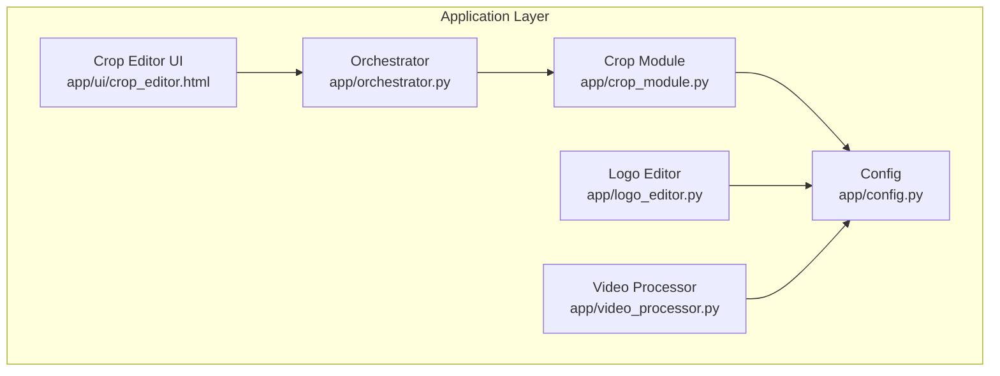
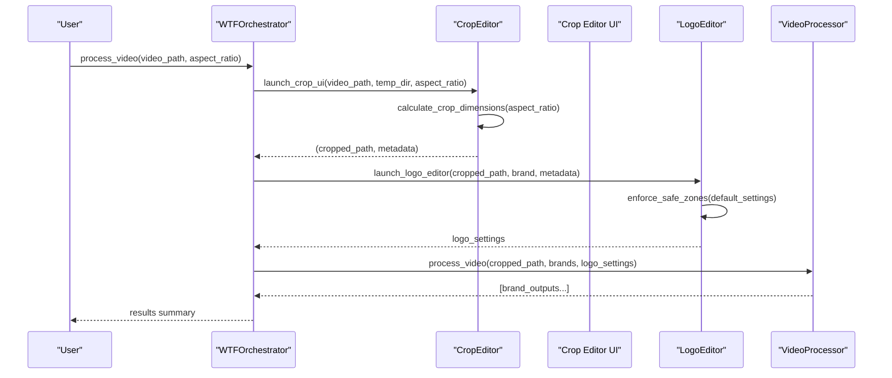
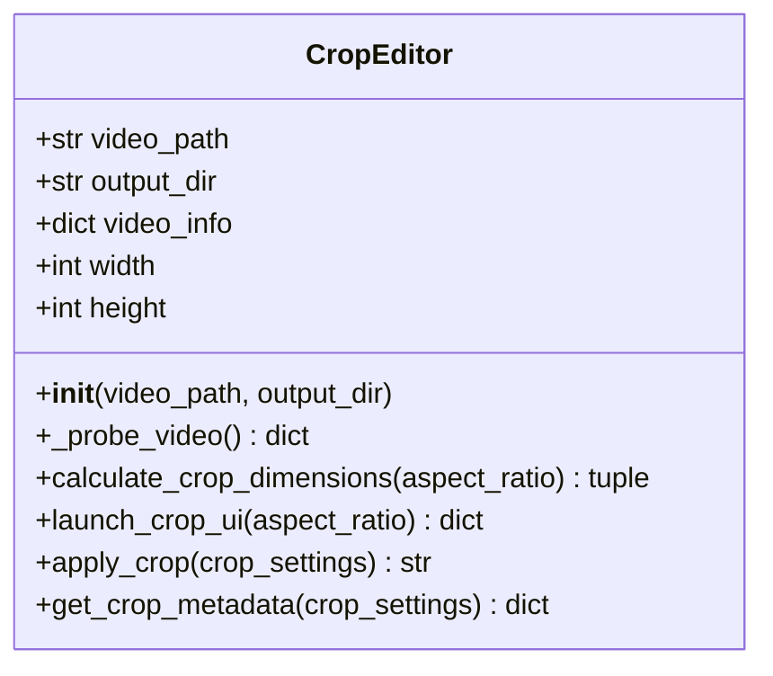
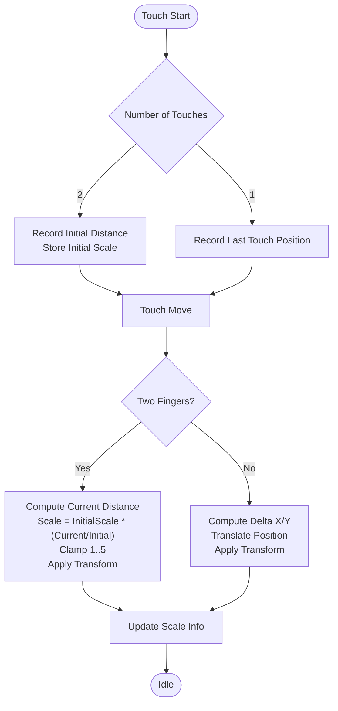
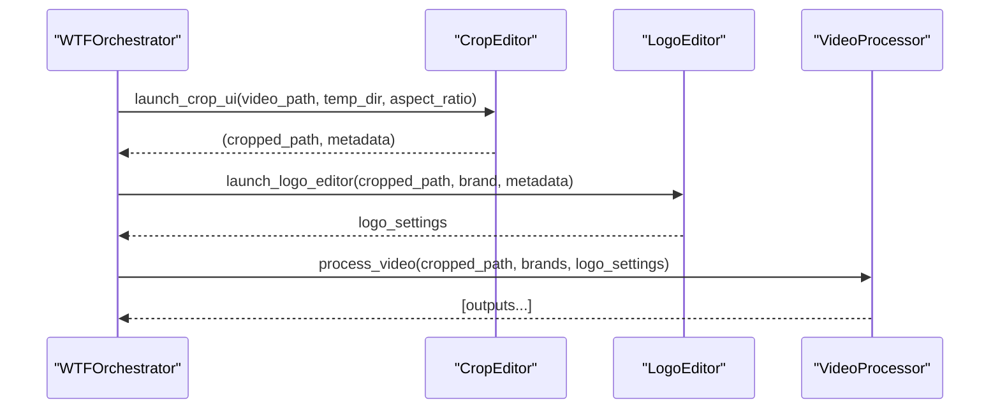
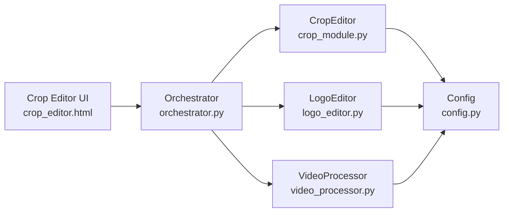

# CropModule Interface

<cite>
**Referenced Files in This Document**
- [crop_module.py](file://app/crop_module.py)
- [crop_editor.html](file://app/ui/crop_editor.html)
- [logo_editor.py](file://app/logo_editor.py)
- [video_processor.py](file://app/video_processor.py)
- [orchestrator.py](file://app/orchestrator.py)
- [config.py](file://app/config.py)
</cite>

## Table of Contents
1. [Introduction](#introduction)
2. [Project Structure](#project-structure)
3. [Core Components](#core-components)
4. [Architecture Overview](#architecture-overview)
5. [Detailed Component Analysis](#detailed-component-analysis)
6. [Dependency Analysis](#dependency-analysis)
7. [Performance Considerations](#performance-considerations)
8. [Troubleshooting Guide](#troubleshooting-guide)
9. [Conclusion](#conclusion)

## Introduction
This document describes the CropModule’s internal APIs and interactive cropping functionality. It focuses on the launch_crop_ui() function interface, parameter specifications, coordinate calculation algorithms, safe zone enforcement, rotation handling, and integration with the main processing pipeline. It also documents the mobile-optimized crop editing system including pinch-to-zoom gesture support, drag-and-drop positioning, and aspect ratio constraints.

## Project Structure
The CropModule resides in the application layer alongside UI assets and the orchestrator. The key files involved are:
- Crop module implementation and convenience API
- Web-based mobile crop editor UI
- Logo editor that enforces safe zones post-crop
- Video processor that applies overlays and watermarks
- Orchestrator that coordinates the end-to-end pipeline
- Global configuration for binary paths and directories

**Diagram sources**
- [crop_module.py](file://app/crop_module.py#L1-L193)
- [crop_editor.html](file://app/ui/crop_editor.html#L1-L261)
- [logo_editor.py](file://app/logo_editor.py#L1-L132)
- [video_processor.py](file://app/video_processor.py#L1-L273)
- [orchestrator.py](file://app/orchestrator.py#L1-L172)
- [config.py](file://app/config.py#L1-L18)

**Section sources**
- [crop_module.py](file://app/crop_module.py#L1-L193)
- [crop_editor.html](file://app/ui/crop_editor.html#L1-L261)
- [logo_editor.py](file://app/logo_editor.py#L1-L132)
- [video_processor.py](file://app/video_processor.py#L1-L273)
- [orchestrator.py](file://app/orchestrator.py#L1-L172)
- [config.py](file://app/config.py#L1-L18)

## Core Components
- CropEditor: Encapsulates video probing, crop dimension calculation, default crop generation, ffmpeg-based cropping, and metadata extraction.
- launch_crop_ui(): Convenience function that wires up CropEditor, launches the crop UI, applies the crop, and returns the cropped path plus metadata.
- Crop Editor UI: Mobile-first HTML/JS interface with pinch-to-zoom and drag gestures, aspect ratio selection, and confirmation flow.
- Orchestrator: Integrates crop, logo editor, and multi-brand export stages.

Key responsibilities:
- Parameterized aspect ratio selection
- Even-numbered crop dimensions for ffmpeg compatibility
- Default centered crop with safe rounding
- Rotation handling via ffmpeg transpose filters
- Crop metadata for downstream processors

**Section sources**
- [crop_module.py](file://app/crop_module.py#L11-L193)
- [crop_editor.html](file://app/ui/crop_editor.html#L130-L258)
- [orchestrator.py](file://app/orchestrator.py#L29-L115)

## Architecture Overview
The pipeline integrates the CropModule with the Logo Editor and Video Processor. The CropModule provides the cropped video and metadata, which the Logo Editor uses to enforce safe zones and position the brand logo. The Video Processor then applies brand templates, logos, and adaptive watermarks.

**Diagram sources**
- [orchestrator.py](file://app/orchestrator.py#L29-L115)
- [crop_module.py](file://app/crop_module.py#L174-L193)
- [logo_editor.py](file://app/logo_editor.py#L95-L114)
- [video_processor.py](file://app/video_processor.py#L256-L273)

## Detailed Component Analysis

### CropEditor Class
Responsibilities:
- Probe video properties (width, height, duration, fps)
- Compute crop dimensions for a given aspect ratio
- Generate default centered crop with even coordinates
- Apply crop via ffmpeg with optional rotation
- Produce crop metadata for downstream use

Coordinate calculation algorithm:
- Fit the crop either to height or width depending on video aspect ratio vs target aspect ratio
- Round to nearest even numbers to satisfy ffmpeg constraints
- Center crop within source bounds and round coordinates to even numbers

Rotation handling:
- Uses ffmpeg transpose filters for 90°, 180°, and 270° rotations
- Stores rotation in crop settings for downstream metadata

**Diagram sources**
- [crop_module.py](file://app/crop_module.py#L11-L172)

**Section sources**
- [crop_module.py](file://app/crop_module.py#L24-L172)

### launch_crop_ui() Function
Interface:
- Parameters:
  - video_path: Path to the video to crop
  - temp_dir: Directory for temporary files and outputs
  - aspect_ratio: Target aspect ratio (default: "9:16")
- Returns:
  - Tuple of (cropped_video_path, crop_metadata)

Behavior:
- Creates a CropEditor instance
- Computes default crop settings for the selected aspect ratio
- Applies the crop using ffmpeg
- Returns the path to the cropped video and metadata

Integration:
- Called by the orchestrator during Stage 1
- Provides cropped video and metadata to subsequent stages

**Section sources**
- [crop_module.py](file://app/crop_module.py#L174-L193)
- [orchestrator.py](file://app/orchestrator.py#L54-L62)

### Mobile Crop Editing System (Crop Editor UI)
Mobile-optimized features:
- Pinch-to-zoom: Calculates distance between two touch points and scales the video transform
- Drag-and-drop: Tracks movement deltas and translates the video transform
- Aspect ratio constraints: Updates crop overlay size based on selected ratio
- Confirmation: Sends crop data to backend endpoint for processing

Gesture handling:
- Touchstart: Detects single-touch (drag) vs dual-touch (pinch)
- Touchmove: Prevents default scrolling, applies scaling and translation transforms
- Clamp scale: Limits zoom between 1x and 5x
- Update crop frame: Recompute overlay size based on container and aspect ratio

**Diagram sources**
- [crop_editor.html](file://app/ui/crop_editor.html#L194-L231)

**Section sources**
- [crop_editor.html](file://app/ui/crop_editor.html#L130-L258)

### Coordinate Calculation and Safe Zone Enforcement
Coordinate calculation:
- Fit crop to either width or height based on aspect ratio comparison
- Round to nearest even numbers for ffmpeg compatibility
- Center crop within source bounds and round coordinates

Safe zone enforcement (post-crop):
- The Logo Editor enforces a 5% margin from edges
- Calculates safe boundaries based on cropped dimensions
- Clamps logo positions to remain within safe zones

Rotation handling:
- CropEditor supports rotation values stored in crop settings
- ffmpeg transpose filters handle 90°, 180°, and 270° rotations
- Rotation is preserved in metadata for downstream use

**Section sources**
- [crop_module.py](file://app/crop_module.py#L61-L98)
- [logo_editor.py](file://app/logo_editor.py#L79-L93)

### Integration with Main Processing Pipeline
The orchestrator coordinates four stages:
1. Crop: Calls launch_crop_ui() to produce cropped video and metadata
2. Brand loading: Loads brand configurations and filters by selection
3. Logo editor: Uses crop metadata to enforce safe zones and position logo
4. Multi-brand export: Applies brand templates, logos, and adaptive watermarks

**Diagram sources**
- [orchestrator.py](file://app/orchestrator.py#L51-L107)
- [crop_module.py](file://app/crop_module.py#L174-L193)
- [logo_editor.py](file://app/logo_editor.py#L117-L132)
- [video_processor.py](file://app/video_processor.py#L256-L273)

**Section sources**
- [orchestrator.py](file://app/orchestrator.py#L29-L115)

## Dependency Analysis
- CropEditor depends on:
  - FFmpeg/FFprobe binaries configured via environment variables
  - Output directory creation and management
  - Subprocess execution for media processing
- Crop Editor UI depends on:
  - Local video playback and transform manipulation
  - Fetch API to send crop confirmation to backend
- Orchestrator composes:
  - CropEditor for cropping
  - LogoEditor for safe zone enforcement
  - VideoProcessor for brand overlays and watermarks

**Diagram sources**
- [crop_editor.html](file://app/ui/crop_editor.html#L146-L148)
- [orchestrator.py](file://app/orchestrator.py#L8-L10)
- [crop_module.py](file://app/crop_module.py#L9)
- [logo_editor.py](file://app/logo_editor.py#L9)
- [video_processor.py](file://app/video_processor.py#L11)

**Section sources**
- [config.py](file://app/config.py#L11-L13)
- [crop_module.py](file://app/crop_module.py#L5-L9)
- [logo_editor.py](file://app/logo_editor.py#L8-L9)
- [video_processor.py](file://app/video_processor.py#L10-L11)

## Performance Considerations
- Even-numbered crop dimensions: Ensures compatibility with ffmpeg and avoids resampling artifacts.
- Preset and CRF tuning: Uses fast preset and moderate CRF for speed while maintaining quality.
- Adaptive watermark opacity: Reduces computation by sampling a small frame for brightness estimation.
- Safe zone enforcement: Prevents unnecessary recomputation by clamping positions once per interaction.

[No sources needed since this section provides general guidance]

## Troubleshooting Guide
Common issues and resolutions:
- Missing FFmpeg/FFprobe: Ensure environment variables FFmpeg_PATH and FFPROBE_PATH are set or install binaries in PATH.
- Invalid aspect ratio: Verify aspect_ratio parameter matches supported keys ("9:16", "1:1", "4:5", "16:9").
- Crop dimensions not even: The calculator rounds down to nearest even number; confirm ffmpeg compatibility.
- Rotation not applied: Ensure rotation value is one of supported angles (90, 180, 270) in crop settings.
- Safe zone violations: Post-crop, the logo editor enforces 5% margins; adjust logo size and position accordingly.

**Section sources**
- [crop_module.py](file://app/crop_module.py#L17-L22)
- [crop_module.py](file://app/crop_module.py#L134-L139)
- [logo_editor.py](file://app/logo_editor.py#L17-L18)

## Conclusion
The CropModule provides a robust, mobile-friendly cropping solution integrated into the broader orchestrator pipeline. Its launch_crop_ui() function offers a clean interface for specifying video path, temporary directory, and aspect ratio, returning both the cropped output and metadata. The mobile crop editor UI enables intuitive pinch-to-zoom and drag interactions, while the logo editor enforces safe zones and positions brand logos. Together, these components deliver a scalable, cross-platform video processing workflow.