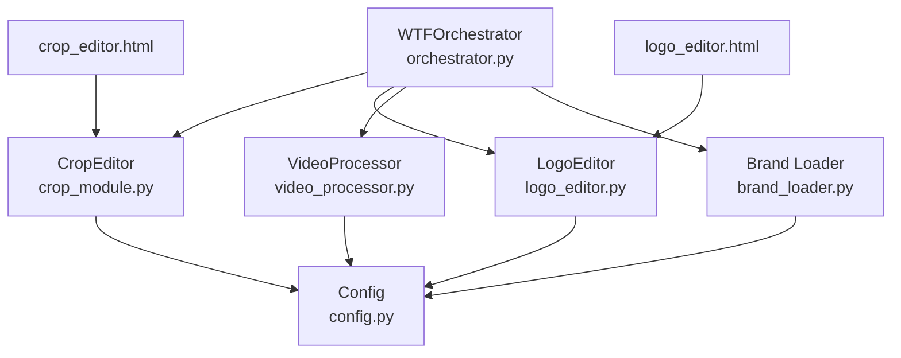
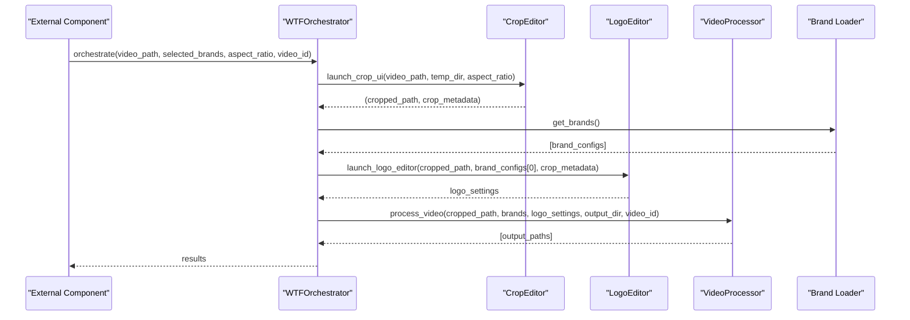
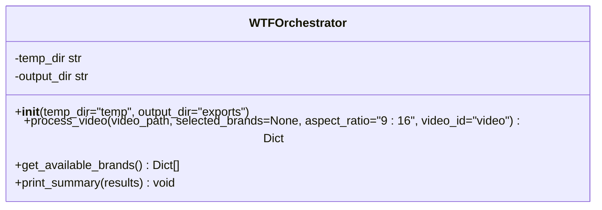
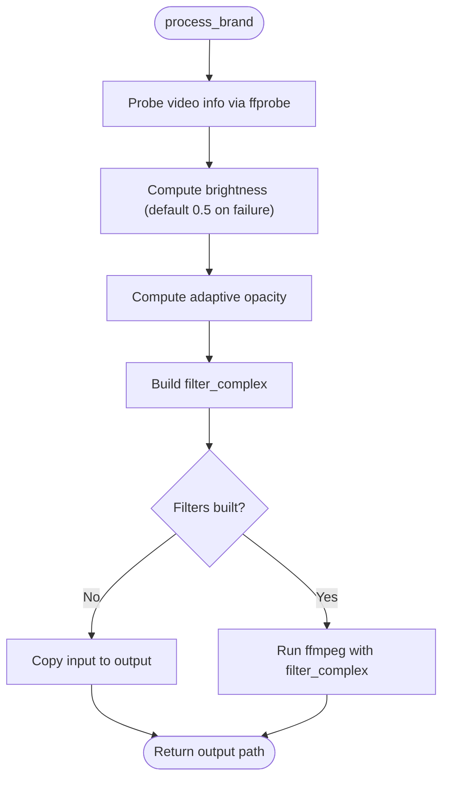
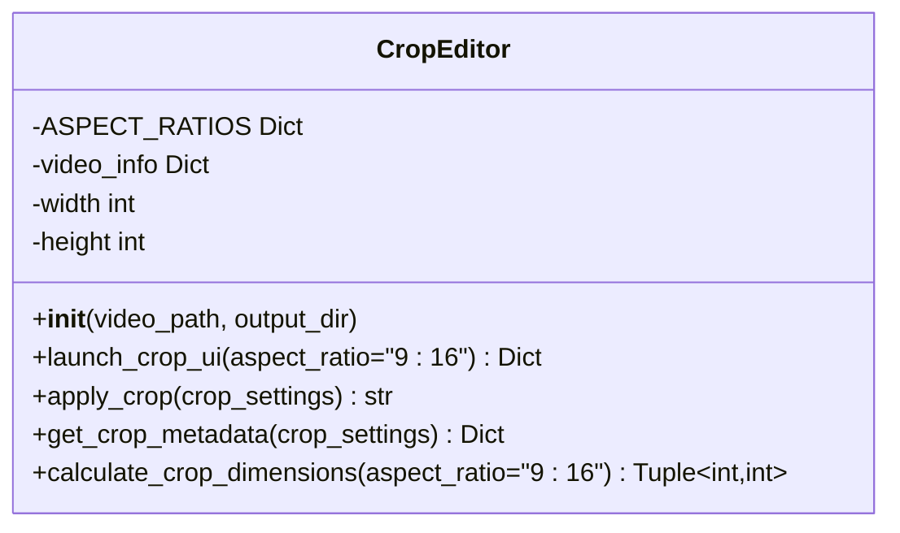
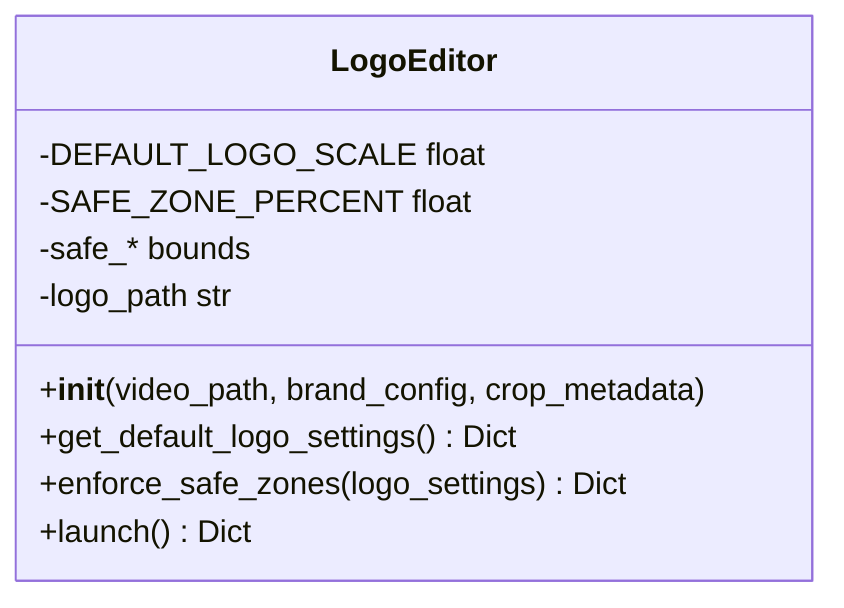
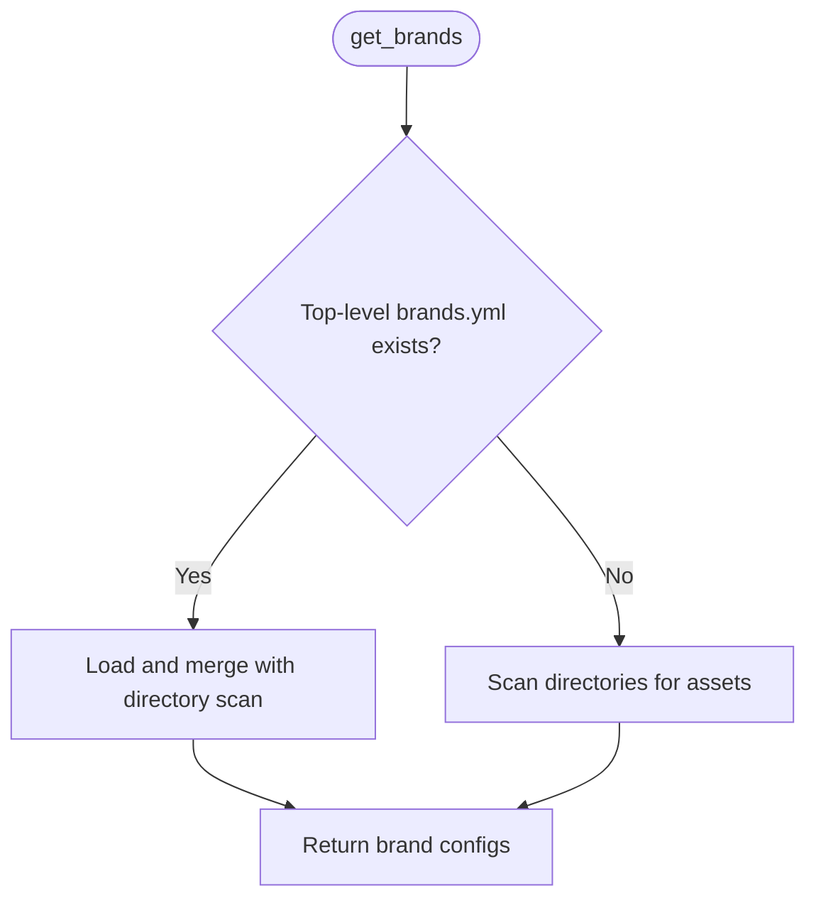
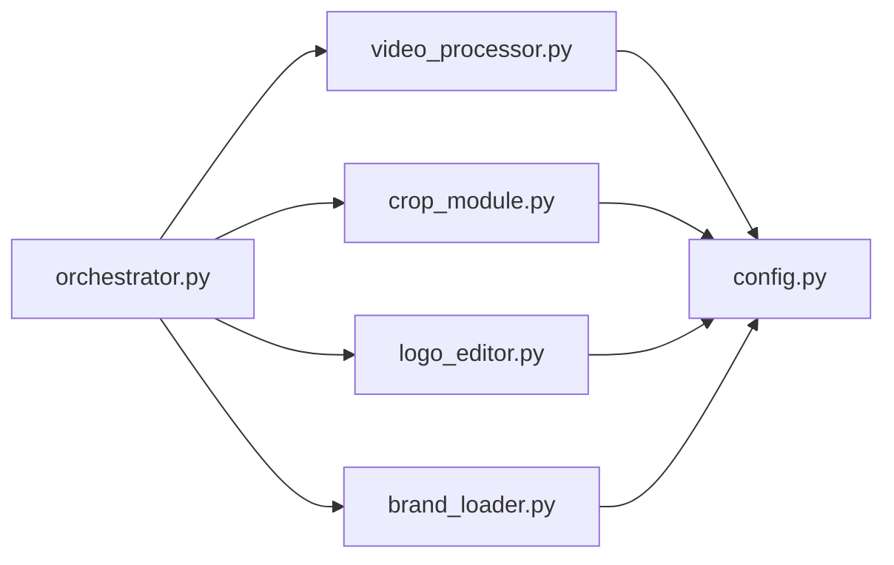

# Internal APIs

<cite>
**Referenced Files in This Document**
- [app/orchestrator.py](file://app/orchestrator.py)
- [app/video_processor.py](file://app/video_processor.py)
- [app/crop_module.py](file://app/crop_module.py)
- [app/logo_editor.py](file://app/logo_editor.py)
- [app/brand_loader.py](file://app/brand_loader.py)
- [app/config.py](file://app/config.py)
- [app/ui/crop_editor.html](file://app/ui/crop_editor.html)
- [app/ui/logo_editor.html](file://app/ui/logo_editor.html)
- [imports/brands/wtf_orchestrator/brands.yml](file://imports/brands/wtf_orchestrator/brands.yml)
- [imports/brands/wtf_orchestrator/manifest.yml](file://imports/brands/wtf_orchestrator/manifest.yml)
- [imports/brands/wtf_orchestrator/watermark.yml](file://imports/brands/wtf_orchestrator/watermark.yml)
- [demo_orchestrator.py](file://demo_orchestrator.py)
</cite>

## Table of Contents
1. [Introduction](#introduction)
2. [Project Structure](#project-structure)
3. [Core Components](#core-components)
4. [Architecture Overview](#architecture-overview)
5. [Detailed Component Analysis](#detailed-component-analysis)
6. [Dependency Analysis](#dependency-analysis)
7. [Performance Considerations](#performance-considerations)
8. [Troubleshooting Guide](#troubleshooting-guide)
9. [Conclusion](#conclusion)
10. [Appendices](#appendices)

## Introduction
This document describes the internal APIs and module interfaces used by the WatchTheFall Orchestrator v3 processing engine. It focuses on:
- The orchestrator control flow and public entry points
- The VideoProcessor class and its internal processing pipeline
- The CropEditor/CropModule and LogoEditor APIs
- Brand configuration discovery and extension points
- Internal data flows, configuration interfaces, and extension points for custom processing logic
- Practical examples of how external components interact with these APIs

The goal is to enable developers to integrate, extend, and troubleshoot the pipeline effectively.

## Project Structure
The Orchestrator v3 organizes its internals around four primary modules plus configuration and UI assets:
- Orchestrator: coordinates the full pipeline
- Crop Module: interactive cropping with pinch-to-zoom and drag
- Logo Editor: interactive logo positioning and sizing
- Video Processor: applies brand overlays and adaptive watermarks
- Brand Loader: discovers and loads brand configurations
- Config: resolves paths and binary locations
- UI: crop_editor.html and logo_editor.html for mobile-friendly editing

**Diagram sources**
- [app/orchestrator.py](file://app/orchestrator.py#L12-L172)
- [app/crop_module.py](file://app/crop_module.py#L11-L193)
- [app/logo_editor.py](file://app/logo_editor.py#L11-L132)
- [app/video_processor.py](file://app/video_processor.py#L13-L273)
- [app/brand_loader.py](file://app/brand_loader.py#L168-L183)
- [app/config.py](file://app/config.py#L1-L18)
- [app/ui/crop_editor.html](file://app/ui/crop_editor.html#L1-L261)
- [app/ui/logo_editor.html](file://app/ui/logo_editor.html#L1-L254)

**Section sources**
- [app/orchestrator.py](file://app/orchestrator.py#L1-L172)
- [app/crop_module.py](file://app/crop_module.py#L1-L193)
- [app/logo_editor.py](file://app/logo_editor.py#L1-L132)
- [app/video_processor.py](file://app/video_processor.py#L1-L273)
- [app/brand_loader.py](file://app/brand_loader.py#L1-L499)
- [app/config.py](file://app/config.py#L1-L18)
- [app/ui/crop_editor.html](file://app/ui/crop_editor.html#L1-L261)
- [app/ui/logo_editor.html](file://app/ui/logo_editor.html#L1-L254)

## Core Components
This section outlines the main internal APIs and their responsibilities.

- WTFOrchestrator
  - Coordinates the end-to-end pipeline: download (external), crop, logo edit, multi-brand export
  - Public methods:
    - process_video(video_path, selected_brands=None, aspect_ratio='9:16', video_id='video') -> Dict
    - get_available_brands() -> List[Dict]
    - print_summary(results: Dict) -> None
  - Exceptions: raises ValueError when no brands match selection; wraps downstream exceptions and records them in results['errors']

- VideoProcessor
  - Applies brand overlays: template, logo, and adaptive watermark
  - Public methods:
    - __init__(video_path: str, output_dir: str='exports')
    - process_brand(brand_config: Dict, logo_settings: Optional[Dict]=None, video_id: str='video') -> str
    - process_multiple_brands(brands: List[Dict], logo_settings: Optional[Dict]=None, video_id: str='video') -> List[str]
    - build_filter_complex(brand_config: Dict, logo_settings: Optional[Dict]=None) -> str
    - calculate_adaptive_watermark_opacity() -> float
    - calculate_video_brightness() -> float
  - Exceptions: propagates ffmpeg errors during processing

- CropEditor
  - Interactive cropping with pinch-to-zoom and drag
  - Public methods:
    - __init__(video_path: str, output_dir: str)
    - launch_crop_ui(aspect_ratio: str='9:16') -> Dict
    - apply_crop(crop_settings: Dict) -> str
    - get_crop_metadata(crop_settings: Dict) -> Dict
    - calculate_crop_dimensions(aspect_ratio: str='9:16') -> Tuple[int, int]
  - Exceptions: returns defaults on ffprobe failures

- LogoEditor
  - Interactive logo positioning with safe zones
  - Public methods:
    - __init__(video_path: str, brand_config: Dict, crop_metadata: Dict)
    - get_default_logo_settings() -> Dict
    - enforce_safe_zones(logo_settings: Dict) -> Dict
    - launch() -> Dict
  - Exceptions: returns defaults when assets are missing

- Brand Loader
  - Discovers and loads brand configurations from imports/brands
  - Public methods:
    - get_brands() -> List[Dict]
  - Manifests supported: manifest.yml, watermark.yml, orientation.yml, routing.yml, platforms.yml

- Config
  - Resolves project paths and binary locations
  - Constants:
    - APP_DIR, PROJECT_ROOT, IMPORTS_BRANDS_DIR, OUTPUT_DIR, UI_DIR
    - FFMPEG_BIN, FFPROBE_BIN (with environment overrides)

**Section sources**
- [app/orchestrator.py](file://app/orchestrator.py#L12-L172)
- [app/video_processor.py](file://app/video_processor.py#L13-L273)
- [app/crop_module.py](file://app/crop_module.py#L11-L193)
- [app/logo_editor.py](file://app/logo_editor.py#L11-L132)
- [app/brand_loader.py](file://app/brand_loader.py#L168-L183)
- [app/config.py](file://app/config.py#L1-L18)

## Architecture Overview
The orchestrator composes four modules into a cohesive pipeline. The UI components provide mobile-friendly editing experiences that feed metadata back into the Python modules.

**Diagram sources**
- [app/orchestrator.py](file://app/orchestrator.py#L29-L115)
- [app/crop_module.py](file://app/crop_module.py#L174-L192)
- [app/logo_editor.py](file://app/logo_editor.py#L117-L131)
- [app/video_processor.py](file://app/video_processor.py#L256-L272)
- [app/brand_loader.py](file://app/brand_loader.py#L168-L183)

## Detailed Component Analysis

### WTFOrchestrator
- Responsibilities
  - Orchestrates the full pipeline: crop, brand loading, logo editor, multi-brand export
  - Aggregates results and errors, prints summaries
- Method signatures and behavior
  - process_video(video_path, selected_brands=None, aspect_ratio='9:16', video_id='video') -> Dict
    - Returns a structured result with success flag, stage outputs, and errors
    - Raises ValueError if no brands match selection
  - get_available_brands() -> List[Dict]
    - Delegates to brand loader
  - print_summary(results: Dict) -> None
    - Prints a formatted summary of stages, outputs, and errors
- Exceptions
  - Wraps downstream exceptions and appends them to results['errors']
- Extension points
  - Accepts arbitrary selected_brands to filter exports
  - Uses aspect_ratio to drive crop dimensions

**Diagram sources**
- [app/orchestrator.py](file://app/orchestrator.py#L12-L172)

**Section sources**
- [app/orchestrator.py](file://app/orchestrator.py#L29-L172)

### VideoProcessor
- Responsibilities
  - Applies brand overlays: template, logo, and adaptive watermark
  - Computes adaptive opacity based on video brightness
  - Builds ffmpeg filter_complex dynamically
- Method signatures and behavior
  - __init__(video_path: str, output_dir: str='exports')
  - process_brand(brand_config: Dict, logo_settings: Optional[Dict]=None, video_id: str='video') -> str
  - process_multiple_brands(brands: List[Dict], logo_settings: Optional[Dict]=None, video_id: str='video') -> List[str]
  - build_filter_complex(brand_config: Dict, logo_settings: Optional[Dict]=None) -> str
  - calculate_adaptive_watermark_opacity() -> float
  - calculate_video_brightness() -> float
- Internal constants
  - SAFE_ZONE_PERCENT = 0.05
  - WATERMARK_OPACITY_MIN = 0.10
  - WATERMARK_OPACITY_MAX = 0.20
- Exceptions
  - Propagates ffmpeg errors via CalledProcessError
- Data flow
  - Reads video info via ffprobe
  - Extracts a small frame to compute brightness
  - Builds overlay chain: template -> logo -> watermark (adaptive opacity)
  - Writes outputs under output_dir/<brand>/<video_id>.mp4

**Diagram sources**
- [app/video_processor.py](file://app/video_processor.py#L30-L253)

**Section sources**
- [app/video_processor.py](file://app/video_processor.py#L13-L273)

### CropEditor
- Responsibilities
  - Provides interactive cropping with pinch-to-zoom and drag
  - Calculates crop dimensions based on aspect ratio
  - Applies crop using ffmpeg and returns metadata
- Method signatures and behavior
  - __init__(video_path: str, output_dir: str)
  - launch_crop_ui(aspect_ratio: str='9:16') -> Dict
  - apply_crop(crop_settings: Dict) -> str
  - get_crop_metadata(crop_settings: Dict) -> Dict
  - calculate_crop_dimensions(aspect_ratio: str='9:16') -> Tuple[int, int]
- Aspect ratios supported
  - '9:16', '1:1', '4:5', '16:9'
- Exceptions
  - Returns defaults on ffprobe failures

**Diagram sources**
- [app/crop_module.py](file://app/crop_module.py#L11-L193)

**Section sources**
- [app/crop_module.py](file://app/crop_module.py#L11-L193)

### LogoEditor
- Responsibilities
  - Interactive logo positioning with pinch-to-resize and drag
  - Enforces 5% safe zones from edges
  - Selects cleaned logo when available
- Method signatures and behavior
  - __init__(video_path: str, brand_config: Dict, crop_metadata: Dict)
  - get_default_logo_settings() -> Dict
  - enforce_safe_zones(logo_settings: Dict) -> Dict
  - launch() -> Dict
- Defaults
  - DEFAULT_LOGO_SCALE = 0.15
  - SAFE_ZONE_PERCENT = 0.05
- Asset resolution
  - Prefers logos_clean/<logo> over original assets

**Diagram sources**
- [app/logo_editor.py](file://app/logo_editor.py#L11-L132)

**Section sources**
- [app/logo_editor.py](file://app/logo_editor.py#L11-L132)

### Brand Loader and Configuration Interfaces
- Brand discovery
  - get_brands() scans imports/brands and merges manifests and assets
  - Supports top-level brands.yml for explicit configuration
- Manifests
  - manifest.yml: display_name, watermark_position, watermark_scale
  - watermark.yml: position, scale
  - orientation.yml, routing.yml, platforms.yml: optional
- Example brand configuration
  - imports/brands/wtf_orchestrator/brands.yml defines many regional and thematic brands with assets and posting metadata

**Diagram sources**
- [app/brand_loader.py](file://app/brand_loader.py#L168-L183)

**Section sources**
- [app/brand_loader.py](file://app/brand_loader.py#L168-L183)
- [imports/brands/wtf_orchestrator/brands.yml](file://imports/brands/wtf_orchestrator/brands.yml#L1-L423)
- [imports/brands/wtf_orchestrator/manifest.yml](file://imports/brands/wtf_orchestrator/manifest.yml#L1-L4)
- [imports/brands/wtf_orchestrator/watermark.yml](file://imports/brands/wtf_orchestrator/watermark.yml#L1-L3)

### UI Interaction APIs
- Crop Editor UI
  - crop_editor.html
  - Features: pinch-to-zoom, drag, aspect ratio selection, confirm button
  - Sends crop settings to backend via /api/crop/confirm
- Logo Editor UI
  - logo_editor.html
  - Features: pinch-to-resize logo, drag, safe zone enforcement, confirm button
  - Sends logo settings to backend via /api/logo/confirm

These UIs are designed for mobile devices and communicate with the backend to persist crop and logo settings for downstream processing.

**Section sources**
- [app/ui/crop_editor.html](file://app/ui/crop_editor.html#L1-L261)
- [app/ui/logo_editor.html](file://app/ui/logo_editor.html#L1-L254)

## Dependency Analysis
- Internal dependencies
  - Orchestrator depends on CropEditor, LogoEditor, VideoProcessor, and Brand Loader
  - VideoProcessor, CropEditor, LogoEditor depend on Config for paths and binaries
  - Brand Loader depends on Config for IMPORTS_BRANDS_DIR
- External dependencies
  - ffmpeg/ffprobe binaries invoked via subprocess
  - PIL/Pillow and numpy for brightness analysis
- Coupling and cohesion
  - Modules are cohesive around their responsibilities and loosely coupled via documented interfaces
  - Configuration is centralized in config.py

**Diagram sources**
- [app/orchestrator.py](file://app/orchestrator.py#L7-L10)
- [app/video_processor.py](file://app/video_processor.py#L11-L11)
- [app/crop_module.py](file://app/crop_module.py#L9-L9)
- [app/logo_editor.py](file://app/logo_editor.py#L9-L9)
- [app/brand_loader.py](file://app/brand_loader.py#L11-L19)
- [app/config.py](file://app/config.py#L1-L18)

**Section sources**
- [app/orchestrator.py](file://app/orchestrator.py#L1-L172)
- [app/video_processor.py](file://app/video_processor.py#L1-L273)
- [app/crop_module.py](file://app/crop_module.py#L1-L193)
- [app/logo_editor.py](file://app/logo_editor.py#L1-L132)
- [app/brand_loader.py](file://app/brand_loader.py#L1-L499)
- [app/config.py](file://app/config.py#L1-L18)

## Performance Considerations
- Video probing and brightness computation
  - Video info probing uses ffprobe; brightness extraction scales a frame down for speed
- Overlay composition
  - ffmpeg filter_complex builds a single pass with multiple overlays; consider reducing overlay count for performance
- Safe zones and scaling
  - Default logo scale is 15% of width; adjust watermark_scale in brand manifests to balance visibility and performance
- Output quality
  - libx264 with preset medium and CRF 18 balances quality and speed

[No sources needed since this section provides general guidance]

## Troubleshooting Guide
- ffmpeg/ffprobe not found
  - Ensure FFMPEG_BIN and FFPROBE_BIN are available or set via environment variables
- Crop stage fails
  - Verify video dimensions and aspect ratio; check ffprobe output
- Logo editor returns defaults
  - Confirm logo asset paths exist under imports/brands and logos_clean/
- Watermark opacity unexpected
  - Brightness detection defaults to mid-level; verify video brightness and watermark_scale
- Brand not exported
  - Check selected_brands filtering and get_brands() output

**Section sources**
- [app/config.py](file://app/config.py#L11-L13)
- [app/video_processor.py](file://app/video_processor.py#L49-L90)
- [app/logo_editor.py](file://app/logo_editor.py#L38-L55)

## Conclusion
The WatchTheFall Orchestrator v3 provides a modular, extensible pipeline for multi-brand video processing. Its internal APIs are intentionally simple and focused:
- Orchestrator coordinates stages and aggregates results
- CropEditor and LogoEditor expose minimal, predictable interfaces for interactive editing
- VideoProcessor encapsulates overlay logic and adaptive opacity
- Brand Loader centralizes configuration discovery and merging

External components can integrate by invoking orchestrate() or by composing individual modules directly. Extension points include adding new brand manifests, adjusting watermark and logo options, and integrating custom processing logic through the VideoProcessor’s filter chain.

[No sources needed since this section summarizes without analyzing specific files]

## Appendices

### API Reference Summary

- WTFOrchestrator
  - process_video(video_path, selected_brands=None, aspect_ratio='9:16', video_id='video') -> Dict
  - get_available_brands() -> List[Dict]
  - print_summary(results: Dict) -> None

- VideoProcessor
  - __init__(video_path: str, output_dir: str='exports')
  - process_brand(brand_config: Dict, logo_settings: Optional[Dict]=None, video_id: str='video') -> str
  - process_multiple_brands(brands: List[Dict], logo_settings: Optional[Dict]=None, video_id: str='video') -> List[str]
  - build_filter_complex(brand_config: Dict, logo_settings: Optional[Dict]=None) -> str
  - calculate_adaptive_watermark_opacity() -> float
  - calculate_video_brightness() -> float

- CropEditor
  - __init__(video_path: str, output_dir: str)
  - launch_crop_ui(aspect_ratio: str='9:16') -> Dict
  - apply_crop(crop_settings: Dict) -> str
  - get_crop_metadata(crop_settings: Dict) -> Dict
  - calculate_crop_dimensions(aspect_ratio: str='9:16') -> Tuple[int, int]

- LogoEditor
  - __init__(video_path: str, brand_config: Dict, crop_metadata: Dict)
  - get_default_logo_settings() -> Dict
  - enforce_safe_zones(logo_settings: Dict) -> Dict
  - launch() -> Dict

- Brand Loader
  - get_brands() -> List[Dict]

- Config
  - Paths: APP_DIR, PROJECT_ROOT, IMPORTS_BRANDS_DIR, OUTPUT_DIR, UI_DIR
  - Binaries: FFMPEG_BIN, FFPROBE_BIN

**Section sources**
- [app/orchestrator.py](file://app/orchestrator.py#L29-L172)
- [app/video_processor.py](file://app/video_processor.py#L18-L273)
- [app/crop_module.py](file://app/crop_module.py#L24-L193)
- [app/logo_editor.py](file://app/logo_editor.py#L20-L132)
- [app/brand_loader.py](file://app/brand_loader.py#L168-L183)
- [app/config.py](file://app/config.py#L1-L18)

### Example Usage
- End-to-end orchestration
  - See demo_orchestrator.py for a runnable example that demonstrates:
    - Loading brands
    - Selecting brands for export
    - Executing the pipeline
    - Interpreting results

**Section sources**
- [demo_orchestrator.py](file://demo_orchestrator.py#L13-L109)