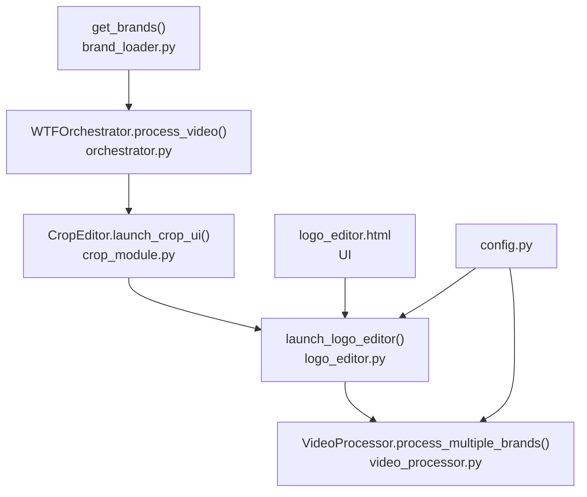
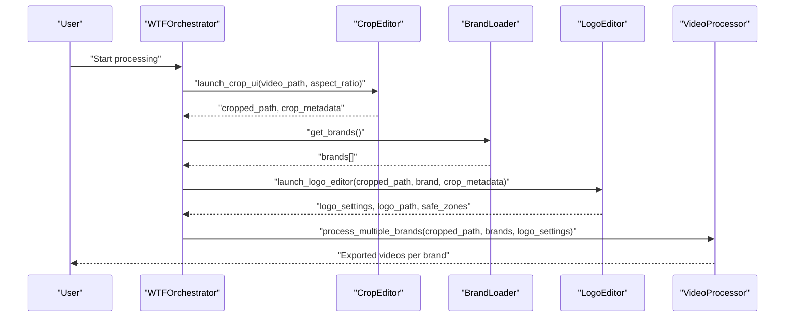
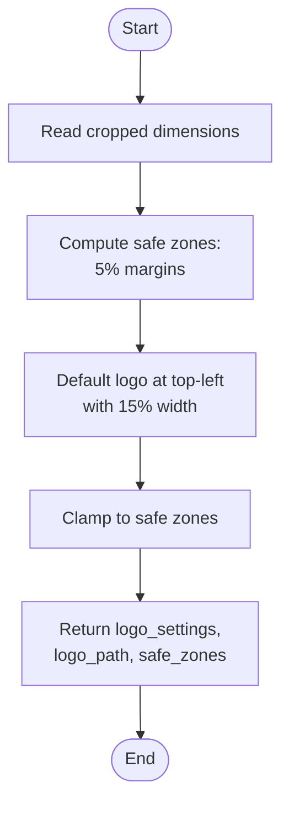
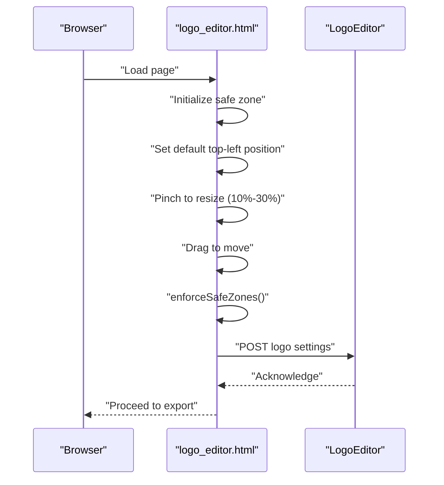
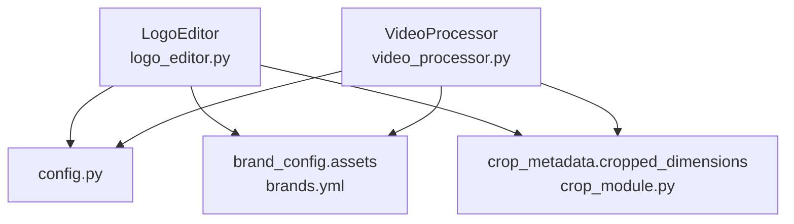

# LogoEditor Interface

<cite>
**Referenced Files in This Document**
- [logo_editor.py](file://app/logo_editor.py)
- [video_processor.py](file://app/video_processor.py)
- [brand_loader.py](file://app/brand_loader.py)
- [orchestrator.py](file://app/orchestrator.py)
- [crop_module.py](file://app/crop_module.py)
- [logo_editor.html](file://app/ui/logo_editor.html)
- [brands.yml](file://imports/brands/wtf_orchestrator/brands.yml)
- [manifest.yml](file://imports/brands/wtf_orchestrator/manifest.yml)
- [config.py](file://app/config.py)
</cite>

## Table of Contents
1. [Introduction](#introduction)
2. [Project Structure](#project-structure)
3. [Core Components](#core-components)
4. [Architecture Overview](#architecture-overview)
5. [Detailed Component Analysis](#detailed-component-analysis)
6. [Dependency Analysis](#dependency-analysis)
7. [Performance Considerations](#performance-considerations)
8. [Troubleshooting Guide](#troubleshooting-guide)
9. [Conclusion](#conclusion)

## Introduction
This document describes the LogoEditor’s internal APIs and the interactive logo positioning system used in the WatchTheFall orchestrator. It focuses on the launch_logo_editor() function interface, parameters (cropped_video_path, brand_config, crop_metadata), the logo positioning workflow, safe zone enforcement, dynamic scaling based on video dimensions, coordinate transformation, validation logic, and integration with brand-specific watermark settings. It also provides examples of logo configuration, positioning workflows, and troubleshooting common logo placement issues.

## Project Structure
The logo editing pipeline integrates several modules:
- LogoEditor: Computes default logo settings, enforces safe zones, and resolves logo asset paths.
- VideoProcessor: Applies overlays (template, logo, watermark) using ffmpeg with adaptive opacity.
- BrandLoader: Scans brand directories and loads brand configurations including assets and options.
- Orchestrator: Coordinates the full pipeline from crop to multi-brand export.
- CropModule: Provides crop metadata used by LogoEditor for safe zone calculations.
- UI: Web-based logo editor with pinch-to-zoom and drag controls.
- Config: Centralized paths and binary locations.

**Diagram sources**
- [orchestrator.py](file://app/orchestrator.py#L29-L115)
- [crop_module.py](file://app/crop_module.py#L81-L192)
- [logo_editor.py](file://app/logo_editor.py#L117-L131)
- [video_processor.py](file://app/video_processor.py#L180-L253)
- [brand_loader.py](file://app/brand_loader.py#L168-L183)
- [logo_editor.html](file://app/ui/logo_editor.html#L1-L254)
- [config.py](file://app/config.py#L1-L18)

**Section sources**
- [logo_editor.py](file://app/logo_editor.py#L1-L132)
- [video_processor.py](file://app/video_processor.py#L1-L273)
- [brand_loader.py](file://app/brand_loader.py#L1-L499)
- [orchestrator.py](file://app/orchestrator.py#L1-L172)
- [crop_module.py](file://app/crop_module.py#L1-L193)
- [logo_editor.html](file://app/ui/logo_editor.html#L1-L254)
- [config.py](file://app/config.py#L1-L18)

## Core Components
- LogoEditor class encapsulates logo positioning logic:
  - Safe zone enforcement at 5% margins from edges.
  - Dynamic default logo size based on cropped video width (15%).
  - Resolution of logo path preferring cleaned variants.
  - Public API: get_default_logo_settings(), enforce_safe_zones(), launch().
- launch_logo_editor(): convenience function returning default logo settings and safe zone bounds for downstream processing.
- VideoProcessor.build_filter_complex(): applies logo overlay with ffmpeg using logo_settings and calculates adaptive watermark opacity based on video brightness.
- BrandLoader.get_brands(): discovers brand assets and options (including watermark position and scale).
- Orchestrator.process_video(): orchestrates crop, brand loading, logo editor, and multi-brand export.
- UI logo_editor.html: provides pinch-to-zoom and drag controls for interactive positioning.

Key behaviors:
- Safe zones: computed from cropped video dimensions and enforced during both default initialization and user interaction.
- Dynamic scaling: logo size scales with video width; watermark scale is brand-specific.
- Background removal: LogoEditor prefers cleaned logo variants; background removal is supported by selecting cleaned assets.

**Section sources**
- [logo_editor.py](file://app/logo_editor.py#L11-L131)
- [video_processor.py](file://app/video_processor.py#L109-L178)
- [brand_loader.py](file://app/brand_loader.py#L168-L183)
- [orchestrator.py](file://app/orchestrator.py#L85-L105)
- [logo_editor.html](file://app/ui/logo_editor.html#L107-L251)

## Architecture Overview
The logo positioning workflow begins after cropping. The orchestrator requests logo settings from the LogoEditor using cropped video metadata and brand configuration. The resulting logo_settings are passed to VideoProcessor, which embeds the logo and watermark into the video using ffmpeg.

**Diagram sources**
- [orchestrator.py](file://app/orchestrator.py#L54-L105)
- [crop_module.py](file://app/crop_module.py#L174-L192)
- [brand_loader.py](file://app/brand_loader.py#L168-L183)
- [logo_editor.py](file://app/logo_editor.py#L117-L131)
- [video_processor.py](file://app/video_processor.py#L227-L253)

## Detailed Component Analysis

### launch_logo_editor() Function
Purpose:
- Provide default logo settings and safe zone bounds for the given cropped video and brand configuration.

Parameters:
- cropped_video_path: Path to the cropped video produced by the crop stage.
- brand_config: Brand configuration dictionary containing assets and options (e.g., logo path, watermark scale/position).
- crop_metadata: Metadata from the crop stage, including cropped_dimensions (width, height).

Returns:
- Dictionary containing:
  - logo_settings: default x, y, width, height, scale, and opacity.
  - logo_path: resolved path to logo (preferring cleaned variant).
  - safe_zones: safe zone boundaries (x_min, y_min, x_max, y_max).

Implementation highlights:
- Initializes LogoEditor with video_path, brand_config, and crop_metadata.
- Calls get_default_logo_settings() and enforce_safe_zones() to compute safe defaults.
- Returns structured results for downstream use.

Usage example:
- Called by orchestrator after crop and brand loading to position logo consistently across brands.

**Section sources**
- [logo_editor.py](file://app/logo_editor.py#L117-L131)
- [orchestrator.py](file://app/orchestrator.py#L87-L91)

### LogoEditor Class
Responsibilities:
- Compute safe zones from cropped dimensions.
- Resolve logo path preferring cleaned variants.
- Generate default logo settings (top-left corner with 15% width).
- Enforce safe zones during validation.

Key methods:
- __init__: stores video_path, brand_config, crop_metadata; computes safe zone boundaries; resolves logo path.
- get_default_logo_settings: calculates default position and size based on cropped width.
- enforce_safe_zones: clamps logo position within safe zones.
- launch: returns logo_settings, logo_path, and safe_zones.

Coordinate system:
- Origin at top-left of cropped video.
- Safe zones are computed as percentages of cropped width/height.

Dynamic scaling:
- Default logo width is 15% of cropped width; height equals width for square/circular logos.

Background removal:
- Prefers cleaned logo variants under imports/brands/wtf_orchestrator/logos_clean.

Validation logic:
- Position clamped to stay within safe zones; prevents logo from being placed off-screen.

Integration with brand-specific watermark settings:
- While LogoEditor focuses on logo, watermark position and scale are derived from brand_config and applied by VideoProcessor.

**Section sources**
- [logo_editor.py](file://app/logo_editor.py#L20-L114)
- [config.py](file://app/config.py#L1-L18)

### Coordinate Transformation and Safe Zone Enforcement
Workflow:
- Convert percentage-based safe zones to pixel coordinates using cropped dimensions.
- Default logo starts at top-left inside safe zone.
- During user interaction (UI), enforceSafeZones() ensures logo remains within safe margins.
- On submission, clamp to prevent overflow beyond edges.

**Diagram sources**
- [logo_editor.py](file://app/logo_editor.py#L29-L93)
- [logo_editor.html](file://app/ui/logo_editor.html#L162-L172)

**Section sources**
- [logo_editor.py](file://app/logo_editor.py#L29-L93)
- [logo_editor.html](file://app/ui/logo_editor.html#L162-L172)

### Integration with Brand-Specific Watermark Settings
While LogoEditor handles logo placement, watermark behavior is controlled by brand_config:
- Watermark position and scale are read from brand_config.options and manifest files.
- VideoProcessor.calculate_adaptive_watermark_opacity() adjusts opacity based on video brightness.
- Watermark is overlaid after logo using ffmpeg.

Brand configuration sources:
- imports/brands/wtf_orchestrator/brands.yml
- imports/brands/wtf_orchestrator/manifest.yml

**Section sources**
- [video_processor.py](file://app/video_processor.py#L109-L178)
- [brands.yml](file://imports/brands/wtf_orchestrator/brands.yml#L1-L423)
- [manifest.yml](file://imports/brands/wtf_orchestrator/manifest.yml#L1-L4)

### Interactive Logo Positioning UI
The UI supports:
- Pinch-to-resize: adjusts logo scale between 10% and 30% of viewport width.
- Drag-to-move: repositions logo within safe zones.
- Safe zone visualization: dashed red rectangle indicating 5% margins.
- Confirmation: sends logo settings to backend for export.

**Diagram sources**
- [logo_editor.html](file://app/ui/logo_editor.html#L107-L251)
- [logo_editor.py](file://app/logo_editor.py#L79-L93)

**Section sources**
- [logo_editor.html](file://app/ui/logo_editor.html#L107-L251)
- [logo_editor.py](file://app/logo_editor.py#L79-L93)

## Dependency Analysis
LogoEditor depends on:
- config.py for PROJECT_ROOT and asset resolution.
- brand_config.assets for logo path discovery.
- crop_metadata.cropped_dimensions for safe zone computation.

VideoProcessor depends on:
- brand_config.assets for template, logo, and watermark paths.
- brand_config.options for watermark position and scale.
- crop_metadata for video dimensions.

**Diagram sources**
- [logo_editor.py](file://app/logo_editor.py#L20-L36)
- [video_processor.py](file://app/video_processor.py#L119-L124)
- [config.py](file://app/config.py#L1-L18)
- [crop_module.py](file://app/crop_module.py#L159-L171)
- [brands.yml](file://imports/brands/wtf_orchestrator/brands.yml#L1-L423)

**Section sources**
- [logo_editor.py](file://app/logo_editor.py#L20-L36)
- [video_processor.py](file://app/video_processor.py#L119-L124)
- [crop_module.py](file://app/crop_module.py#L159-L171)
- [brands.yml](file://imports/brands/wtf_orchestrator/brands.yml#L1-L423)
- [config.py](file://app/config.py#L1-L18)

## Performance Considerations
- Safe zone computation is O(1) per frame; minimal overhead.
- Default logo size uses integer scaling based on cropped width; avoids heavy computations.
- Watermark opacity calculation extracts a small frame for brightness analysis; consider caching brightness per video if repeated processing occurs.
- ffmpeg overlay operations are hardware-accelerated; ensure GPU-friendly encoders for large-scale exports.

## Troubleshooting Guide
Common issues and resolutions:
- Logo outside safe zone:
  - Ensure enforce_safe_zones() is applied before export.
  - Verify crop_metadata.cropped_dimensions are correct.
- Incorrect logo path:
  - Confirm cleaned logo exists under imports/brands/wtf_orchestrator/logos_clean.
  - Fallback to original logo if cleaned variant is missing.
- Watermark overlaps logo:
  - Adjust watermark position in brand_config.options or manifest files.
  - Reduce watermark scale to minimize overlap risk.
- Export artifacts or misalignment:
  - Validate ffmpeg installation and paths in config.py.
  - Re-run crop to ensure even dimensions and correct aspect ratio.

**Section sources**
- [logo_editor.py](file://app/logo_editor.py#L38-L55)
- [video_processor.py](file://app/video_processor.py#L148-L178)
- [config.py](file://app/config.py#L11-L13)

## Conclusion
The LogoEditor provides a robust, brand-aware logo positioning system integrated into the orchestrator pipeline. It enforces safe zones, supports dynamic scaling, and leverages cleaned logo assets for background removal. Combined with brand-specific watermark settings and adaptive opacity, it enables consistent, high-quality branding across multiple platforms and regions.