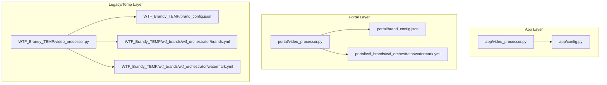
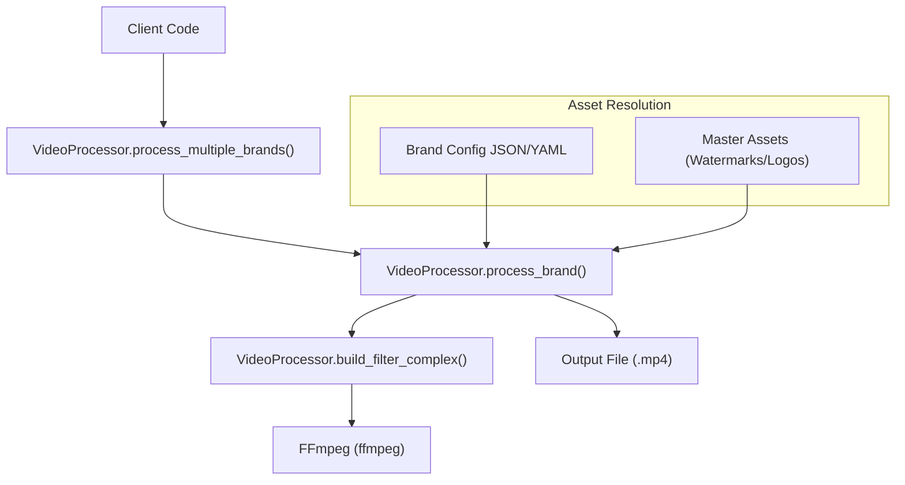
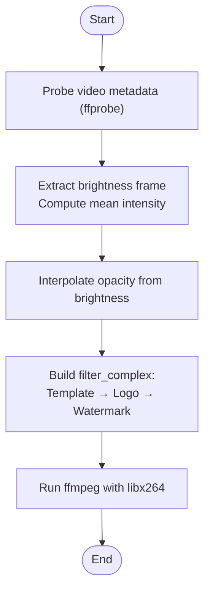
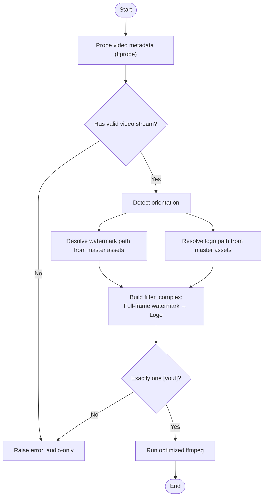
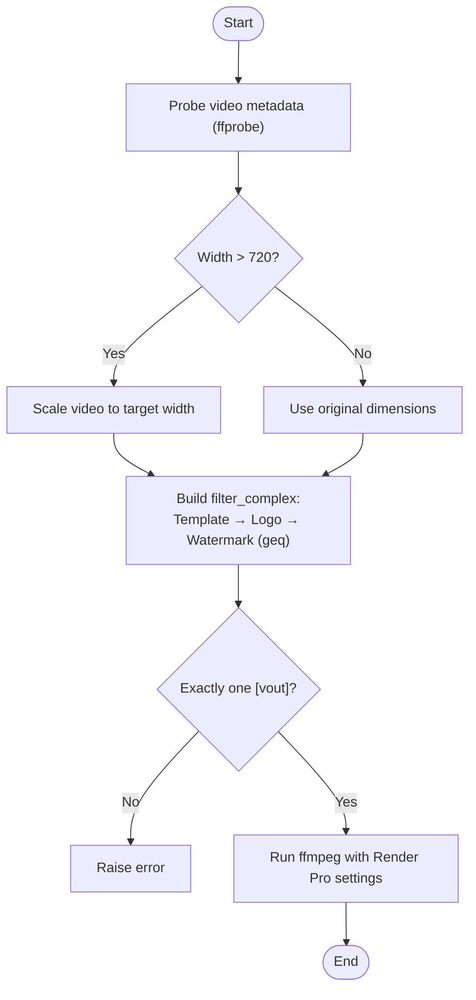
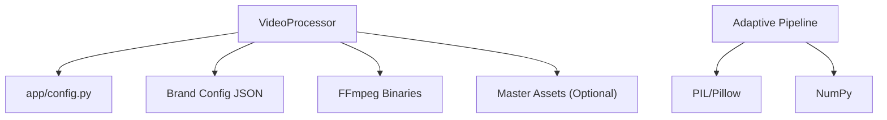

# VideoProcessor Interface

<cite>
**Referenced Files in This Document**
- [app/video_processor.py](file://app/video_processor.py)
- [portal/video_processor.py](file://portal/video_processor.py)
- [WTF_Brandy_TEMP/video_processor.py](file://WTF_Brandy_TEMP/video_processor.py)
- [app/config.py](file://app/config.py)
- [portal/brand_config.json](file://portal/brand_config.json)
- [WTF_Brandy_TEMP/brand_config.json](file://WTF_Brandy_TEMP/brand_config.json)
- [WTF_Brandy_TEMP/wtf_brands/wtf_orchestrator/brands.yml](file://WTF_Brandy_TEMP/wtf_brands/wtf_orchestrator/brands.yml)
- [WTF_Brandy_TEMP/wtf_brands/wtf_orchestrator/watermark.yml](file://WTF_Brandy_TEMP/wtf_brands/wtf_orchestrator/watermark.yml)
- [portal/wtf_brands/wtf_orchestrator/watermark.yml](file://portal/wtf_brands/wtf_orchestrator/watermark.yml)
- [demo_orchestrator.py](file://demo_orchestrator.py)
</cite>

## Table of Contents
1. [Introduction](#introduction)
2. [Project Structure](#project-structure)
3. [Core Components](#core-components)
4. [Architecture Overview](#architecture-overview)
5. [Detailed Component Analysis](#detailed-component-analysis)
6. [Dependency Analysis](#dependency-analysis)
7. [Performance Considerations](#performance-considerations)
8. [Troubleshooting Guide](#troubleshooting-guide)
9. [Conclusion](#conclusion)

## Introduction
This document describes the VideoProcessor interface and internal APIs used for video manipulation and multi-brand export. It focuses on the process_video() function signature and behavior, the video processing pipeline (including adaptive watermarking, template application, safe zone enforcement, and multi-brand export), FFmpeg integration and filter chain configurations, video format handling, and the relationship between video processing and brand-specific configurations. It also provides practical examples, performance optimization tips, and troubleshooting guidance.

## Project Structure
The repository contains multiple implementations of the VideoProcessor module, each tailored for different stages or environments:
- app/video_processor.py: Implements adaptive watermark opacity based on video brightness, with template and logo overlays.
- portal/video_processor.py: Implements a master asset resolution pipeline with dynamic watermark and logo selection, plus normalization and robustness checks.
- WTF_Brandy_TEMP/video_processor.py: Provides a simplified pipeline with fixed watermark opacity and performance optimizations for Render Pro environments.

Key configuration and brand assets:
- app/config.py: Defines project paths and FFmpeg binary locations.
- portal/brand_config.json and WTF_Brandy_TEMP/brand_config.json: Define brand-specific assets and options.
- YAML files under WTF_Brandy_TEMP/wtf_brands/wtf_orchestrator/: Provide brand metadata and defaults.

**Diagram sources**
- [app/video_processor.py](file://app/video_processor.py#L1-L273)
- [app/config.py](file://app/config.py#L1-L18)
- [portal/video_processor.py](file://portal/video_processor.py#L1-L500)
- [portal/brand_config.json](file://portal/brand_config.json#L1-L302)
- [portal/wtf_brands/wtf_orchestrator/watermark.yml](file://portal/wtf_brands/wtf_orchestrator/watermark.yml#L1-L3)
- [WTF_Brandy_TEMP/video_processor.py](file://WTF_Brandy_TEMP/video_processor.py#L1-L471)
- [WTF_Brandy_TEMP/brand_config.json](file://WTF_Brandy_TEMP/brand_config.json#L1-L302)
- [WTF_Brandy_TEMP/wtf_brands/wtf_orchestrator/brands.yml](file://WTF_Brandy_TEMP/wtf_brands/wtf_orchestrator/brands.yml#L1-L423)
- [WTF_Brandy_TEMP/wtf_brands/wtf_orchestrator/watermark.yml](file://WTF_Brandy_TEMP/wtf_brands/wtf_orchestrator/watermark.yml#L1-L3)

**Section sources**
- [app/video_processor.py](file://app/video_processor.py#L1-L273)
- [portal/video_processor.py](file://portal/video_processor.py#L1-L500)
- [WTF_Brandy_TEMP/video_processor.py](file://WTF_Brandy_TEMP/video_processor.py#L1-L471)
- [app/config.py](file://app/config.py#L1-L18)
- [portal/brand_config.json](file://portal/brand_config.json#L1-L302)
- [WTF_Brandy_TEMP/brand_config.json](file://WTF_Brandy_TEMP/brand_config.json#L1-L302)
- [WTF_Brandy_TEMP/wtf_brands/wtf_orchestrator/brands.yml](file://WTF_Brandy_TEMP/wtf_brands/wtf_orchestrator/brands.yml#L1-L423)
- [WTF_Brandy_TEMP/wtf_brands/wtf_orchestrator/watermark.yml](file://WTF_Brandy_TEMP/wtf_brands/wtf_orchestrator/watermark.yml#L1-L3)
- [portal/wtf_brands/wtf_orchestrator/watermark.yml](file://portal/wtf_brands/wtf_orchestrator/watermark.yml#L1-L3)

## Core Components
This section documents the primary VideoProcessor APIs and their roles.

- VideoProcessor (app): Implements adaptive watermark opacity based on video brightness, supports template and logo overlays, and builds FFmpeg filter chains with safe zone enforcement.
- VideoProcessor (portal): Implements dynamic master asset resolution for watermarks and logos, normalization of video formats, robustness checks, and optimized FFmpeg settings for Render Pro environments.
- VideoProcessor (legacy/temp): Provides a simplified pipeline with fixed watermark opacity, performance optimizations, and Render Pro-friendly FFmpeg settings.

Key internal APIs:
- process_video(video_path, brands, logo_settings=None, output_dir='exports', video_id='video'): Convenience function to process a video for multiple brands.
- VideoProcessor.__init__(video_path, output_dir='exports'): Initializes the processor with video path and output directory.
- VideoProcessor.process_brand(brand_config, logo_settings=None, video_id='video'): Processes a single brand’s overlays.
- VideoProcessor.process_multiple_brands(brands, logo_settings=None, video_id='video'): Iterates over brands and exports per brand.
- VideoProcessor.build_filter_complex(brand_config, logo_settings=None): Builds the FFmpeg filter_complex string for overlays.
- VideoProcessor.calculate_adaptive_watermark_opacity(): Computes opacity based on detected video brightness.
- VideoProcessor._probe_video(): Probes video metadata using ffprobe.
- normalize_video(input_path): Normalizes video to 8-bit H264 SDR format (portal implementation).

**Section sources**
- [app/video_processor.py](file://app/video_processor.py#L13-L273)
- [portal/video_processor.py](file://portal/video_processor.py#L71-L454)
- [WTF_Brandy_TEMP/video_processor.py](file://WTF_Brandy_TEMP/video_processor.py#L62-L425)

## Architecture Overview
The video processing architecture integrates FFmpeg with Python-based filter construction and brand configuration. Two primary pipelines are available:
- Adaptive pipeline (app): Brightness detection drives watermark opacity; optional template and logo overlays; safe zone enforcement.
- Master asset pipeline (portal): Dynamic watermark/logo resolution from master assets; normalization; strict validation; optimized encoding.

**Diagram sources**
- [app/video_processor.py](file://app/video_processor.py#L180-L253)
- [portal/video_processor.py](file://portal/video_processor.py#L315-L434)
- [WTF_Brandy_TEMP/video_processor.py](file://WTF_Brandy_TEMP/video_processor.py#L288-L405)

## Detailed Component Analysis

### process_video() Function Signature and Behavior
- Signature: process_video(video_path, brands, logo_settings=None, output_dir='exports', video_id='video') -> List[str]
- Purpose: Convenience wrapper to initialize a VideoProcessor and export a video for multiple brands.
- Behavior:
  - Creates a VideoProcessor instance with the given video_path and output_dir.
  - Delegates multi-brand processing to process_multiple_brands(), returning a list of output file paths.

Usage example (conceptual):
- Call process_video(video_path='input.mp4', brands=[brand_config1, brand_config2], video_id='vid123') to produce exports/<brand>/vid123.mp4 for each brand.

**Section sources**
- [app/video_processor.py](file://app/video_processor.py#L256-L273)
- [portal/video_processor.py](file://portal/video_processor.py#L437-L454)
- [WTF_Brandy_TEMP/video_processor.py](file://WTF_Brandy_TEMP/video_processor.py#L408-L425)

### Video Processing Pipeline (Adaptive Watermarking)
The adaptive pipeline performs:
1. Video probing: Extracts width, height, duration via ffprobe.
2. Brightness detection: Captures a small frame (~1s in), scales it, converts to grayscale, and computes mean intensity to estimate brightness (0..1).
3. Adaptive opacity: Interpolates opacity between minimum and maximum values based on brightness.
4. Filter chain construction:
   - Loads template image and scales to video size; overlays at origin.
   - Optionally loads logo with provided x/y/width/height; scales accordingly; overlays.
   - Loads watermark; scales by watermark_scale; applies adaptive opacity; positions with safe zone margins.
5. FFmpeg execution: Runs ffmpeg with libx264 encoding, copies audio, and writes output.

**Diagram sources**
- [app/video_processor.py](file://app/video_processor.py#L30-L107)
- [app/video_processor.py](file://app/video_processor.py#L109-L178)
- [app/video_processor.py](file://app/video_processor.py#L209-L226)

**Section sources**
- [app/video_processor.py](file://app/video_processor.py#L30-L107)
- [app/video_processor.py](file://app/video_processor.py#L109-L178)
- [app/video_processor.py](file://app/video_processor.py#L180-L226)

### Video Processing Pipeline (Master Asset Resolution)
The master asset pipeline performs:
1. Video probing and validation: Ensures a valid video stream exists.
2. Orientation detection: Determines vertical, square, or landscape based on dimensions.
3. Dynamic asset resolution:
   - Watermark: Resolves path from WTF_MASTER_ASSETS/Branding/Watermarks/<Orientation>/ using brand name patterns.
   - Logo: Resolves path from WTF_MASTER_ASSETS/Branding/Logos/Circle/ using strict {Brand}_logo.png pattern.
4. Filter chain construction:
   - Full-frame watermark overlay at 40% opacity with overscaling to compensate for PNG padding.
   - Bottom-right logo overlay with 15% width and 40px padding.
   - Validates that exactly one [vout] label exists in the filter chain.
5. FFmpeg execution: Uses optimized settings for Render Pro environments (threads, filter_threads, bufsize, faststart).

**Diagram sources**
- [portal/video_processor.py](file://portal/video_processor.py#L91-L133)
- [portal/video_processor.py](file://portal/video_processor.py#L151-L171)
- [portal/video_processor.py](file://portal/video_processor.py#L173-L204)
- [portal/video_processor.py](file://portal/video_processor.py#L228-L314)
- [portal/video_processor.py](file://portal/video_processor.py#L369-L403)

**Section sources**
- [portal/video_processor.py](file://portal/video_processor.py#L91-L133)
- [portal/video_processor.py](file://portal/video_processor.py#L151-L204)
- [portal/video_processor.py](file://portal/video_processor.py#L228-L314)
- [portal/video_processor.py](file://portal/video_processor.py#L369-L403)

### Video Processing Pipeline (Legacy/Temp)
The legacy pipeline:
- Uses fixed watermark opacity (15%).
- Scales down wide videos (wider than 720px) for performance.
- Applies template, logo, and watermark overlays with a fast geq filter for opacity.
- Enforces safe zone margins and validates [vout] label presence.

**Diagram sources**
- [WTF_Brandy_TEMP/video_processor.py](file://WTF_Brandy_TEMP/video_processor.py#L71-L113)
- [WTF_Brandy_TEMP/video_processor.py](file://WTF_Brandy_TEMP/video_processor.py#L131-L286)
- [WTF_Brandy_TEMP/video_processor.py](file://WTF_Brandy_TEMP/video_processor.py#L338-L375)

**Section sources**
- [WTF_Brandy_TEMP/video_processor.py](file://WTF_Brandy_TEMP/video_processor.py#L71-L113)
- [WTF_Brandy_TEMP/video_processor.py](file://WTF_Brandy_TEMP/video_processor.py#L131-L286)
- [WTF_Brandy_TEMP/video_processor.py](file://WTF_Brandy_TEMP/video_processor.py#L338-L375)

### FFmpeg Integration and Filter Chain Configurations
- Binary configuration: FFMPEG_BIN and FFPROBE_BIN are resolved from app/config.py or environment variables.
- Adaptive pipeline:
  - Uses colorchannelmixer for alpha channel scaling to set opacity.
  - Positions watermark with safe zone margins using W/H expressions.
- Master asset pipeline:
  - Uses geq filter to multiply alpha channel by a constant opacity (40%).
  - Overscales watermark to fill frame and centers via negative overlay offsets.
  - Ensures [vout] label for proper mapping.
- Legacy pipeline:
  - Uses geq filter for opacity multiplication.
  - Scales video and overlays proportionally when downscaling.

Common FFmpeg options across implementations:
- Video codec: libx264
- Audio handling: copy or re-encode with AAC
- Encoding quality: CRF 18–23
- Container optimization: movflags +faststart

**Section sources**
- [app/config.py](file://app/config.py#L11-L13)
- [app/video_processor.py](file://app/video_processor.py#L148-L178)
- [portal/video_processor.py](file://portal/video_processor.py#L254-L266)
- [WTF_Brandy_TEMP/video_processor.py](file://WTF_Brandy_TEMP/video_processor.py#L236-L237)

### Relationship Between Video Processing and Brand-Specific Configurations
- Brand configuration sources:
  - portal/brand_config.json: Provides assets (template, logo, watermark) and options (watermark_position, watermark_scale) per brand.
  - WTF_Brandy_TEMP/brand_config.json: Mirrors portal structure for legacy compatibility.
  - WTF_Brandy_TEMP/wtf_brands/wtf_orchestrator/brands.yml: Offers brand metadata and defaults (not directly consumed by VideoProcessor).
- Asset resolution:
  - Adaptive pipeline: Resolves assets under imports/brands using paths from brand_config.json.
  - Master asset pipeline: Resolves watermarks from WTF_MASTER_ASSETS/Branding/Watermarks/<Orientation>/ and logos from WTF_MASTER_ASSETS/Branding/Logos/Circle/.
- Options propagation:
  - watermark_position and watermark_scale influence filter chain construction and positioning.

**Section sources**
- [portal/brand_config.json](file://portal/brand_config.json#L1-L302)
- [WTF_Brandy_TEMP/brand_config.json](file://WTF_Brandy_TEMP/brand_config.json#L1-L302)
- [WTF_Brandy_TEMP/wtf_brands/wtf_orchestrator/brands.yml](file://WTF_Brandy_TEMP/wtf_brands/wtf_orchestrator/brands.yml#L1-L423)
- [app/video_processor.py](file://app/video_processor.py#L119-L178)
- [portal/video_processor.py](file://portal/video_processor.py#L173-L204)
- [portal/video_processor.py](file://portal/video_processor.py#L228-L314)

### Examples of Video Processing Workflows
- Multi-brand export with adaptive watermarks:
  - Load brand configurations from portal/brand_config.json.
  - Call process_video(video_path, brands, video_id='demo').
  - Outputs are written to exports/<brand>/<video_id>.mp4.
- Master asset pipeline:
  - Ensure WTF_MASTER_ASSETS/Branding/Watermarks and Logos exist.
  - Call process_video with brands resolved from portal brand_config.json.
  - Watermarks and logos are resolved dynamically based on orientation and brand name.
- Legacy pipeline:
  - Use WTF_Brandy_TEMP/video_processor.py for simplified processing with fixed opacity and Render Pro optimizations.

**Section sources**
- [demo_orchestrator.py](file://demo_orchestrator.py#L76-L105)
- [portal/video_processor.py](file://portal/video_processor.py#L437-L454)
- [WTF_Brandy_TEMP/video_processor.py](file://WTF_Brandy_TEMP/video_processor.py#L408-L425)

## Dependency Analysis
The VideoProcessor modules depend on:
- FFmpeg binaries (ffmpeg/ffprobe) configured via app/config.py or environment variables.
- Brand configuration JSON/YAML for assets and options.
- Master assets directory structure for dynamic resolution (portal pipeline).
- PIL/Pillow and NumPy for brightness computation (adaptive pipeline).

**Diagram sources**
- [app/video_processor.py](file://app/video_processor.py#L5-L11)
- [app/config.py](file://app/config.py#L11-L13)
- [portal/video_processor.py](file://portal/video_processor.py#L11-L18)

**Section sources**
- [app/video_processor.py](file://app/video_processor.py#L5-L11)
- [app/config.py](file://app/config.py#L11-L13)
- [portal/video_processor.py](file://portal/video_processor.py#L11-L18)

## Performance Considerations
- Adaptive pipeline:
  - Brightness frame is scaled to 320x240 for speed; consider adjusting scale for very short videos.
  - Template and watermark scaling proportional to video width; consider pre-scaling assets to reduce runtime overhead.
- Master asset pipeline:
  - Uses optimized FFmpeg settings (threads, filter_threads, bufsize) suitable for Render Pro environments.
  - Validates [vout] to avoid unnecessary re-encodes.
- Legacy pipeline:
  - Scales videos wider than 720px to improve performance.
  - Uses geq filter for opacity to reduce colorchannelmixer overhead.

[No sources needed since this section provides general guidance]

## Troubleshooting Guide
Common issues and resolutions:
- No valid video stream:
  - The portal pipeline checks for a valid video stream and raises an error if only audio is present (Instagram may serve audio-only).
- Missing assets:
  - Adaptive pipeline: Ensure assets exist under imports/brands; otherwise, overlays are skipped.
  - Master asset pipeline: Verify watermark and logo paths; strict naming patterns apply.
- Malformed filter chain:
  - The master asset pipeline validates that exactly one [vout] label exists; otherwise, it raises an error.
- FFmpeg errors:
  - Capture and log stderr/stdout from subprocess; adjust filter_complex or FFmpeg options as needed.
- Brightness detection failures:
  - The adaptive pipeline falls back to mid-brightness if frame extraction fails; verify ffprobe availability and permissions.

**Section sources**
- [portal/video_processor.py](file://portal/video_processor.py#L362-L367)
- [portal/video_processor.py](file://portal/video_processor.py#L350-L361)
- [portal/video_processor.py](file://portal/video_processor.py#L399-L404)
- [app/video_processor.py](file://app/video_processor.py#L87-L90)
- [WTF_Brandy_TEMP/video_processor.py](file://WTF_Brandy_TEMP/video_processor.py#L331-L336)
- [WTF_Brandy_TEMP/video_processor.py](file://WTF_Brandy_TEMP/video_processor.py#L358-L360)
- [WTF_Brandy_TEMP/video_processor.py](file://WTF_Brandy_TEMP/video_processor.py#L371-L374)

## Conclusion
The VideoProcessor module offers flexible, multi-pipeline video processing for multi-brand export. The adaptive pipeline emphasizes brightness-aware watermarking with safe zone enforcement, while the master asset pipeline leverages dynamic resolution and robust validation. All implementations integrate tightly with FFmpeg and brand configurations, enabling scalable, automated video branding across diverse platforms and environments.