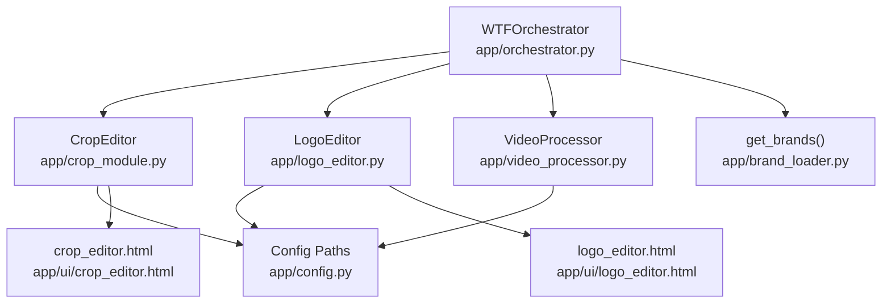
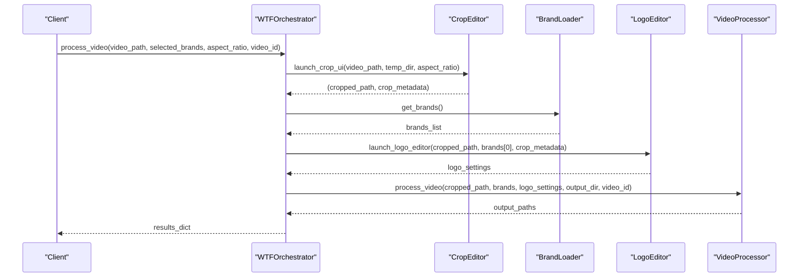
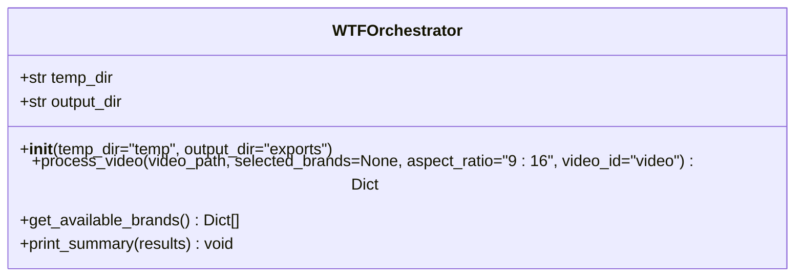
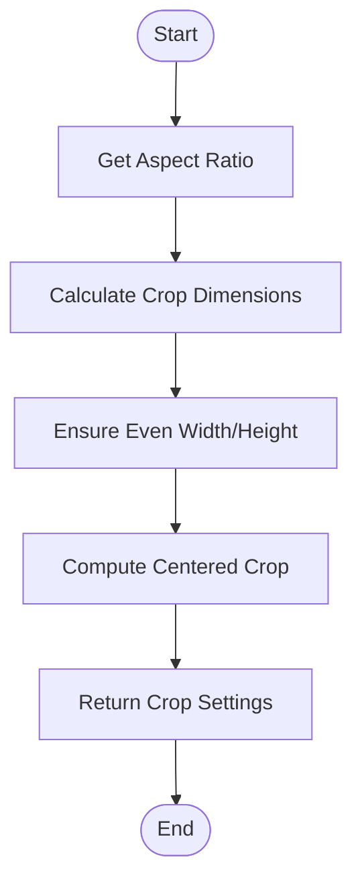
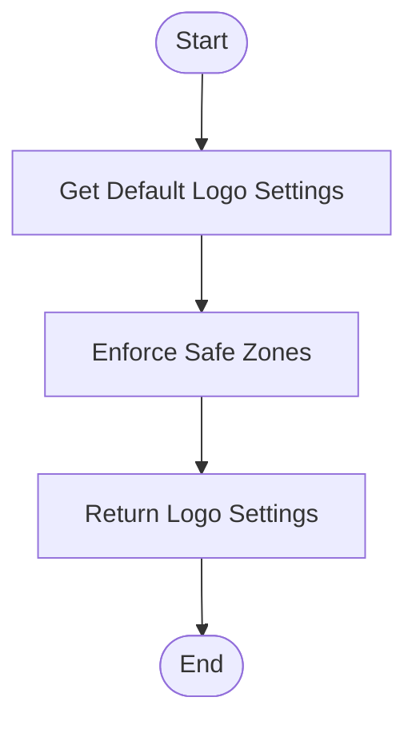
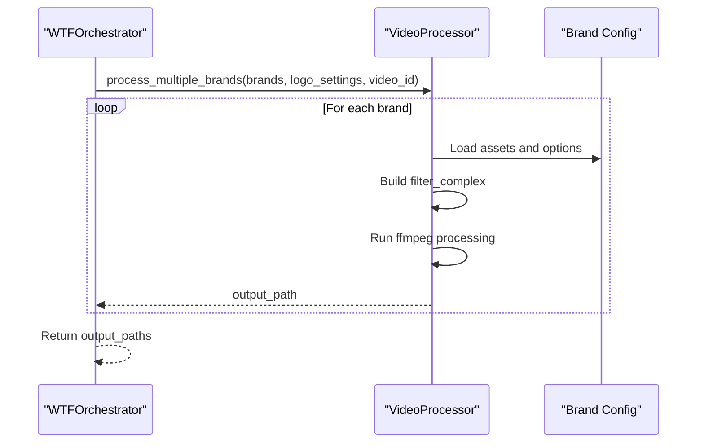
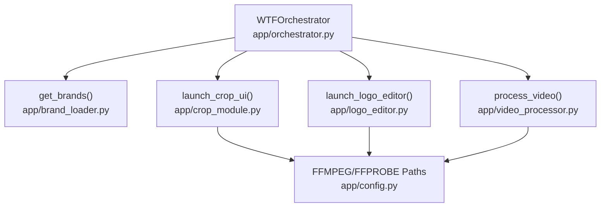

# WTFOrchestrator Class

<cite>
**Referenced Files in This Document**
- [orchestrator.py](file://app/orchestrator.py)
- [crop_module.py](file://app/crop_module.py)
- [logo_editor.py](file://app/logo_editor.py)
- [video_processor.py](file://app/video_processor.py)
- [brand_loader.py](file://app/brand_loader.py)
- [config.py](file://app/config.py)
- [crop_editor.html](file://app/ui/crop_editor.html)
- [logo_editor.html](file://app/ui/logo_editor.html)
- [demo_orchestrator.py](file://demo_orchestrator.py)
</cite>

## Table of Contents
1. [Introduction](#introduction)
2. [Project Structure](#project-structure)
3. [Core Components](#core-components)
4. [Architecture Overview](#architecture-overview)
5. [Detailed Component Analysis](#detailed-component-analysis)
6. [Dependency Analysis](#dependency-analysis)
7. [Performance Considerations](#performance-considerations)
8. [Troubleshooting Guide](#troubleshooting-guide)
9. [Conclusion](#conclusion)

## Introduction
The WTFOrchestrator class is the central coordinator for the WatchTheFall video processing pipeline. It orchestrates a four-stage workflow: video download (via external tools), interactive cropping, logo positioning, and multi-brand export with adaptive watermarks. The orchestrator manages temporary and output directories, coordinates with specialized modules for each stage, and provides a unified interface for processing videos across multiple brands efficiently.

## Project Structure
The orchestrator integrates with several modules and UI components:
- Orchestrator core: coordinates pipeline stages
- Crop module: handles aspect ratio selection and crop application
- Logo editor: positions and sizes logos with safe zones
- Video processor: applies templates, logos, and adaptive watermarks
- Brand loader: discovers and loads brand configurations
- UI components: mobile-friendly crop and logo editors
- Configuration: resolves project paths and binary locations

**Diagram sources**
- [orchestrator.py](file://app/orchestrator.py#L12-L171)
- [crop_module.py](file://app/crop_module.py#L11-L193)
- [logo_editor.py](file://app/logo_editor.py#L11-L132)
- [video_processor.py](file://app/video_processor.py#L13-L273)
- [brand_loader.py](file://app/brand_loader.py#L168-L183)
- [config.py](file://app/config.py#L1-L18)
- [crop_editor.html](file://app/ui/crop_editor.html#L1-L261)
- [logo_editor.html](file://app/ui/logo_editor.html#L1-L254)

**Section sources**
- [orchestrator.py](file://app/orchestrator.py#L1-L172)
- [config.py](file://app/config.py#L1-L18)

## Core Components
- WTFOrchestrator: Main pipeline coordinator with initialization parameters, processing method, brand enumeration, and summary printing.
- CropEditor: Manages aspect ratio selection, calculates crop dimensions, and applies crops using ffmpeg.
- LogoEditor: Positions logos with safe zones and enforces constraints for mobile touch interactions.
- VideoProcessor: Applies brand overlays, adaptive watermarks, and exports to multiple brands.
- BrandLoader: Discovers and loads brand configurations from the imports/brands directory.

Key initialization parameters:
- temp_dir: Temporary directory for intermediate files (default: 'temp')
- output_dir: Output directory for exported videos (default: 'exports')

Core methods:
- process_video(video_path, selected_brands=None, aspect_ratio='9:16', video_id='video'): Executes the full pipeline and returns a structured results dictionary.
- get_available_brands(): Returns all available brand configurations.
- print_summary(results): Prints a formatted summary of the processing run.

**Section sources**
- [orchestrator.py](file://app/orchestrator.py#L23-L119)
- [brand_loader.py](file://app/brand_loader.py#L168-L183)

## Architecture Overview
The orchestrator coordinates four pipeline stages, each handled by dedicated modules. The workflow ensures efficient processing by sharing a single cropped video across multiple brands.

**Diagram sources**
- [orchestrator.py](file://app/orchestrator.py#L29-L115)
- [crop_module.py](file://app/crop_module.py#L174-L192)
- [brand_loader.py](file://app/brand_loader.py#L168-L183)
- [logo_editor.py](file://app/logo_editor.py#L117-L131)
- [video_processor.py](file://app/video_processor.py#L256-L272)

## Detailed Component Analysis

### WTFOrchestrator Class
The orchestrator encapsulates the entire video processing workflow, managing directories, coordinating stages, and aggregating results.

Initialization parameters:
- temp_dir: Directory for temporary files during processing
- output_dir: Directory for final exported videos

Core methods:
- process_video(video_path, selected_brands=None, aspect_ratio='9:16', video_id='video'): Executes the pipeline and returns a results dictionary containing success status, stage outputs, final outputs, and errors.
- get_available_brands(): Returns all discovered brand configurations.
- print_summary(results): Prints a human-readable summary of the run.

Results structure:
- success: Boolean indicating overall pipeline success
- stages: Dictionary containing stage-specific metadata
- outputs: List of exported video paths
- errors: List of error messages encountered

Exception handling:
- Catches exceptions during pipeline execution and appends error messages to results
- Returns partial results when failures occur

Usage patterns:
- Direct instantiation with custom directories
- Convenience orchestrate() function for quick runs

**Section sources**
- [orchestrator.py](file://app/orchestrator.py#L23-L171)

#### Class Diagram

**Diagram sources**
- [orchestrator.py](file://app/orchestrator.py#L12-L171)

### Crop Module
The crop module provides an interactive cropping experience with pinch-to-zoom and drag support, targeting multiple aspect ratios.

Aspect ratios supported:
- 9:16 (vertical, default)
- 1:1 (square)
- 4:5 (portrait)
- 16:9 (landscape)

Key capabilities:
- Calculates crop dimensions based on source video and target aspect ratio
- Generates centered crop settings by default
- Applies ffmpeg filters for crop and optional rotation
- Produces crop metadata for downstream use

Integration:
- Used by orchestrator to produce cropped video and metadata
- Mobile UI available via crop_editor.html

**Section sources**
- [crop_module.py](file://app/crop_module.py#L17-L193)
- [crop_editor.html](file://app/ui/crop_editor.html#L130-L257)

#### Flowchart: Crop Calculation

**Diagram sources**
- [crop_module.py](file://app/crop_module.py#L61-L109)

### Logo Editor
The logo editor enables precise logo positioning with safe zones and pinch-to-resize gestures.

Safe zone enforcement:
- 5% margin from all edges
- Automatic clamping to prevent off-screen placement

Default settings:
- Default logo size: 15% of video width
- Default position: top-left within safe zone

Integration:
- Uses crop metadata to compute safe zones
- Returns logo settings for downstream processing
- Mobile UI available via logo_editor.html

**Section sources**
- [logo_editor.py](file://app/logo_editor.py#L17-L131)
- [logo_editor.html](file://app/ui/logo_editor.html#L107-L242)

#### Flowchart: Logo Positioning

**Diagram sources**
- [logo_editor.py](file://app/logo_editor.py#L57-L114)

### Video Processor
The video processor applies brand-specific overlays with adaptive watermark opacity based on video brightness.

Adaptive watermark opacity:
- Bright videos: 10% opacity
- Dark videos: 20% opacity
- Linear interpolation between extremes

Overlay order:
1. Template overlay (if available)
2. Logo overlay (if settings provided)
3. Watermark overlay with adaptive opacity

Output organization:
- Exports to exports/<brand>/<video_id>.mp4
- Supports multiple brands from a single cropped video

**Section sources**
- [video_processor.py](file://app/video_processor.py#L18-L273)

#### Sequence Diagram: Multi-Brand Export

**Diagram sources**
- [video_processor.py](file://app/video_processor.py#L227-L253)
- [video_processor.py](file://app/video_processor.py#L256-L272)

### Brand Loader
The brand loader discovers and loads brand configurations from the imports/brands directory, supporting both directory scanning and explicit configuration files.

Discovery mechanisms:
- Directory scanning for brand folders
- YAML manifest files for overrides and options
- Asset detection by filename conventions

Configuration structure:
- name: Internal brand identifier
- display_name: Human-readable brand name
- assets: Paths to template, watermark, and logo
- options: Watermark position and scale
- manifests: Manifest files used for discovery

**Section sources**
- [brand_loader.py](file://app/brand_loader.py#L35-L183)

## Dependency Analysis
The orchestrator depends on specialized modules for each pipeline stage and configuration utilities for path resolution.

**Diagram sources**
- [orchestrator.py](file://app/orchestrator.py#L7-L10)
- [crop_module.py](file://app/crop_module.py#L9-L9)
- [logo_editor.py](file://app/logo_editor.py#L9-L9)
- [video_processor.py](file://app/video_processor.py#L11-L11)
- [config.py](file://app/config.py#L11-L13)

**Section sources**
- [orchestrator.py](file://app/orchestrator.py#L5-L10)
- [config.py](file://app/config.py#L11-L17)

## Performance Considerations
- Single crop reuse: The orchestrator produces one cropped video and reuses it across all selected brands, minimizing redundant processing.
- Adaptive watermark opacity: Reduces computational overhead by avoiding per-brand brightness calculations in the UI.
- Safe zone enforcement: Prevents off-screen logos, reducing post-processing corrections.
- Mobile UI efficiency: Web-based editors minimize CPU usage compared to heavy desktop applications.
- Directory organization: Separate temp and output directories prevent I/O contention and enable parallel processing.

## Troubleshooting Guide
Common issues and resolutions:
- Missing ffmpeg/ffprobe: Ensure binaries are installed and accessible via PATH or set environment variables FFMPEG_PATH and FFPROBE_PATH.
- Empty brand directory: Verify imports/brands contains properly named brand folders with required assets (template.png, watermark.png, logo.png).
- No brands found: Check selected_brands parameter and brand folder names; ensure display_name or name matches selection criteria.
- Crop UI not responding: Confirm crop_editor.html is served and network connectivity allows API calls to /api/crop/confirm.
- Logo editor constraints: Adjust logo scale within 10-30% and ensure position remains within 5% safe zones.

Error handling:
- Exceptions during pipeline stages are caught and appended to results['errors']
- Results dictionary includes stage metadata for debugging
- print_summary() provides a consolidated view of successes and failures

**Section sources**
- [orchestrator.py](file://app/orchestrator.py#L111-L115)
- [logo_editor.py](file://app/logo_editor.py#L79-L93)
- [video_processor.py](file://app/video_processor.py#L220-L225)

## Conclusion
The WTFOrchestrator class provides a robust, modular framework for multi-brand video processing. By coordinating specialized modules for cropping, logo positioning, and adaptive watermarking, it enables efficient, scalable video exports across numerous brands. The mobile-friendly UI components and comprehensive error handling make it suitable for both automated and manual workflows, while the directory-based architecture supports large-scale batch processing.