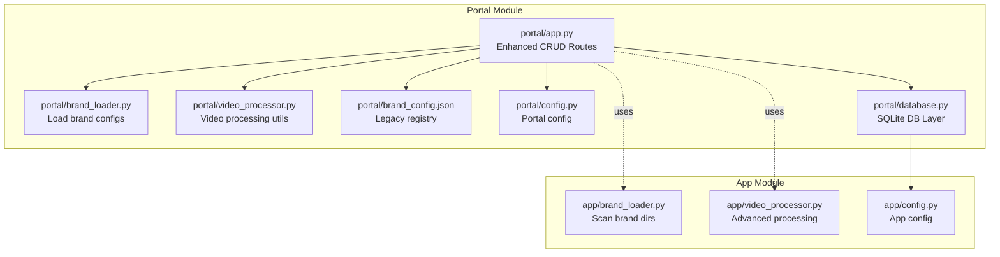
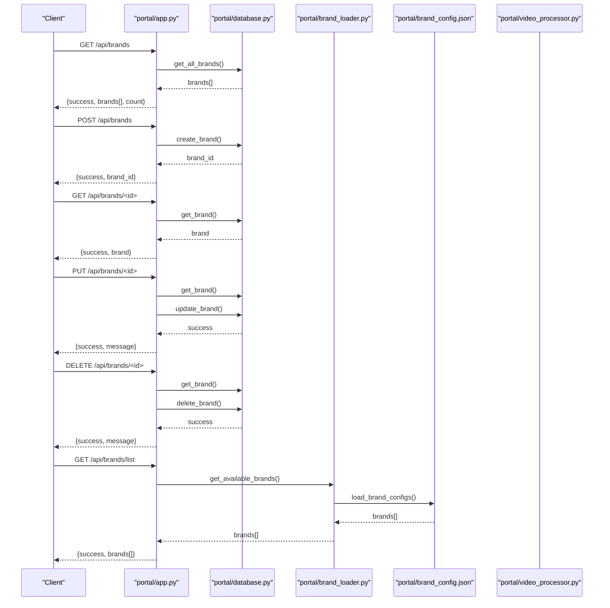
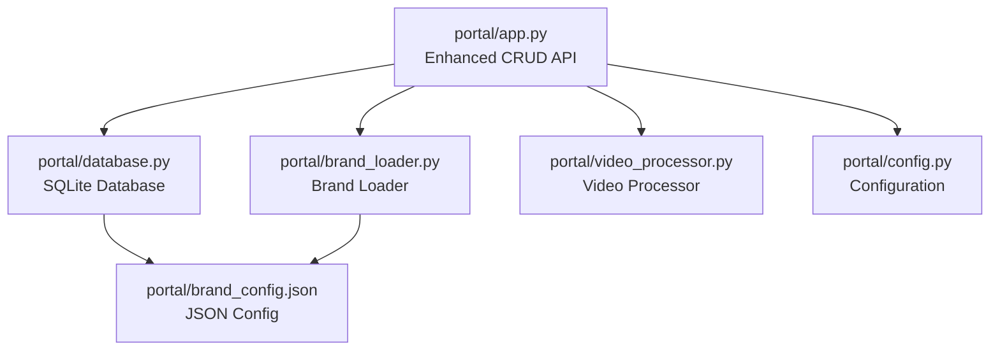

# Brand Management Endpoints

<cite>
**Referenced Files in This Document**
- [portal/app.py](file://portal/app.py)
- [portal/brand_loader.py](file://portal/brand_loader.py)
- [portal/video_processor.py](file://portal/video_processor.py)
- [portal/brand_config.json](file://portal/brand_config.json)
- [portal/config.py](file://portal/config.py)
- [portal/database.py](file://portal/database.py)
- [app/brand_loader.py](file://app/brand_loader.py)
- [app/video_processor.py](file://app/video_processor.py)
- [app/config.py](file://app/config.py)
- [portal/templates/clean_dashboard.html](file://portal/templates/clean_dashboard.html)
</cite>

## Update Summary
**Changes Made**
- Enhanced from simple GET endpoint to comprehensive CRUD API with full brand management capabilities
- Added POST /api/brands for brand creation with user ownership and system brand support
- Added PUT /api/brands/<id> for brand updates with lock validation for system templates
- Added DELETE /api/brands/<id> for soft deletion with system brand protection
- Added GET /api/brands for listing brands with user_id filtering and system brand support
- Added GET /api/brands/<id> for individual brand retrieval
- Added brand configuration persistence with per-brand settings storage
- Enhanced error handling with detailed validation and system brand protection
- Updated brand configuration schema to support advanced watermark and logo settings

## Table of Contents
1. [Introduction](#introduction)
2. [Project Structure](#project-structure)
3. [Core Components](#core-components)
4. [Architecture Overview](#architecture-overview)
5. [Detailed Component Analysis](#detailed-component-analysis)
6. [Dependency Analysis](#dependency-analysis)
7. [Performance Considerations](#performance-considerations)
8. [Troubleshooting Guide](#troubleshooting-guide)
9. [Conclusion](#conclusion)

## Introduction
This document provides comprehensive API documentation for brand management endpoints focused on comprehensive brand lifecycle management. The system has evolved from simple brand retrieval to a full CRUD API supporting brand creation, modification, and deletion with advanced features including user ownership, system brand protection, and detailed configuration management.

Key endpoints covered:
- **GET /api/brands**: List all brands with user filtering and system brand support
- **GET /api/brands/<id>**: Retrieve individual brand by ID
- **POST /api/brands**: Create new brands with user ownership and system brand capabilities
- **PUT /api/brands/<id>**: Update brand settings with lock validation for system templates
- **DELETE /api/brands/<id>**: Soft delete brands with system brand protection
- **GET /api/brands/list**: Retrieve available brand configurations with filtering and metadata
- **GET /api/brands/<brand_name>/config**: Get saved configuration for a brand
- **POST /api/brands/<brand_name>/config**: Save configuration for a brand
- **GET /api/debug/brand-integrity**: Check brand asset completeness and validation
- **GET /api/debug/build-filter/<brand_name>**: Dry-run FFmpeg filter generation with debugging capabilities

The documentation covers brand configuration schemas, asset requirements, error responses, brand-specific parameters, template options, watermark settings, and advanced features like user ownership and system brand protection.

## Project Structure
The brand management functionality spans multiple modules with enhanced database integration:

- **Portal module**: Flask application with comprehensive brand management endpoints and database integration
- **Database module**: SQLite-based storage for brand configurations and user ownership
- **App module**: Contains brand discovery and processing logic used by the portal

Key directories and files:
- **portal/app.py**: Flask application with enhanced CRUD endpoints and brand management
- **portal/database.py**: Database schema and operations for brands, configurations, and jobs
- **portal/brand_loader.py**: Loads brand configurations from database with fallback to JSON
- **portal/video_processor.py**: Video processing utilities used by debug endpoints
- **portal/brand_config.json**: Legacy brand configuration registry (fallback)
- **portal/config.py**: Portal configuration constants
- **app/brand_loader.py**: Scans brand directories and generates brand manifests
- **app/video_processor.py**: Advanced video processing with adaptive watermark opacity
- **app/config.py**: App configuration constants

**Diagram sources**
- [portal/app.py](file://portal/app.py#L1057-L1202)
- [portal/brand_loader.py](file://portal/brand_loader.py#L49-L162)
- [portal/video_processor.py](file://portal/video_processor.py#L1-L500)
- [portal/brand_config.json](file://portal/brand_config.json#L1-L302)
- [portal/config.py](file://portal/config.py#L1-L42)
- [portal/database.py](file://portal/database.py#L1-L623)
- [app/brand_loader.py](file://app/brand_loader.py#L1-L499)
- [app/video_processor.py](file://app/video_processor.py#L1-L273)
- [app/config.py](file://app/config.py#L1-L18)

**Section sources**
- [portal/app.py](file://portal/app.py#L1057-L1202)
- [portal/brand_loader.py](file://portal/brand_loader.py#L49-L162)
- [portal/video_processor.py](file://portal/video_processor.py#L1-L500)
- [portal/brand_config.json](file://portal/brand_config.json#L1-L302)
- [portal/config.py](file://portal/config.py#L1-L42)
- [portal/database.py](file://portal/database.py#L1-L623)
- [app/brand_loader.py](file://app/brand_loader.py#L1-L499)
- [app/video_processor.py](file://app/video_processor.py#L1-L273)
- [app/config.py](file://app/config.py#L1-L18)

## Core Components
This section documents the comprehensive brand management endpoints and their enhanced behavior.

### GET /api/brands
Purpose: List all brands with filtering capabilities and system brand support.

Behavior:
- Retrieves all brands from the database with optional user filtering
- Supports user_id parameter for user-specific brand retrieval
- Includes system brand filtering via include_system parameter
- Returns comprehensive brand metadata including ownership and configuration

Query parameters:
- user_id: Integer user ID to filter brands (optional)
- include_system: Boolean to include system brands (default: true)

Response format:
- success: Boolean indicating operation success
- brands: Array of brand objects with keys:
  - id: Unique brand identifier
  - name: Internal brand identifier
  - display_name: Human-readable brand name
  - user_id: User who owns the brand (nullable for system brands)
  - is_system: Boolean indicating if brand is system-owned
  - is_locked: Boolean indicating if brand is protected from modifications
  - is_active: Boolean indicating if brand is currently active
  - watermark_vertical: Path to vertical watermark asset
  - watermark_square: Path to square watermark asset
  - watermark_landscape: Path to landscape watermark asset
  - logo_path: Path to brand logo asset
  - options: Brand-specific configuration options
- count: Total number of brands returned

Example request:
- GET /api/brands?user_id=123&include_system=true

Example response:
{
  "success": true,
  "brands": [
    {
      "id": 1,
      "name": "ScotlandWTF",
      "display_name": "ScotlandWTF",
      "user_id": 123,
      "is_system": false,
      "is_locked": false,
      "is_active": true,
      "watermark_vertical": "WTF_MASTER_ASSETS/Branding/Watermarks/Vertical_HD/Scotland_watermark.png",
      "watermark_square": "WTF_MASTER_ASSETS/Branding/Watermarks/Square/Scotland_watermark.png",
      "watermark_landscape": "WTF_MASTER_ASSETS/Branding/Watermarks/Landscape/Scotland_watermark.png",
      "logo_path": "WTF_MASTER_ASSETS/Branding/Logos/Circle/ScotlandWTF_logo.png",
      "options": {
        "watermark_scale": 1.15,
        "watermark_opacity": 0.4,
        "logo_scale": 0.15,
        "logo_padding": 40,
        "text_enabled": false,
        "text_content": "",
        "text_position": "bottom",
        "text_size": 48,
        "text_color": "#FFFFFF",
        "text_font": "Arial",
        "text_bg_enabled": true,
        "text_bg_color": "#000000",
        "text_bg_opacity": 0.6,
        "text_margin": 40
      }
    }
  ],
  "count": 1
}

Error responses:
- 500 Internal Server Error: Database connection failure

**Section sources**
- [portal/app.py](file://portal/app.py#L1057-L1073)
- [portal/database.py](file://portal/database.py#L409-L430)

### GET /api/brands/<id>
Purpose: Retrieve individual brand by ID.

Behavior:
- Fetches a specific brand by its unique identifier
- Returns full brand details including configuration and ownership
- Handles brand not found scenarios gracefully

Response format:
- success: Boolean indicating operation success
- brand: Brand object with all properties (same schema as GET /api/brands)

Example request:
- GET /api/brands/1

Example response:
{
  "success": true,
  "brand": {
    "id": 1,
    "name": "ScotlandWTF",
    "display_name": "ScotlandWTF",
    "user_id": 123,
    "is_system": false,
    "is_locked": false,
    "is_active": true,
    "watermark_vertical": "WTF_MASTER_ASSETS/Branding/Watermarks/Vertical_HD/Scotland_watermark.png",
    "watermark_square": "WTF_MASTER_ASSETS/Branding/Watermarks/Square/Scotland_watermark.png",
    "watermark_landscape": "WTF_MASTER_ASSETS/Branding/Watermarks/Landscape/Scotland_watermark.png",
    "logo_path": "WTF_MASTER_ASSETS/Branding/Logos/Circle/ScotlandWTF_logo.png",
    "options": {
      "watermark_scale": 1.15,
      "watermark_opacity": 0.4,
      "logo_scale": 0.15,
      "logo_padding": 40,
      "text_enabled": false,
      "text_content": "",
      "text_position": "bottom",
      "text_size": 48,
      "text_color": "#FFFFFF",
      "text_font": "Arial",
      "text_bg_enabled": true,
      "text_bg_color": "#000000",
      "text_bg_opacity": 0.6,
      "text_margin": 40
    }
  }
}

Error responses:
- 404 Not Found: Brand with specified ID does not exist
- 500 Internal Server Error: Database query failure

**Section sources**
- [portal/app.py](file://portal/app.py#L1075-L1090)
- [portal/database.py](file://portal/database.py#L389-L407)

### POST /api/brands
Purpose: Create new brands with comprehensive configuration support.

Behavior:
- Creates a new brand with specified properties
- Supports user ownership via user_id parameter
- Handles system brand creation with is_system flag
- Validates required fields (name is mandatory)
- Supports multiple watermark orientations and logo paths
- Stores comprehensive configuration options

Request body parameters:
- name: Required string - Unique brand identifier
- display_name: String - Human-readable brand name (defaults to name)
- user_id: Integer - User who owns the brand (optional)
- is_system: Boolean - System-owned brand flag (default: false)
- is_locked: Boolean - Lock brand from modifications (default: false)
- watermark_vertical: String - Path to vertical watermark asset
- watermark_square: String - Path to square watermark asset
- watermark_landscape: String - Path to landscape watermark asset
- logo_path: String - Path to brand logo asset
- All configuration options from the brand configuration schema

Response format:
- success: Boolean indicating operation success
- brand_id: ID of the newly created brand
- message: Confirmation message

Example request:
{
  "name": "CustomBrand",
  "display_name": "Custom Brand",
  "user_id": 123,
  "is_system": false,
  "watermark_vertical": "custom/vertical_watermark.png",
  "watermark_square": "custom/square_watermark.png",
  "watermark_landscape": "custom/landscape_watermark.png",
  "logo_path": "custom/logo.png",
  "watermark_scale": 1.2,
  "watermark_opacity": 0.5,
  "logo_scale": 0.2,
  "logo_padding": 50
}

Example response:
{
  "success": true,
  "brand_id": 456,
  "message": "Brand CustomBrand created"
}

Error responses:
- 400 Bad Request: Missing required fields (name)
- 500 Internal Server Error: Database insertion failure

**Section sources**
- [portal/app.py](file://portal/app.py#L1092-L1139)
- [portal/database.py](file://portal/database.py#L432-L472)

### PUT /api/brands/<id>
Purpose: Update brand settings and assets with system brand protection.

Behavior:
- Updates an existing brand by ID
- Performs system brand lock validation
- Allows selective field updates via allowed_fields
- Maintains audit trail with updated_at timestamp
- Supports configuration option updates

Validation rules:
- Brand must exist
- System brands (is_system = true) cannot be modified
- Locked brands (is_locked = true) cannot be modified

Allowed update fields:
- name, display_name, is_active, is_locked
- watermark_vertical, watermark_square, watermark_landscape, logo_path
- All configuration options (watermark_scale, watermark_opacity, logo_scale, etc.)

Example request:
{
  "watermark_scale": 1.3,
  "watermark_opacity": 0.6,
  "logo_scale": 0.25
}

Example response:
{
  "success": true,
  "message": "Brand CustomBrand updated"
}

Error responses:
- 404 Not Found: Brand with specified ID does not exist
- 403 Forbidden: Brand is locked or system-protected
- 500 Internal Server Error: Database update failure

**Section sources**
- [portal/app.py](file://portal/app.py#L1145-L1174)
- [portal/database.py](file://portal/database.py#L474-L515)

### DELETE /api/brands/<id>
Purpose: Soft delete brands with system brand protection.

Behavior:
- Soft deletes a brand by setting is_active = 0
- Prevents deletion of system brands (is_system = true)
- Maintains brand history for audit purposes
- Updates audit timestamp

Deletion protection:
- System brands cannot be deleted
- Soft delete preserves data integrity

Example response:
{
  "success": true,
  "message": "Brand CustomBrand deleted"
}

Error responses:
- 404 Not Found: Brand with specified ID does not exist
- 403 Forbidden: Cannot delete system brand
- 500 Internal Server Error: Database update failure

**Section sources**
- [portal/app.py](file://portal/app.py#L1176-L1202)
- [portal/database.py](file://portal/database.py#L517-L525)

### Enhanced GET /api/brands/list
Purpose: Retrieve available brand configurations with filtering and metadata.

Behavior:
- Loads brand configurations from the portal's brand registry
- Supports filtering by brand name and display name
- Returns metadata including assets and options
- Integrates with database-managed brands

Response format:
- success: Boolean indicating operation success
- brands: Array of brand objects with keys:
  - name: Internal brand identifier
  - display_name: Human-readable brand name

Filtering:
- Query parameters:
  - q: Search term to filter brands by name or display_name
  - include_assets: Boolean to include asset paths in response

Example request:
- GET /api/brands/list?q=Scotland&include_assets=true

Example response:
{
  "success": true,
  "brands": [
    {
      "name": "ScotlandWTF",
      "display_name": "ScotlandWTF"
    }
  ]
}

Error responses:
- 500 Internal Server Error: Registry loading failure

**Section sources**
- [portal/app.py](file://portal/app.py#L977-L993)
- [portal/brand_loader.py](file://portal/brand_loader.py#L48-L59)

### GET /api/brands/<brand_name>/config
Purpose: Get saved configuration for a brand.

Behavior:
- Retrieves persisted brand configuration from database
- Returns default values if no configuration exists
- Supports per-brand customization for watermark and text settings

Response format:
- success: Boolean indicating operation success
- config: Brand configuration object with all settings

Example response:
{
  "success": true,
  "config": {
    "brand_name": "ScotlandWTF",
    "watermark_scale": 1.15,
    "watermark_opacity": 0.4,
    "logo_scale": 0.15,
    "logo_padding": 40,
    "text_enabled": false,
    "text_content": "",
    "text_position": "bottom",
    "text_size": 48,
    "text_color": "#FFFFFF",
    "text_font": "Arial",
    "text_bg_enabled": true,
    "text_bg_color": "#000000",
    "text_bg_opacity": 0.6,
    "text_margin": 40
  }
}

Error responses:
- 500 Internal Server Error: Database query failure

**Section sources**
- [portal/app.py](file://portal/app.py#L995-L1009)
- [portal/database.py](file://portal/database.py#L265-L293)

### POST /api/brands/<brand_name>/config
Purpose: Save configuration for a brand.

Behavior:
- Persists brand configuration to database
- Supports partial configuration updates
- Converts boolean values appropriately
- Updates timestamps for audit trails

Configuration options:
- watermark_scale: Float - Watermark scaling factor
- watermark_opacity: Float - Watermark transparency (0-1)
- logo_scale: Float - Logo scaling factor
- logo_padding: Integer - Logo padding in pixels
- text_enabled: Boolean - Enable/disable text overlay
- text_content: String - Text content for overlay
- text_position: String - Text position (top, bottom, center)
- text_size: Integer - Text font size
- text_color: String - Text color in hex format
- text_font: String - Font family
- text_bg_enabled: Boolean - Enable/disable text background
- text_bg_color: String - Background color in hex format
- text_bg_opacity: Float - Background transparency (0-1)
- text_margin: Integer - Background margin in pixels

Example request:
{
  "watermark_scale": 1.25,
  "watermark_opacity": 0.5,
  "text_enabled": true,
  "text_content": "Custom Text",
  "text_position": "top"
}

Example response:
{
  "success": true,
  "message": "Configuration saved for ScotlandWTF",
  "config": {
    "brand_name": "ScotlandWTF",
    "watermark_scale": 1.25,
    "watermark_opacity": 0.5,
    "logo_scale": 0.15,
    "logo_padding": 40,
    "text_enabled": true,
    "text_content": "Custom Text",
    "text_position": "top",
    "text_size": 48,
    "text_color": "#FFFFFF",
    "text_font": "Arial",
    "text_bg_enabled": true,
    "text_bg_color": "#000000",
    "text_bg_opacity": 0.6,
    "text_margin": 40
  }
}

Error responses:
- 500 Internal Server Error: Database insertion/update failure

**Section sources**
- [portal/app.py](file://portal/app.py#L1011-L1051)
- [portal/database.py](file://portal/database.py#L295-L374)

### GET /api/debug/brand-integrity
Purpose: Check brand asset completeness and validation.

Behavior:
- Scans the portal's brand directory for required assets
- Verifies presence of template.png, logo.png, and watermark.png per brand
- Returns a structured report of asset availability

Response format:
- success: Boolean indicating operation success
- brands: Object keyed by brand name with:
  - template.png: Boolean indicating presence
  - logo.png: Boolean indicating presence
  - watermark.png: Boolean indicating presence
  - path: Absolute path to brand assets

Example response:
{
  "success": true,
  "brands": {
    "ScotlandWTF": {
      "template.png": true,
      "logo.png": true,
      "watermark.png": true,
      "path": "/absolute/path/to/portal/imports/brands/ScotlandWTF"
    }
  }
}

Error responses:
- 500 Internal Server Error: Brand directory not found

Usage:
- Useful for pre-processing validation before video branding
- Can be invoked via the portal UI under Debug Tools

**Section sources**
- [portal/app.py](file://portal/app.py#L1196-L1224)
- [portal/app.py](file://portal/app.py#L279-L283)
- [portal/app.py](file://portal/app.py#L237-L238)

### GET /api/debug/build-filter/<brand_name>
Purpose: Dry-run FFmpeg filter generation with debugging capabilities.

Behavior:
- Locates a brand by name (case-insensitive)
- Generates a filter_complex string without requiring a real video
- Uses a null device to avoid ffprobe errors during initialization

Response format:
- success: Boolean indicating operation success
- brand: Name of the brand used for generation
- filter_complex: Generated FFmpeg filter string

Example response:
{
  "success": true,
  "brand": "ScotlandWTF",
  "filter_complex": "movie='.../ScotlandWTF/template.png',scale=W:H[template];[0:v][template]overlay=0:0[v1];movie='.../ScotlandWTF/watermark.png',scale=0.25W:-1,format=rgba,colorchannelmixer=aa=0.4[watermark];[v1][watermark]overlay=W-w-safe_margin:H-h-safe_margin"
}

Error responses:
- 404 Not Found: Brand not found
- 500 Internal Server Error: General processing failure

Usage:
- Validates overlay pipeline before actual video processing
- Useful for debugging positioning and scaling issues

**Section sources**
- [portal/app.py](file://portal/app.py#L1228-L1256)
- [portal/app.py](file://portal/app.py#L284-L288)

## Architecture Overview
The enhanced brand management system integrates comprehensive CRUD operations with database-backed storage and advanced validation.

**Diagram sources**
- [portal/app.py](file://portal/app.py#L1057-L1202)
- [portal/database.py](file://portal/database.py#L389-L525)
- [portal/brand_loader.py](file://portal/brand_loader.py#L49-L162)
- [portal/brand_config.json](file://portal/brand_config.json#L1-L302)
- [portal/video_processor.py](file://portal/video_processor.py#L228-L314)

## Detailed Component Analysis

### Enhanced Brand Configuration Schema
The brand management system now supports comprehensive configuration through both database storage and JSON fallback:

**Database Brand Schema:**
- id: Auto-increment integer primary key
- name: Unique brand identifier
- display_name: Human-readable brand name
- user_id: Integer user who owns the brand (nullable)
- is_system: Boolean system-owned brand flag
- is_locked: Boolean lock flag preventing modifications
- is_active: Boolean active status (soft delete)
- watermark_vertical: Path to vertical orientation watermark
- watermark_square: Path to square orientation watermark
- watermark_landscape: Path to landscape orientation watermark
- logo_path: Path to brand logo asset
- All configuration options (watermark_scale, watermark_opacity, logo_scale, etc.)

**Brand Configuration Options:**
- watermark_scale: Float (default: 1.15) - Watermark scaling factor
- watermark_opacity: Float (default: 0.4) - Watermark transparency (0-1)
- logo_scale: Float (default: 0.15) - Logo scaling factor
- logo_padding: Integer (default: 40) - Logo padding in pixels
- text_enabled: Boolean (default: false) - Enable/disable text overlay
- text_content: String (default: "") - Text content for overlay
- text_position: String (default: "bottom") - Text position (top, bottom, center)
- text_size: Integer (default: 48) - Text font size
- text_color: String (default: "#FFFFFF") - Text color in hex format
- text_font: String (default: "Arial") - Font family
- text_bg_enabled: Boolean (default: true) - Enable/disable text background
- text_bg_color: String (default: "#000000") - Background color in hex format
- text_bg_opacity: Float (default: 0.6) - Background transparency (0-1)
- text_margin: Integer (default: 40) - Background margin in pixels

**Asset Requirements:**
- Multiple watermark orientations supported (vertical, square, landscape)
- Logo asset path required for brand identification
- Optional template assets for advanced overlay processing

**Section sources**
- [portal/database.py](file://portal/database.py#L92-L124)
- [portal/database.py](file://portal/database.py#L265-L293)
- [portal/brand_config.json](file://portal/brand_config.json#L1-L302)

### Database-Backed Brand Management
The system now uses SQLite for comprehensive brand lifecycle management:

**Database Initialization:**
- Two main tables: brands (unified brand management) and brand_configs (per-brand settings)
- Foreign key relationships and constraints for data integrity
- Audit timestamps for tracking changes

**CRUD Operations:**
- **Create**: create_brand() with comprehensive parameter validation
- **Read**: get_brand() and get_all_brands() with filtering and sorting
- **Update**: update_brand() with selective field updates and validation
- **Delete**: delete_brand() with soft delete and system protection

**Advanced Features:**
- User ownership tracking for brand access control
- System brand protection with is_system and is_locked flags
- Multi-orientation watermark support for different aspect ratios
- Comprehensive configuration persistence for per-brand customization

**Section sources**
- [portal/database.py](file://portal/database.py#L9-L128)
- [portal/database.py](file://portal/database.py#L432-L525)

### Enhanced Brand Discovery and Loading
The brand loader now integrates database operations with JSON fallback:

**Database Priority:**
- First attempts to load brands from SQLite database
- Falls back to legacy JSON configuration if database is empty
- Provides unified interface for both systems

**Advanced Loading Features:**
- User-specific brand filtering via user_id parameter
- System brand inclusion/exclusion control
- Comprehensive brand configuration transformation
- Error handling and graceful degradation

**Integration Points:**
- Used by GET /api/brands endpoints for listing brands
- Used by GET /api/brands/<id> for individual brand retrieval
- Used by debug endpoints for brand validation

**Section sources**
- [portal/brand_loader.py](file://portal/brand_loader.py#L49-L162)

### System Brand Protection and Ownership
The enhanced system includes robust protection mechanisms:

**System Brand Protection:**
- is_system flag prevents modification and deletion
- is_locked flag provides additional protection for critical brands
- Soft delete mechanism preserves data integrity

**User Ownership:**
- user_id field tracks brand ownership
- Access control for brand modifications
- Private brand visibility and management

**Validation Rules:**
- System brands cannot be deleted
- Locked brands cannot be modified
- Required fields validation during creation
- Unique constraint on (name, user_id) combination

**Section sources**
- [portal/database.py](file://portal/database.py#L410-L430)
- [portal/app.py](file://portal/app.py#L1156-L1158)
- [portal/app.py](file://portal/app.py#L1187-L1189)

### Debug Brand Integrity
The integrity check scans the brand directory and reports asset presence with enhanced coverage:

**Enhanced Coverage:**
- Multi-orientation watermark validation (vertical, square, landscape)
- Logo asset verification across all brands
- Path resolution and accessibility checking
- Structured availability reporting

**Common Issues Detected:**
- Missing assets for specific brands
- Incorrect asset naming conventions
- Absence of brand directories
- Broken symbolic links or invalid paths

**Section sources**
- [portal/app.py](file://portal/app.py#L1196-L1224)

### Dry-Run Filter Generation
The filter builder generates FFmpeg filter_complex strings for debugging with enhanced brand support:

**Enhanced Features:**
- Database-driven brand configuration integration
- Multi-orientation watermark support
- Per-brand configuration application
- Comprehensive error handling and validation

**Use Cases:**
- Verifying overlay positions and scales
- Validating filter syntax before processing videos
- Debugging performance issues with complex filters
- Testing brand-specific configurations

**Section sources**
- [portal/app.py](file://portal/app.py#L1228-L1256)
- [portal/video_processor.py](file://portal/video_processor.py#L228-L314)

## Dependency Analysis
The enhanced brand management system depends on comprehensive database integration and configuration management.

**Diagram sources**
- [portal/app.py](file://portal/app.py#L1057-L1202)
- [portal/database.py](file://portal/database.py#L1-L623)
- [portal/brand_loader.py](file://portal/brand_loader.py#L1-L162)
- [portal/brand_config.json](file://portal/brand_config.json#L1-L302)
- [portal/video_processor.py](file://portal/video_processor.py#L1-L500)
- [portal/config.py](file://portal/config.py#L1-L42)

**Section sources**
- [portal/app.py](file://portal/app.py#L1057-L1202)
- [portal/database.py](file://portal/database.py#L1-L623)
- [portal/brand_loader.py](file://portal/brand_loader.py#L1-L162)
- [portal/brand_config.json](file://portal/brand_config.json#L1-L302)
- [portal/video_processor.py](file://portal/video_processor.py#L1-L500)
- [portal/config.py](file://portal/config.py#L1-L42)

## Performance Considerations
- **Brand listing**: Database queries with filtering and sorting; consider indexing on user_id and is_system fields
- **CRUD operations**: Database transactions with proper connection pooling; optimize for concurrent access
- **Configuration persistence**: Efficient INSERT/UPDATE operations with proper parameter binding
- **Integrity checks**: Directory scanning is lightweight but can be slow with many brands; cache results when possible
- **Filter generation**: Dry-run builds filters without video processing; overhead is minimal but avoid excessive concurrent requests
- **Database operations**: Proper indexing on frequently queried fields (name, user_id, is_system, is_active)
- **Memory usage**: Large brand datasets should be paginated or filtered appropriately

## Troubleshooting Guide
Common issues and resolutions for the enhanced brand management system:

**CRUD Operation Issues:**
- **Brand not found in GET /api/brands/<id>**:
  - Verify brand ID exists in database
  - Check user_id parameter for private brands
  - Confirm brand is not soft-deleted (is_active = 1)
- **Permission denied in PUT /api/brands/<id>**:
  - Verify brand is not system-protected (is_system = true)
  - Check if brand is locked (is_locked = true)
  - Ensure user has proper ownership rights
- **Cannot delete brand in DELETE /api/brands/<id>**:
  - System brands cannot be deleted regardless of user permissions
  - Check if brand is already soft-deleted

**Configuration Issues:**
- **Missing configuration in GET /api/brands/<brand_name>/config**:
  - Default configuration will be returned if none exists
  - Verify brand_name matches database records
  - Check database connectivity and permissions
- **Invalid configuration values in POST /api/brands/<brand_name>/config**:
  - Validate numeric ranges (watermark_opacity 0-1, logo_padding positive)
  - Check text_position allowed values (top, bottom, center)
  - Ensure color values are valid hex codes

**Database Issues:**
- **Database connection failures**:
  - Verify DB_PATH configuration in portal/config.py
  - Check file permissions for database file
  - Ensure SQLite is properly installed and accessible
- **Constraint violations**:
  - Check for duplicate brand names with same user_id
  - Verify unique constraints are respected
  - Review foreign key relationships

**Asset and Path Issues:**
- **Brand integrity validation failures**:
  - Verify asset paths exist and are accessible
  - Check file permissions for brand assets
  - Ensure relative paths resolve correctly from project root
- **Filter generation failures**:
  - Validate brand assets are accessible
  - Confirm FFmpeg binary paths in portal/config.py are correct
  - Check watermark orientation assets exist for multi-orientation brands

**Section sources**
- [portal/app.py](file://portal/app.py#L1057-L1202)
- [portal/database.py](file://portal/database.py#L517-L525)
- [portal/config.py](file://portal/config.py#L26-L28)

## Conclusion
The enhanced brand management system provides a comprehensive foundation for brand lifecycle management with full CRUD capabilities, user ownership tracking, system brand protection, and advanced configuration persistence. The transition from simple GET endpoints to a full CRUD API enables sophisticated brand management scenarios including user-specific branding, system brand protection, and detailed configuration customization. By understanding the enhanced configuration schema, database-backed operations, and comprehensive validation rules, developers can effectively manage brand overlays, implement custom branding solutions, and troubleshoot complex brand management issues.