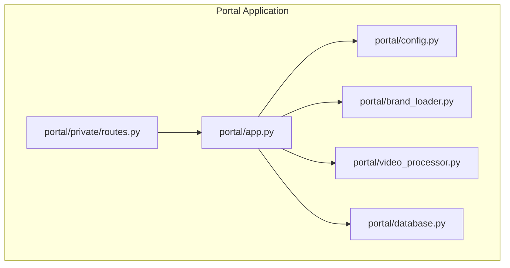
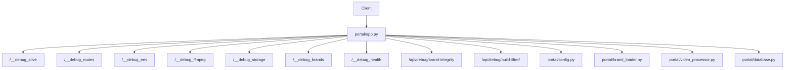
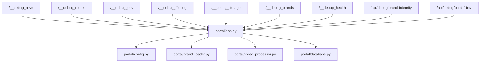

# Debug and Health Endpoints

<cite>
**Referenced Files in This Document**
- [app.py](file://portal/app.py)
- [config.py](file://portal/config.py)
- [brand_loader.py](file://portal/brand_loader.py)
- [brand_config.json](file://portal/brand_config.json)
- [video_processor.py](file://portal/video_processor.py)
- [database.py](file://portal/database.py)
- [routes.py](file://portal/private/routes.py)
</cite>

## Table of Contents
1. [Introduction](#introduction)
2. [Project Structure](#project-structure)
3. [Core Components](#core-components)
4. [Architecture Overview](#architecture-overview)
5. [Detailed Component Analysis](#detailed-component-analysis)
6. [Dependency Analysis](#dependency-analysis)
7. [Performance Considerations](#performance-considerations)
8. [Troubleshooting Guide](#troubleshooting-guide)
9. [Conclusion](#conclusion)

## Introduction
This document describes the debug and health endpoints exposed by the WatchTheFall Portal application. These endpoints support operational diagnostics, environment inspection, media pipeline validation, storage health checks, and comprehensive system health assessments. They are designed to be used by operators and developers to quickly verify service availability, discover API routes, inspect environment variables (with sensitive data masking), validate FFmpeg binaries, check storage directories and disk usage, validate brand assets, and assess overall system health.

## Project Structure
The debug endpoints are implemented within the main Flask application module alongside the primary API routes. Supporting modules provide configuration, brand asset loading, and video processing utilities that underpin the health and validation logic.

**Diagram sources**
- [app.py](file://portal/app.py#L44-L53)
- [config.py](file://portal/config.py#L6-L41)
- [brand_loader.py](file://portal/brand_loader.py#L48-L59)
- [video_processor.py](file://portal/video_processor.py#L11-L18)
- [database.py](file://portal/database.py#L9-L69)
- [routes.py](file://portal/private/routes.py#L1-L29)

**Section sources**
- [app.py](file://portal/app.py#L44-L53)
- [config.py](file://portal/config.py#L6-L41)

## Core Components
This section documents each debug and health endpoint, including purpose, HTTP method, path, response shape, and operational behavior.

- GET /__debug_alive
  - Purpose: Verify service availability and basic routing.
  - Method: GET
  - Path: /__debug_alive
  - Response: Plain text "alive" with HTTP 200 OK.
  - Notes: Minimal endpoint to confirm the server responds.

- GET /__debug_routes
  - Purpose: Enumerate all registered Flask routes for API discovery.
  - Method: GET
  - Path: /__debug_routes
  - Response: JSON object containing status and a list of routes with endpoint, methods, and rule.
  - Notes: Useful for clients to programmatically discover available endpoints.

- GET /__debug_env
  - Purpose: Inspect environment variables while masking sensitive values.
  - Method: GET
  - Path: /__debug_env
  - Response: JSON object with status and environment map. Values whose keys contain "key", "secret", "password", or "token" are masked as "***HIDDEN***".
  - Notes: Prevents accidental exposure of secrets while still allowing visibility into non-sensitive configuration.

- GET /__debug_ffmpeg
  - Purpose: Validate FFmpeg binary locations and report configuration/version.
  - Method: GET
  - Path: /__debug_ffmpeg
  - Response: JSON object with status and ffmpeg info including ffmpeg_bin, ffprobe_bin, existence indicators, and optional version string or version_error.
  - Notes: Uses configured binary paths and attempts to run the binary to fetch version, with a timeout to avoid hanging.

- GET /__debug_storage
  - Purpose: Report storage directory health and disk usage statistics.
  - Method: GET
  - Path: /__debug_storage
  - Response: JSON object with status and storage map covering upload_dir, output_dir, temp_dir, log_dir, db_path parent, and brands_dir. Each directory entry includes existence, size_bytes, file_count, writability, and potential error details.
  - Notes: Walks directory trees to compute sizes and counts, and checks writability.

- GET /__debug_brands
  - Purpose: Enumerate available brands and their asset metadata.
  - Method: GET
  - Path: /__debug_brands
  - Response: JSON object with status, brands array (name, display_name, assets, options), and count.
  - Notes: Loads brand configurations from the configured brand configuration file.

- GET /__debug_health
  - Purpose: Comprehensive system health assessment focusing on essential directories.
  - Method: GET
  - Path: /__debug_health
  - Response: JSON object with status ("healthy" or "unhealthy") and checks map indicating directory health results.
  - Notes: Performs write tests on upload, output, and temp directories to detect permission or disk issues.

- GET /api/debug/brand-integrity
  - Purpose: Validate presence of required brand asset files per brand directory.
  - Method: GET
  - Path: /api/debug/brand-integrity
  - Response: JSON object with success flag and brands map indicating presence of template.png, logo.png, and watermark.png per brand.
  - Notes: Scans the imports/brands directory to ensure assets exist.

- GET /api/debug/build-filter/<brand_name>
  - Purpose: Dry-run FFmpeg filter generation for a given brand without requiring a real video.
  - Method: GET
  - Path: /api/debug/build-filter/<brand_name>
  - Response: JSON object with success flag, brand name, and generated filter_complex string.
  - Notes: Instantiates a VideoProcessor with a null device to avoid probing failures and generates the overlay filter chain.

**Section sources**
- [app.py](file://portal/app.py#L56-L90)
- [app.py](file://portal/app.py#L60-L73)
- [app.py](file://portal/app.py#L75-L90)
- [app.py](file://portal/app.py#L92-L116)
- [app.py](file://portal/app.py#L118-L162)
- [app.py](file://portal/app.py#L164-L186)
- [app.py](file://portal/app.py#L188-L214)
- [app.py](file://portal/app.py#L1197-L1223)
- [app.py](file://portal/app.py#L1228-L1256)

## Architecture Overview
The debug endpoints integrate with configuration, brand loading, and video processing modules to provide diagnostics. The following diagram shows how the main application routes connect to supporting modules.

**Diagram sources**
- [app.py](file://portal/app.py#L56-L214)
- [app.py](file://portal/app.py#L1197-L1256)
- [config.py](file://portal/config.py#L6-L41)
- [brand_loader.py](file://portal/brand_loader.py#L48-L59)
- [video_processor.py](file://portal/video_processor.py#L71-L133)
- [database.py](file://portal/database.py#L9-L69)

## Detailed Component Analysis

### Endpoint: GET /__debug_alive
- Behavior: Returns a simple "alive" message with HTTP 200.
- Use cases: Basic liveness check, smoke test after deployment.
- Related logic: Defined in the main application module.

**Section sources**
- [app.py](file://portal/app.py#L56-L58)

### Endpoint: GET /__debug_routes
- Behavior: Iterates Flask’s URL map to collect endpoint metadata and returns a structured JSON payload.
- Use cases: API discovery, automated client generation, route introspection.
- Related logic: Implemented in the main application module.

**Section sources**
- [app.py](file://portal/app.py#L60-L73)

### Endpoint: GET /__debug_env
- Behavior: Reads environment variables and masks values whose keys contain "key", "secret", "password", or "token". Returns a JSON object with status and environment map.
- Use cases: Environment inspection without exposing secrets.
- Related logic: Implemented in the main application module.

**Section sources**
- [app.py](file://portal/app.py#L75-L90)

### Endpoint: GET /__debug_ffmpeg
- Behavior: Reports configured FFmpeg and FFprobe binary paths, checks existence, and attempts to fetch version with a timeout. Returns a JSON object with status and ffmpeg info.
- Use cases: Validate media toolchain installation and configuration.
- Related logic: Implemented in the main application module; relies on configuration for binary paths.

**Section sources**
- [app.py](file://portal/app.py#L92-L116)
- [config.py](file://portal/config.py#L26-L28)

### Endpoint: GET /__debug_storage
- Behavior: Computes directory sizes and file counts by walking directory trees, checks writability, and aggregates results for upload, output, temp, logs, database path, and brands directories.
- Use cases: Disk space monitoring, storage health verification, troubleshooting IO issues.
- Related logic: Implemented in the main application module; uses configuration paths.

**Section sources**
- [app.py](file://portal/app.py#L118-L162)
- [config.py](file://portal/config.py#L14-L24)

### Endpoint: GET /__debug_brands
- Behavior: Loads brand configurations from the brand configuration file and returns a JSON object with brand metadata.
- Use cases: Verify brand availability and asset metadata.
- Related logic: Implemented in the main application module; uses brand loader.

**Section sources**
- [app.py](file://portal/app.py#L164-L186)
- [brand_loader.py](file://portal/brand_loader.py#L48-L59)
- [brand_config.json](file://portal/brand_config.json#L1-L302)

### Endpoint: GET /__debug_health
- Behavior: Tests writability of essential directories (upload, output, temp) by creating and removing a temporary file. Aggregates results and returns overall status.
- Use cases: Quick system health check for critical directories.
- Related logic: Implemented in the main application module; uses configuration paths.

**Section sources**
- [app.py](file://portal/app.py#L188-L214)
- [config.py](file://portal/config.py#L14-L16)

### Endpoint: GET /api/debug/brand-integrity
- Behavior: Scans the imports/brands directory and reports whether required asset files (template.png, logo.png, watermark.png) exist for each brand.
- Use cases: Validate brand asset completeness.
- Related logic: Implemented in the main application module.

**Section sources**
- [app.py](file://portal/app.py#L1197-L1223)

### Endpoint: GET /api/debug/build-filter/<brand_name>
- Behavior: Generates a dry-run FFmpeg filter_complex for a given brand without requiring a real video by instantiating a VideoProcessor with a null device.
- Use cases: Inspect overlay filter composition for debugging and development.
- Related logic: Implemented in the main application module; uses video processor and brand loader.

**Section sources**
- [app.py](file://portal/app.py#L1228-L1256)
- [video_processor.py](file://portal/video_processor.py#L71-L133)
- [brand_loader.py](file://portal/brand_loader.py#L48-L59)

## Dependency Analysis
The debug endpoints depend on configuration, brand loading, and video processing modules. The following diagram illustrates these dependencies.

**Diagram sources**
- [app.py](file://portal/app.py#L56-L214)
- [app.py](file://portal/app.py#L1197-L1256)
- [config.py](file://portal/config.py#L6-L41)
- [brand_loader.py](file://portal/brand_loader.py#L48-L59)
- [video_processor.py](file://portal/video_processor.py#L71-L133)
- [database.py](file://portal/database.py#L9-L69)

**Section sources**
- [app.py](file://portal/app.py#L56-L214)
- [app.py](file://portal/app.py#L1197-L1256)
- [config.py](file://portal/config.py#L6-L41)
- [brand_loader.py](file://portal/brand_loader.py#L48-L59)
- [video_processor.py](file://portal/video_processor.py#L71-L133)
- [database.py](file://portal/database.py#L9-L69)

## Performance Considerations
- Route introspection is lightweight and suitable for frequent use.
- Environment inspection is O(N) over environment variables; negligible overhead.
- FFmpeg validation performs a single binary invocation with a timeout to prevent blocking.
- Storage checks traverse directories; for very large trees, consider limiting scope or caching results.
- Brand integrity scanning lists directories; acceptable for typical brand counts.
- Filter building is CPU-bound but avoids actual media processing by using a null device.

## Troubleshooting Guide
Common scenarios and recommended actions:

- Service not responding
  - Verify GET /__debug_alive returns "alive" with HTTP 200.
  - If not, check application startup logs and reverse proxy configuration.

- Missing or incorrect FFmpeg binaries
  - Call GET /__debug_ffmpeg to confirm binary paths and existence.
  - Confirm version retrieval succeeds; if not, verify PATH and permissions.

- Storage issues
  - Call GET /__debug_storage to check directory existence, writability, and sizes.
  - If a directory reports not writable, adjust filesystem permissions or increase disk space.

- Brand asset problems
  - Call GET /api/debug/brand-integrity to verify presence of template.png, logo.png, and watermark.png.
  - If assets are missing, restore from source or regenerate according to naming conventions.

- Health concerns
  - Call GET /__debug_health to check essential directories.
  - If any directory reports error, investigate filesystem permissions, disk quotas, or mount status.

- Filter composition questions
  - Call GET /api/debug/build-filter/<brand> to review the generated filter_complex for a brand.
  - Use this to validate overlay logic and troubleshoot visual artifacts.

- Environment variable leakage risk
  - Call GET /__debug_env to inspect configuration; sensitive values are intentionally masked.

**Section sources**
- [app.py](file://portal/app.py#L56-L90)
- [app.py](file://portal/app.py#L92-L116)
- [app.py](file://portal/app.py#L118-L162)
- [app.py](file://portal/app.py#L1197-L1223)
- [app.py](file://portal/app.py#L1228-L1256)
- [config.py](file://portal/config.py#L26-L28)

## Conclusion
The debug and health endpoints provide a comprehensive toolkit for validating service availability, inspecting configuration, verifying media toolchains, checking storage health, ensuring brand asset integrity, and assessing overall system health. Operators can combine these endpoints to quickly diagnose issues and maintain reliable operation of the portal.