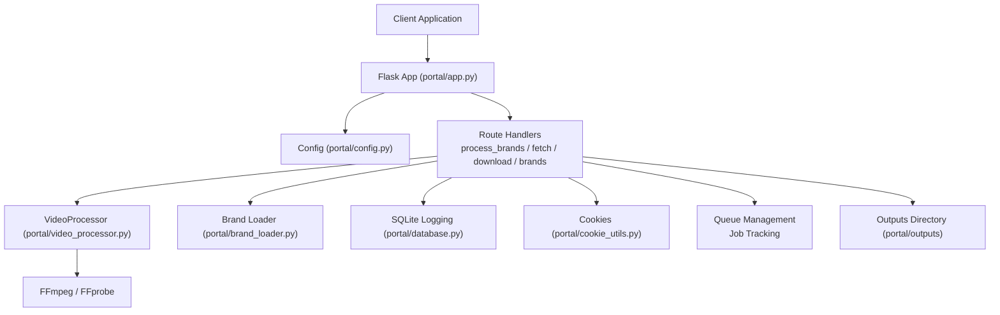
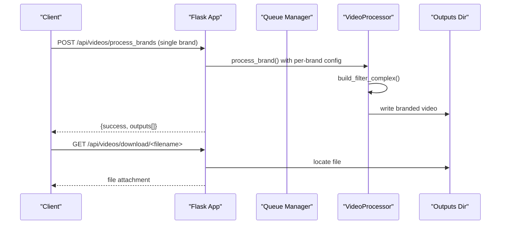
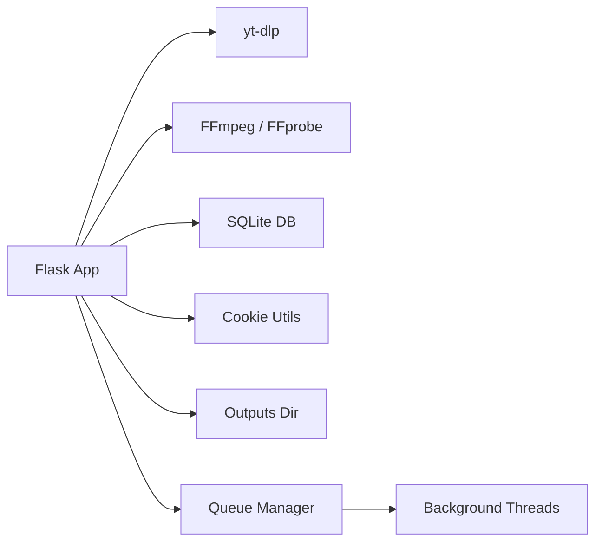

# REST API Endpoints

<cite>
**Referenced Files in This Document**
- [app.py](file://portal/app.py)
- [config.py](file://portal/config.py)
- [video_processor.py](file://portal/video_processor.py)
- [brand_loader.py](file://portal/brand_loader.py)
- [brand_config.json](file://portal/brand_config.json)
- [database.py](file://portal/database.py)
- [cookie_utils.py](file://portal/cookie_utils.py)
- [requirements.txt](file://requirements.txt)
</cite>

## Update Summary
**Changes Made**
- Updated per-brand processing workflow replacing single bulk processing endpoint
- Added queue management and real-time progress tracking capabilities
- Enhanced brand configuration endpoints with per-brand settings persistence
- Documented new watermark conversion endpoints for asynchronous processing
- Updated API architecture to support individual brand processing with queue mode

## Table of Contents
1. [Introduction](#introduction)
2. [Project Structure](#project-structure)
3. [Core Components](#core-components)
4. [Architecture Overview](#architecture-overview)
5. [Detailed Component Analysis](#detailed-component-analysis)
6. [Dependency Analysis](#dependency-analysis)
7. [Performance Considerations](#performance-considerations)
8. [Troubleshooting Guide](#troubleshooting-guide)
9. [Conclusion](#conclusion)
10. [Appendices](#appendices)

## Introduction
This document provides comprehensive REST API documentation for the WatchTheFall Orchestrator v3 portal. The system has evolved to support a new per-brand processing workflow that processes videos individually for each brand rather than in bulk. Key endpoints include:

- **POST /api/videos/process_brands** - Process video with individual brand overlays
- **POST /api/videos/fetch** - Download multiple social media videos
- **GET /api/videos/download/<filename>** - Download processed videos
- **GET /api/brands/list** - Enumerate available brands
- **POST /api/videos/convert-watermark** - Queue watermark conversion jobs
- **GET /api/videos/convert-status/<job_id>** - Poll conversion job status

The new architecture supports queue management, real-time progress tracking, and per-brand configuration persistence with enhanced error handling and asynchronous processing capabilities.

## Project Structure
The API is implemented as a Flask application under the portal package with enhanced queue management and per-brand processing capabilities. Key components include:

- Route handlers for video processing and retrieval with queue support
- Configuration for paths, limits, and secrets
- Video processing utilities leveraging FFmpeg and yt-dlp with per-brand customization
- Brand loader and configuration with database persistence
- Database logging and job tracking with queue management
- Cookie utilities for Instagram authentication
- Asynchronous watermark conversion with job status polling

**Diagram sources**
- [app.py](file://portal/app.py#L44-L53)
- [config.py](file://portal/config.py#L13-L32)
- [video_processor.py](file://portal/video_processor.py#L71-L94)
- [brand_loader.py](file://portal/brand_loader.py#L48-L59)
- [database.py](file://portal/database.py#L9-L20)
- [cookie_utils.py](file://portal/cookie_utils.py#L7-L47)

**Section sources**
- [app.py](file://portal/app.py#L225-L241)
- [config.py](file://portal/config.py#L13-L42)

## Core Components
- Flask application with configured max upload size and secret key
- Enhanced route handlers for:
  - Individual brand video processing with per-brand configuration
  - Social media video fetching
  - Downloading processed videos
  - Brand enumeration and configuration management
  - Asynchronous watermark conversion with job queuing
- VideoProcessor for watermarking and logo overlays with per-brand customization
- Brand loader for available brands with database-backed configuration
- SQLite-backed logging, job tracking, and queue management
- Cookie utilities for Instagram authentication
- Queue management system for asynchronous job processing

**Section sources**
- [app.py](file://portal/app.py#L44-L53)
- [video_processor.py](file://portal/video_processor.py#L71-L94)
- [brand_loader.py](file://portal/brand_loader.py#L48-L59)
- [database.py](file://portal/database.py#L9-L20)
- [cookie_utils.py](file://portal/cookie_utils.py#L7-L47)

## Architecture Overview
The API follows an enhanced request-response model with queue management and per-brand processing:
- Clients send JSON requests to route endpoints
- Route handlers validate inputs, orchestrate individual brand processing, and return structured JSON responses
- VideoProcessor applies watermark and logo overlays via FFmpeg with per-brand configuration
- Queue management handles asynchronous job processing with status polling
- Results are written to the outputs directory and served via download endpoint

**Diagram sources**
- [app.py](file://portal/app.py#L329-L608)
- [video_processor.py](file://portal/video_processor.py#L315-L404)
- [database.py](file://portal/database.py#L231-L251)

## Detailed Component Analysis

### Endpoint: POST /api/videos/process_brands
**Updated** - Now processes individual brands with per-brand configuration and queue support.

Purpose: Process a single video with one brand at a time, applying brand-specific configurations and generating individual branded outputs.

- Method: POST
- Path: /api/videos/process_brands
- Request body (JSON):
  - url: string (required if source_path not provided)
  - source_path: string (alternative to url; absolute or relative path in OUTPUTS)
  - brands: array[string] (single brand only; length must be 1)
  - watermark_scale: number (optional; per-brand override)
  - watermark_opacity: number (optional; per-brand override)
  - logo_scale: number (optional; per-brand override)
  - logo_padding: number (optional; per-brand override)
  - text_enabled: boolean (optional; per-brand override)
  - text_content: string (optional; per-brand override)
  - text_position: string (optional; per-brand override)
  - text_size: number (optional; per-brand override)
  - text_color: string (optional; per-brand override)
  - text_bg_enabled: boolean (optional; per-brand override)
  - text_bg_opacity: number (optional; per-brand override)
- Response (JSON):
  - success: boolean
  - message: string
  - outputs: array of objects with keys:
    - brand: string
    - filename: string
    - download_url: string (relative path)
- Errors:
  - 400: Missing URL/source_path, brands array must contain exactly one brand, audio-only video detected
  - 500: Internal processing failure

Processing flow:
- Accepts either url or source_path
- If url starts with http, downloads video via yt-dlp with Instagram headers and optional cookies
- Validates video has a valid video stream
- Loads per-brand configuration from database (saved or defaults)
- Applies per-brand overrides to VideoProcessor settings
- Processes single brand with VideoProcessor
- Generates download URL for output

curl example:
- curl -X POST https://<host>/api/videos/process_brands -H "Content-Type: application/json" -d '{"source_path":"scotlandwtf_20241201.mp4", "brands":["ScotlandWTF"],"watermark_scale":1.15,"watermark_opacity":0.4,"logo_scale":0.15,"logo_padding":40}'

Notes:
- Audio-only videos are rejected with a specific error message
- Original downloaded file is removed after processing
- Only single brand processing is supported per request

**Section sources**
- [app.py](file://portal/app.py#L329-L608)
- [video_processor.py](file://portal/video_processor.py#L21-L68)
- [brand_loader.py](file://portal/brand_loader.py#L48-L59)
- [brand_config.json](file://portal/brand_config.json#L1-L302)
- [database.py](file://portal/database.py#L265-L293)

### Endpoint: POST /api/videos/fetch
Purpose: Download multiple social media videos (up to a configured limit) from URLs.

- Method: POST
- Path: /api/videos/fetch
- Request body (JSON):
  - urls: array[string] (required; up to 5 URLs)
- Response (JSON):
  - success: boolean
  - total: number
  - successful: number
  - results: array of objects with keys:
    - url: string
    - filename: string
    - local_path: string
    - download_url: string
    - size_mb: number
    - success: boolean
- Errors:
  - 400: Invalid payload or exceeding URL limit
  - 500: Internal processing failure

Processing flow:
- Validates input and URL count
- Downloads each URL sequentially with yt-dlp and Instagram headers
- Ensures .mp4 extension and validates video stream
- Returns individual results and aggregate counts

curl example:
- curl -X POST https://<host>/api/videos/fetch -H "Content-Type: application/json" -d '{"urls":["https://www.instagram.com/...","https://www.tiktok.com/..."]}'

**Section sources**
- [app.py](file://portal/app.py#L609-L784)

### Endpoint: GET /api/videos/download/<filename>
Purpose: Download a previously processed or fetched video.

- Method: GET
- Path: /api/videos/download/<filename>
- Path parameters:
  - filename: string (required)
- Response: file attachment (video/mp4)
- Errors:
  - 404: File not found

Processing flow:
- Locates file in outputs directory
- Sets appropriate headers for download
- Returns file as attachment

curl example:
- curl -OJ https://<host>/api/videos/download/scotlandwtf_20241201.mp4

**Section sources**
- [app.py](file://portal/app.py#L790-L834)
- [config.py](file://portal/config.py#L14-L16)

### Endpoint: GET /api/brands/list
Purpose: Enumerate available brands and their display names.

- Method: GET
- Path: /api/brands/list
- Response (JSON):
  - success: boolean
  - brands: array of objects with keys:
    - name: string
    - display_name: string
- Errors:
  - 500: Internal failure

curl example:
- curl https://<host>/api/brands/list

**Section sources**
- [app.py](file://portal/app.py#L958-L974)
- [brand_loader.py](file://portal/brand_loader.py#L48-L59)
- [brand_config.json](file://portal/brand_config.json#L1-L302)

### Endpoint: POST /api/videos/convert-watermark
Purpose: Queue a watermark conversion job for asynchronous processing.

- Method: POST
- Path: /api/videos/convert-watermark
- Request body: multipart/form-data
  - video: file (required; WebM video file)
- Response (JSON):
  - success: boolean
  - job_id: string
  - status: string ("queued")
  - filename: string
  - message: string (poll status endpoint for progress)
- Errors:
  - 400: No video file provided or empty filename
  - 500: Internal processing failure

Processing flow:
- Validates uploaded file
- Generates unique job ID
- Saves temporary WebM file
- Starts background conversion thread
- Returns immediately with job ID for status polling

curl example:
- curl -X POST https://<host>/api/videos/convert-watermark -H "Content-Type: multipart/form-data" -F "video=@video.webm"

### Endpoint: GET /api/videos/convert-status/<job_id>
Purpose: Poll conversion job status for asynchronous processing.

- Method: GET
- Path: /api/videos/convert-status/<job_id>
- Path parameters:
  - job_id: string (required)
- Response (JSON):
  - job_id: string
  - status: string ("queued", "processing", "completed", "failed")
  - filename: string
  - message: string
  - download_url: string (when completed)
  - size_mb: number (when completed)
  - conversion_time: number (when completed)
  - error: string (when failed)
  - stderr_preview: string (when failed)
  - exit_code: number (when failed)
- Errors:
  - 404: Job not found

Processing flow:
- Returns current job status
- Provides progress information
- Returns completion details when finished
- Returns error details when failed

curl example:
- curl https://<host>/api/videos/convert-status/<job_id>

**Section sources**
- [app.py](file://portal/app.py#L1208-L1417)
- [video_processor.py](file://portal/video_processor.py#L1277-L1383)

### Endpoint: GET /api/brands/<brand_name>/config
Purpose: Retrieve per-brand configuration settings.

- Method: GET
- Path: /api/brands/<brand_name>/config
- Path parameters:
  - brand_name: string (required)
- Response (JSON):
  - success: boolean
  - config: object with brand configuration
- Errors:
  - 404: Brand not found
  - 500: Internal failure

### Endpoint: PUT /api/brands/<brand_name>/config
Purpose: Update per-brand configuration settings.

- Method: PUT
- Path: /api/brands/<brand_name>/config
- Path parameters:
  - brand_name: string (required)
- Request body (JSON):
  - watermark_scale: number
  - watermark_opacity: number
  - logo_scale: number
  - logo_padding: number
  - text_enabled: boolean
  - text_content: string
  - text_position: string
  - text_size: number
  - text_color: string
  - text_bg_enabled: boolean
  - text_bg_opacity: number
  - text_margin: number
- Response (JSON):
  - success: boolean
  - message: string
- Errors:
  - 404: Brand not found
  - 500: Internal failure

**Section sources**
- [app.py](file://portal/app.py#L1066-L1170)
- [database.py](file://portal/database.py#L265-L374)

## Dependency Analysis
Key dependencies and integrations:
- Flask for routing and request handling
- yt-dlp for downloading social media videos
- FFmpeg/FFprobe for video normalization and filtering
- SQLite for logging events, job metadata, and queue management
- Cookie utilities for Instagram authentication
- Thread-based queue management for asynchronous processing

**Diagram sources**
- [app.py](file://portal/app.py#L13-L13)
- [requirements.txt](file://requirements.txt#L13-L13)
- [database.py](file://portal/database.py#L9-L20)
- [cookie_utils.py](file://portal/cookie_utils.py#L7-L47)
- [config.py](file://portal/config.py#L27-L28)

**Section sources**
- [requirements.txt](file://requirements.txt#L1-L18)
- [database.py](file://portal/database.py#L9-L20)
- [cookie_utils.py](file://portal/cookie_utils.py#L7-L47)

## Performance Considerations
- **Individual Brand Processing**: Videos are processed one brand at a time to minimize memory usage and align with free-tier constraints.
- **Queue Management**: Asynchronous job processing prevents timeouts and allows clients to poll for status updates.
- **Per-Brand Configuration**: Database-backed configuration reduces repeated processing overhead for identical brand settings.
- **FFmpeg Optimizations**: Render free tier settings prioritize speed and stability over quality.
- **Download Validation**: Ensures video streams exist before branding to avoid wasted processing.
- **Rate Limiting**: The fetch endpoint enforces a maximum of 5 URLs per request.
- **Thread Safety**: Background threads handle conversion jobs independently with proper error isolation.

## Troubleshooting Guide
Common issues and resolutions:
- **Audio-only video**: The system rejects audio-only content from platforms like Instagram. Retry with a different video or use a different source.
- **File not found**: Ensure the filename matches the exact output name generated by the processing endpoints.
- **Download failures**: Verify the outputs directory exists and is writable; confirm the file path and permissions.
- **Instagram access**: If downloads fail due to authentication, ensure a valid cookie file exists and is readable.
- **Queue timeouts**: Use the conversion status endpoint to monitor job progress and handle timeouts gracefully.
- **Per-brand configuration**: Verify brand configurations are properly saved in the database for consistent processing.

Operational endpoints:
- Health checks and environment diagnostics are available for debugging.

**Section sources**
- [app.py](file://portal/app.py#L56-L91)
- [app.py](file://portal/app.py#L188-L215)
- [app.py](file://portal/app.py#L790-L834)
- [cookie_utils.py](file://portal/cookie_utils.py#L7-L47)

## Conclusion
The WatchTheFall Orchestrator v3 portal exposes a comprehensive set of REST endpoints for individual brand video processing, social media fetching, and video retrieval. The new per-brand processing workflow provides enhanced control over branding configurations, queue management for asynchronous processing, and real-time progress tracking. The design emphasizes reliability, scalability, and flexibility with explicit validation, clear error responses, and robust asynchronous capabilities. Clients should utilize the queue endpoints for long-running jobs, respect rate limits, and leverage per-brand configuration persistence for consistent branding across multiple videos.

## Appendices

### Authentication and Security
- Authentication: No API key or bearer token is enforced by the documented routes. Treat endpoints as internal or protect at the gateway/proxy layer.
- Secrets: Configuration includes a secret key and portal auth key; do not expose these in client-side code.
- Cookies: Optional Instagram cookies are supported; ensure cookie files are stored securely and validated.

**Section sources**
- [config.py](file://portal/config.py#L31-L32)
- [cookie_utils.py](file://portal/cookie_utils.py#L7-L47)

### Rate Limiting
- Fetch endpoint: Maximum 5 URLs per request.
- General: No global rate limiting is implemented in the documented routes.
- Queue processing: Asynchronous jobs prevent request timeouts and allow for extended processing.

**Section sources**
- [app.py](file://portal/app.py#L622-L623)

### Practical Usage Examples

- **Process single brand**:
  - curl -X POST https://<host>/api/videos/process_brands -H "Content-Type: application/json" -d '{"source_path":"scotlandwtf_20241201.mp4","brands":["ScotlandWTF"]}'

- **Fetch multiple videos**:
  - curl -X POST https://<host>/api/videos/fetch -H "Content-Type: application/json" -d '{"urls":["https://www.instagram.com/...","https://www.tiktok.com/..."]}'

- **Download a processed video**:
  - curl -OJ https://<host>/api/videos/download/scotlandwtf_20241201.mp4

- **List brands**:
  - curl https://<host>/api/brands/list

- **Queue watermark conversion**:
  - curl -X POST https://<host>/api/videos/convert-watermark -H "Content-Type: multipart/form-data" -F "video=@video.webm"

- **Check conversion status**:
  - curl https://<host>/api/videos/convert-status/<job_id>

- **Get brand configuration**:
  - curl https://<host>/api/brands/<brand_name>/config

- **Update brand configuration**:
  - curl -X PUT https://<host>/api/brands/<brand_name>/config -H "Content-Type: application/json" -d '{"watermark_scale":1.2,"watermark_opacity":0.5}'