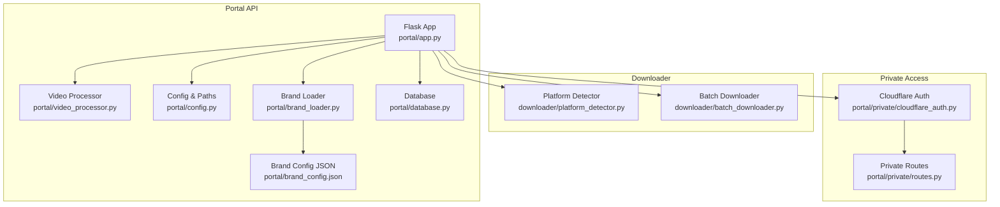
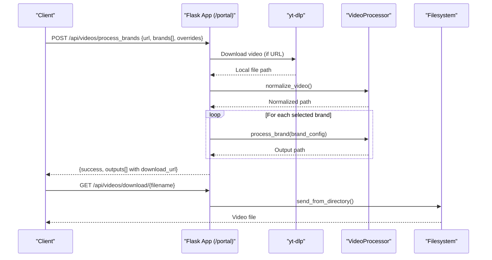
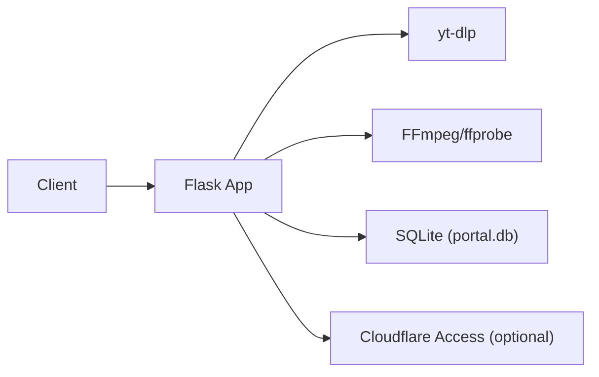

# Video Processing Endpoints

<cite>
**Referenced Files in This Document**
- [app.py](file://portal/app.py)
- [video_processor.py](file://portal/video_processor.py)
- [config.py](file://portal/config.py)
- [brand_loader.py](file://portal/brand_loader.py)
- [brand_config.json](file://portal/brand_config.json)
- [database.py](file://portal/database.py)
- [platform_detector.py](file://downloader/platform_detector.py)
- [batch_downloader.py](file://downloader/batch_downloader.py)
- [cloudflare_auth.py](file://portal/private/cloudflare_auth.py)
- [routes.py](file://portal/private/routes.py)
- [requirements.txt](file://portal/requirements.txt)
</cite>

## Table of Contents
1. [Introduction](#introduction)
2. [Project Structure](#project-structure)
3. [Core Components](#core-components)
4. [Architecture Overview](#architecture-overview)
5. [Detailed Component Analysis](#detailed-component-analysis)
6. [Dependency Analysis](#dependency-analysis)
7. [Performance Considerations](#performance-considerations)
8. [Troubleshooting Guide](#troubleshooting-guide)
9. [Conclusion](#conclusion)
10. [Appendices](#appendices)

## Introduction
This document provides comprehensive API documentation for the video processing endpoints exposed by the WatchTheFall Portal. It focuses on:
- Multi-brand video processing via POST /api/videos/process_brands
- Social media video downloading via POST /api/videos/fetch
- Video retrieval via GET /api/videos/download/<filename>

It includes request/response schemas, practical curl examples, error handling scenarios, and integration guidance for client applications. Authentication and rate-limiting considerations are also addressed.

## Project Structure
The API surface is implemented in the Flask application module, with supporting components for video processing, branding, and optional private access protection.

**Diagram sources**
- [app.py](file://portal/app.py#L1-L1358)
- [video_processor.py](file://portal/video_processor.py#L1-L500)
- [config.py](file://portal/config.py#L1-L42)
- [brand_loader.py](file://portal/brand_loader.py#L1-L59)
- [brand_config.json](file://portal/brand_config.json#L1-L302)
- [database.py](file://portal/database.py#L1-L204)
- [platform_detector.py](file://downloader/platform_detector.py#L1-L41)
- [batch_downloader.py](file://downloader/batch_downloader.py#L1-L83)
- [cloudflare_auth.py](file://portal/private/cloudflare_auth.py#L1-L64)
- [routes.py](file://portal/private/routes.py#L1-L29)

**Section sources**
- [app.py](file://portal/app.py#L1-L1358)
- [config.py](file://portal/config.py#L1-L42)

## Core Components
- Flask application with route handlers for video processing and retrieval
- VideoProcessor class for watermark and logo overlay composition using FFmpeg
- Brand loader and configuration for multi-brand support
- Downloader utilities for platform detection and batch fetching
- Optional Cloudflare Access authentication for private routes

Key responsibilities:
- POST /api/videos/process_brands: Accepts URL or local source_path, optional brands array, and branding overrides; downloads, normalizes, and applies brand overlays; returns downloadable links
- POST /api/videos/fetch: Accepts a list of URLs (up to five), downloads them sequentially, and returns results
- GET /api/videos/download/<filename>: Serves processed video files from the configured output directory

**Section sources**
- [app.py](file://portal/app.py#L329-L833)
- [video_processor.py](file://portal/video_processor.py#L71-L434)
- [brand_loader.py](file://portal/brand_loader.py#L48-L59)
- [brand_config.json](file://portal/brand_config.json#L1-L302)

## Architecture Overview
The endpoints integrate with FFmpeg and yt-dlp to perform video ingestion and processing. Branding is applied using dynamically resolved assets from master directories.

**Diagram sources**
- [app.py](file://portal/app.py#L329-L608)
- [video_processor.py](file://portal/video_processor.py#L21-L404)

## Detailed Component Analysis

### POST /api/videos/process_brands
Purpose:
- Process a single video with one or more brands, applying watermarks and logos according to brand assets and optional overrides.

Request schema:
- url: string (required if source_path not provided)
- source_path: string (alternative to url; absolute path within OUTPUT_DIR)
- brands: string[] (required; list of brand names)
- watermark_scale: number (optional; default 1.15)
- watermark_opacity: number (optional; default 0.4)
- logo_scale: number (optional; default 0.15)
- logo_padding: number (optional; default 40)

Response schema:
- success: boolean
- message: string
- outputs: array of objects with:
  - brand: string
  - filename: string
  - download_url: string

Behavior highlights:
- Validates presence of url or source_path and brands
- If url starts with http, downloads via yt-dlp with Instagram-specific headers and optional cookie file
- Normalizes video to 8-bit H264 SDR to address HDR and timestamp issues
- Applies branding sequentially per brand, using master assets resolved by orientation and brand name
- Returns download URLs for each processed file

curl example:
- curl -X POST https://your-domain/api/videos/process_brands -H "Content-Type: application/json" -d '{"url":"https://instagram.com/p/...","brands":["ScotlandWTF","EnglandWTF"],"watermark_scale":1.2,"watermark_opacity":0.35}'

Error handling:
- 400 if missing url/source_path or brands
- 400 if audio-only video detected
- 500 for general failures; includes details in error field

**Section sources**
- [app.py](file://portal/app.py#L329-L608)
- [video_processor.py](file://portal/video_processor.py#L21-L404)
- [brand_loader.py](file://portal/brand_loader.py#L48-L59)
- [brand_config.json](file://portal/brand_config.json#L1-L302)

### POST /api/videos/fetch
Purpose:
- Fetch multiple social media videos from URLs (up to five) and return results with download URLs.

Request schema:
- urls: string[] (required; up to 5 items)

Response schema:
- success: boolean
- total: number
- successful: number
- results: array of objects with:
  - url: string
  - filename: string
  - local_path: string
  - download_url: string
  - size_mb: number
  - success: boolean
  - error: string (present on failure)

Behavior highlights:
- Validates input type and length (max 5)
- Downloads sequentially to reduce memory pressure
- Ensures .mp4 extension and validates video stream; attempts fallback extraction if needed
- Returns partial success counts

curl example:
- curl -X POST https://your-domain/api/videos/fetch -H "Content-Type: application/json" -d '{"urls":["https://instagram.com/...","https://tiktok.com/..."]}'

Error handling:
- 400 if invalid payload or exceeding batch limit
- 500 for general failures

**Section sources**
- [app.py](file://portal/app.py#L609-L784)
- [platform_detector.py](file://downloader/platform_detector.py#L12-L41)
- [batch_downloader.py](file://downloader/batch_downloader.py#L16-L83)

### GET /api/videos/download/<filename>
Purpose:
- Retrieve a previously processed video file by filename.

Behavior highlights:
- Serves file from OUTPUT_DIR with appropriate headers for download
- Adds Content-Disposition and security-related headers
- Returns 404 if file not found and logs debug information

curl example:
- curl -OJ https://your-domain/api/videos/download/scotlandwtf_englishtest_2024-11-18T10_15_30Z.mp4

Error handling:
- 404 if file not found; includes path and filename in response

**Section sources**
- [app.py](file://portal/app.py#L790-L833)
- [config.py](file://portal/config.py#L14-L16)

### GET /api/brands/list
Purpose:
- List available brands and their display names.

Response schema:
- success: boolean
- brands: array of objects with:
  - name: string
  - display_name: string

**Section sources**
- [app.py](file://portal/app.py#L958-L974)
- [brand_loader.py](file://portal/brand_loader.py#L48-L59)
- [brand_config.json](file://portal/brand_config.json#L1-L302)

### Optional Private Access (Cloudflare Access)
- Private routes under /portal/private require Cloudflare Access JWT in the Cf-Access-Jwt-Assertion header
- Decorator verifies token against Cloudflare certs and audience

curl example:
- curl -H "Cf-Access-Jwt-Assertion: YOUR_JWT" https://your-domain/portal/private/test

**Section sources**
- [cloudflare_auth.py](file://portal/private/cloudflare_auth.py#L14-L64)
- [routes.py](file://portal/private/routes.py#L10-L29)

## Dependency Analysis
External dependencies and integrations:
- Flask for routing and HTTP handling
- yt-dlp for social media video extraction
- FFmpeg/ffprobe for normalization and overlay composition
- SQLite for logging and job metadata persistence
- Optional Cloudflare Access for private endpoints

**Diagram sources**
- [requirements.txt](file://portal/requirements.txt#L1-L7)
- [app.py](file://portal/app.py#L1-L1358)
- [database.py](file://portal/database.py#L9-L204)
- [cloudflare_auth.py](file://portal/private/cloudflare_auth.py#L11-L35)

**Section sources**
- [requirements.txt](file://portal/requirements.txt#L1-L7)
- [database.py](file://portal/database.py#L9-L204)

## Performance Considerations
- Sequential processing in fetch reduces memory footprint on constrained environments
- Video normalization converts to 8-bit H264 SDR to improve compatibility and reduce metadata overhead
- FFmpeg commands are tuned for speed on free-tier hosting (e.g., ultrafast preset for conversions)
- Batch limit of 5 prevents resource exhaustion

[No sources needed since this section provides general guidance]

## Troubleshooting Guide
Common issues and resolutions:
- Audio-only video: The system detects audio-only content and returns a 400 error with guidance to retry or select another source
- Missing file during download: Endpoint returns 404; check filename and OUTPUT_DIR path
- Download failures: Review error messages and details returned by yt-dlp; verify network connectivity and platform availability
- Brand assets not found: Ensure brand names match entries in brand_config.json and assets exist in master directories

Operational checks:
- Health endpoints and debug routes help diagnose environment and storage issues
- Database logs record job events and errors for later inspection

**Section sources**
- [app.py](file://portal/app.py#L55-L214)
- [database.py](file://portal/database.py#L152-L161)

## Conclusion
The API provides robust endpoints for multi-brand video processing and social media fetching, with clear request/response schemas and error handling. Clients should:
- Respect the batch limit for fetch operations
- Use download URLs returned by the API for retrieval
- Integrate Cloudflare Access for private deployments
- Monitor logs and utilize debug endpoints for operational visibility

[No sources needed since this section summarizes without analyzing specific files]

## Appendices

### API Reference Summary
- POST /api/videos/process_brands
  - Request: url or source_path, brands[], watermark_scale, watermark_opacity, logo_scale, logo_padding
  - Response: success, message, outputs[]
- POST /api/videos/fetch
  - Request: urls[] (≤5)
  - Response: success, total, successful, results[]
- GET /api/videos/download/<filename>
  - Response: file attachment or 404
- GET /api/brands/list
  - Response: success, brands[]

### Practical Examples
- Process multiple brands:
  - curl -X POST https://your-domain/api/videos/process_brands -H "Content-Type: application/json" -d '{"url":"https://instagram.com/p/...","brands":["ScotlandWTF","EnglandWTF"],"watermark_scale":1.2}'
- Fetch multiple videos:
  - curl -X POST https://your-domain/api/videos/fetch -H "Content-Type: application/json" -d '{"urls":["https://instagram.com/...","https://tiktok.com/..."]}'
- Download a processed video:
  - curl -OJ https://your-domain/api/videos/download/{filename}

[No sources needed since this section provides general guidance]