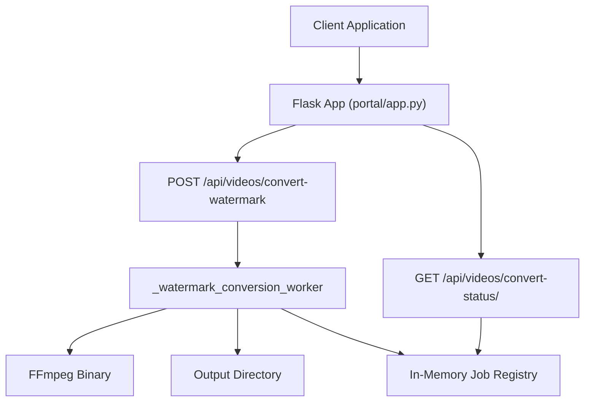
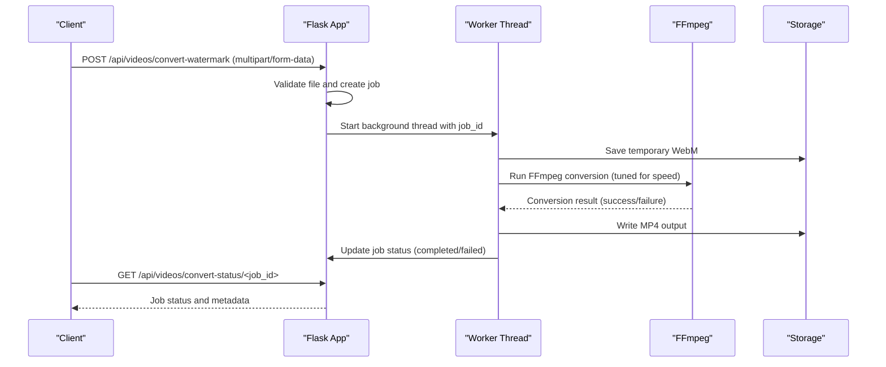
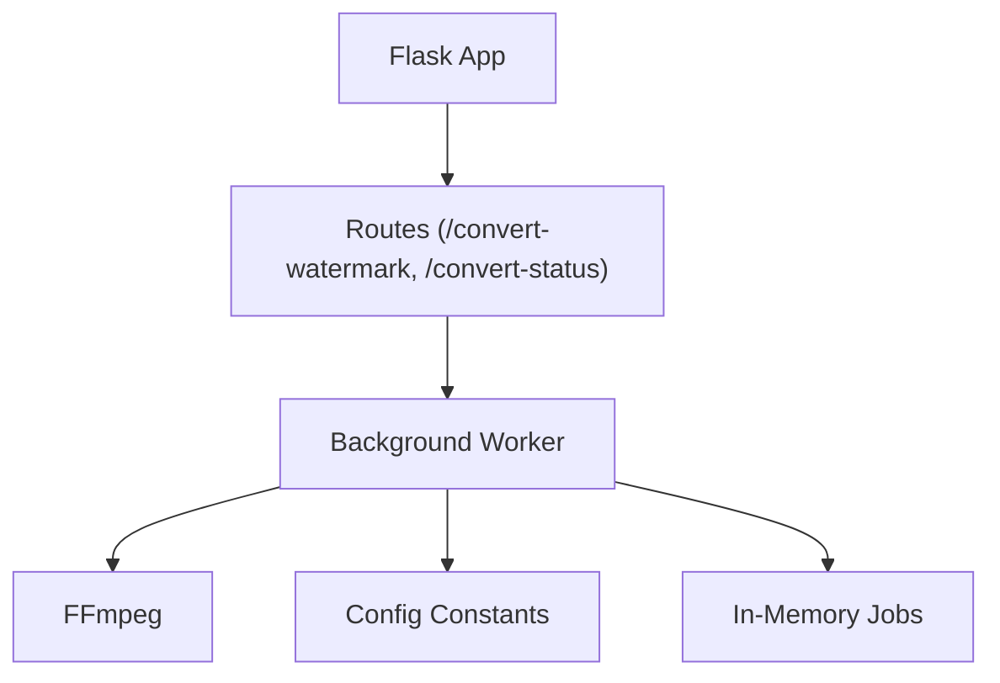

# Watermark Conversion Endpoints

<cite>
**Referenced Files in This Document**
- [portal/app.py](file://portal/app.py)
- [portal/video_processor.py](file://portal/video_processor.py)
- [portal/config.py](file://portal/config.py)
- [portal/database.py](file://portal/database.py)
- [portal/brand_loader.py](file://portal/brand_loader.py)
- [portal/wtf_brands/wtf_orchestrator/watermark.yml](file://portal/wtf_brands/wtf_orchestrator/watermark.yml)
- [portal/brand_config.json](file://portal/brand_config.json)
- [requirements.txt](file://requirements.txt)
- [render.yaml](file://render.yaml)
</cite>

## Table of Contents
1. [Introduction](#introduction)
2. [Project Structure](#project-structure)
3. [Core Components](#core-components)
4. [Architecture Overview](#architecture-overview)
5. [Detailed Component Analysis](#detailed-component-analysis)
6. [Dependency Analysis](#dependency-analysis)
7. [Performance Considerations](#performance-considerations)
8. [Troubleshooting Guide](#troubleshooting-guide)
9. [Conclusion](#conroduction)

## Introduction
This document provides comprehensive API documentation for the watermark conversion endpoints designed for asynchronous video processing. It covers:
- POST /api/videos/convert-watermark: Submits a WebM video for conversion to MP4 with job queuing and status tracking
- GET /api/videos/convert-status/<job_id>: Retrieves conversion progress and results
- Job lifecycle management, error handling for long-running processes, and resource limitations
- Concurrent processing constraints and memory management considerations for the Render free tier deployment

These endpoints are implemented in the portal application and leverage FFmpeg for media conversion, with careful tuning for performance and stability under constrained environments.

## Project Structure
The watermark conversion functionality resides in the portal application module. Key components include:
- Flask application entry and route definitions
- Background worker for FFmpeg conversion
- In-memory job registry for status tracking
- Configuration for upload limits and storage paths
- Brand asset resolution for watermark overlays (used by other endpoints)

**Diagram sources**
- [portal/app.py](file://portal/app.py#L980-L1156)
- [portal/config.py](file://portal/config.py#L14-L16)

**Section sources**
- [portal/app.py](file://portal/app.py#L980-L1156)
- [portal/config.py](file://portal/config.py#L14-L16)

## Core Components
- Flask application with route handlers for watermark conversion and status polling
- Background thread worker that executes FFmpeg conversion with strict timeout and resource tuning
- In-memory job registry storing job metadata and status
- Configuration constants for upload size limits and storage directories
- Brand loader and configuration for watermark assets (used by other branding endpoints)

Key implementation references:
- Conversion endpoint and background worker: [portal/app.py](file://portal/app.py#L980-L1156)
- Status polling endpoint: [portal/app.py](file://portal/app.py#L1158-L1189)
- Configuration constants: [portal/config.py](file://portal/config.py#L35-L36)
- Brand configuration: [portal/brand_config.json](file://portal/brand_config.json#L1-L302)

**Section sources**
- [portal/app.py](file://portal/app.py#L980-L1189)
- [portal/config.py](file://portal/config.py#L35-L36)
- [portal/brand_config.json](file://portal/brand_config.json#L1-L302)

## Architecture Overview
The watermark conversion architecture follows an asynchronous job model:
- Client submits a WebM file via POST /api/videos/convert-watermark
- The server generates a job ID, saves the uploaded file temporarily, and starts a background thread
- The background thread runs FFmpeg to convert the WebM to MP4 with tuned parameters for speed and memory efficiency
- Client polls GET /api/videos/convert-status/<job_id> to track progress until completion or failure

**Diagram sources**
- [portal/app.py](file://portal/app.py#L980-L1156)
- [portal/config.py](file://portal/config.py#L14-L16)

## Detailed Component Analysis

### Endpoint: POST /api/videos/convert-watermark
Purpose: Asynchronously queue a WebM to MP4 conversion job.

Behavior:
- Accepts multipart/form-data with field name "video"
- Validates presence of file and filename
- Generates a unique job ID and initializes in-memory job state
- Saves the uploaded WebM to a temporary location
- Starts a background thread to perform FFmpeg conversion
- Immediately returns a JSON response with job_id and queued status

Response format (success):
- success: Boolean indicating operation success
- job_id: Unique identifier for the conversion job
- status: Current job status ("queued")
- filename: Target MP4 filename derived from the uploaded WebM
- message: Human-readable status message instructing to poll for progress

Error responses:
- 400 Bad Request when no file is provided or filename is empty
- 500 Internal Server Error for exceptions during queueing

Example request (conceptual):
- Method: POST
- URL: /api/videos/convert-watermark
- Headers: Content-Type: multipart/form-data
- Body: video=<WebM file>

Example response (success):
{
  "success": true,
  "job_id": "<generated_hex_string>",
  "status": "queued",
  "filename": "example.mp4",
  "message": "Conversion job queued. Poll /api/videos/convert-status/<job_id> for progress."
}

Notes:
- The endpoint does not accept additional parameters for watermark customization; it performs a generic WebM to MP4 conversion.
- The job remains in memory for status retrieval; there is no persistent job queue in this implementation.

**Section sources**
- [portal/app.py](file://portal/app.py#L980-L1046)

### Endpoint: GET /api/videos/convert-status/<job_id>
Purpose: Poll for conversion progress and retrieve results.

Behavior:
- Accepts a job_id path parameter
- Returns current job status and associated metadata
- On completion: includes download URL, file size, and conversion time
- On failure: includes error details and optional stderr preview

Response format:
- job_id: The requested job identifier
- status: Current job status ("queued", "processing", "completed", "failed")
- filename: Target MP4 filename
- message: Human-readable status message
- download_url: Available when status is "completed"
- size_mb: File size in megabytes when status is "completed"
- conversion_time: Total conversion duration in seconds when status is "completed"
- error: Error message when status is "failed"
- stderr_preview: Preview of FFmpeg stderr when status is "failed"
- exit_code: FFmpeg exit code when status is "failed"

Error responses:
- 404 Not Found when job_id is invalid or expired

**Section sources**
- [portal/app.py](file://portal/app.py#L1158-L1189)

### Background Worker: _watermark_conversion_worker
Purpose: Execute FFmpeg conversion in a background thread with strict resource constraints.

Key characteristics:
- Uses ultrafast presets and reduced quality settings to minimize processing time
- Applies timeout of 300 seconds (5 minutes) to prevent hanging workers
- Cleans up temporary WebM files upon completion or failure
- Updates in-memory job state with detailed status and timing metrics

FFmpeg tuning for Render free tier:
- Preset: ultrafast
- Tune: fastdecode
- Threads: automatic (0)
- CRF: 28 (higher value for faster processing)
- Profile/Level: baseline 3.0
- Audio: AAC with reduced bitrate
- Fast start enabled
- Shortest stream mapping

Error handling:
- Captures FFmpeg non-zero exit codes and records stderr preview
- Handles timeout exceptions and marks job as failed
- Logs unexpected exceptions with stack traces

**Section sources**
- [portal/app.py](file://portal/app.py#L1049-L1156)

### Job Lifecycle Management
Lifecycle stages:
1. Queued: Job created with initial status and metadata
2. Processing: Background worker started and FFmpeg invoked
3. Completed: Conversion finished successfully; metadata includes download URL and file size
4. Failed: Conversion failed due to FFmpeg error, timeout, or unexpected exception

Status transitions are driven by the background worker and reflected in the in-memory job registry.

**Section sources**
- [portal/app.py](file://portal/app.py#L1007-L1156)

### Resource Limitations and Memory Management
Constraints for Render free tier:
- Upload size limit: 500 MB
- Conversion timeout: 300 seconds (5 minutes)
- FFmpeg tuned for speed and minimal memory footprint

Memory considerations:
- Background thread isolation prevents blocking the main Gunicorn worker
- Reduced FFmpeg analysis and probe sizes minimize memory usage
- Temporary WebM cleanup reduces disk pressure

Environment configuration:
- Python 3.10.6 on Render free plan
- Gunicorn configured via portal/gunicorn.conf.py

**Section sources**
- [portal/config.py](file://portal/config.py#L35-L36)
- [portal/app.py](file://portal/app.py#L1059-L1085)
- [render.yaml](file://render.yaml#L1-L18)

### Brand Asset Resolution (Context for Watermark Overlays)
While the watermark conversion endpoint focuses on WebM to MP4 conversion, the portal also supports brand-specific watermark overlays via other endpoints. These use the following configuration and asset resolution:

Brand configuration structure:
- brand_config.json defines display_name, assets (template, logo, watermark), and options (watermark_position, watermark_scale)
- watermark.yml provides default watermark position and scale for the wtf_orchestrator brand

Asset resolution:
- Watermark and logo paths are resolved based on brand name and video orientation
- Overlay filters are constructed dynamically for each brand

Note: These mechanisms apply to brand overlay processing and are distinct from the WebM to MP4 conversion endpoint.

**Section sources**
- [portal/brand_config.json](file://portal/brand_config.json#L1-L302)
- [portal/wtf_brands/wtf_orchestrator/watermark.yml](file://portal/wtf_brands/wtf_orchestrator/watermark.yml#L1-L3)
- [portal/brand_loader.py](file://portal/brand_loader.py#L48-L59)
- [portal/video_processor.py](file://portal/video_processor.py#L173-L204)

## Dependency Analysis
The watermark conversion endpoints depend on:
- Flask for routing and request handling
- Python threading for background processing
- FFmpeg for media conversion
- In-memory dictionaries for job state management
- Configuration constants for storage and limits

**Diagram sources**
- [portal/app.py](file://portal/app.py#L980-L1156)
- [portal/config.py](file://portal/config.py#L35-L36)

**Section sources**
- [portal/app.py](file://portal/app.py#L980-L1156)
- [portal/config.py](file://portal/config.py#L35-L36)

## Performance Considerations
- Conversion speed: Ultrafast FFmpeg preset and tuned parameters prioritize throughput over quality for the Render free tier
- Timeout safety: 300-second limit prevents long-running conversions from blocking resources
- Memory efficiency: Reduced analysis/probe sizes and cleanup procedures minimize memory footprint
- Concurrency: Single-threaded conversion per job; background threads prevent blocking the main worker pool

Recommendations:
- Keep input WebM durations reasonable to fit within the 5-minute timeout
- Prefer smaller resolutions to reduce processing time
- Monitor job status via polling to avoid repeated requests during long conversions

[No sources needed since this section provides general guidance]

## Troubleshooting Guide
Common issues and resolutions:
- Job not found (404): Verify the job_id is correct and not expired; jobs are stored in memory
- Conversion timeout (>5min): Reduce input video length or complexity; the worker enforces a hard 300-second timeout
- FFmpeg conversion failed: Check stderr_preview for detailed error messages; ensure FFmpeg is available in PATH
- Upload size exceeded: The maximum upload size is 500 MB; split large files or compress before upload
- Unexpected errors: Inspect server logs for exception traces; the worker captures and logs detailed errors

Operational checks:
- Health endpoints: Use debug routes to verify app loading, environment variables, FFmpeg availability, storage paths, and brand integrity
- Database readiness: While the conversion endpoint uses in-memory jobs, the database module is initialized for future job persistence

**Section sources**
- [portal/app.py](file://portal/app.py#L1158-L1189)
- [portal/app.py](file://portal/app.py#L1128-L1150)
- [portal/config.py](file://portal/config.py#L35-L36)

## Conclusion
The watermark conversion endpoints provide a robust, asynchronous solution for converting WebM videos to MP4 with clear status tracking and built-in safeguards for constrained environments. By leveraging background threads, tuned FFmpeg parameters, and strict timeouts, the system maintains responsiveness while delivering reliable results for the Render free tier deployment. Clients should submit jobs via POST /api/videos/convert-watermark and poll GET /api/videos/convert-status/<job_id> to monitor progress and retrieve outputs.

[No sources needed since this section summarizes without analyzing specific files]