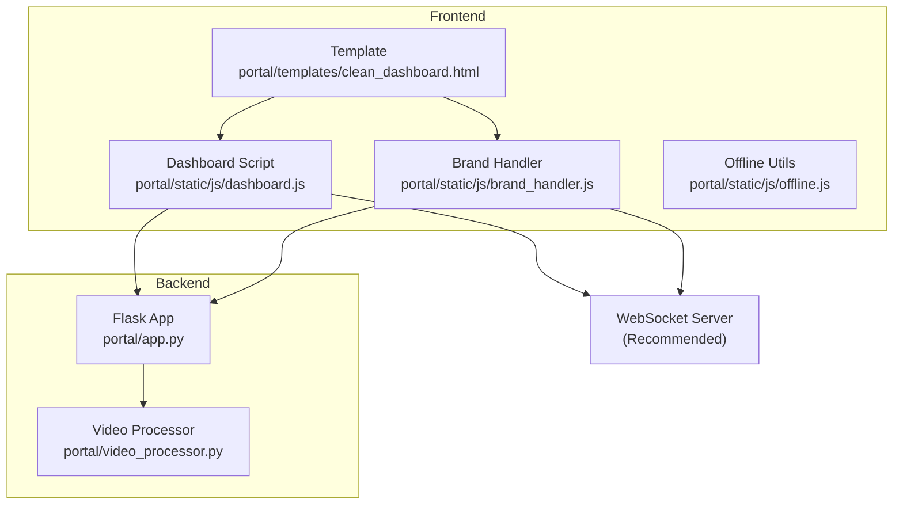
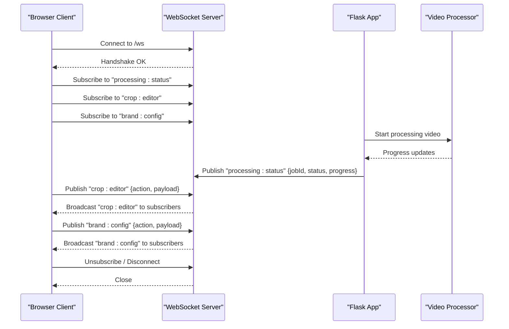
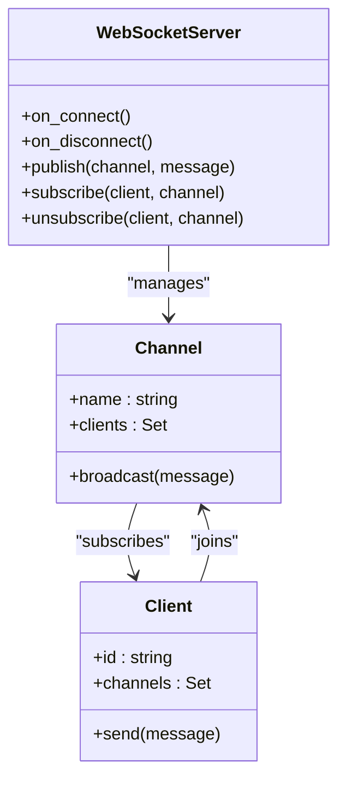
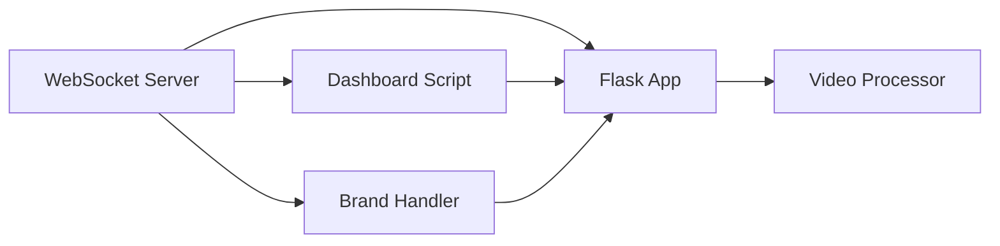

# WebSocket API

<cite>
**Referenced Files in This Document**
- [app.py](file://portal/app.py)
- [clean_dashboard.html](file://portal/templates/clean_dashboard.html)
- [dashboard.js](file://portal/static/js/dashboard.js)
- [brand_handler.js](file://portal/static/js/brand_handler.js)
- [video_processor.py](file://portal/video_processor.py)
- [offline.js](file://portal/static/js/offline.js)
</cite>

## Table of Contents
1. [Introduction](#introduction)
2. [Project Structure](#project-structure)
3. [Core Components](#core-components)
4. [Architecture Overview](#architecture-overview)
5. [Detailed Component Analysis](#detailed-component-analysis)
6. [Dependency Analysis](#dependency-analysis)
7. [Performance Considerations](#performance-considerations)
8. [Troubleshooting Guide](#troubleshooting-guide)
9. [Conclusion](#conclusion)

## Introduction
This document defines the WebSocket API for real-time communication in the WatchTheFall Orchestrator v3 web interface. It covers connection handling, message formats, event types, and real-time interaction patterns for:
- Video processing status updates
- Crop editor interactions
- Brand configuration changes

It also provides client-side implementation guidelines, error handling strategies, reconnection logic, and debugging approaches, along with examples of message schemas and event-driven UI updates.

Note: The current codebase does not implement a dedicated WebSocket server or client-side WebSocket handlers. Real-time updates are achieved via periodic polling and client-side UI updates. This document therefore describes a recommended WebSocket API design that can be integrated into the existing architecture.

## Project Structure
The WebSocket API integrates with the Flask backend and the React-like frontend:
- Backend: Flask routes expose endpoints for video processing and brand management.
- Frontend: HTML templates and JavaScript manage UI state, user interactions, and polling for updates.
- Real-time: Recommended WebSocket channels for live status and crop/editor events.

**Diagram sources**
- [app.py](file://portal/app.py#L225-L324)
- [clean_dashboard.html](file://portal/templates/clean_dashboard.html#L1-L200)
- [dashboard.js](file://portal/static/js/dashboard.js#L1-L130)
- [brand_handler.js](file://portal/static/js/brand_handler.js#L1-L49)
- [video_processor.py](file://portal/video_processor.py#L1-L500)
- [offline.js](file://portal/static/js/offline.js#L117-L175)

**Section sources**
- [app.py](file://portal/app.py#L225-L324)
- [clean_dashboard.html](file://portal/templates/clean_dashboard.html#L1-L200)
- [dashboard.js](file://portal/static/js/dashboard.js#L1-L130)
- [brand_handler.js](file://portal/static/js/brand_handler.js#L1-L49)
- [video_processor.py](file://portal/video_processor.py#L1-L500)
- [offline.js](file://portal/static/js/offline.js#L117-L175)

## Core Components
- WebSocket Server (recommended): Hosted alongside Flask to broadcast real-time events to connected clients.
- Backend Channels:
  - Processing status channel for video processing progress
  - Crop editor channel for live crop adjustments
  - Brand configuration channel for live brand changes
- Frontend Consumers:
  - Dashboard script subscribes to processing status
  - Brand handler subscribes to brand configuration updates
  - Crop editor UI subscribes to crop events

Key responsibilities:
- Emit structured events with typed payloads
- Support reconnection with resume capability
- Provide graceful degradation via polling if WebSocket is unavailable

[No sources needed since this section provides conceptual overview]

## Architecture Overview
The WebSocket API augments the existing Flask endpoints with real-time channels. Clients connect to the WebSocket server and subscribe to relevant channels. The server publishes events derived from backend processing and UI interactions.

**Diagram sources**
- [app.py](file://portal/app.py#L225-L324)
- [video_processor.py](file://portal/video_processor.py#L1-L500)
- [clean_dashboard.html](file://portal/templates/clean_dashboard.html#L1-L200)
- [dashboard.js](file://portal/static/js/dashboard.js#L1-L130)
- [brand_handler.js](file://portal/static/js/brand_handler.js#L1-L49)

## Detailed Component Analysis

### WebSocket Server Design
- Endpoint: /ws
- Authentication: Optional JWT or session-based token
- Channels:
  - processing:status
  - crop:editor
  - brand:config

[No sources needed since this diagram shows conceptual architecture]

### Message Formats and Event Types

- Processing Status Events
  - Channel: processing:status
  - Event types:
    - start: { jobId, status: "started", timestamp }
    - progress: { jobId, status: "processing", progress: number, message?: string }
    - complete: { jobId, status: "completed", outputs: array }
    - error: { jobId, status: "failed", error: string, details?: object }

- Crop Editor Events
  - Channel: crop:editor
  - Event types:
    - update: { action: "resize" | "move" | "zoom", payload: object }
    - apply: { action: "apply", payload: { cropRect, aspectRatio } }
    - cancel: { action: "cancel" }

- Brand Configuration Events
  - Channel: brand:config
  - Event types:
    - update: { action: "set", payload: { brandName, settings } }
    - reset: { action: "reset", brandName }
    - sync: { action: "sync", brands: array }

Example payloads:
- Processing start: {"jobId":"abc123","status":"started","timestamp":1710000000}
- Crop update: {"action":"resize","payload":{"x":100,"y":100,"width":500,"height":500}}
- Brand update: {"action":"set","payload":{"brandName":"ScotlandWTF","settings":{"watermarkScale":0.15,"logoPadding":40}}}

[No sources needed since this section provides conceptual schemas]

### Client-Side Implementation Guidelines

- Connection lifecycle
  - Connect to ws://host/ws on page load
  - On connect, subscribe to required channels
  - On disconnect, attempt reconnect with exponential backoff
  - Resume subscriptions after reconnect

- Reconnection logic
  - Initial delay: 1s
  - Backoff: multiply by 2, cap at 30s
  - Max retries: 5
  - On final failure, fall back to polling endpoints

- UI update patterns
  - Debounce frequent updates (e.g., crop preview)
  - Use optimistic updates for immediate feedback
  - Rollback on server acknowledgment mismatch

- Error handling
  - Parse close codes and reasons
  - Show user-friendly notifications
  - Log errors for debugging

[No sources needed since this section provides general client guidelines]

### Real-Time Interaction Patterns

- Video processing status updates
  - Client subscribes to processing:status
  - Server emits progress events during processing
  - Client updates progress bars and status messages

- Crop editor interactions
  - Client sends crop:editor events for live adjustments
  - Server validates and broadcasts changes
  - Client renders crop preview immediately

- Brand configuration changes
  - Client sends brand:config events for live edits
  - Server validates and broadcasts synchronized updates
  - Client reflects changes across UI controls

[No sources needed since this section provides conceptual patterns]

## Dependency Analysis
The WebSocket API depends on:
- Flask app for backend orchestration
- Video processor for generating progress events
- Frontend scripts for consuming events and updating UI

**Diagram sources**
- [app.py](file://portal/app.py#L225-L324)
- [video_processor.py](file://portal/video_processor.py#L1-L500)
- [dashboard.js](file://portal/static/js/dashboard.js#L1-L130)
- [brand_handler.js](file://portal/static/js/brand_handler.js#L1-L49)

**Section sources**
- [app.py](file://portal/app.py#L225-L324)
- [video_processor.py](file://portal/video_processor.py#L1-L500)
- [dashboard.js](file://portal/static/js/dashboard.js#L1-L130)
- [brand_handler.js](file://portal/static/js/brand_handler.js#L1-L49)

## Performance Considerations
- Minimize event frequency; batch updates where possible
- Use compression for large payloads
- Implement rate limiting on client-side to prevent flooding
- Prefer incremental updates over full redraws
- Cache frequently accessed brand assets on the client

[No sources needed since this section provides general guidance]

## Troubleshooting Guide
Common issues and resolutions:
- Connection failures
  - Verify WebSocket endpoint availability
  - Check CORS and reverse proxy configuration
  - Inspect browser console for network errors

- Reconnection storms
  - Implement jitter in retry delays
  - Limit concurrent reconnection attempts
  - Gracefully pause UI updates during reconnect

- Out-of-sync state
  - Request full state after reconnect
  - Use sequence numbers to detect gaps
  - Apply server acknowledgments to reconcile client state

- Polling fallback
  - Use offline.js patterns for periodic checks
  - Implement exponential backoff for polling intervals

**Section sources**
- [offline.js](file://portal/static/js/offline.js#L117-L175)

## Conclusion
The recommended WebSocket API enhances the WatchTheFall Orchestrator v3 web interface with real-time capabilities for video processing, crop editing, and brand configuration. By adopting structured channels, robust reconnection logic, and graceful fallbacks, the system delivers responsive, reliable user experiences while maintaining compatibility with existing Flask endpoints.