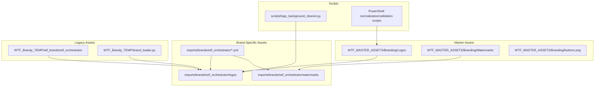
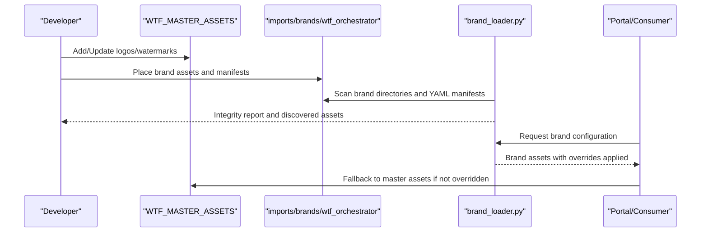
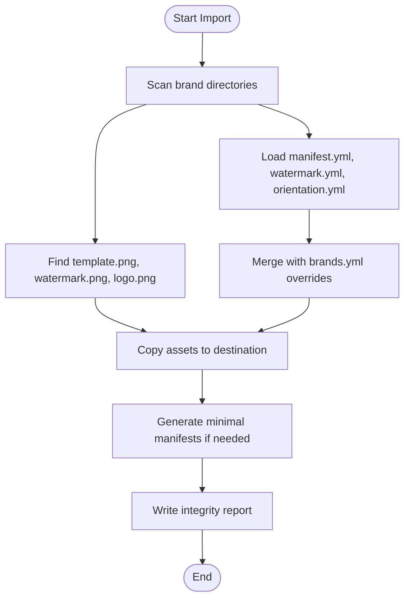
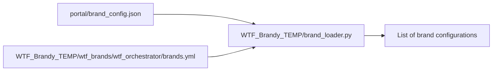
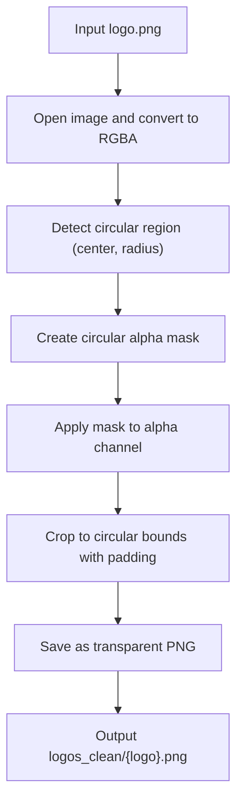
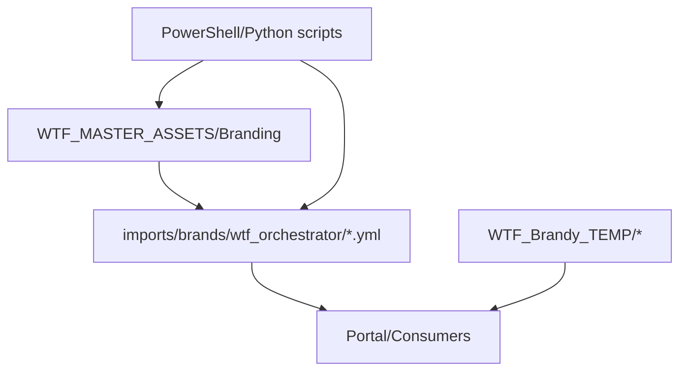

# Asset Management

<cite>
**Referenced Files in This Document**
- [brand_loader.py](file://app/brand_loader.py)
- [brand_loader.py](file://WTF_Brandy_TEMP/brand_loader.py)
- [brands.yml](file://WTF_Brandy_TEMP/wtf_brands/wtf_orchestrator/brands.yml)
- [logo_background_cleaner.py](file://scripts/logo_background_cleaner.py)
- [normalize_master_logos.ps1](file://normalize_master_logos.ps1)
- [standardize_logos.ps1](file://standardize_logos.ps1)
- [standardize_master_logo_names.ps1](file://standardize_master_logo_names.ps1)
- [validate_master_logos.ps1](file://validate_master_logos.ps1)
- [validate_brand_coverage.ps1](file://validate_brand_coverage.ps1)
- [buttons.png](file://WTF_MASTER_ASSETS/Branding/buttons.png)
- [Ai_watermark.png](file://WTF_MASTER_ASSETS/Branding/Watermarks/Landscape/Ai_watermark.png)
- [Ai_watermark.png](file://WTF_MASTER_ASSETS/Branding/Watermarks/Square/Ai_watermark.png)
- [Ai_watermark.png](file://WTF_MASTER_ASSETS/Branding/Watermarks/Vertical_HD/Ai_watermark.png)
- [wtf_logo.png](file://WTF_MASTER_ASSETS/Branding/Logos/Circle/wtf_logo.png)
- [wtf-logo.png](file://WTF_MASTER_ASSETS/Branding/Logos/Square/wtf-logo.png)
- [brand_config.json](file://portal/brand_config.json)
</cite>

## Table of Contents
1. [Introduction](#introduction)
2. [Project Structure](#project-structure)
3. [Core Components](#core-components)
4. [Architecture Overview](#architecture-overview)
5. [Detailed Component Analysis](#detailed-component-analysis)
6. [Dependency Analysis](#dependency-analysis)
7. [Performance Considerations](#performance-considerations)
8. [Troubleshooting Guide](#troubleshooting-guide)
9. [Conclusion](#conclusion)
10. [Appendices](#appendices)

## Introduction
This document describes the asset management system responsible for organizing logos, watermarks, and templates across multiple directories. It explains the WTF_MASTER_ASSETS structure, including logos grouped by orientation (Circle, Square), watermarks organized by orientation (Landscape, Square, Vertical_HD), and the global buttons.png. It documents the imports/brands/wtf_orchestrator system for brand-specific assets and the WTF_Brandy_TEMP legacy assets. It covers naming conventions, file organization patterns, and the background removal process for logos. Practical examples show how to add new assets, organize existing files, and maintain asset integrity. It also addresses asset validation, fallback mechanisms for missing assets, and the relationship between master assets and brand-specific overrides, along with automated processing scripts and quality assurance workflows.

## Project Structure
The asset management system spans three primary areas:
- Master assets: centralized WTF_MASTER_ASSETS/Branding with standardized logos, watermarks, and global buttons.png
- Brand-specific assets: imports/brands/wtf_orchestrator with per-brand logos, watermarks, templates, and optional manifests
- Legacy assets: WTF_Brandy_TEMP with older branding assets and a simplified loader

Key directories and files:
- WTF_MASTER_ASSETS/Branding
  - Logos/Circle: circular brand logos
  - Logos/Square: square brand logos
  - Watermarks/Landscape, Watermarks/Square, Watermarks/Vertical_HD: orientation-specific watermarks
  - buttons.png: global button graphics
- imports/brands/wtf_orchestrator
  - logos/, logos_clean/, watermarks/, templates/, manifests (brands.yml, watermark.yml, orientation.yml)
- WTF_Brandy_TEMP
  - wtf_brands/wtf_orchestrator: legacy brand assets and brands.yml
  - brand_loader.py: portal brand loader for JSON-based brand_config.json
- Scripts and PowerShell automation
  - scripts/logo_background_cleaner.py: background removal and circular transparency
  - normalize_master_logos.ps1, standardize_logos.ps1, standardize_master_logo_names.ps1, validate_master_logos.ps1, validate_brand_coverage.ps1: QA and maintenance workflows

**Diagram sources**
- [brand_loader.py](file://app/brand_loader.py#L168-L183)
- [brand_loader.py](file://WTF_Brandy_TEMP/brand_loader.py#L9-L59)
- [brands.yml](file://WTF_Brandy_TEMP/wtf_brands/wtf_orchestrator/brands.yml#L1-L423)
- [logo_background_cleaner.py](file://scripts/logo_background_cleaner.py#L99-L137)
- [normalize_master_logos.ps1](file://normalize_master_logos.ps1#L1-L65)
- [standardize_logos.ps1](file://standardize_logos.ps1#L1-L53)
- [standardize_master_logo_names.ps1](file://standardize_master_logo_names.ps1#L1-L89)
- [validate_master_logos.ps1](file://validate_master_logos.ps1#L1-L94)
- [validate_brand_coverage.ps1](file://validate_brand_coverage.ps1#L1-L91)

**Section sources**
- [brand_loader.py](file://app/brand_loader.py#L168-L183)
- [brand_loader.py](file://WTF_Brandy_TEMP/brand_loader.py#L9-L59)
- [brands.yml](file://WTF_Brandy_TEMP/wtf_brands/wtf_orchestrator/brands.yml#L1-L423)

## Core Components
- Master asset registry
  - Centralized logos and watermarks under WTF_MASTER_ASSETS/Branding organized by orientation
  - Global buttons.png for shared UI elements
- Brand-specific asset registry
  - imports/brands/wtf_orchestrator with per-brand folders and optional YAML manifests
  - Automatic discovery via filename conventions and YAML manifests
- Legacy asset registry
  - WTF_Brandy_TEMP with older assets and a JSON-based loader for portal
- Automated processing pipeline
  - Background removal for logos
  - Normalization and standardization of master assets
  - Validation scripts ensuring coverage and naming consistency

**Section sources**
- [brand_loader.py](file://app/brand_loader.py#L35-L129)
- [brand_loader.py](file://WTF_Brandy_TEMP/brand_loader.py#L9-L59)
- [logo_background_cleaner.py](file://scripts/logo_background_cleaner.py#L42-L98)
- [normalize_master_logos.ps1](file://normalize_master_logos.ps1#L1-L65)
- [standardize_logos.ps1](file://standardize_logos.ps1#L1-L53)
- [standardize_master_logo_names.ps1](file://standardize_master_logo_names.ps1#L1-L89)
- [validate_master_logos.ps1](file://validate_master_logos.ps1#L1-L94)
- [validate_brand_coverage.ps1](file://validate_brand_coverage.ps1#L1-L91)

## Architecture Overview
The asset management architecture supports two complementary flows:
- Master asset flow: centralized assets serve as the authoritative source for logos and watermarks
- Brand-specific override flow: per-brand assets can override master assets with local manifests and options

**Diagram sources**
- [brand_loader.py](file://app/brand_loader.py#L35-L129)
- [brand_loader.py](file://app/brand_loader.py#L344-L491)
- [brands.yml](file://WTF_Brandy_TEMP/wtf_brands/wtf_orchestrator/brands.yml#L1-L423)

## Detailed Component Analysis

### WTF_MASTER_ASSETS Structure
- Logos
  - Circle: circular brand logos suitable for overlays
  - Square: square brand logos for grid/list displays
  - Primary_Logos: maintenance scripts for cleanup and regeneration
- Watermarks
  - Landscape, Square, Vertical_HD: orientation-specific watermarks
- buttons.png
  - Global UI button graphics used across the system

Practical examples:
- Adding a new brand logo
  - Place the logo in the appropriate orientation folder under WTF_MASTER_ASSETS/Branding/Logos
  - Ensure the filename follows the standard naming convention for the brand
- Adding a new watermark
  - Place the watermark in the correct orientation folder under WTF_MASTER_ASSETS/Branding/Watermarks
  - Verify the watermark matches the brand’s identity and orientation requirements

**Section sources**
- [buttons.png](file://WTF_MASTER_ASSETS/Branding/buttons.png)
- [Ai_watermark.png](file://WTF_MASTER_ASSETS/Branding/Watermarks/Landscape/Ai_watermark.png)
- [Ai_watermark.png](file://WTF_MASTER_ASSETS/Branding/Watermarks/Square/Ai_watermark.png)
- [Ai_watermark.png](file://WTF_MASTER_ASSETS/Branding/Watermarks/Vertical_HD/Ai_watermark.png)
- [wtf_logo.png](file://WTF_MASTER_ASSETS/Branding/Logos/Circle/wtf_logo.png)
- [wtf-logo.png](file://WTF_MASTER_ASSETS/Branding/Logos/Square/wtf-logo.png)

### imports/brands/wtf_orchestrator System
- Asset discovery
  - Scans brand directories for template.png, watermark.png, and logo.png using filename conventions
  - Loads optional manifests: manifest.yml, watermark.yml, orientation.yml, routing.yml, platforms.yml
- Manifest precedence
  - YAML manifests can override defaults for watermark position/scale and orientation rules
  - Top-level brands.yml can define brand assets and options explicitly
- Asset import workflow
  - Imports assets from external sources into imports/brands/wtf_orchestrator
  - Generates minimal manifests if missing
  - Produces an integrity report summarizing findings

**Diagram sources**
- [brand_loader.py](file://app/brand_loader.py#L35-L129)
- [brand_loader.py](file://app/brand_loader.py#L344-L491)

**Section sources**
- [brand_loader.py](file://app/brand_loader.py#L35-L129)
- [brand_loader.py](file://app/brand_loader.py#L344-L491)
- [brands.yml](file://WTF_Brandy_TEMP/wtf_brands/wtf_orchestrator/brands.yml#L1-L423)

### WTF_Brandy_TEMP Legacy Assets
- Legacy brand assets under WTF_Brandy_TEMP/wtf_brands/wtf_orchestrator
- brands.yml defines brand metadata and default assets
- brand_loader.py loads brand configurations from a JSON file (brand_config.json) for the portal

**Diagram sources**
- [brand_loader.py](file://WTF_Brandy_TEMP/brand_loader.py#L9-L59)
- [brands.yml](file://WTF_Brandy_TEMP/wtf_brands/wtf_orchestrator/brands.yml#L1-L423)
- [brand_config.json](file://portal/brand_config.json)

**Section sources**
- [brand_loader.py](file://WTF_Brandy_TEMP/brand_loader.py#L9-L59)
- [brands.yml](file://WTF_Brandy_TEMP/wtf_brands/wtf_orchestrator/brands.yml#L1-L423)
- [brand_config.json](file://portal/brand_config.json)

### Asset Naming Conventions and Organization Patterns
- Master logos
  - Circle: {BrandName}_logo.png
  - Square: {BrandName}-logo.png or similar square variant
- Master watermarks
  - Landscape, Square, Vertical_HD: {BrandName}_watermark.png or orientation-specific variants
- Brand-specific assets
  - Use filename conventions: template.png, watermark.png, logo.png
  - Optional manifests: manifest.yml, watermark.yml, orientation.yml
- Legacy assets
  - Brands defined in brands.yml with explicit asset keys

Validation and standardization scripts enforce naming and coverage:
- standardize_logos.ps1 and standardize_master_logo_names.ps1: enforce {BrandName}_logo.png naming
- validate_brand_coverage.ps1: ensure every brand has matching watermark and logo
- validate_master_logos.ps1: compare master Circle logos against backend brand_config.json

**Section sources**
- [standardize_logos.ps1](file://standardize_logos.ps1#L1-L53)
- [standardize_master_logo_names.ps1](file://standardize_master_logo_names.ps1#L1-L89)
- [validate_brand_coverage.ps1](file://validate_brand_coverage.ps1#L1-L91)
- [validate_master_logos.ps1](file://validate_master_logos.ps1#L1-L94)

### Background Removal Process for Logos
The logo_background_cleaner.py script:
- Detects a circular region in the logo
- Creates a circular alpha mask
- Applies the mask to produce a transparent PNG cropped to the circular bounds
- Processes all PNG logos in imports/brands/wtf_orchestrator/logos and writes results to imports/brands/wtf_orchestrator/logos_clean

**Diagram sources**
- [logo_background_cleaner.py](file://scripts/logo_background_cleaner.py#L42-L98)

**Section sources**
- [logo_background_cleaner.py](file://scripts/logo_background_cleaner.py#L42-L98)

### Practical Examples

#### Adding New Brand Assets
- Place assets in imports/brands/wtf_orchestrator/{brand_slug}/
  - Add template.png, watermark.png, logo.png following naming conventions
  - Optionally add manifest.yml, watermark.yml, orientation.yml
- Run the import workflow to copy and validate assets
- Generate or update brands.yml if needed

**Section sources**
- [brand_loader.py](file://app/brand_loader.py#L344-L491)

#### Organizing Existing Files
- Normalize master logos to PNG using normalize_master_logos.ps1
- Standardize naming using standardize_logos.ps1 and standardize_master_logo_names.ps1
- Validate coverage using validate_brand_coverage.ps1 and validate_master_logos.ps1

**Section sources**
- [normalize_master_logos.ps1](file://normalize_master_logos.ps1#L1-L65)
- [standardize_logos.ps1](file://standardize_logos.ps1#L1-L53)
- [standardize_master_logo_names.ps1](file://standardize_master_logo_names.ps1#L1-L89)
- [validate_brand_coverage.ps1](file://validate_brand_coverage.ps1#L1-L91)
- [validate_master_logos.ps1](file://validate_master_logos.ps1#L1-L94)

#### Maintaining Asset Integrity
- Use the integrity report generated by the import workflow to identify missing or suspicious files
- Ensure every brand has a watermark and logo in the appropriate orientation
- Keep master assets synchronized with backend brand_config.json

**Section sources**
- [brand_loader.py](file://app/brand_loader.py#L437-L491)
- [validate_master_logos.ps1](file://validate_master_logos.ps1#L1-L94)

### Asset Validation and Fallback Mechanisms
- Validation
  - validate_brand_coverage.ps1 checks presence of {Brand}_logo.png and {Brand}_watermark.png variants
  - validate_master_logos.ps1 compares master Circle logos against portal brand_config.json
- Fallback
  - Brand-specific assets can override master assets via YAML manifests and explicit brands.yml entries
  - If brand-specific assets are missing, the system falls back to WTF_MASTER_ASSETS/Branding

**Section sources**
- [validate_brand_coverage.ps1](file://validate_brand_coverage.ps1#L1-L91)
- [validate_master_logos.ps1](file://validate_master_logos.ps1#L1-L94)
- [brand_loader.py](file://app/brand_loader.py#L131-L166)

## Dependency Analysis
The asset management system exhibits layered dependencies:
- Master assets provide baseline assets for all brands
- Brand-specific assets can override master assets via YAML manifests and explicit configuration
- Legacy assets coexist with modern imports/brands/wtf_orchestrator
- Scripts depend on the presence of specific directories and file patterns

**Diagram sources**
- [brand_loader.py](file://app/brand_loader.py#L131-L166)
- [brand_loader.py](file://app/brand_loader.py#L344-L491)
- [brands.yml](file://WTF_Brandy_TEMP/wtf_brands/wtf_orchestrator/brands.yml#L1-L423)

**Section sources**
- [brand_loader.py](file://app/brand_loader.py#L131-L166)
- [brand_loader.py](file://app/brand_loader.py#L344-L491)
- [brands.yml](file://WTF_Brandy_TEMP/wtf_brands/wtf_orchestrator/brands.yml#L1-L423)

## Performance Considerations
- Minimize redundant copies: use the integrity report to avoid duplicating assets unnecessarily
- Batch processing: leverage PowerShell scripts to normalize and validate assets in bulk
- Efficient discovery: rely on filename conventions and YAML manifests to reduce scanning overhead
- Transparency processing: pre-process logos to reduce runtime compositing costs

[No sources needed since this section provides general guidance]

## Troubleshooting Guide
Common issues and resolutions:
- Missing assets
  - Use validate_brand_coverage.ps1 and validate_master_logos.ps1 to identify missing logos and watermarks
  - Ensure filenames match expected patterns and orientations
- Incorrect naming
  - Run standardize_logos.ps1 and standardize_master_logo_names.ps1 to enforce {BrandName}_logo.png
- Fallback not working
  - Verify WTF_MASTER_ASSETS/Branding contains required assets
  - Confirm brands.yml and YAML manifests are properly formatted and placed
- Import errors
  - Review the integrity report generated by the import workflow for detailed error messages

**Section sources**
- [validate_brand_coverage.ps1](file://validate_brand_coverage.ps1#L1-L91)
- [validate_master_logos.ps1](file://validate_master_logos.ps1#L1-L94)
- [standardize_logos.ps1](file://standardize_logos.ps1#L1-L53)
- [standardize_master_logo_names.ps1](file://standardize_master_logo_names.ps1#L1-L89)
- [brand_loader.py](file://app/brand_loader.py#L437-L491)

## Conclusion
The asset management system combines centralized master assets with flexible brand-specific overrides. It enforces naming conventions, automates normalization and validation, and provides robust fallback mechanisms. By following the documented workflows and using the provided scripts, teams can efficiently manage logos, watermarks, and templates across multiple brands while maintaining high-quality, consistent branding.

[No sources needed since this section summarizes without analyzing specific files]

## Appendices

### Appendix A: Master Assets Reference
- Logos
  - Circle: {BrandName}_logo.png
  - Square: {BrandName}-logo.png
- Watermarks
  - Landscape, Square, Vertical_HD: {BrandName}_watermark.png
- buttons.png
  - Global UI graphics

**Section sources**
- [buttons.png](file://WTF_MASTER_ASSETS/Branding/buttons.png)
- [Ai_watermark.png](file://WTF_MASTER_ASSETS/Branding/Watermarks/Landscape/Ai_watermark.png)
- [Ai_watermark.png](file://WTF_MASTER_ASSETS/Branding/Watermarks/Square/Ai_watermark.png)
- [Ai_watermark.png](file://WTF_MASTER_ASSETS/Branding/Watermarks/Vertical_HD/Ai_watermark.png)
- [wtf_logo.png](file://WTF_MASTER_ASSETS/Branding/Logos/Circle/wtf_logo.png)
- [wtf-logo.png](file://WTF_MASTER_ASSETS/Branding/Logos/Square/wtf-logo.png)

### Appendix B: Brand-Specific Assets Reference
- Directory: imports/brands/wtf_orchestrator/{brand_slug}/
- Files: template.png, watermark.png, logo.png
- Manifests: manifest.yml, watermark.yml, orientation.yml, routing.yml, platforms.yml

**Section sources**
- [brand_loader.py](file://app/brand_loader.py#L35-L129)
- [brands.yml](file://WTF_Brandy_TEMP/wtf_brands/wtf_orchestrator/brands.yml#L1-L423)

### Appendix C: Legacy Assets Reference
- Directory: WTF_Brandy_TEMP/wtf_brands/wtf_orchestrator/
- Config: brands.yml
- Loader: brand_loader.py (JSON-based)

**Section sources**
- [brand_loader.py](file://WTF_Brandy_TEMP/brand_loader.py#L9-L59)
- [brands.yml](file://WTF_Brandy_TEMP/wtf_brands/wtf_orchestrator/brands.yml#L1-L423)