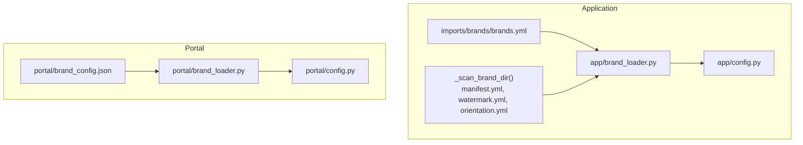
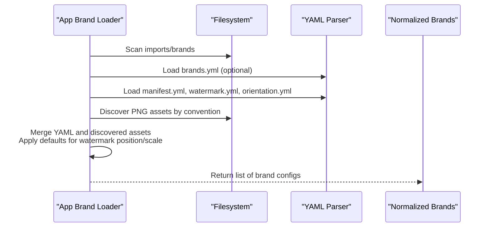
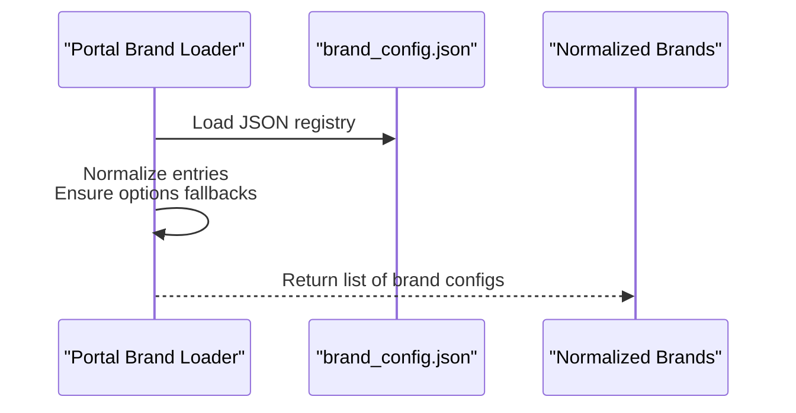
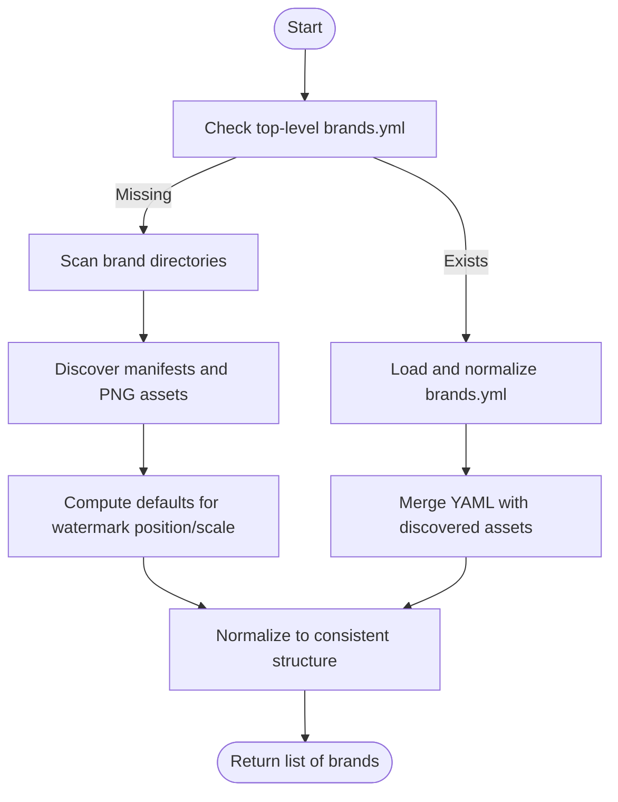
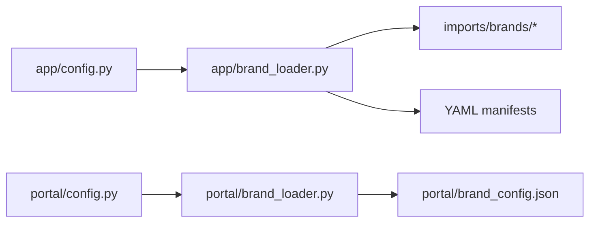

# Brand Configuration

<cite>
**Referenced Files in This Document**
- [brands.yml](file://WTF_Brandy_TEMP/wtf_brands/wtf_orchestrator/brands.yml)
- [brand_loader.py](file://app/brand_loader.py)
- [brand_loader.py](file://portal/brand_loader.py)
- [brand_config.json](file://portal/brand_config.json)
- [brand_config.json](file://WTF_Brandy_TEMP/brand_config.json)
- [imports_brands_brands.yml](file://imports/brands/brands.yml)
- [config.py](file://app/config.py)
- [config.py](file://portal/config.py)
- [manifest.yml](file://WTF_Brandy_TEMP/wtf_brands/wtf_orchestrator/manifest.yml)
- [watermark.yml](file://WTF_Brandy_TEMP/wtf_brands/wtf_orchestrator/watermark.yml)
- [orientation.yml](file://WTF_Brandy_TEMP/wtf_brands/wtf_orchestrator/orientation.yml)
- [routing.yml](file://WTF_Brandy_TEMP/wtf_brands/wtf_orchestrator/routing.yml)
- [platforms.yml](file://WTF_Brandy_TEMP/wtf_brands/wtf_orchestrator/platforms.yml)
</cite>

## Table of Contents
1. [Introduction](#introduction)
2. [Project Structure](#project-structure)
3. [Core Components](#core-components)
4. [Architecture Overview](#architecture-overview)
5. [Detailed Component Analysis](#detailed-component-analysis)
6. [Dependency Analysis](#dependency-analysis)
7. [Performance Considerations](#performance-considerations)
8. [Troubleshooting Guide](#troubleshooting-guide)
9. [Conclusion](#conclusion)
10. [Appendices](#appendices)

## Introduction
This document explains the brand configuration system that manages 25+ brand definitions through YAML and JSON files. It covers:
- The brands.yml structure, including display_name, assets mapping, and options configuration
- Hierarchical configuration with nested asset paths and watermark settings
- The brand loader’s role in parsing YAML files and dynamically loading configuration
- Practical examples for adding new brands, modifying existing configurations, and validating configuration
- Common YAML syntax pitfalls, asset path resolution, and fallback mechanisms
- How brand configuration integrates with the processing pipeline

## Project Structure
The brand configuration system spans two primary areas:
- Application-side brand loader and discovery logic
- Portal-side brand configuration and JSON-based brand registry

Key locations:
- Application brand loader: parses YAML manifests and scans directories to build brand configurations
- Portal brand loader: reads a JSON registry of brands for the web portal
- Centralized brand definitions: YAML and JSON files under imports/brands and portal imports

**Diagram sources**
- [brand_loader.py](file://app/brand_loader.py#L168-L183)
- [brand_loader.py](file://portal/brand_loader.py#L9-L59)
- [imports_brands_brands.yml](file://imports/brands/brands.yml#L1-L255)
- [config.py](file://app/config.py#L7-L17)
- [config.py](file://portal/config.py#L22-L28)

**Section sources**
- [brand_loader.py](file://app/brand_loader.py#L1-L499)
- [brand_loader.py](file://portal/brand_loader.py#L1-L59)
- [imports_brands_brands.yml](file://imports/brands/brands.yml#L1-L255)
- [brand_config.json](file://portal/brand_config.json#L1-L302)
- [config.py](file://app/config.py#L1-L18)
- [config.py](file://portal/config.py#L1-L42)

## Core Components
- brands.yml (centralized YAML): Defines brand-level metadata, assets, and options for all brands
- Manifest files (per brand): Optional YAML files that augment brand configuration with watermark position/scale and orientation rules
- Brand loader (application): Scans imports/brands, merges YAML and discovered assets, and produces normalized brand configs
- Brand loader (portal): Reads portal brand_config.json and normalizes brand configurations for the UI
- JSON registry (portal): A curated, human-friendly JSON registry of brands with explicit asset paths and options

Key responsibilities:
- Normalization: Ensures consistent shape across sources (name, display_name, assets, options)
- Fallbacks: Defaults for watermark position/scale when manifests are absent
- Discovery: Automatic detection of template, watermark, and logo assets via filename conventions
- Validation: Safe YAML loading and graceful handling of missing or malformed files

**Section sources**
- [brands.yml](file://WTF_Brandy_TEMP/wtf_brands/wtf_orchestrator/brands.yml#L1-L423)
- [brand_loader.py](file://app/brand_loader.py#L131-L166)
- [brand_loader.py](file://app/brand_loader.py#L35-L129)
- [brand_loader.py](file://portal/brand_loader.py#L9-L45)
- [brand_config.json](file://portal/brand_config.json#L1-L302)

## Architecture Overview
The system supports two complementary workflows:
- Dynamic discovery and YAML-driven configuration via the application brand loader
- Explicit JSON-driven configuration via the portal brand loader

**Diagram sources**
- [brand_loader.py](file://app/brand_loader.py#L168-L183)
- [brand_loader.py](file://app/brand_loader.py#L35-L129)

**Diagram sources**
- [brand_loader.py](file://portal/brand_loader.py#L9-L45)
- [brand_config.json](file://portal/brand_config.json#L1-L302)

## Detailed Component Analysis

### brands.yml Structure and Options
- Top-level brands mapping: Each brand key maps to a configuration block
- Required fields per brand:
  - display_name: Human-readable brand name
  - assets: Mapping of asset types to file paths
    - template: Base template PNG
    - logo: Brand logo PNG
    - watermark: Watermark PNG
    - glitch_overlays: Optional list of overlay PNGs
  - options: Rendering and placement options
    - watermark_position: e.g., top-center, bottom-right
    - watermark_scale: Relative scale factor
- Nested manifest support:
  - manifest.yml: Overrides display_name and watermark defaults
  - watermark.yml: Overrides watermark position and scale
  - orientation.yml: Orientation rules for videos
  - routing.yml: Enabled platforms and selection priority
  - platforms.yml: Platform capabilities and constraints

Best practices:
- Keep asset paths relative to the brands directory for portability
- Use manifest files to override defaults without editing central YAML
- Maintain consistent naming conventions for assets to enable automatic discovery

**Section sources**
- [brands.yml](file://WTF_Brandy_TEMP/wtf_brands/wtf_orchestrator/brands.yml#L1-L423)
- [imports_brands_brands.yml](file://imports/brands/brands.yml#L1-L255)
- [manifest.yml](file://WTF_Brandy_TEMP/wtf_brands/wtf_orchestrator/manifest.yml#L1-L4)
- [watermark.yml](file://WTF_Brandy_TEMP/wtf_brands/wtf_orchestrator/watermark.yml#L1-L3)
- [orientation.yml](file://WTF_Brandy_TEMP/wtf_brands/wtf_orchestrator/orientation.yml#L1-L4)
- [routing.yml](file://WTF_Brandy_TEMP/wtf_brands/wtf_orchestrator/routing.yml#L1-L235)
- [platforms.yml](file://WTF_Brandy_TEMP/wtf_brands/wtf_orchestrator/platforms.yml#L1-L267)

### Brand Loader (Application)
Responsibilities:
- Load top-level brands.yml if present and merge with discovered assets
- Scan brand directories for manifest files and PNG assets
- Compute defaults for watermark position and scale
- Normalize configuration into a consistent structure

Key behaviors:
- Fallbacks:
  - watermark_position defaults to bottom-right if not set
  - watermark_scale defaults to 0.25 if not set
  - display_name falls back to directory name if not provided
- Asset discovery:
  - Finds files matching patterns for template, watermark, and logo
  - Ignores non-brand directories and build artifacts
- Integrity reporting:
  - Generates an import summary with copied/skipped/generated counts and warnings

**Diagram sources**
- [brand_loader.py](file://app/brand_loader.py#L131-L166)
- [brand_loader.py](file://app/brand_loader.py#L35-L129)
- [brand_loader.py](file://app/brand_loader.py#L168-L183)

**Section sources**
- [brand_loader.py](file://app/brand_loader.py#L1-L499)

### Brand Loader (Portal)
Responsibilities:
- Load portal brand_config.json
- Normalize entries to a consistent structure
- Provide defaults for options when missing

Behavior highlights:
- Ensures options fallbacks for watermark_position and watermark_scale
- Builds a list of brand configurations suitable for UI rendering

**Section sources**
- [brand_loader.py](file://portal/brand_loader.py#L1-L59)
- [brand_config.json](file://portal/brand_config.json#L1-L302)

### Manifest Files and Watermark Settings
Manifest files provide hierarchical overrides:
- manifest.yml: Sets display_name and watermark defaults
- watermark.yml: Sets position and scale for watermarks
- orientation.yml: Defines orientation rules for video processing
- routing.yml: Enables platforms and sets selection priority
- platforms.yml: Describes platform-specific constraints and capabilities

Resolution order:
- Manifest values override YAML defaults
- Directory scanning provides asset paths when YAML does not specify absolute paths
- Final normalization ensures consistent structure across sources

**Section sources**
- [manifest.yml](file://WTF_Brandy_TEMP/wtf_brands/wtf_orchestrator/manifest.yml#L1-L4)
- [watermark.yml](file://WTF_Brandy_TEMP/wtf_brands/wtf_orchestrator/watermark.yml#L1-L3)
- [orientation.yml](file://WTF_Brandy_TEMP/wtf_brands/wtf_orchestrator/orientation.yml#L1-L4)
- [routing.yml](file://WTF_Brandy_TEMP/wtf_brands/wtf_orchestrator/routing.yml#L1-L235)
- [platforms.yml](file://WTF_Brandy_TEMP/wtf_brands/wtf_orchestrator/platforms.yml#L1-L267)

### Practical Examples

- Add a new brand
  - Option A: Add an entry to imports/brands/brands.yml with assets and options
  - Option B: Create a new brand directory under imports/brands/<BrandName> with manifest.yml and PNG assets; the loader will discover and normalize it
  - Option C: For portal UI, add an entry to portal/brand_config.json with assets and options

- Modify existing configuration
  - Adjust watermark position/scale in manifest.yml or watermark.yml
  - Change display_name in manifest.yml
  - Update routing.yml to enable/disable platforms or change priority

- Validate configuration
  - Run the application brand loader to generate an integrity report
  - Ensure YAML syntax is valid and indentation is consistent
  - Confirm asset paths resolve correctly relative to the brands directory

Asset path resolution:
- Prefer relative paths from the brands directory
- When generating brands.yml, paths are relativized automatically
- Absolute paths are allowed when YAML explicitly specifies them

Fallback mechanisms:
- watermark_position defaults to bottom-right
- watermark_scale defaults to 0.25
- display_name falls back to directory name if not provided

**Section sources**
- [brand_loader.py](file://app/brand_loader.py#L310-L342)
- [brand_loader.py](file://app/brand_loader.py#L274-L309)
- [brand_loader.py](file://app/brand_loader.py#L94-L105)
- [brand_loader.py](file://portal/brand_loader.py#L25-L32)

## Dependency Analysis
The brand configuration system depends on:
- Filesystem layout and naming conventions for automatic asset discovery
- YAML parsing for manifests and centralized brand definitions
- JSON parsing for portal registry
- Configuration modules that define import/output directories

**Diagram sources**
- [config.py](file://app/config.py#L7-L17)
- [config.py](file://portal/config.py#L22-L28)
- [brand_loader.py](file://app/brand_loader.py#L1-L499)
- [brand_loader.py](file://portal/brand_loader.py#L1-L59)

**Section sources**
- [config.py](file://app/config.py#L1-L18)
- [config.py](file://portal/config.py#L1-L42)
- [brand_loader.py](file://app/brand_loader.py#L1-L499)
- [brand_loader.py](file://portal/brand_loader.py#L1-L59)

## Performance Considerations
- Directory scanning and YAML parsing are lightweight; avoid excessive recursion by filtering ignored directories
- Prefer relative asset paths to reduce normalization overhead
- Consolidate brand definitions in brands.yml to minimize filesystem traversal
- Use manifest files sparingly to avoid redundant parsing

## Troubleshooting Guide
Common YAML syntax errors:
- Incorrect indentation or mixing tabs and spaces
- Unquoted special characters in strings
- Trailing commas or missing colons

Symptoms and fixes:
- YAML load failures: Verify indentation and quoting; remove trailing commas
- Missing assets: Ensure PNG files match discovery patterns; confirm relative paths are correct
- Unexpected watermark placement: Set position/scale in manifest.yml or watermark.yml
- Portal UI issues: Validate JSON syntax and ensure required fields exist

Asset path resolution tips:
- Use paths relative to the brands directory
- When copying assets, preserve directory structure to maintain relative paths
- If using absolute paths, ensure they are valid on the target system

Fallback verification:
- Confirm defaults for watermark_position and watermark_scale are acceptable
- Ensure display_name is set to avoid falling back to directory names

**Section sources**
- [brand_loader.py](file://app/brand_loader.py#L21-L26)
- [brand_loader.py](file://app/brand_loader.py#L94-L105)
- [brand_loader.py](file://portal/brand_loader.py#L25-L32)

## Conclusion
The brand configuration system provides a flexible, hierarchical approach to managing 25+ brands. By combining centralized YAML definitions with manifest-based overrides and automatic asset discovery, it supports both rapid iteration and precise control. The portal’s JSON registry complements this with a straightforward, UI-ready configuration format. Following the best practices and troubleshooting steps outlined here will help maintain a robust and scalable brand configuration pipeline.

## Appendices

### Appendix A: Example Brand Entry (YAML)
- A typical brand entry includes display_name, assets, and options
- Manifest files can override watermark defaults and provide orientation rules

**Section sources**
- [brands.yml](file://WTF_Brandy_TEMP/wtf_brands/wtf_orchestrator/brands.yml#L1-L423)
- [imports_brands_brands.yml](file://imports/brands/brands.yml#L1-L255)
- [manifest.yml](file://WTF_Brandy_TEMP/wtf_brands/wtf_orchestrator/manifest.yml#L1-L4)
- [watermark.yml](file://WTF_Brandy_TEMP/wtf_brands/wtf_orchestrator/watermark.yml#L1-L3)
- [orientation.yml](file://WTF_Brandy_TEMP/wtf_brands/wtf_orchestrator/orientation.yml#L1-L4)

### Appendix B: Example Brand Entry (JSON)
- The portal expects a JSON registry with display_name, assets, and options
- Options fallbacks are applied when values are missing

**Section sources**
- [brand_config.json](file://portal/brand_config.json#L1-L302)
- [brand_loader.py](file://portal/brand_loader.py#L25-L32)