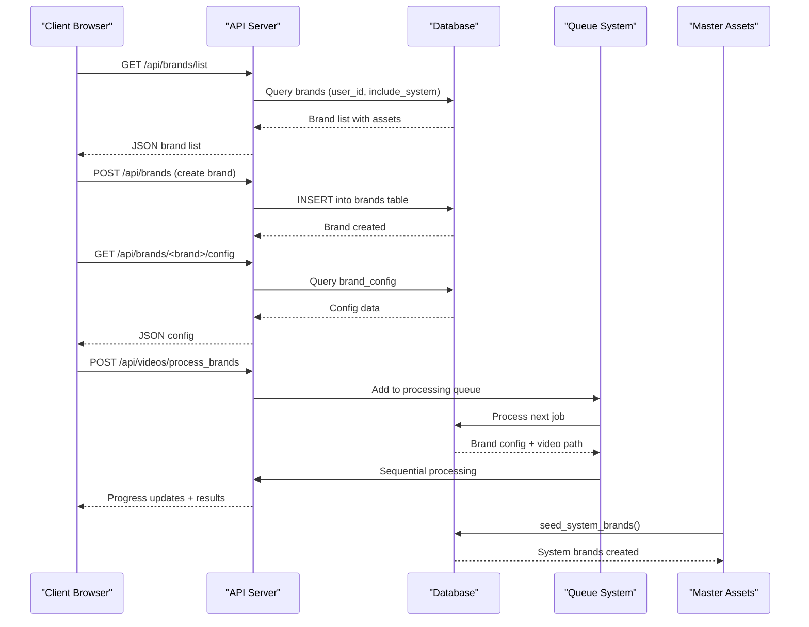
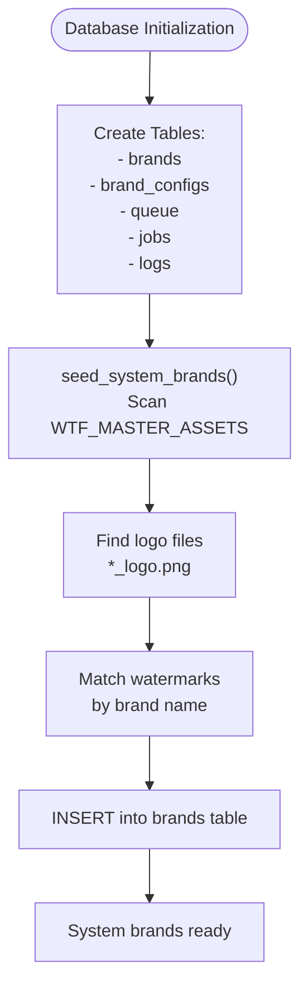
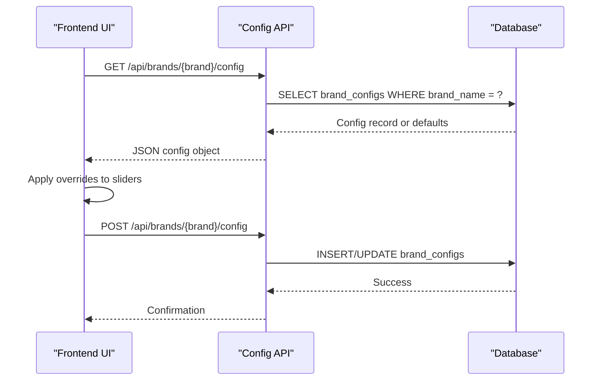
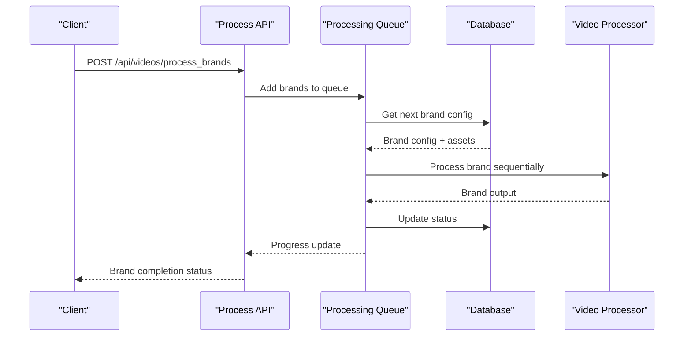
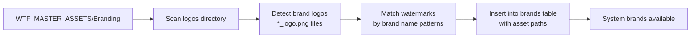
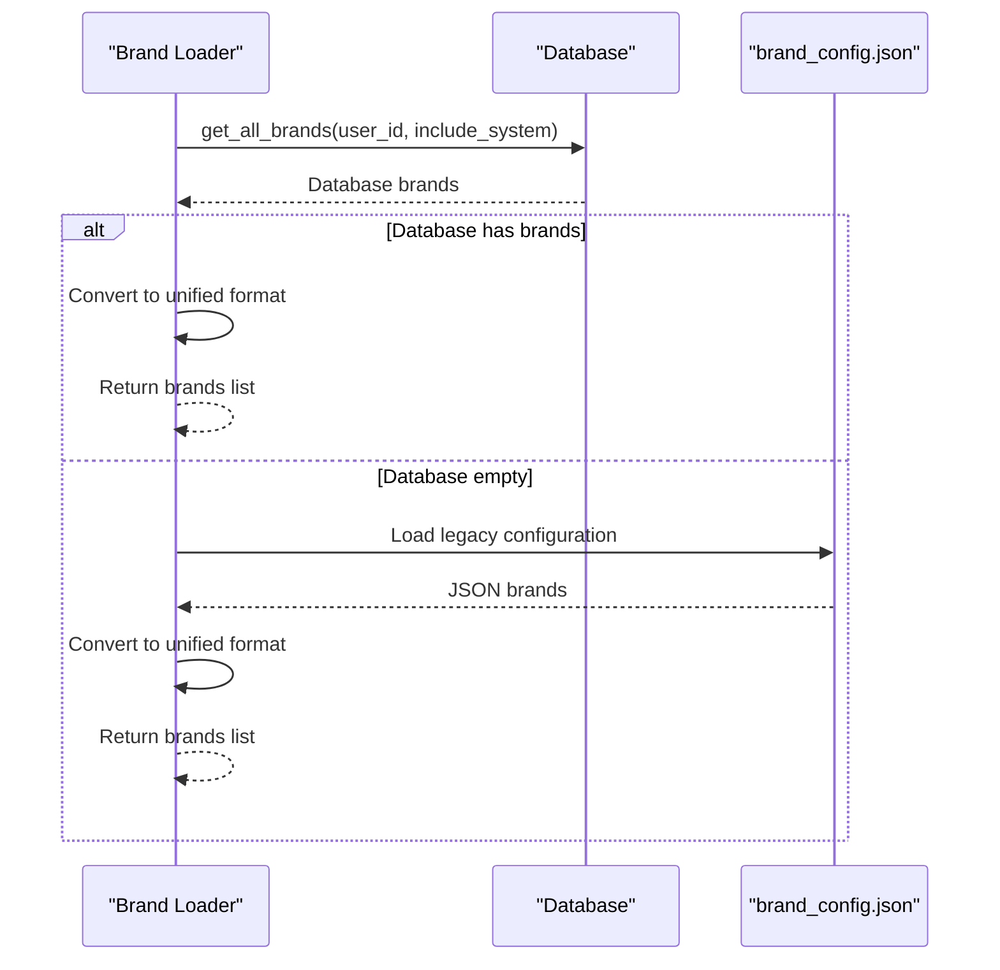
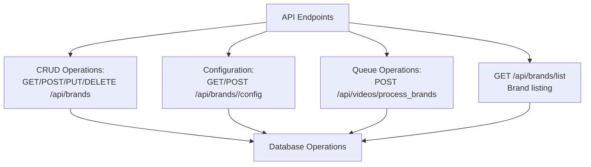
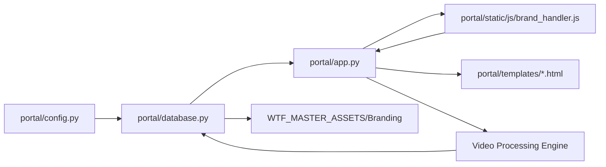

# Brand Management System

<cite>
**Referenced Files in This Document**
- [database.py](file://portal/database.py)
- [brand_loader.py](file://portal/brand_loader.py)
- [brand_loader.py](file://app/brand_loader.py)
- [app.py](file://portal/app.py)
- [config.py](file://portal/config.py)
- [brand_config.json](file://portal/brand_config.json)
- [brand_handler.js](file://portal/static/js/brand_handler.js)
- [clean_dashboard.html](file://portal/templates/clean_dashboard.html)
- [BritainWTF_logo.png](file://WTF_MASTER_ASSETS/Branding/Logos/Circle/BritainWTF_logo.png)
- [Australia_watermark.png](file://WTF_MASTER_ASSETS/Branding/Watermarks/Landscape/Australia_watermark.png)
</cite>

## Update Summary
**Changes Made**
- Updated sequential brand processing workflow replaces bulk processing
- Individual brand override states maintained separately with queue-based processing
- Enhanced configuration loading from /api/brands/{brand_name}/config endpoint
- Removed legacy save configuration functionality in favor of queue-based processing
- Added comprehensive queue mode with per-brand override management

## Table of Contents
1. [Introduction](#introduction)
2. [Project Structure](#project-structure)
3. [Core Components](#core-components)
4. [Architecture Overview](#architecture-overview)
5. [Detailed Component Analysis](#detailed-component-analysis)
6. [Dependency Analysis](#dependency-analysis)
7. [Performance Considerations](#performance-considerations)
8. [Troubleshooting Guide](#troubleshooting-guide)
9. [Conclusion](#conclusion)
10. [Appendices](#appendices)

## Introduction
This document describes the brand management system responsible for organizing and applying 25+ brand configurations with automatic template application. The system has been completely rewritten to use a database-driven approach with enhanced sequential processing capabilities. The new system features individual brand override state management, queue-based processing, and comprehensive configuration persistence through dedicated API endpoints.

## Project Structure
The brand management system now centers around a database-driven architecture with unified configuration and asset management:
- SQLite database with unified brands table supporting multi-tenant ownership
- Database-backed brand configuration with persistent settings
- Master assets repository for logos and watermarks with automatic seeding
- API endpoints for brand management and configuration persistence
- Frontend integration for brand selection and configuration
- Queue-based processing system for sequential brand application

```mermaid
graph TB
subgraph "Database Layer"
DB["SQLite Database<br/>portal.db"]
BRANDS["brands Table<br/>Multi-tenant ownership<br/>System templates<br/>Asset paths"]
CONFIGS["brand_configs Table<br/>Persistent settings<br/>Individual overrides"]
QUEUE["queue Table<br/>Processing queue<br/>Job management"]
END
subgraph "API Layer"
API["REST API Endpoints<br/>/api/brands/*<br/>Brand CRUD operations<br/>Config management<br/>Queue processing"]
END
subgraph "Master Assets"
MASTER["WTF_MASTER_ASSETS<br/>Branding/Logos/*.png<br/>Branding/Watermarks/*.png"]
END
subgraph "Frontend"
FRONT["Brand Selection UI<br/>BrandHandler Class<br/>Queue Mode<br/>Override Management"]
END
subgraph "Processing Engine"
PROCESS["Video Processor<br/>Sequential Branding<br/>Per-brand Overrides"]
END
DB --> BRANDS
DB --> CONFIGS
DB --> QUEUE
API --> DB
API --> PROCESS
MASTER --> BRANDS
FRONT --> API
FRONT --> PROCESS
```

**Diagram sources**
- [database.py](file://portal/database.py#L67-L124)
- [app.py](file://portal/app.py#L977-L1169)
- [brand_loader.py](file://portal/brand_loader.py#L49-L162)
- [brand_config.json](file://portal/brand_config.json#L1-L302)

**Section sources**
- [database.py](file://portal/database.py#L67-L124)
- [app.py](file://portal/app.py#L977-L1169)
- [brand_loader.py](file://portal/brand_loader.py#L49-L162)

## Core Components
- **Unified Brands Database**: SQLite database with brands table supporting multi-tenant ownership, system templates, and asset path management
- **Brand Configuration Persistence**: Separate brand_configs table for storing user-specific brand settings with defaults
- **Queue-Based Processing**: Sequential brand processing system with individual override state management
- **Enhanced Configuration API**: Dedicated endpoints for per-brand configuration loading and saving
- **Master Assets Seeding**: Automatic seeding from WTF_MASTER_ASSETS with logo and watermark detection
- **API-First Design**: REST endpoints for brand CRUD operations, configuration management, and brand listing
- **Multi-Tenant Architecture**: Support for user-specific brands alongside system brands with locking mechanisms
- **Frontend Integration**: JavaScript BrandHandler class for dynamic brand loading and selection with queue mode

**Section sources**
- [database.py](file://portal/database.py#L67-L124)
- [database.py](file://portal/database.py#L265-L374)
- [database.py](file://portal/database.py#L527-L617)
- [app.py](file://portal/app.py#L977-L1169)
- [brand_loader.py](file://portal/brand_loader.py#L49-L162)

## Architecture Overview
The system now operates on a database-first architecture with API endpoints, queue-based processing, and frontend integration:
- Database layer manages brand definitions, assets, configurations, and processing queues
- API layer provides REST endpoints for brand management operations and configuration persistence
- Frontend layer handles brand selection, queue mode, and per-brand override management
- Master assets seeding provides automatic brand creation from existing assets
- Queue system processes brands sequentially with individual override state tracking



**Diagram sources**
- [app.py](file://portal/app.py#L977-L1169)
- [database.py](file://portal/database.py#L389-L430)
- [database.py](file://portal/database.py#L527-L617)

## Detailed Component Analysis

### Database-Driven Configuration System
- **Unified Brands Table**: Single source of truth for all brand information including name, display_name, user_id, asset paths, and configuration settings
- **Multi-Tenant Support**: Brands can be owned by specific users (user_id) or system-wide (NULL user_id)
- **System Templates**: System brands marked with is_system flag and automatically seeded from master assets
- **Asset Management**: Direct storage of asset paths relative to project root for easy access
- **Configuration Persistence**: Separate table for user-specific brand settings with defaults and individual override states



**Diagram sources**
- [database.py](file://portal/database.py#L9-L128)
- [database.py](file://portal/database.py#L527-L617)

**Section sources**
- [database.py](file://portal/database.py#L67-L124)
- [database.py](file://portal/database.py#L527-L617)

### Enhanced Configuration Loading System
- **Per-Brand Configuration API**: Dedicated endpoint `/api/brands/{brand_name}/config` for loading individual brand settings
- **Individual Override State**: Each brand maintains its own override state in the processing queue
- **Default Fallback**: Automatic fallback to default configuration values when no saved config exists
- **Real-time Updates**: Frontend loads and saves configurations independently for each selected brand



**Diagram sources**
- [app.py](file://portal/app.py#L995-L1051)
- [database.py](file://portal/database.py#L265-L374)

**Section sources**
- [app.py](file://portal/app.py#L995-L1051)
- [database.py](file://portal/database.py#L265-L374)

### Sequential Brand Processing Workflow
- **Queue-Based Processing**: Replaces bulk processing with sequential brand application
- **Individual Override Management**: Each brand maintains separate override state during processing
- **Progress Tracking**: Real-time progress updates with status indicators for each brand
- **Error Handling**: Individual brand failure doesn't affect remaining queue items



**Diagram sources**
- [app.py](file://portal/app.py#L329-L626)
- [clean_dashboard.html](file://portal/templates/clean_dashboard.html#L804-L1072)

**Section sources**
- [app.py](file://portal/app.py#L329-L626)
- [clean_dashboard.html](file://portal/templates/clean_dashboard.html#L804-L1072)

### Master Assets System (Logos, Watermarks, Templates)
- **Automatic Seeding**: System brands are automatically created from WTF_MASTER_ASSETS logos and watermarks
- **Pattern Matching**: Brand detection uses *_logo.png naming convention with watermark matching by clean brand names
- **Orientation Support**: Watermarks are categorized by orientation (Vertical_HD, Square, Landscape)
- **Path Management**: Asset paths stored as relative paths from project root for portability



**Diagram sources**
- [database.py](file://portal/database.py#L527-L617)
- [BritainWTF_logo.png](file://WTF_MASTER_ASSETS/Branding/Logos/Circle/BritainWTF_logo.png)
- [Australia_watermark.png](file://WTF_MASTER_ASSETS/Branding/Watermarks/Landscape/Australia_watermark.png)

**Section sources**
- [database.py](file://portal/database.py#L527-L617)
- [BritainWTF_logo.png](file://WTF_MASTER_ASSETS/Branding/Logos/Circle/BritainWTF_logo.png)
- [Australia_watermark.png](file://WTF_MASTER_ASSETS/Branding/Watermarks/Landscape/Australia_watermark.png)

### Brand Loader: Database-First Approach
- **Database Priority**: Brand loader prioritizes database-loaded brands over legacy JSON configuration
- **Fallback Mechanism**: Falls back to brand_config.json if database is empty
- **Multi-Tenant Filtering**: Supports user-specific brand filtering with system brand inclusion options
- **Unified Format**: Converts database records to consistent brand configuration format



**Diagram sources**
- [brand_loader.py](file://portal/brand_loader.py#L49-L111)

**Section sources**
- [brand_loader.py](file://portal/brand_loader.py#L49-L111)

### API-First Brand Management
- **Complete CRUD Operations**: Full create, read, update, delete functionality for brands
- **Configuration Management**: Separate endpoints for brand-specific configuration persistence
- **Locking Mechanisms**: System brands can be locked to prevent modification
- **Multi-Tenant Support**: User-specific brand filtering and ownership validation



**Diagram sources**
- [app.py](file://portal/app.py#L977-L1169)
- [database.py](file://portal/database.py#L389-L525)

**Section sources**
- [app.py](file://portal/app.py#L977-L1169)
- [database.py](file://portal/database.py#L389-L525)

### Frontend Integration and Queue Mode
- **Dynamic Brand Loading**: JavaScript BrandHandler class loads brands via API calls
- **Brand Selection UI**: HTML templates integrate with API endpoints for brand selection
- **Queue Mode Interface**: Real-time queue processing with individual brand status tracking
- **Override Management**: Per-brand configuration overrides with live preview
- **Real-time Updates**: Frontend reflects database changes immediately

**Section sources**
- [brand_handler.js](file://portal/static/js/brand_handler.js#L1-L49)
- [clean_dashboard.html](file://portal/templates/clean_dashboard.html#L677-L700)
- [clean_dashboard.html](file://portal/templates/clean_dashboard.html#L804-L1072)

## Dependency Analysis
- **Database Layer**: SQLite database with table initialization and CRUD operations
- **API Layer**: Flask application with REST endpoints for brand management
- **Frontend Layer**: JavaScript classes and HTML templates for brand interaction
- **Master Assets**: External asset repository for automatic seeding
- **Processing Engine**: Video processor with sequential brand application



**Diagram sources**
- [config.py](file://portal/config.py#L1-L42)
- [database.py](file://portal/database.py#L1-L128)
- [app.py](file://portal/app.py#L977-L1169)

**Section sources**
- [config.py](file://portal/config.py#L1-L42)
- [database.py](file://portal/database.py#L1-L128)
- [app.py](file://portal/app.py#L977-L1169)

## Performance Considerations
- **Database Queries**: Efficient querying with proper indexing on brand_name and user_id fields
- **Connection Management**: Proper database connection handling with row_factory for dict-like access
- **Asset Path Resolution**: Relative paths from project root for efficient asset access
- **API Response Optimization**: Minimal data transfer with only necessary brand fields
- **Seeding Performance**: Single-pass scanning of master assets directory during initialization
- **Queue Processing**: Sequential processing prevents resource conflicts and ensures stability
- **Memory Management**: Individual brand override states are managed per queue item for efficient memory usage

## Troubleshooting Guide
Common issues and resolutions:
- **Database Initialization**: Database tables are automatically created on import; check DB_PATH configuration
- **Missing System Brands**: Run seed_system_brands() or ensure WTF_MASTER_ASSETS contains proper logo files
- **API Access Issues**: Verify API endpoints are properly mounted and accessible
- **Asset Path Problems**: Ensure asset paths are relative to project root as stored in database
- **Brand Locking**: System brands are locked by default; use unlock mechanism before modification
- **Queue Processing Issues**: Check queue table for stuck jobs and verify processing permissions
- **Configuration Loading Failures**: Verify brand_config entries exist for requested brands
- **Sequential Processing Delays**: Monitor queue status and ensure proper job scheduling

**Section sources**
- [database.py](file://portal/database.py#L9-L128)
- [database.py](file://portal/database.py#L527-L617)
- [app.py](file://portal/app.py#L977-L1169)

## Conclusion
The brand management system has been completely transformed from a YAML-based file system approach to a robust database-driven architecture with enhanced sequential processing capabilities. The new system provides multi-tenant support, automatic asset seeding, comprehensive CRUD operations, queue-based processing, and seamless frontend integration. This foundation enables scalable brand management with persistent configuration storage, real-time updates, and individual brand override state management across all system components.

## Appendices

### Best Practices for Database-Driven Brand Management
- **Use System Templates**: Leverage automatic seeding from master assets for consistency
- **Implement Multi-Tenant Logic**: Utilize user_id filtering for brand ownership separation
- **Leverage Locking**: Use system brand locking to prevent accidental modifications
- **Monitor Database Performance**: Index frequently queried fields like brand_name and user_id
- **Regular Asset Maintenance**: Keep WTF_MASTER_ASSETS organized for optimal seeding performance
- **Queue Management**: Monitor processing queue for optimal performance and resource utilization
- **Configuration Backup**: Regularly backup brand_configs table for configuration persistence
- **Error Handling**: Implement proper error handling for individual brand failures in queue processing