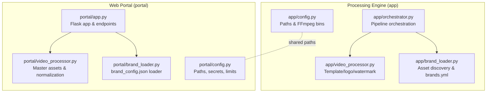
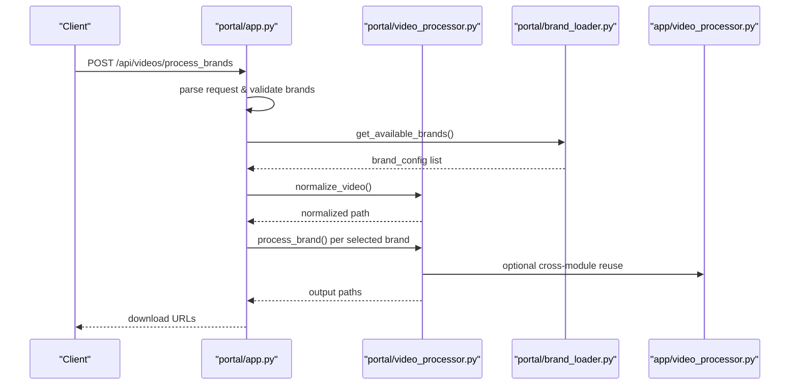
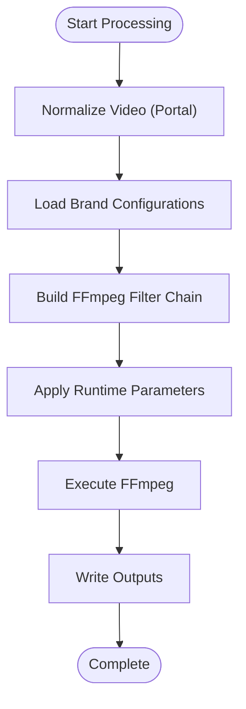
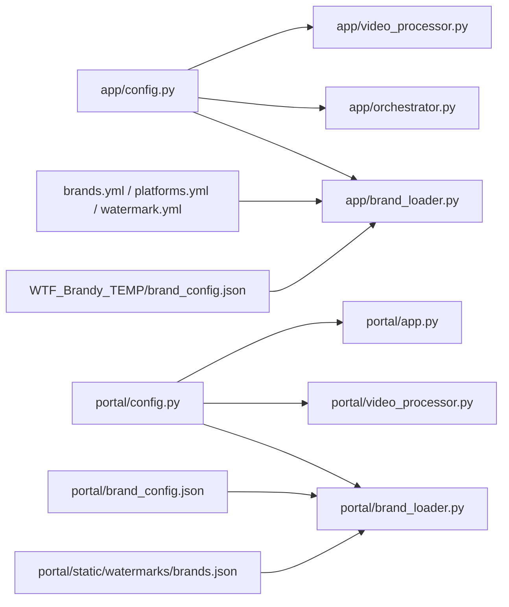

# Configuration Management

<cite>
**Referenced Files in This Document**
- [app/config.py](file://app/config.py)
- [portal/config.py](file://portal/config.py)
- [app/video_processor.py](file://app/video_processor.py)
- [portal/video_processor.py](file://portal/video_processor.py)
- [app/orchestrator.py](file://app/orchestrator.py)
- [portal/app.py](file://portal/app.py)
- [app/brand_loader.py](file://app/brand_loader.py)
- [portal/brand_loader.py](file://portal/brand_loader.py)
- [WTF_Brandy_TEMP/wtf_brands/wtf_orchestrator/brands.yml](file://WTF_Brandy_TEMP/wtf_brands/wtf_orchestrator/brands.yml)
- [WTF_Brandy_TEMP/wtf_brands/wtf_orchestrator/platforms.yml](file://WTF_Brandy_TEMP/wtf_brands/wtf_orchestrator/platforms.yml)
- [WTF_Brandy_TEMP/wtf_brands/wtf_orchestrator/watermark.yml](file://WTF_Brandy_TEMP/wtf_brands/wtf_orchestrator/watermark.yml)
- [WTF_Brandy_TEMP/brand_config.json](file://WTF_Brandy_TEMP/brand_config.json)
- [portal/brand_config.json](file://portal/brand_config.json)
- [portal/static/watermarks/brands.json](file://portal/static/watermarks/brands.json)
- [requirements.txt](file://requirements.txt)
</cite>

## Table of Contents
1. [Introduction](#introduction)
2. [Project Structure](#project-structure)
3. [Core Components](#core-components)
4. [Architecture Overview](#architecture-overview)
5. [Detailed Component Analysis](#detailed-component-analysis)
6. [Dependency Analysis](#dependency-analysis)
7. [Performance Considerations](#performance-considerations)
8. [Troubleshooting Guide](#troubleshooting-guide)
9. [Conclusion](#conclusion)

## Introduction
This document describes the configuration management system for the WatchTheFall Orchestrator v3 application. It covers path configuration, binary locations, environment variable management, runtime configuration options for FFmpeg and processing parameters, centralized configuration across the processing engine and web application, the brand configuration system, and custom processing module options. It also includes examples of environment-specific configurations and best practices for maintaining configuration consistency.

## Project Structure
The configuration system spans two primary areas:
- Processing Engine (app/): Local CLI-oriented processing with brand asset discovery and overlay composition.
- Web Portal (portal/): Flask-based web application with brand configuration loading, video normalization, and FFmpeg tuning for production deployment.

Key configuration touchpoints:
- Centralized path and binary configuration
- Environment variable overrides
- Brand configuration via YAML and JSON
- Runtime processing parameters for FFmpeg and overlays

**Diagram sources**
- [app/config.py](file://app/config.py#L1-L18)
- [portal/config.py](file://portal/config.py#L1-L42)
- [app/orchestrator.py](file://app/orchestrator.py#L1-L172)
- [app/video_processor.py](file://app/video_processor.py#L1-L273)
- [app/brand_loader.py](file://app/brand_loader.py#L1-L499)
- [portal/app.py](file://portal/app.py#L1-L800)
- [portal/video_processor.py](file://portal/video_processor.py#L1-L500)
- [portal/brand_loader.py](file://portal/brand_loader.py#L1-L59)

**Section sources**
- [app/config.py](file://app/config.py#L1-L18)
- [portal/config.py](file://portal/config.py#L1-L42)

## Core Components
- Path configuration: Centralized resolution of project roots, imports/brands, output, UI, and temporary directories. Ensures directories exist at startup.
- Binary configuration: FFmpeg and ffprobe paths resolved from environment variables with sensible defaults.
- Brand configuration: Two complementary systems:
  - YAML-based brand definitions and platform rules for the processing engine.
  - JSON-based brand configuration for the web portal’s brand selection UI.
- Runtime processing parameters: FFmpeg tuning, watermark opacity/scale, logo sizing/padding, and thread/buffer settings optimized for Render Pro environments.

**Section sources**
- [app/config.py](file://app/config.py#L1-L18)
- [portal/config.py](file://portal/config.py#L1-L42)
- [WTF_Brandy_TEMP/wtf_brands/wtf_orchestrator/brands.yml](file://WTF_Brandy_TEMP/wtf_brands/wtf_orchestrator/brands.yml#L1-L423)
- [WTF_Brandy_TEMP/wtf_brands/wtf_orchestrator/platforms.yml](file://WTF_Brandy_TEMP/wtf_brands/wtf_orchestrator/platforms.yml#L1-L267)
- [WTF_Brandy_TEMP/wtf_brands/wtf_orchestrator/watermark.yml](file://WTF_Brandy_TEMP/wtf_brands/wtf_orchestrator/watermark.yml#L1-L3)
- [WTF_Brandy_TEMP/brand_config.json](file://WTF_Brandy_TEMP/brand_config.json#L1-L302)
- [portal/brand_config.json](file://portal/brand_config.json#L1-L302)
- [portal/static/watermarks/brands.json](file://portal/static/watermarks/brands.json#L1-L28)

## Architecture Overview
The configuration architecture separates concerns:
- Paths and binaries are defined centrally and imported by modules.
- Brand definitions are loaded differently depending on context:
  - Processing engine loads from YAML manifests and directory scanning.
  - Web portal loads from JSON configuration for UI-driven brand selection.
- Runtime parameters are set at module level and can be overridden per-request in the portal.

**Diagram sources**
- [portal/app.py](file://portal/app.py#L329-L608)
- [portal/video_processor.py](file://portal/video_processor.py#L21-L68)
- [portal/brand_loader.py](file://portal/brand_loader.py#L9-L59)
- [app/video_processor.py](file://app/video_processor.py#L180-L253)

## Detailed Component Analysis

### Path and Binary Configuration
- Centralized path resolution:
  - Project roots and derived directories for imports, outputs, UI, and temp spaces.
  - Ensures directories exist at startup to avoid runtime failures.
- Binary configuration:
  - FFmpeg and ffprobe paths resolved from environment variables with defaults.
  - Allows overriding binary locations for Docker, CI, or custom installations.

Best practices:
- Set environment variables for binary paths in containerized or CI environments.
- Keep relative paths consistent with project root to simplify deployment.

**Section sources**
- [app/config.py](file://app/config.py#L1-L18)
- [portal/config.py](file://portal/config.py#L1-L42)

### Brand Configuration Systems
- Processing Engine (YAML):
  - brands.yml defines brand identity, display names, default captions/hashtags, watermark opacity/position, and posting cadence.
  - platforms.yml defines platform constraints, aspect ratios, resolutions, and watermark safe zones.
  - watermark.yml provides default watermark position and scale.
  - Directory scanning discovers assets and minimal manifests if missing.
- Web Portal (JSON):
  - brand_config.json lists brands with assets and options for UI-driven selection.
  - portal/static/watermarks/brands.json maps brand keys to watermark filenames.

Runtime behavior:
- Processing engine builds overlays using template/logo/watermark assets discovered from imports/brands.
- Portal loads brand_config.json to populate brand selection UI and applies watermark/logo overrides per request.

**Section sources**
- [WTF_Brandy_TEMP/wtf_brands/wtf_orchestrator/brands.yml](file://WTF_Brandy_TEMP/wtf_brands/wtf_orchestrator/brands.yml#L1-L423)
- [WTF_Brandy_TEMP/wtf_brands/wtf_orchestrator/platforms.yml](file://WTF_Brandy_TEMP/wtf_brands/wtf_orchestrator/platforms.yml#L1-L267)
- [WTF_Brandy_TEMP/wtf_brands/wtf_orchestrator/watermark.yml](file://WTF_Brandy_TEMP/wtf_brands/wtf_orchestrator/watermark.yml#L1-L3)
- [app/brand_loader.py](file://app/brand_loader.py#L1-L499)
- [WTF_Brandy_TEMP/brand_config.json](file://WTF_Brandy_TEMP/brand_config.json#L1-L302)
- [portal/brand_config.json](file://portal/brand_config.json#L1-L302)
- [portal/static/watermarks/brands.json](file://portal/static/watermarks/brands.json#L1-L28)

### Runtime Configuration Options and Performance Tuning
- FFmpeg settings:
  - Processing engine: Uses ffprobe for metadata, libx264 encoding, CRF preset, and copies audio tracks.
  - Portal: Normalizes videos to 8-bit H.264 SDR, sets pixel format, faststart, and AAC audio.
  - Render Pro optimizations: Threads, filter threads, buffer size, and tuned presets.
- Watermark and logo parameters:
  - Watermark opacity adapts to video brightness.
  - Watermark scale and position configurable per brand.
  - Logo scale and padding configurable per request in portal.
- Platform-aware constraints:
  - Platform rules define aspect ratios, resolutions, and watermark safe zones.

**Diagram sources**
- [portal/video_processor.py](file://portal/video_processor.py#L21-L68)
- [portal/video_processor.py](file://portal/video_processor.py#L369-L385)
- [app/video_processor.py](file://app/video_processor.py#L92-L107)
- [WTF_Brandy_TEMP/wtf_brands/wtf_orchestrator/platforms.yml](file://WTF_Brandy_TEMP/wtf_brands/wtf_orchestrator/platforms.yml#L260-L267)

**Section sources**
- [app/video_processor.py](file://app/video_processor.py#L1-L273)
- [portal/video_processor.py](file://portal/video_processor.py#L1-L500)
- [WTF_Brandy_TEMP/wtf_brands/wtf_orchestrator/platforms.yml](file://WTF_Brandy_TEMP/wtf_brands/wtf_orchestrator/platforms.yml#L1-L267)

### Centralized Configuration Across Applications
- Both app/config.py and portal/config.py define paths and environment-dependent settings.
- Brand loading differs by module:
  - app/brand_loader.py scans directories and merges YAML manifests.
  - portal/brand_loader.py reads JSON configuration for UI.
- The portal’s app.py orchestrates video processing and exposes endpoints to override branding parameters at runtime.

**Section sources**
- [app/config.py](file://app/config.py#L1-L18)
- [portal/config.py](file://portal/config.py#L1-L42)
- [app/brand_loader.py](file://app/brand_loader.py#L1-L499)
- [portal/brand_loader.py](file://portal/brand_loader.py#L1-L59)
- [portal/app.py](file://portal/app.py#L329-L608)

### Environment-Specific Configuration Examples
- Production (Render Pro):
  - Threads and buffer tuning for constrained resources.
  - FFmpeg binary paths via environment variables for reproducible builds.
- Development:
  - Defaults suffice; override FFmpeg paths if binaries are installed elsewhere.
- Containerized deployments:
  - Set FFMPEG_PATH and FFPROBE_PATH to match container installation paths.

**Section sources**
- [portal/config.py](file://portal/config.py#L26-L28)
- [portal/video_processor.py](file://portal/video_processor.py#L369-L385)
- [app/config.py](file://app/config.py#L12-L13)

## Dependency Analysis
Configuration dependencies across modules:

**Diagram sources**
- [app/config.py](file://app/config.py#L1-L18)
- [portal/config.py](file://portal/config.py#L1-L42)
- [app/video_processor.py](file://app/video_processor.py#L1-L273)
- [portal/video_processor.py](file://portal/video_processor.py#L1-L500)
- [app/orchestrator.py](file://app/orchestrator.py#L1-L172)
- [app/brand_loader.py](file://app/brand_loader.py#L1-L499)
- [portal/brand_loader.py](file://portal/brand_loader.py#L1-L59)
- [WTF_Brandy_TEMP/wtf_brands/wtf_orchestrator/brands.yml](file://WTF_Brandy_TEMP/wtf_brands/wtf_orchestrator/brands.yml#L1-L423)
- [WTF_Brandy_TEMP/wtf_brands/wtf_orchestrator/platforms.yml](file://WTF_Brandy_TEMP/wtf_brands/wtf_orchestrator/platforms.yml#L1-L267)
- [WTF_Brandy_TEMP/wtf_brands/wtf_orchestrator/watermark.yml](file://WTF_Brandy_TEMP/wtf_brands/wtf_orchestrator/watermark.yml#L1-L3)
- [WTF_Brandy_TEMP/brand_config.json](file://WTF_Brandy_TEMP/brand_config.json#L1-L302)
- [portal/brand_config.json](file://portal/brand_config.json#L1-L302)
- [portal/static/watermarks/brands.json](file://portal/static/watermarks/brands.json#L1-L28)

**Section sources**
- [requirements.txt](file://requirements.txt#L1-L18)

## Performance Considerations
- FFmpeg tuning:
  - Use appropriate thread counts and buffer sizes for the target environment.
  - Prefer libx264 with tuned CRF and presets for quality/performance balance.
- Adaptive watermark opacity reduces visual clutter on bright scenes.
- Logo scaling and padding ensure consistent placement across orientations.
- Platform-aware safe zones prevent watermark occlusion.

[No sources needed since this section provides general guidance]

## Troubleshooting Guide
Common configuration issues and resolutions:
- FFmpeg not found:
  - Set FFMPEG_PATH and FFPROBE_PATH environment variables to point to installed binaries.
- Missing brand assets:
  - Ensure imports/brands contains required PNG assets and manifests; the processing engine can generate minimal manifests if missing.
- Audio-only video errors:
  - The portal detects audio-only content and surfaces a specific error message; retry with a valid video source.
- Storage permissions:
  - Use debug endpoints to verify directory existence, writability, and file counts.

**Section sources**
- [portal/app.py](file://portal/app.py#L92-L116)
- [portal/app.py](file://portal/app.py#L118-L162)
- [portal/app.py](file://portal/app.py#L188-L214)
- [portal/video_processor.py](file://portal/video_processor.py#L369-L403)
- [app/brand_loader.py](file://app/brand_loader.py#L274-L310)

## Conclusion
The WatchTheFall Orchestrator v3 employs a centralized configuration model that cleanly separates path and binary configuration, brand definition, and runtime processing parameters. The processing engine relies on YAML manifests and directory scanning, while the web portal uses JSON for UI-driven brand selection. Environment variables enable portable deployments, and FFmpeg tuning ensures reliable performance across diverse hosting environments. Following the best practices outlined here will help maintain consistency and reliability across development, staging, and production.