# Contributing Guidelines

<cite>
**Referenced Files in This Document**
- [requirements.txt](file://requirements.txt)
- [DEPLOYMENT.txt](file://DEPLOYMENT.txt)
- [AGENTS.md](file://AGENTS.md)
- [app/orchestrator.py](file://app/orchestrator.py)
- [app/video_processor.py](file://app/video_processor.py)
- [app/brand_loader.py](file://app/brand_loader.py)
- [app/crop_module.py](file://app/crop_module.py)
- [app/logo_editor.py](file://app/logo_editor.py)
- [app/config.py](file://app/config.py)
- [portal/app.py](file://portal/app.py)
- [portal/config.py](file://portal/config.py)
- [.qoder/format.py](file://.qoder/format.py)
- [.qoder/lint.py](file://.qoder/lint.py)
</cite>

## Table of Contents
1. [Introduction](#introduction)
2. [Project Structure](#project-structure)
3. [Core Components](#core-components)
4. [Architecture Overview](#architecture-overview)
5. [Detailed Component Analysis](#detailed-component-analysis)
6. [Dependency Analysis](#dependency-analysis)
7. [Development Environment Setup](#development-environment-setup)
8. [Code Standards and Quality Assurance](#code-standards-and-quality-assurance)
9. [Pull Request Process](#pull-request-process)
10. [Extending the System](#extending-the-system)
11. [Testing Guidelines](#testing-guidelines)
12. [Documentation Updates](#documentation-updates)
13. [Version Management](#version-management)
14. [Code Review and Community Guidelines](#code-review-and-community-guidelines)
15. [Troubleshooting Guide](#troubleshooting-guide)
16. [Examples and Common Pitfalls](#examples-and-common-pitfalls)
17. [Conclusion](#conclusion)

## Introduction
Thank you for your interest in contributing to WatchTheFall Orchestrator v3. This guide explains how to set up a development environment, follow code standards, propose changes, and extend the system safely. It covers the project’s architecture, coding conventions, quality checks, and the processes for adding new brands, extending processing modules, integrating new social media platforms, testing, documentation updates, and version management.

## Project Structure
The repository contains two primary subsystems:
- app/: A library-style module implementing the orchestration pipeline, video processing, brand loading, cropping, and logo editing.
- portal/: A Flask-based web portal exposing APIs for downloading, processing, and serving videos, plus a dashboard UI.

Key directories and roles:
- app/: Core Python modules for orchestration and processing
- portal/: Flask app, routes, configuration, and UI assets
- imports/brands/: Brand assets and manifests consumed by the brand loader
- output/: Final processed videos (flat directory)
- temp/: Temporary files during processing
- .qoder/: Automated formatting and linting tasks

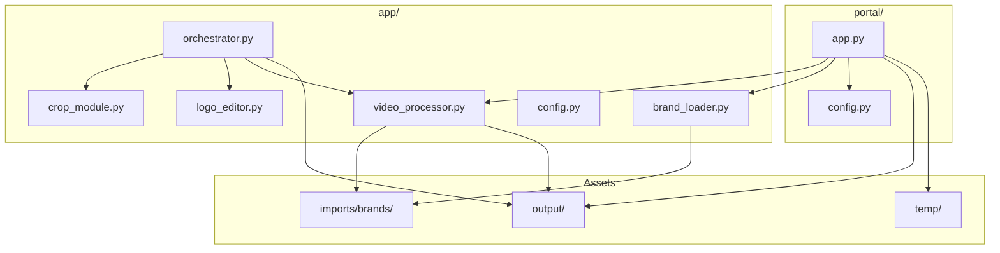

**Diagram sources**
- [app/orchestrator.py](file://app/orchestrator.py#L1-L172)
- [app/video_processor.py](file://app/video_processor.py#L1-L273)
- [app/brand_loader.py](file://app/brand_loader.py#L1-L499)
- [app/crop_module.py](file://app/crop_module.py#L1-L193)
- [app/logo_editor.py](file://app/logo_editor.py#L1-L132)
- [app/config.py](file://app/config.py#L1-L18)
- [portal/app.py](file://portal/app.py#L1-L800)
- [portal/config.py](file://portal/config.py#L1-L42)

**Section sources**
- [DEPLOYMENT.txt](file://DEPLOYMENT.txt#L44-L60)
- [app/config.py](file://app/config.py#L1-L18)
- [portal/config.py](file://portal/config.py#L1-L42)

## Core Components
- Orchestrator: Coordinates the full pipeline: download → crop → logo edit → multi-brand export.
- Video Processor: Applies brand templates, logos, and adaptive watermarks using FFmpeg.
- Brand Loader: Discovers and loads brand configurations from imports/brands/.
- Crop Editor: Calculates and applies crop settings for target aspect ratios.
- Logo Editor: Positions logos with safe zones and enforces constraints.
- Portal: Flask API for fetching videos, processing with brands, and serving outputs.

**Section sources**
- [app/orchestrator.py](file://app/orchestrator.py#L12-L172)
- [app/video_processor.py](file://app/video_processor.py#L13-L273)
- [app/brand_loader.py](file://app/brand_loader.py#L168-L183)
- [app/crop_module.py](file://app/crop_module.py#L11-L193)
- [app/logo_editor.py](file://app/logo_editor.py#L11-L132)
- [portal/app.py](file://portal/app.py#L329-L608)

## Architecture Overview
The system follows a clear separation of concerns:
- app/: Pure processing logic and orchestration
- portal/: Web API and UI glue around app/

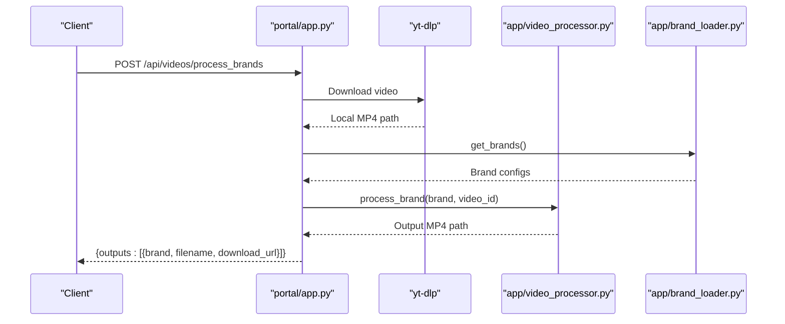

**Diagram sources**
- [portal/app.py](file://portal/app.py#L329-L608)
- [app/brand_loader.py](file://app/brand_loader.py#L168-L183)
- [app/video_processor.py](file://app/video_processor.py#L180-L253)

## Detailed Component Analysis

### Orchestrator
- Responsibilities: orchestrate stages, manage directories, collect results, and print summaries.
- Key behaviors: validates selected brands, prints stage-by-stage progress, aggregates outputs and errors.

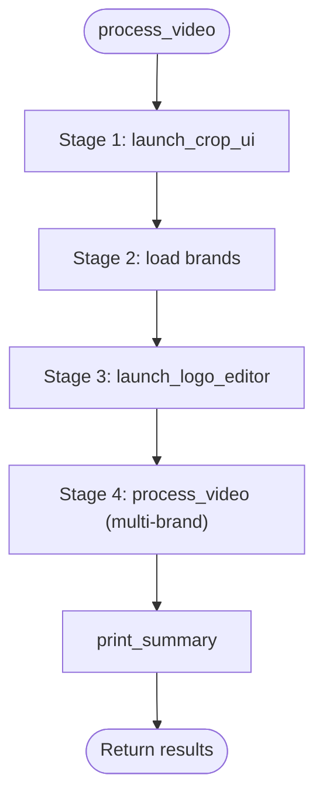

**Diagram sources**
- [app/orchestrator.py](file://app/orchestrator.py#L29-L115)

**Section sources**
- [app/orchestrator.py](file://app/orchestrator.py#L12-L172)

### Video Processor
- Responsibilities: probe video, compute brightness, adapt watermark opacity, build FFmpeg filter_complex, and export MP4s.
- Constraints: outputs are MP4s with merged audio/video; enforces safe zones and adaptive opacity.

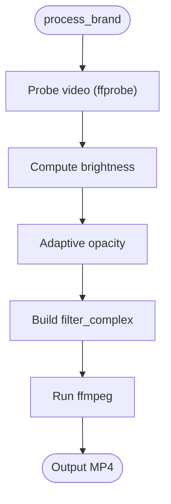

**Diagram sources**
- [app/video_processor.py](file://app/video_processor.py#L30-L253)

**Section sources**
- [app/video_processor.py](file://app/video_processor.py#L13-L273)

### Brand Loader
- Responsibilities: discover brands from imports/brands/, merge YAML manifests, and generate minimal manifests if missing.
- Conventions: recognizes assets by filename patterns and supports optional manifests (orientation, routing, platforms).

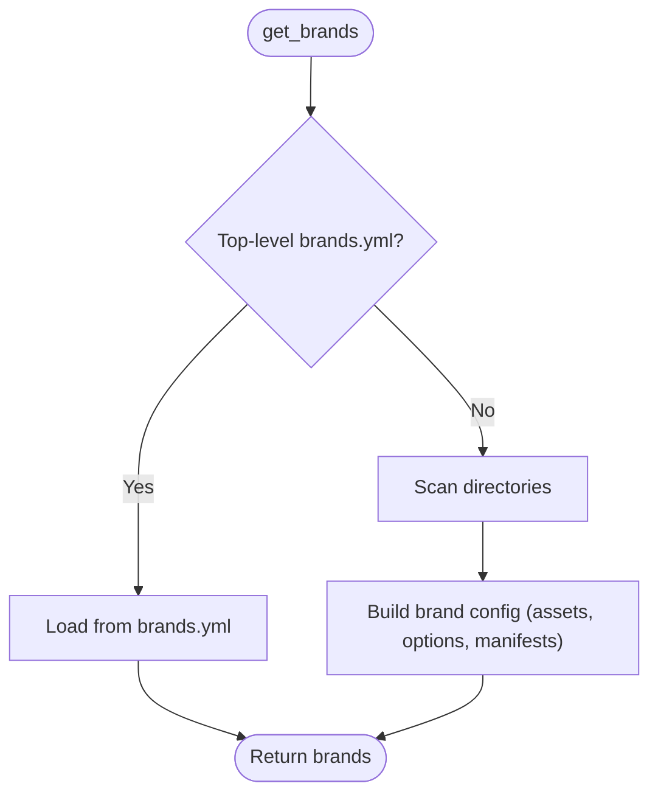

**Diagram sources**
- [app/brand_loader.py](file://app/brand_loader.py#L168-L183)
- [app/brand_loader.py](file://app/brand_loader.py#L344-L491)

**Section sources**
- [app/brand_loader.py](file://app/brand_loader.py#L1-L499)

### Crop Editor
- Responsibilities: calculate crop dimensions for aspect ratios, enforce even resolutions, and apply crop with optional rotation.

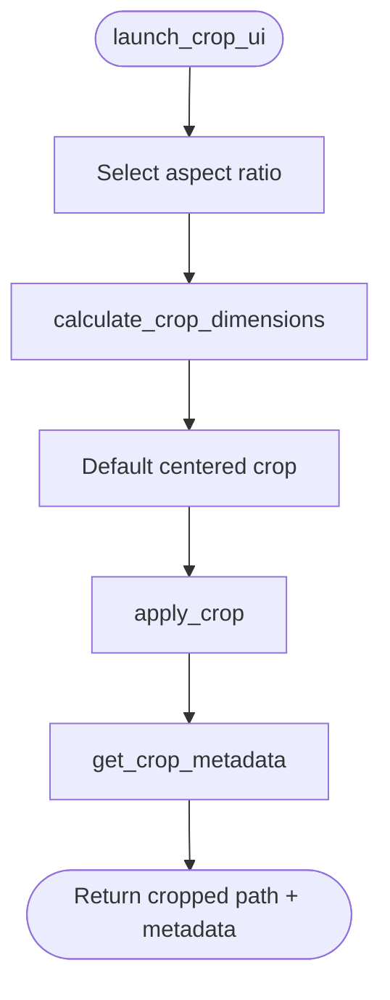

**Diagram sources**
- [app/crop_module.py](file://app/crop_module.py#L81-L171)

**Section sources**
- [app/crop_module.py](file://app/crop_module.py#L1-L193)

### Logo Editor
- Responsibilities: select logo path (cleaned vs original), compute default position, enforce safe zones, and return settings.

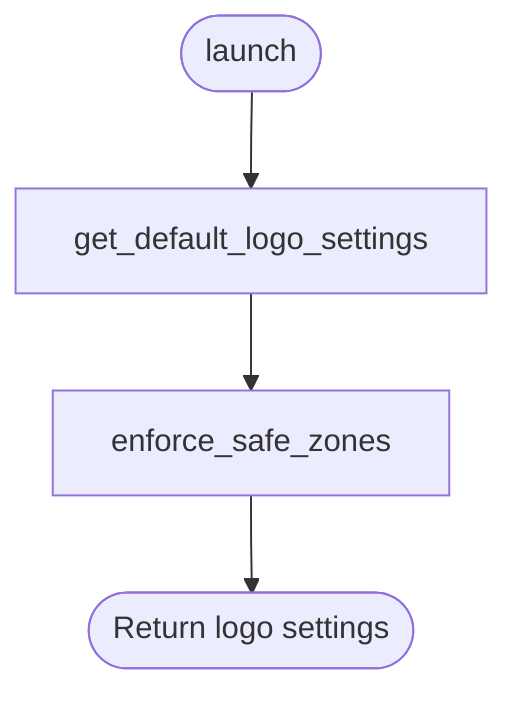

**Diagram sources**
- [app/logo_editor.py](file://app/logo_editor.py#L95-L114)

**Section sources**
- [app/logo_editor.py](file://app/logo_editor.py#L1-L132)

### Portal API
- Responsibilities: expose endpoints for fetching videos, processing with brands, listing brands, and downloading outputs.
- Security: relies on shared key via environment variable; includes debug endpoints for health and FFmpeg checks.

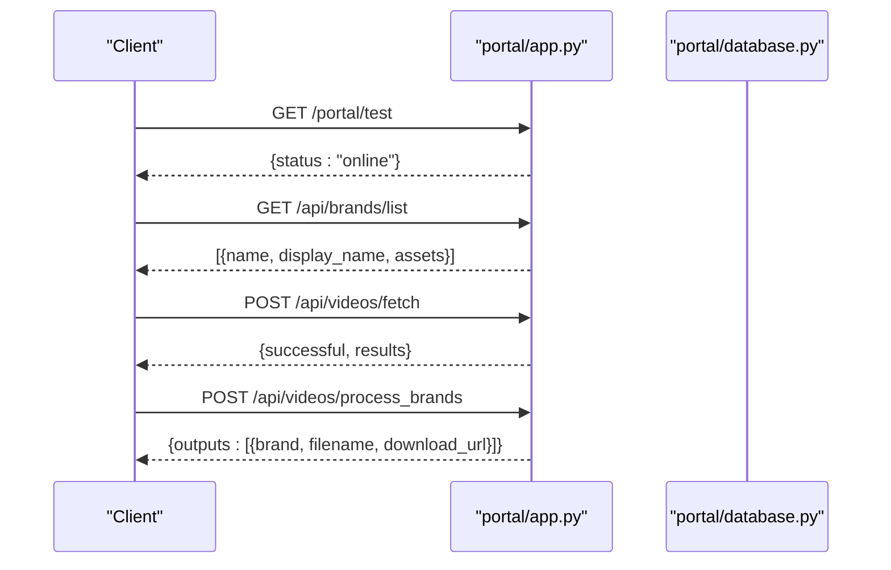

**Diagram sources**
- [portal/app.py](file://portal/app.py#L296-L323)
- [portal/app.py](file://portal/app.py#L242-L290)
- [portal/app.py](file://portal/app.py#L609-L784)
- [portal/app.py](file://portal/app.py#L329-L608)

**Section sources**
- [portal/app.py](file://portal/app.py#L1-L800)
- [portal/config.py](file://portal/config.py#L30-L42)

## Dependency Analysis
External libraries and tools:
- Python packages: Flask, Jinja2, Werkzeug, requests, Pillow, PyYAML, numpy, mutagen, pycryptodomex, yt-dlp, websockets, brotli, psutil, pyjwt, cryptography, gunicorn.
- Media tools: FFmpeg and FFprobe (via environment variables or PATH).

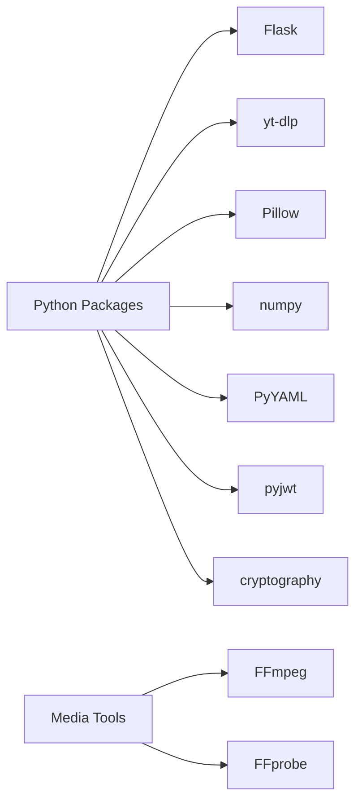

**Diagram sources**
- [requirements.txt](file://requirements.txt#L1-L18)

**Section sources**
- [requirements.txt](file://requirements.txt#L1-L18)
- [app/config.py](file://app/config.py#L11-L13)
- [portal/config.py](file://portal/config.py#L26-L28)

## Development Environment Setup
- Prerequisites
  - Python 3.8+ and pip
  - FFmpeg and FFprobe installed and accessible in PATH (or set via environment variables)
- Local portal
  - Run the portal app with a WSGI server (e.g., Gunicorn) as documented in the deployment guide.
  - Access the dashboard and test endpoints locally as described.
- Environment variables
  - Portal key and secret key must be set for production use.
- Directory layout
  - Respect the directory structure: uploads/, outputs/, temp/, logs/, db/.

**Section sources**
- [DEPLOYMENT.txt](file://DEPLOYMENT.txt#L64-L107)
- [portal/config.py](file://portal/config.py#L30-L37)

## Code Standards and Quality Assurance
- Formatting
  - Use Black with line length 88. The qoder format task runs Black in check mode and can also fix formatting.
- Linting
  - Pylint is used with relaxed docstring rules and increased line length. The qoder lint task runs it recursively.
- Logging
  - Use Python logging or print-safe debug; avoid noisy logs.

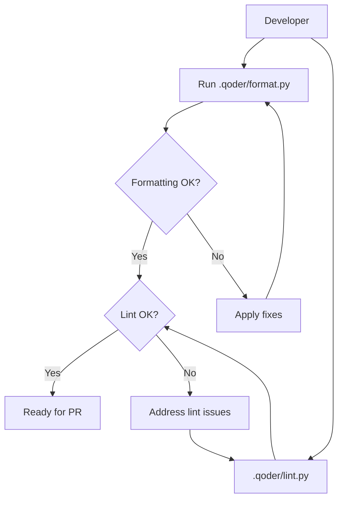

**Diagram sources**
- [.qoder/format.py](file://.qoder/format.py#L9-L34)
- [.qoder/lint.py](file://.qoder/lint.py#L10-L35)

**Section sources**
- [.qoder/format.py](file://.qoder/format.py#L1-L67)
- [.qoder/lint.py](file://.qoder/lint.py#L1-L39)
- [AGENTS.md](file://AGENTS.md#L141-L144)

## Pull Request Process
- Branching
  - Base your work on the main branch.
- Commit hygiene
  - Keep commits focused and descriptive.
- Quality gates
  - Ensure formatting and lint checks pass locally.
- Review
  - Request reviews from maintainers; address feedback promptly.
- Merge
  - Squash or rebase as appropriate; ensure tests and checks pass.

[No sources needed since this section provides general guidance]

## Extending the System

### Adding New Brands
- Place assets under imports/brands/<brand>/ with recognized filenames:
  - template.png, watermark.png, logo.png
  - Optional manifests: manifest.yml, watermark.yml, orientation.yml, routing.yml, platforms.yml
- Alternatively, provide a top-level brands.yml to define assets and options.
- The brand loader discovers and merges configurations automatically.

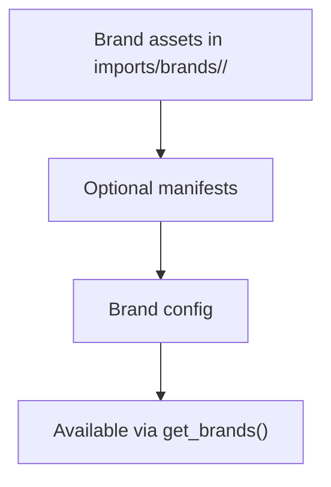

**Diagram sources**
- [app/brand_loader.py](file://app/brand_loader.py#L35-L129)
- [app/brand_loader.py](file://app/brand_loader.py#L168-L183)

**Section sources**
- [app/brand_loader.py](file://app/brand_loader.py#L1-L499)

### Extending Processing Modules
- Video Processor
  - Add or modify FFmpeg filters in build_filter_complex.
  - Respect safe zones and output MP4 with merged audio/video.
- Crop Editor
  - Extend aspect ratio support or crop logic if needed.
- Logo Editor
  - Adjust safe zone enforcement or default scaling if required.

**Section sources**
- [app/video_processor.py](file://app/video_processor.py#L109-L178)
- [app/crop_module.py](file://app/crop_module.py#L17-L79)
- [app/logo_editor.py](file://app/logo_editor.py#L79-L94)

### Integrating New Social Media Platforms
- Fetch endpoint
  - Use yt-dlp configuration in the fetch endpoint to handle new platforms.
  - Ensure format selection and fallbacks are robust.
- Authentication
  - Consider cookie-based access and rate limiting as needed.

**Section sources**
- [portal/app.py](file://portal/app.py#L609-L784)

## Testing Guidelines
- Unit and integration tests
  - Use the provided test files under portal/ and root level to validate behavior.
- Local verification
  - Use the portal test endpoint and debug routes to confirm service health.
- Output validation
  - Confirm final outputs are MP4s and downloadable via the download endpoint.

**Section sources**
- [portal/app.py](file://portal/app.py#L309-L323)
- [portal/app.py](file://portal/app.py#L188-L214)

## Documentation Updates
- Update this guide when changing:
  - Environment setup steps
  - API endpoints
  - Brand asset conventions
  - Processing pipeline behavior

[No sources needed since this section provides general guidance]

## Version Management
- Track changes to requirements.txt and deployment configuration.
- Maintain backward compatibility for public APIs and brand asset schemas.

[No sources needed since this section provides general guidance]

## Code Review and Community Guidelines
- Follow the stability rules defined in the agent rules:
  - Do not change output directory structure.
  - Do not modify brand_config.json schema.
  - Do not rewrite core processing modules.
  - Do not introduce concurrency that risks worker crashes.
- Keep discussions respectful and constructive.

**Section sources**
- [AGENTS.md](file://AGENTS.md#L128-L139)

## Troubleshooting Guide
- FFmpeg not found
  - Ensure FFmpeg and FFprobe are installed and accessible or set environment variables.
- Audio-only video
  - The processing pipeline rejects audio-only content; retry with a video-capable source.
- Download failures
  - Check portal logs and verify write permissions for output directories.
- Brand integrity
  - Use the brand integrity debug endpoint to inspect discovered brands and assets.

**Section sources**
- [portal/config.py](file://portal/config.py#L26-L28)
- [portal/app.py](file://portal/app.py#L550-L559)
- [portal/app.py](file://portal/app.py#L188-L214)
- [portal/app.py](file://portal/app.py#L164-L186)

## Examples and Common Pitfalls
- Good contributions
  - Clear commit messages and focused changes
  - Passing formatting and lint checks
  - Adding or updating brand assets with proper manifests
- Common pitfalls
  - Modifying output directory structure or brand_config.json schema
  - Introducing async frameworks or concurrency that risks stability
  - Breaking FFmpeg filter chain or output format

**Section sources**
- [AGENTS.md](file://AGENTS.md#L128-L139)
- [app/video_processor.py](file://app/video_processor.py#L209-L218)

## Conclusion
By following these guidelines, contributors can reliably extend WatchTheFall Orchestrator v3, integrate new brands and platforms, and maintain high code quality. Always respect the established architecture and stability rules, and ensure your changes pass automated checks and review.