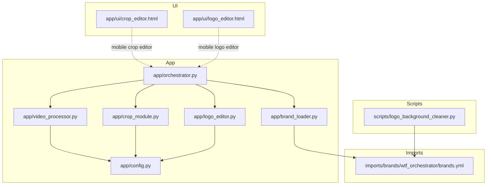
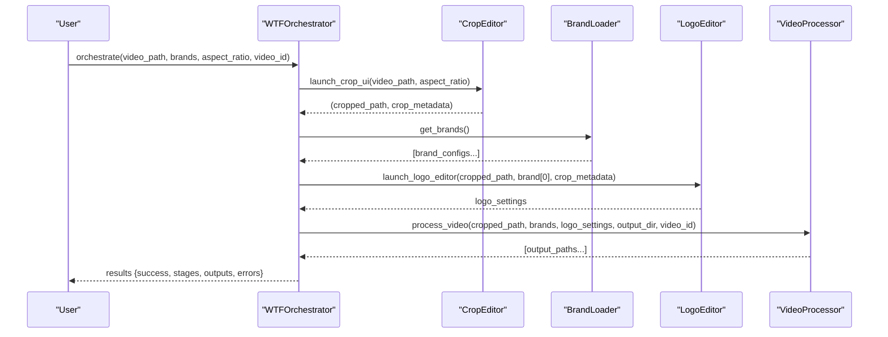
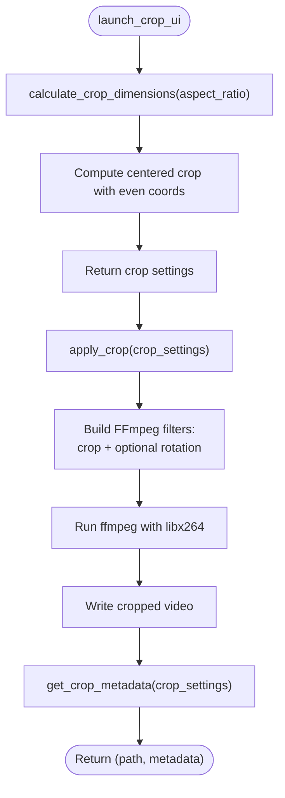
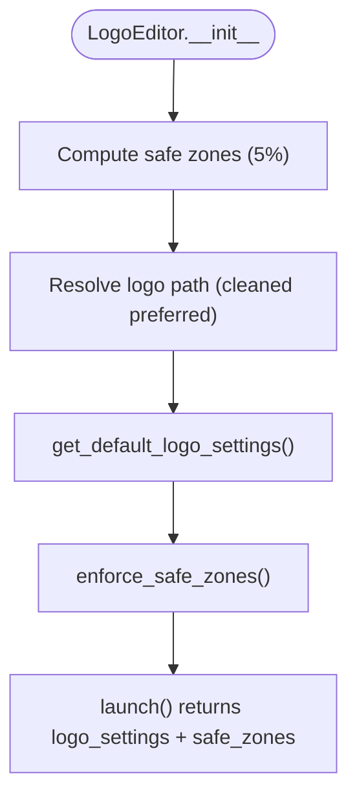
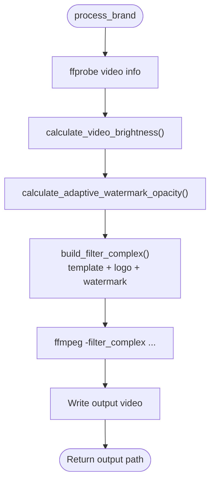
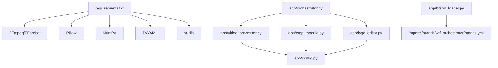

# Core Processing Engine

<cite>
**Referenced Files in This Document**
- [orchestrator.py](file://app/orchestrator.py)
- [video_processor.py](file://app/video_processor.py)
- [crop_module.py](file://app/crop_module.py)
- [logo_editor.py](file://app/logo_editor.py)
- [config.py](file://app/config.py)
- [brand_loader.py](file://app/brand_loader.py)
- [brands.yml](file://imports/brands/wtf_orchestrator/brands.yml)
- [crop_editor.html](file://app/ui/crop_editor.html)
- [logo_editor.html](file://app/ui/logo_editor.html)
- [logo_background_cleaner.py](file://scripts/logo_background_cleaner.py)
- [demo_orchestrator.py](file://demo_orchestrator.py)
- [requirements.txt](file://requirements.txt)
</cite>

## Table of Contents
1. [Introduction](#introduction)
2. [Project Structure](#project-structure)
3. [Core Components](#core-components)
4. [Architecture Overview](#architecture-overview)
5. [Detailed Component Analysis](#detailed-component-analysis)
6. [Dependency Analysis](#dependency-analysis)
7. [Performance Considerations](#performance-considerations)
8. [Troubleshooting Guide](#troubleshooting-guide)
9. [Conclusion](#conclusion)
10. [Appendices](#appendices)

## Introduction
This document describes the core processing engine that powers the WatchTheFall Orchestrator v3. It explains the orchestrator pipeline that coordinates video downloading, cropping, logo positioning, and multi-brand export. It documents the video processing module’s advanced capabilities, including brightness detection algorithms, template application, and FFmpeg integration. It details the crop module’s interactive editing features, aspect ratio handling, and touch gesture support. It also covers the logo editor’s safe zone enforcement, background removal, and dynamic scaling features. Implementation details, configuration options, and usage patterns are provided for each component.

## Project Structure
The orchestrator is organized around a modular Python application with supporting UI assets and scripts:
- app/orchestrator.py: Main orchestrator coordinating the pipeline
- app/video_processor.py: Video processing with overlays and adaptive watermarking
- app/crop_module.py: Interactive cropping with aspect ratio handling and FFmpeg
- app/logo_editor.py: Logo placement with safe zones and dynamic scaling
- app/brand_loader.py: Loads brand configurations from YAML manifests
- app/config.py: Centralized configuration and binary paths
- app/ui/*.html: Web-based crop and logo editors for mobile touch interaction
- scripts/logo_background_cleaner.py: Preprocessing script to remove logo backgrounds
- imports/brands/wtf_orchestrator/brands.yml: Brand manifests and asset references
- demo_orchestrator.py: End-to-end demo usage and guidance
- requirements.txt: Dependencies for the application

**Diagram sources**
- [orchestrator.py](file://app/orchestrator.py#L1-L172)
- [video_processor.py](file://app/video_processor.py#L1-L273)
- [crop_module.py](file://app/crop_module.py#L1-L193)
- [logo_editor.py](file://app/logo_editor.py#L1-L132)
- [brand_loader.py](file://app/brand_loader.py#L1-L499)
- [config.py](file://app/config.py#L1-L18)
- [brands.yml](file://imports/brands/wtf_orchestrator/brands.yml#L1-L423)
- [crop_editor.html](file://app/ui/crop_editor.html#L1-L261)
- [logo_editor.html](file://app/ui/logo_editor.html#L1-L254)
- [logo_background_cleaner.py](file://scripts/logo_background_cleaner.py#L1-L157)

**Section sources**
- [orchestrator.py](file://app/orchestrator.py#L1-L172)
- [video_processor.py](file://app/video_processor.py#L1-L273)
- [crop_module.py](file://app/crop_module.py#L1-L193)
- [logo_editor.py](file://app/logo_editor.py#L1-L132)
- [brand_loader.py](file://app/brand_loader.py#L1-L499)
- [config.py](file://app/config.py#L1-L18)
- [brands.yml](file://imports/brands/wtf_orchestrator/brands.yml#L1-L423)
- [crop_editor.html](file://app/ui/crop_editor.html#L1-L261)
- [logo_editor.html](file://app/ui/logo_editor.html#L1-L254)
- [logo_background_cleaner.py](file://scripts/logo_background_cleaner.py#L1-L157)
- [demo_orchestrator.py](file://demo_orchestrator.py#L1-L109)
- [requirements.txt](file://requirements.txt#L1-L18)

## Core Components
- Orchestrator: Coordinates the four-stage pipeline—crop, brand loading, logo editor, and multi-brand export—and aggregates results.
- Crop Module: Provides interactive cropping with pinch-to-zoom and drag, supports multiple aspect ratios, and applies FFmpeg filters.
- Logo Editor: Places and scales logos with safe zones, enforces circular transparency via preprocessed assets, and returns settings for downstream processing.
- Video Processor: Applies brand-specific overlays (template, logo, watermark), computes adaptive opacity based on video brightness, and integrates FFmpeg.
- Brand Loader: Scans brand directories and YAML manifests to produce normalized brand configurations.
- Config: Resolves project paths and FFmpeg binaries, ensuring runtime readiness.

**Section sources**
- [orchestrator.py](file://app/orchestrator.py#L12-L172)
- [crop_module.py](file://app/crop_module.py#L11-L193)
- [logo_editor.py](file://app/logo_editor.py#L11-L132)
- [video_processor.py](file://app/video_processor.py#L13-L273)
- [brand_loader.py](file://app/brand_loader.py#L168-L183)
- [config.py](file://app/config.py#L1-L18)

## Architecture Overview
The orchestrator pipeline is a staged workflow:
1. Download video (external tooling)
2. Crop with interactive UI and FFmpeg
3. Logo editor with safe zones and dynamic scaling
4. Multi-brand export with adaptive watermarks

**Diagram sources**
- [orchestrator.py](file://app/orchestrator.py#L29-L115)
- [crop_module.py](file://app/crop_module.py#L174-L192)
- [brand_loader.py](file://app/brand_loader.py#L168-L183)
- [logo_editor.py](file://app/logo_editor.py#L117-L131)
- [video_processor.py](file://app/video_processor.py#L256-L272)

## Detailed Component Analysis

### Orchestrator
The orchestrator coordinates the entire pipeline and prints a summary of outcomes. It:
- Creates crop and output directories
- Invokes the crop UI and applies the crop
- Loads brand configurations (optionally filtered by selection)
- Launches the logo editor using the first brand as a reference
- Processes the cropped video for all selected brands and returns output paths

Key behaviors:
- Stage tracking and error aggregation
- Safe defaults and informative logging
- Output organization by brand

**Section sources**
- [orchestrator.py](file://app/orchestrator.py#L12-L172)

### Crop Module
The crop module encapsulates interactive cropping with:
- Aspect ratio presets: 9:16, 1:1, 4:5, 16:9
- Even-numbered dimensions for FFmpeg compatibility
- Rotation support (90°, 180°, 270° via transpositions)
- Metadata reporting for downstream processors

Implementation highlights:
- Calculates crop dimensions based on source aspect ratio
- Builds FFmpeg filter chain for crop and optional rotation
- Returns crop settings and metadata for subsequent stages

**Diagram sources**
- [crop_module.py](file://app/crop_module.py#L61-L157)

**Section sources**
- [crop_module.py](file://app/crop_module.py#L11-L193)
- [crop_editor.html](file://app/ui/crop_editor.html#L130-L258)

### Logo Editor
The logo editor provides:
- Default logo size (~15% of video width) and top-left placement within safe zones
- Safe zone enforcement (5% margin) to prevent occlusion
- Dynamic scaling via pinch gestures and drag repositioning
- Preference for cleaned logos (logos_clean/) with transparent backgrounds

Core logic:
- Determines safe boundaries from cropped dimensions
- Selects logo path from cleaned or original assets
- Returns settings suitable for overlay composition

**Diagram sources**
- [logo_editor.py](file://app/logo_editor.py#L20-L114)

**Section sources**
- [logo_editor.py](file://app/logo_editor.py#L11-L132)
- [logo_editor.html](file://app/ui/logo_editor.html#L107-L251)
- [logo_background_cleaner.py](file://scripts/logo_background_cleaner.py#L1-L157)

### Video Processor
The video processor applies brand overlays and adaptive watermarks:
- Template overlay scaled to video size
- Logo overlay with provided settings
- Watermark overlay with adaptive opacity based on video brightness
- Safe zone margins for watermark placement (default bottom-right)

Brightness detection:
- Extracts a small thumbnail from near the start of the video
- Computes grayscale mean normalized to [0,1]
- Uses inverse linear interpolation to select opacity between configured min/max

Filter construction:
- movie filters for template/logo/watermark
- Overlay composition respecting order and positions
- Preserves audio by copying streams

**Diagram sources**
- [video_processor.py](file://app/video_processor.py#L30-L226)

**Section sources**
- [video_processor.py](file://app/video_processor.py#L13-L273)
- [brands.yml](file://imports/brands/wtf_orchestrator/brands.yml#L1-L423)

### Brand Loader
The brand loader discovers and normalizes brand configurations:
- Scans directories for assets and manifests
- Merges top-level brands.yml with discovered assets
- Generates minimal manifests if missing
- Produces a canonical list of brands with assets and options

Key features:
- Manifest precedence: watermark.yml, orientation.yml, routing.yml, platforms.yml
- Options include watermark position and scale
- Generates integrity reports and brands.yml if absent

**Section sources**
- [brand_loader.py](file://app/brand_loader.py#L168-L183)
- [brands.yml](file://imports/brands/wtf_orchestrator/brands.yml#L1-L423)

### Configuration and Paths
Centralized configuration resolves:
- Project root and import directories
- FFmpeg and FFprobe binary paths (with environment variable overrides)
- Ensures necessary directories exist at runtime

**Section sources**
- [config.py](file://app/config.py#L1-L18)

## Dependency Analysis
External dependencies include FFmpeg/FFprobe, Pillow, NumPy, PyYAML, and yt-dlp. The application relies on these tools for media probing, transcoding, image processing, and brand manifest parsing.

**Diagram sources**
- [requirements.txt](file://requirements.txt#L1-L18)
- [orchestrator.py](file://app/orchestrator.py#L1-L172)
- [crop_module.py](file://app/crop_module.py#L1-L193)
- [logo_editor.py](file://app/logo_editor.py#L1-L132)
- [video_processor.py](file://app/video_processor.py#L1-L273)
- [brand_loader.py](file://app/brand_loader.py#L1-L499)
- [brands.yml](file://imports/brands/wtf_orchestrator/brands.yml#L1-L423)

**Section sources**
- [requirements.txt](file://requirements.txt#L1-L18)

## Performance Considerations
- Video brightness sampling uses a small thumbnail to reduce overhead; consider caching computed brightness per video if repeated exports occur.
- FFmpeg runs with moderate presets; adjust CRF and preset for balancing quality and speed.
- Template and watermark scaling are proportional to video width; ensure assets are appropriately sized to minimize resampling.
- Safe zone enforcement prevents excessive recomputation; maintain consistent aspect ratios to avoid repeated metadata updates.

[No sources needed since this section provides general guidance]

## Troubleshooting Guide
Common issues and resolutions:
- Missing FFmpeg/FFprobe: Set environment variables FFMPEG_PATH and FFPROBE_PATH to point to installed binaries.
- Brand assets not found: Verify assets exist under imports/brands/<brand>/ and that brands.yml is present or generated.
- Cropping produces odd dimensions: Ensure even width/height; the crop module enforces even numbers.
- Watermark too light/dark: Adjust watermark_scale and watermark_position in brand manifests; brightness-based opacity adapts automatically.
- Logo outside safe zone: The logo editor enforces 5% margins; reposition using the mobile UI.

**Section sources**
- [config.py](file://app/config.py#L11-L13)
- [brand_loader.py](file://app/brand_loader.py#L310-L342)
- [crop_module.py](file://app/crop_module.py#L75-L77)
- [logo_editor.py](file://app/logo_editor.py#L79-L93)
- [video_processor.py](file://app/video_processor.py#L92-L107)

## Conclusion
The WatchTheFall Orchestrator v3 core engine provides a robust, modular pipeline for automated multi-brand video processing. Its interactive components enable mobile-friendly editing, while the video processor ensures consistent branding and adaptive watermarking. The brand loader simplifies asset management through manifests and discovery. Together, these components support scalable, gallery-ready exports across numerous brands.

[No sources needed since this section summarizes without analyzing specific files]

## Appendices

### Usage Patterns and Examples
- End-to-end demo: See the demo script for a guided walkthrough of the pipeline and expected outputs.
- Interactive editors: Use crop_editor.html and logo_editor.html on a mobile device to configure crop and logo settings.
- Preprocessing logos: Run the logo background cleaner to generate transparent, circular logos for optimal overlay.

**Section sources**
- [demo_orchestrator.py](file://demo_orchestrator.py#L1-L109)
- [crop_editor.html](file://app/ui/crop_editor.html#L1-L261)
- [logo_editor.html](file://app/ui/logo_editor.html#L1-L254)
- [logo_background_cleaner.py](file://scripts/logo_background_cleaner.py#L99-L136)