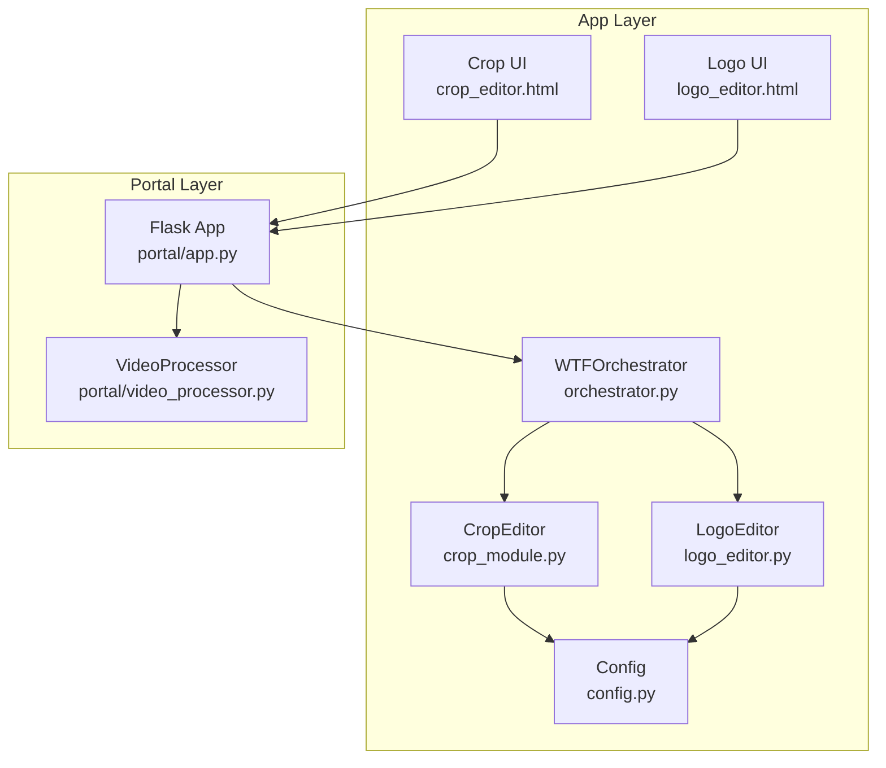
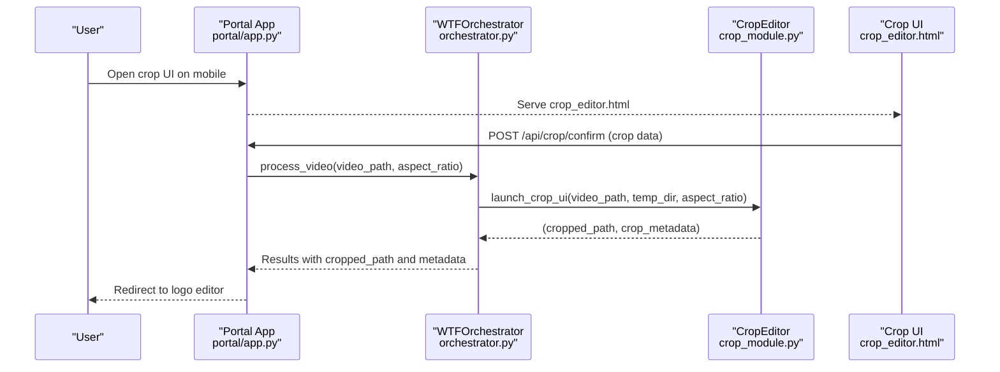
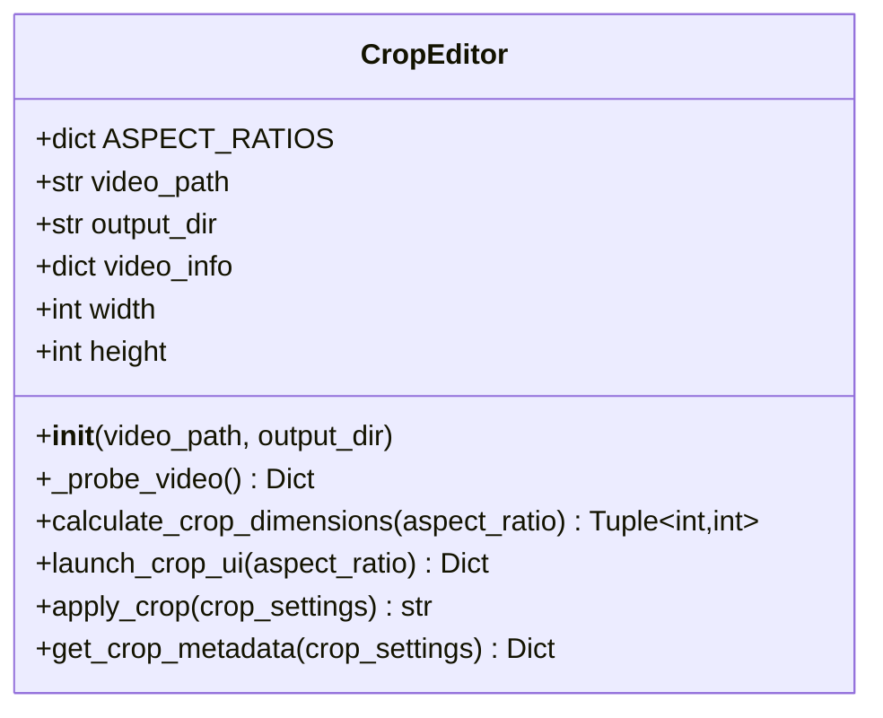
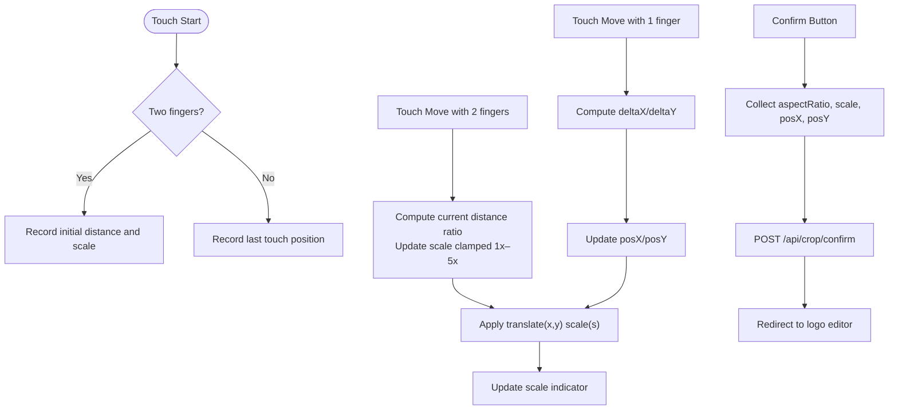
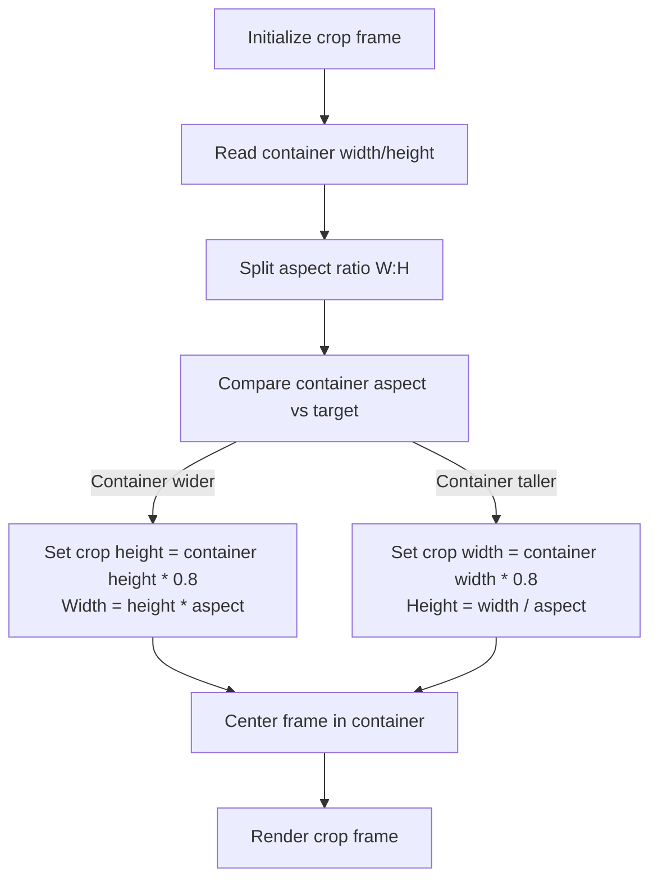
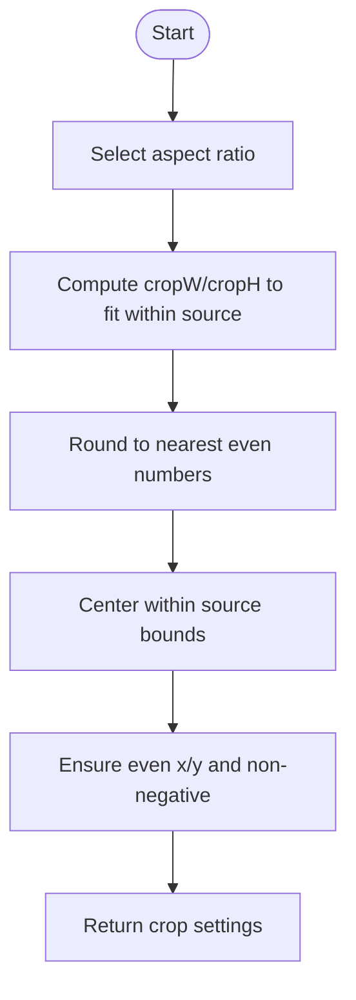
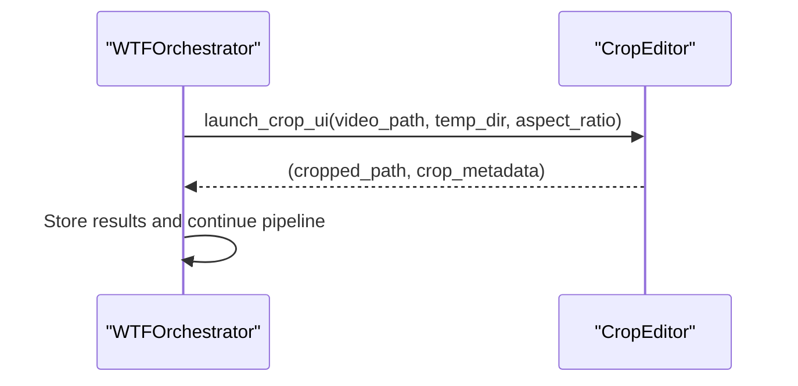
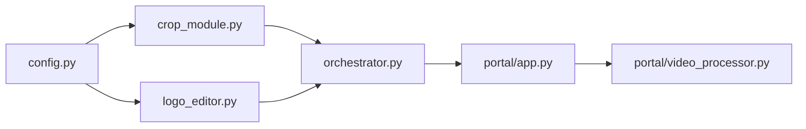

# Crop Module

<cite>
**Referenced Files in This Document**
- [crop_module.py](file://app/crop_module.py)
- [crop_editor.html](file://app/ui/crop_editor.html)
- [logo_editor.html](file://app/ui/logo_editor.html)
- [logo_editor.py](file://app/logo_editor.py)
- [orchestrator.py](file://app/orchestrator.py)
- [config.py](file://app/config.py)
- [video_processor.py](file://portal/video_processor.py)
- [app.py](file://portal/app.py)
</cite>

## Table of Contents
1. [Introduction](#introduction)
2. [Project Structure](#project-structure)
3. [Core Components](#core-components)
4. [Architecture Overview](#architecture-overview)
5. [Detailed Component Analysis](#detailed-component-analysis)
6. [Dependency Analysis](#dependency-analysis)
7. [Performance Considerations](#performance-considerations)
8. [Troubleshooting Guide](#troubleshooting-guide)
9. [Conclusion](#conclusion)
10. [Appendices](#appendices)

## Introduction
This document describes the crop module responsible for interactive video cropping with mobile-optimized UI. It supports pinch-to-zoom and drag gestures for precise crop selection, handles multiple aspect ratios (9:16, 1:1, 4:5, 16:9), and integrates with the main orchestrator to feed cropped video into subsequent stages such as logo editing and multi-brand export. The module also includes coordinate transformation logic, optional rotation handling, and boundary validation to ensure valid crop regions.

## Project Structure
The crop module spans Python backend logic and a mobile-friendly HTML/JavaScript UI. The orchestrator coordinates the pipeline and delegates to the crop module.

**Diagram sources**
- [orchestrator.py](file://app/orchestrator.py#L12-L115)
- [crop_module.py](file://app/crop_module.py#L11-L192)
- [logo_editor.py](file://app/logo_editor.py#L11-L131)
- [crop_editor.html](file://app/ui/crop_editor.html#L1-L261)
- [logo_editor.html](file://app/ui/logo_editor.html#L1-L200)
- [config.py](file://app/config.py#L1-L18)
- [portal/app.py](file://portal/app.py#L1-L200)
- [video_processor.py](file://portal/video_processor.py#L1-L425)

**Section sources**
- [crop_module.py](file://app/crop_module.py#L1-L193)
- [crop_editor.html](file://app/ui/crop_editor.html#L1-L261)
- [logo_editor.py](file://app/logo_editor.py#L1-L132)
- [logo_editor.html](file://app/ui/logo_editor.html#L1-L200)
- [orchestrator.py](file://app/orchestrator.py#L1-L172)
- [config.py](file://app/config.py#L1-L18)
- [portal/app.py](file://portal/app.py#L1-L200)
- [video_processor.py](file://portal/video_processor.py#L1-L425)

## Core Components
- CropEditor: Computes crop dimensions, launches the interactive crop UI, applies crop via ffmpeg, and produces crop metadata.
- Crop UI (crop_editor.html): Mobile-optimized interface with pinch-to-zoom and drag controls, aspect ratio buttons, and confirmation flow.
- Orchestrator: Integrates the crop stage into the full pipeline and passes crop metadata downstream.
- Config: Provides FFmpeg/FFprobe paths and project paths.
- Logo Editor (complementary): Ensures logo placement respects safe zones after cropping.

Key responsibilities:
- Aspect ratio handling for 9:16, 1:1, 4:5, 16:9.
- Coordinate transformation and boundary validation for crop rectangles.
- Rotation support (0°, 90°, 180°, 270°) via ffmpeg transpose filters.
- Touch gesture recognition and smooth transform animations.
- Responsive design and viewport constraints for mobile devices.

**Section sources**
- [crop_module.py](file://app/crop_module.py#L11-L192)
- [crop_editor.html](file://app/ui/crop_editor.html#L130-L257)
- [orchestrator.py](file://app/orchestrator.py#L29-L115)
- [config.py](file://app/config.py#L11-L13)
- [logo_editor.py](file://app/logo_editor.py#L11-L131)

## Architecture Overview
The crop module participates in a four-stage pipeline orchestrated by WTFOrchestrator:
1. Download video (external)
2. Crop video with interactive UI
3. Position logo with interactive editor
4. Export to multiple brands

**Diagram sources**
- [portal/app.py](file://portal/app.py#L1-L200)
- [orchestrator.py](file://app/orchestrator.py#L29-L115)
- [crop_module.py](file://app/crop_module.py#L174-L192)
- [crop_editor.html](file://app/ui/crop_editor.html#L233-L252)

## Detailed Component Analysis

### CropEditor: Backend Crop Logic
Responsibilities:
- Probe video to extract width, height, duration, and FPS.
- Compute crop dimensions that match the chosen aspect ratio while maintaining even dimensions for ffmpeg compatibility.
- Launch crop UI and return default centered crop settings.
- Apply crop and rotation filters via ffmpeg and produce output path.
- Provide crop metadata for downstream consumers.

Aspect ratios supported:
- 9:16 (vertical, default)
- 1:1 (square)
- 4:5 (portrait)
- 16:9 (landscape)

Rotation handling:
- Uses ffmpeg transpose filters for 90°, 180°, and 270° rotations.

Coordinate transformation and boundary validation:
- Centers crop within source bounds.
- Rounds to nearest even integers to satisfy ffmpeg constraints.

**Diagram sources**
- [crop_module.py](file://app/crop_module.py#L11-L192)

**Section sources**
- [crop_module.py](file://app/crop_module.py#L17-L192)

### Mobile Crop UI: Gesture Recognition and Animation
Features:
- Pinch-to-zoom: Calculates distance between two touch points and scales the video canvas.
- Drag-to-move: Tracks single-touch movement deltas and translates the video canvas.
- Aspect ratio buttons: Switches crop frame dimensions dynamically.
- Smooth transforms: Applies CSS transforms for translate and scale with real-time feedback.
- Responsive layout: Adapts crop frame size to viewport and maintains aspect ratio.

**Diagram sources**
- [crop_editor.html](file://app/ui/crop_editor.html#L185-L252)

**Section sources**
- [crop_editor.html](file://app/ui/crop_editor.html#L130-L257)

### Aspect Ratio Handling System
Behavior:
- On load and resize, the crop frame is computed to fit within the viewport while preserving the selected aspect ratio.
- The frame’s width and height are derived from the container dimensions and the chosen ratio (9:16, 1:1, 4:5, 16:9).
- The crop frame is centered within the viewport.

**Diagram sources**
- [crop_editor.html](file://app/ui/crop_editor.html#L150-L173)

**Section sources**
- [crop_editor.html](file://app/ui/crop_editor.html#L150-L173)

### Coordinate Transformation and Boundary Validation
Backend logic:
- Computes crop width/height to fit within source dimensions while keeping even values.
- Centers crop rectangle and ensures even x/y coordinates.
- Returns crop settings with source dimensions for downstream use.

**Diagram sources**
- [crop_module.py](file://app/crop_module.py#L61-L109)

**Section sources**
- [crop_module.py](file://app/crop_module.py#L61-L109)

### Rotation Handling (0°, 90°, 180°, 270°)
Implementation:
- The backend supports rotation by applying ffmpeg transpose filters:
  - 90°: transpose=1
  - 180°: transpose=1,transpose=1
  - 270°: transpose=2
- The UI currently does not expose rotation controls; rotation can be integrated by extending the crop settings and UI.

**Section sources**
- [crop_module.py](file://app/crop_module.py#L133-L139)

### Touch Gesture Recognition and Smooth Animation
- Pinch-to-zoom: Distance between two touch points determines scaling factor; clamp to 1x–5x.
- Drag-to-move: Single-finger delta updates translation offsets.
- CSS transforms: translate(x,y) scale(s) applied to the video element for smooth animation.
- Prevent default touchmove behavior to avoid scrolling interference.

**Section sources**
- [crop_editor.html](file://app/ui/crop_editor.html#L185-L231)

### Responsive Design Patterns
- Viewport meta tag configured for mobile scaling and non-scaling behavior.
- Container-based layout centers crop frame and constrains it to 80% of viewport height/width depending on aspect ratio.
- Event handlers for window resize to recalculate crop frame.

**Section sources**
- [crop_editor.html](file://app/ui/crop_editor.html#L4-L5)
- [crop_editor.html](file://app/ui/crop_editor.html#L150-L173)

### Configuration Options
- FFmpeg/FFprobe paths: Resolved from environment variables or defaults.
- Output directories: Created as needed by the orchestrator and crop module.
- Crop export settings:
  - Video codec: libx264
  - Audio codec: aac
  - Encoding preset: fast
  - CRF quality: 18
  - Audio bitrate: 128k

**Section sources**
- [config.py](file://app/config.py#L11-L13)
- [crop_module.py](file://app/crop_module.py#L143-L155)

### Integration with the Main Orchestrator
- The orchestrator invokes the crop module with a selected aspect ratio and stores the resulting cropped path and metadata.
- The crop metadata includes original and cropped dimensions for downstream stages.

**Diagram sources**
- [orchestrator.py](file://app/orchestrator.py#L54-L63)
- [crop_module.py](file://app/crop_module.py#L174-L192)

**Section sources**
- [orchestrator.py](file://app/orchestrator.py#L29-L115)
- [crop_module.py](file://app/crop_module.py#L174-L192)

### Usage Examples
- Basic usage with default 9:16 aspect ratio:
  - Call the convenience function with a video path and optional temp directory.
  - Receive cropped video path and metadata for downstream processing.

- Using different aspect ratios:
  - Pass aspect_ratio as '1:1', '4:5', or '16:9' to target specific formats.

- Integration with orchestrator:
  - Invoke the orchestrator with selected brands and desired aspect ratio to process a video through cropping, logo editing, and multi-brand export.

**Section sources**
- [crop_module.py](file://app/crop_module.py#L174-L192)
- [orchestrator.py](file://app/orchestrator.py#L151-L171)

## Dependency Analysis
- CropEditor depends on FFmpeg/FFprobe binaries and project configuration.
- The orchestrator composes CropEditor and LogoEditor into a cohesive pipeline.
- The portal app serves the crop UI and routes crop confirmations to the orchestrator.

**Diagram sources**
- [config.py](file://app/config.py#L11-L13)
- [crop_module.py](file://app/crop_module.py#L9)
- [logo_editor.py](file://app/logo_editor.py#L9)
- [orchestrator.py](file://app/orchestrator.py#L8-L10)
- [portal/app.py](file://portal/app.py#L33-L34)
- [video_processor.py](file://portal/video_processor.py#L12-L18)

**Section sources**
- [config.py](file://app/config.py#L11-L13)
- [crop_module.py](file://app/crop_module.py#L9)
- [logo_editor.py](file://app/logo_editor.py#L9)
- [orchestrator.py](file://app/orchestrator.py#L8-L10)
- [portal/app.py](file://portal/app.py#L33-L34)
- [video_processor.py](file://portal/video_processor.py#L12-L18)

## Performance Considerations
- Even dimension rounding: Ensures compatibility with video codecs and reduces potential encoding errors.
- Fast preset and moderate CRF balance quality and speed.
- Transpose filters are efficient for rotation; consider caching rotated outputs if repeated rotations are frequent.
- UI transforms (CSS translate/scale) are GPU-accelerated for smooth gesture handling.

## Troubleshooting Guide
- FFmpeg/FFprobe not found:
  - Set environment variables FFMPEG_PATH and FFPROBE_PATH to point to installed binaries.
  - Verify binary availability via the portal debug route.

- Crop dimensions invalid:
  - Ensure source video has valid streams and non-zero dimensions.
  - The backend falls back to default dimensions if probing fails.

- Rotation not applied:
  - Confirm rotation value is one of 0, 90, 180, 270 in crop settings.
  - The backend applies corresponding transpose filters.

- UI gesture conflicts:
  - Ensure touch-action is set appropriately and preventDefault is used in touchmove handlers to avoid unintended scrolling.

**Section sources**
- [config.py](file://app/config.py#L11-L13)
- [crop_module.py](file://app/crop_module.py#L33-L59)
- [crop_module.py](file://app/crop_module.py#L133-L139)
- [crop_editor.html](file://app/ui/crop_editor.html#L185-L231)
- [portal/app.py](file://portal/app.py#L92-L116)

## Conclusion
The crop module provides a robust, mobile-first solution for interactive video cropping. It supports multiple aspect ratios, precise coordinate handling, optional rotation, and integrates seamlessly into the orchestrator pipeline. The accompanying UI delivers smooth pinch-to-zoom and drag experiences optimized for phones, enabling accurate crop selection prior to logo placement and multi-brand export.

## Appendices

### API Definitions
- Crop UI Confirmation Endpoint
  - Method: POST
  - Path: /api/crop/confirm
  - Request body: crop data including aspectRatio, scale, posX, posY, timestamp
  - Response: Acknowledgement; redirects to logo editor

**Section sources**
- [crop_editor.html](file://app/ui/crop_editor.html#L233-L252)
- [portal/app.py](file://portal/app.py#L1-L200)