# Logo Editor

<cite>
**Referenced Files in This Document**
- [logo_editor.html](file://app/ui/logo_editor.html)
- [logo_editor.py](file://app/logo_editor.py)
- [video_processor.py](file://app/video_processor.py)
- [orchestrator.py](file://app/orchestrator.py)
- [crop_module.py](file://app/crop_module.py)
- [logo_background_cleaner.py](file://scripts/logo_background_cleaner.py)
- [brands.yml](file://WTF_Brandy_TEMP/wtf_brands/wtf_orchestrator/brands.yml)
- [config.py](file://app/config.py)
</cite>

## Table of Contents
1. [Introduction](#introduction)
2. [Project Structure](#project-structure)
3. [Core Components](#core-components)
4. [Architecture Overview](#architecture-overview)
5. [Detailed Component Analysis](#detailed-component-analysis)
6. [Dependency Analysis](#dependency-analysis)
7. [Performance Considerations](#performance-considerations)
8. [Troubleshooting Guide](#troubleshooting-guide)
9. [Conclusion](#conclusion)
10. [Appendices](#appendices)

## Introduction
This document explains the logo editor component that enables interactive logo positioning and sizing for video exports. It covers:
- Safe zone enforcement with 5% margin compliance for social media platform compatibility
- Background removal capabilities for clean overlays
- Dynamic scaling based on video dimensions
- Position validation algorithms
- Interactive editing interface (drag-and-drop, pinch-to-resize, real-time preview)
- Logo asset management, opacity controls, and z-index positioning
- Configuration options for logo constraints, aspect ratio preservation, and export quality settings
- Practical workflows and best practices for different brand requirements

## Project Structure
The logo editor spans client-side HTML/JavaScript and server-side Python modules:
- Client UI: app/ui/logo_editor.html provides the interactive editor with pinch-to-resize and drag gestures
- Server-side logic: app/logo_editor.py encapsulates safe zone enforcement and default logo settings
- Export pipeline: app/video_processor.py applies the logo during multi-brand export with adaptive watermark opacity
- Orchestration: app/orchestrator.py coordinates crop → logo editor → export stages
- Asset preprocessing: scripts/logo_background_cleaner.py removes backgrounds and creates circular transparent PNGs
- Brand configuration: WTF_Brandy_TEMP/wtf_brands/wtf_orchestrator/brands.yml defines per-brand assets and defaults
- Paths and binaries: app/config.py centralizes project paths and FFmpeg/FFprobe configuration

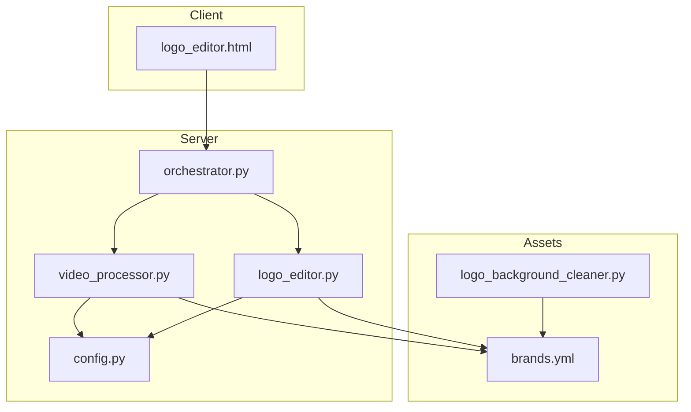

**Diagram sources**
- [logo_editor.html](file://app/ui/logo_editor.html#L1-L254)
- [logo_editor.py](file://app/logo_editor.py#L1-L132)
- [video_processor.py](file://app/video_processor.py#L1-L273)
- [orchestrator.py](file://app/orchestrator.py#L1-L172)
- [brands.yml](file://WTF_Brandy_TEMP/wtf_brands/wtf_orchestrator/brands.yml#L1-L423)
- [logo_background_cleaner.py](file://scripts/logo_background_cleaner.py#L1-L157)
- [config.py](file://app/config.py#L1-L18)

**Section sources**
- [logo_editor.html](file://app/ui/logo_editor.html#L1-L254)
- [logo_editor.py](file://app/logo_editor.py#L1-L132)
- [video_processor.py](file://app/video_processor.py#L1-L273)
- [orchestrator.py](file://app/orchestrator.py#L1-L172)
- [brands.yml](file://WTF_Brandy_TEMP/wtf_brands/wtf_orchestrator/brands.yml#L1-L423)
- [logo_background_cleaner.py](file://scripts/logo_background_cleaner.py#L1-L157)
- [config.py](file://app/config.py#L1-L18)

## Core Components
- Interactive Editor (Client)
  - Provides pinch-to-resize and drag gestures
  - Enforces a 5% safe zone around the video viewport
  - Sends logo position and size to the backend on confirmation
- Logo Editor (Server)
  - Calculates safe zones based on cropped video dimensions
  - Selects cleaned logo assets when available
  - Returns default logo settings and safe zone boundaries
- Video Processor (Server)
  - Applies logo overlay using ffmpeg with precise x/y and scaled dimensions
  - Integrates adaptive watermark opacity based on video brightness
  - Supports multiple brand exports with consistent logo placement
- Orchestration
  - Coordinates crop → logo editor → export stages
  - Passes crop metadata and brand configs to downstream steps
- Background Cleaner
  - Preprocesses logos to remove square backgrounds and produce circular transparent PNGs

**Section sources**
- [logo_editor.html](file://app/ui/logo_editor.html#L107-L251)
- [logo_editor.py](file://app/logo_editor.py#L11-L132)
- [video_processor.py](file://app/video_processor.py#L109-L178)
- [orchestrator.py](file://app/orchestrator.py#L85-L115)
- [logo_background_cleaner.py](file://scripts/logo_background_cleaner.py#L42-L98)

## Architecture Overview
The logo editor participates in a four-stage pipeline:
1. Download → 2. Crop (with aspect ratio selection) → 3. Logo Editor (interactive placement) → 4. Multi-Brand Export

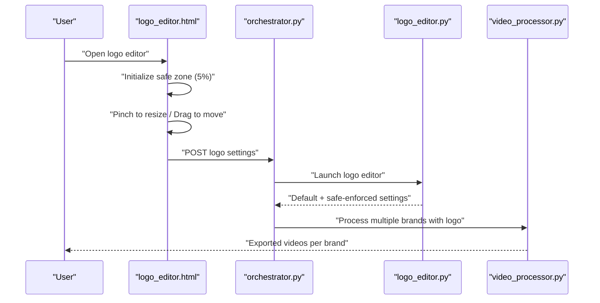

**Diagram sources**
- [logo_editor.html](file://app/ui/logo_editor.html#L129-L242)
- [logo_editor.py](file://app/logo_editor.py#L95-L114)
- [video_processor.py](file://app/video_processor.py#L180-L226)
- [orchestrator.py](file://app/orchestrator.py#L85-L115)

## Detailed Component Analysis

### Interactive Editor (Client-Side)
Key behaviors:
- Safe zone calculation: 5% margin from viewport edges
- Default logo size: 15% of viewport width
- Gesture handling:
  - Single finger: drag to reposition
  - Two fingers: pinch to resize (clamped between 10% and 30% of viewport width)
- Real-time preview updates: logo size and position update immediately
- Confirmation: sends x, y, width, height, and timestamp to backend

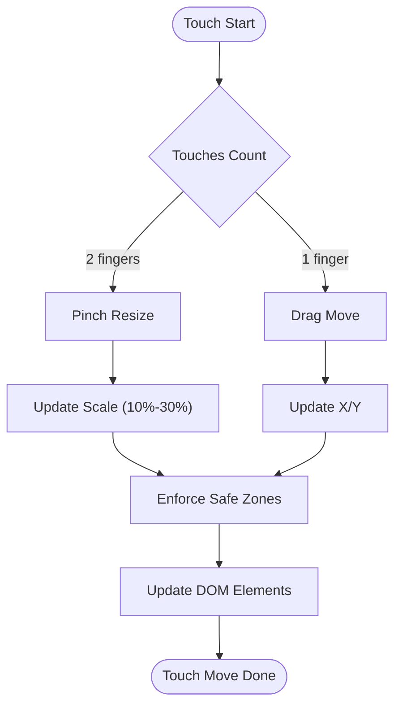

**Diagram sources**
- [logo_editor.html](file://app/ui/logo_editor.html#L181-L217)

**Section sources**
- [logo_editor.html](file://app/ui/logo_editor.html#L114-L172)
- [logo_editor.html](file://app/ui/logo_editor.html#L194-L217)
- [logo_editor.html](file://app/ui/logo_editor.html#L220-L242)

### Safe Zone Enforcement System
Two layers of enforcement ensure compliance with 5% margins:
- Client-side: Enforces safe zone during gesture updates
- Server-side: Validates and clamps logo positions against cropped video dimensions

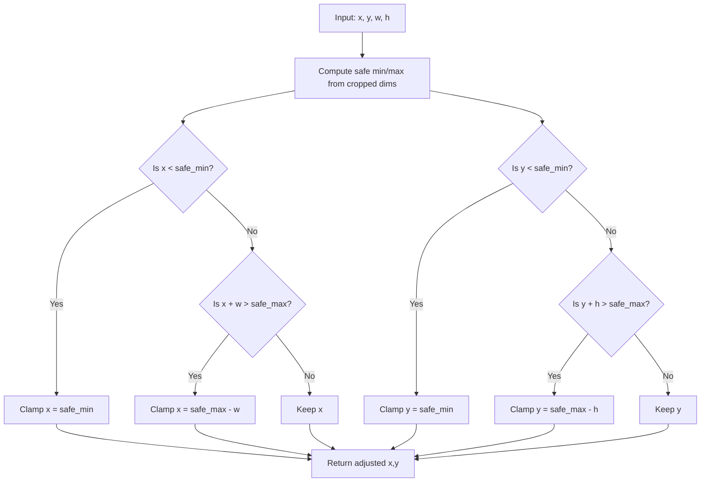

**Diagram sources**
- [logo_editor.py](file://app/logo_editor.py#L79-L93)
- [logo_editor.html](file://app/ui/logo_editor.html#L162-L172)

**Section sources**
- [logo_editor.py](file://app/logo_editor.py#L29-L33)
- [logo_editor.py](file://app/logo_editor.py#L79-L93)
- [logo_editor.html](file://app/ui/logo_editor.html#L135-L140)
- [logo_editor.html](file://app/ui/logo_editor.html#L162-L172)

### Background Removal and Asset Management
- Asset selection preference: prefers cleaned logos under logos_clean
- Background removal script:
  - Detects circular region (~40% of shorter side)
  - Creates circular alpha mask
  - Crops to circular bounds with small padding
  - Saves optimized PNG with transparency

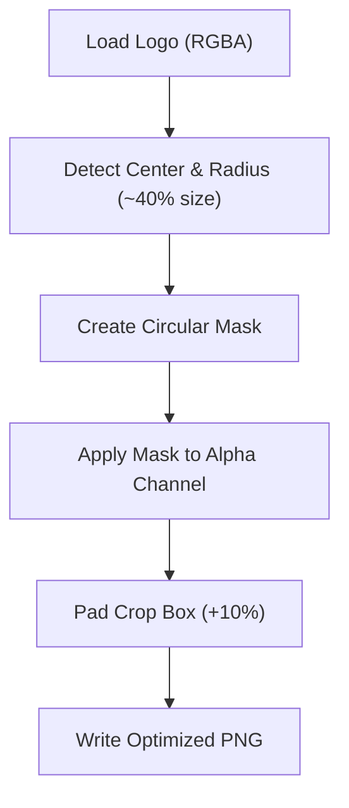

**Diagram sources**
- [logo_background_cleaner.py](file://scripts/logo_background_cleaner.py#L10-L40)
- [logo_background_cleaner.py](file://scripts/logo_background_cleaner.py#L42-L98)

**Section sources**
- [logo_editor.py](file://app/logo_editor.py#L38-L55)
- [logo_background_cleaner.py](file://scripts/logo_background_cleaner.py#L42-L98)

### Dynamic Scaling Based on Video Dimensions
- Client: logo size is computed as a percentage of viewport width; updates on resize
- Server: safe zones and default sizes are computed from cropped video dimensions
- Export: ffmpeg scales logo movie to exact pixel dimensions and overlays at precise coordinates

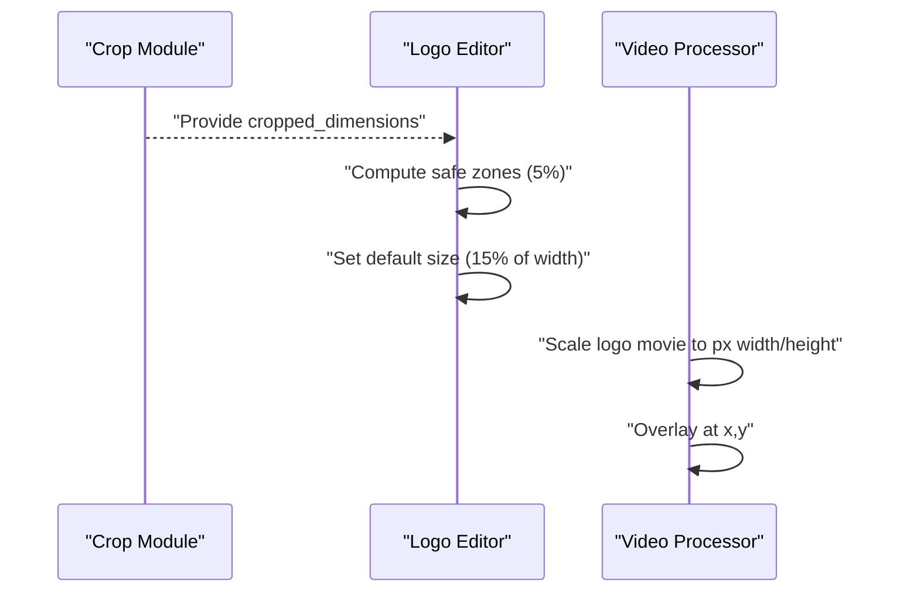

**Diagram sources**
- [crop_module.py](file://app/crop_module.py#L159-L171)
- [logo_editor.py](file://app/logo_editor.py#L25-L33)
- [logo_editor.py](file://app/logo_editor.py#L57-L77)
- [video_processor.py](file://app/video_processor.py#L139-L146)

**Section sources**
- [logo_editor.py](file://app/logo_editor.py#L25-L33)
- [logo_editor.py](file://app/logo_editor.py#L57-L77)
- [video_processor.py](file://app/video_processor.py#L139-L146)

### Position Validation Algorithms
- Client: clamp position to keep entire logo within safe zone bounds
- Server: same clamping logic applied to ensure correctness across devices/sizes

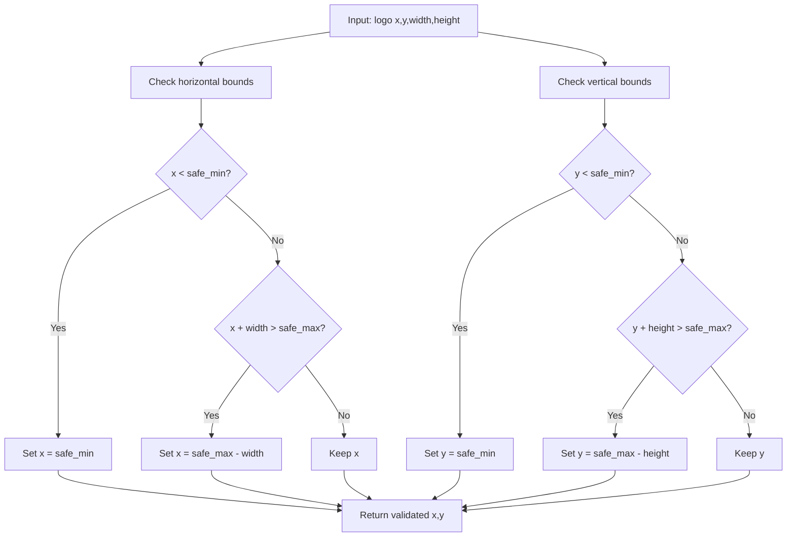

**Diagram sources**
- [logo_editor.html](file://app/ui/logo_editor.html#L170-L171)
- [logo_editor.py](file://app/logo_editor.py#L86-L88)

**Section sources**
- [logo_editor.html](file://app/ui/logo_editor.html#L170-L171)
- [logo_editor.py](file://app/logo_editor.py#L86-L88)

### Interactive Editing Interface
- Drag-and-drop: single-finger touch moves the logo within safe zones
- Resize handles: two-finger pinch resizes while maintaining aspect ratio
- Real-time preview: immediate DOM updates reflect new position and size
- Confirmation: sends normalized settings to backend for export

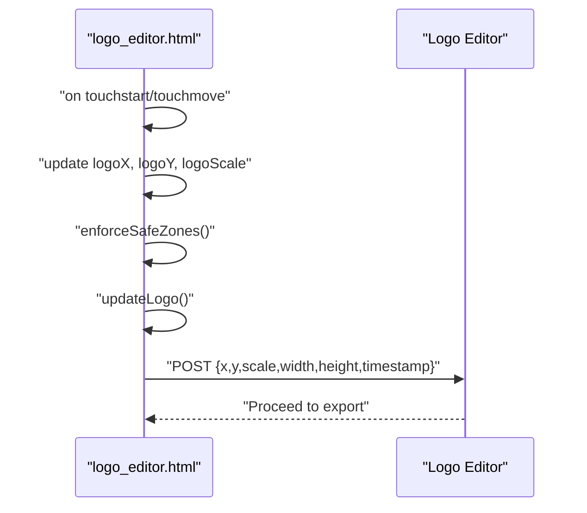

**Diagram sources**
- [logo_editor.html](file://app/ui/logo_editor.html#L181-L217)
- [logo_editor.html](file://app/ui/logo_editor.html#L220-L242)

**Section sources**
- [logo_editor.html](file://app/ui/logo_editor.html#L181-L217)
- [logo_editor.html](file://app/ui/logo_editor.html#L220-L242)

### Logo Asset Management, Opacity Controls, and Z-Index Positioning
- Asset selection: prefers logos_clean; falls back to original logo path
- Opacity: logo opacity is set to 1.0 in default settings; watermark opacity adapts dynamically
- Z-index: logo element is layered above video and below controls

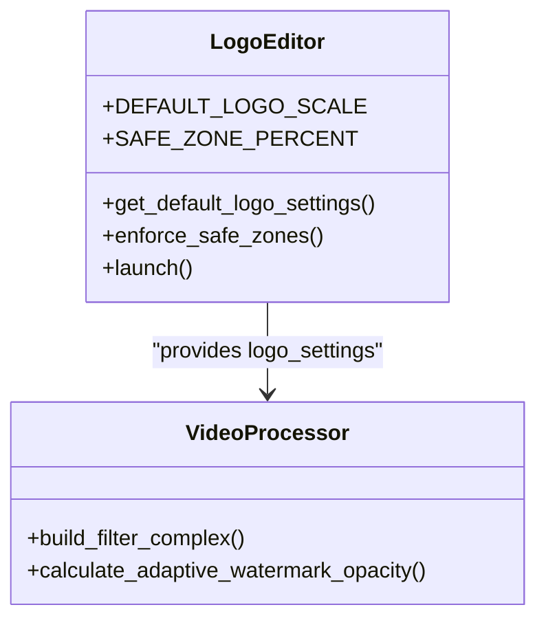

**Diagram sources**
- [logo_editor.py](file://app/logo_editor.py#L17-L18)
- [logo_editor.py](file://app/logo_editor.py#L57-L77)
- [video_processor.py](file://app/video_processor.py#L109-L178)

**Section sources**
- [logo_editor.py](file://app/logo_editor.py#L38-L55)
- [logo_editor.py](file://app/logo_editor.py#L57-L77)
- [video_processor.py](file://app/video_processor.py#L148-L178)
- [logo_editor.html](file://app/ui/logo_editor.html#L47-L48)

### Configuration Options and Export Quality Settings
- Brand-level configuration:
  - Assets: logo, template, watermark
  - Options: watermark_scale, watermark_position
- Export quality:
  - Video encoding: libx264 with CRF 18 and medium preset
  - Audio: copied AAC track
- Safe zone: 5% margin enforced consistently across client and server

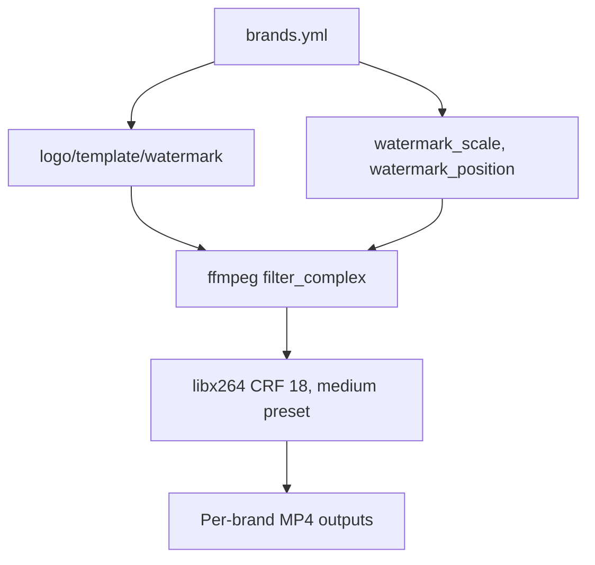

**Diagram sources**
- [brands.yml](file://WTF_Brandy_TEMP/wtf_brands/wtf_orchestrator/brands.yml#L1-L423)
- [video_processor.py](file://app/video_processor.py#L209-L218)

**Section sources**
- [brands.yml](file://WTF_Brandy_TEMP/wtf_brands/wtf_orchestrator/brands.yml#L1-L423)
- [video_processor.py](file://app/video_processor.py#L148-L178)
- [video_processor.py](file://app/video_processor.py#L209-L218)

## Dependency Analysis
- Client depends on:
  - Cropped video feed for preview
  - Backend endpoint to confirm logo settings
- Server depends on:
  - Crop metadata for safe zone computation
  - Brand configuration for assets
  - FFmpeg/FFprobe for video processing
- Background cleaner depends on:
  - Original logos directory
  - PIL for image processing

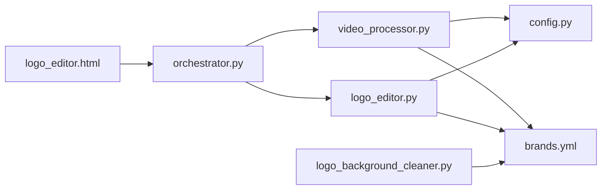

**Diagram sources**
- [logo_editor.html](file://app/ui/logo_editor.html#L125-L127)
- [logo_editor.py](file://app/logo_editor.py#L1-L132)
- [video_processor.py](file://app/video_processor.py#L1-L273)
- [orchestrator.py](file://app/orchestrator.py#L1-L172)
- [brands.yml](file://WTF_Brandy_TEMP/wtf_brands/wtf_orchestrator/brands.yml#L1-L423)
- [logo_background_cleaner.py](file://scripts/logo_background_cleaner.py#L1-L157)
- [config.py](file://app/config.py#L1-L18)

**Section sources**
- [logo_editor.py](file://app/logo_editor.py#L1-L132)
- [video_processor.py](file://app/video_processor.py#L1-L273)
- [orchestrator.py](file://app/orchestrator.py#L1-L172)
- [logo_background_cleaner.py](file://scripts/logo_background_cleaner.py#L1-L157)
- [config.py](file://app/config.py#L1-L18)

## Performance Considerations
- Client-side rendering:
  - Minimizes DOM updates by batching position and size changes
  - Uses requestAnimationFrame-friendly patterns (implicit via DOM updates)
- Server-side processing:
  - Uses efficient ffmpeg filter_complex chaining
  - Scales logo movie once per brand to avoid repeated conversions
- Background cleaning:
  - Optimizes PNG output and skips pre-existing files
  - Processes images in batches

[No sources needed since this section provides general guidance]

## Troubleshooting Guide
Common issues and resolutions:
- Logo outside safe zone
  - Verify client and server safe zone calculations match viewport and cropped dimensions
  - Ensure enforceSafeZones runs after every gesture
- Incorrect logo size on different devices
  - Confirm default scale is based on viewport width and resized events are handled
- Transparent logo not visible
  - Ensure cleaned logo exists in logos_clean and is used by logo path resolution
- Export artifacts
  - Check ffmpeg parameters and ensure pixel dimensions are even numbers
  - Validate watermark opacity adaptation does not conflict with brand opacity settings

**Section sources**
- [logo_editor.html](file://app/ui/logo_editor.html#L162-L172)
- [logo_editor.py](file://app/logo_editor.py#L79-L93)
- [logo_editor.py](file://app/logo_editor.py#L38-L55)
- [video_processor.py](file://app/video_processor.py#L148-L178)

## Conclusion
The logo editor integrates a responsive client-side interface with robust server-side enforcement to ensure consistent, compliant logo placement across diverse social media formats. By combining safe zone constraints, dynamic scaling, and background removal, it delivers high-quality, brand-consistent overlays suitable for multi-platform distribution.

[No sources needed since this section summarizes without analyzing specific files]

## Appendices

### Best Practices for Different Brand Requirements
- Square/Instagram feeds: prefer 1:1 aspect ratio; ensure logo remains fully within 5% margins
- Vertical stories (9:16): place logo near corner with adequate spacing; use circular transparent logos for crisp edges
- Landscape (16:9): avoid center placement to prevent clipping; test watermark overlap
- Bright vs. dark content: rely on adaptive watermark opacity; adjust logo opacity if needed for contrast

**Section sources**
- [brands.yml](file://WTF_Brandy_TEMP/wtf_brands/wtf_orchestrator/brands.yml#L1-L423)
- [video_processor.py](file://app/video_processor.py#L92-L107)

### Example Workflows
- Workflow A: Default placement
  - Launch crop module with target aspect ratio
  - Open logo editor; accept default top-left position within safe zone
  - Confirm and export to all brands
- Workflow B: Custom placement
  - Drag logo to preferred corner
  - Pinch to achieve desired size within 10–30% range
  - Confirm; export; validate per-brand outputs

**Section sources**
- [orchestrator.py](file://app/orchestrator.py#L85-L115)
- [logo_editor.html](file://app/ui/logo_editor.html#L220-L242)