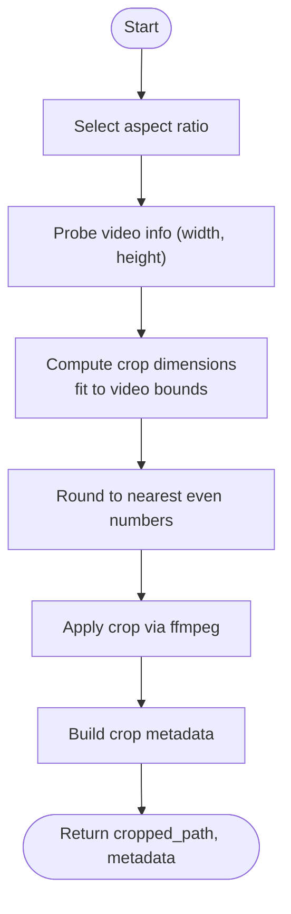

# Orchestrator Pipeline

<cite>
**Referenced Files in This Document**
- [orchestrator.py](file://app/orchestrator.py)
- [crop_module.py](file://app/crop_module.py)
- [logo_editor.py](file://app/logo_editor.py)
- [video_processor.py](file://app/video_processor.py)
- [brand_loader.py](file://app/brand_loader.py)
- [config.py](file://app/config.py)
- [crop_editor.html](file://app/ui/crop_editor.html)
- [logo_editor.html](file://app/ui/logo_editor.html)
- [brands.yml](file://imports/brands/brands.yml)
- [demo_orchestrator.py](file://demo_orchestrator.py)
</cite>

## Table of Contents
1. [Introduction](#introduction)
2. [Project Structure](#project-structure)
3. [Core Components](#core-components)
4. [Architecture Overview](#architecture-overview)
5. [Detailed Component Analysis](#detailed-component-analysis)
6. [Dependency Analysis](#dependency-analysis)
7. [Performance Considerations](#performance-considerations)
8. [Troubleshooting Guide](#troubleshooting-guide)
9. [Conclusion](#conclusion)
10. [Appendices](#appendices)

## Introduction
This document explains the WTFOrchestrator class that coordinates the complete video processing pipeline for WatchTheFall. The orchestrator manages a four-stage workflow:
- Stage 1: Video download preparation (external tooling)
- Stage 2: Interactive crop selection with pinch-to-zoom and drag
- Stage 3: Logo positioning with safe zones and adaptive sizing
- Stage 4: Multi-brand export with brand-specific overlays and adaptive watermarking

It documents the orchestrator’s role in workflow execution, error handling, and result aggregation; details the process_video method’s parameter handling, stage coordination, and output generation; and explains brand filtering, metadata collection, and progress reporting. It also provides examples of pipeline execution, configuration options, and integration patterns with supporting components.

## Project Structure
The orchestrator lives in the application package and integrates with crop, logo editing, branding, and video processing modules. The UI templates provide mobile-friendly interfaces for crop and logo stages.

**Diagram sources**
- [orchestrator.py](file://app/orchestrator.py#L12-L171)
- [crop_module.py](file://app/crop_module.py#L11-L192)
- [logo_editor.py](file://app/logo_editor.py#L11-L131)
- [video_processor.py](file://app/video_processor.py#L13-L272)
- [brand_loader.py](file://app/brand_loader.py#L168-L183)
- [config.py](file://app/config.py#L1-L18)
- [crop_editor.html](file://app/ui/crop_editor.html#L1-L261)
- [logo_editor.html](file://app/ui/logo_editor.html#L1-L254)
- [brands.yml](file://imports/brands/brands.yml#L1-L255)

**Section sources**
- [orchestrator.py](file://app/orchestrator.py#L1-L172)
- [config.py](file://app/config.py#L1-L18)

## Core Components
- WTFOrchestrator: Central coordinator that runs the four-stage pipeline, aggregates results, and handles errors.
- CropEditor: Computes crop geometry, applies crop via ffmpeg, and produces metadata for downstream stages.
- LogoEditor: Provides default logo settings, enforces safe zones, and returns logo settings for overlay composition.
- VideoProcessor: Applies brand overlays (template, logo, watermark), calculates adaptive opacity based on video brightness, and exports per brand.
- Brand Loader: Discovers and loads brand configurations from the imports/brands directory and manifest files.
- Config: Defines project paths, ffmpeg/ffprobe binaries, and ensures required directories exist.

Key responsibilities:
- Parameter handling in process_video: Validates inputs, orchestrates stages, and collects outputs.
- Brand filtering: Filters brands by name or display name when a subset is requested.
- Metadata collection: Gathers crop metadata and logo settings for downstream processing.
- Progress reporting: Prints stage-by-stage updates and a final summary.

**Section sources**
- [orchestrator.py](file://app/orchestrator.py#L29-L115)
- [crop_module.py](file://app/crop_module.py#L81-L192)
- [logo_editor.py](file://app/logo_editor.py#L57-L114)
- [video_processor.py](file://app/video_processor.py#L109-L253)
- [brand_loader.py](file://app/brand_loader.py#L168-L183)
- [config.py](file://app/config.py#L11-L18)

## Architecture Overview
The orchestrator composes three primary modules and integrates with UI templates for interactive stages. The pipeline is designed for mobile-first workflows with web-based editors.

**Diagram sources**
- [orchestrator.py](file://app/orchestrator.py#L29-L115)
- [crop_module.py](file://app/crop_module.py#L174-L192)
- [brand_loader.py](file://app/brand_loader.py#L168-L183)
- [logo_editor.py](file://app/logo_editor.py#L117-L131)
- [video_processor.py](file://app/video_processor.py#L256-L272)

## Detailed Component Analysis

### WTFOrchestrator
- Role: Coordinates the entire pipeline, manages stage transitions, aggregates results, and prints summaries.
- process_video:
  - Stage 1: Crop using CropEditor; stores cropped path and metadata.
  - Stage 2: Load brands via brand loader; filter by selected_brands; record counts and names.
  - Stage 3: Launch logo editor using the first brand as reference; enforce safe zones.
  - Stage 4: Export to multiple brands via VideoProcessor; collect output paths.
  - Error handling: Catches exceptions, appends to errors, and marks success accordingly.
- Utility methods:
  - get_available_brands: Delegates to brand loader.
  - print_summary: Human-readable summary of stages, outputs, and errors.

Implementation highlights:
- Parameter handling: Accepts optional selected_brands, aspect_ratio, and video_id; defaults to “9:16” aspect ratio.
- Brand filtering: Matches either name or display_name against the provided list.
- Metadata propagation: Passes crop_metadata to logo editor and logo_settings to video processor.

**Section sources**
- [orchestrator.py](file://app/orchestrator.py#L29-L115)
- [orchestrator.py](file://app/orchestrator.py#L117-L149)

#### Class Diagram

**Diagram sources**
- [orchestrator.py](file://app/orchestrator.py#L12-L171)
- [crop_module.py](file://app/crop_module.py#L11-L192)
- [logo_editor.py](file://app/logo_editor.py#L11-L131)
- [video_processor.py](file://app/video_processor.py#L13-L272)

### CropEditor (Stage 1)
- Purpose: Compute crop dimensions based on aspect ratio, apply crop via ffmpeg, and produce metadata.
- Aspect ratios: 9:16 (default), 1:1, 4:5, 16:9.
- Safety: Ensures even width/height and coordinates for ffmpeg compatibility.
- Metadata: Includes original and cropped dimensions plus crop parameters.

**Section sources**
- [crop_module.py](file://app/crop_module.py#L17-L22)
- [crop_module.py](file://app/crop_module.py#L61-L79)
- [crop_module.py](file://app/crop_module.py#L81-L109)
- [crop_module.py](file://app/crop_module.py#L111-L157)
- [crop_module.py](file://app/crop_module.py#L159-L171)
- [crop_module.py](file://app/crop_module.py#L174-L192)

#### Flowchart: Crop Dimensions and Application

**Diagram sources**
- [crop_module.py](file://app/crop_module.py#L33-L59)
- [crop_module.py](file://app/crop_module.py#L61-L79)
- [crop_module.py](file://app/crop_module.py#L111-L157)
- [crop_module.py](file://app/crop_module.py#L159-L171)

### LogoEditor (Stage 3)
- Purpose: Provide default logo settings and enforce safe zones.
- Defaults: 15% of video width; top-left with 5% safe margins.
- Safe zones: Dynamically computed from cropped dimensions; enforced during positioning.
- Integration: Returns logo path (prefers cleaned variant) and settings for overlay composition.

**Section sources**
- [logo_editor.py](file://app/logo_editor.py#L17-L18)
- [logo_editor.py](file://app/logo_editor.py#L57-L77)
- [logo_editor.py](file://app/logo_editor.py#L79-L93)
- [logo_editor.py](file://app/logo_editor.py#L95-L114)
- [logo_editor.py](file://app/logo_editor.py#L117-L131)

#### Flowchart: Logo Settings and Safe Zones

**Diagram sources**
- [logo_editor.py](file://app/logo_editor.py#L57-L77)
- [logo_editor.py](file://app/logo_editor.py#L79-L93)
- [logo_editor.py](file://app/logo_editor.py#L95-L114)

### VideoProcessor (Stage 4)
- Purpose: Apply brand overlays and export per brand.
- Overlays order: Template → Logo → Watermark.
- Adaptive watermark opacity: Inverse relationship with video brightness (10–20%).
- Safe zones: Watermark placed with 5% margins; configurable position (bottom-right by default).
- Multi-brand export: Iterates through brands, building filter_complex per brand.

**Section sources**
- [video_processor.py](file://app/video_processor.py#L18-L21)
- [video_processor.py](file://app/video_processor.py#L52-L90)
- [video_processor.py](file://app/video_processor.py#L92-L107)
- [video_processor.py](file://app/video_processor.py#L109-L178)
- [video_processor.py](file://app/video_processor.py#L180-L226)
- [video_processor.py](file://app/video_processor.py#L227-L253)
- [video_processor.py](file://app/video_processor.py#L256-L272)

#### Sequence Diagram: Multi-Brand Export

**Diagram sources**
- [video_processor.py](file://app/video_processor.py#L227-L253)
- [video_processor.py](file://app/video_processor.py#L109-L178)
- [video_processor.py](file://app/video_processor.py#L209-L225)

### Brand Loader and Configuration
- Brand discovery: Scans imports/brands for directories and manifest files; merges YAML manifests with discovered assets.
- Top-level brands.yml: Preferred source of truth; overrides discovered assets.
- Options: watermark position and scale; display_name fallbacks.

**Section sources**
- [brand_loader.py](file://app/brand_loader.py#L168-L183)
- [brand_loader.py](file://app/brand_loader.py#L131-L166)
- [brand_loader.py](file://app/brand_loader.py#L35-L129)
- [brands.yml](file://imports/brands/brands.yml#L1-L255)
- [config.py](file://app/config.py#L7-L9)

### UI Templates Integration
- Crop Editor UI: Mobile-friendly pinch-to-zoom and drag controls; sends crop settings to backend.
- Logo Editor UI: Pinch-to-resize and drag logo; enforces 5% safe zones; sends logo settings to backend.

**Section sources**
- [crop_editor.html](file://app/ui/crop_editor.html#L130-L257)
- [logo_editor.html](file://app/ui/logo_editor.html#L107-L251)

## Dependency Analysis
The orchestrator depends on crop, logo, and video processing modules, which in turn depend on ffmpeg/ffprobe and project configuration. Brand loading reads from the imports/brands directory and manifest files.

**Diagram sources**
- [orchestrator.py](file://app/orchestrator.py#L7-L10)
- [crop_module.py](file://app/crop_module.py#L9)
- [logo_editor.py](file://app/logo_editor.py#L9)
- [video_processor.py](file://app/video_processor.py#L11)
- [brand_loader.py](file://app/brand_loader.py#L11)
- [config.py](file://app/config.py#L1-L18)

**Section sources**
- [orchestrator.py](file://app/orchestrator.py#L7-L10)
- [crop_module.py](file://app/crop_module.py#L9)
- [logo_editor.py](file://app/logo_editor.py#L9)
- [video_processor.py](file://app/video_processor.py#L11)
- [brand_loader.py](file://app/brand_loader.py#L11)
- [config.py](file://app/config.py#L1-L18)

## Performance Considerations
- Crop and export use ffmpeg with libx264 and AAC audio encoding; presets balance quality and speed.
- Adaptive watermark opacity avoids overexposure on bright videos and underexposure on dark videos.
- Safe zones prevent overlays from being clipped at small screen sizes.
- Multi-brand export iterates per brand; consider batching or parallelization if scaling to very large brand sets.

[No sources needed since this section provides general guidance]

## Troubleshooting Guide
Common issues and resolutions:
- Missing ffmpeg/ffprobe: Set environment variables FFMPEG_PATH and FFPROBE_PATH to point to installed binaries.
- No brands found: Verify imports/brands directory and brands.yml; ensure asset files exist and manifest entries are correct.
- Empty selected_brands: The orchestrator falls back to all brands; confirm brand names match display_name or name.
- Crop/Logo UI not available: Ensure UI templates are served and endpoints are reachable; the orchestrator expects web-based workflows.

**Section sources**
- [config.py](file://app/config.py#L11-L13)
- [brand_loader.py](file://app/brand_loader.py#L168-L183)
- [brands.yml](file://imports/brands/brands.yml#L1-L255)

## Conclusion
The WTFOrchestrator class provides a robust, modular pipeline for transforming raw videos into brand-specific, overlay-rich content. By coordinating crop, logo, and multi-brand export stages, it enables efficient, scalable video processing with strong safety checks (safe zones), adaptive rendering (brightness-aware watermarking), and clear progress reporting. Integrating with UI templates and manifest-driven brand configurations, it supports both automated and interactive workflows suitable for mobile and desktop environments.

[No sources needed since this section summarizes without analyzing specific files]

## Appendices

### Pipeline Execution Examples
- Basic usage: See the demo script for a complete walkthrough and usage example.
- Interactive stages: Use the crop editor and logo editor UI templates to configure crop and logo settings before exporting.

**Section sources**
- [demo_orchestrator.py](file://demo_orchestrator.py#L74-L105)
- [crop_editor.html](file://app/ui/crop_editor.html#L233-L251)
- [logo_editor.html](file://app/ui/logo_editor.html#L219-L241)

### Configuration Options
- Aspect ratios: 9:16 (default), 1:1, 4:5, 16:9.
- Watermark options: position (bottom-right by default) and scale (relative to video width).
- Output structure: exports/<brand>/<brand>_<video_id>.mp4.

**Section sources**
- [crop_module.py](file://app/crop_module.py#L17-L22)
- [video_processor.py](file://app/video_processor.py#L18-L21)
- [video_processor.py](file://app/video_processor.py#L152-L176)
- [brands.yml](file://imports/brands/brands.yml#L12-L14)

### Integration Patterns
- External download: The orchestrator expects a pre-downloaded video path; integrate with yt-dlp or another downloader prior to calling process_video.
- Brand assets: Maintain assets and manifests in imports/brands; use brands.yml for centralized configuration.
- UI workflows: Serve crop_editor.html and logo_editor.html to guide users through interactive stages; the orchestrator coordinates backend processing.

**Section sources**
- [orchestrator.py](file://app/orchestrator.py#L16-L21)
- [brand_loader.py](file://app/brand_loader.py#L168-L183)
- [brands.yml](file://imports/brands/brands.yml#L1-L255)
- [crop_editor.html](file://app/ui/crop_editor.html#L1-L261)
- [logo_editor.html](file://app/ui/logo_editor.html#L1-L254)