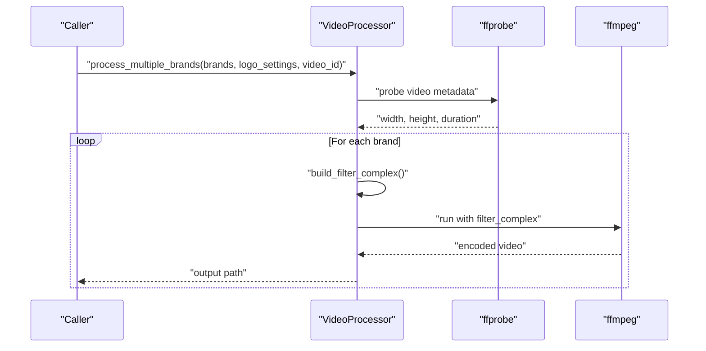
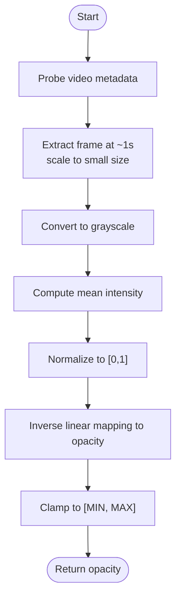
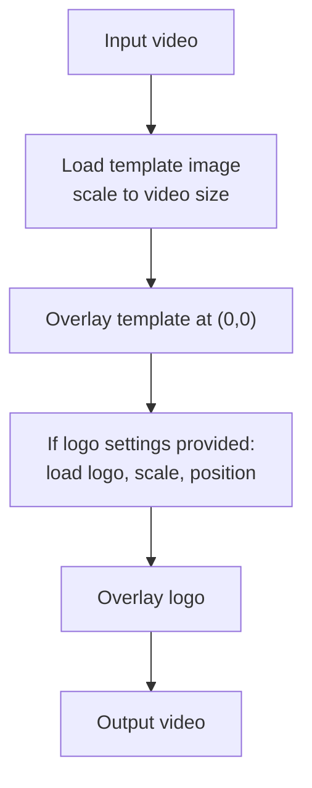
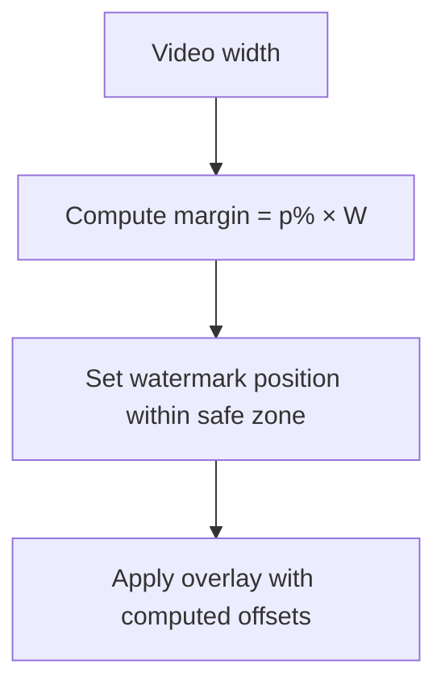
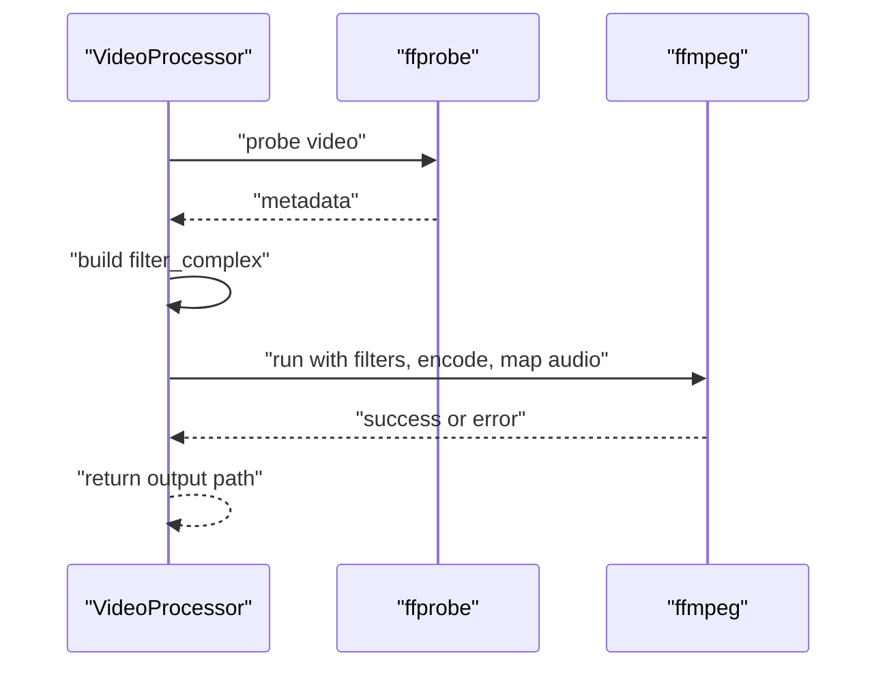
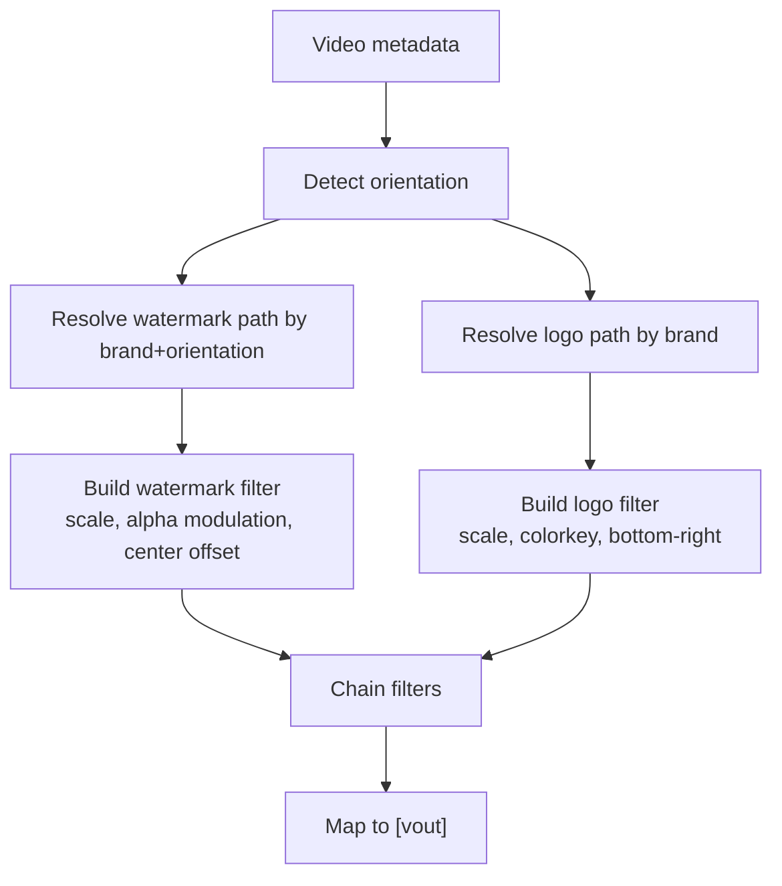
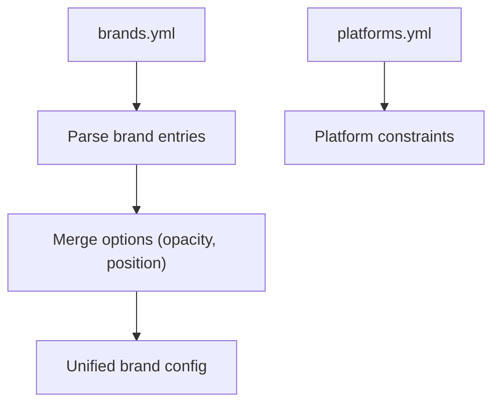
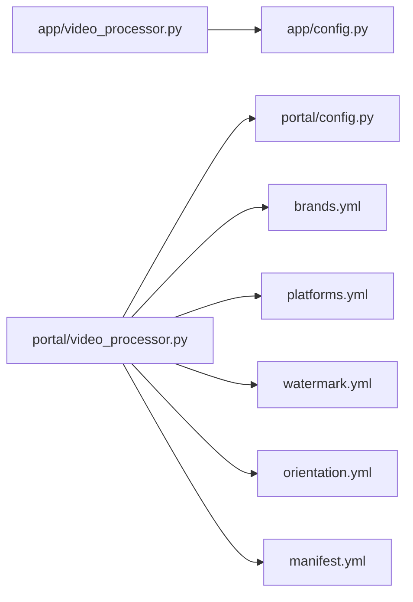

# Video Processing Module

<cite>
**Referenced Files in This Document**
- [app/video_processor.py](file://app/video_processor.py)
- [portal/video_processor.py](file://portal/video_processor.py)
- [app/config.py](file://app/config.py)
- [portal/config.py](file://portal/config.py)
- [imports/brands/wtf_orchestrator/brands.yml](file://imports/brands/wtf_orchestrator/brands.yml)
- [portal/wtf_brands/wtf_orchestrator/brands.yml](file://portal/wtf_brands/wtf_orchestrator/brands.yml)
- [portal/wtf_brands/wtf_orchestrator/platforms.yml](file://portal/wtf_brands/wtf_orchestrator/platforms.yml)
- [portal/wtf_brands/wtf_orchestrator/watermark.yml](file://portal/wtf_brands/wtf_orchestrator/watermark.yml)
- [portal/wtf_brands/wtf_orchestrator/orientation.yml](file://portal/wtf_brands/wtf_orchestrator/orientation.yml)
- [portal/wtf_brands/wtf_orchestrator/manifest.yml](file://portal/wtf_brands/wtf_orchestrator/manifest.yml)
</cite>

## Table of Contents
1. [Introduction](#introduction)
2. [Project Structure](#project-structure)
3. [Core Components](#core-components)
4. [Architecture Overview](#architecture-overview)
5. [Detailed Component Analysis](#detailed-component-analysis)
6. [Dependency Analysis](#dependency-analysis)
7. [Performance Considerations](#performance-considerations)
8. [Troubleshooting Guide](#troubleshooting-guide)
9. [Conclusion](#conclusion)
10. [Appendices](#appendices)

## Introduction
This document describes the video processing module responsible for advanced video manipulation tasks, including template application, logo placement, adaptive watermark opacity, safe zone enforcement, and FFmpeg integration. It explains the brightness detection algorithms used for adaptive watermark opacity, the template application system, safe zone enforcement mechanisms, and FFmpeg integration patterns. It also covers the video processing workflow, mathematical calculations for brightness analysis, aspect ratio conversions, and quality optimization. Finally, it documents configuration options for processing parameters, performance tuning, and memory management, along with practical examples and troubleshooting guidance.

## Project Structure
The video processing system spans two primary implementations:
- A lightweight, template-based processor that supports per-brand assets and adaptive watermark opacity.
- A robust, master asset-driven processor that resolves watermarks and logos from centralized directories based on orientation and brand naming conventions.

Key configuration and asset files define brand-specific settings, platform constraints, and watermark positioning.

```mermaid
graph TB
subgraph "Application Layer"
APP_CFG["app/config.py"]
APP_PROC["app/video_processor.py"]
end
subgraph "Portal Layer"
PORTAL_CFG["portal/config.py"]
PORTAL_PROC["portal/video_processor.py"]
end
subgraph "Configuration"
BRANDS_YAML["imports/brands/wtf_orchestrator/brands.yml"]
PLATFORMS_YAML["portal/wtf_brands/wtf_orchestrator/platforms.yml"]
WATERMARK_YAML["portal/wtf_brands/wtf_orchestrator/watermark.yml"]
ORIENTATION_YAML["portal/wtf_brands/wtf_orchestrator/orientation.yml"]
MANIFEST_YAML["portal/wtf_brands/wtf_orchestrator/manifest.yml"]
end
subgraph "Assets"
MASTER_ASSETS["WTF_MASTER_ASSETS/Branding/"]
end
APP_PROC --> APP_CFG
PORTAL_PROC --> PORTAL_CFG
PORTAL_PROC --> MASTER_ASSETS
APP_PROC --> BRANDS_YAML
PORTAL_PROC --> BRANDS_YAML
PORTAL_PROC --> PLATFORMS_YAML
PORTAL_PROC --> WATERMARK_YAML
PORTAL_PROC --> ORIENTATION_YAML
PORTAL_PROC --> MANIFEST_YAML
```

**Diagram sources**
- [app/video_processor.py](file://app/video_processor.py#L1-L273)
- [portal/video_processor.py](file://portal/video_processor.py#L1-L500)
- [app/config.py](file://app/config.py#L1-L18)
- [portal/config.py](file://portal/config.py#L1-L42)
- [imports/brands/wtf_orchestrator/brands.yml](file://imports/brands/wtf_orchestrator/brands.yml#L1-L423)
- [portal/wtf_brands/wtf_orchestrator/platforms.yml](file://portal/wtf_brands/wtf_orchestrator/platforms.yml#L1-L267)
- [portal/wtf_brands/wtf_orchestrator/watermark.yml](file://portal/wtf_brands/wtf_orchestrator/watermark.yml#L1-L3)
- [portal/wtf_brands/wtf_orchestrator/orientation.yml](file://portal/wtf_brands/wtf_orchestrator/orientation.yml#L1-L4)
- [portal/wtf_brands/wtf_orchestrator/manifest.yml](file://portal/wtf_brands/wtf_orchestrator/manifest.yml#L1-L4)

**Section sources**
- [app/video_processor.py](file://app/video_processor.py#L1-L273)
- [portal/video_processor.py](file://portal/video_processor.py#L1-L500)
- [app/config.py](file://app/config.py#L1-L18)
- [portal/config.py](file://portal/config.py#L1-L42)

## Core Components
- Brightness detection and adaptive watermark opacity:
  - Extracts a small-scale frame near the start of the video.
  - Computes grayscale mean brightness normalized to [0, 1].
  - Uses inverse linear interpolation to derive opacity in [MIN, MAX] range.
- Template application system:
  - Loads a template image sized to video dimensions and overlays it at the top-left.
- Safe zone enforcement:
  - Enforces a fixed percentage margin from edges for watermark placement.
- FFmpeg integration:
  - Probes video metadata via ffprobe.
  - Builds filter_complex chains for overlays and re-encodes with libx264.
  - Applies quality controls (CRF, preset) and copies audio tracks.

**Section sources**
- [app/video_processor.py](file://app/video_processor.py#L52-L107)
- [app/video_processor.py](file://app/video_processor.py#L109-L178)
- [app/video_processor.py](file://app/video_processor.py#L209-L225)

## Architecture Overview
The system integrates Python-based orchestration with FFmpeg for media processing. Two processors coexist:
- Lightweight processor (app): supports template, optional logo, and adaptive watermark with brightness-based opacity.
- Master asset processor (portal): resolves watermarks/logos from centralized directories, enforces orientation-aware asset selection, and applies full-frame watermark with precise scaling and alpha modulation.

**Diagram sources**
- [portal/video_processor.py](file://portal/video_processor.py#L91-L133)
- [portal/video_processor.py](file://portal/video_processor.py#L228-L313)
- [portal/video_processor.py](file://portal/video_processor.py#L369-L403)

## Detailed Component Analysis

### Brightness Detection and Adaptive Opacity
- Frame sampling:
  - Extracts a single frame ~1 second into the video at a reduced size for speed.
- Brightness computation:
  - Converts to grayscale and computes mean pixel intensity normalized to [0, 1].
- Opacity calculation:
  - Inverse linear mapping from brightness to opacity within configured bounds.
- Robustness:
  - Defaults to mid-brightness if extraction fails.

**Diagram sources**
- [app/video_processor.py](file://app/video_processor.py#L52-L90)
- [app/video_processor.py](file://app/video_processor.py#L92-L107)

**Section sources**
- [app/video_processor.py](file://app/video_processor.py#L52-L107)

### Template Application System
- Template loading:
  - Loads a template image sized to the video’s width and height.
- Overlay composition:
  - Places the template at the top-left corner.
- Optional logo overlay:
  - Scales and positions a logo according to provided settings.

**Diagram sources**
- [app/video_processor.py](file://app/video_processor.py#L128-L147)
- [app/video_processor.py](file://app/video_processor.py#L148-L178)

**Section sources**
- [app/video_processor.py](file://app/video_processor.py#L109-L178)

### Safe Zone Enforcement Mechanisms
- Percentage-based margins:
  - A fixed percentage of the video width is reserved from each edge.
- Watermark positioning:
  - Bottom-right by default; configurable to other corners.
- Edge alignment:
  - Positions watermark so it remains within the safe zone.

**Diagram sources**
- [app/video_processor.py](file://app/video_processor.py#L155-L174)

**Section sources**
- [app/video_processor.py](file://app/video_processor.py#L18-L20)
- [app/video_processor.py](file://app/video_processor.py#L155-L174)

### FFmpeg Integration Patterns
- Metadata probing:
  - Uses ffprobe to extract width, height, and duration.
- Filter graph construction:
  - Dynamically builds filter_complex with chained overlays.
- Encoding pipeline:
  - Re-encodes video with libx264, copies audio, and applies quality controls.
- Error handling:
  - Captures and surfaces FFmpeg errors with detailed stderr/stdout.

**Diagram sources**
- [app/video_processor.py](file://app/video_processor.py#L30-L50)
- [app/video_processor.py](file://app/video_processor.py#L209-L225)

**Section sources**
- [app/video_processor.py](file://app/video_processor.py#L30-L50)
- [app/video_processor.py](file://app/video_processor.py#L209-L225)

### Master Asset Resolution and Full-Frame Watermarking (Portal Processor)
- Orientation detection:
  - Determines vertical, square, or landscape based on width/height.
- Dynamic asset resolution:
  - Resolves watermark and logo paths from centralized directories based on brand and orientation.
- Full-frame watermark:
  - Scales watermark slightly larger than frame to compensate for PNG padding, centers via negative offsets, and modulates alpha channel.
- Logo overlay:
  - Places logo at bottom-right with configurable padding and colorkey removal.
- Validation:
  - Ensures a single labeled output stream for downstream mapping.

**Diagram sources**
- [portal/video_processor.py](file://portal/video_processor.py#L151-L171)
- [portal/video_processor.py](file://portal/video_processor.py#L173-L204)
- [portal/video_processor.py](file://portal/video_processor.py#L228-L313)

**Section sources**
- [portal/video_processor.py](file://portal/video_processor.py#L71-L133)
- [portal/video_processor.py](file://portal/video_processor.py#L151-L204)
- [portal/video_processor.py](file://portal/video_processor.py#L228-L313)

### Brand Configuration and Options
- Brand-level settings:
  - Display name, slug, watermark opacity, watermark position, and default hashtags.
- Options propagation:
  - Per-brand options merged into a unified structure for processing.
- Platform constraints:
  - Platform-specific rules define aspect ratios, resolutions, safe zones, and filename patterns.

**Diagram sources**
- [imports/brands/wtf_orchestrator/brands.yml](file://imports/brands/wtf_orchestrator/brands.yml#L1-L423)
- [portal/wtf_brands/wtf_orchestrator/platforms.yml](file://portal/wtf_brands/wtf_orchestrator/platforms.yml#L1-L267)

**Section sources**
- [imports/brands/wtf_orchestrator/brands.yml](file://imports/brands/wtf_orchestrator/brands.yml#L1-L423)
- [portal/wtf_brands/wtf_orchestrator/platforms.yml](file://portal/wtf_brands/wtf_orchestrator/platforms.yml#L1-L267)

## Dependency Analysis
- Internal dependencies:
  - Both processors depend on configuration for binary paths and project roots.
  - The portal processor additionally depends on centralized asset directories and YAML-based configuration.
- External dependencies:
  - FFmpeg and FFprobe are invoked for probing and encoding.
- Coupling and cohesion:
  - The portal processor encapsulates orientation detection and asset resolution, increasing cohesion around branding logic.
  - The app processor focuses on brightness-based opacity and template/logo overlays, keeping responsibilities distinct.

**Diagram sources**
- [app/video_processor.py](file://app/video_processor.py#L1-L273)
- [portal/video_processor.py](file://portal/video_processor.py#L1-L500)
- [app/config.py](file://app/config.py#L1-L18)
- [portal/config.py](file://portal/config.py#L1-L42)
- [imports/brands/wtf_orchestrator/brands.yml](file://imports/brands/wtf_orchestrator/brands.yml#L1-L423)
- [portal/wtf_brands/wtf_orchestrator/platforms.yml](file://portal/wtf_brands/wtf_orchestrator/platforms.yml#L1-L267)
- [portal/wtf_brands/wtf_orchestrator/watermark.yml](file://portal/wtf_brands/wtf_orchestrator/watermark.yml#L1-L3)
- [portal/wtf_brands/wtf_orchestrator/orientation.yml](file://portal/wtf_brands/wtf_orchestrator/orientation.yml#L1-L4)
- [portal/wtf_brands/wtf_orchestrator/manifest.yml](file://portal/wtf_brands/wtf_orchestrator/manifest.yml#L1-L4)

**Section sources**
- [app/video_processor.py](file://app/video_processor.py#L1-L273)
- [portal/video_processor.py](file://portal/video_processor.py#L1-L500)
- [app/config.py](file://app/config.py#L1-L18)
- [portal/config.py](file://portal/config.py#L1-L42)

## Performance Considerations
- Brightness computation:
  - Sampling a small frame reduces overhead; consider caching brightness per video to avoid repeated extraction.
- Encoding quality:
  - CRF and preset influence quality and speed trade-offs; adjust for target platforms.
- Thread and buffer tuning:
  - The portal processor sets thread counts and buffer sizes suitable for server-class environments.
- Memory management:
  - Avoid loading large images unnecessarily; reuse temporary frames and clean up intermediate files promptly.

[No sources needed since this section provides general guidance]

## Troubleshooting Guide
- FFmpeg errors:
  - Inspect captured stderr/stdout for detailed failure reasons.
- Missing overlays:
  - Verify asset paths exist and brand names match expected patterns.
- Audio issues:
  - Ensure audio streams exist; the processors copy audio when available.
- Orientation mismatches:
  - Confirm orientation detection aligns with intended asset directories.

**Section sources**
- [portal/video_processor.py](file://portal/video_processor.py#L390-L403)
- [portal/video_processor.py](file://portal/video_processor.py#L362-L366)
- [portal/video_processor.py](file://portal/video_processor.py#L268-L288)

## Conclusion
The video processing module provides two complementary pipelines: a flexible template-based processor and a robust master asset-driven processor. Together, they support adaptive watermarking, safe zone enforcement, and high-quality encoding via FFmpeg. Configuration files enable precise control over branding, platform constraints, and processing parameters, while built-in safeguards improve reliability across diverse inputs.

[No sources needed since this section summarizes without analyzing specific files]

## Appendices

### Mathematical Calculations Summary
- Brightness normalization:
  - Mean grayscale intensity divided by 255 to yield [0, 1].
- Adaptive opacity:
  - Inverse linear mapping from brightness to opacity within configured MIN/MAX bounds.
- Aspect ratio conversions:
  - Orientation detection determines asset directory selection; watermark scaling accounts for PNG padding via overscaling and centered offsets.

**Section sources**
- [app/video_processor.py](file://app/video_processor.py#L76-L107)
- [portal/video_processor.py](file://portal/video_processor.py#L151-L171)
- [portal/video_processor.py](file://portal/video_processor.py#L254-L266)

### Configuration Options Reference
- Brightness-based opacity:
  - MIN and MAX opacity thresholds.
- Safe zone:
  - Percentage margin from edges.
- Watermark scaling and positioning:
  - Scale factor and position presets.
- Platform constraints:
  - Aspect ratios, resolutions, safe zones, and filename patterns.

**Section sources**
- [app/video_processor.py](file://app/video_processor.py#L18-L20)
- [portal/wtf_brands/wtf_orchestrator/platforms.yml](file://portal/wtf_brands/wtf_orchestrator/platforms.yml#L28-L267)
- [portal/wtf_brands/wtf_orchestrator/watermark.yml](file://portal/wtf_brands/wtf_orchestrator/watermark.yml#L1-L3)
- [portal/wtf_brands/wtf_orchestrator/orientation.yml](file://portal/wtf_brands/wtf_orchestrator/orientation.yml#L1-L4)
- [portal/wtf_brands/wtf_orchestrator/manifest.yml](file://portal/wtf_brands/wtf_orchestrator/manifest.yml#L1-L4)

### Example Scenarios
- Multi-brand export:
  - Process a single video across multiple brands, generating brand-specific outputs with logos and watermarks.
- Orientation-aware branding:
  - Automatically select appropriate watermarks/logos based on detected orientation.
- Platform-specific optimization:
  - Apply platform-safe zones and filename patterns to meet platform constraints.

**Section sources**
- [portal/video_processor.py](file://portal/video_processor.py#L405-L434)
- [portal/video_processor.py](file://portal/video_processor.py#L151-L171)
- [portal/wtf_brands/wtf_orchestrator/platforms.yml](file://portal/wtf_brands/wtf_orchestrator/platforms.yml#L1-L267)