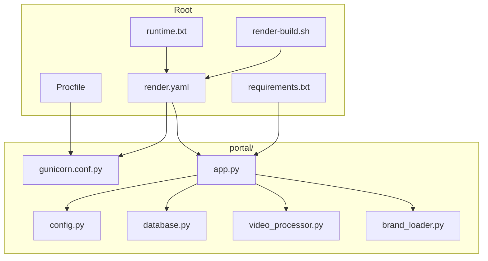
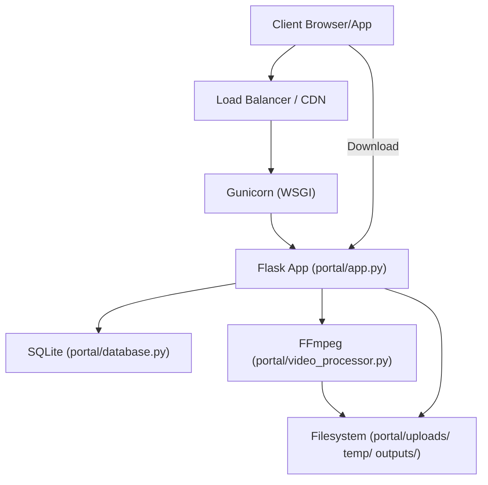
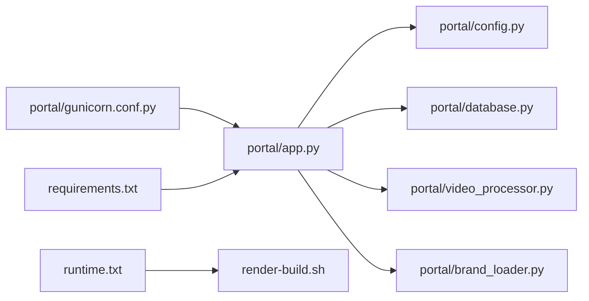
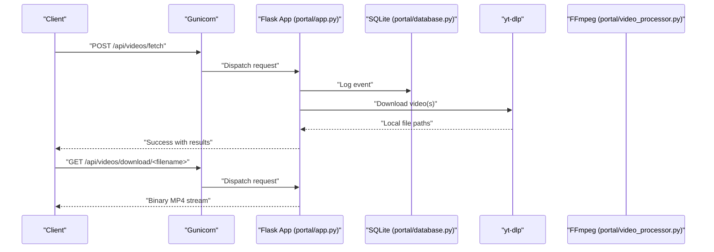
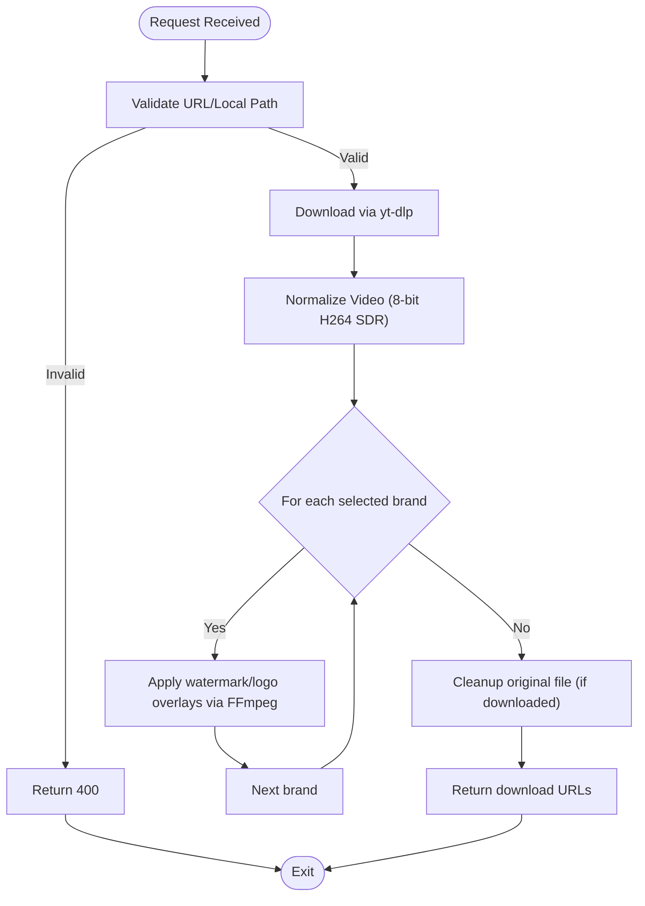

# Deployment and Operations

<cite>
**Referenced Files in This Document**
- [Procfile](file://Procfile)
- [render.yaml](file://render.yaml)
- [requirements.txt](file://requirements.txt)
- [runtime.txt](file://runtime.txt)
- [render-build.sh](file://render-build.sh)
- [portal/gunicorn.conf.py](file://portal/gunicorn.conf.py)
- [DEPLOYMENT.txt](file://DEPLOYMENT.txt)
- [portal/app.py](file://portal/app.py)
- [portal/config.py](file://portal/config.py)
- [portal/database.py](file://portal/database.py)
- [portal/video_processor.py](file://portal/video_processor.py)
- [portal/brand_loader.py](file://portal/brand_loader.py)
- [run_portal.py](file://run_portal.py)
- [demo_orchestrator.py](file://demo_orchestrator.py)
- [AGENTS.md](file://AGENTS.md)
</cite>

## Table of Contents
1. [Introduction](#introduction)
2. [Project Structure](#project-structure)
3. [Core Components](#core-components)
4. [Architecture Overview](#architecture-overview)
5. [Detailed Component Analysis](#detailed-component-analysis)
6. [Dependency Analysis](#dependency-analysis)
7. [Performance Considerations](#performance-considerations)
8. [Troubleshooting Guide](#troubleshooting-guide)
9. [Conclusion](#conclusion)
10. [Appendices](#appendices)

## Introduction
This document provides production-grade deployment and operations guidance for WatchTheFall Orchestrator v3. It covers Render deployment configuration, Gunicorn WSGI server setup, process management via Procfile, containerization approaches, environment preparation, runtime requirements, build and dependency management, deployment automation, monitoring and logging, maintenance procedures, scaling considerations, resource optimization, and troubleshooting. Guidance for different hosting platforms and cloud providers is included.

## Project Structure
The Orchestrator is a Flask-based service packaged under the portal/ directory. It exposes a Web API for downloading, processing, and serving videos, and serves a dashboard UI. The deployment artifacts and configuration live at the repository root and in portal/.

Key deployment-related files:
- Procfile: Defines the web process for Render.
- render.yaml: Render service definition, build/start commands, environment variables, and headers.
- requirements.txt: Python dependencies.
- runtime.txt: Python runtime version.
- render-build.sh: Installs FFmpeg during the Render build phase.
- portal/gunicorn.conf.py: Gunicorn configuration for Render.
- portal/app.py: Flask application entrypoint and API routes.
- portal/config.py: Paths, secrets, and limits.
- portal/database.py: SQLite-backed job/log/queue persistence.
- portal/video_processor.py: FFmpeg-based video processing engine.
- portal/brand_loader.py: Brand configuration loader.
- run_portal.py: Local development runner.
- demo_orchestrator.py: Demo pipeline for testing the orchestrator.
- AGENTS.md: Operational rules and pipeline constraints.

**Diagram sources**
- [Procfile](file://Procfile#L1-L1)
- [render.yaml](file://render.yaml#L1-L18)
- [requirements.txt](file://requirements.txt#L1-L18)
- [runtime.txt](file://runtime.txt#L1-L1)
- [render-build.sh](file://render-build.sh#L1-L5)
- [portal/gunicorn.conf.py](file://portal/gunicorn.conf.py#L1-L36)
- [portal/app.py](file://portal/app.py#L1-L120)
- [portal/config.py](file://portal/config.py#L1-L42)
- [portal/database.py](file://portal/database.py#L1-L204)
- [portal/video_processor.py](file://portal/video_processor.py#L1-L120)
- [portal/brand_loader.py](file://portal/brand_loader.py#L1-L59)

**Section sources**
- [Procfile](file://Procfile#L1-L1)
- [render.yaml](file://render.yaml#L1-L18)
- [requirements.txt](file://requirements.txt#L1-L18)
- [runtime.txt](file://runtime.txt#L1-L1)
- [render-build.sh](file://render-build.sh#L1-L5)
- [portal/gunicorn.conf.py](file://portal/gunicorn.conf.py#L1-L36)
- [portal/app.py](file://portal/app.py#L1-L120)
- [portal/config.py](file://portal/config.py#L1-L42)
- [portal/database.py](file://portal/database.py#L1-L204)
- [portal/video_processor.py](file://portal/video_processor.py#L1-L120)
- [portal/brand_loader.py](file://portal/brand_loader.py#L1-L59)
- [run_portal.py](file://run_portal.py#L1-L31)
- [demo_orchestrator.py](file://demo_orchestrator.py#L1-L109)
- [AGENTS.md](file://AGENTS.md#L1-L155)

## Core Components
- Flask application (portal/app.py): Provides API endpoints for video fetching, processing, and downloads, plus a dashboard UI.
- Gunicorn configuration (portal/gunicorn.conf.py): Sets bind address, worker count, timeouts, worker class, preload, and worker tmp dir for Render.
- Configuration (portal/config.py): Paths, secrets, FFmpeg binaries, upload limits, and directory creation.
- Database (portal/database.py): SQLite tables for jobs, logs, queue, and placeholder for store sync.
- Video processing (portal/video_processor.py): FFmpeg-based pipeline with watermark and logo overlays, normalization, and safe zone enforcement.
- Brand loader (portal/brand_loader.py): Loads brand configurations from brand_config.json.
- Runtime and build (runtime.txt, requirements.txt, render-build.sh): Pin Python version, declare dependencies, and install FFmpeg.
- Automation (render.yaml, Procfile): Define service type, build/start commands, environment variables, and process type.

**Section sources**
- [portal/app.py](file://portal/app.py#L1-L120)
- [portal/gunicorn.conf.py](file://portal/gunicorn.conf.py#L1-L36)
- [portal/config.py](file://portal/config.py#L1-L42)
- [portal/database.py](file://portal/database.py#L1-L204)
- [portal/video_processor.py](file://portal/video_processor.py#L1-L120)
- [portal/brand_loader.py](file://portal/brand_loader.py#L1-L59)
- [runtime.txt](file://runtime.txt#L1-L1)
- [requirements.txt](file://requirements.txt#L1-L18)
- [render-build.sh](file://render-build.sh#L1-L5)
- [render.yaml](file://render.yaml#L1-L18)
- [Procfile](file://Procfile#L1-L1)

## Architecture Overview
The system runs as a single-process Render web service. Gunicorn serves the Flask app, which coordinates video downloads via yt-dlp and processing via FFmpeg. Outputs are stored in a flat outputs/ directory and served via a download endpoint.

**Diagram sources**
- [portal/app.py](file://portal/app.py#L1-L120)
- [portal/database.py](file://portal/database.py#L1-L204)
- [portal/video_processor.py](file://portal/video_processor.py#L1-L120)
- [portal/gunicorn.conf.py](file://portal/gunicorn.conf.py#L1-L36)

## Detailed Component Analysis

### Render Deployment Configuration
- Service type: web.
- Environment: Python.
- Plan: free (adjust as needed).
- Build command: pip install -r requirements.txt followed by FFmpeg installation via render-build.sh.
- Start command: gunicorn -c portal/gunicorn.conf.py portal.app:app.
- Environment variables: PYTHON_VERSION, RENDER, ENV; optional platform-specific headers.
- Worker binding: PORT is required by Render; Gunicorn binds to 0.0.0.0:$PORT.

Operational notes:
- The start command aligns with Procfile.
- Gunicorn configuration sets worker class, preload, worker tmp dir, and worker connections for performance.
- FFmpeg is installed during build to ensure runtime availability.

**Section sources**
- [render.yaml](file://render.yaml#L1-L18)
- [Procfile](file://Procfile#L1-L1)
- [portal/gunicorn.conf.py](file://portal/gunicorn.conf.py#L1-L36)
- [render-build.sh](file://render-build.sh#L1-L5)

### Gunicorn WSGI Server Setup
Key settings:
- bind: 0.0.0.0:$PORT (Render requirement).
- workers: 1 (Render free tier memory constraint).
- timeout and graceful_timeout: 300 seconds for long-running FFmpeg conversions.
- keepalive: 5 seconds.
- worker_class: sync (default).
- loglevel: info.
- preload_app: True (preloads application before forking).
- worker_tmp_dir: /dev/shm (Render Pro).
- worker_connections: 1000 (throughput tuning).

These settings ensure predictable timeouts and efficient memory usage on Render’s constrained free tier while enabling performance improvements on Pro plans.

**Section sources**
- [portal/gunicorn.conf.py](file://portal/gunicorn.conf.py#L1-L36)

### Process Management via Procfile
- web: gunicorn -c portal/gunicorn.conf.py portal.app:app
- Aligns with render.yaml startCommand and Gunicorn configuration.

**Section sources**
- [Procfile](file://Procfile#L1-L1)
- [render.yaml](file://render.yaml#L7-L7)
- [portal/gunicorn.conf.py](file://portal/gunicorn.conf.py#L1-L36)

### Containerization Approach
While the project targets Render, it can be containerized:
- Base image: python:3.10-slim.
- Copy repository root into /app.
- Set working directory to /app.
- Install system dependencies (FFmpeg) using apt (similar to render-build.sh).
- Install Python dependencies from requirements.txt.
- Set runtime.txt equivalent via Dockerfile ARG or ENV.
- Entrypoint: gunicorn -c portal/gunicorn.conf.py portal.app:app.
- Expose port 8000 (or match PORT environment).

Benefits:
- Reproducible builds across environments.
- Easier migration to other platforms (Kubernetes, Cloud Run, ECS).
- Version pinning of Python and system libraries.

[No sources needed since this section provides general guidance]

### Environment Preparation and Runtime Requirements
- Python 3.10.6 (runtime.txt).
- FFmpeg installed and discoverable (render-build.sh).
- Write permissions to portal/uploads/, portal/outputs/, portal/temp/, portal/logs/.
- At least 2 GB free disk space.
- Secrets:
  - WTF_PORTAL_KEY: Shared key for authentication.
  - WTF_SECRET_KEY: Flask session secret.
  - Optional: FFMPEG_PATH, FFPROBE_PATH if not in PATH.

**Section sources**
- [runtime.txt](file://runtime.txt#L1-L1)
- [render-build.sh](file://render-build.sh#L1-L5)
- [portal/config.py](file://portal/config.py#L1-L42)
- [DEPLOYMENT.txt](file://DEPLOYMENT.txt#L64-L68)

### Build Process and Dependency Management
- Build command: ./render-build.sh && pip install -r requirements.txt.
- Dependencies include Flask, Gunicorn, yt-dlp, Pillow, NumPy, Mutagen, cryptography, psutil, websockets, brotli, PyYAML, and others.
- yt-dlp configured with specific format and retries for robust downloads.

**Section sources**
- [render.yaml](file://render.yaml#L6-L6)
- [render-build.sh](file://render-build.sh#L1-L5)
- [requirements.txt](file://requirements.txt#L1-L18)
- [portal/app.py](file://portal/app.py#L609-L784)

### Deployment Automation
- Render auto-deploys on pushes to the main branch.
- render.yaml controls build/start commands and environment variables.
- Procfile and Gunicorn configuration must remain consistent to avoid breaking autodetection.

**Section sources**
- [AGENTS.md](file://AGENTS.md#L115-L126)
- [render.yaml](file://render.yaml#L1-L18)
- [Procfile](file://Procfile#L1-L1)

### Monitoring Strategies
- Health checks:
  - Use the test endpoint to verify service availability.
  - Use debug endpoints for environment, FFmpeg, storage, and health status.
- Logging:
  - Gunicorn logs at info level.
  - Application logs written to portal/logs/ via database entries and print statements.
- Metrics:
  - Track request latency, error rates, and FFmpeg processing duration.
  - Monitor filesystem usage in outputs/ and temp/.

**Section sources**
- [portal/app.py](file://portal/app.py#L309-L323)
- [portal/app.py](file://portal/app.py#L55-L90)
- [portal/app.py](file://portal/app.py#L92-L116)
- [portal/app.py](file://portal/app.py#L118-L162)
- [portal/app.py](file://portal/app.py#L188-L214)
- [portal/config.py](file://portal/config.py#L18-L21)

### Logging Configuration
- Gunicorn loglevel set to info.
- Application writes structured events to SQLite logs table.
- Debug endpoints expose environment and storage diagnostics.

Recommendations:
- Integrate structured logging (JSON) for centralized log collection.
- Rotate logs in portal/logs/ and monitor retention policies.
- Consider adding request tracing and correlation IDs.

**Section sources**
- [portal/gunicorn.conf.py](file://portal/gunicorn.conf.py#L25-L26)
- [portal/database.py](file://portal/database.py#L152-L170)
- [portal/app.py](file://portal/app.py#L55-L90)
- [portal/app.py](file://portal/app.py#L118-L162)

### Maintenance Procedures
- Periodic cleanup of temp/ and outputs/ directories.
- Validate brand assets integrity via debug endpoints.
- Monitor database size and prune old logs/jobs if needed.
- Update brand_config.json and re-deploy when adding/removing brands.

**Section sources**
- [portal/config.py](file://portal/config.py#L35-L37)
- [portal/database.py](file://portal/database.py#L1-L204)
- [portal/app.py](file://portal/app.py#L164-L186)

### Scaling Considerations
- Current configuration: 1 worker with sync worker class.
- On Render Pro, worker_tmp_dir and worker_connections are tuned for throughput.
- Recommendations:
  - Keep 1 worker on free tier to stay within memory limits.
  - Upgrade to multiple workers only if CPU-bound and memory allows.
  - Offload heavy work to background tasks or separate services if latency-sensitive clients require responsiveness.

**Section sources**
- [portal/gunicorn.conf.py](file://portal/gunicorn.conf.py#L10-L11)
- [portal/gunicorn.conf.py](file://portal/gunicorn.conf.py#L23-L23)
- [portal/gunicorn.conf.py](file://portal/gunicorn.conf.py#L33-L36)

### Resource Optimization
- FFmpeg optimizations:
  - Threads, filter_threads, bufsize tuned for Render Pro.
  - Fast preset and AAC audio encoding.
- Storage:
  - Flat outputs/ directory simplifies retrieval.
  - Normalize videos to 8-bit H264 SDR to reduce metadata overhead.
- Concurrency:
  - Global conversion lock and sequential processing prevent memory spikes on free tier.

**Section sources**
- [portal/video_processor.py](file://portal/video_processor.py#L368-L404)
- [portal/video_processor.py](file://portal/video_processor.py#L21-L68)
- [portal/app.py](file://portal/app.py#L216-L218)

### Troubleshooting Common Deployment Issues
- FFmpeg not found:
  - Ensure render-build.sh installs FFmpeg and binaries are in PATH.
  - Set FFMPEG_PATH and FFPROBE_PATH via environment variables if needed.
- Free tier timeouts:
  - Increase Gunicorn timeouts and ensure FFmpeg operations complete within 300 seconds.
- Memory pressure:
  - Keep 1 worker and process sequentially to avoid crashes.
- Authentication failures:
  - Verify WTF_PORTAL_KEY and WTF_SECRET_KEY are set and correct.
- Download failures:
  - Check yt-dlp configuration and network connectivity; review debug endpoints for FFmpeg and storage status.

**Section sources**
- [render-build.sh](file://render-build.sh#L1-L5)
- [portal/gunicorn.conf.py](file://portal/gunicorn.conf.py#L13-L17)
- [portal/config.py](file://portal/config.py#L26-L32)
- [portal/app.py](file://portal/app.py#L92-L116)
- [portal/app.py](file://portal/app.py#L118-L162)
- [portal/app.py](file://portal/app.py#L609-L784)

### Hosting Platforms and Cloud Providers
- Render (recommended):
  - Use render.yaml, Procfile, and portal/gunicorn.conf.py as-is.
  - Adjust plan for performance needs.
- Generic Linux with systemd:
  - Create a service unit that executes gunicorn with portal/gunicorn.conf.py.
  - Ensure FFmpeg and Python 3.10.6 are installed.
- Nginx/Apache:
  - Proxy /portal and /api to the Flask app bound to localhost.
- Kubernetes:
  - Deploy a single-replica web deployment with persistent volumes for logs/outputs if needed.
  - Use readiness probes against the test endpoint.

**Section sources**
- [render.yaml](file://render.yaml#L1-L18)
- [Procfile](file://Procfile#L1-L1)
- [portal/gunicorn.conf.py](file://portal/gunicorn.conf.py#L1-L36)
- [DEPLOYMENT.txt](file://DEPLOYMENT.txt#L109-L149)

## Dependency Analysis
The Flask app depends on configuration, database, and video processing modules. Gunicorn configuration ties into the app module. Requirements.txt enumerates Python dependencies. Runtime and build scripts define system-level prerequisites.

**Diagram sources**
- [portal/gunicorn.conf.py](file://portal/gunicorn.conf.py#L1-L36)
- [portal/app.py](file://portal/app.py#L1-L120)
- [portal/config.py](file://portal/config.py#L1-L42)
- [portal/database.py](file://portal/database.py#L1-L204)
- [portal/video_processor.py](file://portal/video_processor.py#L1-L120)
- [portal/brand_loader.py](file://portal/brand_loader.py#L1-L59)
- [requirements.txt](file://requirements.txt#L1-L18)
- [runtime.txt](file://runtime.txt#L1-L1)
- [render-build.sh](file://render-build.sh#L1-L5)

**Section sources**
- [portal/gunicorn.conf.py](file://portal/gunicorn.conf.py#L1-L36)
- [portal/app.py](file://portal/app.py#L1-L120)
- [portal/config.py](file://portal/config.py#L1-L42)
- [portal/database.py](file://portal/database.py#L1-L204)
- [portal/video_processor.py](file://portal/video_processor.py#L1-L120)
- [portal/brand_loader.py](file://portal/brand_loader.py#L1-L59)
- [requirements.txt](file://requirements.txt#L1-L18)
- [runtime.txt](file://runtime.txt#L1-L1)
- [render-build.sh](file://render-build.sh#L1-L5)

## Performance Considerations
- Worker model: sync with 1 worker on free tier; increase cautiously on Pro.
- Preloading reduces cold-start overhead.
- Worker tmp dir (/dev/shm) improves I/O performance on Pro.
- FFmpeg tuning: threads, filter_threads, bufsize, preset, and faststart optimize throughput and latency.
- Sequential processing prevents memory exhaustion on constrained environments.

**Section sources**
- [portal/gunicorn.conf.py](file://portal/gunicorn.conf.py#L10-L11)
- [portal/gunicorn.conf.py](file://portal/gunicorn.conf.py#L28-L36)
- [portal/video_processor.py](file://portal/video_processor.py#L368-L404)

## Troubleshooting Guide
- Verify service health:
  - Use the test endpoint to confirm the portal is online.
  - Use debug endpoints to inspect environment, FFmpeg, storage, and health.
- Authentication:
  - Confirm WTF_PORTAL_KEY and WTF_SECRET_KEY are set.
- FFmpeg:
  - Ensure FFmpeg is installed and accessible; check version and existence via debug endpoint.
- Storage:
  - Confirm portal/uploads/, portal/outputs/, portal/temp/, portal/logs/ are writable.
- Downloads:
  - Validate that output files exist in outputs/ and are served via the download endpoint.

**Section sources**
- [portal/app.py](file://portal/app.py#L309-L323)
- [portal/app.py](file://portal/app.py#L55-L90)
- [portal/app.py](file://portal/app.py#L92-L116)
- [portal/app.py](file://portal/app.py#L118-L162)
- [portal/app.py](file://portal/app.py#L188-L214)
- [portal/config.py](file://portal/config.py#L18-L21)
- [portal/config.py](file://portal/config.py#L39-L41)

## Conclusion
WatchTheFall Orchestrator v3 is designed for straightforward deployment on Render with minimal configuration. The provided Gunicorn configuration, Procfile, and Render YAML ensure reliable operation. By adhering to the established pipeline and maintenance procedures, teams can operate the service reliably across environments while optimizing performance and managing resources effectively.

## Appendices

### API Workflow: Video Fetch and Download

**Diagram sources**
- [portal/app.py](file://portal/app.py#L609-L784)
- [portal/database.py](file://portal/database.py#L152-L170)
- [portal/video_processor.py](file://portal/video_processor.py#L1-L120)

### Pipeline Flow: Brand Processing

**Diagram sources**
- [portal/app.py](file://portal/app.py#L329-L608)
- [portal/video_processor.py](file://portal/video_processor.py#L21-L68)
- [portal/video_processor.py](file://portal/video_processor.py#L315-L404)