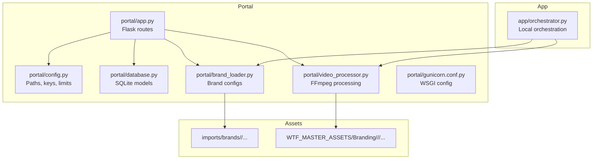
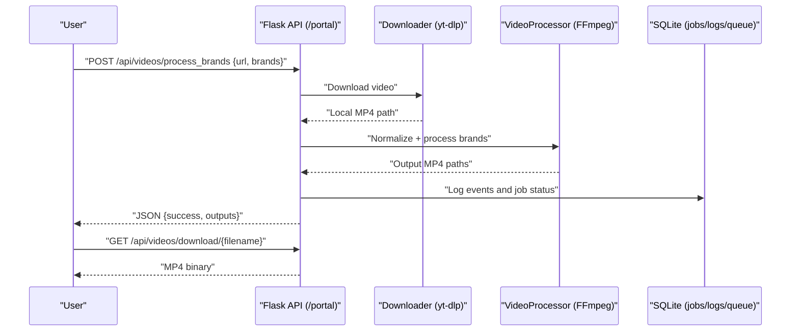
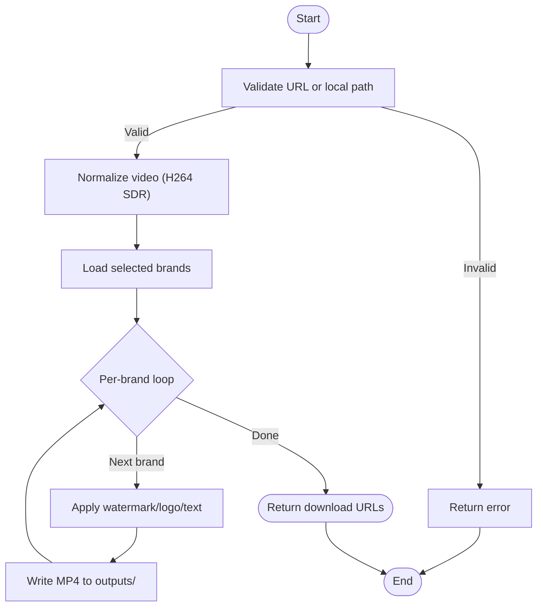
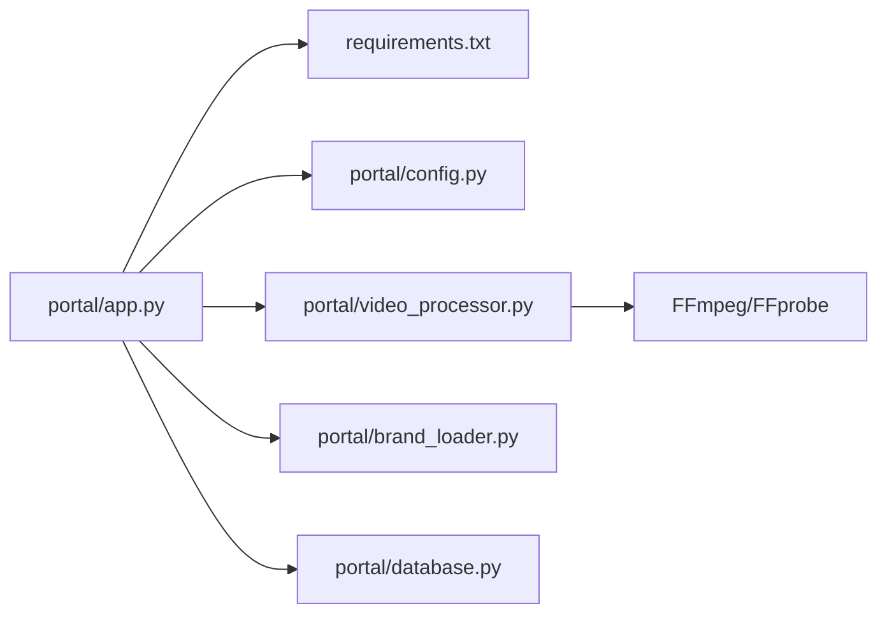

# Getting Started

<cite>
**Referenced Files in This Document**
- [requirements.txt](file://requirements.txt)
- [DEPLOYMENT.txt](file://DEPLOYMENT.txt)
- [run_portal.py](file://run_portal.py)
- [portal/app.py](file://portal/app.py)
- [portal/config.py](file://portal/config.py)
- [portal/video_processor.py](file://portal/video_processor.py)
- [portal/brand_loader.py](file://portal/brand_loader.py)
- [portal/database.py](file://portal/database.py)
- [portal/gunicorn.conf.py](file://portal/gunicorn.conf.py)
- [render.yaml](file://render.yaml)
- [Procfile](file://Procfile)
- [AGENTS.md](file://AGENTS.md)
- [demo_orchestrator.py](file://demo_orchestrator.py)
</cite>

## Table of Contents
1. [Introduction](#introduction)
2. [Project Structure](#project-structure)
3. [Core Components](#core-components)
4. [Architecture Overview](#architecture-overview)
5. [Detailed Component Analysis](#detailed-component-analysis)
6. [Dependency Analysis](#dependency-analysis)
7. [Performance Considerations](#performance-considerations)
8. [Troubleshooting Guide](#troubleshooting-guide)
9. [Conclusion](#conclusion)
10. [Appendices](#appendices)

## Introduction
This guide helps you set up and run WatchTheFall Orchestrator v3 locally, access the web dashboard, and perform your first multi-brand video processing operation. It covers prerequisites, installation, environment setup, configuration, basic usage, and verification steps. The system provides a Flask-based web portal for uploading or fetching videos, selecting brands, and exporting processed MP4s optimized for social platforms.

## Project Structure
The project is organized around two primary parts:
- Portal: A Flask web application serving the dashboard and APIs for video processing.
- App: A local orchestration module for advanced workflows and demos.

Key directories and roles:
- portal/: Flask application, routes, configuration, database, and static assets
- app/: Orchestration and processing utilities for local runs
- imports/brands/: Brand templates and assets used by the portal
- WTF_MASTER_ASSETS/Branding/: Master assets (watermarks/logos) consumed by the processor
- cookies/: Optional cookie configuration for platform access
- outputs/, uploads/, temp/, logs/: Working directories managed by the portal

**Diagram sources**
- [portal/app.py](file://portal/app.py#L1-L120)
- [portal/config.py](file://portal/config.py#L1-L42)
- [portal/video_processor.py](file://portal/video_processor.py#L1-L120)
- [portal/brand_loader.py](file://portal/brand_loader.py#L1-L59)
- [portal/database.py](file://portal/database.py#L1-L120)
- [portal/gunicorn.conf.py](file://portal/gunicorn.conf.py#L1-L36)
- [app/orchestrator.py](file://app/orchestrator.py#L1-L120)

**Section sources**
- [AGENTS.md](file://AGENTS.md#L22-L44)
- [portal/config.py](file://portal/config.py#L1-L42)

## Core Components
- Flask Portal: Provides endpoints for fetching videos, processing with selected brands, downloading outputs, and viewing logs/queue status.
- Video Processor: Applies brand-specific watermarks/logos and exports MP4s using FFmpeg.
- Brand Loader: Loads brand configurations and templates from the portal’s brand directory.
- Database: Tracks jobs, logs, queue, and per-brand settings.
- Configuration: Centralizes paths, secrets, limits, and FFmpeg binaries.

**Section sources**
- [portal/app.py](file://portal/app.py#L225-L324)
- [portal/video_processor.py](file://portal/video_processor.py#L71-L145)
- [portal/brand_loader.py](file://portal/brand_loader.py#L48-L59)
- [portal/database.py](file://portal/database.py#L9-L94)
- [portal/config.py](file://portal/config.py#L1-L42)

## Architecture Overview
The portal exposes a REST-like API and serves a dashboard. The processing pipeline normalizes videos, applies brand-specific overlays, and exports MP4s. The orchestration module supports local multi-brand workflows.

**Diagram sources**
- [portal/app.py](file://portal/app.py#L329-L627)
- [portal/video_processor.py](file://portal/video_processor.py#L21-L68)
- [portal/database.py](file://portal/database.py#L102-L158)

## Detailed Component Analysis

### Local Setup and Environment
- Prerequisites
  - Python 3.8+ (Python 3.10 recommended)
  - FFmpeg installed and available in PATH
  - Git (optional, for cloning)
- Install dependencies
  - Use the provided requirements file to install Python packages.
- Environment variables
  - Set secrets and FFmpeg path via environment variables as documented in the deployment guide.
- Directory permissions
  - Ensure write access to portal/uploads, portal/outputs, portal/temp, portal/logs, and portal/db.

Verification steps
- Confirm FFmpeg availability and version via the debug endpoint.
- Check storage directories and write permissions.
- Verify brand assets are loaded.

**Section sources**
- [DEPLOYMENT.txt](file://DEPLOYMENT.txt#L64-L69)
- [DEPLOYMENT.txt](file://DEPLOYMENT.txt#L88-L93)
- [portal/app.py](file://portal/app.py#L92-L116)
- [portal/app.py](file://portal/app.py#L118-L162)
- [portal/app.py](file://portal/app.py#L164-L186)
- [portal/config.py](file://portal/config.py#L26-L37)

### Running Locally
- Option A: Direct Flask development server
  - Start the runner script to launch the app on localhost:5000.
  - Access the portal dashboard and test endpoints.
- Option B: Production-style with Gunicorn
  - Use the provided Gunicorn configuration and start command.
  - Useful for testing timeouts and worker behavior similar to Render.

**Section sources**
- [run_portal.py](file://run_portal.py#L12-L30)
- [portal/gunicorn.conf.py](file://portal/gunicorn.conf.py#L1-L36)
- [render.yaml](file://render.yaml#L6-L7)
- [Procfile](file://Procfile#L1-L1)

### First Multi-Brand Video Processing Workflow
- Prepare a source
  - Provide a public URL or a local file path.
- Select brands
  - Choose one or more brands from the available list.
- Submit processing
  - Send a request to the branded processing endpoint with the URL and selected brands.
- Monitor progress
  - Use the returned download URLs to retrieve outputs after completion.
- Download results
  - Fetch each processed MP4 via the download endpoint.

**Diagram sources**
- [portal/app.py](file://portal/app.py#L329-L627)
- [portal/video_processor.py](file://portal/video_processor.py#L21-L68)

**Section sources**
- [portal/app.py](file://portal/app.py#L329-L627)
- [portal/video_processor.py](file://portal/video_processor.py#L71-L145)

### Configuration and Brand Templates
- Brand configurations
  - Brands are loaded from the portal’s brand configuration file.
- Per-brand settings
  - The database persists watermark/logo/text settings per brand.
- Master assets
  - Watermarks/logos are resolved from master asset directories based on orientation.

**Section sources**
- [portal/brand_loader.py](file://portal/brand_loader.py#L48-L59)
- [portal/database.py](file://portal/database.py#L67-L90)
- [portal/video_processor.py](file://portal/video_processor.py#L77-L81)

### Orchestration Module (Local)
- The orchestration module coordinates:
  - Crop UI (interactive phone editing)
  - Logo editor (positioning)
  - Multi-brand export
- It prints a summary of stages, outputs, and errors.

**Section sources**
- [app/orchestrator.py](file://app/orchestrator.py#L12-L120)
- [demo_orchestrator.py](file://demo_orchestrator.py#L13-L109)

## Dependency Analysis
External libraries and tools:
- Python packages: Flask, Jinja2, Werkzeug, requests, Pillow, PyYAML, numpy, mutagen, pycryptodomex, yt-dlp, websockets, brotli, psutil, pyjwt, cryptography, gunicorn.
- Media tools: FFmpeg and FFprobe for video processing.

**Diagram sources**
- [portal/app.py](file://portal/app.py#L1-L50)
- [requirements.txt](file://requirements.txt#L1-L18)
- [portal/config.py](file://portal/config.py#L26-L28)
- [portal/video_processor.py](file://portal/video_processor.py#L12-L18)

**Section sources**
- [requirements.txt](file://requirements.txt#L1-L18)
- [portal/video_processor.py](file://portal/video_processor.py#L12-L18)

## Performance Considerations
- Worker configuration
  - On Render free tier, a single synchronous worker is used with increased timeouts to accommodate slower FFmpeg conversions.
- Resource constraints
  - Limit concurrent processing to avoid memory pressure on constrained environments.
- File handling
  - Keep uploads minimal and enable cleanup of temporary files.

**Section sources**
- [DEPLOYMENT.txt](file://DEPLOYMENT.txt#L83-L86)
- [portal/gunicorn.conf.py](file://portal/gunicorn.conf.py#L10-L17)

## Troubleshooting Guide
Common issues and resolutions:
- FFmpeg not found
  - Ensure FFmpeg and FFprobe are installed and in PATH, or set the FFmpeg path via environment variables.
  - Use the debug endpoint to verify detection and version.
- No video stream detected
  - Some platforms may serve audio-only content. Retry with a different source.
- Permission denied on directories
  - Verify write permissions for uploads, outputs, temp, logs, and database directory.
- Brand assets missing
  - Confirm brand configuration file and master asset directories exist and are readable.
- CORS or reverse proxy
  - When behind a proxy, ensure paths under /portal and /api are routed correctly.

**Section sources**
- [portal/app.py](file://portal/app.py#L92-L116)
- [portal/app.py](file://portal/app.py#L188-L214)
- [portal/app.py](file://portal/app.py#L570-L583)
- [portal/config.py](file://portal/config.py#L26-L37)

## Conclusion
You now have the essentials to install, configure, and run WatchTheFall Orchestrator v3 locally, access the web dashboard, and process videos across multiple brands. Use the provided endpoints and directories, verify environment readiness, and leverage the debug endpoints to troubleshoot. For production, follow the deployment steps and environment variable guidance.

## Appendices

### Quick Reference: Endpoints and Paths
- Dashboard: http://localhost:5000/portal/
- Test endpoint: http://localhost:5000/portal/test
- API root: lists available endpoints
- Processing endpoint: POST /api/videos/process_brands
- Fetch endpoint: POST /api/videos/fetch
- Download endpoint: GET /api/videos/download/{filename}
- Brand list: GET /api/brands/list
- Debug endpoints: /__debug_* for FFmpeg, storage, brands, health

**Section sources**
- [DEPLOYMENT.txt](file://DEPLOYMENT.txt#L5-L36)
- [portal/app.py](file://portal/app.py#L225-L324)