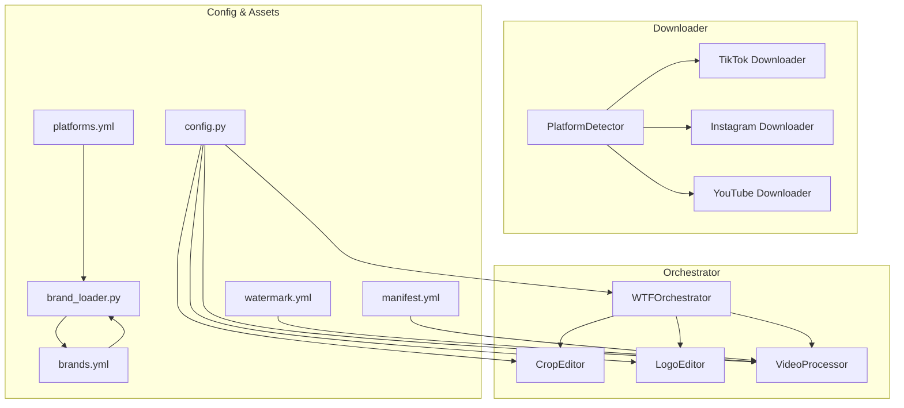
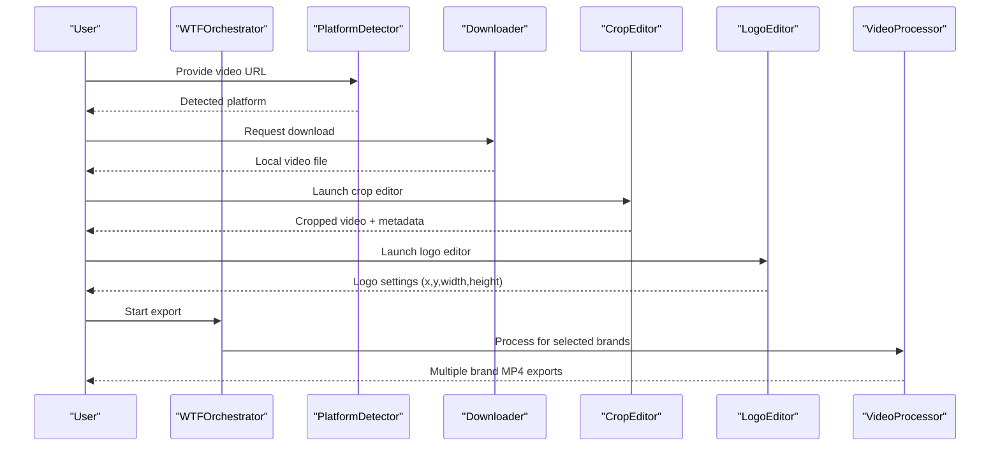
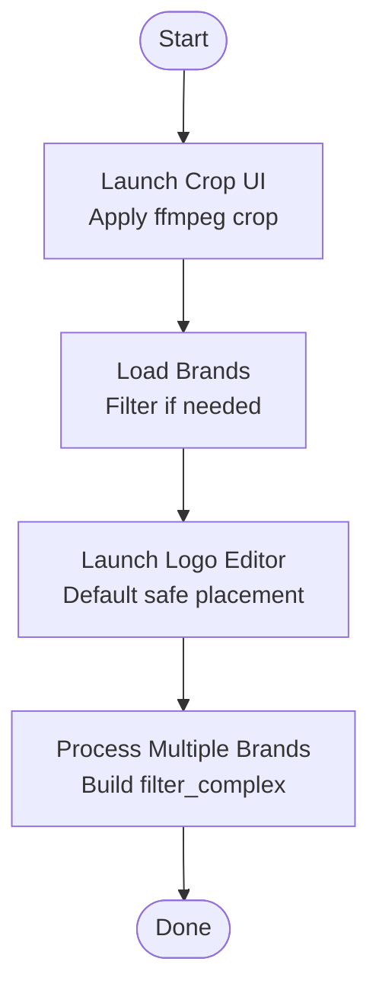
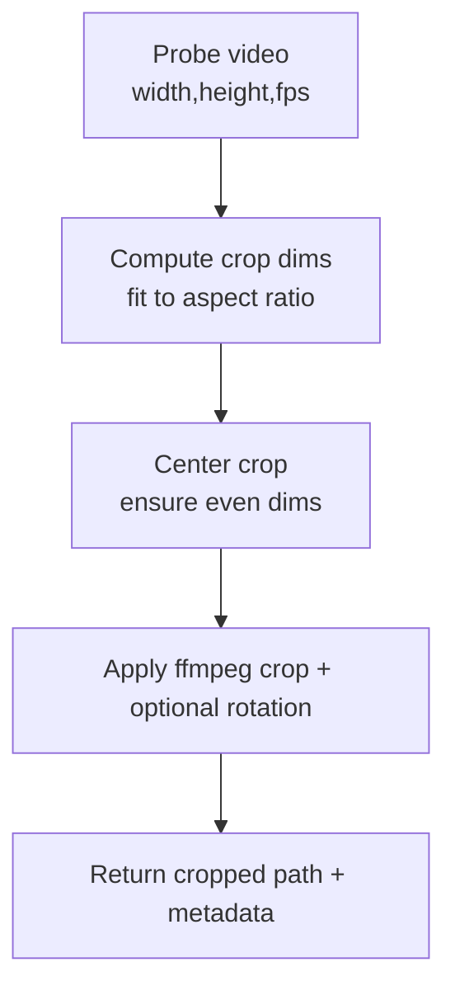
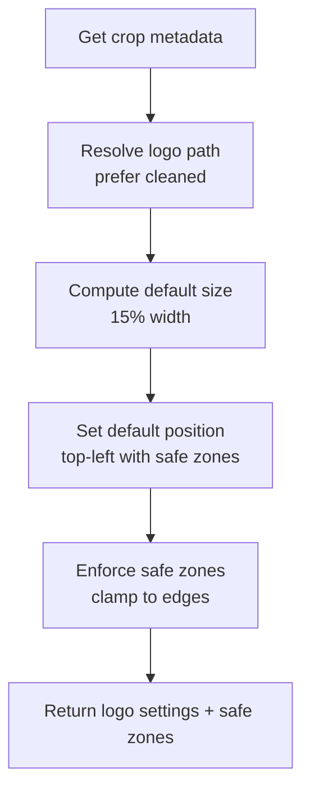
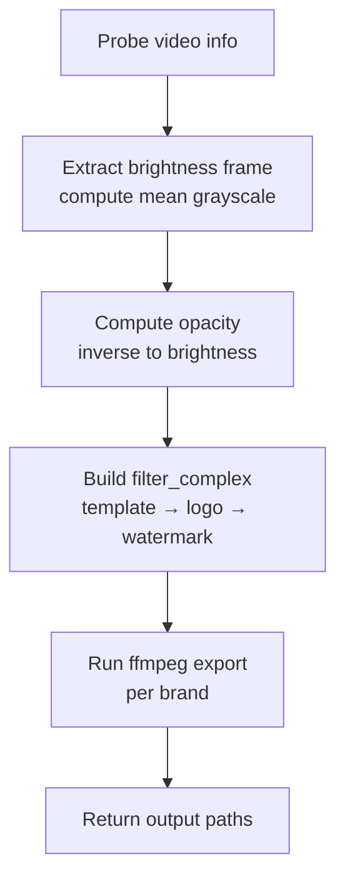
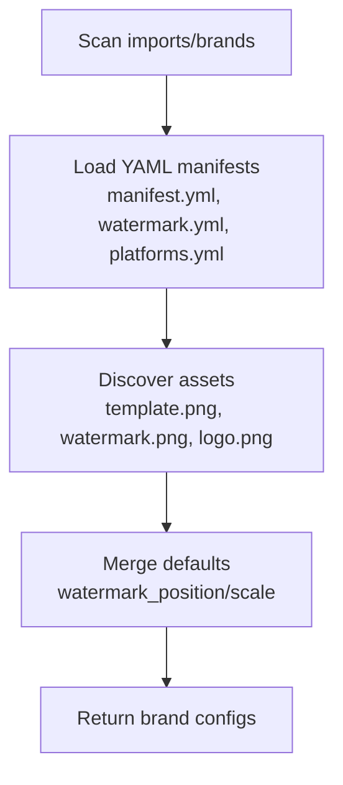
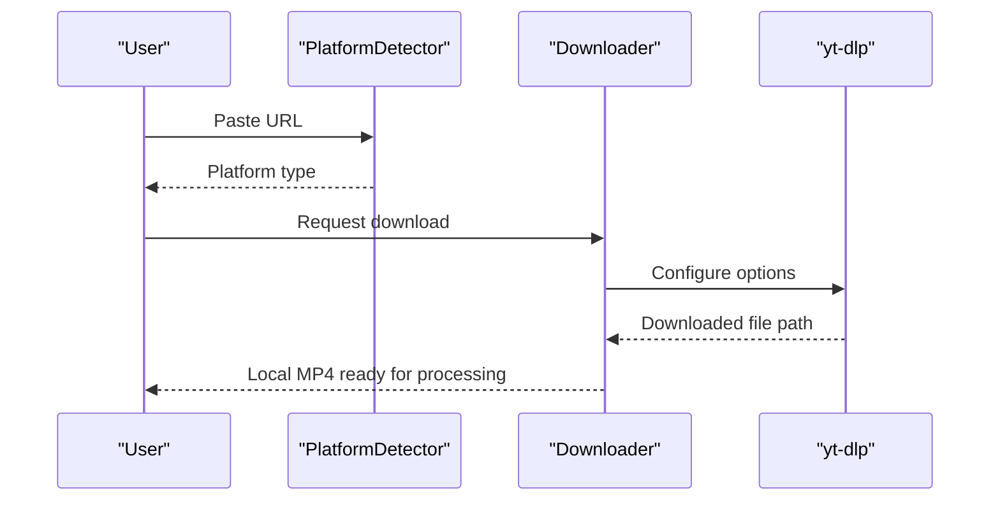
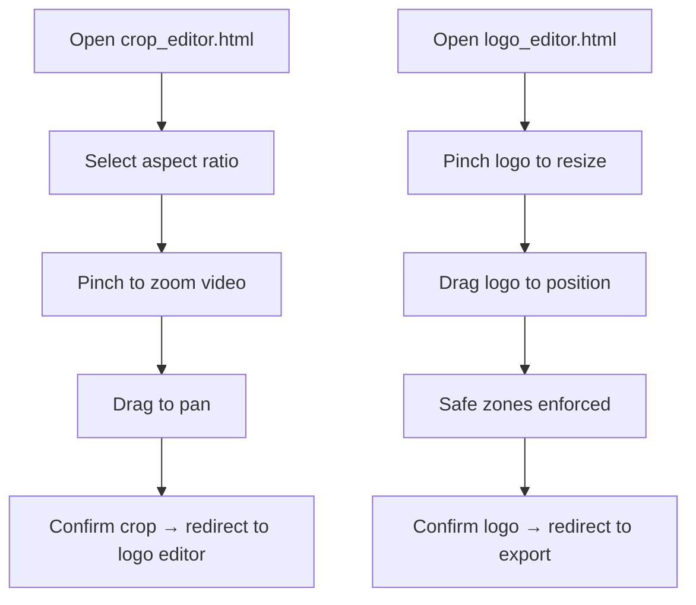
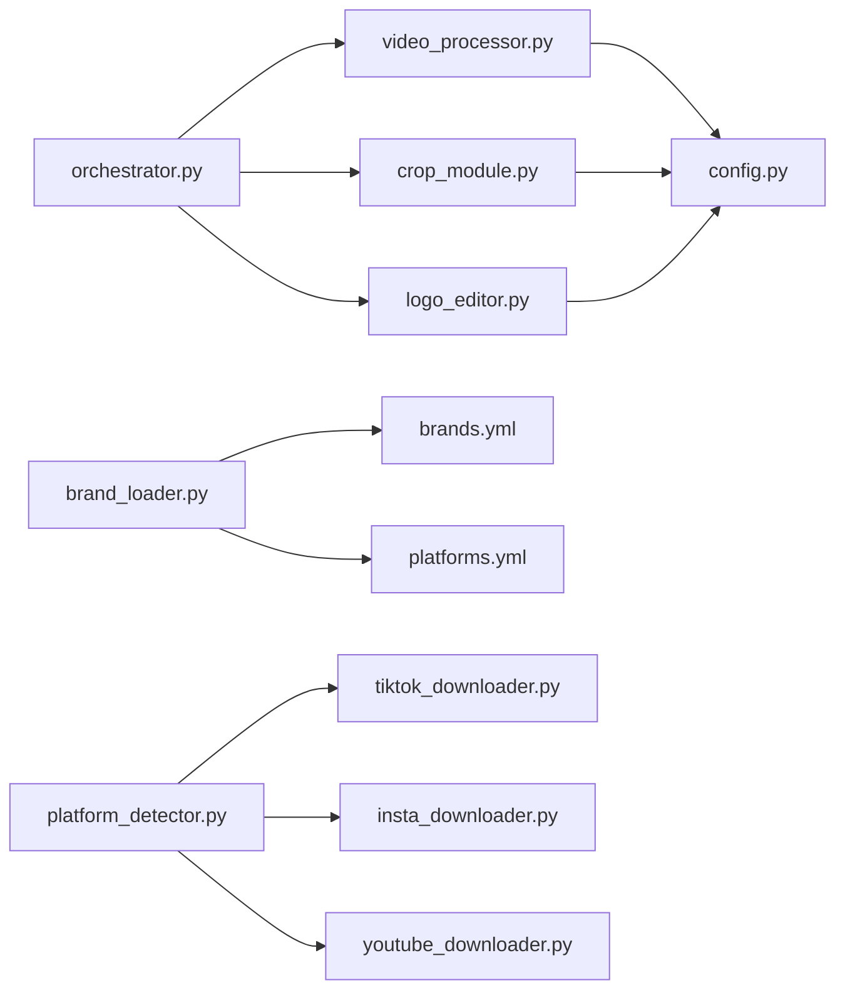

# Core Features

<cite>
**Referenced Files in This Document**
- [orchestrator.py](file://app/orchestrator.py)
- [video_processor.py](file://app/video_processor.py)
- [crop_module.py](file://app/crop_module.py)
- [logo_editor.py](file://app/logo_editor.py)
- [brand_loader.py](file://app/brand_loader.py)
- [platform_detector.py](file://downloader/platform_detector.py)
- [tiktok_downloader.py](file://downloader/tiktok_downloader.py)
- [insta_downloader.py](file://downloader/insta_downloader.py)
- [youtube_downloader.py](file://downloader/youtube_downloader.py)
- [config.py](file://app/config.py)
- [crop_editor.html](file://app/ui/crop_editor.html)
- [logo_editor.html](file://app/ui/logo_editor.html)
- [brands.yml](file://imports/brands/wtf_orchestrator/brands.yml)
- [platforms.yml](file://imports/brands/wtf_orchestrator/platforms.yml)
- [watermark.yml](file://imports/brands/wtf_orchestrator/watermark.yml)
- [manifest.yml](file://imports/brands/wtf_orchestrator/manifest.yml)
</cite>

## Table of Contents
1. [Introduction](#introduction)
2. [Project Structure](#project-structure)
3. [Core Components](#core-components)
4. [Architecture Overview](#architecture-overview)
5. [Detailed Component Analysis](#detailed-component-analysis)
6. [Dependency Analysis](#dependency-analysis)
7. [Performance Considerations](#performance-considerations)
8. [Troubleshooting Guide](#troubleshooting-guide)
9. [Conclusion](#conclusion)
10. [Appendices](#appendices)

## Introduction
WatchTheFall Orchestrator v3 automates the creation of 25+ brand-specific video variants from a single raw input. It integrates social platform detection and downloads, performs interactive mobile-optimized editing for crops and logos, and applies adaptive watermarking based on video brightness. The system supports batch processing across multiple brands and platforms, ensuring each variant meets platform-specific constraints and branding guidelines.

## Project Structure
The Orchestrator is organized around a modular pipeline:
- Orchestrator coordinates the stages: download → crop → logo edit → multi-brand export
- Video Processor handles overlays, templates, logos, and adaptive watermarking
- Crop Editor and Logo Editor provide mobile-friendly UIs for interactive adjustments
- Brand Loader discovers brand assets and configurations
- Downloader modules integrate with yt-dlp for TikTok, Instagram, and YouTube
- Platform configuration defines aspect ratios, constraints, and filename patterns per platform

**Diagram sources**
- [orchestrator.py](file://app/orchestrator.py#L12-L172)
- [crop_module.py](file://app/crop_module.py#L11-L193)
- [logo_editor.py](file://app/logo_editor.py#L11-L132)
- [video_processor.py](file://app/video_processor.py#L13-L273)
- [brand_loader.py](file://app/brand_loader.py#L168-L183)
- [platform_detector.py](file://downloader/platform_detector.py#L12-L41)
- [tiktok_downloader.py](file://downloader/tiktok_downloader.py#L12-L47)
- [insta_downloader.py](file://downloader/insta_downloader.py#L11-L56)
- [youtube_downloader.py](file://downloader/youtube_downloader.py#L11-L46)
- [config.py](file://app/config.py#L1-L18)
- [brands.yml](file://imports/brands/wtf_orchestrator/brands.yml#L1-L423)
- [platforms.yml](file://imports/brands/wtf_orchestrator/platforms.yml#L1-L267)
- [watermark.yml](file://imports/brands/wtf_orchestrator/watermark.yml#L1-L3)
- [manifest.yml](file://imports/brands/wtf_orchestrator/manifest.yml#L1-L4)

**Section sources**
- [orchestrator.py](file://app/orchestrator.py#L12-L172)
- [config.py](file://app/config.py#L1-L18)

## Core Components
- Orchestrator: Central controller that sequences crop, brand loading, logo editor, and multi-brand export
- Crop Editor: Calculates crop geometry and applies ffmpeg-based cropping with aspect ratio support
- Logo Editor: Provides default logo placement with safe zones and enforces constraints
- Video Processor: Builds overlay filters for template, logo, and adaptive watermark; exports per brand
- Brand Loader: Discovers brand directories and merges YAML manifests and asset paths
- Platform Detector and Downloaders: Detects platform from URL and downloads using yt-dlp with platform-specific options
- UI: Mobile-optimized HTML editors for crop and logo adjustments

Key capabilities:
- Social media integration: TikTok, Instagram, YouTube, Twitter/X, Facebook, LinkedIn, Reddit (with platform-specific constraints)
- Batch processing: Export multiple brands in one run
- Interactive crop editing: Web-based pinch-to-zoom and drag UI
- Intelligent logo positioning: Safe zones and default top-left placement
- Adaptive watermarking: Brightness-based opacity with configurable scale and position

**Section sources**
- [orchestrator.py](file://app/orchestrator.py#L29-L115)
- [crop_module.py](file://app/crop_module.py#L81-L157)
- [logo_editor.py](file://app/logo_editor.py#L57-L114)
- [video_processor.py](file://app/video_processor.py#L18-L107)
- [brand_loader.py](file://app/brand_loader.py#L168-L183)
- [platform_detector.py](file://downloader/platform_detector.py#L12-L41)
- [tiktok_downloader.py](file://downloader/tiktok_downloader.py#L12-L47)
- [insta_downloader.py](file://downloader/insta_downloader.py#L11-L56)
- [youtube_downloader.py](file://downloader/youtube_downloader.py#L11-L46)
- [crop_editor.html](file://app/ui/crop_editor.html#L130-L258)
- [logo_editor.html](file://app/ui/logo_editor.html#L107-L251)

## Architecture Overview
The Orchestrator coordinates four stages:
1. Download: Detect platform and download raw video
2. Crop: Interactive crop with mobile UI and ffmpeg
3. Logo Edit: Interactive logo placement with safe zones
4. Export: Multi-brand processing with overlays and adaptive watermarking

**Diagram sources**
- [platform_detector.py](file://downloader/platform_detector.py#L12-L41)
- [tiktok_downloader.py](file://downloader/tiktok_downloader.py#L12-L47)
- [insta_downloader.py](file://downloader/insta_downloader.py#L11-L56)
- [youtube_downloader.py](file://downloader/youtube_downloader.py#L11-L46)
- [crop_module.py](file://app/crop_module.py#L174-L192)
- [logo_editor.py](file://app/logo_editor.py#L117-L131)
- [orchestrator.py](file://app/orchestrator.py#L29-L115)
- [video_processor.py](file://app/video_processor.py#L256-L273)

## Detailed Component Analysis

### Orchestrator
The Orchestrator composes the pipeline:
- Stage 1: Crop with aspect ratio selection and metadata capture
- Stage 2: Load brands (all or filtered) from configuration
- Stage 3: Launch logo editor using the first brand’s assets as reference
- Stage 4: Export to multiple brands with overlays and adaptive watermarking

**Diagram sources**
- [orchestrator.py](file://app/orchestrator.py#L29-L115)

**Section sources**
- [orchestrator.py](file://app/orchestrator.py#L29-L115)

### Crop Editor
- Determines crop dimensions based on aspect ratio and video resolution
- Generates centered crop settings and applies ffmpeg filters
- Returns metadata for downstream processors

**Diagram sources**
- [crop_module.py](file://app/crop_module.py#L33-L157)

**Section sources**
- [crop_module.py](file://app/crop_module.py#L61-L157)

### Logo Editor
- Selects cleaned logo if available, otherwise falls back to original
- Computes default logo size (15% of video width) and top-left position within safe zones
- Enforces safe zones to prevent off-screen placement

**Diagram sources**
- [logo_editor.py](file://app/logo_editor.py#L38-L114)

**Section sources**
- [logo_editor.py](file://app/logo_editor.py#L38-L114)

### Video Processor
- Probes video for dimensions and duration
- Calculates average brightness from a sampled frame and adapts watermark opacity inversely to brightness
- Builds ffmpeg filter_complex with:
  - Template scaling and overlay
  - Logo overlay with provided settings
  - Adaptive watermark with configurable scale and position
- Exports per brand into brand-named subfolders

**Diagram sources**
- [video_processor.py](file://app/video_processor.py#L30-L253)

**Section sources**
- [video_processor.py](file://app/video_processor.py#L52-L107)
- [video_processor.py](file://app/video_processor.py#L109-L178)
- [video_processor.py](file://app/video_processor.py#L180-L253)

### Brand Loader and Configurations
- Scans brand directories and merges YAML manifests and asset paths
- Supports top-level brands.yml for centralized configuration
- Reads platform-specific manifests and watermark defaults

**Diagram sources**
- [brand_loader.py](file://app/brand_loader.py#L35-L129)
- [brands.yml](file://imports/brands/wtf_orchestrator/brands.yml#L1-L423)
- [platforms.yml](file://imports/brands/wtf_orchestrator/platforms.yml#L1-L267)
- [watermark.yml](file://imports/brands/wtf_orchestrator/watermark.yml#L1-L3)
- [manifest.yml](file://imports/brands/wtf_orchestrator/manifest.yml#L1-L4)

**Section sources**
- [brand_loader.py](file://app/brand_loader.py#L168-L183)
- [brands.yml](file://imports/brands/wtf_orchestrator/brands.yml#L1-L423)
- [platforms.yml](file://imports/brands/wtf_orchestrator/platforms.yml#L1-L267)
- [watermark.yml](file://imports/brands/wtf_orchestrator/watermark.yml#L1-L3)
- [manifest.yml](file://imports/brands/wtf_orchestrator/manifest.yml#L1-L4)

### Platform Detection and Download Workflows
- PlatformDetector identifies TikTok, Instagram, Twitter/X, and YouTube URLs
- Downloaders configure yt-dlp with platform-specific options and retries
- Outputs standardized local MP4 files for processing

**Diagram sources**
- [platform_detector.py](file://downloader/platform_detector.py#L12-L41)
- [tiktok_downloader.py](file://downloader/tiktok_downloader.py#L27-L35)
- [insta_downloader.py](file://downloader/insta_downloader.py#L26-L43)
- [youtube_downloader.py](file://downloader/youtube_downloader.py#L26-L34)

**Section sources**
- [platform_detector.py](file://downloader/platform_detector.py#L12-L41)
- [tiktok_downloader.py](file://downloader/tiktok_downloader.py#L12-L47)
- [insta_downloader.py](file://downloader/insta_downloader.py#L11-L56)
- [youtube_downloader.py](file://downloader/youtube_downloader.py#L11-L46)

### Interactive Crop and Logo Editors (Mobile-Optimized UI)
- Crop Editor: Pinch-to-zoom, drag, aspect ratio selection, confirm and proceed
- Logo Editor: Pinch-to-resize logo, drag to position, enforce safe zones, confirm and proceed

**Diagram sources**
- [crop_editor.html](file://app/ui/crop_editor.html#L130-L258)
- [logo_editor.html](file://app/ui/logo_editor.html#L107-L251)

**Section sources**
- [crop_editor.html](file://app/ui/crop_editor.html#L130-L258)
- [logo_editor.html](file://app/ui/logo_editor.html#L107-L251)

## Dependency Analysis
- Orchestrator depends on CropEditor, LogoEditor, and VideoProcessor
- VideoProcessor depends on ffmpeg/ffprobe binaries and brand assets
- Brand Loader aggregates YAML manifests and asset paths
- Downloaders depend on yt-dlp and platform-specific headers/formats
- UI pages depend on APIs to load current video and send crop/logo settings

**Diagram sources**
- [orchestrator.py](file://app/orchestrator.py#L7-L10)
- [video_processor.py](file://app/video_processor.py#L11-L11)
- [crop_module.py](file://app/crop_module.py#L9-L9)
- [logo_editor.py](file://app/logo_editor.py#L9-L9)
- [brand_loader.py](file://app/brand_loader.py#L1-L20)
- [platform_detector.py](file://downloader/platform_detector.py#L12-L41)
- [tiktok_downloader.py](file://downloader/tiktok_downloader.py#L10-L10)
- [insta_downloader.py](file://downloader/insta_downloader.py#L9-L9)
- [youtube_downloader.py](file://downloader/youtube_downloader.py#L9-L9)

**Section sources**
- [orchestrator.py](file://app/orchestrator.py#L7-L10)
- [video_processor.py](file://app/video_processor.py#L11-L11)
- [brand_loader.py](file://app/brand_loader.py#L1-L20)

## Performance Considerations
- Brightness sampling: Uses a small-scale frame to reduce compute overhead
- Even dimensions: Ensures ffmpeg compatibility and avoids warnings
- Efficient filter_complex: Stacks overlays minimally to reduce processing time
- Retry and timeout settings: yt-dlp options improve reliability for platform downloads
- Output quality: libx264 with preset and CRF tuned for fast, consistent quality

[No sources needed since this section provides general guidance]

## Troubleshooting Guide
Common issues and resolutions:
- Missing ffmpeg/ffprobe: Set environment variables FFMPEG_PATH and FFPROBE_PATH to match installed binaries
- No brands found: Verify imports/brands directory structure and presence of brands.yml or brand directories with assets
- Download failures: Check network connectivity and platform availability; yt-dlp options include retries and timeouts
- Brightness calculation errors: The processor defaults to mid-brightness if sampling fails
- Safe zone violations: LogoEditor enforces safe zones; ensure logo size remains within 10–30% width and positions within 5% margins

**Section sources**
- [config.py](file://app/config.py#L11-L13)
- [brand_loader.py](file://app/brand_loader.py#L168-L183)
- [tiktok_downloader.py](file://downloader/tiktok_downloader.py#L27-L35)
- [insta_downloader.py](file://downloader/insta_downloader.py#L26-L43)
- [youtube_downloader.py](file://downloader/youtube_downloader.py#L26-L34)
- [video_processor.py](file://app/video_processor.py#L87-L90)
- [logo_editor.py](file://app/logo_editor.py#L79-L93)

## Conclusion
WatchTheFall Orchestrator v3 delivers a robust, scalable pipeline for transforming raw videos into platform-ready variants. Its modular design enables batch processing across 25+ brands, adaptive watermarking, and interactive mobile editing. By integrating platform detection and downloads, it streamlines content creation for creators and marketing teams targeting diverse social media ecosystems.

[No sources needed since this section summarizes without analyzing specific files]

## Appendices

### Practical Usage Examples
- Batch export across brands:
  - Provide a downloaded MP4 and a list of brand names; the system exports one MP4 per brand with overlays and adaptive watermarking
- Platform-specific downloads:
  - Paste a TikTok/Instagram/YouTube URL; the detector chooses the appropriate downloader and saves a local MP4
- Interactive editing:
  - Use the crop editor to select aspect ratios and adjust zoom/pan; use the logo editor to place and size the logo within safe zones

[No sources needed since this section provides general guidance]