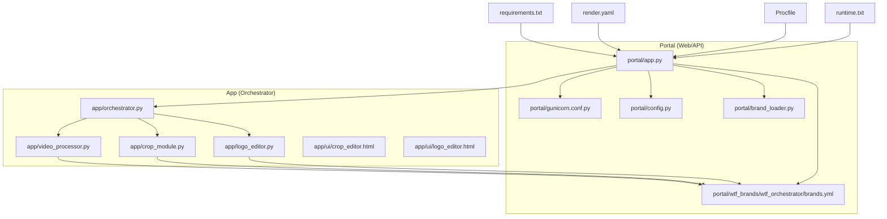
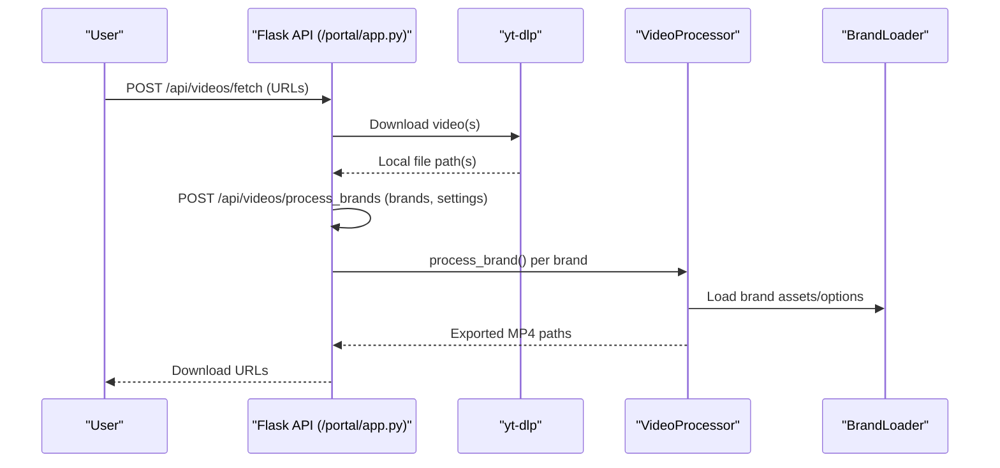
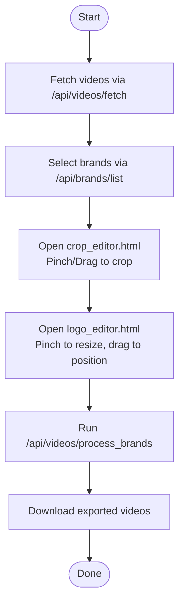

# Getting Started

<cite>
**Referenced Files in This Document**
- [requirements.txt](file://requirements.txt)
- [render.yaml](file://render.yaml)
- [Procfile](file://Procfile)
- [runtime.txt](file://runtime.txt)
- [portal/app.py](file://portal/app.py)
- [portal/gunicorn.conf.py](file://portal/gunicorn.conf.py)
- [portal/config.py](file://portal/config.py)
- [portal/brand_loader.py](file://portal/brand_loader.py)
- [portal/wtf_brands/wtf_orchestrator/brands.yml](file://portal/wtf_brands/wtf_orchestrator/brands.yml)
- [app/orchestrator.py](file://app/orchestrator.py)
- [app/video_processor.py](file://app/video_processor.py)
- [app/crop_module.py](file://app/crop_module.py)
- [app/logo_editor.py](file://app/logo_editor.py)
- [app/ui/crop_editor.html](file://app/ui/crop_editor.html)
- [app/ui/logo_editor.html](file://app/ui/logo_editor.html)
- [demo_orchestrator.py](file://demo_orchestrator.py)
</cite>

## Table of Contents
1. [Introduction](#introduction)
2. [Project Structure](#project-structure)
3. [Core Components](#core-components)
4. [Architecture Overview](#architecture-overview)
5. [Installation and Setup](#installation-and-setup)
6. [Initial Project Setup](#initial-project-setup)
7. [Configuration](#configuration)
8. [Basic Usage Examples](#basic-usage-examples)
9. [Quick Start Tutorials](#quick-start-tutorials)
10. [Troubleshooting Guide](#troubleshooting-guide)
11. [Verification Checklist](#verification-checklist)
12. [Conclusion](#conclusion)

## Introduction
WatchTheFall Orchestrator v3 is a video processing pipeline designed to download, crop, brand, and export videos for multiple brands efficiently. It supports modern platforms, adaptive watermarking, and a mobile-friendly workflow. This guide helps you install, configure, and run the system locally and on Render, then quickly process your first video.

## Project Structure
The repository is organized into:
- portal/: Web application and API server (Flask + Gunicorn)
- app/: Orchestration and video processing modules
- imports/brands/: Brand assets and configurations
- assets/posters/: Unused poster assets
- cookies/: Example cookie file for platform access
- output/: Exported videos
- Root deployment files: requirements.txt, render.yaml, Procfile, runtime.txt

**Diagram sources**
- [portal/app.py](file://portal/app.py#L1-L1358)
- [portal/gunicorn.conf.py](file://portal/gunicorn.conf.py#L1-L36)
- [portal/config.py](file://portal/config.py#L1-L42)
- [portal/brand_loader.py](file://portal/brand_loader.py#L1-L59)
- [portal/wtf_brands/wtf_orchestrator/brands.yml](file://portal/wtf_brands/wtf_orchestrator/brands.yml#L1-L423)
- [app/orchestrator.py](file://app/orchestrator.py#L1-L172)
- [app/video_processor.py](file://app/video_processor.py#L1-L273)
- [app/crop_module.py](file://app/crop_module.py#L1-L193)
- [app/logo_editor.py](file://app/logo_editor.py#L1-L132)
- [app/ui/crop_editor.html](file://app/ui/crop_editor.html#L1-L261)
- [app/ui/logo_editor.html](file://app/ui/logo_editor.html#L1-L254)
- [requirements.txt](file://requirements.txt#L1-L18)
- [render.yaml](file://render.yaml#L1-L18)
- [Procfile](file://Procfile#L1-L1)
- [runtime.txt](file://runtime.txt#L1-L1)

**Section sources**
- [portal/app.py](file://portal/app.py#L1-L1358)
- [app/orchestrator.py](file://app/orchestrator.py#L1-L172)

## Core Components
- Portal API (Flask): Provides endpoints for video fetching, processing, downloads, and diagnostics.
- Orchestrator: Coordinates the full pipeline: download → crop → logo editor → multi-brand export.
- Video Processor: Applies brand templates, logos, and adaptive watermarks via FFmpeg.
- Crop Module: Calculates crops and applies transformations.
- Logo Editor: Manages logo positioning with safe zones and scaling.
- Brand Loader: Loads brand configurations and assets from YAML and filesystem.

**Section sources**
- [portal/app.py](file://portal/app.py#L225-L608)
- [app/orchestrator.py](file://app/orchestrator.py#L12-L172)
- [app/video_processor.py](file://app/video_processor.py#L13-L273)
- [app/crop_module.py](file://app/crop_module.py#L11-L193)
- [app/logo_editor.py](file://app/logo_editor.py#L11-L132)
- [portal/brand_loader.py](file://portal/brand_loader.py#L48-L59)

## Architecture Overview
The system runs as a Flask web service behind Gunicorn. It integrates with FFmpeg/ffprobe for media processing and uses yt-dlp for downloading videos from supported platforms. Brand assets are loaded from YAML manifests and PNG assets.

**Diagram sources**
- [portal/app.py](file://portal/app.py#L609-L784)
- [portal/app.py](file://portal/app.py#L329-L608)
- [app/video_processor.py](file://app/video_processor.py#L180-L253)
- [portal/brand_loader.py](file://portal/brand_loader.py#L48-L59)

## Installation and Setup

### Prerequisites
- Python 3.10.6 (exact version pinned for Render)
- FFmpeg and ffprobe available in PATH or configured via environment variables
- yt-dlp for downloading videos from supported platforms

**Section sources**
- [runtime.txt](file://runtime.txt#L1-L1)
- [portal/config.py](file://portal/config.py#L26-L28)
- [requirements.txt](file://requirements.txt#L13-L13)

### Step-by-Step Installation
1. Clone or download the repository to your machine.
2. Install Python 3.10.6 and ensure it is your active interpreter.
3. Install system dependencies:
   - FFmpeg and ffprobe must be installed and accessible.
   - On Windows, ensure ffmpeg.exe and ffprobe.exe are on PATH or set FFMPEG_PATH/FFPROBE_PATH in environment.
4. Install Python dependencies:
   - pip install -r requirements.txt
5. Verify yt-dlp and FFmpeg:
   - yt-dlp --version
   - ffmpeg -version
   - ffprobe -version

**Section sources**
- [requirements.txt](file://requirements.txt#L1-L18)
- [portal/config.py](file://portal/config.py#L26-L28)

## Initial Project Setup

### Prepare Brand Assets
- Place brand assets under imports/brands/<brand>/ (PNG files and optional YAML manifests).
- Alternatively, use portal/wtf_brands/wtf_orchestrator/brands.yml to define brand assets and options.
- The system will auto-discover assets or load from the top-level brands.yml if present.

**Section sources**
- [portal/brand_loader.py](file://portal/brand_loader.py#L168-L183)
- [portal/wtf_brands/wtf_orchestrator/brands.yml](file://portal/wtf_brands/wtf_orchestrator/brands.yml#L1-L423)

### Configure Environment Variables
- Set SECRET_KEY and PORTAL_AUTH_KEY for security.
- Optionally set FFMPEG_PATH and FFPROBE_PATH if binaries are not on PATH.
- For Render deployment, the platform sets PORT and RENDER automatically.

**Section sources**
- [portal/config.py](file://portal/config.py#L31-L32)
- [portal/config.py](file://portal/config.py#L26-L28)
- [render.yaml](file://render.yaml#L8-L12)

### Deployment Configuration
- Render deployment:
  - Build command installs requirements.txt
  - Start command runs Gunicorn with portal/gunicorn.conf.py
  - Python version pinned to 3.10.6
- Local development:
  - Use Procfile to run the app with Gunicorn locally.

**Section sources**
- [render.yaml](file://render.yaml#L6-L7)
- [render.yaml](file://render.yaml#L9-L10)
- [Procfile](file://Procfile#L1-L1)
- [portal/gunicorn.conf.py](file://portal/gunicorn.conf.py#L1-L36)

## Configuration

### render.yaml
- Defines a web service with Python environment, free plan, and environment variables.
- Sets PYTHON_VERSION to 3.10.6 and RENDER to true.
- Uses Gunicorn to serve portal.app:app.

**Section sources**
- [render.yaml](file://render.yaml#L1-L18)

### Procfile
- Standard web process definition for platforms supporting Procfile.
- Runs Gunicorn with the configured gunicorn.conf.py.

**Section sources**
- [Procfile](file://Procfile#L1-L1)

### runtime.txt
- Pins Python runtime to 3.10.6 for consistent builds.

**Section sources**
- [runtime.txt](file://runtime.txt#L1-L1)

### portal/gunicorn.conf.py
- Binds to PORT, single worker, sync worker class, preload enabled.
- Timeout and graceful timeouts set for long-running video processing.
- Worker tmp dir set to /dev/shm for performance.

**Section sources**
- [portal/gunicorn.conf.py](file://portal/gunicorn.conf.py#L1-L36)

### portal/config.py
- Defines portal paths (uploads, outputs, temp, logs, DB).
- FFmpeg binary paths configurable via environment variables.
- Security keys and upload limits.

**Section sources**
- [portal/config.py](file://portal/config.py#L1-L42)

## Basic Usage Examples

### Process a Video via API
- Fetch videos from URLs (supports multiple URLs):
  - POST /api/videos/fetch with JSON: {"urls": ["<platform_url>", ...]}
- Process with selected brands:
  - POST /api/videos/process_brands with JSON:
    - url or source_path
    - brands: array of brand names
    - Optional overrides: watermark_scale, watermark_opacity, logo_scale, logo_padding

Response includes download URLs for exported videos.

**Section sources**
- [portal/app.py](file://portal/app.py#L609-L784)
- [portal/app.py](file://portal/app.py#L329-L608)

### Programmatic Pipeline (Local)
- Use the orchestrator to run the full pipeline locally:
  - orchestrate(video_path, selected_brands, aspect_ratio, video_id)
- The orchestrator coordinates:
  - Crop editor UI launch
  - Logo editor UI launch
  - Multi-brand export

**Section sources**
- [demo_orchestrator.py](file://demo_orchestrator.py#L76-L104)
- [app/orchestrator.py](file://app/orchestrator.py#L29-L115)

## Quick Start Tutorials

### First-Time User: End-to-End Workflow
1. Upload or provide a video URL
   - Use POST /api/videos/fetch to download videos
   - Or provide a local source_path in process_brands
2. Select brands
   - GET /api/brands/list to see available brands
   - Choose one or more brand names
3. Crop configuration
   - Open the mobile crop editor UI (crop_editor.html)
   - Adjust aspect ratio and pinch-to-zoom/drag to position the crop
   - Confirm crop
4. Logo positioning
   - Open the logo editor UI (logo_editor.html)
   - Pinch to resize logo, drag to position within safe zones
   - Confirm logo
5. Export
   - The system exports one video per selected brand to exports/<brand>/<video_id>.mp4

**Diagram sources**
- [portal/app.py](file://portal/app.py#L609-L784)
- [portal/app.py](file://portal/app.py#L329-L608)
- [app/ui/crop_editor.html](file://app/ui/crop_editor.html#L1-L261)
- [app/ui/logo_editor.html](file://app/ui/logo_editor.html#L1-L254)

**Section sources**
- [portal/app.py](file://portal/app.py#L26-L116)
- [app/ui/crop_editor.html](file://app/ui/crop_editor.html#L130-L257)
- [app/ui/logo_editor.html](file://app/ui/logo_editor.html#L107-L250)

## Troubleshooting Guide

### Common Installation Issues
- Python version mismatch
  - Ensure Python 3.10.6 is installed and selected.
  - Verify runtime.txt and render.yaml match.
- FFmpeg/ffprobe not found
  - Add ffmpeg and ffprobe to PATH or set FFMPEG_PATH/FFPROBE_PATH.
  - Test with ffmpeg -version and ffprobe -version.
- yt-dlp not found
  - Install yt-dlp globally or ensure it is available in PATH.
  - The API checks for yt-dlp availability before downloading.
- Port binding on Render
  - PORT is set by Render; ensure your Gunicorn config binds to 0.0.0.0:$PORT.

**Section sources**
- [runtime.txt](file://runtime.txt#L1-L1)
- [render.yaml](file://render.yaml#L8-L8)
- [portal/config.py](file://portal/config.py#L26-L28)
- [portal/gunicorn.conf.py](file://portal/gunicorn.conf.py#L7-L8)

### API and Processing Errors
- Audio-only video error
  - The system detects audio-only content and returns a specific error message.
- Download failures
  - Check yt-dlp logs and network connectivity; verify platform cookies if required.
- Storage permissions
  - Ensure uploads, outputs, temp, and logs directories are writable.

**Section sources**
- [portal/app.py](file://portal/app.py#L552-L559)
- [portal/app.py](file://portal/app.py#L687-L762)
- [portal/app.py](file://portal/app.py#L194-L214)

### Verification Steps
- Health check
  - GET /__debug_health to verify writable directories
- FFmpeg configuration
  - GET /__debug_ffmpeg to verify binary paths and version
- Storage inspection
  - GET /__debug_storage to check sizes and writability
- Brand integrity
  - GET /api/debug/brand-integrity to validate brand assets

**Section sources**
- [portal/app.py](file://portal/app.py#L188-L214)
- [portal/app.py](file://portal/app.py#L92-L116)
- [portal/app.py](file://portal/app.py#L118-L162)
- [portal/app.py](file://portal/app.py#L280-L288)

## Verification Checklist
- Python 3.10.6 is active
- FFmpeg and ffprobe are installed and accessible
- yt-dlp is installed
- Dependencies installed via requirements.txt
- Environment variables set (SECRET_KEY, PORTAL_AUTH_KEY, optional FFMPEG_PATH/FFPROBE_PATH)
- Render deployment configured (render.yaml, Procfile, runtime.txt)
- Brand assets present under imports/brands or portal/wtf_brands
- Test endpoints reachable and healthy

**Section sources**
- [requirements.txt](file://requirements.txt#L1-L18)
- [portal/config.py](file://portal/config.py#L31-L32)
- [portal/config.py](file://portal/config.py#L26-L28)
- [render.yaml](file://render.yaml#L1-L18)
- [Procfile](file://Procfile#L1-L1)
- [runtime.txt](file://runtime.txt#L1-L1)

## Conclusion
You now have the essentials to install, configure, and operate WatchTheFall Orchestrator v3. Use the API endpoints for programmatic control or the mobile-friendly crop and logo editors for manual adjustments. For production, deploy using Render with the provided configuration files. If issues arise, consult the troubleshooting section and use the debug endpoints to diagnose problems.