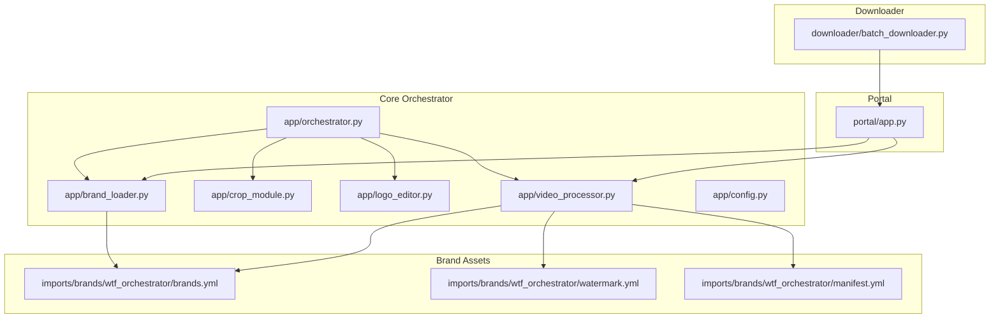
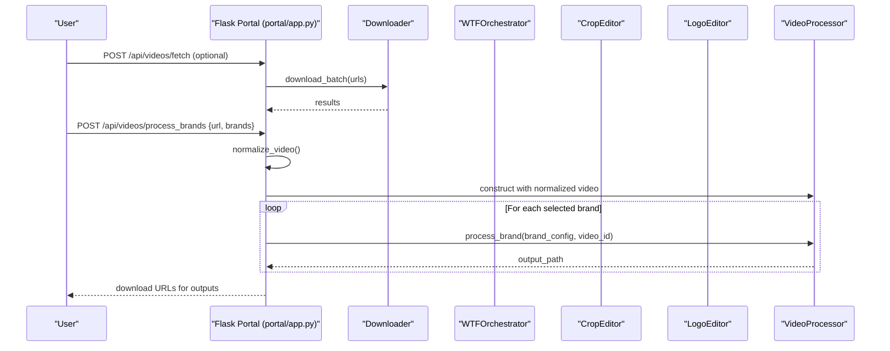
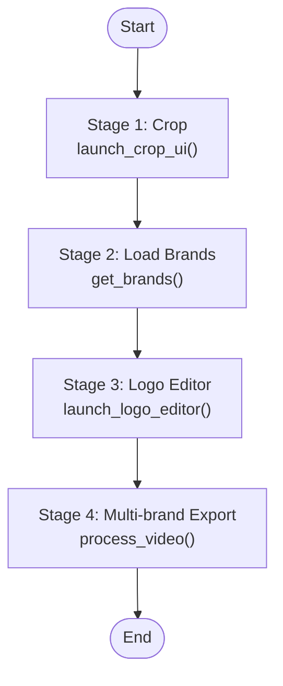
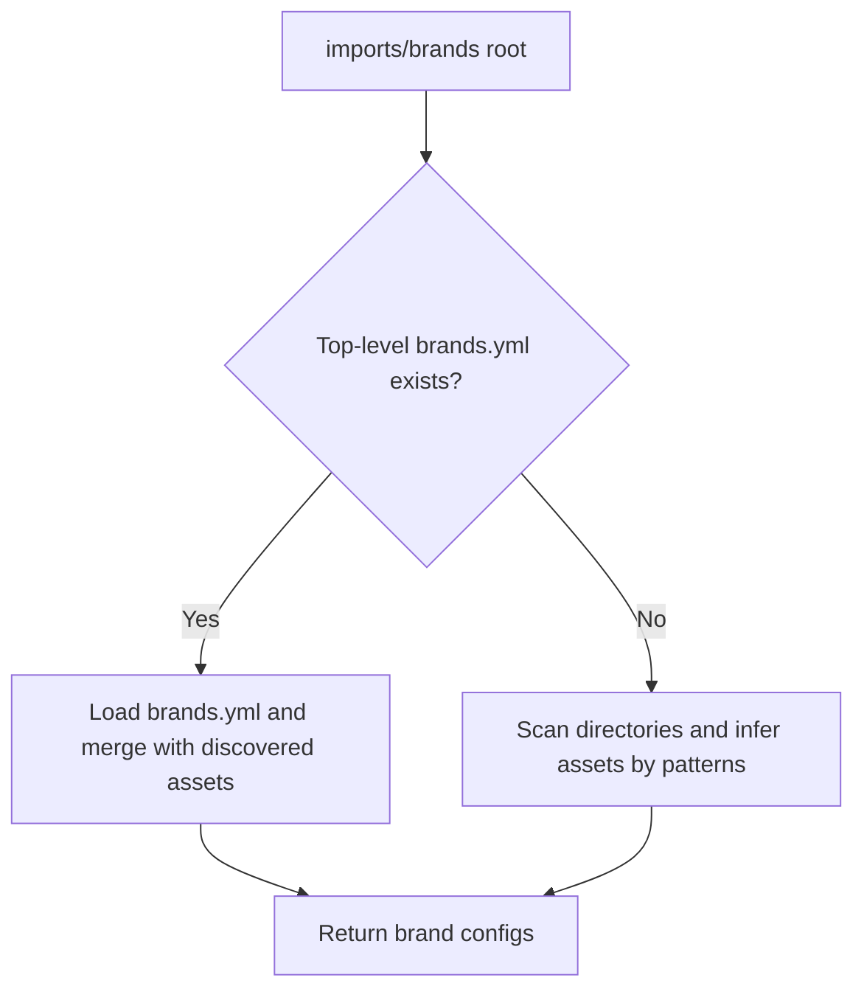
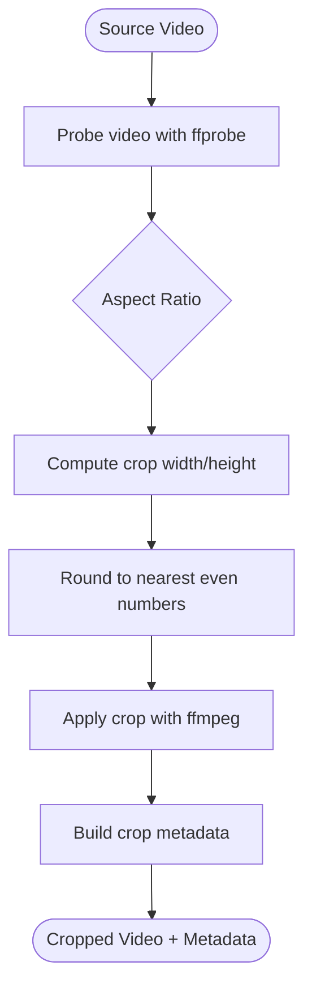
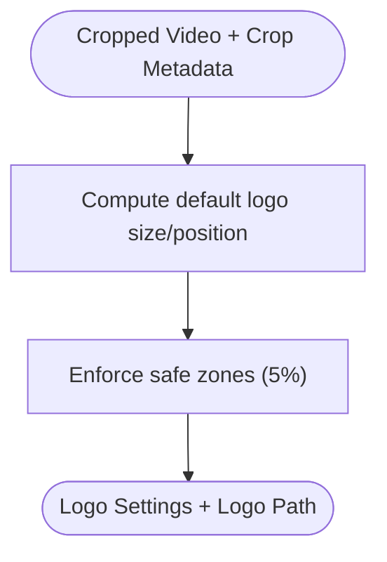
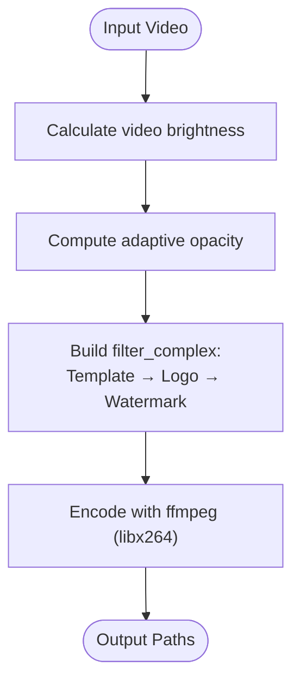
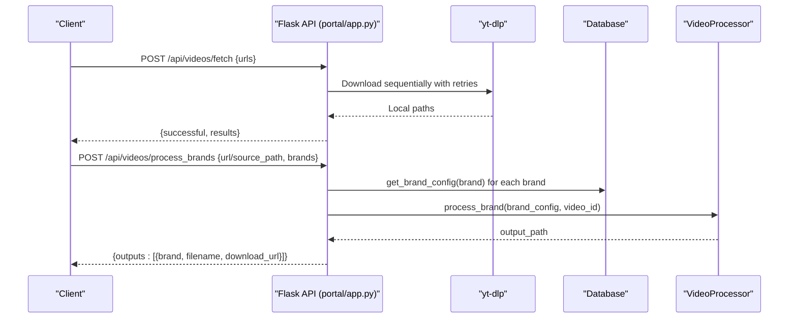
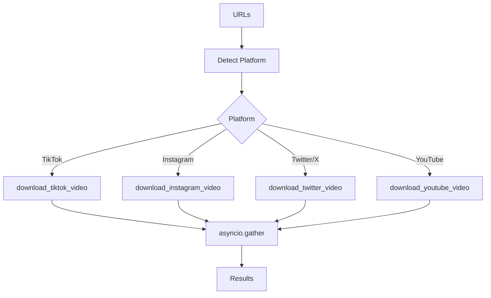
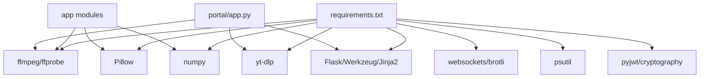

# Project Overview

<cite>
**Referenced Files in This Document**
- [requirements.txt](file://requirements.txt)
- [app/orchestrator.py](file://app/orchestrator.py)
- [app/video_processor.py](file://app/video_processor.py)
- [app/brand_loader.py](file://app/brand_loader.py)
- [app/crop_module.py](file://app/crop_module.py)
- [app/logo_editor.py](file://app/logo_editor.py)
- [app/config.py](file://app/config.py)
- [imports/brands/wtf_orchestrator/brands.yml](file://imports/brands/wtf_orchestrator/brands.yml)
- [imports/brands/wtf_orchestrator/watermark.yml](file://imports/brands/wtf_orchestrator/watermark.yml)
- [imports/brands/wtf_orchestrator/manifest.yml](file://imports/brands/wtf_orchestrator/manifest.yml)
- [demo_orchestrator.py](file://demo_orchestrator.py)
- [downloader/batch_downloader.py](file://downloader/batch_downloader.py)
- [portal/app.py](file://portal/app.py)
</cite>

## Table of Contents
1. [Introduction](#introduction)
2. [Project Structure](#project-structure)
3. [Core Components](#core-components)
4. [Architecture Overview](#architecture-overview)
5. [Detailed Component Analysis](#detailed-component-analysis)
6. [Dependency Analysis](#dependency-analysis)
7. [Performance Considerations](#performance-considerations)
8. [Troubleshooting Guide](#troubleshooting-guide)
9. [Conclusion](#conclusion)
10. [Appendices](#appendices)

## Introduction
WatchTheFall Orchestrator v3 is a multi-brand video processing pipeline designed to transform raw video content into brand-specific variants with adaptive watermarks and logos. It supports rapid batch processing across 25+ brand identities, enabling automated content creation optimized for social media platforms. The system emphasizes mobile-friendly workflows, safe zones for overlays, and intelligent watermark opacity tuned to video brightness.

Key capabilities:
- Multi-brand export from a single crop
- Adaptive watermark opacity based on video brightness
- Safe zone enforcement for logos and watermarks
- Batch downloading from supported platforms
- Web portal APIs for programmatic orchestration

## Project Structure
The repository is organized into modular components:
- app/: Core orchestration, video processing, brand loading, crop, and logo editing modules
- imports/brands/: Brand assets and configuration manifests
- portal/: Flask-based web portal with APIs for fetching, processing, and downloading videos
- downloader/: Asynchronous batch downloader for TikTok, Instagram, Twitter/X, and YouTube
- assets/, cookies/, debug_output/, exports/, imports/, output/, temp/: Supporting directories for assets, cookies, and outputs
- scripts/: Utility scripts for asset cleanup and standardization

**Diagram sources**
- [app/orchestrator.py](file://app/orchestrator.py#L1-L172)
- [app/brand_loader.py](file://app/brand_loader.py#L1-L499)
- [app/crop_module.py](file://app/crop_module.py#L1-L193)
- [app/logo_editor.py](file://app/logo_editor.py#L1-L132)
- [app/video_processor.py](file://app/video_processor.py#L1-L273)
- [app/config.py](file://app/config.py#L1-L18)
- [imports/brands/wtf_orchestrator/brands.yml](file://imports/brands/wtf_orchestrator/brands.yml#L1-L423)
- [imports/brands/wtf_orchestrator/watermark.yml](file://imports/brands/wtf_orchestrator/watermark.yml#L1-L3)
- [imports/brands/wtf_orchestrator/manifest.yml](file://imports/brands/wtf_orchestrator/manifest.yml#L1-L4)
- [portal/app.py](file://portal/app.py#L1-L800)
- [downloader/batch_downloader.py](file://downloader/batch_downloader.py#L1-L83)

**Section sources**
- [app/orchestrator.py](file://app/orchestrator.py#L1-L172)
- [app/brand_loader.py](file://app/brand_loader.py#L1-L499)
- [app/video_processor.py](file://app/video_processor.py#L1-L273)
- [app/crop_module.py](file://app/crop_module.py#L1-L193)
- [app/logo_editor.py](file://app/logo_editor.py#L1-L132)
- [app/config.py](file://app/config.py#L1-L18)
- [imports/brands/wtf_orchestrator/brands.yml](file://imports/brands/wtf_orchestrator/brands.yml#L1-L423)
- [imports/brands/wtf_orchestrator/watermark.yml](file://imports/brands/wtf_orchestrator/watermark.yml#L1-L3)
- [imports/brands/wtf_orchestrator/manifest.yml](file://imports/brands/wtf_orchestrator/manifest.yml#L1-L4)
- [portal/app.py](file://portal/app.py#L1-L800)
- [downloader/batch_downloader.py](file://downloader/batch_downloader.py#L1-L83)

## Core Components
- Orchestrator: Central coordinator that sequences crop, logo editor, and multi-brand export.
- Brand Loader: Discovers and loads brand configurations and assets from imports/brands.
- Crop Module: Provides aspect-ratio-aware cropping and metadata for downstream processing.
- Logo Editor: Positions logos with safe zones and enforces background-removed variants when available.
- Video Processor: Applies brand-specific overlays (template, logo, watermark) with adaptive opacity and safe zones.
- Portal: Flask API for fetching videos, processing with selected brands, and serving outputs.
- Downloader: Asynchronous batch downloader supporting TikTok, Instagram, Twitter/X, and YouTube.

Practical example (from demo):
- Use orchestrate() to process a downloaded video through crop → logo editor → multi-brand export.
- Select brands by name or display name; outputs are saved under exports/<brand>/<video_id>.mp4.

**Section sources**
- [app/orchestrator.py](file://app/orchestrator.py#L12-L172)
- [app/brand_loader.py](file://app/brand_loader.py#L168-L183)
- [app/crop_module.py](file://app/crop_module.py#L174-L193)
- [app/logo_editor.py](file://app/logo_editor.py#L117-L132)
- [app/video_processor.py](file://app/video_processor.py#L256-L273)
- [demo_orchestrator.py](file://demo_orchestrator.py#L13-L109)

## Architecture Overview
The system follows a staged pipeline orchestrated by WTFOrchestrator. It integrates external downloads (yt-dlp), interactive crop and logo editors, and a robust video processor that applies brand-specific assets with adaptive watermarking.

**Diagram sources**
- [portal/app.py](file://portal/app.py#L329-L627)
- [downloader/batch_downloader.py](file://downloader/batch_downloader.py#L53-L83)
- [app/video_processor.py](file://app/video_processor.py#L180-L253)

## Detailed Component Analysis

### Orchestrator
- Responsibilities: Coordinates crop, logo editor, and multi-brand export; aggregates results and errors.
- Pipeline stages: Crop → Brand load → Logo editor → Multi-brand export.
- Brand filtering: Accepts selected_brands or processes all brands.
- Output: Results dictionary with success status, stage metadata, outputs, and errors.

**Diagram sources**
- [app/orchestrator.py](file://app/orchestrator.py#L29-L115)

**Section sources**
- [app/orchestrator.py](file://app/orchestrator.py#L12-L172)

### Brand Loader
- Asset discovery: Scans imports/brands for brand directories and infers assets by filename patterns.
- Manifests: Loads manifest.yml, watermark.yml, orientation.yml, routing.yml, and platforms.yml.
- Top-level brands.yml: If present, merges with discovered assets and options.
- Integrity reporting: Generates an integrity report summarizing assets and warnings.

**Diagram sources**
- [app/brand_loader.py](file://app/brand_loader.py#L131-L183)

**Section sources**
- [app/brand_loader.py](file://app/brand_loader.py#L168-L183)
- [imports/brands/wtf_orchestrator/brands.yml](file://imports/brands/wtf_orchestrator/brands.yml#L1-L423)

### Crop Module
- Aspect ratios: Supports 9:16 (vertical), 1:1 (square), 4:5 (portrait), 16:9 (landscape).
- Crop calculation: Computes even-sized crop dimensions fitting within source video.
- Metadata: Returns crop settings and original/cropped dimensions for downstream use.

**Diagram sources**
- [app/crop_module.py](file://app/crop_module.py#L33-L171)

**Section sources**
- [app/crop_module.py](file://app/crop_module.py#L17-L193)

### Logo Editor
- Defaults: 15% of video width; top-left with safe zones.
- Safe zones: 5% padding from edges enforced during positioning.
- Background removal: Prefers logos_clean variants when available.

**Diagram sources**
- [app/logo_editor.py](file://app/logo_editor.py#L57-L114)

**Section sources**
- [app/logo_editor.py](file://app/logo_editor.py#L11-L132)

### Video Processor
- Adaptive watermark opacity: Brightness-based inverse mapping between 10% and 20%.
- Overlay order: Template → Logo → Watermark with safe zone and scaling.
- Options: watermark_position and watermark_scale from brand manifests.
- Output: One video per brand under exports/<brand>/<video_id>.mp4.

**Diagram sources**
- [app/video_processor.py](file://app/video_processor.py#L52-L178)

**Section sources**
- [app/video_processor.py](file://app/video_processor.py#L13-L273)
- [imports/brands/wtf_orchestrator/watermark.yml](file://imports/brands/wtf_orchestrator/watermark.yml#L1-L3)
- [imports/brands/wtf_orchestrator/manifest.yml](file://imports/brands/wtf_orchestrator/manifest.yml#L1-L4)

### Portal API
- Endpoints:
  - POST /api/videos/process_brands: Process video with selected brands; supports URL or local source_path.
  - POST /api/videos/fetch: Fetch multiple videos concurrently (up to 5).
  - GET /api/videos/download/<filename>: Serve processed outputs.
  - GET /api/brands/list: List available brands.
  - POST /api/videos/convert-watermark: Convert video with watermark (async job).
  - GET /api/videos/convert-status/<job_id>: Poll job status.
- Features:
  - Per-brand configuration overrides applied at runtime.
  - Health checks, storage diagnostics, and FFmpeg debug endpoints.
  - Cookie-based authentication for Instagram downloads.

**Diagram sources**
- [portal/app.py](file://portal/app.py#L329-L627)

**Section sources**
- [portal/app.py](file://portal/app.py#L225-L290)
- [portal/app.py](file://portal/app.py#L329-L627)

### Downloader
- Async batch downloader: Detects platform and dispatches to platform-specific downloaders.
- Concurrency: Uses asyncio.gather to process multiple URLs concurrently.
- Robustness: Handles exceptions and returns structured results per URL.

**Diagram sources**
- [downloader/batch_downloader.py](file://downloader/batch_downloader.py#L16-L83)

**Section sources**
- [downloader/batch_downloader.py](file://downloader/batch_downloader.py#L1-L83)

## Dependency Analysis
External dependencies include ffmpeg/ffprobe, Pillow, numpy, yt-dlp, and Flask ecosystem. The project resolves binary paths via environment variables and ensures directories exist at runtime.

**Diagram sources**
- [requirements.txt](file://requirements.txt#L1-L18)
- [app/config.py](file://app/config.py#L11-L18)

**Section sources**
- [requirements.txt](file://requirements.txt#L1-L18)
- [app/config.py](file://app/config.py#L1-L18)

## Performance Considerations
- Adaptive watermark opacity reduces visual intrusion on bright videos, balancing visibility and aesthetics.
- Safe zones prevent overlays from being cut off on various devices.
- Sequential brand processing in the portal avoids memory pressure on constrained environments.
- FFmpeg encoding uses libx264 with moderate CRF and preset for balanced quality/speed.
- Batch downloading limits concurrent fetches to respect resource constraints.

## Troubleshooting Guide
Common issues and resolutions:
- No brands found: Verify imports/brands contains valid brand directories and assets; check brands.yml presence and correctness.
- Audio-only video: The system detects audio-only content and returns a specific error; retry with a video-enabled source.
- Missing FFmpeg: Use debug endpoints to confirm binary paths and availability.
- Storage permissions: Use storage debug endpoints to verify write permissions for upload/output/temp/log directories.
- Instagram access: Ensure cookies.txt is present and contains valid cookie data; otherwise, downloads may fail.

**Section sources**
- [portal/app.py](file://portal/app.py#L188-L214)
- [portal/app.py](file://portal/app.py#L92-L116)
- [portal/app.py](file://portal/app.py#L118-L162)
- [portal/app.py](file://portal/app.py#L569-L583)

## Conclusion
WatchTheFall Orchestrator v3 provides a scalable, multi-brand video processing pipeline with adaptive overlays and safe zone enforcement. Its modular design enables both command-line demos and a production-grade Flask portal for batch downloading and automated export. With 25+ brand identities supported out-of-the-box and extensible manifests, teams can rapidly produce platform-optimized content for social media distribution.

## Appendices
- Practical example usage is demonstrated in the demo script, showing orchestration steps and expected outputs.
- Brand coverage includes regional identities (e.g., ScotlandWTF, EnglandWTF, IrelandWTF) and thematic brands (e.g., AIWTF, GadgetsWTF).

**Section sources**
- [demo_orchestrator.py](file://demo_orchestrator.py#L13-L109)
- [imports/brands/wtf_orchestrator/brands.yml](file://imports/brands/wtf_orchestrator/brands.yml#L1-L423)