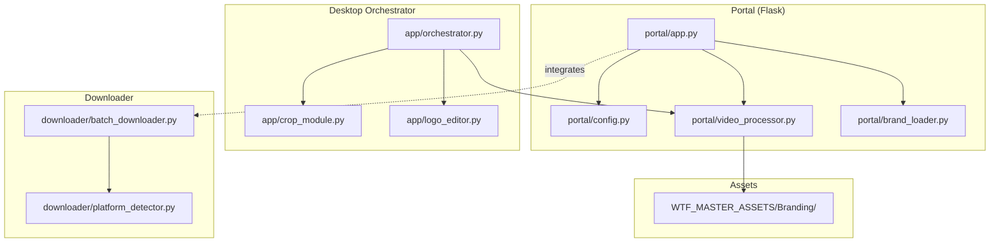
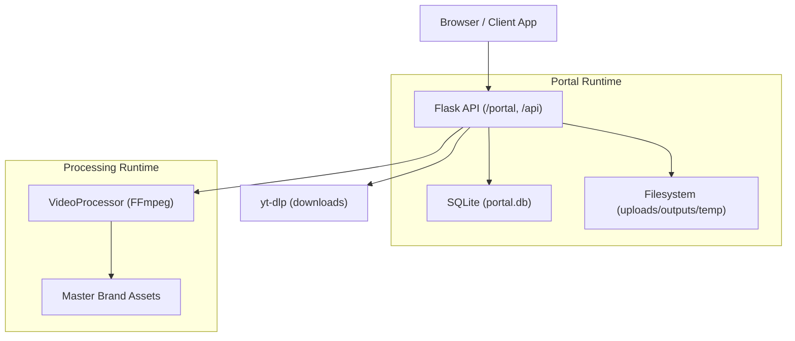
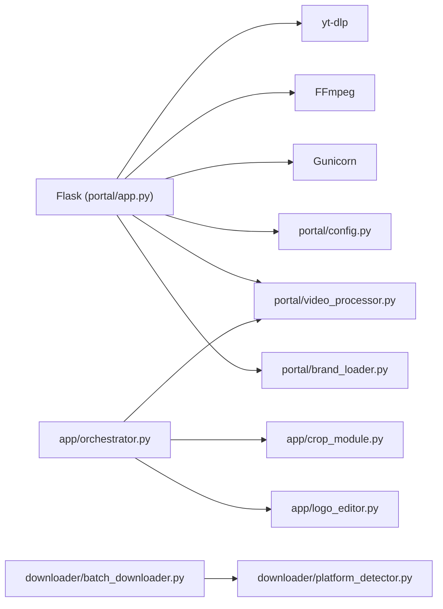
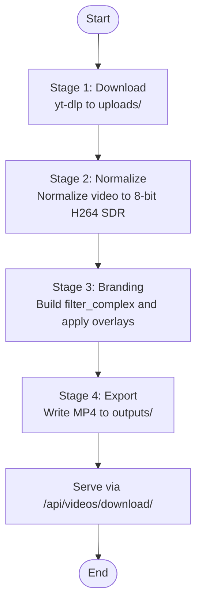
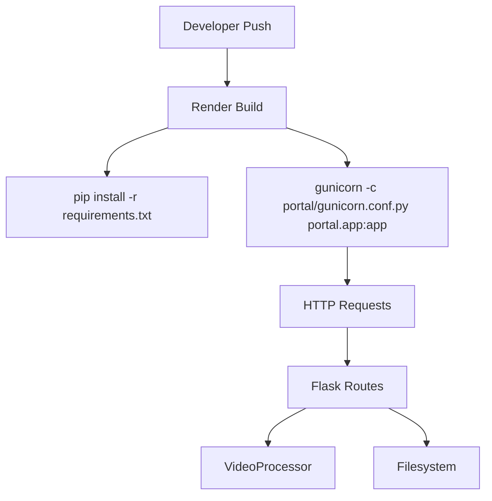

# System Architecture

<cite>
**Referenced Files in This Document**
- [AGENTS.md](file://AGENTS.md)
- [render.yaml](file://render.yaml)
- [requirements.txt](file://requirements.txt)
- [portal/requirements.txt](file://portal/requirements.txt)
- [portal/app.py](file://portal/app.py)
- [portal/video_processor.py](file://portal/video_processor.py)
- [portal/brand_loader.py](file://portal/brand_loader.py)
- [portal/config.py](file://portal/config.py)
- [app/orchestrator.py](file://app/orchestrator.py)
- [app/crop_module.py](file://app/crop_module.py)
- [app/logo_editor.py](file://app/logo_editor.py)
- [downloader/platform_detector.py](file://downloader/platform_detector.py)
- [downloader/batch_downloader.py](file://downloader/batch_downloader.py)
- [Procfile](file://Procfile)
- [DEPLOYMENT.txt](file://DEPLOYMENT.txt)
</cite>

## Table of Contents
1. [Introduction](#introduction)
2. [Project Structure](#project-structure)
3. [Core Components](#core-components)
4. [Architecture Overview](#architecture-overview)
5. [Detailed Component Analysis](#detailed-component-analysis)
6. [Dependency Analysis](#dependency-analysis)
7. [Performance Considerations](#performance-considerations)
8. [Troubleshooting Guide](#troubleshooting-guide)
9. [Conclusion](#conclusion)
10. [Appendices](#appendices)

## Introduction
This document describes the architecture of the WatchTheFall Orchestrator v3 system. It explains how the portal web application, the core processing engine, and brand management components collaborate to deliver a sequential pipeline: download, crop, logo positioning, and brand processing. The system is Flask-based, integrates with yt-dlp and FFmpeg, and deploys on Render using Gunicorn. Architectural constraints and deployment topology are defined in AGENTS.md and related configuration files.

## Project Structure
The repository is organized into distinct areas:
- portal/: Flask-based web application with API endpoints, configuration, and brand assets
- app/: Desktop orchestrator modules for crop, logo editing, and multi-brand export
- downloader/: Platform detection and asynchronous batch downloading utilities
- WTF_MASTER_ASSETS/: Centralized brand assets (watermarks and logos)
- imports/brands/: Brand configuration and assets imported into the portal
- Root configuration and deployment files (render.yaml, requirements.txt, Procfile)

**Diagram sources**
- [portal/app.py](file://portal/app.py#L1-L1358)
- [portal/video_processor.py](file://portal/video_processor.py#L1-L500)
- [portal/brand_loader.py](file://portal/brand_loader.py#L1-L59)
- [portal/config.py](file://portal/config.py#L1-L42)
- [app/orchestrator.py](file://app/orchestrator.py#L1-L172)
- [app/crop_module.py](file://app/crop_module.py#L1-L193)
- [app/logo_editor.py](file://app/logo_editor.py#L1-L132)
- [downloader/platform_detector.py](file://downloader/platform_detector.py#L1-L41)
- [downloader/batch_downloader.py](file://downloader/batch_downloader.py#L1-L83)

**Section sources**
- [AGENTS.md](file://AGENTS.md#L22-L44)
- [portal/config.py](file://portal/config.py#L1-L42)

## Core Components
- Portal Web Application (Flask):
  - Routes for video fetching, branding processing, watermark conversion, previews, and brand listing
  - Integrates with yt-dlp for downloads and FFmpeg for processing
  - Manages uploads, outputs, and temporary files under controlled directories
- Video Processing Engine (FFmpeg-based):
  - Normalizes videos, detects orientation, resolves master assets, builds filter_complex, and exports branded MP4s
  - Applies full-frame watermark and logo overlays with configurable opacity and scaling
- Brand Management:
  - Loads brand configurations from JSON and YAML manifests
  - Resolves watermark and logo assets from master directories based on orientation and brand name
- Desktop Orchestrator:
  - Provides crop and logo editor modules for desktop workflows
  - Coordinates multi-stage pipeline: crop → logo positioning → multi-brand export
- Downloader Utilities:
  - Platform detection and batch downloading for TikTok, Instagram, Twitter/X, and YouTube

**Section sources**
- [portal/app.py](file://portal/app.py#L329-L608)
- [portal/video_processor.py](file://portal/video_processor.py#L21-L434)
- [portal/brand_loader.py](file://portal/brand_loader.py#L9-L59)
- [app/orchestrator.py](file://app/orchestrator.py#L12-L172)
- [downloader/platform_detector.py](file://downloader/platform_detector.py#L12-L41)
- [downloader/batch_downloader.py](file://downloader/batch_downloader.py#L16-L83)

## Architecture Overview
The system follows a layered architecture:
- Presentation Layer: Flask routes serve the portal dashboard and APIs
- Orchestration Layer: Desktop orchestrator coordinates multi-stage processing
- Processing Layer: FFmpeg-based video processor applies overlays and exports
- Asset Layer: Master assets resolved dynamically by brand and orientation
- Integration Layer: yt-dlp for downloads and Render/Gunicorn for deployment

**Diagram sources**
- [portal/app.py](file://portal/app.py#L329-L608)
- [portal/video_processor.py](file://portal/video_processor.py#L21-L434)
- [portal/config.py](file://portal/config.py#L13-L28)

**Section sources**
- [AGENTS.md](file://AGENTS.md#L10-L14)
- [render.yaml](file://render.yaml#L1-L18)
- [Procfile](file://Procfile#L1-L1)

## Detailed Component Analysis

### Portal Web Application (Flask)
Responsibilities:
- Expose endpoints for video processing, watermark conversion, previews, and brand listing
- Manage file lifecycle: downloads, normalization, branding, and final exports
- Integrate with yt-dlp and FFmpeg for robust media handling
- Provide debugging endpoints for FFmpeg, storage, brands, and health checks

Key endpoints:
- POST /api/videos/process_brands: Sequentially processes a video with selected brands
- POST /api/videos/fetch: Downloads multiple videos from URLs (up to 5)
- GET /api/videos/download/<filename>: Serves final MP4s
- POST /api/videos/convert-watermark: Queues background WebM to MP4 conversion
- GET /api/brands/list: Lists available brands
- Preview endpoints: Extract frames and serve watermark/logo assets for canvas preview

Concurrency and safety:
- Uses a global lock to serialize FFmpeg conversions
- Background threads for watermark conversion with polling status
- Health checks and storage diagnostics for Render’s ephemeral filesystem

**Section sources**
- [portal/app.py](file://portal/app.py#L225-L241)
- [portal/app.py](file://portal/app.py#L329-L608)
- [portal/app.py](file://portal/app.py#L790-L834)
- [portal/app.py](file://portal/app.py#L980-L1190)
- [portal/app.py](file://portal/app.py#L1197-L1256)

### Video Processing Engine (FFmpeg-based)
Responsibilities:
- Normalize video to 8-bit H264 SDR to handle HDR/10-bit and corrupted timestamps
- Detect orientation and resolve watermark/logo assets from master directories
- Build filter_complex dynamically and execute FFmpeg with Render-optimized settings
- Export branded MP4s with full-frame watermark and logo overlays

Core logic:
- normalize_video: Re-encodes to libx264, strips HDR metadata, faststart
- detect_orientation: Determines Vertical_HD, Square, or Landscape
- resolve_watermark_path/log_resolve_logo_path: Pattern-based asset resolution
- build_filter_complex: Composes watermark and logo overlays with opacity and scaling
- process_brand: Executes FFmpeg with validated filter_complex and [vout] labeling

Constraints:
- Enforces single [vout] label and validates video stream presence
- Uses Render-optimized defaults for threads, buffers, and presets

**Section sources**
- [portal/video_processor.py](file://portal/video_processor.py#L21-L69)
- [portal/video_processor.py](file://portal/video_processor.py#L151-L172)
- [portal/video_processor.py](file://portal/video_processor.py#L173-L227)
- [portal/video_processor.py](file://portal/video_processor.py#L228-L314)
- [portal/video_processor.py](file://portal/video_processor.py#L315-L404)

### Brand Management
Responsibilities:
- Load brand configurations from JSON/YAML manifests
- Provide brand lists and integrity checks
- Resolve assets for preview and processing

Patterns:
- load_brand_configs: Converts stored brand data to unified structure
- get_available_brands: Reads from portal brand_config.json
- debug endpoints: Integrity checks and dry-run filter construction

**Section sources**
- [portal/brand_loader.py](file://portal/brand_loader.py#L9-L59)
- [portal/app.py](file://portal/app.py#L958-L974)
- [portal/app.py](file://portal/app.py#L1197-L1256)

### Desktop Orchestrator
Responsibilities:
- Coordinate multi-stage pipeline: crop → logo positioning → multi-brand export
- Provide crop editor and logo editor modules for desktop workflows
- Print stage-by-stage summaries and collect outputs

Pipeline stages:
- Stage 1: Crop editor with aspect ratio selection
- Stage 2: Brand loading and selection
- Stage 3: Logo editor with safe zones and default positioning
- Stage 4: Multi-brand export via VideoProcessor

**Section sources**
- [app/orchestrator.py](file://app/orchestrator.py#L12-L116)
- [app/crop_module.py](file://app/crop_module.py#L11-L193)
- [app/logo_editor.py](file://app/logo_editor.py#L11-L132)

### Downloader Utilities
Responsibilities:
- Detect platform from URL
- Asynchronously download videos for supported platforms
- Support single and batch downloads

Integration:
- Used by portal routes for platform-aware downloads
- Returns structured results for success/error tracking

**Section sources**
- [downloader/platform_detector.py](file://downloader/platform_detector.py#L12-L41)
- [downloader/batch_downloader.py](file://downloader/batch_downloader.py#L16-L83)
- [portal/app.py](file://portal/app.py#L1263-L1316)

## Dependency Analysis
External dependencies and integrations:
- Flask: Web framework for portal routes
- yt-dlp: Video downloading with retries and cookie support
- FFmpeg: Video normalization and overlay processing
- Gunicorn: WSGI server for Render deployment
- Pillow, PyYAML, requests, numpy, mutagen, pycryptodomex, websockets, psutil, jwt, cryptography: Supporting libraries

Internal dependencies:
- portal/app.py depends on portal/video_processor.py, portal/brand_loader.py, portal/config.py
- app/orchestrator.py depends on app/crop_module.py, app/logo_editor.py, portal/video_processor.py
- Downloader utilities are consumed by portal routes

**Diagram sources**
- [requirements.txt](file://requirements.txt#L1-L18)
- [portal/requirements.txt](file://portal/requirements.txt#L1-L7)
- [portal/app.py](file://portal/app.py#L329-L608)
- [portal/video_processor.py](file://portal/video_processor.py#L1-L500)
- [portal/brand_loader.py](file://portal/brand_loader.py#L1-L59)
- [app/orchestrator.py](file://app/orchestrator.py#L1-L172)
- [app/crop_module.py](file://app/crop_module.py#L1-L193)
- [app/logo_editor.py](file://app/logo_editor.py#L1-L132)
- [downloader/batch_downloader.py](file://downloader/batch_downloader.py#L1-L83)
- [downloader/platform_detector.py](file://downloader/platform_detector.py#L1-L41)

**Section sources**
- [requirements.txt](file://requirements.txt#L1-L18)
- [portal/requirements.txt](file://portal/requirements.txt#L1-L7)

## Performance Considerations
- Render constraints:
  - Free tier RAM (~512MB) and CPU limits require conservative FFmpeg settings
  - Optimizations include reduced bufsize, fast presets, and minimal threads
- Serialization:
  - Global lock prevents concurrent FFmpeg invocations to avoid resource exhaustion
- Background processing:
  - Watermark conversion runs in background threads with timeouts to prevent blocking
- Storage:
  - Render ephemeral filesystem requires careful cleanup and avoids long-lived caches

Recommendations:
- Keep video durations short for WebM to MP4 conversions
- Prefer single-worker Gunicorn on Render free tier
- Monitor output directory growth and implement periodic cleanup

**Section sources**
- [AGENTS.md](file://AGENTS.md#L87-L98)
- [portal/app.py](file://portal/app.py#L216-L221)
- [portal/app.py](file://portal/app.py#L1049-L1156)

## Troubleshooting Guide
Common issues and resolutions:
- Audio-only video:
  - Detection and explicit error message when no video stream is found
  - Suggest retrying or selecting a different source
- Download failures:
  - yt-dlp errors surfaced with detailed messages and optional cookie file usage
  - Fallback extraction attempted when initial download lacks a valid video stream
- File not found on download:
  - Debugging prints and directory listing assist in diagnosing path mismatches
- FFmpeg configuration:
  - Debug endpoint exposes FFmpeg binary locations and version
  - Dry-run filter builder helps validate filter_complex construction

Operational checks:
- Health endpoint verifies write permissions for essential directories
- Storage endpoint reports sizes and writability for uploads, outputs, temp, logs, DB, and brands

**Section sources**
- [portal/app.py](file://portal/app.py#L552-L564)
- [portal/app.py](file://portal/app.py#L708-L725)
- [portal/app.py](file://portal/app.py#L800-L811)
- [portal/app.py](file://portal/app.py#L92-L116)
- [portal/app.py](file://portal/app.py#L188-L214)
- [portal/app.py](file://portal/app.py#L1114-L1150)

## Conclusion
WatchTheFall Orchestrator v3 combines a Flask-based portal with a robust FFmpeg-driven processing engine and centralized brand assets. The system enforces a strict sequential pipeline, manages concurrency carefully for Render’s constraints, and integrates platform-specific downloads via yt-dlp. The architecture supports both portal-driven and desktop orchestrator workflows while maintaining clear separation of concerns and predictable data flows.

## Appendices

### Pipeline Architecture
The system enforces a strict four-stage pipeline:
1. Download → portal/uploads/
2. Process with FFmpeg → portal/temp/
3. Export MP4 → portal/outputs/
4. Serve via /api/videos/download/<filename>

**Diagram sources**
- [AGENTS.md](file://AGENTS.md#L71-L83)
- [portal/video_processor.py](file://portal/video_processor.py#L21-L69)
- [portal/video_processor.py](file://portal/video_processor.py#L368-L404)
- [portal/app.py](file://portal/app.py#L790-L834)

### Deployment Topology on Render
- Build command installs dependencies from requirements.txt
- Start command runs Gunicorn with portal/gunicorn.conf.py
- Environment variables include Python version, RENDER flag, and environment mode
- Optional Cloudflare Access header forwarding

**Diagram sources**
- [render.yaml](file://render.yaml#L6-L7)
- [Procfile](file://Procfile#L1-L1)
- [DEPLOYMENT.txt](file://DEPLOYMENT.txt#L70-L94)

### Technology Stack Decisions
- Flask + Gunicorn: Lightweight, familiar, and compatible with Render’s free tier
- yt-dlp: Reliable cross-platform downloads with robust fallbacks and cookies
- FFmpeg: Industry-standard video processing with explicit filter composition
- SQLite: Minimal operational overhead for logs and events
- YAML/JSON: Human-readable brand configuration and manifests

**Section sources**
- [AGENTS.md](file://AGENTS.md#L10-L14)
- [requirements.txt](file://requirements.txt#L1-L18)
- [portal/requirements.txt](file://portal/requirements.txt#L1-L7)