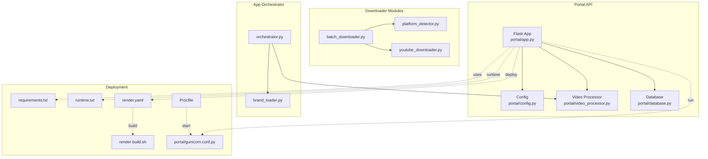
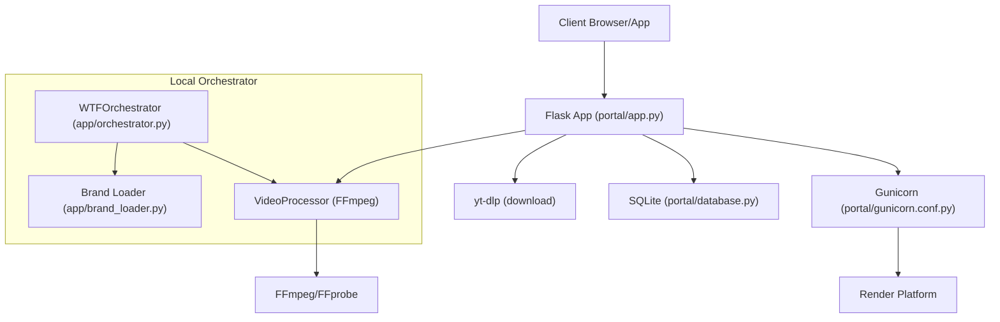
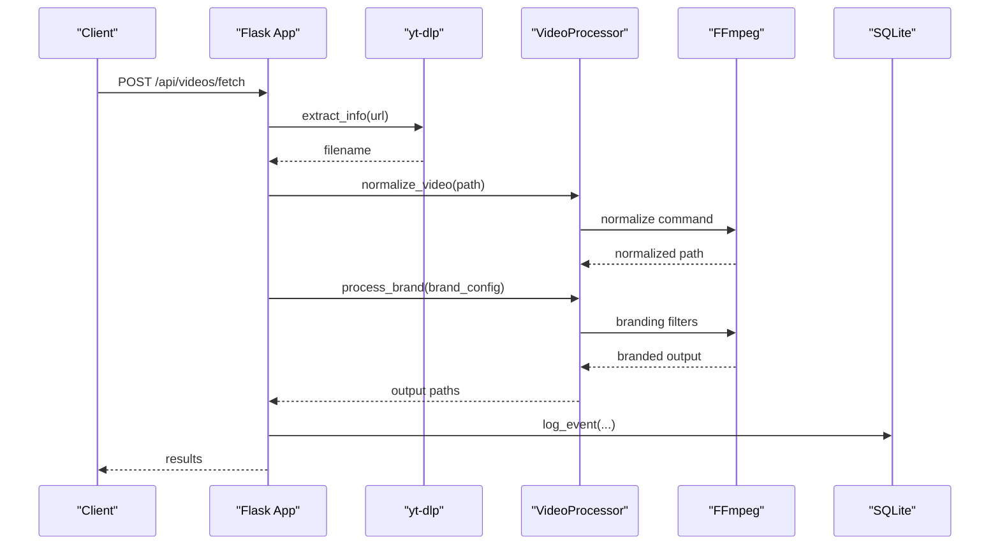
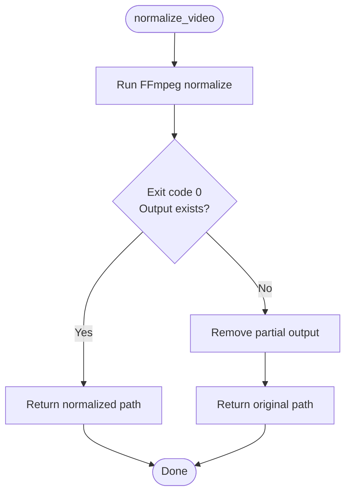
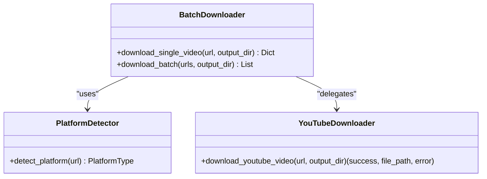
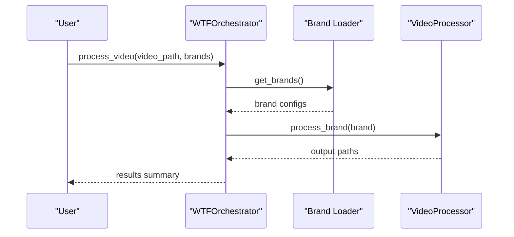
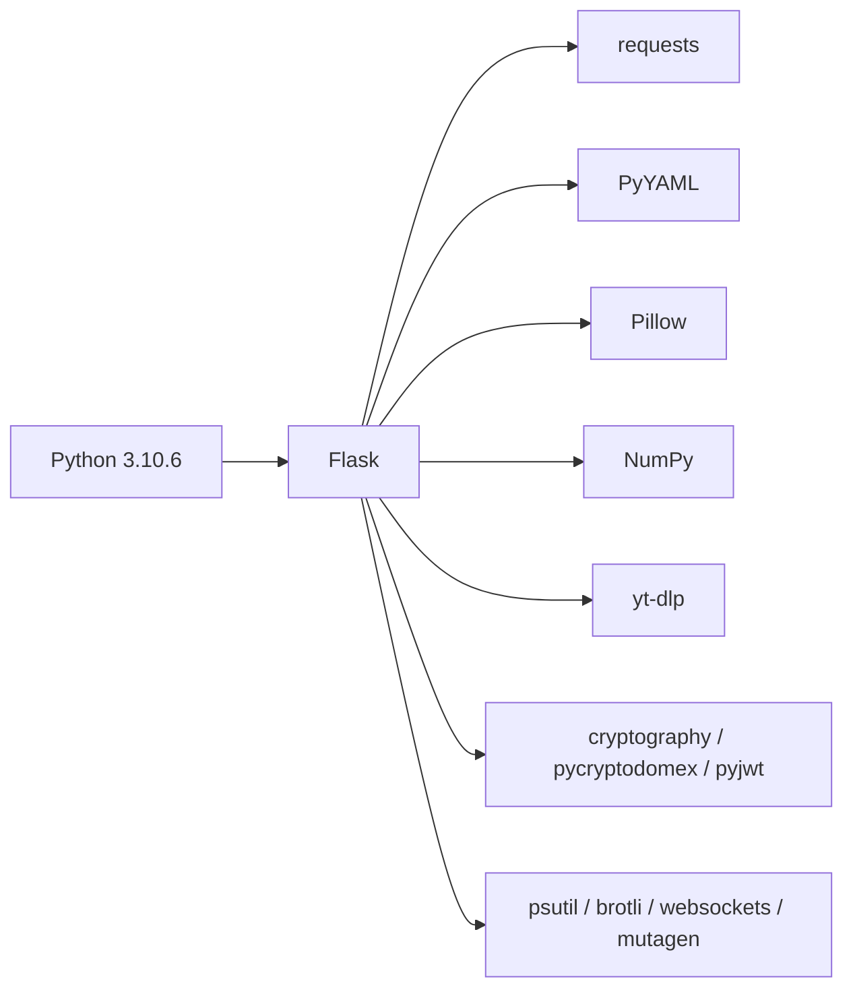

# Technology Stack

<cite>
**Referenced Files in This Document**
- [requirements.txt](file://requirements.txt)
- [runtime.txt](file://runtime.txt)
- [render.yaml](file://render.yaml)
- [Procfile](file://Procfile)
- [render-build.sh](file://render-build.sh)
- [portal/app.py](file://portal/app.py)
- [portal/config.py](file://portal/config.py)
- [portal/video_processor.py](file://portal/video_processor.py)
- [portal/gunicorn.conf.py](file://portal/gunicorn.conf.py)
- [portal/database.py](file://portal/database.py)
- [downloader/platform_detector.py](file://downloader/platform_detector.py)
- [downloader/youtube_downloader.py](file://downloader/youtube_downloader.py)
- [downloader/batch_downloader.py](file://downloader/batch_downloader.py)
- [app/orchestrator.py](file://app/orchestrator.py)
- [app/brand_loader.py](file://app/brand_loader.py)
</cite>

## Table of Contents
1. [Introduction](#introduction)
2. [Project Structure](#project-structure)
3. [Core Components](#core-components)
4. [Architecture Overview](#architecture-overview)
5. [Detailed Component Analysis](#detailed-component-analysis)
6. [Dependency Analysis](#dependency-analysis)
7. [Performance Considerations](#performance-considerations)
8. [Troubleshooting Guide](#troubleshooting-guide)
9. [Conclusion](#conclusion)

## Introduction
This document describes the complete technology ecosystem powering WatchTheFall Orchestrator v3. It covers the programming language and frameworks, media processing tools, deployment stack, and operational constraints. The stack emphasizes Python 3.10+ with Flask for the web application, yt-dlp for robust social media video downloads, FFmpeg for high-performance video processing and watermarking, and Gunicorn as the WSGI server on Render. It also documents the ephemeral filesystem storage model, auxiliary libraries (Pillow, NumPy, PyYAML), and integration patterns between components.

## Project Structure
The repository organizes functionality into distinct areas:
- Portal API: Flask application exposing endpoints for video fetching, processing, and downloads
- Downloader modules: Platform-specific and batch downloading utilities
- App orchestrator: Local orchestration pipeline for desktop usage
- Configuration and deployment: Environment variables, paths, and Render/Gunicorn settings
- Media processing: FFmpeg-based video normalization and branding

**Diagram sources**
- [portal/app.py](file://portal/app.py#L1-L120)
- [portal/config.py](file://portal/config.py#L1-L42)
- [portal/video_processor.py](file://portal/video_processor.py#L1-L120)
- [portal/database.py](file://portal/database.py#L1-L70)
- [downloader/platform_detector.py](file://downloader/platform_detector.py#L1-L41)
- [downloader/youtube_downloader.py](file://downloader/youtube_downloader.py#L1-L46)
- [downloader/batch_downloader.py](file://downloader/batch_downloader.py#L1-L83)
- [app/orchestrator.py](file://app/orchestrator.py#L1-L172)
- [app/brand_loader.py](file://app/brand_loader.py#L1-L120)
- [requirements.txt](file://requirements.txt#L1-L18)
- [runtime.txt](file://runtime.txt#L1-L1)
- [render.yaml](file://render.yaml#L1-L18)
- [Procfile](file://Procfile#L1-L1)
- [render-build.sh](file://render-build.sh#L1-L5)
- [portal/gunicorn.conf.py](file://portal/gunicorn.conf.py#L1-L36)

**Section sources**
- [portal/app.py](file://portal/app.py#L1-L120)
- [portal/config.py](file://portal/config.py#L1-L42)
- [requirements.txt](file://requirements.txt#L1-L18)
- [runtime.txt](file://runtime.txt#L1-L1)
- [render.yaml](file://render.yaml#L1-L18)
- [Procfile](file://Procfile#L1-L1)
- [render-build.sh](file://render-build.sh#L1-L5)
- [portal/gunicorn.conf.py](file://portal/gunicorn.conf.py#L1-L36)

## Core Components
- Python 3.10+ runtime with explicit version pinning
- Flask web framework for API endpoints and templated UI
- yt-dlp for downloading from TikTok, Instagram, Twitter/X, and YouTube
- FFmpeg for video normalization, filtering, and watermarking
- Gunicorn WSGI server configured for Render deployment
- Render platform for hosting with ephemeral filesystem
- Pillow for image processing tasks
- NumPy for numerical computations
- PyYAML for brand manifest parsing
- SQLite via Python’s stdlib for lightweight logging and job metadata

Version and licensing highlights:
- Python runtime pinned to 3.10.6
- yt-dlp and FFmpeg are system-level dependencies managed by Render build steps
- Standard library modules (sqlite3, json, os, subprocess) under their respective licenses
- Third-party packages listed in requirements.txt with MIT/Apache-style licenses typical of the ecosystem

Integration patterns:
- Flask routes orchestrate yt-dlp downloads and delegate post-processing to VideoProcessor
- VideoProcessor invokes FFmpeg commands for normalization and branding
- Gunicorn runs the Flask app with Render-provided environment variables
- SQLite persists job and log records for operational visibility

**Section sources**
- [runtime.txt](file://runtime.txt#L1-L1)
- [requirements.txt](file://requirements.txt#L1-L18)
- [portal/app.py](file://portal/app.py#L1-L120)
- [portal/video_processor.py](file://portal/video_processor.py#L1-L120)
- [portal/gunicorn.conf.py](file://portal/gunicorn.conf.py#L1-L36)
- [render.yaml](file://render.yaml#L1-L18)
- [render-build.sh](file://render-build.sh#L1-L5)

## Architecture Overview
The system comprises two primary modes:
- Portal API mode (hosted): Flask exposes endpoints for fetching and processing videos, with Gunicorn and Render
- Local orchestrator mode (desktop): Desktop pipeline coordinates cropping, logo editing, and multi-brand export

**Diagram sources**
- [portal/app.py](file://portal/app.py#L1-L120)
- [portal/video_processor.py](file://portal/video_processor.py#L1-L120)
- [portal/database.py](file://portal/database.py#L1-L70)
- [portal/gunicorn.conf.py](file://portal/gunicorn.conf.py#L1-L36)
- [render.yaml](file://render.yaml#L1-L18)
- [app/orchestrator.py](file://app/orchestrator.py#L1-L172)
- [app/brand_loader.py](file://app/brand_loader.py#L1-L120)

## Detailed Component Analysis

### Flask Web Application (Portal)
The Flask application defines API endpoints for video fetching, processing, and downloads, and serves a basic dashboard UI. It integrates:
- yt-dlp for robust downloads from multiple platforms
- VideoProcessor for normalization and branding
- SQLite-backed logging and job tracking
- Health checks and debug endpoints for diagnostics

Key behaviors:
- Routes for listing endpoints, fetching videos, processing brands, and downloading outputs
- Debug endpoints for environment, FFmpeg configuration, storage, brands, and health
- Global conversion lock to serialize FFmpeg operations on constrained environments

**Diagram sources**
- [portal/app.py](file://portal/app.py#L609-L784)
- [portal/video_processor.py](file://portal/video_processor.py#L21-L68)
- [portal/database.py](file://portal/database.py#L152-L161)

**Section sources**
- [portal/app.py](file://portal/app.py#L1-L200)
- [portal/database.py](file://portal/database.py#L1-L204)

### Video Processing Engine (FFmpeg)
VideoProcessor encapsulates:
- Video normalization to 8-bit H264 SDR with faststart and standard pixel format
- Dynamic watermark and logo placement based on brand manifests and orientation
- FFprobe-based metadata probing and video stream validation

**Diagram sources**
- [portal/video_processor.py](file://portal/video_processor.py#L21-L68)

**Section sources**
- [portal/video_processor.py](file://portal/video_processor.py#L1-L200)

### Downloader Modules
Downloader modules implement platform detection and batch downloading:
- PlatformDetector identifies TikTok, Instagram, Twitter/X, and YouTube URLs
- YouTubeDownloader uses yt-dlp with platform-specific options
- BatchDownloader coordinates concurrent downloads per platform

**Diagram sources**
- [downloader/platform_detector.py](file://downloader/platform_detector.py#L1-L41)
- [downloader/youtube_downloader.py](file://downloader/youtube_downloader.py#L1-L46)
- [downloader/batch_downloader.py](file://downloader/batch_downloader.py#L1-L83)

**Section sources**
- [downloader/platform_detector.py](file://downloader/platform_detector.py#L1-L41)
- [downloader/youtube_downloader.py](file://downloader/youtube_downloader.py#L1-L46)
- [downloader/batch_downloader.py](file://downloader/batch_downloader.py#L1-L83)

### Local Orchestrator (Desktop)
The local orchestrator coordinates:
- Cropping and logo positioning
- Multi-brand export with adaptive watermarks
- Brand manifest discovery and asset resolution

**Diagram sources**
- [app/orchestrator.py](file://app/orchestrator.py#L1-L172)
- [app/brand_loader.py](file://app/brand_loader.py#L168-L183)

**Section sources**
- [app/orchestrator.py](file://app/orchestrator.py#L1-L172)
- [app/brand_loader.py](file://app/brand_loader.py#L1-L120)

## Dependency Analysis
Primary runtime and third-party dependencies:
- Python 3.10.6 (explicitly pinned)
- Flask, Jinja2, Werkzeug, Click, ItsDangerous for web framework and utilities
- requests for HTTP operations
- Pillow for image processing
- PyYAML for brand manifest parsing
- NumPy for numerical operations
- yt-dlp for media downloads
- psutil, cryptography, pycryptodomex, pyjwt for system stats and crypto
- brotli, websockets for compression and networking
- mutagen for audio metadata

**Diagram sources**
- [requirements.txt](file://requirements.txt#L1-L18)
- [runtime.txt](file://runtime.txt#L1-L1)

**Section sources**
- [requirements.txt](file://requirements.txt#L1-L18)
- [runtime.txt](file://runtime.txt#L1-L1)

## Performance Considerations
- Constrained hosting environment: Render free tier RAM (~512 MB) necessitates serialized FFmpeg operations via a global lock to prevent memory exhaustion
- Single Gunicorn worker with sync worker class to minimize memory footprint
- Preload application code to reduce startup overhead
- Use of worker_tmp_dir (/dev/shm) on Render to improve temporary file performance
- FFmpeg normalization and branding operate synchronously to avoid concurrency conflicts
- SQLite-backed logging avoids external dependencies and reduces overhead

Scalability constraints:
- Render free tier limits throughput; batch sizes and concurrency are bounded
- Ephemeral filesystem requires careful handling of temporary files and outputs
- Global conversion lock serializes processing; consider horizontal scaling only after upgrading plans

**Section sources**
- [portal/app.py](file://portal/app.py#L216-L221)
- [portal/gunicorn.conf.py](file://portal/gunicorn.conf.py#L1-L36)
- [render.yaml](file://render.yaml#L1-L18)

## Troubleshooting Guide
Common issues and remedies:
- FFmpeg not found: Verify environment variables FFMPEG_PATH and FFPROBE_PATH or rely on system installation; Render build script installs FFmpeg
- Download failures: Check yt-dlp options, retries, and platform-specific headers; inspect cookie usage for protected content
- No video stream: The system validates video streams and attempts fallback extraction; ensure inputs are not audio-only
- Storage health: Use debug endpoints to verify directory existence, writability, and sizes
- SQLite errors: Confirm database initialization and file permissions; ensure DB_PATH is writable

Operational endpoints:
- /__debug_alive, /__debug_routes, /__debug_env for environment introspection
- /__debug_ffmpeg for FFmpeg binary and version checks
- /__debug_storage for directory health
- /__debug_brands and /__debug_health for brand and system health

**Section sources**
- [portal/app.py](file://portal/app.py#L55-L214)
- [render-build.sh](file://render-build.sh#L1-L5)
- [portal/config.py](file://portal/config.py#L26-L28)

## Conclusion
WatchTheFall Orchestrator v3 combines Flask, yt-dlp, and FFmpeg into a streamlined pipeline optimized for Render’s free tier constraints. The stack leverages Python 3.10+, standard libraries, and a curated set of third-party packages to deliver reliable video fetching, normalization, and branding. Deployment relies on Gunicorn and Render with an ephemeral filesystem model, while SQLite provides lightweight persistence. Performance and scalability are managed through serialization, conservative resource usage, and careful storage hygiene.