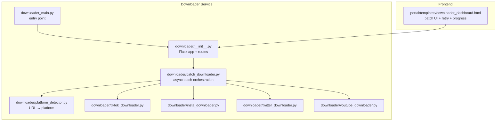
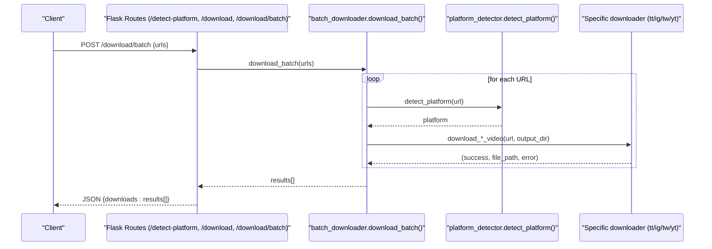
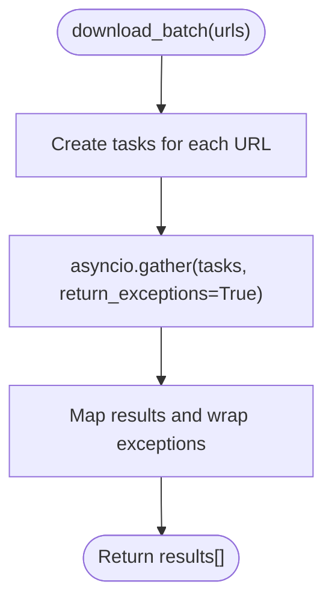
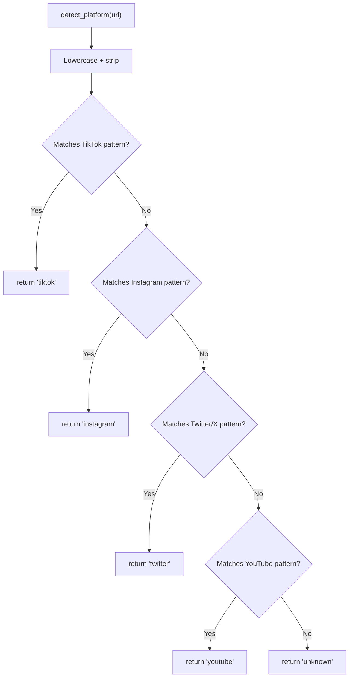
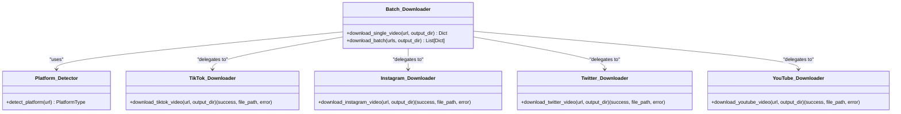
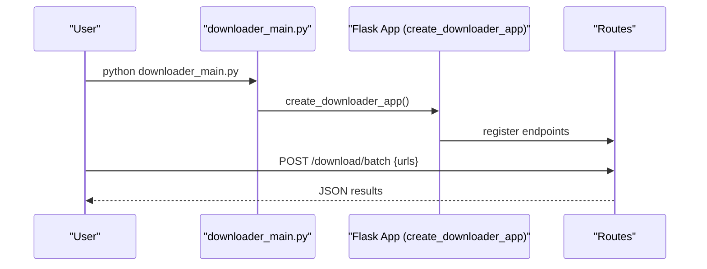
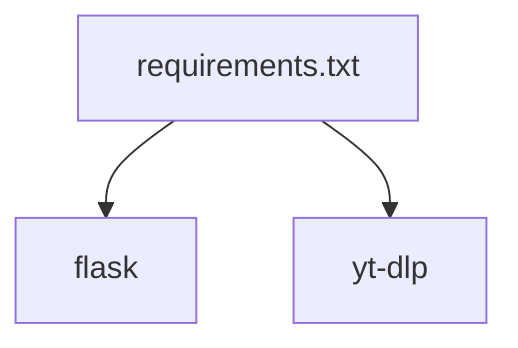

# Batch Processing

<cite>
**Referenced Files in This Document**
- [downloader_main.py](file://downloader_main.py)
- [downloader/__init__.py](file://downloader/__init__.py)
- [downloader/batch_downloader.py](file://downloader/batch_downloader.py)
- [downloader/platform_detector.py](file://downloader/platform_detector.py)
- [downloader/tiktok_downloader.py](file://downloader/tiktok_downloader.py)
- [downloader/insta_downloader.py](file://downloader/insta_downloader.py)
- [downloader/twitter_downloader.py](file://downloader/twitter_downloader.py)
- [downloader/youtube_downloader.py](file://downloader/youtube_downloader.py)
- [requirements.txt](file://requirements.txt)
- [portal/templates/downloader_dashboard.html](file://portal/templates/downloader_dashboard.html)
</cite>

## Table of Contents
1. [Introduction](#introduction)
2. [Project Structure](#project-structure)
3. [Core Components](#core-components)
4. [Architecture Overview](#architecture-overview)
5. [Detailed Component Analysis](#detailed-component-analysis)
6. [Dependency Analysis](#dependency-analysis)
7. [Performance Considerations](#performance-considerations)
8. [Troubleshooting Guide](#troubleshooting-guide)
9. [Conclusion](#conclusion)
10. [Appendices](#appendices)

## Introduction
This document describes the batch processing system for concurrent video downloads across multiple platforms. It explains the queue management model, the asynchronous concurrency architecture, and resource optimization strategies. It also covers the main downloader entry point, the command-line interface, batch configuration options, error handling and retry mechanisms, progress tracking, and practical examples for large-scale operations.

## Project Structure
The batch downloader is implemented as a Flask-based web service with an asynchronous API. The system exposes endpoints for single and batch downloads, detects platform per URL, and delegates to platform-specific downloaders powered by yt-dlp. The frontend integrates a retry mechanism and progress simulation for batch operations.

**Diagram sources**
- [downloader_main.py](file://downloader_main.py#L1-L10)
- [downloader/__init__.py](file://downloader/__init__.py#L13-L67)
- [downloader/batch_downloader.py](file://downloader/batch_downloader.py#L53-L83)
- [downloader/platform_detector.py](file://downloader/platform_detector.py#L12-L41)
- [downloader/tiktok_downloader.py](file://downloader/tiktok_downloader.py#L12-L47)
- [downloader/insta_downloader.py](file://downloader/insta_downloader.py#L11-L56)
- [downloader/twitter_downloader.py](file://downloader/twitter_downloader.py#L11-L46)
- [downloader/youtube_downloader.py](file://downloader/youtube_downloader.py#L11-L46)
- [portal/templates/downloader_dashboard.html](file://portal/templates/downloader_dashboard.html#L340-L383)

**Section sources**
- [downloader_main.py](file://downloader_main.py#L1-L10)
- [downloader/__init__.py](file://downloader/__init__.py#L13-L67)

## Core Components
- Asynchronous batch orchestrator: Creates concurrent tasks for each URL and aggregates results while handling exceptions.
- Platform detector: Identifies the platform from a URL to route to the correct downloader.
- Platform-specific downloaders: Each downloader encapsulates yt-dlp configuration tuned for the target platform.
- Flask API: Exposes endpoints for single and batch downloads, plus platform detection and a home endpoint.
- Frontend integration: Provides a UI that triggers batch requests, simulates progress, and retries failed items.

Key behaviors:
- Concurrency: Uses asyncio.gather to run all downloads concurrently.
- Error handling: Exceptions are captured and returned as structured results.
- Output: Results include success status, file path, error messages, and platform.

**Section sources**
- [downloader/batch_downloader.py](file://downloader/batch_downloader.py#L53-L83)
- [downloader/platform_detector.py](file://downloader/platform_detector.py#L12-L41)
- [downloader/tiktok_downloader.py](file://downloader/tiktok_downloader.py#L12-L47)
- [downloader/insta_downloader.py](file://downloader/insta_downloader.py#L11-L56)
- [downloader/twitter_downloader.py](file://downloader/twitter_downloader.py#L11-L46)
- [downloader/youtube_downloader.py](file://downloader/youtube_downloader.py#L11-L46)
- [downloader/__init__.py](file://downloader/__init__.py#L42-L66)

## Architecture Overview
The system follows a layered architecture:
- Entry point: downloader_main.py creates the Flask app via downloader.create_downloader_app().
- API layer: Routes handle platform detection, single download, and batch download.
- Orchestration layer: batch_downloader coordinates per-URL tasks and collects results.
- Platform layer: Each platform downloader encapsulates yt-dlp configuration and retry semantics.
- Storage layer: Outputs are written under configured directories.

**Diagram sources**
- [downloader/__init__.py](file://downloader/__init__.py#L55-L66)
- [downloader/batch_downloader.py](file://downloader/batch_downloader.py#L53-L83)
- [downloader/platform_detector.py](file://downloader/platform_detector.py#L12-L41)
- [downloader/tiktok_downloader.py](file://downloader/tiktok_downloader.py#L12-L47)
- [downloader/insta_downloader.py](file://downloader/insta_downloader.py#L11-L56)
- [downloader/twitter_downloader.py](file://downloader/twitter_downloader.py#L11-L46)
- [downloader/youtube_downloader.py](file://downloader/youtube_downloader.py#L11-L46)

## Detailed Component Analysis

### Batch Downloader Orchestration
Responsibilities:
- Convert each URL into a coroutine task.
- Execute tasks concurrently using asyncio.gather.
- Normalize exceptions into structured results.

Concurrency model:
- One asyncio task per URL.
- return_exceptions=True ensures partial failures do not crash the entire batch.

Resource optimization:
- Tasks are scheduled cooperatively; no explicit semaphore is used.
- Consider adding a semaphore to cap concurrent network operations for very large batches.

Error handling:
- Exceptions are captured and mapped to a result record with success=False and error details.

Output format:
- Each item includes url, success, file_path, error, and platform.

**Diagram sources**
- [downloader/batch_downloader.py](file://downloader/batch_downloader.py#L53-L83)

**Section sources**
- [downloader/batch_downloader.py](file://downloader/batch_downloader.py#L53-L83)

### Platform Detection
Responsibilities:
- Inspect URL patterns to determine platform.
- Supported platforms: tiktok, instagram, twitter, youtube.
- Unknown platform returns “unknown”.

**Diagram sources**
- [downloader/platform_detector.py](file://downloader/platform_detector.py#L12-L41)

**Section sources**
- [downloader/platform_detector.py](file://downloader/platform_detector.py#L12-L41)

### Platform-Specific Downloaders
Each downloader:
- Ensures output directory exists.
- Configures yt-dlp with platform-specific options.
- Returns a tuple indicating success, file path, and error message.

Common options:
- outtmpl: Places output under the configured raw storage directory.
- format and merge_output_format: Prefer mp4.
- retries and fragment_retries: Retries on transient failures.
- socket_timeout: Limits long hangs.
- Instagram additionally sets extended HTTP headers and higher timeouts/retries.

**Diagram sources**
- [downloader/batch_downloader.py](file://downloader/batch_downloader.py#L16-L51)
- [downloader/platform_detector.py](file://downloader/platform_detector.py#L12-L41)
- [downloader/tiktok_downloader.py](file://downloader/tiktok_downloader.py#L12-L47)
- [downloader/insta_downloader.py](file://downloader/insta_downloader.py#L11-L56)
- [downloader/twitter_downloader.py](file://downloader/twitter_downloader.py#L11-L46)
- [downloader/youtube_downloader.py](file://downloader/youtube_downloader.py#L11-L46)

**Section sources**
- [downloader/tiktok_downloader.py](file://downloader/tiktok_downloader.py#L12-L47)
- [downloader/insta_downloader.py](file://downloader/insta_downloader.py#L11-L56)
- [downloader/twitter_downloader.py](file://downloader/twitter_downloader.py#L11-L46)
- [downloader/youtube_downloader.py](file://downloader/youtube_downloader.py#L11-L46)

### Flask API and CLI Entrypoint
- Entrypoint: downloader_main.py creates the Flask app and runs it on host 0.0.0.0, port 8000.
- Routes:
  - GET /: Basic service info.
  - POST /detect-platform: Detect platform from a URL.
  - POST /download: Single video download.
  - POST /download/batch: Batch download.

CLI behavior:
- The script is executed directly to start the server locally.

**Diagram sources**
- [downloader_main.py](file://downloader_main.py#L9-L10)
- [downloader/__init__.py](file://downloader/__init__.py#L13-L67)

**Section sources**
- [downloader_main.py](file://downloader_main.py#L1-L10)
- [downloader/__init__.py](file://downloader/__init__.py#L13-L67)

### Frontend Integration and Retry Logic
The frontend supports:
- Queuing downloads (offline-capable).
- Triggering batch requests.
- Auto-retrying failed items once.
- Simulating progress bars.

Retry flow:
- After initial batch completion, failed URLs are extracted and retried once.
- Final results merge successes and retries.

Progress simulation:
- A simulated progress bar updates until completion.

**Section sources**
- [portal/templates/downloader_dashboard.html](file://portal/templates/downloader_dashboard.html#L340-L383)
- [portal/templates/downloader_dashboard.html](file://portal/templates/downloader_dashboard.html#L1710-L1735)

## Dependency Analysis
External dependencies include Flask for the web server and yt-dlp for media extraction. The batch downloader relies on asyncio for concurrency and yt-dlp options for robustness.

**Diagram sources**
- [requirements.txt](file://requirements.txt#L1-L18)

**Section sources**
- [requirements.txt](file://requirements.txt#L1-L18)

## Performance Considerations
- Concurrency: The current design launches one task per URL. For very large batches, consider bounding concurrency with a semaphore to avoid overwhelming network resources and rate limits.
- Timeouts and retries: yt-dlp options include retries and socket timeouts; tune these per platform and environment.
- Disk I/O: Ensure the output directory is on fast storage; pre-create directories to avoid blocking on first write.
- Memory footprint: Each downloader writes to disk via yt-dlp; avoid holding large buffers in memory.
- Network throttling: Respect platform rate limits; stagger start times if necessary.
- Monitoring: Track success rates and latency per platform to adjust configuration dynamically.

[No sources needed since this section provides general guidance]

## Troubleshooting Guide
Common issues and remedies:
- Unsupported platform: The detector returns “unknown”; verify URL patterns and update detection rules if needed.
- Download completed but file not found: Indicates a mismatch between yt-dlp’s reported filename and actual file presence; check output directory permissions and disk space.
- Transient network errors: Increase retries and socket timeouts; consider exponential backoff at the caller level.
- Authentication: Some platforms require cookies or headers; ensure credentials are present and valid.
- Progress reporting: The frontend simulates progress; real-time progress requires server-side streaming or polling endpoints.

**Section sources**
- [downloader/batch_downloader.py](file://downloader/batch_downloader.py#L72-L82)
- [downloader/tiktok_downloader.py](file://downloader/tiktok_downloader.py#L46-L47)
- [downloader/insta_downloader.py](file://downloader/insta_downloader.py#L55-L56)
- [downloader/twitter_downloader.py](file://downloader/twitter_downloader.py#L45-L46)
- [downloader/youtube_downloader.py](file://downloader/youtube_downloader.py#L45-L46)

## Conclusion
The batch processing system provides a concise, extensible foundation for concurrent video downloads across multiple platforms. Its asynchronous design enables efficient throughput, while platform-specific downloaders encapsulate robust extraction logic. For production-scale usage, consider adding concurrency limits, improved progress reporting, and enhanced retry/backoff strategies.

[No sources needed since this section summarizes without analyzing specific files]

## Appendices

### Example Workflows
- Single download: POST /download with a single URL.
- Batch download: POST /download/batch with an array of URLs.
- Platform detection: POST /detect-platform with a URL to identify the platform.

### Batch Configuration Options
- Output directory: Configured in the downloader package initialization and per-downloader options.
- Retries and timeouts: Defined in platform-specific downloader options.
- Headers and cookies: Instagram downloader includes HTTP headers; extend similarly for other platforms as needed.

**Section sources**
- [downloader/__init__.py](file://downloader/__init__.py#L17-L19)
- [downloader/tiktok_downloader.py](file://downloader/tiktok_downloader.py#L27-L35)
- [downloader/insta_downloader.py](file://downloader/insta_downloader.py#L26-L44)
- [downloader/twitter_downloader.py](file://downloader/twitter_downloader.py#L26-L34)
- [downloader/youtube_downloader.py](file://downloader/youtube_downloader.py#L26-L34)