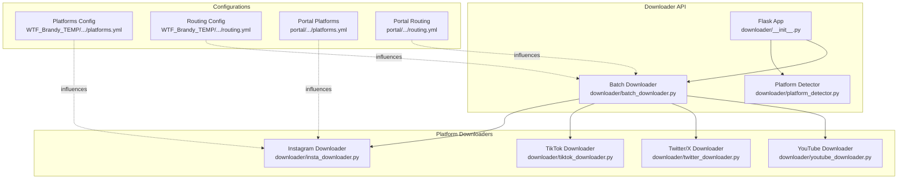
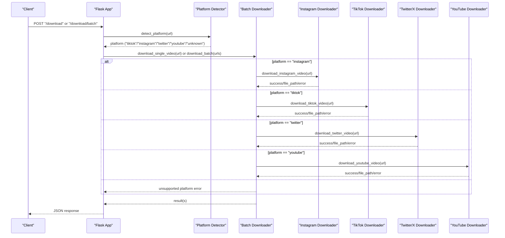
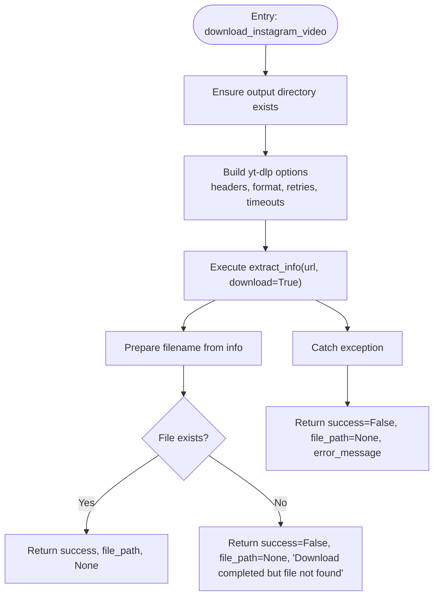
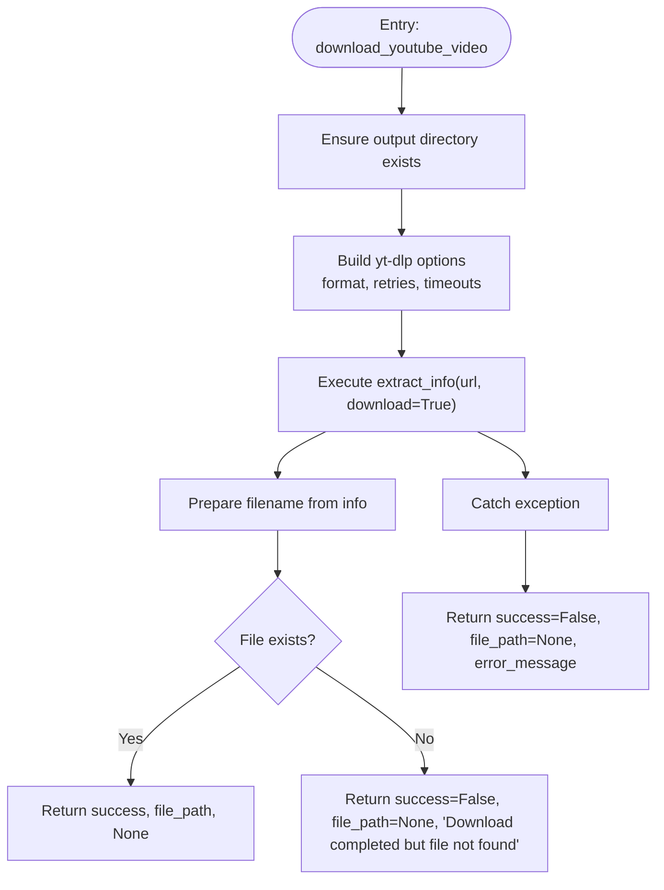
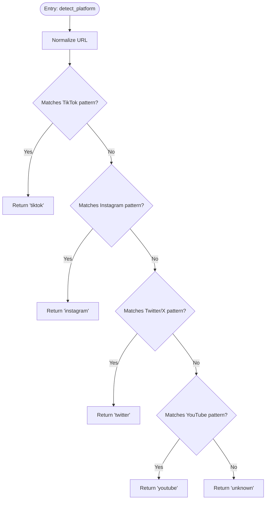
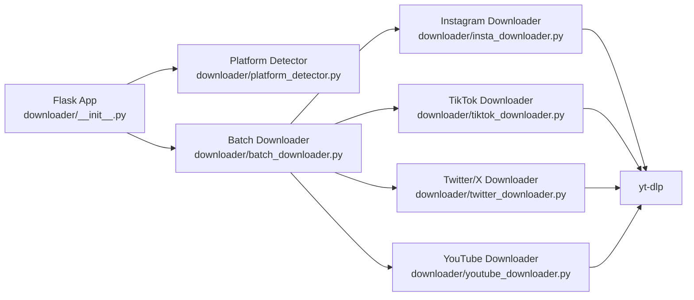

# Individual Platform Downloaders

<cite>
**Referenced Files in This Document**
- [downloader/__init__.py](file://downloader/__init__.py)
- [downloader/platform_detector.py](file://downloader/platform_detector.py)
- [downloader/batch_downloader.py](file://downloader/batch_downloader.py)
- [downloader/insta_downloader.py](file://downloader/insta_downloader.py)
- [downloader/tiktok_downloader.py](file://downloader/tiktok_downloader.py)
- [downloader/twitter_downloader.py](file://downloader/twitter_downloader.py)
- [downloader/youtube_downloader.py](file://downloader/youtube_downloader.py)
- [requirements.txt](file://requirements.txt)
- [WTF_Brandy_TEMP/wtf_brands/wtf_orchestrator/platforms.yml](file://WTF_Brandy_TEMP/wtf_brands/wtf_orchestrator/platforms.yml)
- [WTF_Brandy_TEMP/wtf_brands/wtf_orchestrator/routing.yml](file://WTF_Brandy_TEMP/wtf_brands/wtf_orchestrator/routing.yml)
- [portal/wtf_brands/wtf_orchestrator/platforms.yml](file://portal/wtf_brands/wtf_orchestrator/platforms.yml)
- [portal/wtf_brands/wtf_orchestrator/routing.yml](file://portal/wtf_brands/wtf_orchestrator/routing.yml)
- [downloader_main.py](file://downloader_main.py)
</cite>

## Table of Contents
1. [Introduction](#introduction)
2. [Project Structure](#project-structure)
3. [Core Components](#core-components)
4. [Architecture Overview](#architecture-overview)
5. [Detailed Component Analysis](#detailed-component-analysis)
6. [Dependency Analysis](#dependency-analysis)
7. [Performance Considerations](#performance-considerations)
8. [Troubleshooting Guide](#troubleshooting-guide)
9. [Conclusion](#conclusion)
10. [Appendices](#appendices)

## Introduction
This document provides comprehensive technical and practical documentation for the specialized downloaders used by the WTF Downloader application. It focuses on the Instagram, TikTok, Twitter/X, and YouTube downloaders, detailing their authentication handling, cookie management, anti-bot detection bypass strategies, API integration, video extraction logic, playlist support, format conversion capabilities, platform-specific configuration options, error handling strategies, and troubleshooting guides. The goal is to enable both developers and operators to understand, deploy, and maintain the downloader subsystem effectively.

## Project Structure
The downloader subsystem is organized around a small set of cohesive modules:
- A Flask-based HTTP API that exposes platform detection and download endpoints
- A platform detector that identifies the target platform from a URL
- A batch downloader that orchestrates single and concurrent downloads
- Platform-specific downloader modules built on yt-dlp
- YAML configuration files that define platform capabilities and routing rules
- Application entry points for local development and deployment

**Diagram sources**
- [downloader/__init__.py](file://downloader/__init__.py#L13-L68)
- [downloader/platform_detector.py](file://downloader/platform_detector.py#L12-L41)
- [downloader/batch_downloader.py](file://downloader/batch_downloader.py#L16-L83)
- [downloader/insta_downloader.py](file://downloader/insta_downloader.py#L11-L56)
- [downloader/tiktok_downloader.py](file://downloader/tiktok_downloader.py#L12-L47)
- [downloader/twitter_downloader.py](file://downloader/twitter_downloader.py#L11-L46)
- [downloader/youtube_downloader.py](file://downloader/youtube_downloader.py#L11-L46)
- [WTF_Brandy_TEMP/wtf_brands/wtf_orchestrator/platforms.yml](file://WTF_Brandy_TEMP/wtf_brands/wtf_orchestrator/platforms.yml#L1-L267)
- [WTF_Brandy_TEMP/wtf_brands/wtf_orchestrator/routing.yml](file://WTF_Brandy_TEMP/wtf_brands/wtf_orchestrator/routing.yml#L1-L235)
- [portal/wtf_brands/wtf_orchestrator/platforms.yml](file://portal/wtf_brands/wtf_orchestrator/platforms.yml#L1-L267)
- [portal/wtf_brands/wtf_orchestrator/routing.yml](file://portal/wtf_brands/wtf_orchestrator/routing.yml#L1-L235)

**Section sources**
- [downloader/__init__.py](file://downloader/__init__.py#L13-L68)
- [downloader/platform_detector.py](file://downloader/platform_detector.py#L12-L41)
- [downloader/batch_downloader.py](file://downloader/batch_downloader.py#L16-L83)
- [WTF_Brandy_TEMP/wtf_brands/wtf_orchestrator/platforms.yml](file://WTF_Brandy_TEMP/wtf_brands/wtf_orchestrator/platforms.yml#L1-L267)
- [WTF_Brandy_TEMP/wtf_brands/wtf_orchestrator/routing.yml](file://WTF_Brandy_TEMP/wtf_brands/wtf_orchestrator/routing.yml#L1-L235)
- [portal/wtf_brands/wtf_orchestrator/platforms.yml](file://portal/wtf_brands/wtf_orchestrator/platforms.yml#L1-L267)
- [portal/wtf_brands/wtf_orchestrator/routing.yml](file://portal/wtf_brands/wtf_orchestrator/routing.yml#L1-L235)

## Core Components
- Flask API entrypoint that initializes storage directories, exposes health and detection endpoints, and routes to download handlers
- Platform detection logic that matches URLs against known platform patterns
- Batch downloader that dispatches to platform-specific downloaders and manages concurrency
- Platform-specific downloaders that encapsulate yt-dlp configuration per platform

Key responsibilities:
- URL platform detection
- Single and batch download orchestration
- yt-dlp configuration and error propagation
- Output path management and file existence verification

**Section sources**
- [downloader/__init__.py](file://downloader/__init__.py#L13-L68)
- [downloader/platform_detector.py](file://downloader/platform_detector.py#L12-L41)
- [downloader/batch_downloader.py](file://downloader/batch_downloader.py#L16-L83)

## Architecture Overview
The downloader architecture follows a modular design:
- HTTP API layer handles requests and delegates to the platform detector and batch downloader
- Platform detector inspects the URL and returns a platform identifier
- Batch downloader selects the appropriate downloader module and executes downloads
- Each platform downloader uses yt-dlp with platform-specific options

**Diagram sources**
- [downloader/__init__.py](file://downloader/__init__.py#L30-L66)
- [downloader/platform_detector.py](file://downloader/platform_detector.py#L12-L41)
- [downloader/batch_downloader.py](file://downloader/batch_downloader.py#L16-L83)
- [downloader/insta_downloader.py](file://downloader/insta_downloader.py#L11-L56)
- [downloader/tiktok_downloader.py](file://downloader/tiktok_downloader.py#L12-L47)
- [downloader/twitter_downloader.py](file://downloader/twitter_downloader.py#L11-L46)
- [downloader/youtube_downloader.py](file://downloader/youtube_downloader.py#L11-L46)

## Detailed Component Analysis

### Instagram Downloader
Purpose:
- Download Instagram videos using yt-dlp with Instagram-appropriate headers and options

Key characteristics:
- Uses a dedicated yt-dlp configuration with headers that mimic an Instagram mobile client
- Ensures output directory creation and validates post-download file existence
- Returns structured results with success flag, file path, and error message

Authentication and cookie handling:
- The current implementation does not explicitly inject cookies or manage session tokens
- Authentication-sensitive content may require external cookie management outside this module
- The presence of frontend UI elements for cookie deletion indicates a potential separation of concerns for cookie handling elsewhere in the stack

Anti-bot detection:
- Uses Instagram-like User-Agent and headers to emulate a native client
- Relies on yt-dlp’s internal mechanisms for robust fetching

Video extraction logic:
- Configures output template, merge format, retries, fragment retries, and socket timeout
- Extracts metadata and prepares the output filename before verifying file existence

Format conversion:
- Merges best available video and audio tracks into MP4
- Uses a fallback format string suitable for Instagram content

Platform-specific configuration options:
- Headers include User-Agent, X-IG-App-ID, Accept, Accept-Language, Accept-Encoding, Connection, and Upgrade-Insecure-Requests
- Output template places files under ./storage/raw/

Error handling:
- Catches exceptions and returns failure with the exception message
- Validates that the downloaded file exists after extraction

**Diagram sources**
- [downloader/insta_downloader.py](file://downloader/insta_downloader.py#L11-L56)

**Section sources**
- [downloader/insta_downloader.py](file://downloader/insta_downloader.py#L11-L56)

### TikTok Downloader
Purpose:
- Download TikTok videos using yt-dlp with platform-specific options

Key characteristics:
- Minimal configuration focused on MP4 output and basic retry controls
- Designed for speed and simplicity with reduced overhead compared to Instagram

Anti-bot detection bypass:
- No explicit headers or user-agent customization in the current implementation
- Relies on yt-dlp’s internal mechanisms and network resilience

Watermark handling:
- No explicit watermark removal logic in this module
- Watermark handling may be addressed downstream in the video processing pipeline

Video extraction logic:
- Configures output template, format, merge output format, retries, fragment retries, and socket timeout
- Validates post-download file existence

Format conversion:
- Outputs MP4 by default

Platform-specific configuration options:
- Output template places files under ./storage/raw/
- Conservative retry and timeout settings

Error handling:
- Catches exceptions and returns failure with the exception message
- Validates that the downloaded file exists after extraction

**Diagram sources**
- [downloader/tiktok_downloader.py](file://downloader/tiktok_downloader.py#L12-L47)

**Section sources**
- [downloader/tiktok_downloader.py](file://downloader/tiktok_downloader.py#L12-L47)

### Twitter/X Downloader
Purpose:
- Download Twitter/X videos using yt-dlp with platform-specific options

Key characteristics:
- Minimal configuration similar to TikTok, optimized for MP4 output
- Designed for straightforward video retrieval

API integration:
- Delegates to yt-dlp for metadata extraction and download
- No custom Twitter/X API calls in this module

Video quality selection:
- Uses a fixed format string; quality selection is delegated to yt-dlp’s internal logic

Video extraction logic:
- Configures output template, format, merge output format, retries, fragment retries, and socket timeout
- Validates post-download file existence

Format conversion:
- Outputs MP4 by default

Platform-specific configuration options:
- Output template places files under ./storage/raw/

Error handling:
- Catches exceptions and returns failure with the exception message
- Validates that the downloaded file exists after extraction

**Diagram sources**
- [downloader/twitter_downloader.py](file://downloader/twitter_downloader.py#L11-L46)

**Section sources**
- [downloader/twitter_downloader.py](file://downloader/twitter_downloader.py#L11-L46)

### YouTube Downloader
Purpose:
- Download YouTube videos using yt-dlp with platform-specific options

Key characteristics:
- Minimal configuration optimized for MP4 output
- Designed for straightforward video retrieval

Playlist support:
- The current implementation focuses on single video downloads
- Playlist handling is not implemented in this module

Format conversion:
- Outputs MP4 by default

Video extraction logic:
- Configures output template, format, merge output format, retries, fragment retries, and socket timeout
- Validates post-download file existence

Platform-specific configuration options:
- Output template places files under ./storage/raw/

Error handling:
- Catches exceptions and returns failure with the exception message
- Validates that the downloaded file exists after extraction

**Diagram sources**
- [downloader/youtube_downloader.py](file://downloader/youtube_downloader.py#L11-L46)

**Section sources**
- [downloader/youtube_downloader.py](file://downloader/youtube_downloader.py#L11-L46)

### Platform Detection and Routing
Detection logic:
- Matches URLs against patterns for TikTok, Instagram, Twitter/X, and YouTube
- Returns a platform identifier or “unknown”

Routing configuration:
- YAML files define platform capabilities, constraints, and filename patterns
- Routing files specify which platforms are enabled per brand and selection priority

**Diagram sources**
- [downloader/platform_detector.py](file://downloader/platform_detector.py#L12-L41)

**Section sources**
- [downloader/platform_detector.py](file://downloader/platform_detector.py#L12-L41)
- [WTF_Brandy_TEMP/wtf_brands/wtf_orchestrator/platforms.yml](file://WTF_Brandy_TEMP/wtf_brands/wtf_orchestrator/platforms.yml#L1-L267)
- [WTF_Brandy_TEMP/wtf_brands/wtf_orchestrator/routing.yml](file://WTF_Brandy_TEMP/wtf_brands/wtf_orchestrator/routing.yml#L1-L235)
- [portal/wtf_brands/wtf_orchestrator/platforms.yml](file://portal/wtf_brands/wtf_orchestrator/platforms.yml#L1-L267)
- [portal/wtf_brands/wtf_orchestrator/routing.yml](file://portal/wtf_brands/wtf_orchestrator/routing.yml#L1-L235)

## Dependency Analysis
External dependencies:
- yt-dlp is the primary dependency for all platform downloaders
- Flask is used for the HTTP API
- Additional libraries support web serving and related utilities

Internal dependencies:
- The Flask app depends on the platform detector and batch downloader
- The batch downloader depends on the platform-specific downloader modules
- Platform-specific downloaders depend on yt-dlp

**Diagram sources**
- [downloader/__init__.py](file://downloader/__init__.py#L13-L68)
- [downloader/batch_downloader.py](file://downloader/batch_downloader.py#L10-L14)
- [requirements.txt](file://requirements.txt#L13-L13)

**Section sources**
- [requirements.txt](file://requirements.txt#L1-L18)
- [downloader/__init__.py](file://downloader/__init__.py#L13-L68)
- [downloader/batch_downloader.py](file://downloader/batch_downloader.py#L10-L14)

## Performance Considerations
- Concurrency: The batch downloader uses asyncio.gather to execute multiple downloads concurrently, improving throughput for bulk operations
- Retries and timeouts: yt-dlp options include retries and fragment retries to improve reliability over unstable networks
- Output directory management: Ensures directories exist before writing to avoid I/O errors
- Minimal configuration: Platform-specific modules keep configuration lean to reduce overhead

Recommendations:
- Monitor network stability and adjust retry and timeout values based on environment
- Consider rate limiting at the platform level if encountering throttling
- For very large batches, consider queuing and backpressure strategies

[No sources needed since this section provides general guidance]

## Troubleshooting Guide
Common issues and resolutions:
- Unsupported platform: The platform detector returns “unknown” for unrecognized URLs; verify URL patterns and platform detection logic
- Download completes but file not found: Indicates yt-dlp succeeded but the expected file was not produced; check output directory permissions and path
- Exceptions during download: The downloader catches exceptions and returns error messages; review logs and network connectivity
- Authentication-sensitive content: Instagram downloader uses Instagram-like headers but does not inject cookies; ensure cookies are managed externally if required
- Anti-bot detection: For TikTok and Twitter/X, consider adding headers or user-agent customization if encountering blocks
- Playlist support: YouTube downloader currently supports single video downloads; playlist handling is not implemented in this module

Operational tips:
- Use the Flask API endpoints to test detection and downloads
- Verify storage directories exist and are writable
- For Instagram, ensure the environment supports external cookie management if needed

**Section sources**
- [downloader/platform_detector.py](file://downloader/platform_detector.py#L12-L41)
- [downloader/batch_downloader.py](file://downloader/batch_downloader.py#L16-L83)
- [downloader/insta_downloader.py](file://downloader/insta_downloader.py#L11-L56)
- [downloader/tiktok_downloader.py](file://downloader/tiktok_downloader.py#L12-L47)
- [downloader/twitter_downloader.py](file://downloader/twitter_downloader.py#L11-L46)
- [downloader/youtube_downloader.py](file://downloader/youtube_downloader.py#L11-L46)

## Conclusion
The WTF Downloader’s platform-specific downloaders are thin wrappers around yt-dlp, each tailored to a platform’s characteristics. Instagram leverages app-like headers, while TikTok, Twitter/X, and YouTube use minimal configurations optimized for reliability and simplicity. The system integrates a platform detector and batch downloader to orchestrate single and concurrent downloads. While the current implementation focuses on single video downloads and does not include explicit cookie injection or watermark removal logic, it provides a solid foundation for extending authentication handling, anti-bot strategies, and advanced processing steps in downstream modules.

[No sources needed since this section summarizes without analyzing specific files]

## Appendices
- Application entry point for local development and deployment
- Configuration files for platform capabilities and brand routing

**Section sources**
- [downloader_main.py](file://downloader_main.py#L1-L10)
- [WTF_Brandy_TEMP/wtf_brands/wtf_orchestrator/platforms.yml](file://WTF_Brandy_TEMP/wtf_brands/wtf_orchestrator/platforms.yml#L1-L267)
- [WTF_Brandy_TEMP/wtf_brands/wtf_orchestrator/routing.yml](file://WTF_Brandy_TEMP/wtf_brands/wtf_orchestrator/routing.yml#L1-L235)
- [portal/wtf_brands/wtf_orchestrator/platforms.yml](file://portal/wtf_brands/wtf_orchestrator/platforms.yml#L1-L267)
- [portal/wtf_brands/wtf_orchestrator/routing.yml](file://portal/wtf_brands/wtf_orchestrator/routing.yml#L1-L235)