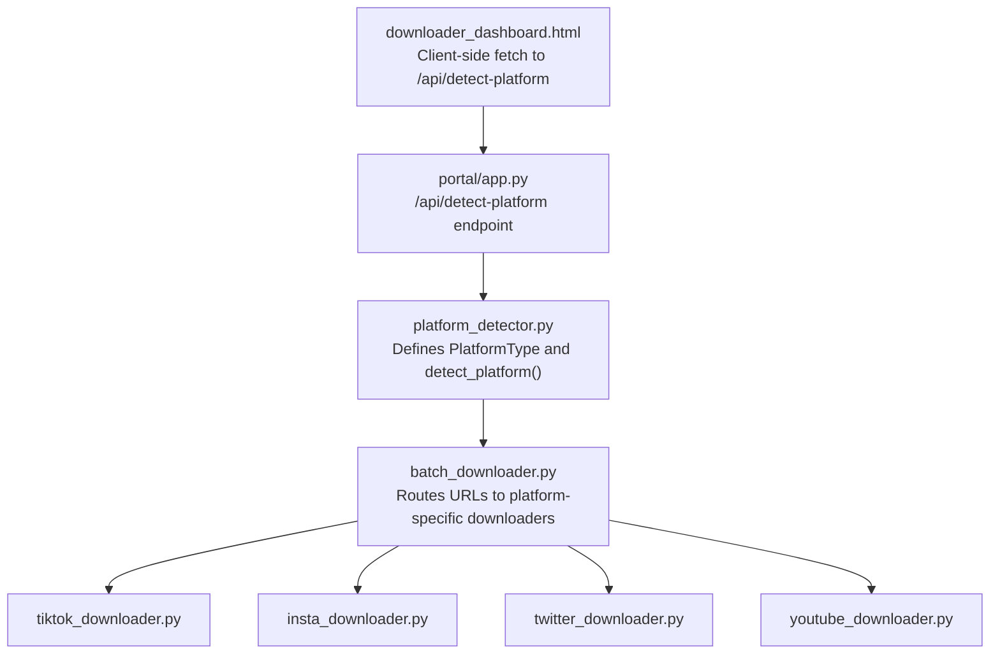
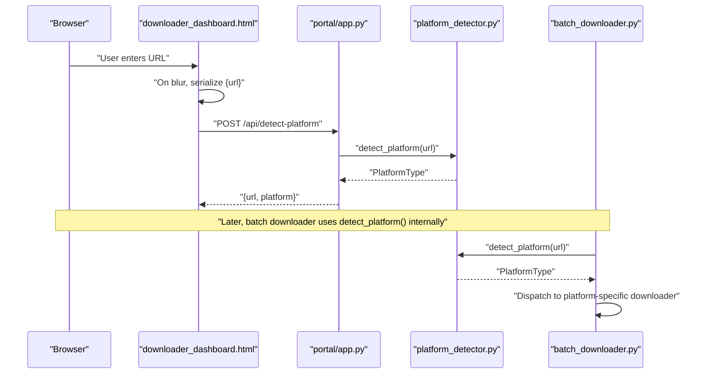
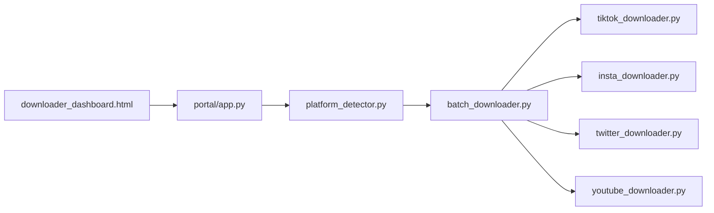

# Platform Detection

<cite>
**Referenced Files in This Document**
- [platform_detector.py](file://downloader/platform_detector.py)
- [batch_downloader.py](file://downloader/batch_downloader.py)
- [tiktok_downloader.py](file://downloader/tiktok_downloader.py)
- [insta_downloader.py](file://downloader/insta_downloader.py)
- [twitter_downloader.py](file://downloader/twitter_downloader.py)
- [youtube_downloader.py](file://downloader/youtube_downloader.py)
- [app.py](file://portal/app.py)
- [downloader_dashboard.html](file://portal/templates/downloader_dashboard.html)
- [routing.yml](file://portal/wtf_brands/wtf_orchestrator/routing.yml)
- [routing.yml](file://imports/brands/wtf_orchestrator/routing.yml)
</cite>

## Table of Contents
1. [Introduction](#introduction)
2. [Project Structure](#project-structure)
3. [Core Components](#core-components)
4. [Architecture Overview](#architecture-overview)
5. [Detailed Component Analysis](#detailed-component-analysis)
6. [Dependency Analysis](#dependency-analysis)
7. [Performance Considerations](#performance-considerations)
8. [Troubleshooting Guide](#troubleshooting-guide)
9. [Conclusion](#conclusion)
10. [Appendices](#appendices)

## Introduction
This document explains the platform detection system that identifies social media platforms from URLs. It focuses on the regex-based detection logic for TikTok, Instagram, Twitter, and YouTube, details the platform type enumeration, URL normalization behavior, and outlines detection accuracy and robustness. It also provides examples of supported URL formats, common edge cases, troubleshooting guidance for unknown platform detection, and guidance for extending the system to support additional platforms.

## Project Structure
The platform detection capability is implemented as a standalone module and integrated into both the portal web API and the downloader package. The detection logic is reused by the batch downloader to route URLs to platform-specific downloaders.

**Diagram sources**
- [platform_detector.py](file://downloader/platform_detector.py#L10-L41)
- [batch_downloader.py](file://downloader/batch_downloader.py#L10-L51)
- [tiktok_downloader.py](file://downloader/tiktok_downloader.py#L12-L47)
- [insta_downloader.py](file://downloader/insta_downloader.py#L11-L56)
- [twitter_downloader.py](file://downloader/twitter_downloader.py#L11-L46)
- [youtube_downloader.py](file://downloader/youtube_downloader.py#L11-L46)
- [app.py](file://portal/app.py#L1263-L1277)
- [downloader_dashboard.html](file://portal/templates/downloader_dashboard.html#L413-L427)

**Section sources**
- [platform_detector.py](file://downloader/platform_detector.py#L10-L41)
- [batch_downloader.py](file://downloader/batch_downloader.py#L10-L51)
- [app.py](file://portal/app.py#L1263-L1277)
- [downloader_dashboard.html](file://portal/templates/downloader_dashboard.html#L413-L427)

## Core Components
- PlatformType enumeration: A literal type that restricts accepted platform identifiers to predefined values, including a fallback “unknown” value.
- detect_platform(url): A function that normalizes the URL (lowercase and strip whitespace) and applies regex checks to identify the platform. It returns one of the enumerated values.
- Integration points:
  - Web API endpoint (/api/detect-platform) that accepts a JSON payload with a URL field and returns the detected platform.
  - Client-side JavaScript that triggers detection on URL input blur and logs the result.
  - Batch downloader that uses detect_platform to route URLs to platform-specific downloaders.

Key behaviors:
- URL normalization: Lowercase and trimming whitespace to improve matching robustness.
- Regex-based matching: Uses anchored patterns to match domain and path segments for each platform.
- Unknown platform handling: Returns “unknown” when no pattern matches.

**Section sources**
- [platform_detector.py](file://downloader/platform_detector.py#L10-L41)
- [app.py](file://portal/app.py#L1263-L1277)
- [downloader_dashboard.html](file://portal/templates/downloader_dashboard.html#L413-L427)
- [batch_downloader.py](file://downloader/batch_downloader.py#L27-L43)

## Architecture Overview
The detection pipeline consists of a client-side trigger, a server endpoint, and a shared detection module. The batch downloader reuses the same detection logic to route workloads to platform-specific downloaders.

**Diagram sources**
- [downloader_dashboard.html](file://portal/templates/downloader_dashboard.html#L413-L427)
- [app.py](file://portal/app.py#L1263-L1277)
- [platform_detector.py](file://downloader/platform_detector.py#L12-L41)
- [batch_downloader.py](file://downloader/batch_downloader.py#L27-L51)

## Detailed Component Analysis

### Platform Type Enumeration
- Purpose: Enforce compile-time and runtime safety for platform identifiers.
- Values: "tiktok", "instagram", "twitter", "youtube", "unknown".
- Usage: Returned by detect_platform and consumed by downstream components.

**Section sources**
- [platform_detector.py](file://downloader/platform_detector.py#L10)

### URL Normalization Process
- Behavior: Convert the input URL to lowercase and strip leading/trailing whitespace.
- Impact: Ensures consistent matching regardless of case or minor spacing differences.

**Section sources**
- [platform_detector.py](file://downloader/platform_detector.py#L22)

### Detection Algorithm and Supported Formats
The detection logic uses anchored regular expressions to match platform domains and typical path prefixes. The order of checks determines precedence.

- TikTok
  - Pattern: Matches optional scheme, optional www subdomain, and the domain segment followed by a path separator.
  - Examples covered:
    - https://www.tiktok.com/@user/video/123456789
    - http://tiktok.com/@user/video/123456789
    - tiktok.com/@user/video/123456789
- Instagram
  - Pattern: Matches optional scheme, optional www subdomain, and the domain segment followed by a path separator.
  - Examples covered:
    - https://www.instagram.com/p/postId/
    - http://instagram.com/p/postId/
    - instagram.com/p/postId/
- Twitter/X
  - Pattern: Matches optional scheme, optional www subdomain, and either the twitter.com or x.com domain segment followed by a path separator.
  - Examples covered:
    - https://www.twitter.com/statuses/123456789
    - http://x.com/statuses/123456789
    - twitter.com/statuses/123456789
    - x.com/statuses/123456789
- YouTube
  - Patterns:
    - youtube.com with a path separator.
    - youtu.be short domain with a path separator.
  - Examples covered:
    - https://www.youtube.com/watch?v=videoId
    - http://youtu.be/videoId
    - youtube.com/watch?v=videoId

Robustness characteristics:
- Scheme flexibility: Accepts both http and https.
- Subdomain flexibility: Handles optional www subdomain.
- Path anchoring: Requires a trailing slash after the domain to reduce false positives.
- Short-domain support: Explicitly supports youtu.be for YouTube.

Edge cases handled by current logic:
- Mixed case in URL: Normalization ensures consistent matching.
- Extra spaces around URL: Stripping prevents regex mismatches.
- Non-video paths: Path anchoring reduces false positives for non-media pages.

Limitations and potential improvements:
- Does not enforce strict ID parsing; any path after the domain separator suffices for detection.
- Does not validate query parameters or fragment identifiers.
- Adding stricter path anchors (e.g., /@user/, /p/, /watch?) could further reduce false positives.

**Section sources**
- [platform_detector.py](file://downloader/platform_detector.py#L24-L39)

### Web API Integration
- Endpoint: POST /api/detect-platform
- Request: JSON with a url field.
- Response: JSON with url and platform fields.
- Error handling: Returns 400 if url is missing; wraps exceptions and returns 500 with error details.

Client-side integration:
- On URL input blur, the UI sends a POST request to the endpoint and logs the detected platform.

**Section sources**
- [app.py](file://portal/app.py#L1263-L1277)
- [downloader_dashboard.html](file://portal/templates/downloader_dashboard.html#L413-L427)

### Downloader Integration
- The batch downloader calls detect_platform for each URL and routes to the appropriate platform-specific downloader.
- If the platform is “unknown”, the downloader reports an unsupported platform error.

**Section sources**
- [batch_downloader.py](file://downloader/batch_downloader.py#L27-L51)

### Platform-Specific Downloaders
Each downloader module encapsulates yt-dlp configuration tailored to the platform’s public API behavior:
- TikTok: Basic mp4 format selection with retries.
- Instagram: Enhanced format selection and Android-like HTTP headers to handle protected content.
- Twitter/X: Basic mp4 format selection with retries.
- YouTube: Basic mp4 format selection with retries.

These modules are invoked by the batch downloader after platform detection.

**Section sources**
- [tiktok_downloader.py](file://downloader/tiktok_downloader.py#L27-L35)
- [insta_downloader.py](file://downloader/insta_downloader.py#L26-L44)
- [twitter_downloader.py](file://downloader/twitter_downloader.py#L26-L34)
- [youtube_downloader.py](file://downloader/youtube_downloader.py#L26-L34)

## Dependency Analysis
The detection logic is centralized and reused across components, minimizing duplication and ensuring consistent behavior.

**Diagram sources**
- [platform_detector.py](file://downloader/platform_detector.py#L10-L41)
- [batch_downloader.py](file://downloader/batch_downloader.py#L10-L14)
- [tiktok_downloader.py](file://downloader/tiktok_downloader.py#L12-L47)
- [insta_downloader.py](file://downloader/insta_downloader.py#L11-L56)
- [twitter_downloader.py](file://downloader/twitter_downloader.py#L11-L46)
- [youtube_downloader.py](file://downloader/youtube_downloader.py#L11-L46)
- [app.py](file://portal/app.py#L1263-L1277)
- [downloader_dashboard.html](file://portal/templates/downloader_dashboard.html#L413-L427)

**Section sources**
- [platform_detector.py](file://downloader/platform_detector.py#L10-L41)
- [batch_downloader.py](file://downloader/batch_downloader.py#L10-L14)
- [app.py](file://portal/app.py#L1263-L1277)

## Performance Considerations
- Regex complexity: The detection uses simple anchored patterns with minimal backtracking, resulting in O(n) time per URL where n is the length of the normalized URL string.
- Memory footprint: The detection is stateless and lightweight, requiring negligible memory.
- Throughput: For batch operations, the primary bottleneck is network latency and platform APIs, not the detection step itself.

[No sources needed since this section provides general guidance]

## Troubleshooting Guide
Common issues and resolutions:
- Empty or missing URL:
  - Symptom: Server returns an error indicating URL is required.
  - Resolution: Ensure the client sends a JSON payload with a non-empty url field.
  - Section sources
    - [app.py](file://portal/app.py#L1270-L1271)
- Unknown platform returned:
  - Symptom: Response platform is “unknown”.
  - Causes:
    - URL does not match any supported pattern (e.g., custom domain, typo).
    - Missing scheme or unexpected path structure.
  - Resolution:
    - Verify the URL matches supported formats documented below.
    - Ensure the URL is not truncated or missing the trailing slash after the domain.
  - Section sources
    - [platform_detector.py](file://downloader/platform_detector.py#L39-L41)
- Client-side detection not triggering:
  - Symptom: No detection result logged.
  - Causes: Input field not blurred or network error.
  - Resolution: Confirm the input loses focus and inspect browser console for fetch errors.
  - Section sources
    - [downloader_dashboard.html](file://portal/templates/downloader_dashboard.html#L413-L427)
- Unsupported platform in downloader:
  - Symptom: Download fails with an unsupported platform error.
  - Resolution: The URL likely does not match supported patterns. Adjust the URL or extend detection.
  - Section sources
    - [batch_downloader.py](file://downloader/batch_downloader.py#L37-L43)

## Conclusion
The platform detection system provides a concise, robust mechanism for identifying TikTok, Instagram, Twitter/X, and YouTube URLs using anchored regex patterns. Its integration with the web API and downloader ensures consistent behavior across UI and backend workflows. The design is extensible, enabling straightforward addition of new platforms by updating the detection module and corresponding downloader.

## Appendices

### Supported URL Formats Reference
- TikTok
  - Example: tiktok.com/@user/video/123456789
  - Variants: With or without scheme and optional www subdomain.
- Instagram
  - Example: instagram.com/p/postId/
  - Variants: With or without scheme and optional www subdomain.
- Twitter/X
  - Example: twitter.com/statuses/123456789
  - Alternative: x.com/statuses/123456789
  - Variants: With or without scheme and optional www subdomain.
- YouTube
  - Example: youtube.com/watch?v=videoId
  - Alternative: youtu.be/videoId
  - Variants: With or without scheme and optional www subdomain.

### Extensibility Guide: Adding a New Platform
Steps to extend the system:
1. Update the detection module:
   - Add a new branch in the detection function with a platform-specific regex pattern.
   - Extend the PlatformType literal to include the new platform.
2. Implement a platform-specific downloader module:
   - Create a new downloader module with yt-dlp configuration optimized for the platform.
3. Integrate with the batch downloader:
   - Add a new branch in the batch downloader to dispatch to the new downloader when the platform is detected.
4. Update the web API:
   - Ensure the API endpoint continues to return the new platform identifier.
5. Test:
   - Validate supported URL formats and edge cases.
   - Confirm client-side detection updates accordingly.

Example integration points:
- Detection update: [platform_detector.py](file://downloader/platform_detector.py#L24-L39)
- PlatformType definition: [platform_detector.py](file://downloader/platform_detector.py#L10)
- Downloader routing: [batch_downloader.py](file://downloader/batch_downloader.py#L29-L36)
- API endpoint: [app.py](file://portal/app.py#L1263-L1277)