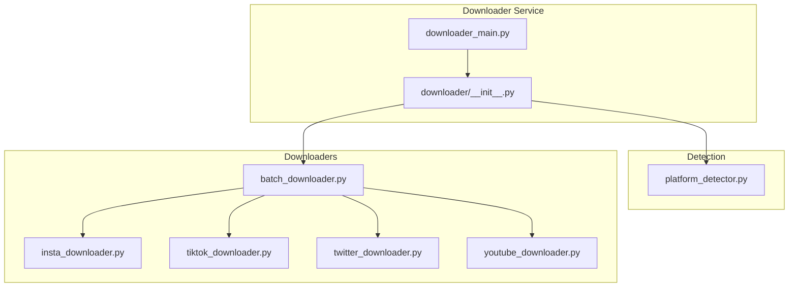
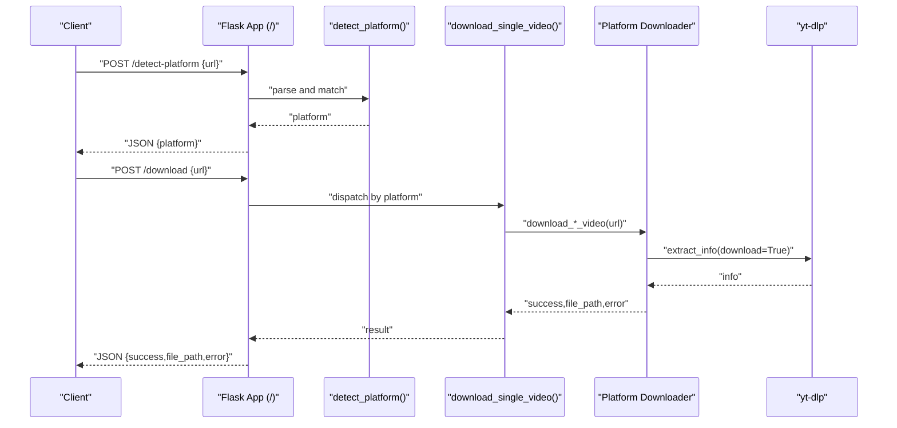
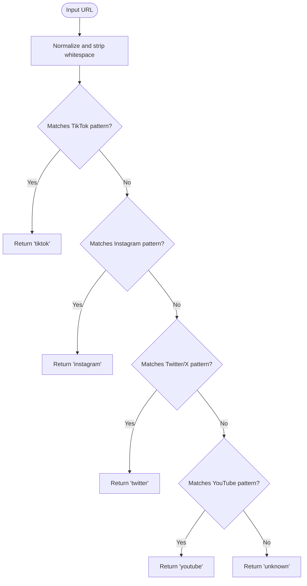
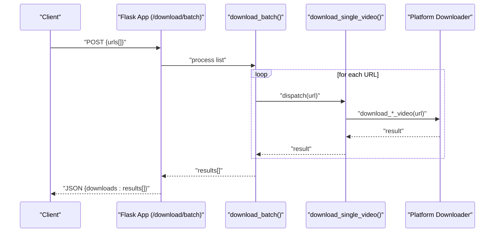
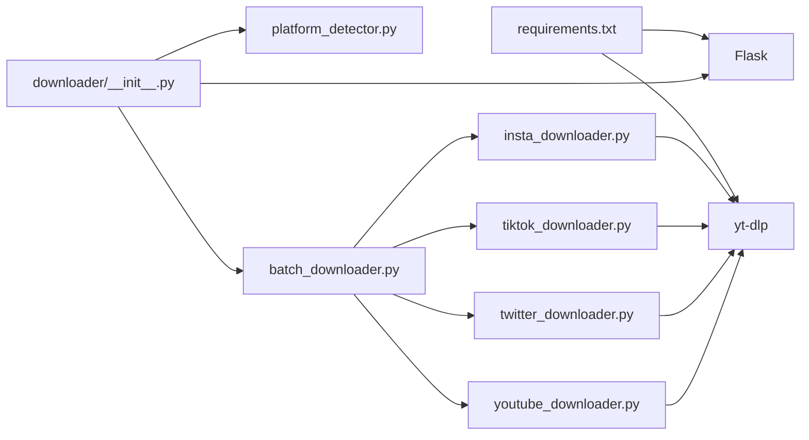

# Social Media Integration

<cite>
**Referenced Files in This Document**
- [downloader_main.py](file://downloader_main.py)
- [downloader/__init__.py](file://downloader/__init__.py)
- [downloader/platform_detector.py](file://downloader/platform_detector.py)
- [downloader/batch_downloader.py](file://downloader/batch_downloader.py)
- [downloader/insta_downloader.py](file://downloader/insta_downloader.py)
- [downloader/tiktok_downloader.py](file://downloader/tiktok_downloader.py)
- [downloader/twitter_downloader.py](file://downloader/twitter_downloader.py)
- [downloader/youtube_downloader.py](file://downloader/youtube_downloader.py)
- [requirements.txt](file://requirements.txt)
- [WTF_Brandy_TEMP/wtf_brands/wtf_orchestrator/platforms.yml](file://WTF_Brandy_TEMP/wtf_brands/wtf_orchestrator/platforms.yml)
- [test_ytdlp.py](file://test_ytdlp.py)
</cite>

## Table of Contents
1. [Introduction](#introduction)
2. [Project Structure](#project-structure)
3. [Core Components](#core-components)
4. [Architecture Overview](#architecture-overview)
5. [Detailed Component Analysis](#detailed-component-analysis)
6. [Dependency Analysis](#dependency-analysis)
7. [Performance Considerations](#performance-considerations)
8. [Troubleshooting Guide](#troubleshooting-guide)
9. [Conclusion](#conclusion)
10. [Appendices](#appendices)

## Introduction
This document describes the social media integration system responsible for detecting supported platforms, processing URLs, and downloading videos directly from Instagram, TikTok, Twitter/X, and YouTube. It explains the platform detection mechanism, URL processing workflows, file management, and the individual downloader implementations. It also covers batch processing capabilities, yt-dlp integration, authentication handling, error management, and practical examples for programmatic usage and troubleshooting.

## Project Structure
The downloader subsystem is organized around a Flask web service that exposes endpoints for platform detection and video downloads. Each supported platform has a dedicated downloader module that integrates with yt-dlp. A batch downloader coordinates concurrent downloads across multiple URLs.

**Diagram sources**
- [downloader_main.py](file://downloader_main.py#L1-L10)
- [downloader/__init__.py](file://downloader/__init__.py#L13-L68)
- [downloader/platform_detector.py](file://downloader/platform_detector.py#L12-L41)
- [downloader/batch_downloader.py](file://downloader/batch_downloader.py#L16-L83)
- [downloader/insta_downloader.py](file://downloader/insta_downloader.py#L11-L56)
- [downloader/tiktok_downloader.py](file://downloader/tiktok_downloader.py#L12-L47)
- [downloader/twitter_downloader.py](file://downloader/twitter_downloader.py#L11-L46)
- [downloader/youtube_downloader.py](file://downloader/youtube_downloader.py#L11-L46)

**Section sources**
- [downloader_main.py](file://downloader_main.py#L1-L10)
- [downloader/__init__.py](file://downloader/__init__.py#L13-L68)

## Core Components
- Flask application factory: Creates and configures the downloader service with endpoints for platform detection and video downloads.
- Platform detector: Identifies the social media platform from a given URL using pattern matching.
- Individual downloaders: Platform-specific wrappers around yt-dlp with tailored options and headers.
- Batch downloader: Orchestrates concurrent downloads for multiple URLs and aggregates results.

Key responsibilities:
- Endpoint exposure for detection and downloads
- Asynchronous orchestration of downloads
- yt-dlp configuration per platform
- File path resolution and existence checks
- Error propagation and result normalization

**Section sources**
- [downloader/__init__.py](file://downloader/__init__.py#L13-L68)
- [downloader/platform_detector.py](file://downloader/platform_detector.py#L12-L41)
- [downloader/batch_downloader.py](file://downloader/batch_downloader.py#L16-L83)

## Architecture Overview
The system exposes HTTP endpoints backed by asynchronous download logic. The flow begins with URL detection, followed by dispatch to the appropriate downloader, and concludes with file path reporting or error messaging.

**Diagram sources**
- [downloader/__init__.py](file://downloader/__init__.py#L30-L53)
- [downloader/platform_detector.py](file://downloader/platform_detector.py#L12-L41)
- [downloader/batch_downloader.py](file://downloader/batch_downloader.py#L16-L51)
- [downloader/insta_downloader.py](file://downloader/insta_downloader.py#L11-L56)
- [downloader/tiktok_downloader.py](file://downloader/tiktok_downloader.py#L12-L47)
- [downloader/twitter_downloader.py](file://downloader/twitter_downloader.py#L11-L46)
- [downloader/youtube_downloader.py](file://downloader/youtube_downloader.py#L11-L46)

## Detailed Component Analysis

### Platform Detection Mechanism
The detector identifies supported platforms by matching URL patterns. It normalizes the input and applies regular expressions to recognize TikTok, Instagram, Twitter/X, and YouTube domains. Unknown URLs are returned as “unknown”.

**Diagram sources**
- [downloader/platform_detector.py](file://downloader/platform_detector.py#L12-L41)

**Section sources**
- [downloader/platform_detector.py](file://downloader/platform_detector.py#L12-L41)

### URL Processing Workflows
The Flask app exposes:
- GET /: Basic service metadata
- POST /detect-platform: Accepts JSON with a URL and returns the detected platform
- POST /download: Downloads a single video asynchronously
- POST /download/batch: Downloads multiple videos concurrently

Processing logic:
- Validation ensures a URL is present for detection and download endpoints
- Async execution runs the download functions and returns structured results

**Section sources**
- [downloader/__init__.py](file://downloader/__init__.py#L21-L68)

### File Management Systems
- Storage directories: The service ensures raw and processed storage directories exist before use.
- Output naming: yt-dlp outtmpl uses a template that embeds the video identifier and extension.
- Existence verification: After extraction, the downloader checks whether the prepared file path exists and reports errors otherwise.

Storage locations:
- Raw downloads: ./storage/raw/
- Processed outputs: ./storage/processed/

**Section sources**
- [downloader/__init__.py](file://downloader/__init__.py#L17-L19)
- [downloader/insta_downloader.py](file://downloader/insta_downloader.py#L27-L28)
- [downloader/tiktok_downloader.py](file://downloader/tiktok_downloader.py#L29-L29)
- [downloader/twitter_downloader.py](file://downloader/twitter_downloader.py#L28-L28)
- [downloader/youtube_downloader.py](file://downloader/youtube_downloader.py#L28-L28)
- [downloader/insta_downloader.py](file://downloader/insta_downloader.py#L50-L53)
- [downloader/tiktok_downloader.py](file://downloader/tiktok_downloader.py#L41-L44)
- [downloader/twitter_downloader.py](file://downloader/twitter_downloader.py#L40-L43)
- [downloader/youtube_downloader.py](file://downloader/youtube_downloader.py#L40-L43)

### Individual Downloader Implementations

#### Instagram Downloader
- Purpose: Download Instagram videos using yt-dlp with Instagram-appropriate headers and format preferences.
- Key options:
  - Output template with id and extension
  - Merge format set to mp4
  - Prefer ffmpeg
  - Retries and fragment retries configured
  - Socket timeout set
  - HTTP headers emulate an Instagram mobile client
- Error handling: Returns success flag, file path, and error message; validates file existence post-download.

**Section sources**
- [downloader/insta_downloader.py](file://downloader/insta_downloader.py#L11-L56)

#### TikTok Downloader
- Purpose: Download TikTok videos with yt-dlp using platform-specific options.
- Key options:
  - Output template with id and extension
  - Format constrained to mp4
  - Merge format set to mp4
  - Retries and fragment retries configured
  - Shorter socket timeout compared to Instagram
- Error handling: Same pattern as Instagram downloader.

**Section sources**
- [downloader/tiktok_downloader.py](file://downloader/tiktok_downloader.py#L12-L47)

#### Twitter/X Downloader
- Purpose: Download Twitter/X videos with yt-dlp using platform-specific options.
- Key options:
  - Output template with id and extension
  - Format constrained to mp4
  - Merge format set to mp4
  - Retries and fragment retries configured
  - Shorter socket timeout compared to Instagram
- Error handling: Same pattern as Instagram downloader.

**Section sources**
- [downloader/twitter_downloader.py](file://downloader/twitter_downloader.py#L11-L46)

#### YouTube Downloader
- Purpose: Download YouTube videos with yt-dlp using platform-specific options.
- Key options:
  - Output template with id and extension
  - Format constrained to mp4
  - Merge format set to mp4
  - Retries and fragment retries configured
  - Shorter socket timeout compared to Instagram
- Error handling: Same pattern as Instagram downloader.

**Section sources**
- [downloader/youtube_downloader.py](file://downloader/youtube_downloader.py#L11-L46)

### Batch Processing Capabilities
- Concurrent execution: The batch downloader creates a task per URL and executes them concurrently using asyncio.gather.
- Result aggregation: Exceptions are captured and normalized into result dictionaries alongside successful outcomes.
- Dispatch: Each URL is first passed through the platform detector and then routed to the corresponding downloader.

**Diagram sources**
- [downloader/__init__.py](file://downloader/__init__.py#L55-L66)
- [downloader/batch_downloader.py](file://downloader/batch_downloader.py#L53-L83)
- [downloader/batch_downloader.py](file://downloader/batch_downloader.py#L16-L51)

**Section sources**
- [downloader/batch_downloader.py](file://downloader/batch_downloader.py#L53-L83)

### yt-dlp Integration
- Library usage: Each downloader initializes a YoutubeDL instance with platform-specific options and extracts the video.
- Options include output template, format selection, merge behavior, retry policies, and timeouts.
- Instagram downloader additionally sets HTTP headers to mimic an Instagram mobile client.

Verification:
- A quick import test confirms yt-dlp availability at runtime.

**Section sources**
- [downloader/insta_downloader.py](file://downloader/insta_downloader.py#L27-L44)
- [downloader/tiktok_downloader.py](file://downloader/tiktok_downloader.py#L28-L35)
- [downloader/twitter_downloader.py](file://downloader/twitter_downloader.py#L27-L34)
- [downloader/youtube_downloader.py](file://downloader/youtube_downloader.py#L27-L34)
- [test_ytdlp.py](file://test_ytdlp.py#L1-L8)

### Authentication Handling
- Instagram downloader sets HTTP headers that emulate an Instagram mobile client, which may help bypass certain restrictions during extraction.
- Other downloaders rely on yt-dlp’s built-in mechanisms and do not set explicit authentication headers.

Recommendations:
- For accounts requiring login, integrate cookies or session tokens via yt-dlp options.
- Store credentials securely and rotate tokens periodically.

**Section sources**
- [downloader/insta_downloader.py](file://downloader/insta_downloader.py#L35-L43)

### Error Management Strategies
- Try/catch blocks wrap the yt-dlp extraction process to capture exceptions and return structured error messages.
- Post-download checks verify file existence; if absent despite successful extraction, a descriptive error is returned.
- Batch mode captures exceptions raised by individual tasks and normalizes them into result entries.

**Section sources**
- [downloader/insta_downloader.py](file://downloader/insta_downloader.py#L55-L56)
- [downloader/tiktok_downloader.py](file://downloader/tiktok_downloader.py#L46-L47)
- [downloader/twitter_downloader.py](file://downloader/twitter_downloader.py#L45-L46)
- [downloader/youtube_downloader.py](file://downloader/youtube_downloader.py#L45-L46)
- [downloader/batch_downloader.py](file://downloader/batch_downloader.py#L73-L79)

## Dependency Analysis
External dependencies include Flask for the web service and yt-dlp for media extraction. The downloader modules depend on yt-dlp and standard library modules for filesystem operations.

**Diagram sources**
- [requirements.txt](file://requirements.txt#L1-L18)
- [downloader/__init__.py](file://downloader/__init__.py#L10-L11)
- [downloader/batch_downloader.py](file://downloader/batch_downloader.py#L10-L14)

**Section sources**
- [requirements.txt](file://requirements.txt#L1-L18)
- [downloader/__init__.py](file://downloader/__init__.py#L10-L11)
- [downloader/batch_downloader.py](file://downloader/batch_downloader.py#L10-L14)

## Performance Considerations
- Concurrency: Batch downloads use asyncio.gather to process multiple URLs concurrently, reducing total wall-clock time.
- Timeout tuning: Different platforms use varying socket timeouts to balance responsiveness and reliability.
- Retry policies: Retries and fragment retries improve robustness against transient network issues.
- Output format: Using mp4 merge format reduces post-processing overhead.

[No sources needed since this section provides general guidance]

## Troubleshooting Guide
Common issues and resolutions:
- Unsupported platform: Ensure the URL matches supported domains; otherwise, the detector returns “unknown”.
- Download completes but file not found: Verify storage directory permissions and disk space; confirm the output template resolves to an existing path.
- Network timeouts: Increase socket timeout or reduce concurrency; check platform-specific limits.
- Instagram failures: Confirm headers are still effective; consider adding cookies or updating headers if platform protections change.
- Batch exceptions: Inspect individual result entries for exception messages; adjust concurrency or retry settings accordingly.

**Section sources**
- [downloader/batch_downloader.py](file://downloader/batch_downloader.py#L73-L79)
- [downloader/insta_downloader.py](file://downloader/insta_downloader.py#L50-L53)
- [downloader/tiktok_downloader.py](file://downloader/tiktok_downloader.py#L34-L34)
- [downloader/twitter_downloader.py](file://downloader/twitter_downloader.py#L33-L33)
- [downloader/youtube_downloader.py](file://downloader/youtube_downloader.py#L33-L33)

## Conclusion
The social media integration system provides a modular, extensible foundation for downloading videos from Instagram, TikTok, Twitter/X, and YouTube. It leverages yt-dlp for reliable extraction, implements platform-specific configurations, and supports both single and batch downloads. With proper error handling and performance tuning, it can be integrated into larger workflows for automated content processing.

[No sources needed since this section summarizes without analyzing specific files]

## Appendices

### Practical Examples

- Programmatic download of a single video:
  - Send a POST request to /download with a JSON body containing the target URL.
  - The service returns a JSON object with success status, file path, and error message if applicable.

- Programmatic batch download:
  - Send a POST request to /download/batch with a JSON body containing an array of URLs.
  - The service returns a JSON object with an array of download results.

- Platform detection:
  - Send a POST request to /detect-platform with a JSON body containing the URL.
  - The service returns the detected platform.

Note: Replace the host and port with your deployment configuration when invoking these endpoints.

**Section sources**
- [downloader/__init__.py](file://downloader/__init__.py#L42-L66)
- [downloader/__init__.py](file://downloader/__init__.py#L30-L40)

### Platform Constraints and Formatting (Reference)
The platform configuration file defines platform-specific constraints, aspect ratios, and filename patterns. While not directly used by the downloader modules, it informs downstream processing and export strategies.

**Section sources**
- [WTF_Brandy_TEMP/wtf_brands/wtf_orchestrator/platforms.yml](file://WTF_Brandy_TEMP/wtf_brands/wtf_orchestrator/platforms.yml#L4-L267)