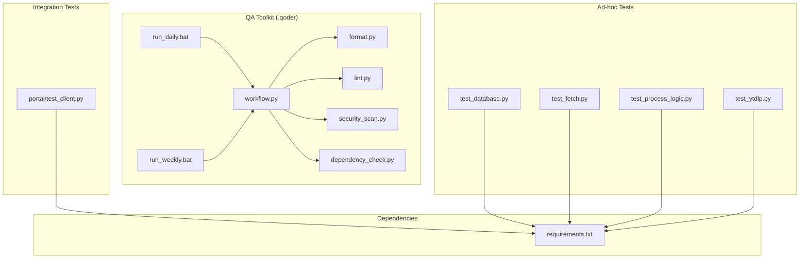
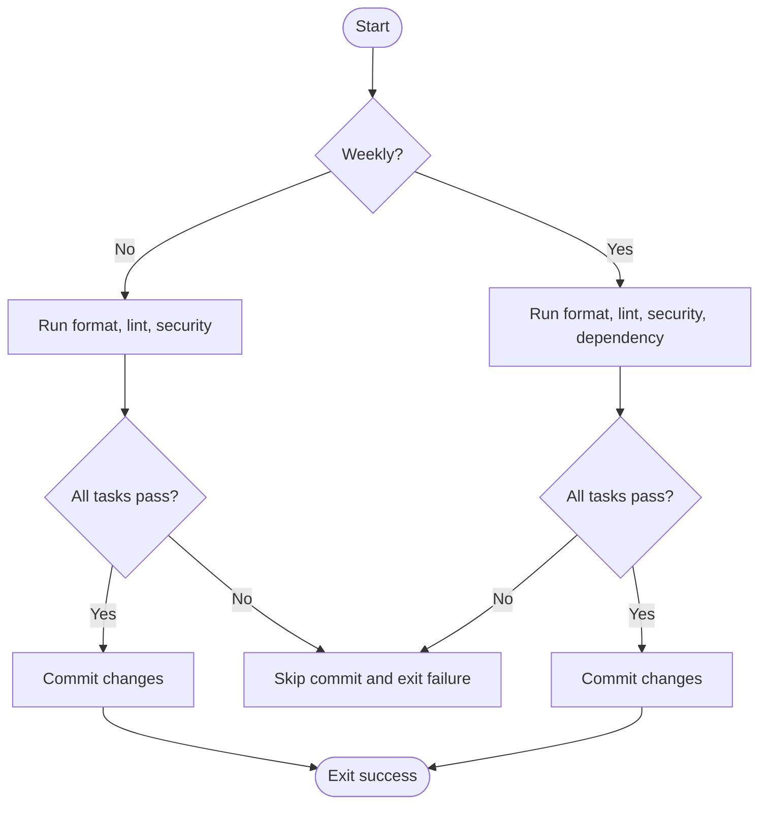
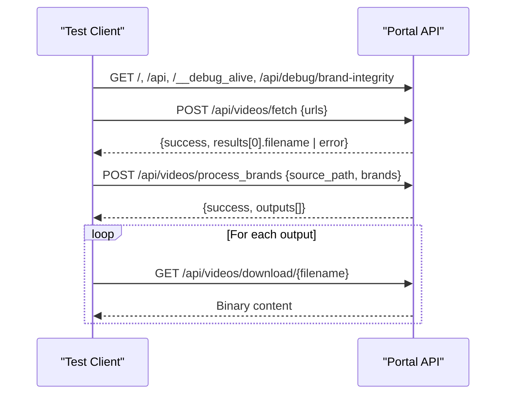
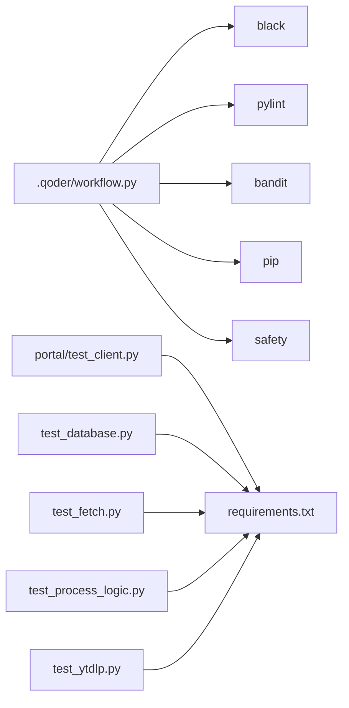

# Testing and Quality Assurance

<cite>
**Referenced Files in This Document**
- [workflow.py](file://.qoder/workflow.py)
- [format.py](file://.qoder/format.py)
- [lint.py](file://.qoder/lint.py)
- [security_scan.py](file://.qoder/security_scan.py)
- [dependency_check.py](file://.qoder/dependency_check.py)
- [run_daily.bat](file://.qoder/run_daily.bat)
- [run_weekly.bat](file://.qoder/run_weekly.bat)
- [test_client.py](file://portal/test_client.py)
- [test_database.py](file://test_database.py)
- [test_fetch.py](file://test_fetch.py)
- [test_process_logic.py](file://test_process_logic.py)
- [test_ytdlp.py](file://test_ytdlp.py)
- [requirements.txt](file://requirements.txt)
</cite>

## Table of Contents
1. [Introduction](#introduction)
2. [Project Structure](#project-structure)
3. [Core Components](#core-components)
4. [Architecture Overview](#architecture-overview)
5. [Detailed Component Analysis](#detailed-component-analysis)
6. [Dependency Analysis](#dependency-analysis)
7. [Performance Considerations](#performance-considerations)
8. [Troubleshooting Guide](#troubleshooting-guide)
9. [Conclusion](#conclusion)
10. [Appendices](#appendices)

## Introduction
This document describes the testing framework and quality assurance processes used in WatchTheFall Orchestrator v3. It covers:
- Unit testing approaches and ad-hoc validation scripts
- Integration testing strategies for the portal API and downstream systems
- Automated quality assurance via formatting, linting, security scanning, and dependency checks
- Workflow automation for daily and weekly maintenance tasks
- Testing environment setup, test data management, and continuous integration practices
- Guidelines for writing effective tests, debugging failures, and maintaining code quality

## Project Structure
The repository organizes QA and testing utilities under a dedicated QA toolkit and several standalone test scripts. The QA toolkit (.qoder) provides:
- A workflow orchestrator that runs daily and weekly maintenance tasks
- Individual tasks for formatting, linting, security scanning, and dependency checks
- Windows batch scripts to trigger the workflows

Key areas:
- QA toolkit: .qoder/
- Integration test client: portal/test_client.py
- Ad-hoc validation scripts: test_*.py at repository root
- Dependencies: requirements.txt



**Diagram sources**
- [.qoder/workflow.py](file://.qoder/workflow.py#L1-L112)
- [.qoder/format.py](file://.qoder/format.py#L1-L67)
- [.qoder/lint.py](file://.qoder/lint.py#L1-L39)
- [.qoder/security_scan.py](file://.qoder/security_scan.py#L1-L47)
- [.qoder/dependency_check.py](file://.qoder/dependency_check.py#L1-L98)
- [.qoder/run_daily.bat](file://.qoder/run_daily.bat#L1-L3)
- [.qoder/run_weekly.bat](file://.qoder/run_weekly.bat#L1-L3)
- [portal/test_client.py](file://portal/test_client.py#L1-L175)
- [test_database.py](file://test_database.py#L1-L24)
- [test_fetch.py](file://test_fetch.py#L1-L62)
- [test_process_logic.py](file://test_process_logic.py#L1-L64)
- [test_ytdlp.py](file://test_ytdlp.py#L1-L8)
- [requirements.txt](file://requirements.txt#L1-L18)

**Section sources**
- [.qoder/workflow.py](file://.qoder/workflow.py#L1-L112)
- [.qoder/format.py](file://.qoder/format.py#L1-L67)
- [.qoder/lint.py](file://.qoder/lint.py#L1-L39)
- [.qoder/security_scan.py](file://.qoder/security_scan.py#L1-L47)
- [.qoder/dependency_check.py](file://.qoder/dependency_check.py#L1-L98)
- [.qoder/run_daily.bat](file://.qoder/run_daily.bat#L1-L3)
- [.qoder/run_weekly.bat](file://.qoder/run_weekly.bat#L1-L3)
- [portal/test_client.py](file://portal/test_client.py#L1-L175)
- [test_database.py](file://test_database.py#L1-L24)
- [test_fetch.py](file://test_fetch.py#L1-L62)
- [test_process_logic.py](file://test_process_logic.py#L1-L64)
- [test_ytdlp.py](file://test_ytdlp.py#L1-L8)
- [requirements.txt](file://requirements.txt#L1-L18)

## Core Components
- Daily and weekly maintenance workflow orchestrator
  - Executes formatting, linting, security scanning, and optionally dependency checks
  - Commits changes only if all tasks pass
- Formatting checker and fixer
  - Uses Black with line length limits and optional fix mode
- Linter
  - Uses Pylint with configured disables and line length
- Security scanner
  - Uses Bandit with JSON output and HIGH severity gating
- Dependency checker
  - Checks outdated packages and optionally vulnerable packages via Safety
- Integration test client
  - Exercises portal endpoints for health, fetching, processing, and downloading
- Ad-hoc validation scripts
  - Database connectivity, fetch pipeline, brand processing logic, and yt-dlp availability

**Section sources**
- [.qoder/workflow.py](file://.qoder/workflow.py#L11-L112)
- [.qoder/format.py](file://.qoder/format.py#L9-L67)
- [.qoder/lint.py](file://.qoder/lint.py#L10-L39)
- [.qoder/security_scan.py](file://.qoder/security_scan.py#L9-L47)
- [.qoder/dependency_check.py](file://.qoder/dependency_check.py#L10-L98)
- [portal/test_client.py](file://portal/test_client.py#L14-L175)
- [test_database.py](file://test_database.py#L4-L24)
- [test_fetch.py](file://test_fetch.py#L7-L62)
- [test_process_logic.py](file://test_process_logic.py#L4-L64)
- [test_ytdlp.py](file://test_ytdlp.py#L1-L8)

## Architecture Overview
The QA architecture is a task-driven workflow that validates code quality and dependencies, followed by optional commits. Integration tests exercise the live portal API.

```mermaid
sequenceDiagram
participant Dev as "Developer"
participant BAT as "run_daily.bat / run_weekly.bat"
participant WF as "workflow.py"
participant FT as "format.py"
participant LT as "lint.py"
participant SS as "security_scan.py"
participant DC as "dependency_check.py"
participant GIT as "Git"
Dev->>BAT : Invoke daily or weekly workflow
BAT->>WF : python .qoder/workflow.py [--weekly]
WF->>FT : Run formatting check
FT-->>WF : Pass/Fail
WF->>LT : Run linting
LT-->>WF : Pass/Fail
WF->>SS : Run security scan
SS-->>WF : Pass/Fail
alt Weekly
WF->>DC : Run dependency check
DC-->>WF : Pass/Fail
end
opt All tasks pass
WF->>GIT : git add . and commit
GIT-->>WF : Success/Failure
else Any task fails
WF-->>Dev : Skip commit
end
```

**Diagram sources**
- [.qoder/run_daily.bat](file://.qoder/run_daily.bat#L1-L3)
- [.qoder/run_weekly.bat](file://.qoder/run_weekly.bat#L1-L3)
- [.qoder/workflow.py](file://.qoder/workflow.py#L66-L112)
- [.qoder/format.py](file://.qoder/format.py#L9-L34)
- [.qoder/lint.py](file://.qoder/lint.py#L10-L35)
- [.qoder/security_scan.py](file://.qoder/security_scan.py#L9-L43)
- [.qoder/dependency_check.py](file://.qoder/dependency_check.py#L87-L98)

## Detailed Component Analysis

### QA Workflow Orchestration
- Responsibilities
  - Execute daily or weekly QA tasks in order
  - Gate commits to only succeed when all tasks pass
  - Provide structured logging and error reporting
- Daily vs weekly
  - Daily: formatting, linting, security scan
  - Weekly: adds dependency check
- Commit behavior
  - Only commits when there are staged changes and all tasks pass



**Diagram sources**
- [.qoder/workflow.py](file://.qoder/workflow.py#L66-L112)

**Section sources**
- [.qoder/workflow.py](file://.qoder/workflow.py#L11-L112)

### Formatting (Black)
- Purpose
  - Enforce consistent code style
- Modes
  - Check mode: reports formatting issues without modifying files
  - Fix mode: applies formatting corrections
- Behavior
  - Gracefully handles missing Black installation
  - Exits with failure only on unexpected errors

**Section sources**
- [.qoder/format.py](file://.qoder/format.py#L9-L67)

### Linting (Pylint)
- Purpose
  - Static analysis for style, complexity, and potential bugs
- Configuration
  - Disables specific docstring warnings
  - Sets max line length and recursive scanning
- Behavior
  - Gracefully handles missing Pylint installation
  - Exits with failure only on unexpected errors

**Section sources**
- [.qoder/lint.py](file://.qoder/lint.py#L10-L39)

### Security Scanning (Bandit)
- Purpose
  - Detect common security vulnerabilities in Python code
- Behavior
  - Accepts Bandit’s normal exit code when issues are found
  - Treats HIGH severity findings as failures
  - Gracefully handles missing Bandit installation

**Section sources**
- [.qoder/security_scan.py](file://.qoder/security_scan.py#L9-L47)

### Dependency Checking
- Purpose
  - Identify outdated and potentially vulnerable dependencies
- Outdated check
  - Uses pip list --outdated with JSON output
- Vulnerability check
  - Optionally uses Safety with JSON output; tolerates absence of Safety
- Behavior
  - Treats findings as failures; otherwise passes

**Section sources**
- [.qoder/dependency_check.py](file://.qoder/dependency_check.py#L10-L98)

### Integration Testing Client
- Purpose
  - Validate portal API endpoints and end-to-end processing
- Endpoints tested
  - Root, API docs, health, brand integrity
- Workflow exercised
  - Fetch video by URL
  - Process with selected brands using source_path
  - Download processed outputs
- Timeout and error handling
  - Configured timeouts per operation
  - Logs HTTP status and response details on failure



**Diagram sources**
- [portal/test_client.py](file://portal/test_client.py#L14-L175)

**Section sources**
- [portal/test_client.py](file://portal/test_client.py#L1-L175)

### Ad-hoc Validation Scripts
- Database connectivity
  - Prints DB path, existence, connects, lists tables, and closes cleanly
- Fetch pipeline
  - Verifies yt-dlp import, cookie file presence and validity, and yt-dlp options
- Brand processing logic
  - Validates URL/source_path selection logic for brand processing scenarios
- yt-dlp availability
  - Confirms import and type introspection

**Section sources**
- [test_database.py](file://test_database.py#L4-L24)
- [test_fetch.py](file://test_fetch.py#L7-L62)
- [test_process_logic.py](file://test_process_logic.py#L4-L64)
- [test_ytdlp.py](file://test_ytdlp.py#L1-L8)

## Dependency Analysis
The QA tools rely on external CLI tools and the portal’s runtime dependencies. The workflow orchestrator invokes these tools and interprets their exit codes and outputs.



**Diagram sources**
- [.qoder/workflow.py](file://.qoder/workflow.py#L14-L94)
- [.qoder/format.py](file://.qoder/format.py#L13-L42)
- [.qoder/lint.py](file://.qoder/lint.py#L14-L19)
- [.qoder/security_scan.py](file://.qoder/security_scan.py#L13-L17)
- [.qoder/dependency_check.py](file://.qoder/dependency_check.py#L14-L49)
- [portal/test_client.py](file://portal/test_client.py#L6-L10)
- [requirements.txt](file://requirements.txt#L1-L18)

**Section sources**
- [.qoder/workflow.py](file://.qoder/workflow.py#L14-L94)
- [.qoder/format.py](file://.qoder/format.py#L13-L42)
- [.qoder/lint.py](file://.qoder/lint.py#L14-L19)
- [.qoder/security_scan.py](file://.qoder/security_scan.py#L13-L17)
- [.qoder/dependency_check.py](file://.qoder/dependency_check.py#L14-L49)
- [portal/test_client.py](file://portal/test_client.py#L6-L10)
- [requirements.txt](file://requirements.txt#L1-L18)

## Performance Considerations
- Formatting and linting are fast and suitable for pre-commit checks
- Security scanning and dependency checks may take longer; schedule weekly runs to minimize CI overhead
- Integration tests use timeouts to avoid hanging; ensure network conditions and server capacity are considered
- Batch scripts invoke the workflow sequentially; consider parallelizing independent tasks only if tool invocations are safe to run concurrently

[No sources needed since this section provides general guidance]

## Troubleshooting Guide
- Formatting failures
  - Run the fix mode to apply Black formatting; re-run check mode to confirm
- Lint failures
  - Review reported issues; adjust code or suppress specific warnings judiciously
- Security scan flagged HIGH severity
  - Address the identified issues before committing; re-run scan
- Dependency check failures
  - Update outdated packages; if vulnerabilities are detected, remediate or pin versions
- Integration test failures
  - Verify portal availability and endpoint responses; inspect HTTP status and error messages
  - Confirm cookie file validity and yt-dlp configuration for fetch tests
- General tool unavailability
  - The workflow tolerates missing tools by printing warnings; install the missing tools or adjust workflows accordingly

**Section sources**
- [.qoder/format.py](file://.qoder/format.py#L28-L33)
- [.qoder/lint.py](file://.qoder/lint.py#L30-L35)
- [.qoder/security_scan.py](file://.qoder/security_scan.py#L38-L43)
- [.qoder/dependency_check.py](file://.qoder/dependency_check.py#L35-L40)
- [portal/test_client.py](file://portal/test_client.py#L32-L33)
- [test_fetch.py](file://test_fetch.py#L11-L12)

## Conclusion
The QA framework for WatchTheFall Orchestrator v3 combines a robust workflow orchestrator with formatting, linting, security scanning, and dependency checks. Integration tests validate portal APIs end-to-end. The setup supports both daily and weekly maintenance, with gated commits ensuring quality. By following the guidelines and troubleshooting tips herein, contributors can maintain high code quality and reliable integrations.

[No sources needed since this section summarizes without analyzing specific files]

## Appendices

### Testing Environment Setup
- Install dependencies declared in requirements.txt
- Ensure QA tools are available on PATH (Black, Pylint, Bandit, pip, safety)
- Configure portal base URL and credentials for integration tests if needed
- Prepare cookie files for fetch tests when required

**Section sources**
- [requirements.txt](file://requirements.txt#L1-L18)
- [portal/test_client.py](file://portal/test_client.py#L12-L12)
- [test_fetch.py](file://test_fetch.py#L14-L17)

### Continuous Integration Practices
- Trigger daily workflow on push or scheduled runs
- Trigger weekly workflow on cron schedules
- Gate pull requests on passing QA tasks
- Archive integration test artifacts and logs for debugging

[No sources needed since this section provides general guidance]

### Writing Effective Tests
- Prefer small, focused assertions and descriptive logs
- Validate both success paths and error conditions
- Use timeouts and retries thoughtfully
- Keep test data minimal and deterministic

[No sources needed since this section provides general guidance]