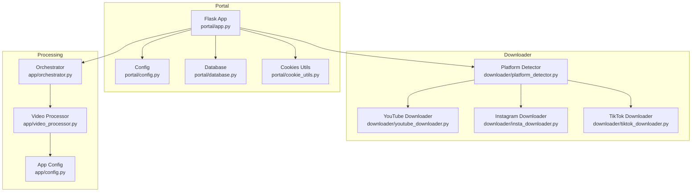
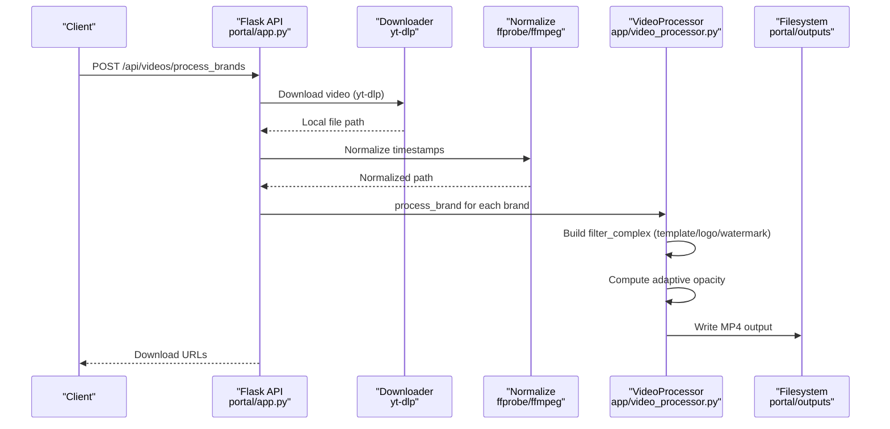
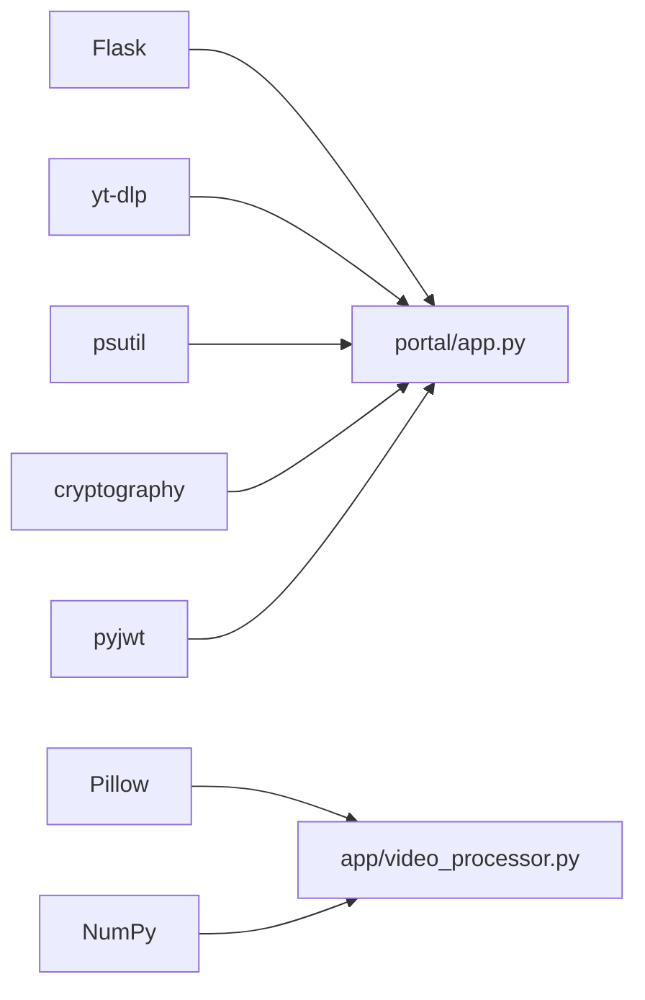

# Troubleshooting and FAQ

<cite>
**Referenced Files in This Document**
- [requirements.txt](file://requirements.txt)
- [app/orchestrator.py](file://app/orchestrator.py)
- [app/video_processor.py](file://app/video_processor.py)
- [app/config.py](file://app/config.py)
- [downloader/platform_detector.py](file://downloader/platform_detector.py)
- [downloader/youtube_downloader.py](file://downloader/youtube_downloader.py)
- [downloader/insta_downloader.py](file://downloader/insta_downloader.py)
- [downloader/tiktok_downloader.py](file://downloader/tiktok_downloader.py)
- [portal/app.py](file://portal/app.py)
- [portal/config.py](file://portal/config.py)
- [portal/database.py](file://portal/database.py)
- [portal/cookie_utils.py](file://portal/cookie_utils.py)
- [AGENTS.md](file://AGENTS.md)
- [DEPLOYMENT.txt](file://DEPLOYMENT.txt)
</cite>

## Table of Contents
1. [Introduction](#introduction)
2. [Project Structure](#project-structure)
3. [Core Components](#core-components)
4. [Architecture Overview](#architecture-overview)
5. [Detailed Component Analysis](#detailed-component-analysis)
6. [Dependency Analysis](#dependency-analysis)
7. [Performance Considerations](#performance-considerations)
8. [Troubleshooting Guide](#troubleshooting-guide)
9. [FAQ](#faq)
10. [Conclusion](#conclusion)

## Introduction
This document provides comprehensive troubleshooting guidance and a focused FAQ for WatchTheFall Orchestrator v3. It covers FFmpeg-related issues, platform detection failures, memory and performance bottlenecks, configuration errors, network connectivity problems, file format compatibility, and processing failures. It also includes systematic debugging approaches, log interpretation tips, diagnostic procedures, optimization techniques, resource management, and scaling considerations tailored to the Flask-based portal and FFmpeg-driven video processing pipeline.

## Project Structure
The Orchestrator integrates a Flask portal with a video processing engine:
- Portal (Flask app) handles API requests, downloads, normalization, and exports.
- Video processing relies on FFmpeg/FFprobe via subprocess calls.
- Downloader modules encapsulate platform-specific yt-dlp configurations.
- Configuration is environment-variable driven for FFmpeg paths and secrets.
- Database tracks jobs and logs for diagnostics.

**Diagram sources**
- [portal/app.py](file://portal/app.py#L1-L120)
- [portal/config.py](file://portal/config.py#L1-L42)
- [portal/database.py](file://portal/database.py#L1-L70)
- [portal/cookie_utils.py](file://portal/cookie_utils.py#L1-L59)
- [downloader/platform_detector.py](file://downloader/platform_detector.py#L1-L41)
- [downloader/youtube_downloader.py](file://downloader/youtube_downloader.py#L1-L46)
- [downloader/insta_downloader.py](file://downloader/insta_downloader.py#L1-L56)
- [downloader/tiktok_downloader.py](file://downloader/tiktok_downloader.py#L1-L47)
- [app/orchestrator.py](file://app/orchestrator.py#L1-L172)
- [app/video_processor.py](file://app/video_processor.py#L1-L273)
- [app/config.py](file://app/config.py#L1-L18)

**Section sources**
- [portal/app.py](file://portal/app.py#L1-L120)
- [portal/config.py](file://portal/config.py#L1-L42)
- [app/orchestrator.py](file://app/orchestrator.py#L1-L172)
- [app/video_processor.py](file://app/video_processor.py#L1-L273)
- [downloader/platform_detector.py](file://downloader/platform_detector.py#L1-L41)

## Core Components
- Flask API endpoints orchestrate video fetching, normalization, and export.
- Orchestrator coordinates stages: crop UI, brand loading, logo editor, multi-brand export.
- VideoProcessor builds FFmpeg filter_complex, computes adaptive watermark opacity, and runs ffmpeg.
- Downloader modules configure yt-dlp for platform-specific constraints.
- Configuration resolves FFmpeg/FFprobe paths and sets portal directories and limits.
- Database persists job state and events for auditability.

Key responsibilities and integration points:
- FFmpeg availability and version checks via debug endpoints.
- Storage health checks for upload/output/temp/log directories.
- Brand integrity and filter dry-run helpers for debugging.
- Locking and sequential processing to avoid memory pressure on constrained environments.

**Section sources**
- [portal/app.py](file://portal/app.py#L92-L116)
- [portal/app.py](file://portal/app.py#L118-L162)
- [portal/app.py](file://portal/app.py#L164-L186)
- [portal/app.py](file://portal/app.py#L216-L221)
- [app/orchestrator.py](file://app/orchestrator.py#L23-L115)
- [app/video_processor.py](file://app/video_processor.py#L18-L107)
- [app/video_processor.py](file://app/video_processor.py#L209-L225)
- [downloader/insta_downloader.py](file://downloader/insta_downloader.py#L26-L44)
- [portal/config.py](file://portal/config.py#L26-L37)
- [app/config.py](file://app/config.py#L11-L13)

## Architecture Overview
High-level flow from request to processed output:

**Diagram sources**
- [portal/app.py](file://portal/app.py#L329-L607)
- [portal/app.py](file://portal/app.py#L524-L565)
- [app/video_processor.py](file://app/video_processor.py#L109-L178)
- [app/video_processor.py](file://app/video_processor.py#L180-L225)

## Detailed Component Analysis

### FFmpeg and Video Processing Diagnostics
Common symptoms:
- FFmpeg not found or version mismatch.
- Audio-only or invalid stream after download.
- Slow processing or timeouts on free-tier hosts.
- Adaptive watermark not applied or incorrect opacity.

Diagnostic steps:
- Use the FFmpeg debug endpoint to confirm binary paths and version.
- Verify storage directories are writable and have sufficient space.
- Check brand asset integrity and filter dry-run capability.
- Inspect normalization logic for corrupted streams.

Operational controls:
- Global lock prevents concurrent FFmpeg invocations.
- Sequential brand processing reduces memory spikes.
- Watermark opacity adapts to video brightness.

**Section sources**
- [portal/app.py](file://portal/app.py#L92-L116)
- [portal/app.py](file://portal/app.py#L118-L162)
- [portal/app.py](file://portal/app.py#L164-L186)
- [portal/app.py](file://portal/app.py#L216-L221)
- [app/video_processor.py](file://app/video_processor.py#L18-L107)
- [app/video_processor.py](file://app/video_processor.py#L109-L178)
- [app/video_processor.py](file://app/video_processor.py#L209-L225)

### Platform Detection Failures
Symptoms:
- Unknown platform returned for supported URLs.
- Incorrect downloader invoked leading to failures.

Root causes:
- URL patterns not matching expected hostnames.
- Case sensitivity or extra path segments.

Resolution:
- Validate URL format and ensure canonical domains.
- Confirm regex patterns align with platform host variations.

**Section sources**
- [downloader/platform_detector.py](file://downloader/platform_detector.py#L12-L41)

### Network Connectivity and Download Issues
Symptoms:
- yt-dlp failures, timeouts, or empty files.
- Instagram-specific authentication or rate limiting.
- Batch fetch limits exceeded.

Controls and mitigations:
- Enhanced retry and socket timeout settings.
- Optional cookie injection for Instagram when valid.
- Sequential processing to reduce memory footprint.
- Batch limit enforced at the API.

**Section sources**
- [portal/app.py](file://portal/app.py#L368-L490)
- [portal/app.py](file://portal/app.py#L628-L784)
- [portal/cookie_utils.py](file://portal/cookie_utils.py#L7-L47)
- [downloader/insta_downloader.py](file://downloader/insta_downloader.py#L26-L44)

### Configuration Errors
Symptoms:
- FFmpeg/FFprobe not found.
- Incorrect portal directories or permissions.
- Secrets not set causing authentication failures.

Checks:
- Environment variables for FFmpeg paths.
- Portal config paths and writable permissions.
- Secret keys for API access.

**Section sources**
- [portal/config.py](file://portal/config.py#L26-L37)
- [app/config.py](file://app/config.py#L11-L13)
- [portal/app.py](file://portal/app.py#L371-L387)

### Memory and Performance Bottlenecks
Constraints:
- Free-tier deployments often limit RAM and CPU.
- Single worker and global lock prevent concurrency.

Mitigations:
- Sequential brand processing and single FFmpeg invocation at a time.
- Reduced concurrency and conservative FFmpeg presets.
- Normalize timestamps to avoid heavy re-muxing.

**Section sources**
- [portal/app.py](file://portal/app.py#L216-L221)
- [portal/app.py](file://portal/app.py#L524-L527)
- [AGENTS.md](file://AGENTS.md#L85-L98)

## Dependency Analysis
External dependencies and their roles:
- Flask, Jinja2, Werkzeug: Web framework and templating.
- yt-dlp: Downloading platform-specific videos.
- Pillow, NumPy: Image analysis for brightness computation.
- psutil: System metrics (used in codebase).
- cryptography, pyjwt: Security-related operations.

**Diagram sources**
- [requirements.txt](file://requirements.txt#L1-L18)
- [portal/app.py](file://portal/app.py#L1-L14)
- [app/video_processor.py](file://app/video_processor.py#L8-L11)

**Section sources**
- [requirements.txt](file://requirements.txt#L1-L18)

## Performance Considerations
- Prefer sequential processing to avoid memory pressure on constrained hosts.
- Use conservative FFmpeg presets and avoid excessive threads on free tiers.
- Normalize video timestamps once per request to reduce downstream overhead.
- Keep brand assets minimal and consistent to reduce filter complexity.
- Monitor storage health and clean temp files periodically.

[No sources needed since this section provides general guidance]

## Troubleshooting Guide

### System Health Checks
- Use the health endpoint to verify write permissions on essential directories.
- Use the storage debug endpoint to inspect directory existence, writability, and counts.
- Use the brands debug endpoint to confirm brand assets and options are loaded.

**Section sources**
- [portal/app.py](file://portal/app.py#L188-L214)
- [portal/app.py](file://portal/app.py#L118-L162)
- [portal/app.py](file://portal/app.py#L164-L186)

### FFmpeg Troubleshooting
- Confirm FFmpeg and FFprobe paths and versions via the FFmpeg debug endpoint.
- If FFmpeg fails, capture stderr from the subprocess call and review error messages.
- Ensure the output directory is writable and has sufficient disk space.

**Section sources**
- [portal/app.py](file://portal/app.py#L92-L116)
- [app/video_processor.py](file://app/video_processor.py#L220-L225)
- [portal/config.py](file://portal/config.py#L14-L16)

### Platform Detection and Download Failures
- Validate URLs against supported patterns; adjust for subdomains or short domains.
- For Instagram, ensure a valid cookie file is present and readable.
- Retry failed downloads; the API includes robust retry and timeout settings.

**Section sources**
- [downloader/platform_detector.py](file://downloader/platform_detector.py#L12-L41)
- [portal/cookie_utils.py](file://portal/cookie_utils.py#L7-L47)
- [portal/app.py](file://portal/app.py#L368-L490)

### Processing Failures and Watermark Issues
- If “audio-only” errors occur, the source contained no video stream; retry with a different source.
- Adjust watermark scale and opacity overrides if the watermark is too light/dark.
- Use the filter dry-run debug endpoint to preview the FFmpeg filter chain.

**Section sources**
- [portal/app.py](file://portal/app.py#L552-L559)
- [portal/app.py](file://portal/app.py#L532-L537)
- [portal/app.py](file://portal/app.py#L284-L288)

### Log Interpretation
- Review recent logs via the database-backed logging system.
- Use the debug endpoints to correlate request IDs and timestamps.
- On Render, check Gunicorn logs for timeouts and worker restarts.

**Section sources**
- [portal/database.py](file://portal/database.py#L152-L170)
- [DEPLOYMENT.txt](file://DEPLOYMENT.txt#L83-L86)

### Diagnostic Procedures
- Reproduce with a small batch and minimal brands to isolate issues.
- Temporarily disable watermark or logo overlays to test baseline processing.
- Validate brand asset integrity and paths.

**Section sources**
- [portal/app.py](file://portal/app.py#L284-L288)
- [portal/app.py](file://portal/app.py#L164-L186)

## FAQ

### Installation and Setup
Q: FFmpeg is not found.
A: Set the FFmpeg path via environment variables and confirm the debug endpoint reports a valid version. On Render, the build script installs FFmpeg automatically.

Q: How do I configure secrets?
A: Set the portal authentication key and Flask secret key via environment variables. These are required for API access and session security.

Q: Where are the output files stored?
A: Outputs are written to the portal’s output directory. Ensure the directory exists and is writable.

**Section sources**
- [portal/config.py](file://portal/config.py#L26-L37)
- [portal/app.py](file://portal/app.py#L92-L116)
- [DEPLOYMENT.txt](file://DEPLOYMENT.txt#L88-L93)

### Usage Problems
Q: The download endpoint returns a 404.
A: Verify the file exists in the output directory and the filename matches exactly. The endpoint serves files from the configured output directory.

Q: Why does processing fail with “audio-only”?
A: The source video had no video stream. Try another source or platform.

Q: Watermark is too faint or too dark.
A: Adjust watermark scale and opacity overrides in the request payload. The system also adapts opacity based on video brightness.

**Section sources**
- [portal/app.py](file://portal/app.py#L790-L807)
- [portal/app.py](file://portal/app.py#L552-L559)
- [portal/app.py](file://portal/app.py#L532-L537)
- [app/video_processor.py](file://app/video_processor.py#L92-L107)

### Integration Challenges
Q: How do I integrate with my platform?
A: Use the fetch endpoint to download videos from supported platforms, then process with selected brands. Respect the batch limits and sequential processing constraints.

Q: Can I bypass the portal UI?
A: Yes, call the API endpoints directly. Ensure proper headers and authentication keys are set.

Q: How do I monitor progress?
A: Use the health and storage endpoints to verify system status. Logs are persisted in the database for inspection.

**Section sources**
- [portal/app.py](file://portal/app.py#L609-L784)
- [portal/app.py](file://portal/app.py#L188-L214)
- [portal/database.py](file://portal/database.py#L152-L170)

### Platform-Specific Tips
Q: Instagram downloads fail.
A: Ensure a valid cookie file exists and is readable. The system attempts to use it automatically.

Q: YouTube and TikTok downloads work but quality is poor.
A: The downloader selects the best available format. If quality remains low, verify the source availability and try again.

**Section sources**
- [portal/cookie_utils.py](file://portal/cookie_utils.py#L7-L47)
- [downloader/insta_downloader.py](file://downloader/insta_downloader.py#L26-L44)
- [downloader/youtube_downloader.py](file://downloader/youtube_downloader.py#L26-L34)
- [downloader/tiktok_downloader.py](file://downloader/tiktok_downloader.py#L27-L35)

### Scaling and Resource Management
Q: How can I improve throughput?
A: On constrained environments, keep a single worker and process sequentially. On higher-tier hosts, consider increasing workers cautiously while monitoring memory.

Q: How do I manage disk space?
A: Regularly clean the output and temp directories. Use the storage debug endpoint to monitor sizes.

**Section sources**
- [DEPLOYMENT.txt](file://DEPLOYMENT.txt#L83-L86)
- [portal/app.py](file://portal/app.py#L118-L162)

## Conclusion
This guide consolidates practical troubleshooting steps, diagnostic procedures, and optimization strategies for WatchTheFall Orchestrator v3. By leveraging built-in debug endpoints, validating configuration, and following the sequential processing model, most issues—FFmpeg failures, platform detection mismatches, network problems, and performance constraints—can be resolved efficiently. For production deployments, ensure proper secrets, disk space, and worker sizing aligned with your hosting constraints.