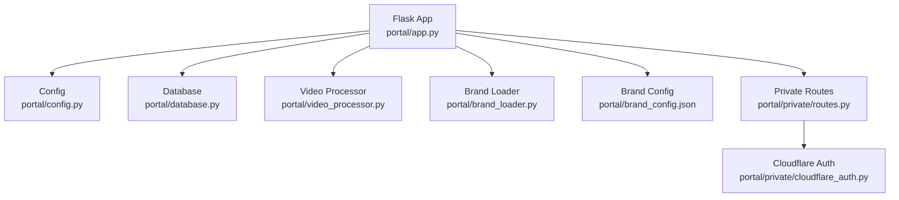
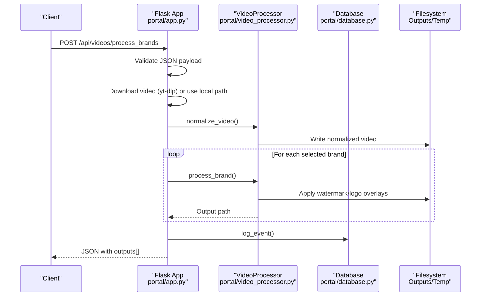
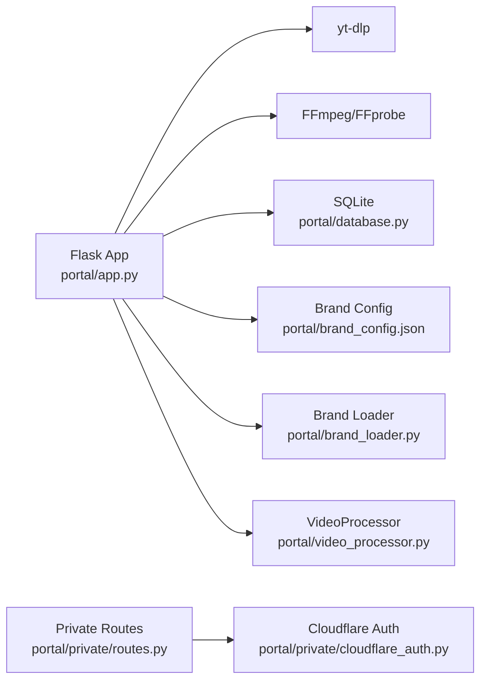

# API Endpoints

<cite>
**Referenced Files in This Document**
- [app.py](file://portal/app.py)
- [config.py](file://portal/config.py)
- [database.py](file://portal/database.py)
- [video_processor.py](file://portal/video_processor.py)
- [brand_loader.py](file://portal/brand_loader.py)
- [brand_config.json](file://portal/brand_config.json)
- [routes.py](file://portal/private/routes.py)
- [cloudflare_auth.py](file://portal/private/cloudflare_auth.py)
</cite>

## Table of Contents
1. [Introduction](#introduction)
2. [Project Structure](#project-structure)
3. [Core Components](#core-components)
4. [Architecture Overview](#architecture-overview)
5. [Detailed Component Analysis](#detailed-component-analysis)
6. [Dependency Analysis](#dependency-analysis)
7. [Performance Considerations](#performance-considerations)
8. [Troubleshooting Guide](#troubleshooting-guide)
9. [Conclusion](#conclusion)

## Introduction
This document provides comprehensive API documentation for the WatchTheFall Portal Flask application. It covers all documented endpoints, including video processing, brand management, watermark conversion, and debugging utilities. For each endpoint, you will find HTTP methods, request/response schemas, parameter validation, error handling, and authentication requirements. Practical usage examples and integration patterns are included to help developers integrate with the system effectively.

## Project Structure
The API is implemented as a Flask application with modular components:
- Flask application entry and route definitions
- Configuration and environment variables
- Database initialization and logging
- Video processing utilities and watermarking logic
- Brand configuration loader
- Private portal routes protected by Cloudflare Access

**Diagram sources**
- [app.py](file://portal/app.py#L44-L53)
- [config.py](file://portal/config.py#L1-L42)
- [database.py](file://portal/database.py#L9-L69)
- [video_processor.py](file://portal/video_processor.py#L71-L133)
- [brand_loader.py](file://portal/brand_loader.py#L48-L59)
- [brand_config.json](file://portal/brand_config.json#L1-L302)
- [routes.py](file://portal/private/routes.py#L1-L29)
- [cloudflare_auth.py](file://portal/private/cloudflare_auth.py#L1-L64)

**Section sources**
- [app.py](file://portal/app.py#L44-L53)
- [config.py](file://portal/config.py#L1-L42)

## Core Components
- Flask application initialization and configuration
- Route registration for all API endpoints
- Video processing pipeline with normalization and branding
- Brand enumeration and asset resolution
- Watermark conversion job queue and status polling
- Debug endpoints for health, storage, and FFmpeg configuration
- Private portal routes protected by Cloudflare Access

**Section sources**
- [app.py](file://portal/app.py#L44-L53)
- [app.py](file://portal/app.py#L329-L608)
- [app.py](file://portal/app.py#L609-L784)
- [app.py](file://portal/app.py#L790-L833)
- [app.py](file://portal/app.py#L958-L974)
- [app.py](file://portal/app.py#L980-L1190)
- [app.py](file://portal/app.py#L1197-L1256)
- [app.py](file://portal/app.py#L1263-L1353)
- [routes.py](file://portal/private/routes.py#L1-L29)

## Architecture Overview
The API follows a layered architecture:
- Presentation layer: Flask routes define endpoints and handle HTTP requests/responses
- Domain layer: VideoProcessor encapsulates FFmpeg operations and branding logic
- Data layer: SQLite-backed logging and job tracking
- Configuration layer: Environment-driven settings for paths, limits, and security

**Diagram sources**
- [app.py](file://portal/app.py#L329-L608)
- [video_processor.py](file://portal/video_processor.py#L21-L68)
- [video_processor.py](file://portal/video_processor.py#L315-L404)
- [database.py](file://portal/database.py#L152-L161)

## Detailed Component Analysis

### Video Processing Endpoints

#### POST /api/videos/process_brands
- Purpose: Process a single video with selected brands, applying watermarks and logos.
- Authentication: Not explicitly enforced in the route; however, production deployments may use Cloudflare Access for private routes.
- Request body (JSON):
  - url: string (required if source_path not provided)
  - source_path: string (alternative to url; if provided, treated as local path)
  - brands: array[string] (required; list of brand names)
  - watermark_scale: number (optional; default 1.15)
  - watermark_opacity: number (optional; default 0.4)
  - logo_scale: number (optional; default 0.15)
  - logo_padding: number (optional; default 40)
- Response (success):
  - success: boolean
  - message: string
  - outputs: array of objects with keys:
    - brand: string
    - filename: string
    - download_url: string
- Response (error):
  - success: boolean
  - error: string
  - details: string (optional)
- Validation:
  - At least one brand must be selected.
  - URL or source_path must be provided.
  - Audio-only videos are rejected with a specific error message.
- Error codes:
  - 400: Missing URL/source_path, no brands selected, audio-only video detected
  - 500: Internal server error
- Notes:
  - Uses yt-dlp to download videos from supported platforms.
  - Applies normalization to fix timestamps and strip HDR metadata.
  - Processes brands sequentially to manage resource usage.
  - Cleans up original downloaded video after processing.

**Section sources**
- [app.py](file://portal/app.py#L329-L608)
- [video_processor.py](file://portal/video_processor.py#L21-L68)
- [video_processor.py](file://portal/video_processor.py#L315-L404)

#### POST /api/videos/fetch
- Purpose: Bulk download videos from URLs (up to 5 per request).
- Authentication: Not explicitly enforced in the route.
- Request body (JSON):
  - urls: array[string] (required; up to 5 items)
- Response (success):
  - success: boolean
  - total: number
  - successful: number
  - results: array of objects with keys:
    - url: string
    - filename: string
    - local_path: string
    - download_url: string
    - size_mb: number
    - success: boolean
- Response (error):
  - success: boolean
  - error: string
- Validation:
  - Exactly 1–5 URLs allowed.
  - yt-dlp must be installed.
- Error codes:
  - 400: Invalid input or too many URLs
  - 500: Internal server error
- Notes:
  - Downloads sequentially to reduce memory usage.
  - Attempts fallback extraction if initial download lacks a valid video stream.

**Section sources**
- [app.py](file://portal/app.py#L609-L784)

#### GET /api/videos/download/<filename>
- Purpose: Download a processed video file.
- Authentication: Not explicitly enforced in the route.
- Path parameters:
  - filename: string (required)
- Response:
  - File attachment (video/mp4) with appropriate headers
- Error codes:
  - 404: File not found
- Notes:
  - Serves files from the configured output directory.
  - Adds mobile-friendly headers and cache-control settings.

**Section sources**
- [app.py](file://portal/app.py#L790-L833)

### Brand Management Endpoints

#### GET /api/brands/list
- Purpose: Enumerate available brands.
- Authentication: Not explicitly enforced in the route.
- Response (success):
  - success: boolean
  - brands: array of objects with keys:
    - name: string
    - display_name: string
- Response (error):
  - success: boolean
  - error: string
- Notes:
  - Brand list is derived from brand_config.json.

**Section sources**
- [app.py](file://portal/app.py#L958-L974)
- [brand_loader.py](file://portal/brand_loader.py#L48-L59)
- [brand_config.json](file://portal/brand_config.json#L1-L302)

### Watermark Conversion Endpoints

#### POST /api/videos/convert-watermark
- Purpose: Queue a WebM-to-MP4 conversion job asynchronously.
- Authentication: Not explicitly enforced in the route.
- Request (multipart/form-data):
  - video: file (required)
- Response (success):
  - success: boolean
  - job_id: string
  - status: string
  - filename: string
  - message: string
- Response (error):
  - error: string
  - reason: string
- Validation:
  - Must include a video file.
  - Filename must not be empty.
- Error codes:
  - 400: Missing file or empty filename
  - 500: Internal server error
- Notes:
  - Stores uploaded WebM temporarily.
  - Starts a background thread to run FFmpeg conversion.
  - Returns immediately with job_id for polling.

**Section sources**
- [app.py](file://portal/app.py#L980-L1046)

#### GET /api/videos/convert-status/<job_id>
- Purpose: Poll the status of a queued conversion job.
- Authentication: Not explicitly enforced in the route.
- Path parameters:
  - job_id: string (required)
- Response (queued):
  - job_id: string
  - status: "queued"
  - filename: string
  - message: string
- Response (processing):
  - job_id: string
  - status: "processing"
  - filename: string
  - message: string
- Response (completed):
  - job_id: string
  - status: "completed"
  - filename: string
  - download_url: string
  - size_mb: number
  - conversion_time: number
- Response (failed):
  - job_id: string
  - status: "failed"
  - filename: string
  - error: string
  - stderr_preview: string (preview of FFmpeg stderr)
  - exit_code: number
- Error codes:
  - 404: Job not found
- Notes:
  - Maintains an in-memory job registry keyed by job_id.
  - Supports timeout and failure scenarios.

**Section sources**
- [app.py](file://portal/app.py#L1158-L1190)

### Debugging Endpoints
These endpoints are useful for diagnostics and development.

#### GET /__debug_alive
- Purpose: Health check to confirm the app is running.
- Response: "alive" with 200 OK.

**Section sources**
- [app.py](file://portal/app.py#L56-L58)

#### GET /__debug_routes
- Purpose: List all registered routes.
- Response: JSON with status and routes array containing endpoint, methods, and rule.

**Section sources**
- [app.py](file://portal/app.py#L60-L73)

#### GET /__debug_health
- Purpose: Basic health check for essential directories.
- Response: JSON with status ("healthy"/"unhealthy") and checks for upload/output/temp directories.

**Section sources**
- [app.py](file://portal/app.py#L188-L214)

#### GET /__debug_storage
- Purpose: Inspect storage directories and permissions.
- Response: JSON with storage info for upload/output/temp/log/db/brands directories.

**Section sources**
- [app.py](file://portal/app.py#L118-L162)

#### GET /__debug_ffmpeg
- Purpose: Verify FFmpeg availability and version.
- Response: JSON with ffmpeg binary paths, existence checks, and version info.

**Section sources**
- [app.py](file://portal/app.py#L92-L116)

#### GET /__debug_brands
- Purpose: Enumerate brands with assets and options.
- Response: JSON with status, brands array, and count.

**Section sources**
- [app.py](file://portal/app.py#L164-L186)

#### GET /__debug_env
- Purpose: Expose environment variables (with sensitive values hidden).
- Response: JSON with status and environment map.

**Section sources**
- [app.py](file://portal/app.py#L75-L90)

#### GET /api/debug/brand-integrity
- Purpose: Validate presence of brand assets (template, logo, watermark).
- Response: JSON with success and brands map indicating asset presence.

**Section sources**
- [app.py](file://portal/app.py#L1197-L1223)

#### GET /api/debug/build-filter/<brand_name>
- Purpose: Dry-run FFmpeg filter generation for a brand without a real video.
- Response: JSON with success, brand, and filter_complex string.
- Error codes:
  - 404: Brand not found

**Section sources**
- [app.py](file://portal/app.py#L1228-L1256)

### Private Portal Routes (Cloudflare Access Protected)
These routes are protected by Cloudflare Access and require a valid JWT in the request headers.

#### GET /portal/private/test
- Purpose: Test endpoint for private portal access.
- Response: JSON with status and protected flag.
- Authentication: Requires Cf-Access-Jwt-Assertion header.

**Section sources**
- [routes.py](file://portal/private/routes.py#L10-L18)
- [cloudflare_auth.py](file://portal/private/cloudflare_auth.py#L42-L64)

#### GET /portal/private/status
- Purpose: Status endpoint for private portal.
- Response: JSON with service status and protection info.
- Authentication: Requires Cf-Access-Jwt-Assertion header.

**Section sources**
- [routes.py](file://portal/private/routes.py#L20-L29)
- [cloudflare_auth.py](file://portal/private/cloudflare_auth.py#L42-L64)

## Dependency Analysis
Key dependencies and their roles:
- Flask: Web framework and routing
- yt-dlp: Video downloading from supported platforms
- Pillow/Numpy: Image processing helpers
- PyJWT/Requests: JWT verification and HTTP requests for Cloudflare Access
- SQLite: Event logging and job tracking

**Diagram sources**
- [app.py](file://portal/app.py#L13-L13)
- [database.py](file://portal/database.py#L1-L7)
- [brand_loader.py](file://portal/brand_loader.py#L1-L7)
- [brand_config.json](file://portal/brand_config.json#L1-L302)
- [video_processor.py](file://portal/video_processor.py#L1-L18)
- [routes.py](file://portal/private/routes.py#L1-L8)
- [cloudflare_auth.py](file://portal/private/cloudflare_auth.py#L1-L8)

**Section sources**
- [app.py](file://portal/app.py#L13-L13)
- [database.py](file://portal/database.py#L1-L7)
- [brand_loader.py](file://portal/brand_loader.py#L1-L7)
- [brand_config.json](file://portal/brand_config.json#L1-L302)
- [video_processor.py](file://portal/video_processor.py#L1-L18)
- [routes.py](file://portal/private/routes.py#L1-L8)
- [cloudflare_auth.py](file://portal/private/cloudflare_auth.py#L1-L8)

## Performance Considerations
- Sequential processing: Brand processing and bulk fetch operate sequentially to minimize memory usage and respect Render free-tier constraints.
- FFmpeg tuning: Conversion jobs use aggressive presets and reduced analysis/probe sizes to complete within time limits.
- Resource locks: A global conversion lock prevents concurrent FFmpeg processes, avoiding contention on shared resources.
- Storage: Outputs are written to a dedicated output directory; ensure sufficient disk space and write permissions.

[No sources needed since this section provides general guidance]

## Troubleshooting Guide
Common issues and resolutions:
- Download failures:
  - Verify yt-dlp installation and network connectivity.
  - Check cookies.txt path and content for platform-specific restrictions.
- Audio-only videos:
  - The system rejects audio-only content with a specific error message. Retry with a video that contains a video stream.
- File not found:
  - Ensure the filename exists in the configured output directory.
  - Use the correct filename returned by the processing endpoints.
- Conversion job failures:
  - Check stderr_preview for FFmpeg error details.
  - Reduce video length or complexity to meet time limits.
- Cloudflare Access errors:
  - Ensure the Cf-Access-Jwt-Assertion header is present and valid.
  - Confirm environment variables CF_TEAM_DOMAIN and CF_AUDIENCE are configured.

**Section sources**
- [app.py](file://portal/app.py#L432-L440)
- [app.py](file://portal/app.py#L550-L564)
- [app.py](file://portal/app.py#L800-L811)
- [app.py](file://portal/app.py#L1101-L1112)
- [cloudflare_auth.py](file://portal/private/cloudflare_auth.py#L48-L61)

## Conclusion
The WatchTheFall Portal provides a robust set of APIs for video processing, brand management, and watermark conversion. The endpoints are designed for reliability under constrained environments, with explicit validation, error handling, and debugging capabilities. Integrators should pay attention to authentication requirements (especially for private routes), parameter validation, and asynchronous job polling for conversion tasks.