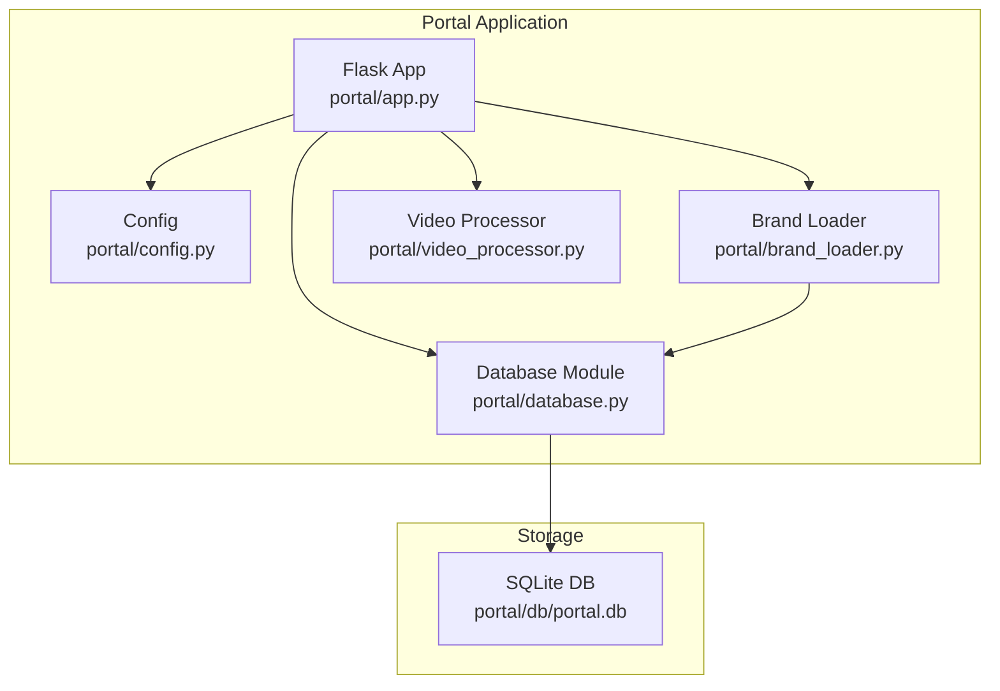
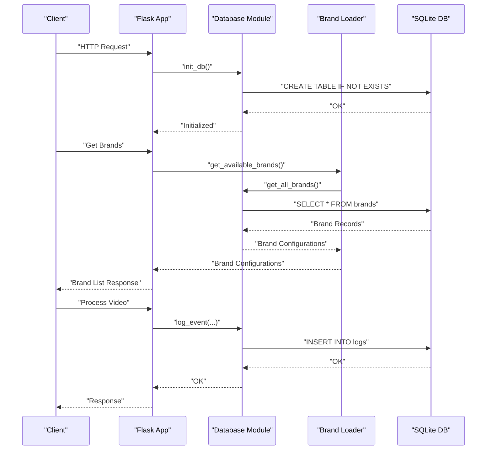
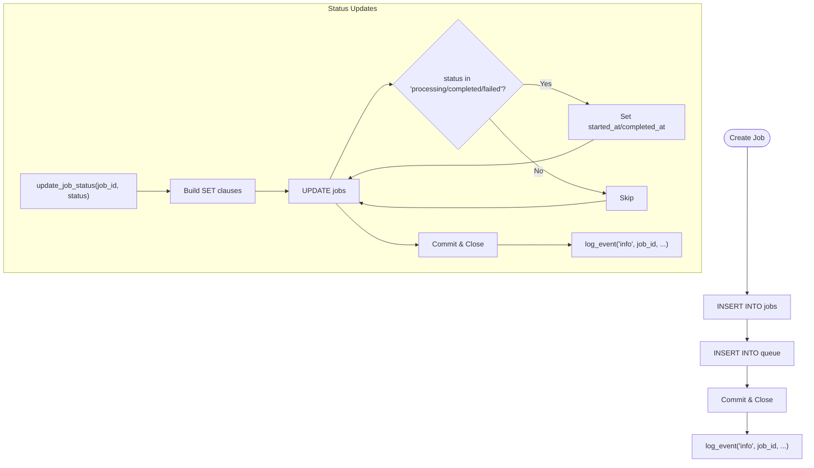
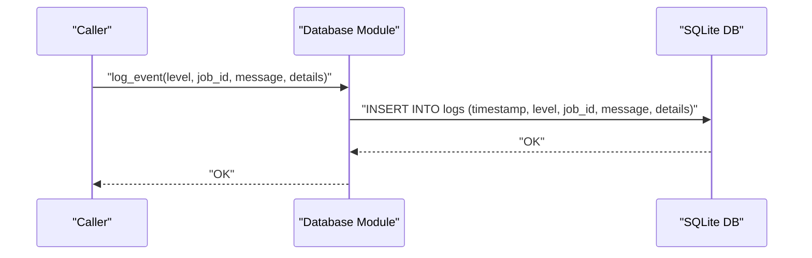
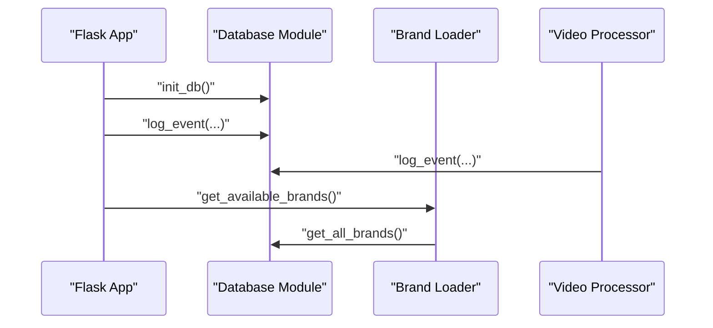
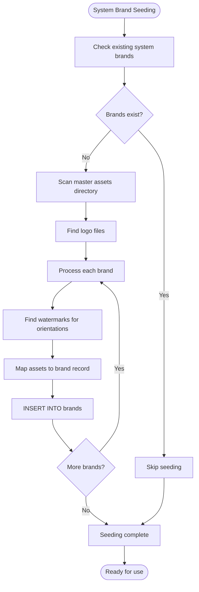
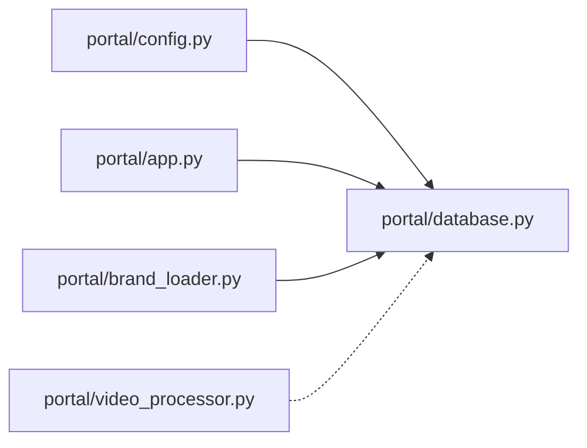

# Database Management

<cite>
**Referenced Files in This Document**
- [portal/database.py](file://portal/database.py)
- [portal/config.py](file://portal/config.py)
- [portal/app.py](file://portal/app.py)
- [portal/video_processor.py](file://portal/video_processor.py)
- [portal/brand_loader.py](file://portal/brand_loader.py)
- [test_database.py](file://test_database.py)
- [test_log_event.py](file://test_log_event.py)
</cite>

## Update Summary
**Changes Made**
- Added comprehensive documentation for the new unified brands table with multi-tenant branding support
- Documented the brand_configs table for per-brand persistent settings
- Updated schema diagrams to include new brand management tables
- Added documentation for brand ownership tracking, system templates, and locking mechanisms
- Enhanced database initialization procedures to include brand management functionality
- Updated data access patterns to include brand configuration management

## Table of Contents
1. [Introduction](#introduction)
2. [Project Structure](#project-structure)
3. [Core Components](#core-components)
4. [Architecture Overview](#architecture-overview)
5. [Detailed Component Analysis](#detailed-component-analysis)
6. [Brand Management System](#brand-management-system)
7. [Dependency Analysis](#dependency-analysis)
8. [Performance Considerations](#performance-considerations)
9. [Troubleshooting Guide](#troubleshooting-guide)
10. [Conclusion](#conclusion)
11. [Appendices](#appendices)

## Introduction
This document describes the database management system used by the WatchTheFall Portal application. It covers the SQLite schema, initialization and migration procedures, event logging, job tracking for video processing, brand management with multi-tenant support, connection and transaction handling, error recovery, maintenance and backup guidance, performance optimization, and extension strategies for evolving the schema.

## Project Structure
The database layer is implemented as a dedicated module that initializes tables, exposes CRUD and query helpers, and integrates with the Flask application for logging and job orchestration. The system now includes comprehensive brand management capabilities with multi-tenant support and per-brand configuration persistence.



**Diagram sources**
- [portal/app.py](file://portal/app.py#L44-L53)
- [portal/config.py](file://portal/config.py#L10-L11)
- [portal/database.py](file://portal/database.py#L9-L69)
- [portal/brand_loader.py](file://portal/brand_loader.py#L1-L162)

**Section sources**
- [portal/config.py](file://portal/config.py#L10-L11)
- [portal/database.py](file://portal/database.py#L9-L69)
- [portal/app.py](file://portal/app.py#L44-L53)

## Core Components
- Database initialization and schema: Creates jobs, logs, queue, store_sync, brand_configs, and unified brands tables.
- Connection management: Provides a helper to obtain a Row-enabled connection.
- Job lifecycle management: Create, status update, retrieval, and queue operations.
- Event logging: Centralized logging of application events with timestamps and optional structured details.
- Brand management: Multi-tenant brand configuration with ownership tracking, system templates, and asset management.
- Integration points: Used by the Flask app for initialization and by video processing routines for logging.

Key responsibilities:
- Schema definition and enforcement on import.
- Atomic transactions per operation with explicit commit/close.
- Timestamp-driven lifecycle tracking for jobs.
- Priority-aware queue selection for processing.
- Comprehensive brand configuration management with soft deletion and audit trails.

**Section sources**
- [portal/database.py](file://portal/database.py#L9-L69)
- [portal/database.py](file://portal/database.py#L71-L75)
- [portal/database.py](file://portal/database.py#L77-L98)
- [portal/database.py](file://portal/database.py#L100-L132)
- [portal/database.py](file://portal/database.py#L134-L150)
- [portal/database.py](file://portal/database.py#L152-L161)
- [portal/database.py](file://portal/database.py#L172-L192)
- [portal/database.py](file://portal/database.py#L194-L200)
- [portal/database.py](file://portal/database.py#L265-L374)
- [portal/database.py](file://portal/database.py#L389-L525)

## Architecture Overview
The database layer is a thin abstraction over SQLite with explicit per-operation connections and commits. The Flask app initializes the database on startup and uses the logging function for operational events. Video processing uses the logging facility for audit trails. The system now includes comprehensive brand management with multi-tenant support and per-brand configuration persistence.



**Diagram sources**
- [portal/app.py](file://portal/app.py#L51-L53)
- [portal/database.py](file://portal/database.py#L9-L69)
- [portal/database.py](file://portal/database.py#L152-L161)
- [portal/brand_loader.py](file://portal/brand_loader.py#L49-L111)

## Detailed Component Analysis

### Database Initialization and Schema
- Jobs table: Stores job identity, status, associated video and template, aspect ratio, output path, timestamps, error messages, and metadata.
- Logs table: Captures timestamped events with severity, optional job association, message, and JSON details.
- Queue table: Manages job prioritization and processing state with unique job linkage and timestamps.
- Store sync table: Placeholder for future e-commerce synchronization.
- Brand configurations table: Per-brand persistent settings with watermark, logo, and text configuration options.
- Unified brands table: Full brand ownership and assets with multi-tenant support, system templates, and locking mechanisms.

Indexing strategy:
- Primary keys are implicit via AUTOINCREMENT and UNIQUE constraints.
- No explicit indexes are defined; queries rely on primary key and join conditions.

Initialization behavior:
- Called on module import to ensure tables exist.
- Safe to run multiple times due to "IF NOT EXISTS".
- Automatically seeds system brands from master assets.

```mermaid
erDiagram
JOBS {
integer id PK
text job_id UK
text status
text video_filename
text template
text aspect_ratio
text output_path
text created_at
text started_at
text completed_at
text error_message
text metadata
}
LOGS {
integer id PK
text timestamp
text level
text job_id
text message
text details
}
QUEUE {
integer id PK
text job_id UK
integer priority
text added_at
boolean processing
}
STORE_SYNC {
integer id PK
text product_id
text sync_status
text last_sync
text metadata
}
BRAND_CONFIGS {
integer id PK
text brand_name UK
text user_id
real watermark_scale
real watermark_opacity
real logo_scale
integer logo_padding
integer text_enabled
text text_content
text text_position
integer text_size
text text_color
text text_font
integer text_bg_enabled
text text_bg_color
real text_bg_opacity
integer text_margin
text created_at
text updated_at
}
BRANDS {
integer id PK
text name
text display_name
integer user_id
integer is_system
integer is_locked
integer is_active
text watermark_vertical
text watermark_square
text watermark_landscape
text logo_path
real watermark_scale
real watermark_opacity
real logo_scale
integer logo_padding
integer text_enabled
text text_content
text text_position
integer text_size
text text_color
text text_font
integer text_bg_enabled
text text_bg_color
real text_bg_opacity
integer text_margin
text created_at
text updated_at
UNIQUE(name, user_id)
}
JOBS ||--o{ LOGS : "referenced by job_id"
QUEUE ||--|| JOBS : "links job_id"
BRANDS ||--o{ BRAND_CONFIGS : "per-brand settings"
```

**Diagram sources**
- [portal/database.py](file://portal/database.py#L16-L30)
- [portal/database.py](file://portal/database.py#L34-L42)
- [portal/database.py](file://portal/database.py#L46-L54)
- [portal/database.py](file://portal/database.py#L57-L65)
- [portal/database.py](file://portal/database.py#L69-L90)
- [portal/database.py](file://portal/database.py#L94-L124)

**Section sources**
- [portal/database.py](file://portal/database.py#L9-L69)

### Connection and Transaction Handling
- Connection acquisition: Each function opens a connection, sets a row factory for dict-like access, performs operations, commits, and closes.
- Transactions: Implicit per-operation commits; no explicit BEGIN/COMMIT blocks are used.
- Error handling: Functions close connections after operations; callers should wrap calls to handle exceptions.

Operational flow:
- get_db(): Returns a connection configured with a row factory.
- All write operations commit immediately; reads fetch results and close the connection.

**Section sources**
- [portal/database.py](file://portal/database.py#L71-L75)
- [portal/database.py](file://portal/database.py#L77-L98)
- [portal/database.py](file://portal/database.py#L100-L132)
- [portal/database.py](file://portal/database.py#L134-L150)
- [portal/database.py](file://portal/database.py#L152-L161)
- [portal/database.py](file://portal/database.py#L172-L192)
- [portal/database.py](file://portal/database.py#L194-L200)

### Job Tracking and Status Management
- Creation: Inserts a new job with initial status queued and records creation time and optional metadata.
- Status updates: Dynamically composes UPDATE statements to set status and timestamps, plus optional output path and error message.
- Retrieval: Fetches a single job by job_id or lists recent jobs ordered by creation time.
- Queue operations: Selects the next eligible job considering priority and insertion time, marks it as processing, and removes it upon completion.



**Diagram sources**
- [portal/database.py](file://portal/database.py#L77-L98)
- [portal/database.py](file://portal/database.py#L100-L132)

**Section sources**
- [portal/database.py](file://portal/database.py#L77-L98)
- [portal/database.py](file://portal/database.py#L100-L132)
- [portal/database.py](file://portal/database.py#L134-L150)
- [portal/database.py](file://portal/database.py#L172-L192)
- [portal/database.py](file://portal/database.py#L194-L200)

### Event Logging System
- Purpose: Record application events with timestamps, severity, optional job association, human-readable message, and structured details.
- Storage: Uses the logs table with JSON serialization for details.
- Usage: Integrated into job lifecycle and broader app operations.



**Diagram sources**
- [portal/database.py](file://portal/database.py#L152-L161)

**Section sources**
- [portal/database.py](file://portal/database.py#L152-L161)

### Integration with Application and Video Processing
- App initialization: Calls init_db() during startup to ensure schema readiness.
- Logging integration: Uses log_event for operational diagnostics and error reporting.
- Video processing: Uses the logging facility for event auditing during processing workflows.
- Brand management: Integrates with brand loader for multi-tenant brand configuration.



**Diagram sources**
- [portal/app.py](file://portal/app.py#L51-L53)
- [portal/database.py](file://portal/database.py#L152-L161)
- [portal/brand_loader.py](file://portal/brand_loader.py#L49-L111)
- [portal/video_processor.py](file://portal/video_processor.py#L1-L200)

**Section sources**
- [portal/app.py](file://portal/app.py#L51-L53)
- [portal/video_processor.py](file://portal/video_processor.py#L1-L200)

## Brand Management System

### Unified Brands Table
The unified brands table provides comprehensive multi-tenant branding support with the following key features:

- **Multi-tenant support**: Each brand can be owned by a specific user or be a system brand
- **Asset management**: Watermark and logo paths for different orientations (vertical, square, landscape)
- **Configuration options**: Comprehensive watermark, logo, and text configuration settings
- **Locking mechanisms**: System brands can be locked to prevent modifications
- **Soft deletion**: Brands can be deactivated rather than permanently deleted
- **Audit trails**: Created and updated timestamps for tracking changes

### Brand Configuration Management
The brand_configs table provides per-brand persistent settings that override default configurations:

- **Per-brand settings**: Separate configuration storage for each brand
- **Default fallback**: Automatic fallback to default values when no specific configuration exists
- **Dynamic updates**: Real-time configuration updates without affecting other brands
- **User-specific overrides**: Optional user ID tracking for user-specific brand configurations

### System Brand Seeding
The system automatically seeds brands from master assets:

- **Automatic discovery**: Scans master asset directories for available brands
- **Asset mapping**: Maps watermarks and logos to appropriate orientations
- **Unique identification**: Ensures brand uniqueness with user_id combinations
- **Initial configuration**: Seeds default configuration values for system brands



**Diagram sources**
- [portal/database.py](file://portal/database.py#L527-L616)

**Section sources**
- [portal/database.py](file://portal/database.py#L67-L124)
- [portal/database.py](file://portal/database.py#L265-L374)
- [portal/database.py](file://portal/database.py#L389-L525)
- [portal/database.py](file://portal/database.py#L527-L616)

## Dependency Analysis
- The database module depends on the configuration module for the database path.
- The Flask app imports and invokes database initialization.
- The brand loader module depends on the database module for brand configuration retrieval.
- The video processor module does not directly depend on the database module; logging is handled separately.



**Diagram sources**
- [portal/config.py](file://portal/config.py#L10-L11)
- [portal/database.py](file://portal/database.py#L7)
- [portal/app.py](file://portal/app.py#L51-L53)
- [portal/brand_loader.py](file://portal/brand_loader.py#L62)

**Section sources**
- [portal/config.py](file://portal/config.py#L10-L11)
- [portal/database.py](file://portal/database.py#L7)
- [portal/app.py](file://portal/app.py#L51-L53)
- [portal/brand_loader.py](file://portal/brand_loader.py#L62)

## Performance Considerations
- Current state: No explicit indexes are defined. Queries rely on primary keys and joins.
- Recommendations:
  - Add indexes on frequently filtered/sorted columns:
    - jobs(status, created_at)
    - logs(timestamp)
    - queue(priority, added_at)
    - brands(name, user_id)
    - brands(is_system, is_active)
    - brand_configs(brand_name)
  - Consider partitioning or retention policies for logs and old jobs to control growth.
  - Batch reads/writes for bulk operations to reduce overhead.
  - Monitor SQLite pragmas (e.g., synchronous, journal mode) for deployment environments.
  - Implement caching for frequently accessed brand configurations.

## Troubleshooting Guide
- Verify database connectivity and schema:
  - Use the provided test script to connect and list tables.
- Validate logging:
  - Use the logging test script to confirm event insertion.
- Brand management issues:
  - Check system brand seeding: Verify that system brands are properly loaded from master assets.
  - Validate brand configurations: Ensure brand_configs table contains expected per-brand settings.
  - Test brand retrieval: Confirm get_all_brands() and get_brand() functions return correct data.
- Common issues:
  - Permission errors on DB path: Ensure the process has write access to the directory containing the database file.
  - Missing tables: Confirm init_db() runs during application startup.
  - Connection leaks: Ensure all operations close connections (as implemented).
  - Brand asset paths: Verify that watermark and logo paths are accessible from the project root.

**Section sources**
- [test_database.py](file://test_database.py#L1-L24)
- [test_log_event.py](file://test_log_event.py#L1-L12)
- [portal/database.py](file://portal/database.py#L71-L75)

## Conclusion
The WatchTheFall Portal uses a comprehensive, multi-tenant database schema managed by a dedicated module. It provides robust job lifecycle tracking, a simple queue mechanism, centralized event logging, and sophisticated brand management capabilities. The addition of unified brands table and brand_configs table enables multi-tenant branding with soft deletion, detailed audit trails, and per-brand configuration persistence. While current queries are straightforward, adding targeted indexes and establishing maintenance policies will improve scalability and operability.

## Appendices

### Database Initialization Procedure
- On import, the module ensures all required tables exist.
- Safe to run multiple times; idempotent.
- Automatically seeds system brands from master assets if none exist.

**Section sources**
- [portal/database.py](file://portal/database.py#L9-L69)
- [portal/database.py](file://portal/database.py#L527-L616)

### Migration Procedures
- Current schema is defined in init_db().
- To evolve the schema:
  - Add ALTER TABLE statements in init_db() alongside existing table definitions.
  - Incrementally add indexes for new columns.
  - Preserve backward compatibility by avoiding destructive changes.
  - Consider data migration scripts for complex schema changes.

**Section sources**
- [portal/database.py](file://portal/database.py#L9-L69)

### Data Access Patterns and Examples
- Create a job:
  - Insert into jobs and queue; log creation.
- Update job status:
  - Compose dynamic UPDATE with appropriate timestamps.
- Retrieve recent jobs/logs:
  - Order by descending timestamps with limits.
- Queue selection:
  - Join queue and jobs, filter unprocessed, order by priority and insertion time.
- Brand management:
  - Create brand with comprehensive configuration options.
  - Save per-brand configurations with automatic defaults.
  - Retrieve brands with multi-tenant filtering and system brand inclusion.

Paths to reference implementations:
- [Create job](file://portal/database.py#L77-L98)
- [Update status](file://portal/database.py#L100-L132)
- [Get job](file://portal/database.py#L134-L141)
- [Get recent jobs](file://portal/database.py#L143-L150)
- [Log event](file://portal/database.py#L152-L161)
- [Get recent logs](file://portal/database.py#L163-L170)
- [Get next queued job](file://portal/database.py#L172-L192)
- [Remove from queue](file://portal/database.py#L194-L200)
- [Create brand](file://portal/database.py#L432-L472)
- [Update brand](file://portal/database.py#L474-L515)
- [Delete brand](file://portal/database.py#L517-L525)
- [Save brand config](file://portal/database.py#L295-L374)
- [Get brand config](file://portal/database.py#L265-L293)

**Section sources**
- [portal/database.py](file://portal/database.py#L77-L98)
- [portal/database.py](file://portal/database.py#L100-L132)
- [portal/database.py](file://portal/database.py#L134-L150)
- [portal/database.py](file://portal/database.py#L152-L170)
- [portal/database.py](file://portal/database.py#L172-L200)
- [portal/database.py](file://portal/database.py#L265-L374)
- [portal/database.py](file://portal/database.py#L389-L525)

### Database Maintenance and Backup
- Backup:
  - Copy the SQLite file while the application is idle or stopped.
  - For continuous availability, use SQLite's online backup API in a controlled maintenance window.
- Integrity checks:
  - Periodically run PRAGMA integrity_check and analyze.
- Cleanup:
  - Archive or prune old logs and completed jobs based on retention policies.
  - Soft-delete inactive brands rather than permanent deletion.
  - Regularly review and optimize brand configuration storage.

### Extending the Schema for New Features
- Add new tables in init_db() alongside existing ones.
- Introduce indexes for new query patterns.
- Keep foreign key relationships explicit and add constraints as needed.
- Use JSON fields sparingly; prefer normalized tables for high-cardinality attributes.
- Consider soft deletion patterns for data that should be preserved but hidden.
- Implement audit trail patterns for tracking changes to sensitive data.

**Section sources**
- [portal/database.py](file://portal/database.py#L9-L69)