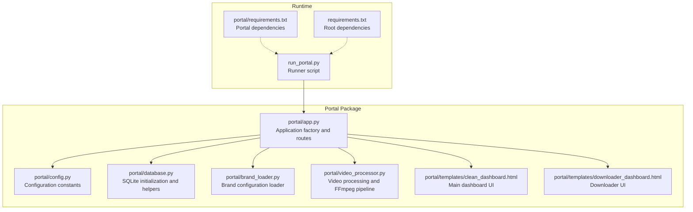
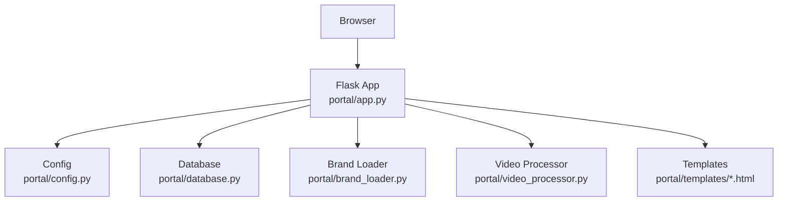
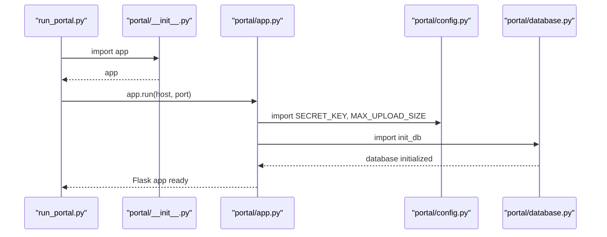
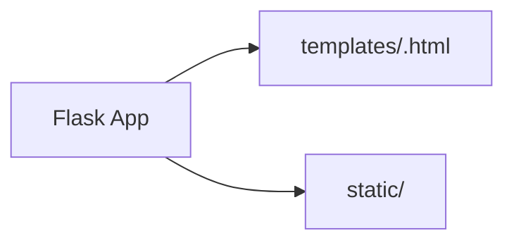
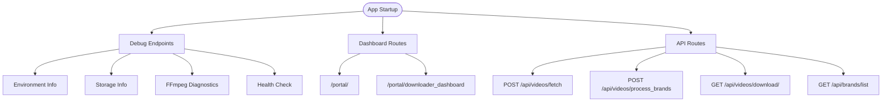
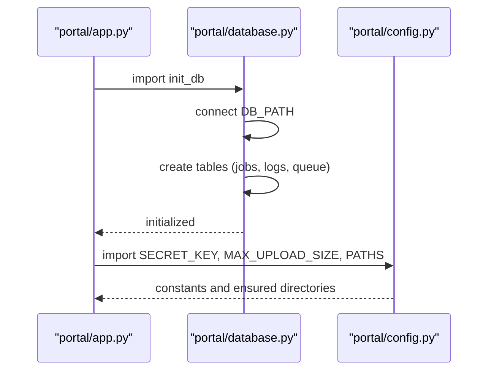
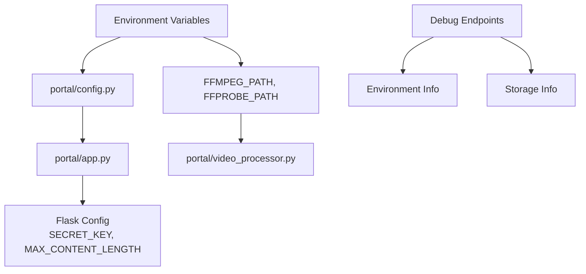
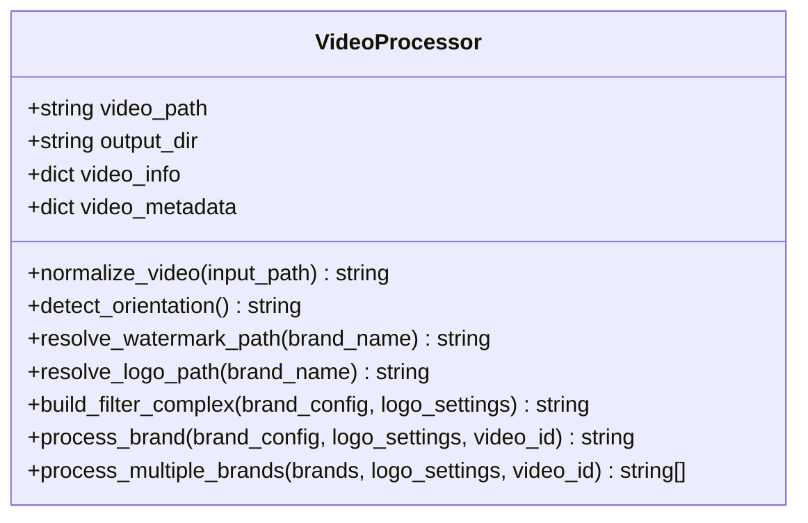
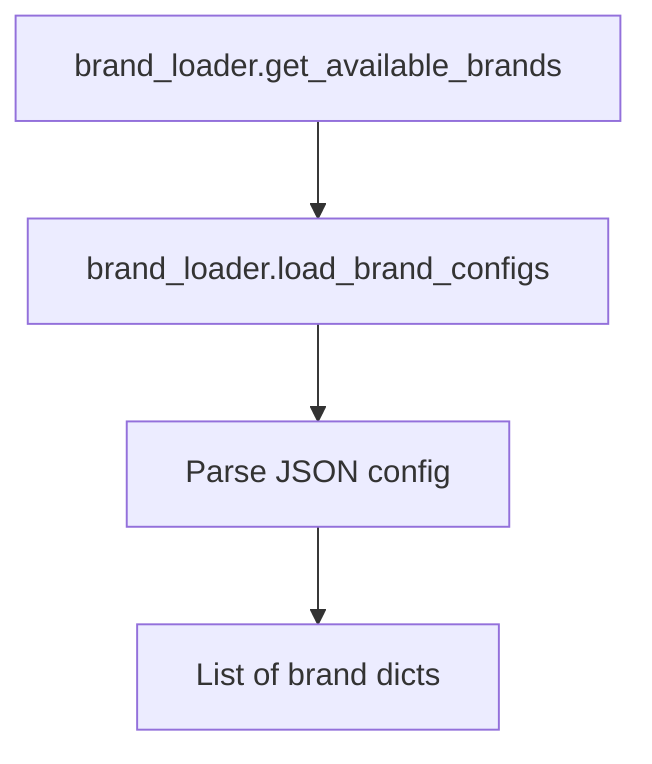
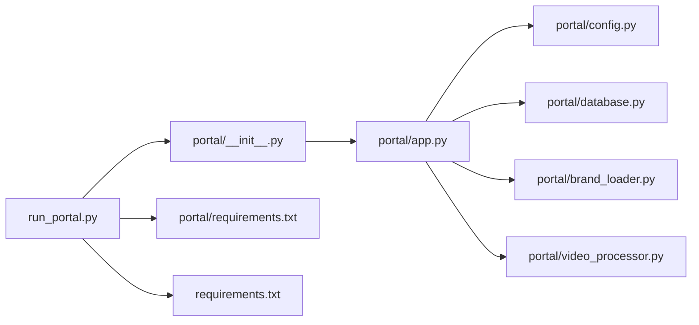

# Flask Application Setup

<cite>
**Referenced Files in This Document**
- [portal/app.py](file://portal/app.py)
- [portal/__init__.py](file://portal/__init__.py)
- [portal/config.py](file://portal/config.py)
- [portal/database.py](file://portal/database.py)
- [portal/brand_loader.py](file://portal/brand_loader.py)
- [portal/video_processor.py](file://portal/video_processor.py)
- [portal/templates/clean_dashboard.html](file://portal/templates/clean_dashboard.html)
- [portal/templates/downloader_dashboard.html](file://portal/templates/downloader_dashboard.html)
- [run_portal.py](file://run_portal.py)
- [portal/requirements.txt](file://portal/requirements.txt)
- [requirements.txt](file://requirements.txt)
</cite>

## Table of Contents
1. [Introduction](#introduction)
2. [Project Structure](#project-structure)
3. [Core Components](#core-components)
4. [Architecture Overview](#architecture-overview)
5. [Detailed Component Analysis](#detailed-component-analysis)
6. [Dependency Analysis](#dependency-analysis)
7. [Performance Considerations](#performance-considerations)
8. [Troubleshooting Guide](#troubleshooting-guide)
9. [Conclusion](#conclusion)

## Introduction
This document explains how the Flask application is set up and initialized. It covers configuration loading, secret key and upload size management, template and static asset folders, the application factory pattern, route organization, database initialization, environment variable usage, and configuration validation. It also describes how components integrate to deliver a portal for video downloading, previewing, and brand-aware watermarking.

## Project Structure
The portal is implemented as a Flask package with a clear separation of concerns:
- Application factory and routes live in the Flask package module.
- Configuration constants are loaded from a dedicated configuration module.
- Database initialization and helpers are in a separate module.
- Branding and video processing logic are encapsulated in dedicated modules.
- Templates and static assets are organized under the Flask package’s template and static directories.

**Diagram sources**
- [portal/app.py](file://portal/app.py#L44-L53)
- [portal/config.py](file://portal/config.py#L1-L42)
- [portal/database.py](file://portal/database.py#L9-L69)
- [portal/brand_loader.py](file://portal/brand_loader.py#L48-L59)
- [portal/video_processor.py](file://portal/video_processor.py#L71-L133)
- [portal/templates/clean_dashboard.html](file://portal/templates/clean_dashboard.html#L1-L50)
- [portal/templates/downloader_dashboard.html](file://portal/templates/downloader_dashboard.html#L1-L50)
- [run_portal.py](file://run_portal.py#L10-L30)
- [portal/requirements.txt](file://portal/requirements.txt#L1-L7)
- [requirements.txt](file://requirements.txt#L1-L18)

**Section sources**
- [portal/app.py](file://portal/app.py#L44-L53)
- [portal/config.py](file://portal/config.py#L1-L42)
- [portal/database.py](file://portal/database.py#L9-L69)
- [portal/brand_loader.py](file://portal/brand_loader.py#L48-L59)
- [portal/video_processor.py](file://portal/video_processor.py#L71-L133)
- [portal/templates/clean_dashboard.html](file://portal/templates/clean_dashboard.html#L1-L50)
- [portal/templates/downloader_dashboard.html](file://portal/templates/downloader_dashboard.html#L1-L50)
- [run_portal.py](file://run_portal.py#L10-L30)
- [portal/requirements.txt](file://portal/requirements.txt#L1-L7)
- [requirements.txt](file://requirements.txt#L1-L18)

## Core Components
- Application factory and initialization
  - The Flask application is created with explicit template and static folder configuration and configured with a secret key and maximum upload size.
  - Database initialization runs at import time.
  - Debug endpoints expose environment, storage, and FFmpeg diagnostics.
- Configuration module
  - Centralizes paths, secrets, limits, and ensures required directories exist.
- Database module
  - Initializes SQLite tables for jobs, logs, and queue, and exposes helpers to manage them.
- Brand loader
  - Loads brand configurations from a JSON file and returns structured brand data.
- Video processor
  - Encapsulates FFmpeg-based video normalization and branding pipeline with dynamic asset resolution.
- Templates
  - Jinja2 templates provide the UI for the portal dashboards.

**Section sources**
- [portal/app.py](file://portal/app.py#L44-L53)
- [portal/config.py](file://portal/config.py#L1-L42)
- [portal/database.py](file://portal/database.py#L9-L69)
- [portal/brand_loader.py](file://portal/brand_loader.py#L9-L45)
- [portal/video_processor.py](file://portal/video_processor.py#L21-L68)

## Architecture Overview
The application follows a modular Flask architecture:
- The Flask app is instantiated in the package module and exported via the package’s __init__.
- Routes are defined in the app module and delegate to configuration, database, brand loader, and video processor modules.
- Templates are rendered by Flask’s Jinja2 engine.
- Static assets are served via Flask’s static_url_path mapping.

**Diagram sources**
- [portal/app.py](file://portal/app.py#L44-L53)
- [portal/config.py](file://portal/config.py#L1-L42)
- [portal/database.py](file://portal/database.py#L9-L69)
- [portal/brand_loader.py](file://portal/brand_loader.py#L48-L59)
- [portal/video_processor.py](file://portal/video_processor.py#L71-L133)
- [portal/templates/clean_dashboard.html](file://portal/templates/clean_dashboard.html#L1-L50)

## Detailed Component Analysis

### Application Factory Pattern and Initialization
- The Flask app is created with explicit template_folder and static_folder pointing to the package’s templates and static directories, and static_url_path configured for serving static assets.
- The SECRET_KEY is set from configuration, and MAX_CONTENT_LENGTH enforces upload size limits.
- Database initialization occurs immediately upon import of the app module.
- Debug endpoints provide introspection into environment variables, storage layout, FFmpeg availability, and health checks.

**Diagram sources**
- [run_portal.py](file://run_portal.py#L10-L30)
- [portal/__init__.py](file://portal/__init__.py#L4-L6)
- [portal/app.py](file://portal/app.py#L44-L53)
- [portal/config.py](file://portal/config.py#L30-L36)
- [portal/database.py](file://portal/database.py#L9-L69)

**Section sources**
- [portal/app.py](file://portal/app.py#L44-L53)
- [portal/config.py](file://portal/config.py#L30-L36)
- [portal/database.py](file://portal/database.py#L9-L69)
- [portal/__init__.py](file://portal/__init__.py#L4-L6)
- [run_portal.py](file://run_portal.py#L10-L30)

### Template and Static Folder Configuration
- The Flask app is configured with template_folder='templates' and static_folder='static' relative to the package directory.
- Static assets are served under the static_url_path prefix.
- The templates directory contains the main dashboards used by the portal routes.

**Diagram sources**
- [portal/app.py](file://portal/app.py#L44-L47)
- [portal/templates/clean_dashboard.html](file://portal/templates/clean_dashboard.html#L1-L50)
- [portal/templates/downloader_dashboard.html](file://portal/templates/downloader_dashboard.html#L1-L50)

**Section sources**
- [portal/app.py](file://portal/app.py#L44-L47)
- [portal/templates/clean_dashboard.html](file://portal/templates/clean_dashboard.html#L1-L50)
- [portal/templates/downloader_dashboard.html](file://portal/templates/downloader_dashboard.html#L1-L50)

### Routes Organization
- The app defines:
  - Health and debug endpoints for operational visibility.
  - Frontend dashboards for portal and downloader UIs.
  - API endpoints for fetching videos, processing brands, downloading outputs, listing brands, and preview utilities.
- Routes are grouped by concern: health/debug, frontend dashboards, and video processing APIs.

**Diagram sources**
- [portal/app.py](file://portal/app.py#L55-L214)
- [portal/app.py](file://portal/app.py#L225-L290)
- [portal/app.py](file://portal/app.py#L296-L323)
- [portal/app.py](file://portal/app.py#L609-L784)

**Section sources**
- [portal/app.py](file://portal/app.py#L55-L214)
- [portal/app.py](file://portal/app.py#L225-L290)
- [portal/app.py](file://portal/app.py#L296-L323)
- [portal/app.py](file://portal/app.py#L609-L784)

### Database Initialization and Global Configuration Loading
- Database initialization creates jobs, logs, and queue tables and commits them.
- The database module exposes helpers to create jobs, update statuses, query recent entries, and log events.
- Configuration constants define paths, secrets, and limits; directories are ensured to exist at import time.

**Diagram sources**
- [portal/app.py](file://portal/app.py#L51-L53)
- [portal/database.py](file://portal/database.py#L9-L69)
- [portal/config.py](file://portal/config.py#L10-L42)

**Section sources**
- [portal/database.py](file://portal/database.py#L9-L69)
- [portal/config.py](file://portal/config.py#L10-L42)
- [portal/app.py](file://portal/app.py#L51-L53)

### Environment Variables and Configuration Validation
- Secrets and keys are loaded from environment variables with safe defaults for development.
- Upload size limit is enforced via Flask’s MAX_CONTENT_LENGTH.
- FFmpeg and FFprobe binary paths are resolved from environment variables with sensible defaults.
- Debug endpoints surface environment variables and storage conditions to validate configuration at runtime.

**Diagram sources**
- [portal/config.py](file://portal/config.py#L30-L36)
- [portal/app.py](file://portal/app.py#L48-L49)
- [portal/video_processor.py](file://portal/video_processor.py#L11-L18)
- [portal/app.py](file://portal/app.py#L75-L162)

**Section sources**
- [portal/config.py](file://portal/config.py#L30-L36)
- [portal/app.py](file://portal/app.py#L48-L49)
- [portal/app.py](file://portal/app.py#L75-L162)
- [portal/video_processor.py](file://portal/video_processor.py#L11-L18)

### Video Processing Pipeline
- The VideoProcessor class encapsulates:
  - Video normalization to a standard 8-bit H264 SDR format.
  - Dynamic asset resolution for watermarks and logos based on orientation and brand.
  - FFmpeg filter_complex construction and execution with tuned parameters.
- The app integrates this processor into brand-aware video workflows.

**Diagram sources**
- [portal/video_processor.py](file://portal/video_processor.py#L71-L133)
- [portal/video_processor.py](file://portal/video_processor.py#L228-L313)
- [portal/video_processor.py](file://portal/video_processor.py#L315-L404)

**Section sources**
- [portal/video_processor.py](file://portal/video_processor.py#L21-L68)
- [portal/video_processor.py](file://portal/video_processor.py#L71-L133)
- [portal/video_processor.py](file://portal/video_processor.py#L228-L313)
- [portal/video_processor.py](file://portal/video_processor.py#L315-L404)

### Brand Configuration Loading
- Brand configurations are loaded from a JSON file and returned as structured data for use in the UI and processing pipeline.

**Diagram sources**
- [portal/brand_loader.py](file://portal/brand_loader.py#L48-L59)
- [portal/brand_loader.py](file://portal/brand_loader.py#L9-L45)

**Section sources**
- [portal/brand_loader.py](file://portal/brand_loader.py#L9-L45)
- [portal/brand_loader.py](file://portal/brand_loader.py#L48-L59)

## Dependency Analysis
- The runner script imports the app from the package and starts the development server.
- The app imports configuration, database, brand loader, and video processor modules.
- Requirements files define the Flask stack and related libraries.

**Diagram sources**
- [run_portal.py](file://run_portal.py#L10-L30)
- [portal/__init__.py](file://portal/__init__.py#L4-L6)
- [portal/app.py](file://portal/app.py#L37-L41)
- [portal/requirements.txt](file://portal/requirements.txt#L1-L7)
- [requirements.txt](file://requirements.txt#L1-L18)

**Section sources**
- [run_portal.py](file://run_portal.py#L10-L30)
- [portal/__init__.py](file://portal/__init__.py#L4-L6)
- [portal/app.py](file://portal/app.py#L37-L41)
- [portal/requirements.txt](file://portal/requirements.txt#L1-L7)
- [requirements.txt](file://requirements.txt#L1-L18)

## Performance Considerations
- Upload size limits prevent large payloads from overwhelming server resources.
- Video normalization and branding are executed via FFmpeg; the processor sets tuned parameters for rendering environments.
- The app serializes video processing requests to avoid resource contention on constrained platforms.

[No sources needed since this section provides general guidance]

## Troubleshooting Guide
- Use debug endpoints to inspect environment variables, storage directories, FFmpeg availability, and health checks.
- Validate that required directories exist and are writable.
- Confirm that secrets and binary paths are correctly set via environment variables.

**Section sources**
- [portal/app.py](file://portal/app.py#L75-L162)
- [portal/app.py](file://portal/app.py#L188-L214)
- [portal/config.py](file://portal/config.py#L39-L42)

## Conclusion
The Flask application is structured around a clear separation of concerns: a concise application factory, centralized configuration, robust database initialization, modular brand and video processing logic, and templated UIs. Environment variables and debug endpoints enable safe deployment and runtime validation. The architecture supports scalable video processing while maintaining simplicity and observability.