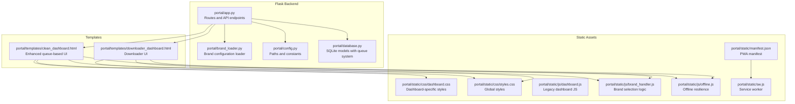
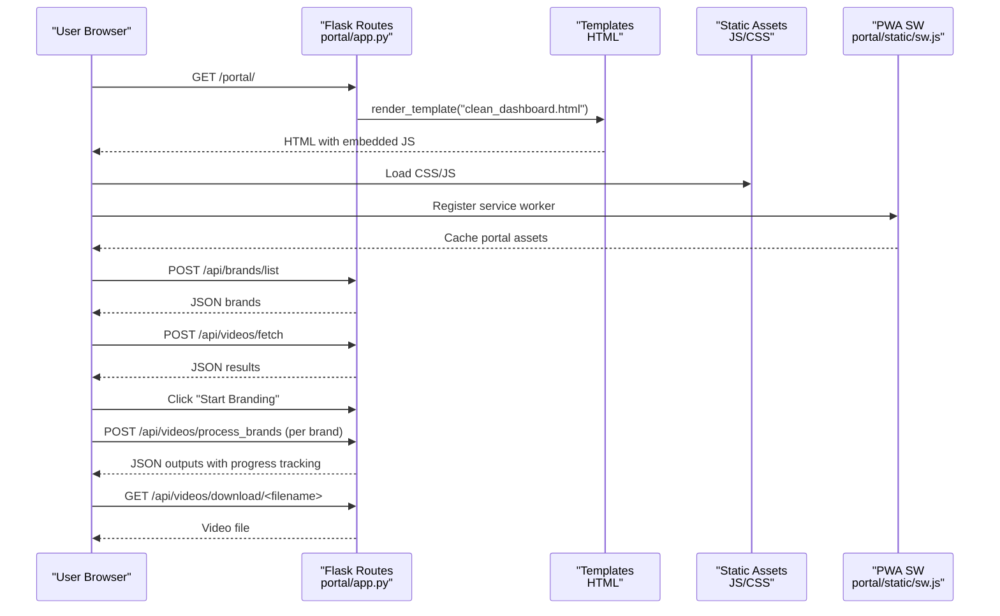
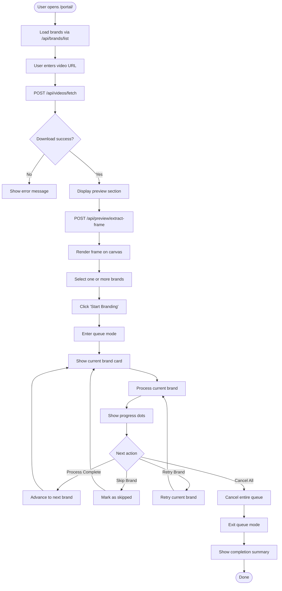
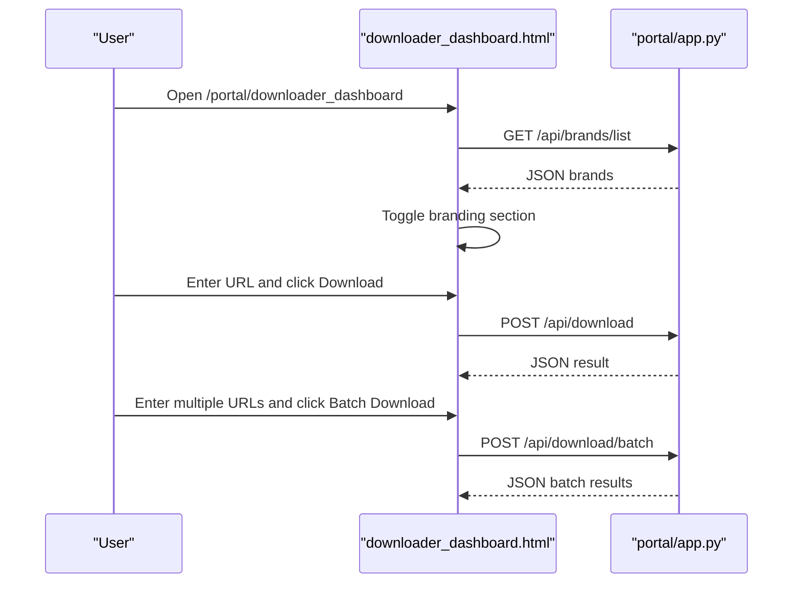
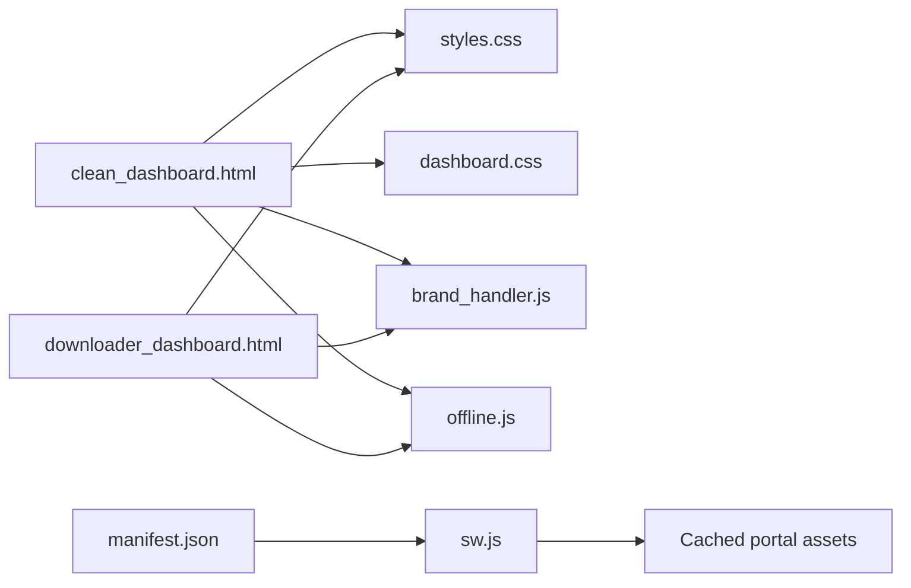
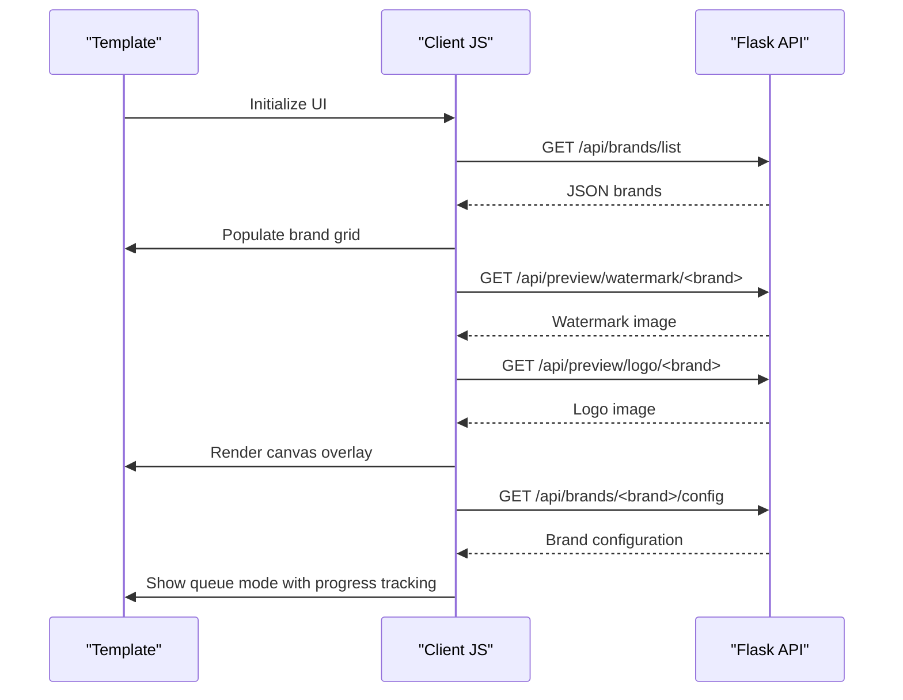
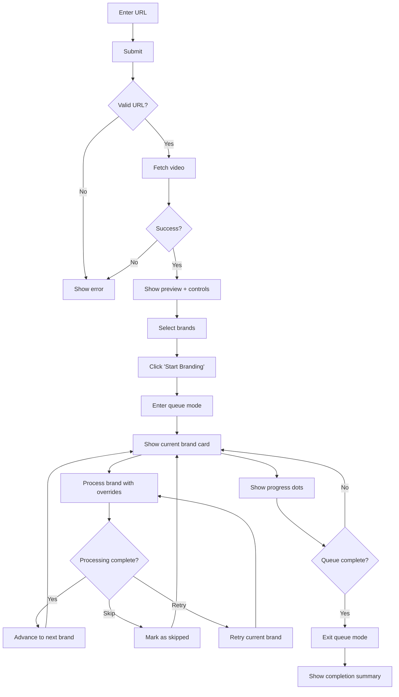
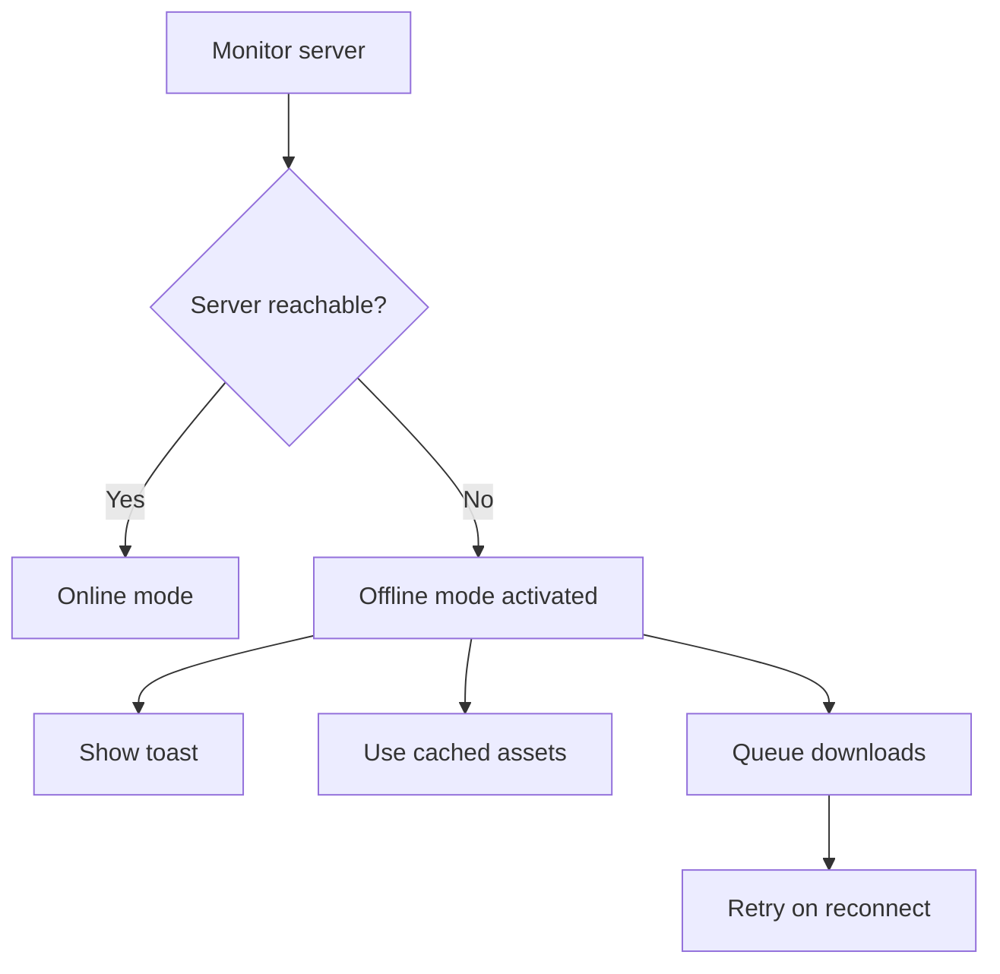
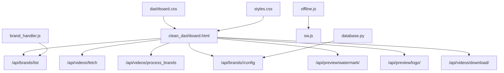

# Frontend Interface

<cite>
**Referenced Files in This Document**
- [app.py](file://portal/app.py)
- [simple_app.py](file://portal/simple_app.py)
- [clean_dashboard.html](file://portal/templates/clean_dashboard.html)
- [downloader_dashboard.html](file://portal/templates/downloader_dashboard.html)
- [dashboard.js](file://portal/static/js/dashboard.js)
- [brand_handler.js](file://portal/static/js/brand_handler.js)
- [dashboard.css](file://portal/static/css/dashboard.css)
- [styles.css](file://portal/static/css/styles.css)
- [offline.js](file://portal/static/js/offline.js)
- [brand_loader.py](file://portal/brand_loader.py)
- [config.py](file://portal/config.py)
- [database.py](file://portal/database.py)
- [manifest.json](file://portal/static/manifest.json)
- [sw.js](file://portal/static/sw.js)
</cite>

## Update Summary
**Changes Made**
- Updated queue mode interface with real-time progress tracking and individual brand override states
- Added enhanced user controls for skip, cancel, and retry operations
- Modified selection mode to dual-mode interface with '💡 Click multiple brands, then Start Branding' instructions
- Enhanced brand configuration system with per-brand override states and database persistence
- Updated processing workflow from bulk branding to sequential queue-based processing

## Table of Contents
1. [Introduction](#introduction)
2. [Project Structure](#project-structure)
3. [Core Components](#core-components)
4. [Architecture Overview](#architecture-overview)
5. [Detailed Component Analysis](#detailed-component-analysis)
6. [Dependency Analysis](#dependency-analysis)
7. [Performance Considerations](#performance-considerations)
8. [Troubleshooting Guide](#troubleshooting-guide)
9. [Conclusion](#conclusion)

## Introduction
This document describes the frontend interface and user interaction patterns for the WatchTheFall Portal web application. The application has undergone a major UI redesign from bulk branding to a queue-based sequential processing system. It covers the main dashboard routes (/portal/ and /portal/downloader_dashboard), mobile-optimized design and responsive layout, user workflows for video upload and URL input, brand selection, and download workflows. It also documents static asset management (CSS, JavaScript, images), the template rendering system, dynamic content injection, browser compatibility, and performance optimization techniques.

## Project Structure
The frontend is organized around two primary HTML templates rendered by the Flask backend, with shared static assets and a Progressive Web App (PWA) service worker for offline resilience. The system now features a sophisticated queue-based processing engine with real-time progress tracking and individual brand override management.

**Diagram sources**
- [app.py](file://portal/app.py#L44-L53)
- [brand_loader.py](file://portal/brand_loader.py#L48-L59)
- [config.py](file://portal/config.py#L6-L42)
- [database.py](file://portal/database.py#L9-L69)
- [clean_dashboard.html](file://portal/templates/clean_dashboard.html#L1-L795)
- [downloader_dashboard.html](file://portal/templates/downloader_dashboard.html#L1-L555)
- [dashboard.css](file://portal/static/css/dashboard.css#L1-L153)
- [styles.css](file://portal/static/css/styles.css#L1-L26)
- [dashboard.js](file://portal/static/js/dashboard.js#L1-L130)
- [brand_handler.js](file://portal/static/js/brand_handler.js#L1-L49)
- [offline.js](file://portal/static/js/offline.js#L1-L175)
- [manifest.json](file://portal/static/manifest.json#L1-L40)
- [sw.js](file://portal/static/sw.js#L1-L79)

**Section sources**
- [app.py](file://portal/app.py#L44-L53)
- [config.py](file://portal/config.py#L6-L42)

## Core Components
- Flask routes serve the dashboards and expose APIs for video fetching, branding, previews, and system diagnostics.
- Templates define the UI and embed JavaScript for interactivity and dynamic content, now featuring queue-based processing.
- Static assets include CSS for styling and JS for user interactions, offline resilience, and brand handling.
- PWA manifest and service worker enable offline-first behavior and instant loading.
- Database layer manages brand configurations, queue processing, and job status tracking.

Key routes and endpoints:
- /portal/ → renders clean_dashboard.html with queue-based processing
- /portal/downloader_dashboard → renders downloader_dashboard.html
- /api/videos/fetch → fetch video from URL(s)
- /api/videos/process_brands → apply branding overlays with queue processing
- /api/brands/list → list available brands
- /api/brands/<brand>/config → get/set brand-specific configurations
- /api/preview/watermark/<brand> and /api/preview/logo/<brand> → preview assets
- /api/videos/download/<filename> → download processed video

**Section sources**
- [app.py](file://portal/app.py#L296-L303)
- [app.py](file://portal/app.py#L609-L784)
- [app.py](file://portal/app.py#L912-L945)
- [app.py](file://portal/app.py#L790-L810)
- [app.py](file://portal/app.py#L995-L1051)

## Architecture Overview
The frontend architecture combines server-rendered templates with client-side JavaScript for dynamic interactions. The service worker caches critical assets and the portal entry, enabling instant load and graceful degradation when the server is unreachable. The new queue-based system processes brands sequentially with real-time progress tracking and individual brand override states.

**Diagram sources**
- [app.py](file://portal/app.py#L296-L303)
- [app.py](file://portal/app.py#L609-L784)
- [app.py](file://portal/app.py#L912-L945)
- [app.py](file://portal/app.py#L790-L810)
- [clean_dashboard.html](file://portal/templates/clean_dashboard.html#L561-L618)
- [sw.js](file://portal/static/sw.js#L1-L79)

## Detailed Component Analysis

### Enhanced Clean Dashboard UI (/portal/) with Queue-Based Processing
The clean dashboard now features a sophisticated queue-based processing system that replaces the previous bulk branding approach. Users can select multiple brands, then start branding to process them sequentially with real-time progress tracking and individual brand override states.

- **Dual-Mode Interface**: Features both selection mode (for multi-brand selection) and queue mode (for sequential processing).
- **Real-Time Progress Tracking**: Visual progress indicators show current brand being processed, completed brands, and skipped brands.
- **Individual Brand Override States**: Each brand maintains its own configuration overrides that can be customized during processing.
- **Enhanced User Controls**: Skip, cancel, and retry functionality for granular control over the processing workflow.
- **Mobile-first design** with viewport meta tag and responsive CSS.
- **Canvas-based preview** supports watermark scaling/opacity and logo scaling/padding with draggable logo positioning.
- **Multi-brand selection** with dynamic asset loading for watermark and logo previews.
- **Local persistence** of the last downloaded file for quick reuse.

**Diagram sources**
- [clean_dashboard.html](file://portal/templates/clean_dashboard.html#L806-L838)
- [clean_dashboard.html](file://portal/templates/clean_dashboard.html#L840-L894)
- [clean_dashboard.html](file://portal/templates/clean_dashboard.html#L1049-L1063)
- [clean_dashboard.html](file://portal/templates/clean_dashboard.html#L1065-L1095)

**Section sources**
- [clean_dashboard.html](file://portal/templates/clean_dashboard.html#L1-L1212)

### Downloader Dashboard UI (/portal/downloader_dashboard)
The downloader dashboard offers a simpler interface focused on single and batch downloads, optional branding, and download history.

- Tabs for Single Download, Batch Download, and Download History.
- Brand selection toggles with dynamic loading of available brands.
- Progress simulation and result display with success/error states.
- History items with direct download links.

**Diagram sources**
- [downloader_dashboard.html](file://portal/templates/downloader_dashboard.html#L1-L555)
- [app.py](file://portal/app.py#L609-L784)

**Section sources**
- [downloader_dashboard.html](file://portal/templates/downloader_dashboard.html#L1-L555)

### Static Asset Management
- CSS: Global styles in styles.css and dashboard-specific overrides in dashboard.css. Media queries optimize for small screens.
- JavaScript: dashboard.js (legacy), brand_handler.js (brand loading), and offline.js (offline resilience and PWA integration).
- Images: logos and watermarks under portal/static/watermarks and portal/static/img.
- PWA: manifest.json defines app identity and icons; sw.js caches portal assets and serves cached index on navigation fallback.

**Diagram sources**
- [clean_dashboard.html](file://portal/templates/clean_dashboard.html#L1-L795)
- [downloader_dashboard.html](file://portal/templates/downloader_dashboard.html#L1-L555)
- [styles.css](file://portal/static/css/styles.css#L1-L26)
- [dashboard.css](file://portal/static/css/dashboard.css#L1-L153)
- [brand_handler.js](file://portal/static/js/brand_handler.js#L1-L49)
- [offline.js](file://portal/static/js/offline.js#L1-L175)
- [manifest.json](file://portal/static/manifest.json#L1-L40)
- [sw.js](file://portal/static/sw.js#L1-L79)

**Section sources**
- [styles.css](file://portal/static/css/styles.css#L1-L26)
- [dashboard.css](file://portal/static/css/dashboard.css#L1-L153)
- [brand_handler.js](file://portal/static/js/brand_handler.js#L1-L49)
- [offline.js](file://portal/static/js/offline.js#L1-L175)
- [manifest.json](file://portal/static/manifest.json#L1-L40)
- [sw.js](file://portal/static/sw.js#L1-L79)

### Template Rendering and Dynamic Content Injection
- Flask routes render templates with render_template and pass brand lists and preview endpoints to the frontend.
- JavaScript dynamically injects content:
  - Brand grid population from /api/brands/list
  - Preview assets for watermark/logo from /api/preview/watermark/<brand> and /api/preview/logo/<brand>
  - Results and download links after processing
  - Queue mode interface with real-time progress tracking
- Legacy dashboard.js provides status messaging and binary file downloads.

**Diagram sources**
- [clean_dashboard.html](file://portal/templates/clean_dashboard.html#L561-L618)
- [app.py](file://portal/app.py#L912-L945)
- [brand_loader.py](file://portal/brand_loader.py#L48-L59)

**Section sources**
- [clean_dashboard.html](file://portal/templates/clean_dashboard.html#L561-L618)
- [brand_loader.py](file://portal/brand_loader.py#L48-L59)

### User Interaction Patterns
- **Video URL input**: Paste TikTok/Instagram/X links; submit to fetch; display success/error; show preview section.
- **Brand selection**: Multi-select brands with '💡 Click multiple brands, then Start Branding' instructions; first selection triggers asset loading for preview.
- **Queue-based processing**: Sequential processing with real-time progress tracking, individual brand override states, and enhanced controls (skip, cancel, retry).
- **Canvas controls**: Adjust watermark scale/opacity; show bounds; adjust logo scale/padding; drag logo to reposition.
- **Download workflow**: After processing, download links are generated per brand; legacy dashboard uses binary download helper.

**Diagram sources**
- [clean_dashboard.html](file://portal/templates/clean_dashboard.html#L621-L750)
- [app.py](file://portal/app.py#L609-L784)

**Section sources**
- [clean_dashboard.html](file://portal/templates/clean_dashboard.html#L621-L750)

### Mobile-Optimized Design and Responsive Layout
- Viewport meta tag ensures proper scaling on mobile devices.
- CSS media queries in dashboard.css target small screens for reduced padding and adjusted typography.
- Touch events for logo dragging and pinch-to-resize are supported in the canvas preview.
- Downloader dashboard uses a card-based layout and tabbed interface optimized for single-column layouts.
- Queue mode interface adapts to mobile screens with stacked progress indicators and compact controls.

**Section sources**
- [clean_dashboard.html](file://portal/templates/clean_dashboard.html#L6-L280)
- [dashboard.css](file://portal/static/css/dashboard.css#L141-L153)
- [downloader_dashboard.html](file://portal/templates/downloader_dashboard.html#L1-L555)

### Offline Resilience and PWA
- Service worker caches portal entry and key assets; serves cached index on navigation when offline.
- Offline JS implements:
  - Safe fetch wrapper and offline toast notifications
  - Download queue persisted to localStorage
  - Brand config caching and fallback
  - Periodic server health checks and mode switching

**Diagram sources**
- [offline.js](file://portal/static/js/offline.js#L101-L109)
- [offline.js](file://portal/static/js/offline.js#L45-L71)
- [sw.js](file://portal/static/sw.js#L35-L78)

**Section sources**
- [offline.js](file://portal/static/js/offline.js#L1-L175)
- [sw.js](file://portal/static/sw.js#L1-L79)
- [manifest.json](file://portal/static/manifest.json#L1-L40)

## Dependency Analysis
The frontend relies on Flask routes for brand data and video processing, with client-side JavaScript handling UI interactions, queue management, and offline behavior.

**Diagram sources**
- [app.py](file://portal/app.py#L609-L784)
- [app.py](file://portal/app.py#L912-L945)
- [brand_handler.js](file://portal/static/js/brand_handler.js#L1-L49)
- [offline.js](file://portal/static/js/offline.js#L1-L175)
- [sw.js](file://portal/static/sw.js#L1-L79)
- [dashboard.css](file://portal/static/css/dashboard.css#L1-L153)
- [styles.css](file://portal/static/css/styles.css#L1-L26)
- [database.py](file://portal/database.py#L265-L339)

**Section sources**
- [app.py](file://portal/app.py#L609-L784)
- [brand_handler.js](file://portal/static/js/brand_handler.js#L1-L49)

## Performance Considerations
- Client-side canvas preview avoids server-side video processing for UI feedback.
- Service worker caching reduces load times and enables offline usage.
- Media queries and minimal CSS reduce rendering overhead on mobile.
- Sequential video downloads (legacy) and controlled concurrency help manage resource usage.
- Queue-based processing prevents memory exhaustion by processing brands one at a time.
- Real-time progress tracking provides immediate feedback without blocking the UI.
- Individual brand override states are cached locally to minimize server requests.

## Troubleshooting Guide
Common issues and remedies:
- Brand integrity: Use the "Brand Integrity" debug tool to inspect brand assets and options.
- System status: Use the "System Status" debug tool to check health of essential directories.
- Download failures: Verify URL validity and platform support; check network connectivity and offline mode.
- Audio-only videos: The processing pipeline detects audio-only content and surfaces a specific error message.
- Queue processing failures: Use skip, retry, or cancel operations to manage failed brands.
- Brand configuration issues: Check individual brand override states and reset to defaults if needed.

Operational endpoints:
- /__debug_brands → Inspect brand configurations
- /__debug_health → Health checks for directories
- /__debug_storage → Storage usage and writability
- /__debug_ffmpeg → FFmpeg availability and version
- /__debug_env → Environment variables (sensitive values hidden)

**Section sources**
- [app.py](file://portal/app.py#L164-L186)
- [app.py](file://portal/app.py#L188-L214)
- [app.py](file://portal/app.py#L118-L162)
- [app.py](file://portal/app.py#L92-L116)
- [app.py](file://portal/app.py#L75-L90)

## Conclusion
The WatchTheFall Portal frontend delivers a mobile-friendly, responsive interface with robust offline capabilities and a sophisticated queue-based processing system. Users can quickly download videos via URL, preview branding overlays, select multiple brands, and apply customizable watermark and logo settings through an intuitive queue-based workflow. The combination of server-rendered templates, client-side JavaScript, real-time progress tracking, and a service worker ensures reliability and performance across devices and network conditions. The new queue-based system provides granular control over the branding process with skip, cancel, and retry functionality, making it ideal for processing multiple brands efficiently and reliably.