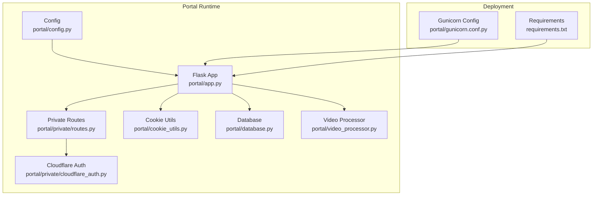
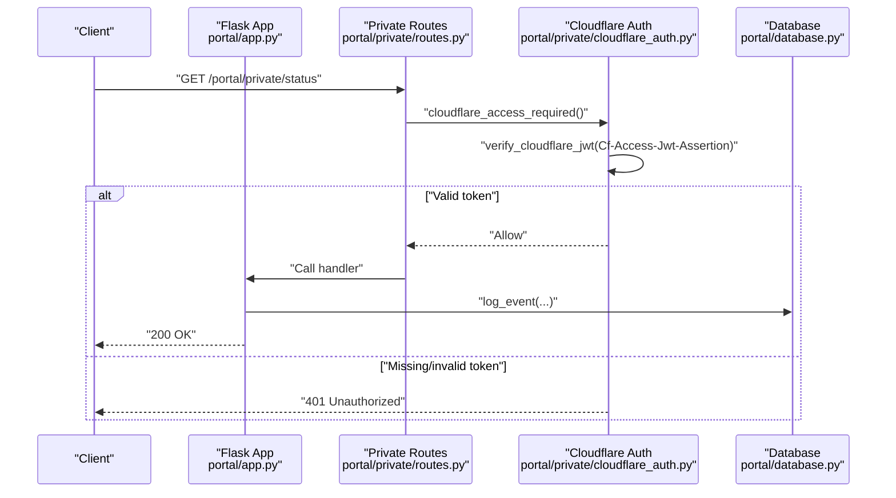
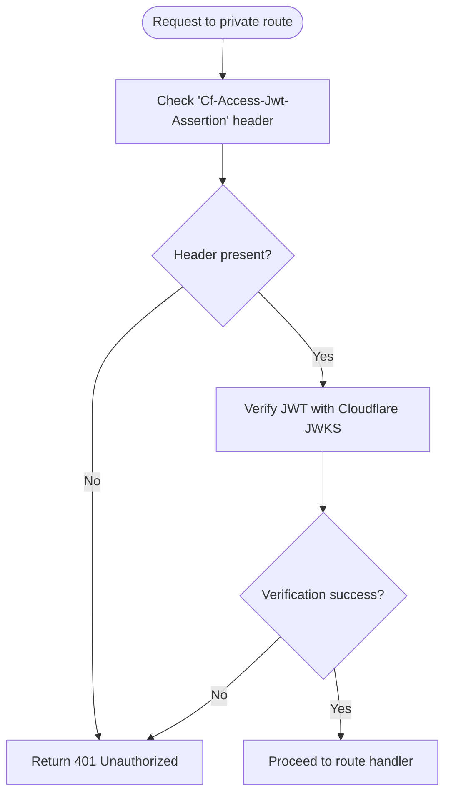
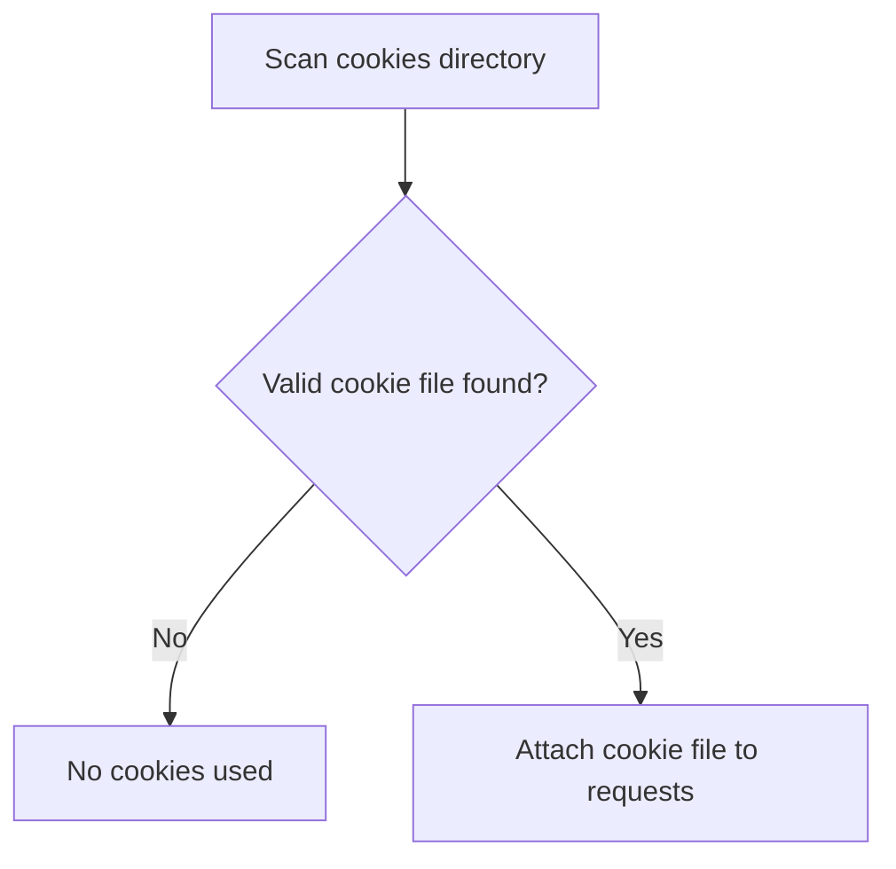
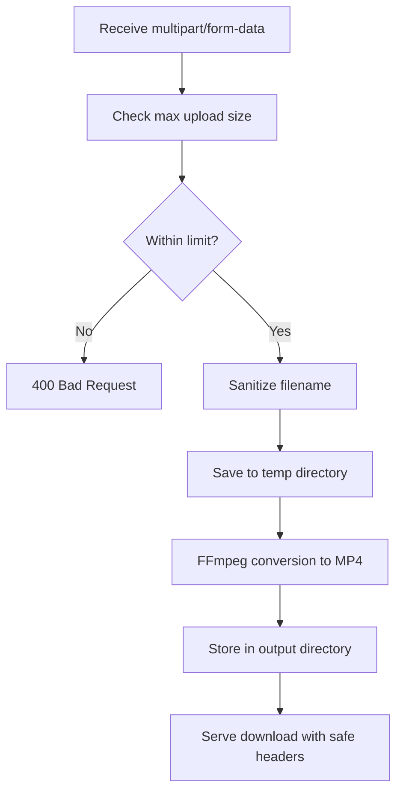
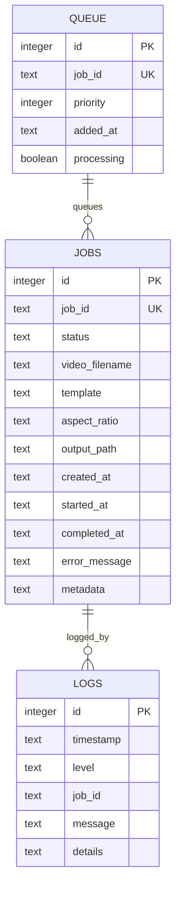
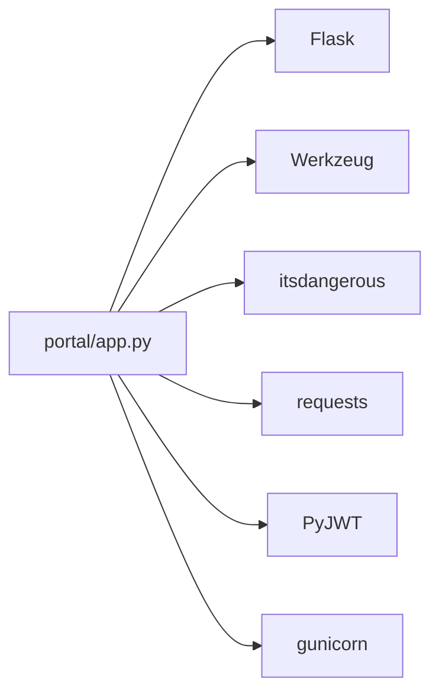

# Security and Authentication

<cite>
**Referenced Files in This Document**
- [config.py](file://portal/config.py)
- [app.py](file://portal/app.py)
- [cookie_utils.py](file://portal/cookie_utils.py)
- [routes.py](file://portal/private/routes.py)
- [cloudflare_auth.py](file://portal/private/cloudflare_auth.py)
- [database.py](file://portal/database.py)
- [gunicorn.conf.py](file://portal/gunicorn.conf.py)
- [requirements.txt](file://requirements.txt)
- [video_processor.py](file://portal/video_processor.py)
</cite>

## Table of Contents
1. [Introduction](#introduction)
2. [Project Structure](#project-structure)
3. [Core Components](#core-components)
4. [Architecture Overview](#architecture-overview)
5. [Detailed Component Analysis](#detailed-component-analysis)
6. [Dependency Analysis](#dependency-analysis)
7. [Performance Considerations](#performance-considerations)
8. [Troubleshooting Guide](#troubleshooting-guide)
9. [Conclusion](#conclusion)
10. [Appendices](#appendices)

## Introduction
This document details the security measures and authentication mechanisms in the WatchTheFall Portal application. It explains configuration-driven secrets, session and CSRF protections, API key enforcement, private route access control via Cloudflare Access, file upload safeguards, cookie management, CORS considerations, and production hardening guidance. It also provides secure usage examples and best practices to mitigate common vulnerabilities.

## Project Structure
Security-relevant components are primarily located under the portal package:
- Configuration and secrets: portal/config.py
- Application entry and route handlers: portal/app.py
- Private routes and Cloudflare Access integration: portal/private/*
- Cookie utilities for Instagram authentication: portal/cookie_utils.py
- Database logging and audit trail: portal/database.py
- Deployment runtime configuration: portal/gunicorn.conf.py
- External dependencies: requirements.txt
- Media processing and path resolution: portal/video_processor.py

**Diagram sources**
- [config.py](file://portal/config.py#L30-L37)
- [app.py](file://portal/app.py#L44-L53)
- [routes.py](file://portal/private/routes.py#L1-L29)
- [cloudflare_auth.py](file://portal/private/cloudflare_auth.py#L1-L64)
- [cookie_utils.py](file://portal/cookie_utils.py#L1-L59)
- [database.py](file://portal/database.py#L1-L204)
- [gunicorn.conf.py](file://portal/gunicorn.conf.py#L1-L36)
- [requirements.txt](file://requirements.txt#L1-L18)
- [video_processor.py](file://portal/video_processor.py#L1-L200)

**Section sources**
- [config.py](file://portal/config.py#L1-L42)
- [app.py](file://portal/app.py#L44-L53)

## Core Components
- Secret key and CSRF/session protection
  - The Flask app sets its SECRET_KEY from configuration, enabling signed sessions and CSRF protection via Flask-Werkzeug.
  - Reference: [app.py](file://portal/app.py#L48), [config.py](file://portal/config.py#L31)

- Portal API key enforcement
  - The application reads a dedicated API key from environment variables for securing sensitive endpoints.
  - Reference: [config.py](file://portal/config.py#L32)

- Private routes and Cloudflare Access
  - Private routes are guarded by a decorator that validates a Cloudflare Access JWT passed in a specific header.
  - Reference: [routes.py](file://portal/private/routes.py#L1-L29), [cloudflare_auth.py](file://portal/private/cloudflare_auth.py#L1-L64)

- Cookie management for Instagram authentication
  - Utilities scan and validate Netscape-format cookie files containing required tokens for platform-specific downloads.
  - Reference: [cookie_utils.py](file://portal/cookie_utils.py#L1-L59)

- File upload and download security
  - Upload size limits and allowed extensions are enforced; filenames are sanitized; downloads restrict traversal and serve safe headers.
  - Reference: [config.py](file://portal/config.py#L35-L36), [app.py](file://portal/app.py#L49), [app.py](file://portal/app.py#L790-L833)

- Logging and auditing
  - SQLite-backed logging records events and job statuses for auditability.
  - Reference: [database.py](file://portal/database.py#L1-L204)

**Section sources**
- [config.py](file://portal/config.py#L30-L37)
- [app.py](file://portal/app.py#L48-L53)
- [routes.py](file://portal/private/routes.py#L1-L29)
- [cloudflare_auth.py](file://portal/private/cloudflare_auth.py#L1-L64)
- [cookie_utils.py](file://portal/cookie_utils.py#L1-L59)
- [database.py](file://portal/database.py#L1-L204)

## Architecture Overview
The Portal enforces authentication and access control at multiple layers:
- Session and CSRF protection via SECRET_KEY
- API key checks for protected operations
- Cloudflare Access JWT verification for private routes
- Upload validation and safe file serving
- Database logging for audit trails

**Diagram sources**
- [routes.py](file://portal/private/routes.py#L20-L29)
- [cloudflare_auth.py](file://portal/private/cloudflare_auth.py#L42-L64)
- [app.py](file://portal/app.py#L44-L53)
- [database.py](file://portal/database.py#L152-L161)

## Detailed Component Analysis

### SECRET_KEY and Session Management
- Purpose
  - Flask’s SECRET_KEY enables signed sessions and CSRF protection for browser-based interactions.
- Configuration
  - Loaded from environment variable and applied to Flask app configuration.
- Implications
  - Must be cryptographically random, unique per environment, and kept secret.
  - Changing the key invalidates existing sessions.

References:
- [config.py](file://portal/config.py#L31)
- [app.py](file://portal/app.py#L48)

**Section sources**
- [config.py](file://portal/config.py#L31)
- [app.py](file://portal/app.py#L48)

### PORTAL_AUTH_KEY and API Endpoint Protection
- Purpose
  - A dedicated API key is used to protect sensitive endpoints and workflows.
- Implementation
  - The key is loaded from environment variables and should be checked by handlers requiring elevated access.
- Recommendations
  - Enforce the key on endpoints that modify state or access restricted resources.
  - Rotate keys regularly and log unauthorized attempts.

References:
- [config.py](file://portal/config.py#L32)

**Section sources**
- [config.py](file://portal/config.py#L32)

### Private Routes and Cloudflare Access Integration
- Guarding private endpoints
  - Private routes are mounted under a prefixed namespace and decorated with a Cloudflare Access requirement.
- Token validation
  - The decorator extracts a JWT from a specific header and verifies it against Cloudflare’s JWKS using the configured team domain and audience.
- Behavior in development
  - If required environment variables are absent, the decorator allows access in non-production environments.

**Diagram sources**
- [cloudflare_auth.py](file://portal/private/cloudflare_auth.py#L42-L64)
- [routes.py](file://portal/private/routes.py#L1-L29)

**Section sources**
- [routes.py](file://portal/private/routes.py#L1-L29)
- [cloudflare_auth.py](file://portal/private/cloudflare_auth.py#L1-L64)

### Cookie Management and Instagram Authentication
- Cookie discovery and validation
  - Utilities locate cookie files in a dedicated directory and validate their format and presence of required tokens.
- Usage in download flows
  - The application conditionally attaches a cookie file to media downloads when valid credentials are detected.

**Diagram sources**
- [cookie_utils.py](file://portal/cookie_utils.py#L7-L47)
- [app.py](file://portal/app.py#L390-L426)
- [app.py](file://portal/app.py#L650-L685)

**Section sources**
- [cookie_utils.py](file://portal/cookie_utils.py#L1-L59)
- [app.py](file://portal/app.py#L390-L426)
- [app.py](file://portal/app.py#L650-L685)

### File Upload Security and Content Validation
- Upload constraints
  - Maximum upload size and allowed extensions are enforced at the framework level.
  - Filenames are sanitized before saving to prevent path traversal.
- Conversion pipeline
  - Uploaded WebM files are saved temporarily, then converted to MP4 using a constrained FFmpeg profile optimized for speed and stability.
- Download security
  - Downloads are served from controlled output directories with safe headers and explicit content types.

**Diagram sources**
- [config.py](file://portal/config.py#L35-L36)
- [app.py](file://portal/app.py#L980-L1047)
- [app.py](file://portal/app.py#L1049-L1156)
- [app.py](file://portal/app.py#L790-L833)

**Section sources**
- [config.py](file://portal/config.py#L35-L36)
- [app.py](file://portal/app.py#L980-L1047)
- [app.py](file://portal/app.py#L1049-L1156)
- [app.py](file://portal/app.py#L790-L833)

### Database Logging and Audit Trail
- Tables
  - Jobs, Logs, Queue, and placeholder tables support job lifecycle tracking and event logging.
- Usage
  - Handlers log informational and error events with timestamps and optional details.
- Security benefit
  - Provides visibility into access attempts, failures, and processing outcomes.

**Diagram sources**
- [database.py](file://portal/database.py#L15-L65)
- [database.py](file://portal/database.py#L152-L161)

**Section sources**
- [database.py](file://portal/database.py#L1-L204)

### CORS Configuration and Cross-Origin Resource Sharing
- Current state
  - There is no explicit CORS configuration in the Flask app. Cross-origin behavior follows Flask defaults.
- Guidance
  - If external clients need to access the API from different origins, configure CORS explicitly (allowing only trusted origins) and set appropriate headers.
  - Avoid wildcard origins in production.

[No sources needed since this section provides general guidance]

## Dependency Analysis
External libraries supporting security and runtime:
- Flask, Jinja2, Werkzeug, itsdangerous: core web stack and signing utilities
- PyJWT, cryptography, requests: JWT decoding and HTTPS communication
- gunicorn: WSGI server with configurable timeouts and worker settings

**Diagram sources**
- [requirements.txt](file://requirements.txt#L1-L18)
- [app.py](file://portal/app.py#L4-L14)

**Section sources**
- [requirements.txt](file://requirements.txt#L1-L18)

## Performance Considerations
- Constrained FFmpeg profiles and worker settings are tuned for constrained environments, balancing speed and stability.
- Gunicorn configuration sets conservative timeouts and a single worker to reduce resource contention on shared hosting plans.

References:
- [gunicorn.conf.py](file://portal/gunicorn.conf.py#L1-L36)
- [app.py](file://portal/app.py#L1059-L1093)

**Section sources**
- [gunicorn.conf.py](file://portal/gunicorn.conf.py#L1-L36)
- [app.py](file://portal/app.py#L1059-L1093)

## Troubleshooting Guide
- Cloudflare Access 401 errors
  - Ensure the Cf-Access-Jwt-Assertion header is present and valid.
  - Confirm CF_TEAM_DOMAIN and CF_AUDIENCE environment variables are set appropriately.
  - Reference: [cloudflare_auth.py](file://portal/private/cloudflare_auth.py#L18-L22), [cloudflare_auth.py](file://portal/private/cloudflare_auth.py#L48-L61)

- Download failures
  - Verify the requested filename exists in the output directory and that the app serves the correct path.
  - Reference: [app.py](file://portal/app.py#L790-L833)

- Upload rejections
  - Check allowed extensions and maximum size limits.
  - Reference: [config.py](file://portal/config.py#L35-L36), [app.py](file://portal/app.py#L980-L1047)

- Cookie usage issues
  - Validate cookie file format and required tokens; confirm readability and content.
  - Reference: [cookie_utils.py](file://portal/cookie_utils.py#L34-L37), [app.py](file://portal/app.py#L390-L426)

**Section sources**
- [cloudflare_auth.py](file://portal/private/cloudflare_auth.py#L18-L22)
- [cloudflare_auth.py](file://portal/private/cloudflare_auth.py#L48-L61)
- [app.py](file://portal/app.py#L790-L833)
- [config.py](file://portal/config.py#L35-L36)
- [cookie_utils.py](file://portal/cookie_utils.py#L34-L37)

## Conclusion
The WatchTheFall Portal applies layered security controls: Flask SECRET_KEY for session and CSRF protection, a dedicated API key for sensitive operations, Cloudflare Access for private route enforcement, robust upload validation and safe file serving, and comprehensive database logging. Production deployments should enforce strict CORS policies, rotate secrets regularly, and monitor logs for anomalies.

## Appendices

### Secure API Usage Examples
- Private route access
  - Include the Cloudflare Access JWT in the Cf-Access-Jwt-Assertion header when calling private endpoints.
  - Reference: [routes.py](file://portal/private/routes.py#L20-L29), [cloudflare_auth.py](file://portal/private/cloudflare_auth.py#L48-L61)

- Upload and conversion
  - Submit a file with allowed extension and within size limits; poll the conversion status endpoint.
  - Reference: [config.py](file://portal/config.py#L35-L36), [app.py](file://portal/app.py#L980-L1047), [app.py](file://portal/app.py#L1158-L1189)

- Download secured files
  - Request the download URL returned after processing; the server enforces safe headers and path checks.
  - Reference: [app.py](file://portal/app.py#L790-L833)

### Production Hardening Checklist
- Secrets
  - Set SECRET_KEY and PORTAL_AUTH_KEY to strong, randomly generated values; store in environment variables.
  - References: [config.py](file://portal/config.py#L31-L32)

- Access control
  - Require Cloudflare Access for private routes; configure CF_TEAM_DOMAIN and CF_AUDIENCE.
  - References: [cloudflare_auth.py](file://portal/private/cloudflare_auth.py#L11-L12), [routes.py](file://portal/private/routes.py#L1-L29)

- Upload safety
  - Enforce allowed extensions and size limits; sanitize filenames; validate content before processing.
  - References: [config.py](file://portal/config.py#L35-L36), [app.py](file://portal/app.py#L980-L1047)

- Transport and headers
  - Serve over HTTPS; set security headers (e.g., Content-Type Options, Cache-Control).
  - References: [app.py](file://portal/app.py#L822-L825)

- Observability
  - Monitor logs and job statuses; alert on repeated 401 or upload failures.
  - References: [database.py](file://portal/database.py#L152-L161)