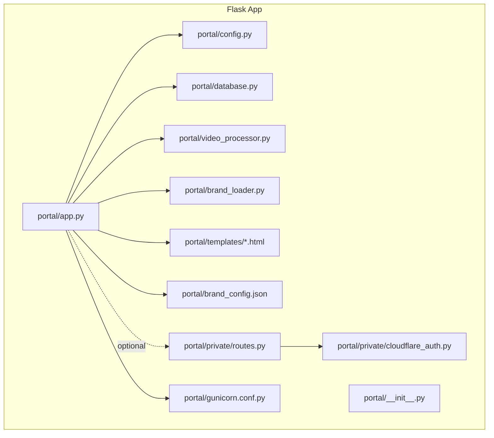
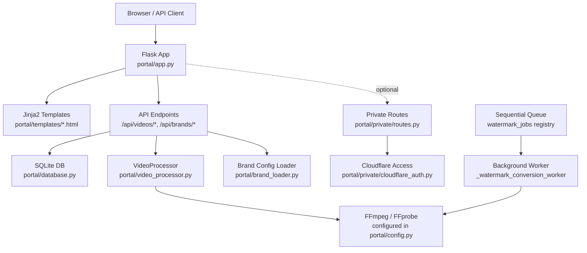
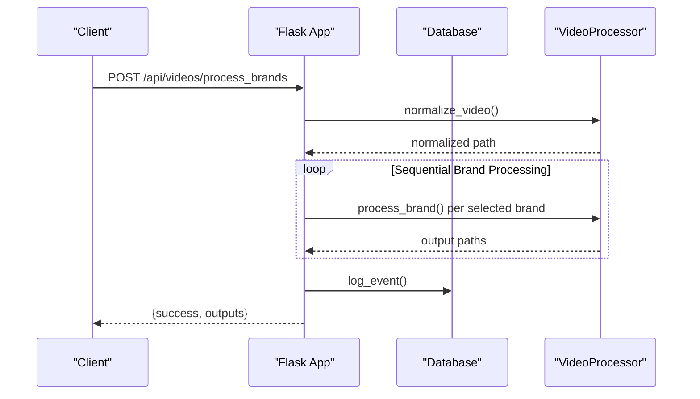
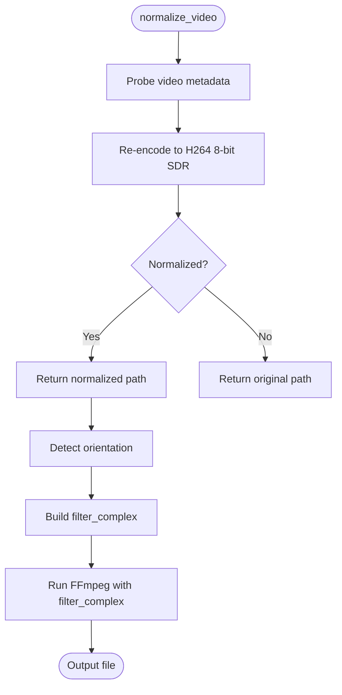
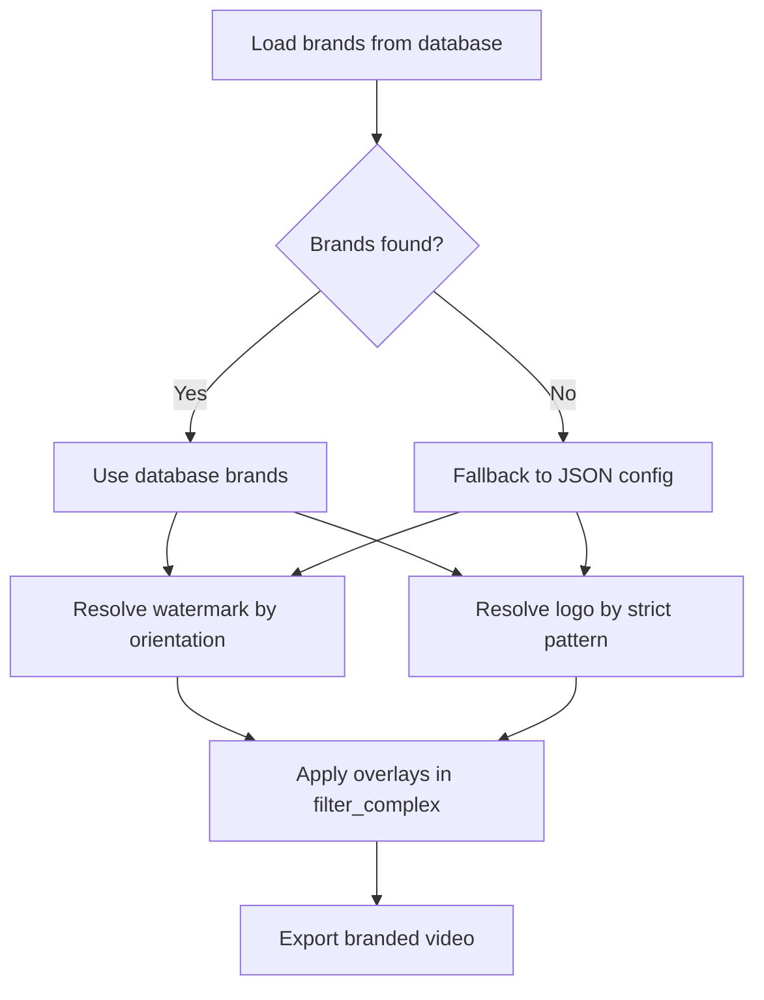
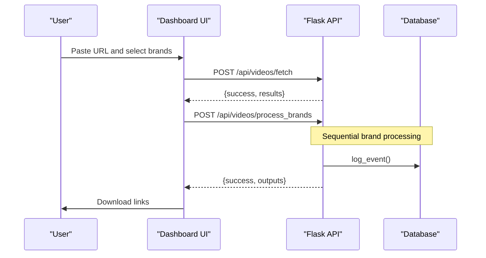
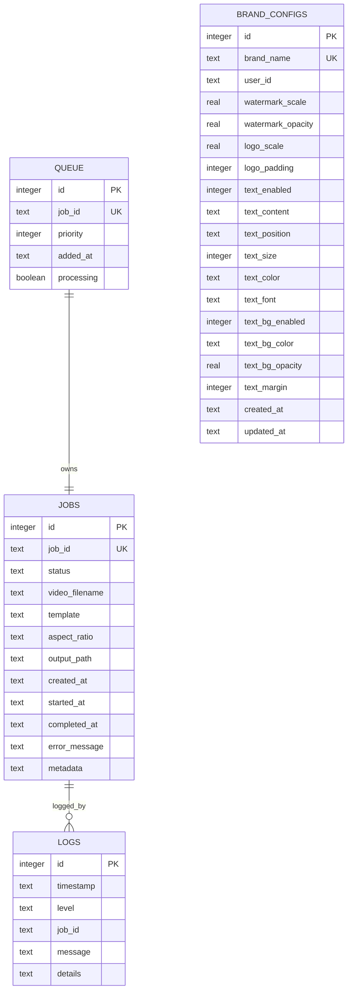
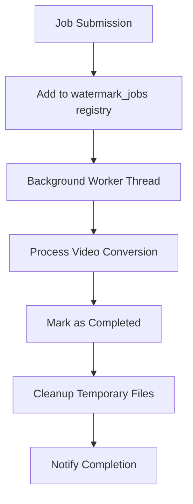
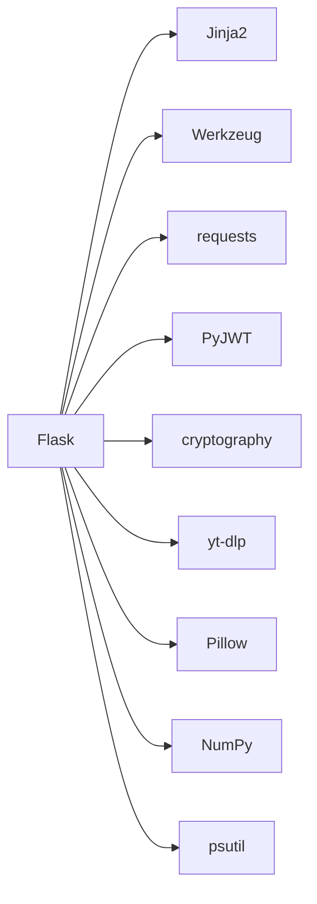
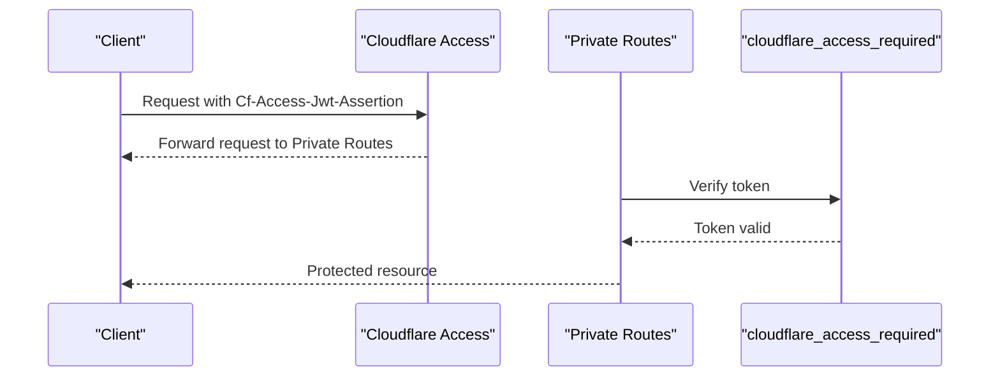

# Web Application

<cite>
**Referenced Files in This Document**
- [portal/app.py](file://portal/app.py)
- [portal/__init__.py](file://portal/__init__.py)
- [portal/config.py](file://portal/config.py)
- [portal/database.py](file://portal/database.py)
- [portal/video_processor.py](file://portal/video_processor.py)
- [portal/brand_loader.py](file://portal/brand_loader.py)
- [portal/templates/clean_dashboard.html](file://portal/templates/clean_dashboard.html)
- [portal/templates/downloader_dashboard.html](file://portal/templates/downloader_dashboard.html)
- [portal/brand_config.json](file://portal/brand_config.json)
- [portal/private/routes.py](file://portal/private/routes.py)
- [portal/private/cloudflare_auth.py](file://portal/private/cloudflare_auth.py)
- [portal/gunicorn.conf.py](file://portal/gunicorn.conf.py)
- [requirements.txt](file://requirements.txt)
</cite>

## Update Summary
**Changes Made**
- Updated architecture overview to reflect sequential queue processing replacing bulk branding system
- Revised API endpoints documentation to focus on new queue-based workflow
- Updated video processing engine section to emphasize sequential brand processing
- Enhanced state management documentation for async job processing
- Added new queue management and job tracking capabilities
- Removed references to legacy bulk processing routes and UI elements

## Table of Contents
1. [Introduction](#introduction)
2. [Project Structure](#project-structure)
3. [Core Components](#core-components)
4. [Architecture Overview](#architecture-overview)
5. [Detailed Component Analysis](#detailed-component-analysis)
6. [Dependency Analysis](#dependency-analysis)
7. [Performance Considerations](#performance-considerations)
8. [Troubleshooting Guide](#troubleshooting-guide)
9. [Security and Private Routes](#security-and-private-routes)
10. [Programmatic API Access](#programmatic-api-access)
11. [Conclusion](#conclusion)

## Introduction
This document describes the Flask web application that powers the WatchTheFall Orchestrator v3 Portal. It provides both a user interface and a REST API for downloading videos from supported platforms, detecting platform types, applying brand overlays (watermarks and logos), and managing job lifecycle and logs. The application includes:
- A Flask application factory-style setup with configuration and database initialization
- Frontend dashboards for interactive video processing and bulk downloading
- A robust backend for video processing using FFmpeg and yt-dlp
- SQLite-backed job tracking, logging, and brand configuration persistence
- Optional private routes protected by Cloudflare Access
- **Updated**: Sequential queue processing system replacing legacy bulk branding approach

## Project Structure
The portal is organized around a Flask package with clear separation of concerns:
- Application entry and routing: [portal/app.py](file://portal/app.py)
- Package initialization: [portal/__init__.py](file://portal/__init__.py)
- Configuration and paths: [portal/config.py](file://portal/config.py)
- Database schema and helpers: [portal/database.py](file://portal/database.py)
- Video processing engine: [portal/video_processor.py](file://portal/video_processor.py)
- Brand configuration loader: [portal/brand_loader.py](file://portal/brand_loader.py)
- Frontend templates: [portal/templates/clean_dashboard.html](file://portal/templates/clean_dashboard.html), [portal/templates/downloader_dashboard.html](file://portal/templates/downloader_dashboard.html)
- Brand assets configuration: [portal/brand_config.json](file://portal/brand_config.json)
- Private routes and Cloudflare Access middleware: [portal/private/routes.py](file://portal/private/routes.py), [portal/private/cloudflare_auth.py](file://portal/private/cloudflare_auth.py)
- Deployment configuration: [portal/gunicorn.conf.py](file://portal/gunicorn.conf.py)
- Dependencies: [requirements.txt](file://requirements.txt)

**Diagram sources**
- [portal/app.py](file://portal/app.py#L44-L53)
- [portal/config.py](file://portal/config.py#L6-L41)
- [portal/database.py](file://portal/database.py#L9-L94)
- [portal/video_processor.py](file://portal/video_processor.py#L71-L145)
- [portal/brand_loader.py](file://portal/brand_loader.py#L48-L59)
- [portal/templates/clean_dashboard.html](file://portal/templates/clean_dashboard.html#L1-L80)
- [portal/templates/downloader_dashboard.html](file://portal/templates/downloader_dashboard.html#L1-L80)
- [portal/brand_config.json](file://portal/brand_config.json#L1-L302)
- [portal/private/routes.py](file://portal/private/routes.py#L1-L29)
- [portal/private/cloudflare_auth.py](file://portal/private/cloudflare_auth.py#L1-L64)
- [portal/gunicorn.conf.py](file://portal/gunicorn.conf.py#L1-L36)

**Section sources**
- [portal/app.py](file://portal/app.py#L44-L53)
- [portal/__init__.py](file://portal/__init__.py#L1-L7)
- [portal/config.py](file://portal/config.py#L6-L41)

## Core Components
- Flask application factory and configuration:
  - Creates the Flask app with template/static folders and registers routes
  - Initializes the database and sets security-related configuration
  - Defines global locks and job dictionaries for concurrency control
- Configuration module:
  - Centralizes paths for uploads, outputs, logs, and database
  - Exposes environment-driven FFmpeg binaries and secrets
- Database module:
  - Initializes SQLite tables for jobs, logs, queue, and brand configurations
  - Provides helpers to create/update jobs, log events, and manage brand settings
- Video processing module:
  - Normalizes video to 8-bit H264 SDR, probes metadata, detects orientation
  - Builds FFmpeg filter_complex for watermark and logo overlays
  - Applies optional text layer with configurable position, color, and background
- Brand loader:
  - Loads brand configurations from database with fallback to JSON
  - Supports both system and user-specific brand configurations
- Frontend templates:
  - Interactive dashboards for single and batch video downloads
  - Canvas-based preview for watermark and logo placement
- Private routes and Cloudflare Access:
  - Blueprint with decorators to enforce Cloudflare Access JWT verification

**Section sources**
- [portal/app.py](file://portal/app.py#L44-L53)
- [portal/config.py](file://portal/config.py#L6-L41)
- [portal/database.py](file://portal/database.py#L9-L94)
- [portal/video_processor.py](file://portal/video_processor.py#L21-L68)
- [portal/brand_loader.py](file://portal/brand_loader.py#L9-L59)
- [portal/templates/clean_dashboard.html](file://portal/templates/clean_dashboard.html#L286-L430)
- [portal/templates/downloader_dashboard.html](file://portal/templates/downloader_dashboard.html#L148-L555)
- [portal/private/routes.py](file://portal/private/routes.py#L1-L29)
- [portal/private/cloudflare_auth.py](file://portal/private/cloudflare_auth.py#L14-L63)

## Architecture Overview
The application follows a layered architecture with **sequential queue processing** replacing the previous bulk branding system:
- Presentation layer: Jinja2 templates rendered by Flask routes
- API layer: JSON endpoints for fetching, processing, and downloading videos
- Processing layer: VideoProcessor orchestrates FFmpeg operations and brand overlays
- Queue management: Sequential job processing with async status tracking
- Persistence layer: SQLite tables for jobs, logs, queue, and brand configs
- Security layer: Optional Cloudflare Access protection for private routes

**Diagram sources**
- [portal/app.py](file://portal/app.py#L225-L290)
- [portal/database.py](file://portal/database.py#L9-L94)
- [portal/video_processor.py](file://portal/video_processor.py#L71-L145)
- [portal/config.py](file://portal/config.py#L26-L28)
- [portal/brand_loader.py](file://portal/brand_loader.py#L48-L59)
- [portal/private/routes.py](file://portal/private/routes.py#L1-L29)
- [portal/private/cloudflare_auth.py](file://portal/private/cloudflare_auth.py#L14-L63)

## Detailed Component Analysis

### Flask Application Setup and Routing
- Application creation:
  - Initializes Flask with explicit template/static folders and static URL path
  - Sets SECRET_KEY and maximum content length from configuration
  - Calls database initialization and registers debug endpoints
- Route groups:
  - Root and API root endpoints describe available endpoints
  - Frontend dashboards serve HTML templates
  - API endpoints for video fetching, processing, watermark conversion, and downloads
  - Debug endpoints expose environment, storage, brands, health, and FFmpeg info
- **Updated**: Concurrency and locking:
  - Global lock and job registry for watermark conversion jobs
  - **New**: Sequential queue processing replaces bulk operations
  - **Enhanced**: Async job status tracking with in-memory registry

**Diagram sources**
- [portal/app.py](file://portal/app.py#L225-L290)
- [portal/app.py](file://portal/app.py#L329-L626)
- [portal/database.py](file://portal/database.py#L177-L186)
- [portal/video_processor.py](file://portal/video_processor.py#L21-L68)
- [portal/video_processor.py](file://portal/video_processor.py#L366-L455)

**Section sources**
- [portal/app.py](file://portal/app.py#L44-L53)
- [portal/app.py](file://portal/app.py#L225-L290)
- [portal/app.py](file://portal/app.py#L329-L626)

### Video Processing Engine
- Normalization:
  - Converts input to 8-bit H264 SDR, scales to 720p width, moves moov atom to front
  - Returns original path if normalization fails
- Orientation detection:
  - Determines Vertical_HD, Square, or Landscape based on width/height
- **Updated**: Sequential overlay pipeline:
  - Processes brands **one at a time** in sequence
  - Full-frame watermark overlay with configurable scale and opacity
  - Logo overlay in bottom-right with configurable scale and padding
  - Optional text layer with position, size, color, and background
- FFmpeg invocation:
  - Uses filter_complex with labeled outputs and faststart packaging
  - Limits threads and buffer sizes for constrained environments

**Diagram sources**
- [portal/video_processor.py](file://portal/video_processor.py#L21-L68)
- [portal/video_processor.py](file://portal/video_processor.py#L163-L183)
- [portal/video_processor.py](file://portal/video_processor.py#L240-L364)
- [portal/video_processor.py](file://portal/video_processor.py#L420-L454)

**Section sources**
- [portal/video_processor.py](file://portal/video_processor.py#L21-L68)
- [portal/video_processor.py](file://portal/video_processor.py#L163-L183)
- [portal/video_processor.py](file://portal/video_processor.py#L240-L364)
- [portal/video_processor.py](file://portal/video_processor.py#L420-L454)

### Brand Configuration and Asset Resolution
- **Updated**: Database-driven brand management:
  - Loads brand configurations from SQLite database with fallback to JSON
  - Supports both system and user-specific brand configurations
  - Per-brand persistent settings with defaults applied when no saved config exists
- Asset resolution:
  - Watermarks resolved by orientation and brand name variants
  - Logos resolved strictly by brand logo filename pattern
- **Enhanced**: Brand configuration persistence:
  - SQLite table for per-brand settings with full CRUD operations
  - Default values applied automatically for missing configuration fields

**Diagram sources**
- [portal/brand_loader.py](file://portal/brand_loader.py#L9-L59)
- [portal/brand_config.json](file://portal/brand_config.json#L1-L302)
- [portal/video_processor.py](file://portal/video_processor.py#L185-L238)
- [portal/database.py](file://portal/database.py#L231-L340)

**Section sources**
- [portal/brand_loader.py](file://portal/brand_loader.py#L9-L59)
- [portal/brand_config.json](file://portal/brand_config.json#L1-L302)
- [portal/video_processor.py](file://portal/video_processor.py#L185-L238)
- [portal/database.py](file://portal/database.py#L231-L340)

### Frontend Interfaces and User Interaction Patterns
- Clean Dashboard:
  - Single-page experience with URL input, brand selection grid, and live canvas preview
  - Real-time sliders for watermark scale/opacity, logo scale/padding, and text layer controls
  - Drag-and-drop-like logo positioning with bounds visualization
- Downloader Dashboard:
  - Tabs for single download, batch download, and history
  - Platform detection integration and progress simulation
  - **Updated**: Optional branding step that calls the sequential branded processing endpoint

**Diagram sources**
- [portal/templates/clean_dashboard.html](file://portal/templates/clean_dashboard.html#L286-L430)
- [portal/templates/downloader_dashboard.html](file://portal/templates/downloader_dashboard.html#L158-L555)
- [portal/app.py](file://portal/app.py#L628-L800)
- [portal/app.py](file://portal/app.py#L329-L626)
- [portal/database.py](file://portal/database.py#L177-L186)

**Section sources**
- [portal/templates/clean_dashboard.html](file://portal/templates/clean_dashboard.html#L286-L430)
- [portal/templates/downloader_dashboard.html](file://portal/templates/downloader_dashboard.html#L158-L555)

### Database Schema for Job Tracking and Event Logging
The SQLite schema supports:
- Jobs: job lifecycle tracking with timestamps and metadata
- Logs: event logging with level, message, and optional details
- **New**: Queue: prioritized job scheduling with processing state
- Brand configurations: persisted per-brand settings for watermark/logo/text

**Diagram sources**
- [portal/database.py](file://portal/database.py#L15-L90)

**Section sources**
- [portal/database.py](file://portal/database.py#L9-L94)

### Queue Management and Sequential Processing
**New Section**: The application implements a sequential queue processing system:
- **Watermark conversion queue**: Asynchronous job queuing with status tracking
- **Sequential brand processing**: Videos processed one brand at a time to prevent resource conflicts
- **In-memory job registry**: Tracks job status, progress, and completion state
- **Background workers**: Separate threads handle FFmpeg operations without blocking main API responses

**Diagram sources**
- [portal/app.py](file://portal/app.py#L1208-L1275)
- [portal/app.py](file://portal/app.py#L1277-L1384)
- [portal/app.py](file://portal/app.py#L1386-L1417)

**Section sources**
- [portal/app.py](file://portal/app.py#L1208-L1275)
- [portal/app.py](file://portal/app.py#L1277-L1384)
- [portal/app.py](file://portal/app.py#L1386-L1417)

## Dependency Analysis
Key dependencies and their roles:
- Flask and Jinja2 for web framework and templating
- yt-dlp for robust video downloading across platforms
- Pillow and NumPy for image processing needs
- PyJWT and cryptography for Cloudflare Access JWT verification
- psutil for system metrics and monitoring
- requests for external HTTP calls (e.g., JWKS retrieval)

**Diagram sources**
- [requirements.txt](file://requirements.txt#L1-L18)

**Section sources**
- [requirements.txt](file://requirements.txt#L1-L18)

## Performance Considerations
- **Updated**: Concurrency control:
  - Global lock prevents multiple FFmpeg processes from running simultaneously
  - **Enhanced**: Sequential queue processing prevents resource conflicts
  - Watermark jobs tracked in-memory registry for status monitoring
- Resource constraints:
  - Limited worker count and long timeouts for Render deployments
  - Faststart packaging and tuned FFmpeg parameters for streaming readiness
- **New**: Sequential processing benefits:
  - Reduces memory footprint by processing one brand at a time
  - Prevents race conditions in FFmpeg operations
  - Allows graceful handling of individual brand failures

## Troubleshooting Guide
Common issues and diagnostics:
- Health checks:
  - Use debug endpoints to verify environment, storage, brands, and FFmpeg availability
- Storage and permissions:
  - Confirm upload/output/temp/log directories exist and are writable
- FFmpeg availability:
  - Validate binary paths and version; fallback mechanisms included
- Download failures:
  - Inspect yt-dlp error messages and retry logic
- **New**: Queue processing issues:
  - Monitor watermark_jobs registry for stuck or failed jobs
  - Check background worker thread status and FFmpeg command output
- Audio-only content:
  - Specific handling when no valid video stream is detected

**Section sources**
- [portal/app.py](file://portal/app.py#L55-L214)
- [portal/app.py](file://portal/app.py#L628-L800)
- [portal/app.py](file://portal/app.py#L329-L626)

## Security and Private Routes
- Cloudflare Access:
  - Private routes require a valid JWT in the Cf-Access-Jwt-Assertion header
  - JWT verified against Cloudflare's JWKS using RS256
  - Environment variables define team domain and audience
- Session and secrets:
  - SECRET_KEY and portal auth key configured via environment variables
  - Development mode allows bypass when environment variables are absent

**Diagram sources**
- [portal/private/cloudflare_auth.py](file://portal/private/cloudflare_auth.py#L14-L63)
- [portal/private/routes.py](file://portal/private/routes.py#L10-L29)

**Section sources**
- [portal/private/cloudflare_auth.py](file://portal/private/cloudflare_auth.py#L14-L63)
- [portal/private/routes.py](file://portal/private/routes.py#L1-L29)
- [portal/config.py](file://portal/config.py#L30-L32)

## Programmatic API Access
Below are practical examples of interacting with the API programmatically. Replace placeholders with actual values and ensure proper headers and authentication for private endpoints.

- **Updated**: Process video with selected brands (sequential):
  - Endpoint: POST /api/videos/process_brands
  - Body: JSON with url or source_path, brands array, and optional branding overrides
  - Response: Success flag and outputs with download URLs for each brand

- **New**: Queue watermark conversion (asynchronous):
  - Endpoint: POST /api/videos/convert-watermark
  - Body: multipart/form-data with video file
  - Response: Job ID and queued status for polling

- **New**: Poll conversion status:
  - Endpoint: GET /api/videos/convert-status/<job_id>
  - Response: Job status, progress, and completion details

- **Legacy**: Fetch a single video:
  - Endpoint: POST /api/videos/fetch
  - Body: JSON with an array of URLs (up to 5)
  - Response: Success count, results per URL, and download URLs

- **Legacy**: Download processed video:
  - Endpoint: GET /api/videos/download/<filename>
  - Response: File download

- **Legacy**: List available brands:
  - Endpoint: GET /api/brands/list
  - Response: List of brands with display names and options

- **Legacy**: Private status (requires Cloudflare Access):
  - Endpoint: GET /portal/private/status
  - Header: Cf-Access-Jwt-Assertion

**Section sources**
- [portal/app.py](file://portal/app.py#L628-L796)
- [portal/app.py](file://portal/app.py#L329-L626)
- [portal/app.py](file://portal/app.py#L225-L290)
- [portal/private/routes.py](file://portal/private/routes.py#L20-L29)

## Conclusion
The WatchTheFall Orchestrator v3 Portal provides a robust, extensible Flask application for video ingestion, processing, and delivery. **Updated**: The major architectural transformation to sequential queue processing replaces the legacy bulk branding system, providing better resource management and reliability. Its modular design separates presentation, API, processing, and persistence concerns, while optional Cloudflare Access enables secure private routes. The SQLite-backed job and logging system, combined with careful FFmpeg tuning and concurrency controls, makes it suitable for constrained hosting environments. The frontend dashboards offer intuitive controls for configuring brand overlays and previewing results before download.